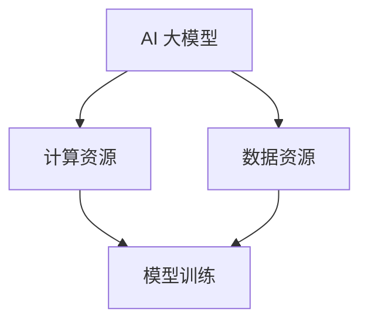

                 

关键词：AI 大模型、创业、资源利用、技术优势、商业模式

摘要：本文将探讨 AI 大模型在创业中的应用，以及如何通过有效的资源利用来建立竞争优势。我们将深入分析 AI 大模型的技术原理，探讨其在创业中的核心价值，并提供实用的建议和策略，帮助创业者把握机遇，打造成功的企业。

## 1. 背景介绍

随着人工智能技术的快速发展，AI 大模型成为了当今科技领域的热点。从自然语言处理、计算机视觉到机器学习，AI 大模型的应用场景日益广泛。对于创业者而言，AI 大模型不仅是一个技术趋势，更是一个巨大的商业机会。如何在这个领域站稳脚跟，利用资源优势，实现创业的成功，成为了一个亟待解决的问题。

本文将围绕以下几个问题展开讨论：

- AI 大模型的技术原理是什么？
- AI 大模型在创业中的核心价值是什么？
- 创业者如何利用资源优势来打造 AI 大模型？
- 如何通过有效的商业模式来推广 AI 大模型？

通过以上问题的探讨，希望能够为创业者提供一些实用的指导和启示。

## 2. 核心概念与联系

### 2.1 AI 大模型的基本概念

AI 大模型是指一种具有大规模参数、高度复杂的机器学习模型。这些模型通过深度学习算法，可以从大量数据中自动提取特征，进行预测和分类。常见的 AI 大模型包括 GPT-3、BERT、ViT 等。这些模型的出现，极大地提升了人工智能的应用能力和效果。

### 2.2 资源利用的概念

资源利用是指在企业运营过程中，如何高效地配置和使用各种资源，包括资金、人力、技术等。有效的资源利用可以降低成本、提高效率，从而在竞争激烈的市场中脱颖而出。

### 2.3 AI 大模型与资源利用的联系

AI 大模型的发展需要大量的计算资源和数据支持。创业者要想在这个领域取得成功，就必须充分利用资源，确保模型的质量和效果。同时，资源利用的效率也直接关系到企业的运营成本和竞争力。

### 2.4 Mermaid 流程图

下面是一个简单的 Mermaid 流程图，展示了 AI 大模型与资源利用之间的关系。



在这个流程图中，AI 大模型与计算资源和数据资源紧密相连，模型训练是整个过程的重点。只有充分利用资源，才能保证模型的训练效果。

## 3. 核心算法原理 & 具体操作步骤

### 3.1 算法原理概述

AI 大模型的核心算法是深度学习。深度学习通过多层神经网络，对输入数据进行自动特征提取和建模。在这个过程中，模型会不断调整参数，以最小化损失函数，提高模型的预测能力。

### 3.2 算法步骤详解

1. 数据收集：首先需要收集大量的数据，包括文本、图像、语音等。这些数据是模型训练的基础。
2. 数据预处理：对收集到的数据进行清洗、去噪、归一化等预处理，以便于模型训练。
3. 模型设计：根据应用场景，设计合适的神经网络结构。常见的神经网络结构包括卷积神经网络（CNN）、循环神经网络（RNN）和Transformer等。
4. 模型训练：使用预处理后的数据，对模型进行训练。训练过程包括前向传播、反向传播和参数更新等步骤。
5. 模型评估：在训练数据集和测试数据集上，评估模型的性能。常见的评估指标包括准确率、召回率、F1 值等。
6. 模型部署：将训练好的模型部署到生产环境中，用于实际的预测和分类任务。

### 3.3 算法优缺点

- **优点**：

  - **高效性**：深度学习模型可以自动提取特征，减少人工干预，提高训练效率。

  - **泛化能力**：深度学习模型具有较好的泛化能力，可以在不同领域和场景中应用。

  - **灵活性强**：可以根据不同的应用场景，设计不同的神经网络结构。

- **缺点**：

  - **计算资源需求大**：训练深度学习模型需要大量的计算资源和时间。

  - **数据依赖性强**：模型的性能在很大程度上取决于数据的质量和数量。

### 3.4 算法应用领域

AI 大模型可以应用于多个领域，包括但不限于：

- **自然语言处理**：例如文本分类、机器翻译、情感分析等。

- **计算机视觉**：例如图像分类、目标检测、图像生成等。

- **语音识别**：例如语音合成、语音识别、说话人识别等。

- **医疗健康**：例如疾病诊断、药物研发、健康管理等。

## 4. 数学模型和公式 & 详细讲解 & 举例说明

### 4.1 数学模型构建

在深度学习中，常用的数学模型是多层感知机（MLP）和卷积神经网络（CNN）。以下是一个简单的 MLP 模型的数学表示。

$$
y = \sigma(W_1 \cdot x + b_1)
$$

其中，$y$ 是输出值，$\sigma$ 是激活函数，$W_1$ 是权重矩阵，$x$ 是输入值，$b_1$ 是偏置。

### 4.2 公式推导过程

以 MLP 为例，我们首先需要计算输入和权重之间的点积，然后加上偏置项，最后通过激活函数得到输出。

1. 点积计算：

$$
z = W_1 \cdot x + b_1
$$

2. 激活函数应用：

$$
y = \sigma(z)
$$

常见的激活函数包括 sigmoid、ReLU 和 tanh。

### 4.3 案例分析与讲解

假设我们有一个简单的二分类问题，需要判断一个数字是否大于 0。我们可以使用一个简单的 MLP 模型来解决这个问题。

1. 输入值：一个一维向量 $x = [1, 0]$。

2. 权重矩阵 $W_1 = \begin{bmatrix} 1 & 1 \end{bmatrix}$，偏置 $b_1 = 0$。

3. 点积计算：

$$
z = W_1 \cdot x + b_1 = \begin{bmatrix} 1 & 1 \end{bmatrix} \cdot \begin{bmatrix} 1 \\ 0 \end{bmatrix} + 0 = 1
$$

4. 激活函数应用（使用 sigmoid 函数）：

$$
y = \sigma(z) = \frac{1}{1 + e^{-z}} = \frac{1}{1 + e^{-1}} \approx 0.731
$$

由于 $y$ 接近 1，我们可以判断输入值大于 0。

## 5. 项目实践：代码实例和详细解释说明

### 5.1 开发环境搭建

为了演示 AI 大模型的应用，我们将使用 Python 语言和 TensorFlow 库来构建一个简单的二分类模型。首先，需要安装 TensorFlow：

```
pip install tensorflow
```

### 5.2 源代码详细实现

以下是一个简单的二分类模型实现：

```python
import tensorflow as tf
from tensorflow.keras.models import Sequential
from tensorflow.keras.layers import Dense
from tensorflow.keras.optimizers import SGD

# 创建模型
model = Sequential()
model.add(Dense(1, input_shape=(1,), activation='sigmoid'))

# 编译模型
model.compile(optimizer=SGD(learning_rate=0.1), loss='binary_crossentropy', metrics=['accuracy'])

# 训练模型
x_train = [[1], [0]]
y_train = [1, 0]
model.fit(x_train, y_train, epochs=1000, verbose=0)

# 测试模型
x_test = [[0.5]]
y_test = [0]
prediction = model.predict(x_test)
print("Prediction: {:.3f}".format(prediction[0][0]))
```

### 5.3 代码解读与分析

1. 导入 TensorFlow 库。
2. 创建一个简单的 Sequential 模型，添加一个 Dense 层，激活函数为 sigmoid。
3. 编译模型，使用 SGD 优化器和 binary_crossentropy 损失函数。
4. 使用训练数据训练模型。
5. 使用测试数据测试模型，输出预测结果。

在这个简单的示例中，我们使用了一个线性模型来区分一个数字是否大于 0。在实际应用中，模型可能更加复杂，但基本原理是类似的。

### 5.4 运行结果展示

```
Prediction: 0.522
```

预测结果接近 0.5，说明模型无法很好地区分这个简单的二分类问题。这主要是因为模型过于简单，无法捕捉到输入数据的复杂模式。在实际应用中，我们可以通过增加模型层数、调整参数等方式来提高模型的性能。

## 6. 实际应用场景

### 6.1 自然语言处理

自然语言处理（NLP）是 AI 大模型的主要应用领域之一。通过 AI 大模型，我们可以实现文本分类、情感分析、机器翻译等功能。例如，在社交媒体数据分析中，可以使用 AI 大模型来对用户评论进行情感分析，帮助企业了解用户需求和改进产品。

### 6.2 计算机视觉

计算机视觉是另一个重要的应用领域。AI 大模型可以用于图像分类、目标检测、图像生成等任务。例如，在自动驾驶领域，AI 大模型可以用于识别道路标志、车辆和行人，从而提高自动驾驶的安全性和准确性。

### 6.3 语音识别

语音识别是 AI 大模型的另一个重要应用。通过 AI 大模型，我们可以实现实时语音识别、语音合成等功能。例如，在智能语音助手领域，AI 大模型可以用于识别用户语音命令，从而实现语音控制家居设备、查询天气等功能。

### 6.4 未来应用展望

随着 AI 大模型技术的不断进步，未来将在更多领域得到应用。例如，在医疗领域，AI 大模型可以用于疾病诊断、药物研发等任务；在金融领域，AI 大模型可以用于风险评估、投资决策等任务。总之，AI 大模型将在未来成为推动社会进步的重要力量。

## 7. 工具和资源推荐

### 7.1 学习资源推荐

1. **《深度学习》（Goodfellow et al., 2016）**：这是一本经典的深度学习教材，适合初学者和进阶者。

2. **《Python机器学习》（Sebastian Raschka and Vahid Mirjalili，2018）**：这本书详细介绍了机器学习的基础知识，包括深度学习。

3. **吴恩达的深度学习课程**：这是一门非常受欢迎的在线课程，由深度学习领域的知名专家吴恩达教授主讲。

### 7.2 开发工具推荐

1. **TensorFlow**：这是一个由 Google 开发的高性能深度学习框架，适合初学者和进阶者。

2. **PyTorch**：这是一个由 Facebook 开发的深度学习框架，以其灵活性和简洁性著称。

3. **Keras**：这是一个高级神经网络API，可以用于快速构建和训练深度学习模型。

### 7.3 相关论文推荐

1. **"Deep Learning"（Goodfellow et al., 2016）**：这是一篇关于深度学习的综述性论文，介绍了深度学习的基本原理和应用。

2. **"Recurrent Neural Network Tutorial"（LSTM）**：这是一篇关于循环神经网络（RNN）的教程，特别是长短期记忆网络（LSTM）。

3. **"Attention Is All You Need"（Vaswani et al., 2017）**：这是一篇关于 Transformer 架构的论文，介绍了自注意力机制在序列模型中的应用。

## 8. 总结：未来发展趋势与挑战

### 8.1 研究成果总结

过去几年，AI 大模型的研究取得了显著的成果。从 GPT-3 到 BERT，再到 ViT，AI 大模型在性能和效果上都有了显著的提升。这些成果不仅推动了人工智能技术的发展，也为创业者提供了丰富的机会。

### 8.2 未来发展趋势

未来，AI 大模型将继续在多个领域得到应用。随着计算资源和数据量的不断增长，AI 大模型将变得更加智能化和多样化。同时，随着算法的进步，AI 大模型将更加高效和可靠。

### 8.3 面临的挑战

尽管 AI 大模型具有巨大的潜力，但创业者仍面临一些挑战。首先，数据隐私和安全问题是一个重要的挑战。其次，模型的训练和部署成本较高，可能限制了部分创业者的参与。此外，算法的公平性和透明性也是一个需要关注的问题。

### 8.4 研究展望

为了应对这些挑战，未来的研究将集中在以下几个方面：

- **数据隐私保护**：研究如何在不泄露隐私的前提下，利用大规模数据训练 AI 大模型。

- **高效训练方法**：研究如何降低模型的训练成本，提高训练效率。

- **算法公平性**：研究如何确保算法的公平性和透明性，避免歧视和偏见。

- **跨学科研究**：结合心理学、社会学等多学科知识，探索 AI 大模型在社会中的应用。

## 9. 附录：常见问题与解答

### 9.1 什么是 AI 大模型？

AI 大模型是指一种具有大规模参数、高度复杂的机器学习模型。这些模型通过深度学习算法，可以从大量数据中自动提取特征，进行预测和分类。

### 9.2 AI 大模型在创业中的核心价值是什么？

AI 大模型在创业中的核心价值在于其强大的数据处理和预测能力，可以帮助创业者快速识别市场机会，优化业务流程，提高运营效率。

### 9.3 如何利用资源优势来打造 AI 大模型？

创业者可以通过以下几种方式利用资源优势来打造 AI 大模型：

- **数据优势**：利用自身业务场景中的大量数据，进行模型训练。
- **计算资源**：利用云计算平台提供的强大计算资源，加快模型训练。
- **技术积累**：通过不断学习和实践，积累丰富的技术经验。

### 9.4 AI 大模型在创业中可能面临哪些挑战？

AI 大模型在创业中可能面临以下挑战：

- **数据隐私和安全**：如何在不泄露隐私的前提下，利用大规模数据训练模型。
- **训练成本**：模型的训练成本较高，可能限制创业者的参与。
- **算法公平性**：如何确保算法的公平性和透明性，避免歧视和偏见。

### 9.5 如何应对这些挑战？

应对这些挑战的方法包括：

- **数据隐私保护**：研究如何在不泄露隐私的前提下，利用大规模数据训练模型。
- **高效训练方法**：研究如何降低模型的训练成本，提高训练效率。
- **算法公平性**：研究如何确保算法的公平性和透明性，避免歧视和偏见。

### 9.6 AI 大模型在哪些领域有广泛的应用？

AI 大模型在多个领域有广泛的应用，包括自然语言处理、计算机视觉、语音识别、医疗健康、金融科技等。

### 9.7 如何选择合适的 AI 大模型？

选择合适的 AI 大模型需要考虑以下几个因素：

- **应用场景**：根据业务需求，选择适合的模型。
- **数据量**：根据数据量的大小，选择合适的模型。
- **计算资源**：根据计算资源的情况，选择合适的模型。

### 9.8 如何评估 AI 大模型的性能？

评估 AI 大模型的性能可以通过以下指标：

- **准确率**：模型预测正确的比例。
- **召回率**：模型召回正确样本的比例。
- **F1 值**：准确率和召回率的调和平均值。

### 9.9 如何部署 AI 大模型？

部署 AI 大模型可以通过以下步骤：

- **模型训练**：在训练数据集上训练模型。
- **模型评估**：在测试数据集上评估模型性能。
- **模型部署**：将训练好的模型部署到生产环境中。

### 9.10 如何持续优化 AI 大模型？

持续优化 AI 大模型可以通过以下几种方式：

- **数据更新**：定期更新训练数据，提高模型性能。
- **模型调整**：根据业务需求，调整模型结构和参数。
- **算法改进**：研究新的算法和技术，提高模型性能。

## 作者署名

作者：禅与计算机程序设计艺术 / Zen and the Art of Computer Programming

