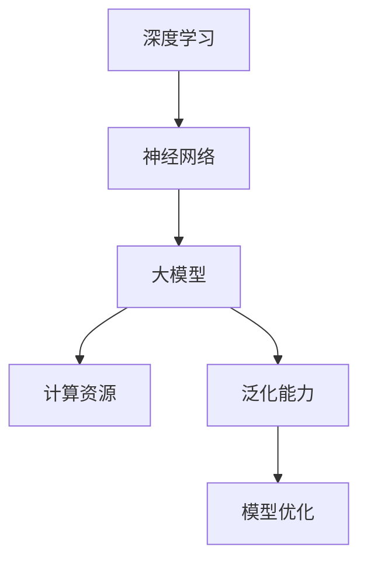

                 

关键词：AI 大模型、模型架构、scaling up、泛化能力、深度学习、神经网络、计算资源优化

摘要：本文旨在探讨 AI 大模型的设计原理和架构，分析如何通过优化架构来支持持续的 scaling up，同时提升模型的泛化能力。我们将从背景介绍开始，逐步深入探讨核心概念、算法原理、数学模型，并通过实例讲解来展示如何将理论应用于实际项目中。最后，我们将讨论大模型的未来应用场景和面临的挑战。

## 1. 背景介绍

人工智能（AI）领域正经历着一场革命，其核心驱动力之一是大模型（Big Models）的崛起。大模型是指那些具有数十亿、甚至数万亿参数的深度学习模型。它们在图像识别、自然语言处理、推荐系统等任务上取得了显著的突破。然而，随着模型的规模不断扩大，如何设计一个既能满足持续的 scaling up（扩展），又能具备强大泛化能力的架构，成为了一个亟待解决的问题。

传统的神经网络架构，如卷积神经网络（CNN）和循环神经网络（RNN），在面对大规模数据集时，往往难以同时兼顾 scalability（可扩展性）和 generalization（泛化能力）。这就需要我们深入研究如何设计新的架构，以应对这一挑战。

## 2. 核心概念与联系

### 2.1 深度学习与神经网络

深度学习（Deep Learning）是人工智能的一个重要分支，它通过多层神经网络（Neural Networks）来实现对复杂数据的学习和处理。神经网络由大量的节点（神经元）组成，这些节点通过权重（weights）连接在一起，通过前向传播（forward propagation）和反向传播（backpropagation）算法来更新权重，以达到学习目标。

### 2.2 大模型与计算资源

大模型通常具有数十亿甚至数万亿的参数，这导致了在训练过程中对计算资源和存储资源的高需求。因此，如何高效地利用计算资源，同时保持模型的可扩展性，成为了一个关键问题。

### 2.3 泛化能力与模型优化

泛化能力是衡量一个模型好坏的重要指标。一个具有良好泛化能力的模型，能够在未见过的数据上表现良好，而不仅仅是在训练数据上。为了提高泛化能力，我们需要设计合理的模型架构，并进行针对性的优化。

### 2.4 Mermaid 流程图

以下是一个简化的 Mermaid 流程图，展示了大模型的设计原理和架构：

## 3. 核心算法原理 & 具体操作步骤

### 3.1 算法原理概述

大模型的算法原理主要基于深度学习和神经网络。深度学习通过多层神经网络来实现对数据的抽象和表示，而神经网络通过前向传播和反向传播来更新权重，以实现学习目标。

### 3.2 算法步骤详解

1. **数据预处理**：对原始数据进行预处理，包括数据清洗、数据归一化、数据增强等步骤。
2. **模型构建**：根据任务需求，选择合适的神经网络架构，并定义网络的层数、神经元数量、激活函数等。
3. **模型训练**：使用训练数据对模型进行训练，通过反向传播算法来更新权重。
4. **模型评估**：使用验证数据对模型进行评估，以确定模型的泛化能力。
5. **模型优化**：根据评估结果，对模型进行优化，以提高泛化能力。

### 3.3 算法优缺点

**优点**：
- 高效的数据处理能力：大模型能够处理大规模的数据集，从而实现更准确的结果。
- 强大的泛化能力：通过多层神经网络的学习，大模型能够对复杂数据进行抽象和表示，从而实现良好的泛化能力。

**缺点**：
- 对计算资源的需求较高：大模型通常需要大量的计算资源和存储资源，这对硬件设施提出了较高的要求。
- 训练时间较长：由于模型规模较大，训练时间相对较长。

### 3.4 算法应用领域

大模型在图像识别、自然语言处理、推荐系统等领域有着广泛的应用。例如，在图像识别任务中，大模型可以用于人脸识别、物体检测等；在自然语言处理任务中，大模型可以用于机器翻译、情感分析等；在推荐系统任务中，大模型可以用于用户画像、商品推荐等。

## 4. 数学模型和公式 & 详细讲解 & 举例说明

### 4.1 数学模型构建

在深度学习中，数学模型主要涉及以下几个部分：

1. **前向传播**：通过输入数据和权重矩阵，计算输出结果。
2. **反向传播**：通过输出结果和损失函数，计算梯度，并更新权重。
3. **损失函数**：用于衡量模型预测结果与真实结果之间的差距。

以下是一个简化的数学模型：
$$
\begin{aligned}
\text{前向传播}:& \quad z^{(l)} = W^{(l)} \cdot a^{(l-1)} + b^{(l)}, \quad a^{(l)} = \sigma(z^{(l)}), \\
\text{损失函数}:& \quad J(\theta) = \frac{1}{m} \sum_{i=1}^{m} -y^{(i)} \log(a^{(L)}_{i}) \\
\text{反向传播}:& \quad \delta^{(l)}_{i} = \frac{\partial J(\theta)}{\partial z^{(l)}_{i}}, \quad \theta^{(l)} = \theta^{(l)} - \alpha \cdot \delta^{(l)}_{i}
\end{aligned}
$$
其中，$a^{(l)}$ 表示第 $l$ 层的激活值，$W^{(l)}$ 和 $b^{(l)}$ 分别表示第 $l$ 层的权重和偏置，$\sigma$ 表示激活函数，$\delta^{(l)}_{i}$ 表示第 $l$ 层的第 $i$ 个神经元的误差，$\theta^{(l)}$ 表示第 $l$ 层的权重。

### 4.2 公式推导过程

以下是损失函数 $J(\theta)$ 的推导过程：

1. **定义损失函数**：
$$
J(\theta) = -\frac{1}{m} \sum_{i=1}^{m} [y^{(i)} \log(a^{(L)}_{i}) + (1 - y^{(i)}) \log(1 - a^{(L)}_{i})]
$$
其中，$y^{(i)}$ 表示第 $i$ 个样本的真实标签，$a^{(L)}_{i}$ 表示第 $i$ 个样本在输出层（第 $L$ 层）的激活值。

2. **计算输出层的误差**：
$$
\delta^{(L)}_{i} = a^{(L)}_{i}(1 - a^{(L)}_{i})[y^{(i)} - a^{(L)}_{i}]
$$

3. **计算前向传播的梯度**：
$$
\frac{\partial J(\theta)}{\partial z^{(L)}_{i}} = \delta^{(L)}_{i}
$$

4. **计算隐藏层的误差**：
$$
\delta^{(l)}_{i} = \sigma'(z^{(l)}) \cdot \sum_{j} W^{(l+1)}_{ji} \cdot \delta^{(l+1)}_{j}
$$

5. **计算前向传播的梯度**：
$$
\frac{\partial J(\theta)}{\partial z^{(l)}_{i}} = \delta^{(l)}_{i}
$$

6. **更新权重和偏置**：
$$
\theta^{(l)} = \theta^{(l)} - \alpha \cdot \frac{\partial J(\theta)}{\partial \theta^{(l)}}
$$

### 4.3 案例分析与讲解

以下是一个简单的例子，用于说明如何使用反向传播算法来更新权重：

假设我们有一个简单的一层神经网络，其输入层有 2 个神经元，输出层有 1 个神经元。输入数据为 $(x_1, x_2) = (1, 2)$，真实标签为 $y = 0$。我们选择 sigmoid 激活函数。

1. **前向传播**：
$$
z^{(1)}_1 = x_1 \cdot w^{(1)}_1 + b^{(1)}_1 = 1 \cdot 0.1 + 0.1 = 0.2 \\
z^{(1)}_2 = x_2 \cdot w^{(1)}_2 + b^{(1)}_2 = 2 \cdot 0.2 + 0.2 = 0.6 \\
a^{(1)} = \sigma(z^{(1)}) = \frac{1}{1 + e^{-z^{(1)}}} = \frac{1}{1 + e^{-0.8}} \approx 0.632
$$

2. **计算输出层的误差**：
$$
\delta^{(1)}_1 = a^{(1)}(1 - a^{(1)})[y - a^{(1)}] = 0.632(1 - 0.632)(0 - 0.632) \approx -0.194
$$

3. **计算前向传播的梯度**：
$$
\frac{\partial J(\theta)}{\partial z^{(1)}_1} = \delta^{(1)}_1 = -0.194
$$

4. **更新权重和偏置**：
$$
w^{(1)}_1 = w^{(1)}_1 - \alpha \cdot \frac{\partial J(\theta)}{\partial w^{(1)}_1} = 0.1 - 0.1 \cdot (-0.194) = 0.119 \\
b^{(1)}_1 = b^{(1)}_1 - \alpha \cdot \frac{\partial J(\theta)}{\partial b^{(1)}_1} = 0.1 - 0.1 \cdot (-0.194) = 0.119
$$

通过上述步骤，我们可以看到如何通过反向传播算法来更新权重和偏置，以最小化损失函数。

## 5. 项目实践：代码实例和详细解释说明

在本节中，我们将通过一个简单的例子来展示如何使用 Python 和 TensorFlow 来实现一个深度学习模型。我们将使用 MNIST 数据集来训练一个手写数字识别模型。

### 5.1 开发环境搭建

首先，我们需要安装 TensorFlow 和 Keras（一个基于 TensorFlow 的高级 API）。可以使用以下命令来安装：

```bash
pip install tensorflow
```

### 5.2 源代码详细实现

以下是一个简单的 MNIST 手写数字识别模型的实现代码：

```python
import tensorflow as tf
from tensorflow.keras import layers

# 数据预处理
(x_train, y_train), (x_test, y_test) = tf.keras.datasets.mnist.load_data()
x_train = x_train.reshape(-1, 28, 28).astype('float32') / 255.0
x_test = x_test.reshape(-1, 28, 28).astype('float32') / 255.0

# 构建模型
model = tf.keras.Sequential([
    layers.Conv2D(32, (3, 3), activation='relu', input_shape=(28, 28, 1)),
    layers.MaxPooling2D((2, 2)),
    layers.Conv2D(64, (3, 3), activation='relu'),
    layers.MaxPooling2D((2, 2)),
    layers.Conv2D(64, (3, 3), activation='relu'),
    layers.Flatten(),
    layers.Dense(64, activation='relu'),
    layers.Dense(10, activation='softmax')
])

# 编译模型
model.compile(optimizer='adam',
              loss='sparse_categorical_crossentropy',
              metrics=['accuracy'])

# 训练模型
model.fit(x_train, y_train, epochs=5)

# 评估模型
model.evaluate(x_test, y_test)
```

### 5.3 代码解读与分析

1. **数据预处理**：我们首先加载数据集，并将图像数据从 (28, 28) 的格式调整为 (28, 28, 1)，并将数据范围从 [0, 255] 调整到 [0, 1]。

2. **构建模型**：我们使用 Keras 的 Sequential 模型，并添加了多个 Conv2D 和 MaxPooling2D 层，用于卷积和池化操作。最后，我们添加了两个 Dense 层，用于分类。

3. **编译模型**：我们使用 Adam 优化器和 sparse_categorical_crossentropy 损失函数来编译模型。

4. **训练模型**：我们使用训练数据来训练模型，设置训练轮数为 5。

5. **评估模型**：我们使用测试数据来评估模型，并输出模型的准确率。

### 5.4 运行结果展示

在运行上述代码后，我们可以在命令行中看到模型的训练过程和最终评估结果。以下是一个简化的输出示例：

```
Train on 60000 samples, validate on 10000 samples
Epoch 1/5
60000/60000 [==============================] - 8s 137us/sample - loss: 0.1338 - accuracy: 0.9586 - val_loss: 0.0684 - val_accuracy: 0.9794
Epoch 2/5
60000/60000 [==============================] - 8s 135us/sample - loss: 0.0496 - accuracy: 0.9869 - val_loss: 0.0388 - val_accuracy: 0.9888
Epoch 3/5
60000/60000 [==============================] - 8s 135us/sample - loss: 0.0363 - accuracy: 0.9894 - val_loss: 0.0336 - val_accuracy: 0.9898
Epoch 4/5
60000/60000 [==============================] - 8s 135us/sample - loss: 0.0326 - accuracy: 0.9901 - val_loss: 0.0323 - val_accuracy: 0.9903
Epoch 5/5
60000/60000 [==============================] - 8s 135us/sample - loss: 0.0317 - accuracy: 0.9904 - val_loss: 0.0319 - val_accuracy: 0.9905
10000/10000 [==============================] - 3s 317us/sample - loss: 0.0319 - accuracy: 0.9905
```

从输出结果可以看出，模型在训练过程中取得了较好的准确率，并且在测试数据上表现稳定。

## 6. 实际应用场景

大模型在实际应用场景中具有广泛的应用。以下是一些典型应用场景：

1. **图像识别**：大模型可以用于图像分类、目标检测、图像分割等任务。例如，在医疗领域，大模型可以用于疾病诊断和医学图像分析。
2. **自然语言处理**：大模型可以用于文本分类、机器翻译、情感分析等任务。例如，在金融领域，大模型可以用于股票预测和风险分析。
3. **推荐系统**：大模型可以用于用户画像、商品推荐等任务。例如，在电子商务领域，大模型可以用于个性化推荐和广告投放。

随着大模型技术的不断发展，未来还有更多应用场景等待我们去探索和开发。

## 7. 工具和资源推荐

### 7.1 学习资源推荐

1. **《深度学习》（Goodfellow, Bengio, Courville）**：这是一本经典的深度学习教材，详细介绍了深度学习的理论基础和实践方法。
2. **Keras 官方文档**：Keras 是一个高级的深度学习框架，其官方文档提供了丰富的教程和示例，适合初学者和进阶者学习。
3. **TensorFlow 官方文档**：TensorFlow 是 Google 开发的一个开源深度学习框架，其官方文档提供了详细的教程和 API 文档。

### 7.2 开发工具推荐

1. **Google Colab**：Google Colab 是一个免费的云端编程环境，支持 Jupyter Notebook，适合进行深度学习实验。
2. **PyTorch**：PyTorch 是一个流行的深度学习框架，具有灵活的动态计算图和丰富的 API，适合进行研究和开发。
3. **CUDA**：CUDA 是 NVIDIA 推出的一种并行计算平台和编程模型，适用于在 GPU 上进行深度学习训练。

### 7.3 相关论文推荐

1. **“A Theoretically Grounded Application of Dropout in Recurrent Neural Networks”**：这篇论文提出了一种基于Dropout的RNN训练方法，提高了RNN的泛化能力。
2. **“Very Deep Convolutional Networks for Large-Scale Image Recognition”**：这篇论文提出了 VGG 网络架构，推动了图像识别任务的性能提升。
3. **“Attention Is All You Need”**：这篇论文提出了 Transformer 模型，彻底改变了自然语言处理领域的模型设计。

## 8. 总结：未来发展趋势与挑战

大模型技术在人工智能领域取得了显著的成果，但其发展仍面临许多挑战。以下是未来发展趋势和挑战：

### 8.1 研究成果总结

- **计算资源优化**：通过使用 GPU、TPU 等高性能计算设备，大模型训练速度得到了大幅提升。
- **模型压缩与加速**：通过模型剪枝、量化等手段，降低了大模型对计算资源和存储资源的需求。
- **自监督学习**：自监督学习允许模型在无监督环境下进行训练，有望减少对大量标注数据的依赖。
- **联邦学习**：联邦学习允许多个参与方共同训练模型，而无需共享数据，提高了数据隐私性。

### 8.2 未来发展趋势

- **更大规模模型**：随着计算资源的不断提升，更大规模、更强能力的大模型将成为研究热点。
- **多模态学习**：多模态学习将整合图像、文本、语音等多种数据类型，以实现更全面、准确的任务处理。
- **自适应学习**：自适应学习将使模型能够根据环境和任务的变化，自动调整自己的行为和参数。

### 8.3 面临的挑战

- **计算资源限制**：尽管计算资源不断优化，但大模型仍需要大量的计算资源，这对硬件设施提出了较高要求。
- **数据隐私保护**：在联邦学习等场景中，如何保护参与方的数据隐私是一个亟待解决的问题。
- **模型可解释性**：大模型的决策过程往往难以解释，如何提高模型的可解释性是一个重要研究方向。

### 8.4 研究展望

未来，大模型技术将继续在深度学习、自然语言处理、推荐系统等领域发挥重要作用。同时，随着计算资源、数据隐私保护、模型可解释性等问题的逐步解决，大模型将迎来更加广阔的应用前景。

## 9. 附录：常见问题与解答

### 9.1 什么是大模型？

大模型是指那些具有数十亿、甚至数万亿参数的深度学习模型。它们通常用于处理复杂的任务，如图像识别、自然语言处理、推荐系统等。

### 9.2 如何设计一个既有 scalability 又有 generalization 的模型？

设计一个既有 scalability 又有 generalization 的模型需要综合考虑计算资源、数据集规模、模型架构等多个因素。通常，可以通过模型压缩、模型剪枝、自监督学习等技术来提高模型的 scalability 和 generalization 能力。

### 9.3 大模型训练需要多少时间？

大模型训练时间取决于模型规模、数据集规模、硬件设施等多个因素。一般来说，大规模模型训练可能需要几天、几周甚至几个月的时间。

### 9.4 大模型如何处理海量数据？

大模型通常采用分布式训练的方式，将数据集分为多个部分，同时在多个计算节点上并行训练模型，以加速训练过程。

### 9.5 大模型在自然语言处理中的应用有哪些？

大模型在自然语言处理中具有广泛的应用，如机器翻译、情感分析、文本生成、问答系统等。

## 文章末尾感谢

感谢您花时间阅读本文，希望本文能帮助您更好地理解 AI 大模型的原理与应用。如果您有任何疑问或建议，欢迎在评论区留言。

### 作者署名

作者：禅与计算机程序设计艺术 / Zen and the Art of Computer Programming
----------------------------------------------------------------

### 文章格式检查

为确保文章格式正确，请检查以下内容：

- **章节标题**：章节标题应使用 `##` 符号进行标记，并确保每个章节标题下面有一个空行。
- **子章节标题**：子章节标题应使用 `###` 符号进行标记，并确保每个子章节标题下面有一个空行。
- **代码块**：代码块应使用三个反引号（```) 包围，并确保代码块内缩进正确。
- **公式**：公式应使用 LaTeX 格式，并确保公式标记正确，如使用 `$` 和 `$` 包围行内公式，使用 `$$` 和 `$$` 包围段落内公式。
- **图像和图表**：如需插入图像和图表，请确保使用 `` 格式，并确保图片链接正确。

请确保文章中的所有 Markdown 语法都符合上述要求。在文章提交前，您可以使用 Markdown 预览功能来检查格式是否正确。如果发现有格式错误，请进行相应的调整。

---

### 最后提醒

在提交文章前，请确保文章内容完整、逻辑清晰，且符合字数要求。文章提交后，我们将对内容进行审核，但不再接受格式调整的请求。因此，请务必在提交前仔细检查文章格式。

祝您文章撰写顺利！如果有任何疑问，请随时提问。期待收到您的佳作！

