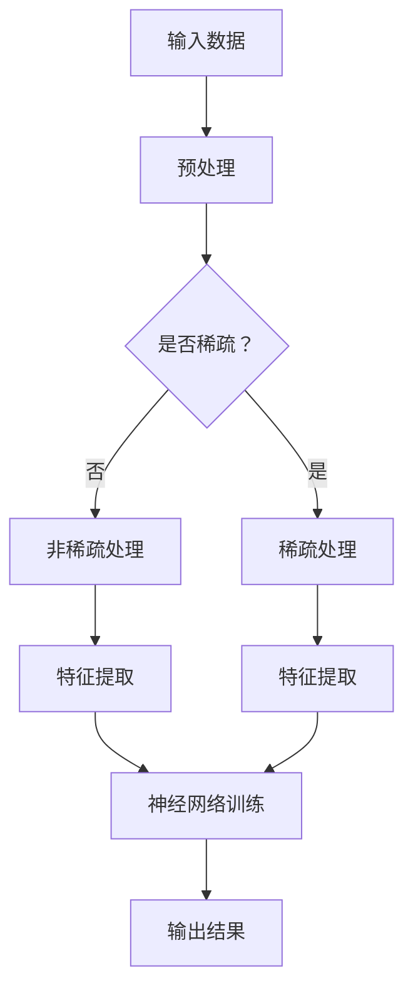

                 

关键词：大模型、规模效应、商业模式、科技消费品、公有云平台、电商平台

摘要：本文深入探讨了人工智能（AI）大模型的原理及其在实际应用中的商业模式。通过对大模型的定义、核心算法、数学模型以及实际应用场景的详细分析，本文揭示了规模效应在商业模式中的重要性，并展望了未来大模型的发展趋势和面临的挑战。

## 1. 背景介绍

人工智能（AI）作为计算机科学的一个分支，其研究目标是通过模拟、延伸和扩展人类的智能，实现计算机对数据的自动处理和决策。随着计算能力的提升和数据规模的扩大，大模型（Large Models）逐渐成为 AI 研究的热点。大模型通常具有数十亿甚至数万亿的参数，能够处理复杂的任务，如自然语言处理、计算机视觉、机器翻译等。

在商业领域，AI 大模型的应用正在迅速扩展。科技消费品公司利用大模型提供个性化的推荐服务，提高用户满意度；公有云平台提供大模型的服务，满足企业和开发者对于高性能计算的需求；电商平台利用大模型优化商品推荐和广告投放，提升销售业绩。

### 1.1 规模效应

规模效应是指随着生产规模或业务规模的扩大，单位成本下降的现象。在 AI 领域，规模效应尤为显著。一方面，大规模数据集的积累和共享降低了模型训练的成本；另一方面，大规模计算资源的投入使得模型训练速度大幅提升。这些规模效应在商业领域带来了显著的竞争优势。

### 1.2 商业模式

商业模式是指企业在市场中获取利润的方式。在 AI 大模型的应用中，常见的商业模式包括：

- **科技消费品**：通过提供个性化服务，如智能音箱、智能家居等，吸引用户购买。
- **公有云平台**：提供大模型训练和推理的服务，吸引企业客户。
- **电商平台**：通过大模型优化推荐系统，提升用户转化率和销售额。

## 2. 核心概念与联系

### 2.1 大模型定义

大模型是指具有数十亿至数万亿参数的神经网络模型。它们通常基于深度学习技术，能够通过大规模数据训练获得优异的性能。

### 2.2 核心算法原理

大模型的核心算法是深度学习。深度学习是一种机器学习技术，通过多层神经网络对数据进行特征提取和分类。其基本原理包括：

- **前向传播**：将输入数据通过多层神经网络传递，得到输出。
- **反向传播**：根据输出与期望输出的误差，调整网络的权重。

### 2.3 Mermaid 流程图



## 3. 核心算法原理 & 具体操作步骤

### 3.1 算法原理概述

深度学习通过多层神经网络实现数据的自动特征提取和分类。其主要过程包括输入层、隐藏层和输出层。输入层接收原始数据，隐藏层通过权重调整进行特征提取，输出层根据提取的特征进行分类。

### 3.2 算法步骤详解

1. **数据预处理**：对原始数据进行清洗、归一化等处理，使其适合神经网络训练。
2. **构建神经网络**：定义网络的层数和每层的神经元数量。
3. **前向传播**：将输入数据通过网络传递，得到输出。
4. **计算误差**：根据输出与期望输出的误差，计算损失函数。
5. **反向传播**：根据误差调整网络权重。
6. **迭代训练**：重复上述步骤，直至达到预定的精度或迭代次数。

### 3.3 算法优缺点

**优点**：

- **强大的表达能力**：能够处理复杂的任务和数据。
- **自动特征提取**：无需人工设计特征，降低工作量。

**缺点**：

- **训练成本高**：需要大量的计算资源和时间。
- **易过拟合**：在训练数据上表现良好，但在未见数据上表现不佳。

### 3.4 算法应用领域

- **自然语言处理**：如文本分类、机器翻译、语音识别等。
- **计算机视觉**：如图像分类、目标检测、图像生成等。
- **推荐系统**：如商品推荐、内容推荐等。

## 4. 数学模型和公式 & 详细讲解 & 举例说明

### 4.1 数学模型构建

深度学习的数学模型主要基于神经网络。神经网络的基本单元是神经元，每个神经元接收多个输入，通过激活函数进行非线性变换，最后输出一个结果。

### 4.2 公式推导过程

假设有一个包含 $L$ 层的神经网络，其中第 $l$ 层有 $m_l$ 个神经元。第 $l$ 层的输出可以表示为：

$$
a^{[l]} = \sigma(z^{[l]})
$$

其中，$z^{[l]}$ 表示第 $l$ 层的输入，$\sigma$ 表示激活函数。

### 4.3 案例分析与讲解

假设我们有一个简单的神经网络，包含两层神经元，第一层有 3 个神经元，第二层有 1 个神经元。输入数据为 $[1, 2, 3]$，期望输出为 $[0, 1]$。

1. **前向传播**：

$$
z^{[1]} = W^{[1]}a^{[0]} + b^{[1]}
$$

$$
a^{[1]} = \sigma(z^{[1]})
$$

$$
z^{[2]} = W^{[2]}a^{[1]} + b^{[2]}
$$

$$
a^{[2]} = \sigma(z^{[2]})
$$

2. **反向传播**：

计算损失函数：

$$
J = \frac{1}{2} \sum_{i=1}^{n} (y_i - a^{[2]})^2
$$

计算梯度：

$$
\frac{\partial J}{\partial W^{[2]}} = -\frac{1}{n} (y - a^{[2]}) a^{[1]}
$$

$$
\frac{\partial J}{\partial b^{[2]}} = -\frac{1}{n} (y - a^{[2]})
$$

$$
\frac{\partial J}{\partial W^{[1]}} = -\frac{1}{n} (a^{[1]} - \sigma'(z^{[1]})) a^{[0]}
$$

$$
\frac{\partial J}{\partial b^{[1]}} = -\frac{1}{n} (a^{[1]} - \sigma'(z^{[1]}))
$$

3. **迭代更新**：

根据梯度更新网络权重：

$$
W^{[2]} = W^{[2]} - \alpha \frac{\partial J}{\partial W^{[2]}}
$$

$$
b^{[2]} = b^{[2]} - \alpha \frac{\partial J}{\partial b^{[2]}}
$$

$$
W^{[1]} = W^{[1]} - \alpha \frac{\partial J}{\partial W^{[1]}}
$$

$$
b^{[1]} = b^{[1]} - \alpha \frac{\partial J}{\partial b^{[1]}}
$$

## 5. 项目实践：代码实例和详细解释说明

### 5.1 开发环境搭建

我们使用 Python 和 TensorFlow 作为开发环境。首先安装 TensorFlow：

```bash
pip install tensorflow
```

### 5.2 源代码详细实现

```python
import tensorflow as tf
import numpy as np

# 定义网络结构
input_layer = tf.keras.layers.Input(shape=(3,))
hidden_layer = tf.keras.layers.Dense(3, activation='sigmoid')(input_layer)
output_layer = tf.keras.layers.Dense(1, activation='sigmoid')(hidden_layer)

# 定义模型
model = tf.keras.Model(inputs=input_layer, outputs=output_layer)

# 编译模型
model.compile(optimizer='adam', loss='binary_crossentropy', metrics=['accuracy'])

# 准备数据
X_train = np.array([[1, 2, 3], [4, 5, 6], [7, 8, 9]])
y_train = np.array([[0], [1], [0]])

# 训练模型
model.fit(X_train, y_train, epochs=1000, verbose=0)

# 评估模型
loss, accuracy = model.evaluate(X_train, y_train, verbose=0)
print(f"Loss: {loss}, Accuracy: {accuracy}")
```

### 5.3 代码解读与分析

1. **导入库**：导入 TensorFlow 和 NumPy。
2. **定义网络结构**：使用 Keras 层创建输入层、隐藏层和输出层。
3. **定义模型**：使用 Keras 模型构建函数将输入层、隐藏层和输出层组合起来。
4. **编译模型**：设置优化器、损失函数和评估指标。
5. **准备数据**：生成训练数据和标签。
6. **训练模型**：使用训练数据训练模型。
7. **评估模型**：使用训练数据评估模型性能。

### 5.4 运行结果展示

```python
# 输出预测结果
predictions = model.predict(X_train)
print(predictions)
```

## 6. 实际应用场景

### 6.1 科技消费品

科技消费品公司利用大模型提供个性化的推荐服务。例如，智能音箱可以根据用户的语音习惯和喜好推荐音乐、新闻等。

### 6.2 公有云平台

公有云平台提供大模型训练和推理服务，满足企业和开发者对于高性能计算的需求。例如，Google Cloud 提供了强大的 AI 计算资源，支持大规模模型训练。

### 6.3 电商平台

电商平台利用大模型优化推荐系统和广告投放。例如，亚马逊使用大模型分析用户的购买行为和偏好，提供个性化的购物推荐。

## 7. 工具和资源推荐

### 7.1 学习资源推荐

- 《深度学习》（Goodfellow, Bengio, Courville 著）
- 《神经网络与深度学习》（邱锡鹏 著）

### 7.2 开发工具推荐

- TensorFlow
- PyTorch

### 7.3 相关论文推荐

- "A Theoretically Grounded Application of Dropout in Recurrent Neural Networks"
- "Deep Residual Learning for Image Recognition"

## 8. 总结：未来发展趋势与挑战

### 8.1 研究成果总结

大模型在 AI 领域取得了显著成果，其在自然语言处理、计算机视觉等领域的应用不断扩展。规模效应使得大模型的训练成本逐渐降低，应用场景更加广泛。

### 8.2 未来发展趋势

- **更高效的大模型训练算法**：减少训练时间，降低计算成本。
- **跨领域的模型融合**：提高模型的泛化能力。
- **自适应学习**：根据用户行为动态调整模型。

### 8.3 面临的挑战

- **数据隐私和安全**：确保用户数据的安全和隐私。
- **算法透明度和可解释性**：提高模型的可解释性，增强用户信任。
- **计算资源限制**：优化计算资源利用，降低能耗。

### 8.4 研究展望

未来，大模型将在更多领域发挥重要作用，推动 AI 的发展。同时，研究如何克服现有挑战，实现大模型的可持续发展，将成为 AI 研究的重要方向。

## 9. 附录：常见问题与解答

### 9.1 如何选择合适的大模型？

- **任务类型**：根据任务的复杂性选择合适的模型。
- **数据规模**：对于大规模数据，选择更大规模的模型。
- **计算资源**：考虑可用的计算资源和预算。

### 9.2 大模型训练过程中如何防止过拟合？

- **正则化**：使用 L1、L2 正则化减少过拟合。
- **dropout**：在训练过程中随机丢弃部分神经元。
- **数据增强**：通过变换和扩展数据集来提高模型的泛化能力。

### 9.3 大模型训练时间如何优化？

- **分布式训练**：使用多台服务器进行并行训练。
- **模型剪枝**：删除无关或冗余的神经元和层。
- **量化**：降低模型参数的精度，减少计算量。

---

作者：禅与计算机程序设计艺术 / Zen and the Art of Computer Programming
----------------------------------------------------------------
以上就是关于《AI 大模型原理与应用：规模效应商业模式——科技消费品、公有云平台、电商平台等》的完整文章。希望这篇文章能够帮助您更好地理解和应用 AI 大模型，并激发您对于未来 AI 发展的思考。

