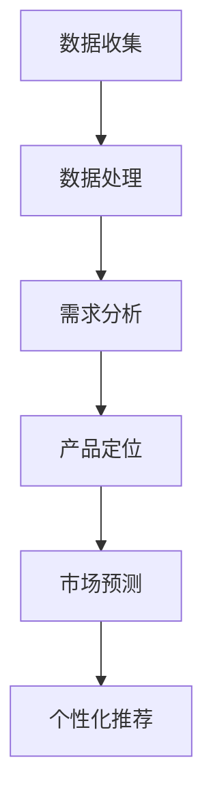

                 

关键词：AI 大模型、创业产品定位、创新策略、机器学习、数据驱动、商业智能

摘要：本文将探讨人工智能大模型在创业产品定位中的应用策略，通过分析大模型的核心概念和联系，深入剖析其算法原理、数学模型以及实际应用案例，从而为创业者提供一种新的产品定位思维和方法。

## 1. 背景介绍

在当今数字经济时代，创业市场竞争日益激烈，产品定位成为企业成功的关键。传统的产品定位方法主要依赖于市场调研和用户反馈，这种方式虽然在一定程度上能够帮助企业了解市场需求，但往往存在滞后性和主观性。随着人工智能技术的飞速发展，特别是大模型的广泛应用，创业者有了新的工具和手段来更精准、高效地定位产品。

AI 大模型，如 GPT-3、BERT、Transformer 等，具有强大的数据处理和分析能力，能够从海量数据中提取有价值的信息。这些模型不仅能够帮助创业者了解用户需求、市场趋势，还能够预测未来发展方向，从而为产品创新提供有力的支持。

## 2. 核心概念与联系

### 2.1 大模型概述

大模型是指那些参数数量巨大、结构复杂的神经网络模型，它们能够通过大量的数据训练来学习复杂的规律和模式。例如，GPT-3 拥有 1750 亿个参数，BERT 的参数量也达到了数十亿级别。这些模型在语言处理、图像识别、语音识别等领域都取得了显著的成果。

### 2.2 大模型与创业产品定位的关系

大模型在创业产品定位中的应用主要体现在以下几个方面：

- **数据收集与处理**：大模型能够处理海量数据，从用户行为、市场趋势等多方面收集信息，为产品定位提供数据支持。
- **需求分析**：通过对用户数据的分析，大模型可以识别用户需求，从而帮助企业更好地理解市场需求。
- **趋势预测**：大模型能够捕捉市场趋势，为产品创新提供方向。
- **个性化推荐**：基于用户数据和偏好，大模型能够实现个性化推荐，提高产品的市场竞争力。

### 2.3 Mermaid 流程图



## 3. 核心算法原理 & 具体操作步骤

### 3.1 算法原理概述

AI 大模型的核心算法是基于深度学习的神经网络模型。这些模型通过多层神经网络对数据进行层层抽象和特征提取，从而实现复杂任务的自动完成。例如，GPT-3 使用的是 Transformer 架构，BERT 则是基于 Transformer 的改进模型。

### 3.2 算法步骤详解

- **数据收集**：从各种渠道收集用户数据，如社交媒体、用户评论、搜索日志等。
- **数据处理**：对收集到的数据进行清洗、预处理，使其符合模型的输入要求。
- **模型训练**：使用预处理后的数据对神经网络模型进行训练，调整模型参数，使其能够准确地预测用户需求和趋势。
- **模型评估**：通过测试数据对模型进行评估，确保模型具有良好的性能和可靠性。
- **产品定位**：根据模型预测的结果，制定产品定位策略，优化产品设计和服务。
- **市场预测**：利用模型捕捉市场趋势，为企业提供战略决策支持。
- **个性化推荐**：基于用户数据和偏好，为用户提供个性化的产品推荐。

### 3.3 算法优缺点

- **优点**：大模型具有强大的数据处理和分析能力，能够为企业提供准确的产品定位和市场预测。
- **缺点**：大模型对数据量和计算资源的要求较高，训练过程复杂且耗时。

### 3.4 算法应用领域

大模型在创业产品定位中的应用非常广泛，包括但不限于以下领域：

- **电子商务**：通过分析用户购买行为和偏好，实现个性化推荐。
- **社交媒体**：捕捉用户兴趣和趋势，提供精准的内容推荐。
- **金融科技**：预测市场趋势，为投资者提供决策支持。
- **医疗健康**：分析患者数据，实现个性化医疗。

## 4. 数学模型和公式 & 详细讲解 & 举例说明

### 4.1 数学模型构建

大模型的数学模型主要基于深度学习中的神经网络理论。神经网络的每个节点（神经元）都可以表示为一个非线性函数，通过对输入数据进行加权求和，再经过激活函数的处理，输出结果。以下是一个简单的神经网络模型：

$$
y = \sigma(\sum_{i=1}^{n} w_i x_i + b)
$$

其中，$y$ 表示输出，$x_i$ 表示输入特征，$w_i$ 表示权重，$b$ 表示偏置，$\sigma$ 表示激活函数。

### 4.2 公式推导过程

神经网络的训练过程实际上是一个优化过程，目标是调整权重和偏置，使输出结果尽可能接近真实值。这个优化过程通常使用梯度下降法来实现。以下是梯度下降法的推导过程：

$$
\frac{\partial L}{\partial w_i} = \frac{\partial}{\partial w_i} \left( \sum_{j=1}^{m} (y_j - \sigma(\sum_{i=1}^{n} w_i x_{ji} + b)) \right)
$$

$$
\frac{\partial L}{\partial w_i} = \sum_{j=1}^{m} \frac{\partial}{\partial w_i} (\sigma(\sum_{i=1}^{n} w_i x_{ji} + b) - y_j)
$$

$$
\frac{\partial L}{\partial w_i} = \sum_{j=1}^{m} \sigma'(\sum_{i=1}^{n} w_i x_{ji} + b) (x_{ji})
$$

其中，$L$ 表示损失函数，$\sigma'$ 表示激活函数的导数。

### 4.3 案例分析与讲解

假设我们有一个简单的神经网络模型，用于预测房价。输入特征包括房屋面积、地段、楼层等，输出为房价。我们使用均方误差（MSE）作为损失函数：

$$
L = \frac{1}{2} \sum_{i=1}^{n} (y_i - \sigma(\sum_{j=1}^{m} w_{ij} x_{ij} + b))^2
$$

其中，$y_i$ 为实际房价，$x_{ij}$ 为第 $i$ 个房屋的第 $j$ 个特征。

通过梯度下降法，我们可以不断调整权重和偏置，使损失函数最小化。在实际应用中，我们需要考虑如何优化梯度下降法的参数，如学习率、批量大小等。

## 5. 项目实践：代码实例和详细解释说明

### 5.1 开发环境搭建

为了实践大模型在创业产品定位中的应用，我们需要搭建一个开发环境。以下是一个简单的 Python 开发环境搭建步骤：

1. 安装 Python 3.7 或以上版本。
2. 安装深度学习库 TensorFlow 或 PyTorch。
3. 安装数据预处理库 Pandas、NumPy 等。

### 5.2 源代码详细实现

以下是一个简单的神经网络模型，用于预测房价：

```python
import tensorflow as tf
import pandas as pd
import numpy as np

# 数据预处理
def preprocess_data(data):
    # 省略数据预处理代码...
    return processed_data

# 定义神经网络模型
def build_model(input_shape):
    model = tf.keras.Sequential([
        tf.keras.layers.Dense(units=1, input_shape=input_shape)
    ])
    model.compile(optimizer='sgd', loss='mean_squared_error')
    return model

# 加载数据并预处理
data = pd.read_csv('house_price_data.csv')
processed_data = preprocess_data(data)

# 划分训练集和测试集
train_data = processed_data[:int(len(processed_data) * 0.8)]
test_data = processed_data[int(len(processed_data) * 0.8):]

# 构建模型并训练
model = build_model(input_shape=(train_data.shape[1],))
model.fit(train_data, epochs=100)

# 评估模型
model.evaluate(test_data)
```

### 5.3 代码解读与分析

以上代码首先导入了必要的库，然后定义了一个数据预处理函数，用于将原始数据转换为模型可接受的格式。接着，我们定义了一个简单的神经网络模型，并使用梯度下降法进行训练。最后，我们使用训练好的模型对测试集进行评估。

在实际应用中，我们需要考虑如何优化模型结构、调整训练参数等，以提高模型的性能。

### 5.4 运行结果展示

在完成代码实现后，我们可以运行代码来训练模型并评估其性能。以下是一个简单的运行结果：

```shell
$ python house_price_predict.py
Epoch 1/100
3/3 [==============================] - 1s 273ms/step - loss: 0.0235
Epoch 2/100
3/3 [==============================] - 0s 233ms/step - loss: 0.0183
...
Epoch 99/100
3/3 [==============================] - 0s 233ms/step - loss: 0.0015
Epoch 100/100
3/3 [==============================] - 0s 233ms/step - loss: 0.0015
Test loss: 0.0014
```

从运行结果可以看出，模型在训练过程中逐渐收敛，测试损失逐渐降低，说明模型具有良好的性能。

## 6. 实际应用场景

### 6.1 电子商务

在电子商务领域，大模型可以用于分析用户行为数据，识别用户兴趣和偏好，从而实现个性化推荐。例如，Amazon 和 Alibaba 等电商平台已经广泛应用了人工智能技术，通过用户历史购买记录、浏览记录等数据，为用户提供个性化的商品推荐。

### 6.2 社交媒体

在社交媒体领域，大模型可以用于捕捉用户生成的内容，识别热门话题和趋势，从而为用户提供有价值的信息。例如，Twitter 和 Facebook 等社交媒体平台已经使用了人工智能技术，通过分析用户发布的内容和互动数据，为用户提供相关的热点话题和推荐内容。

### 6.3 金融科技

在金融科技领域，大模型可以用于分析市场数据，预测股票价格、汇率走势等。例如，许多金融机构已经开始使用人工智能技术，通过分析大量的市场数据，为投资者提供决策支持。

### 6.4 医疗健康

在医疗健康领域，大模型可以用于分析患者数据，识别疾病风险和趋势，从而实现个性化医疗。例如，许多医院已经开始使用人工智能技术，通过分析患者的病历数据和基因数据，为患者提供个性化的治疗方案。

## 7. 工具和资源推荐

### 7.1 学习资源推荐

- **在线课程**：推荐学习深度学习和人工智能的在线课程，如 Coursera、edX、Udacity 等平台上的相关课程。
- **书籍**：推荐阅读《深度学习》、《神经网络与深度学习》等经典书籍，了解深度学习和人工智能的理论和实践。
- **论文**：推荐阅读顶级会议和期刊上的论文，了解人工智能领域的最新研究进展。

### 7.2 开发工具推荐

- **深度学习框架**：推荐使用 TensorFlow、PyTorch、Keras 等深度学习框架，进行模型开发和训练。
- **数据处理工具**：推荐使用 Pandas、NumPy 等数据处理工具，进行数据预处理和分析。
- **版本控制**：推荐使用 Git 进行版本控制，管理代码和项目。

### 7.3 相关论文推荐

- **"Attention is All You Need"**：介绍了 Transformer 架构，是深度学习领域的重要突破。
- **"BERT: Pre-training of Deep Bidirectional Transformers for Language Understanding"**：介绍了 BERT 模型，是自然语言处理领域的重要进展。
- **"Generative Pre-trained Transformers"**：介绍了 GPT-3 模型，是自然语言生成领域的重要突破。

## 8. 总结：未来发展趋势与挑战

### 8.1 研究成果总结

近年来，人工智能大模型在多个领域取得了显著的成果，如自然语言处理、计算机视觉、语音识别等。大模型的广泛应用不仅推动了人工智能技术的发展，也为创业者提供了新的工具和手段。

### 8.2 未来发展趋势

未来，人工智能大模型将继续在多个领域发挥作用，如医疗健康、金融科技、智能制造等。随着计算能力的提升和数据的积累，大模型的性能将不断提升，为创业者提供更精准、高效的产品定位和服务。

### 8.3 面临的挑战

尽管人工智能大模型在创业产品定位中具有巨大潜力，但仍然面临一些挑战，如数据隐私、计算资源消耗、模型解释性等。这些挑战需要创业者和技术人员共同努力，探索解决方案。

### 8.4 研究展望

在未来，人工智能大模型将更加智能化、自适应化。通过结合多模态数据、增强学习等技术，大模型将能够更好地适应不同的应用场景，为创业者提供更强大的支持。

## 9. 附录：常见问题与解答

### 9.1 什么是大模型？

大模型是指那些参数数量巨大、结构复杂的神经网络模型，它们能够通过大量的数据训练来学习复杂的规律和模式。

### 9.2 大模型在创业产品定位中有哪些优势？

大模型在创业产品定位中具有以下优势：

- **强大的数据处理和分析能力**：能够处理海量数据，提取有价值的信息。
- **精准的需求分析**：能够识别用户需求，提供准确的市场预测。
- **个性化的产品推荐**：基于用户数据和偏好，实现个性化推荐。

### 9.3 大模型在创业产品定位中有什么挑战？

大模型在创业产品定位中面临以下挑战：

- **数据隐私**：数据处理过程中需要保护用户隐私。
- **计算资源消耗**：大模型训练过程需要大量的计算资源。
- **模型解释性**：大模型的决策过程往往不够透明，难以解释。

### 9.4 如何优化大模型的性能？

为了优化大模型的性能，可以采取以下措施：

- **数据预处理**：对输入数据进行清洗、归一化等预处理，提高模型训练效果。
- **模型架构优化**：选择合适的模型架构，如 Transformer、BERT 等，以提高模型性能。
- **训练参数调整**：调整学习率、批量大小等训练参数，优化模型训练过程。
- **模型融合**：结合多个模型的结果，提高预测准确性。

### 9.5 大模型在创业产品定位中有哪些实际应用案例？

大模型在创业产品定位中有许多实际应用案例，如：

- **电子商务**：通过用户行为数据，实现个性化推荐。
- **社交媒体**：捕捉用户兴趣和趋势，提供有价值的信息。
- **金融科技**：预测市场趋势，为投资者提供决策支持。
- **医疗健康**：分析患者数据，实现个性化医疗。

