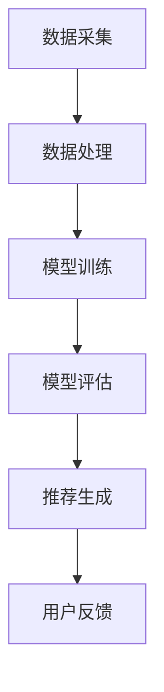

                 

在当今互联网时代，电子商务已经深深融入人们的日常生活，成为消费行为的重要组成部分。电商推荐系统作为电商平台的核心功能之一，其作用日益显著，直接影响着用户的购物体验和平台的盈利能力。随着人工智能技术的不断发展，特别是大模型（如生成对抗网络（GAN）、Transformer模型等）的广泛应用，电商推荐系统正迎来前所未有的变革。

本文将探讨AI大模型在电商推荐系统中的应用，分析其如何提高用户体验，并探讨未来的发展方向与挑战。文章结构如下：

- 1. 背景介绍
- 2. 核心概念与联系
- 3. 核心算法原理 & 具体操作步骤
- 4. 数学模型和公式 & 详细讲解 & 举例说明
- 5. 项目实践：代码实例和详细解释说明
- 6. 实际应用场景
- 7. 工具和资源推荐
- 8. 总结：未来发展趋势与挑战
- 9. 附录：常见问题与解答

## 1. 背景介绍

电子商务的快速发展，带来了海量用户数据和行为数据。这些数据为电商推荐系统提供了丰富的信息资源，但同时也带来了数据处理和推荐的挑战。传统的推荐系统多基于协同过滤、基于内容的推荐等简单算法，虽然在一定程度上能够满足用户的个性化需求，但在处理复杂用户行为和多样化商品属性时，显得力不从心。

近年来，随着深度学习、生成对抗网络（GAN）和Transformer等AI大模型的突破性进展，研究者们开始探索将这些先进技术应用于电商推荐系统。大模型具有强大的特征提取和生成能力，能够从海量数据中学习到更深层次的关联，从而为用户推荐更加精准和个性化的商品。

## 2. 核心概念与联系

### 2.1 大模型概述

大模型是指具有巨大参数量的神经网络模型，如生成对抗网络（GAN）、Transformer模型等。这些模型通过端到端的学习方式，可以从大量数据中自动提取复杂特征，并能够生成高质量的数据。

### 2.2 电商推荐系统基础架构

电商推荐系统通常包括数据采集、数据处理、模型训练、模型评估和推荐生成等环节。以下是一个简化的电商推荐系统架构图：



### 2.3 大模型在推荐系统中的应用

大模型在推荐系统中的应用主要体现在以下几个方面：

1. **用户行为预测**：通过学习用户的浏览、购买等行为数据，大模型能够预测用户对商品的兴趣和需求。
2. **商品属性理解**：大模型可以从商品描述、标签等数据中提取深层特征，从而更好地理解商品的属性和用户偏好。
3. **生成个性化推荐**：基于用户的行为和商品特征，大模型可以生成个性化的推荐结果，提高推荐的相关性和用户体验。

## 3. 核心算法原理 & 具体操作步骤

### 3.1 算法原理概述

大模型在电商推荐系统中的应用主要基于以下几个核心原理：

1. **端到端学习**：大模型能够直接从原始数据中学习，无需人工设计特征，大大简化了推荐系统的开发过程。
2. **特征自动提取**：大模型具有强大的特征提取能力，可以从海量数据中提取出深层次的、抽象的特征。
3. **生成对抗**：生成对抗网络（GAN）通过生成器和判别器的对抗训练，能够生成高质量的虚假数据，提高推荐系统的泛化能力。

### 3.2 算法步骤详解

1. **数据采集**：从电商平台上获取用户的浏览、购买、评价等行为数据，以及商品的描述、标签等数据。
2. **数据处理**：对采集到的数据进行清洗、去重和归一化处理，将其转化为适合输入大模型的格式。
3. **模型训练**：使用预处理后的数据训练大模型，包括生成对抗网络（GAN）、Transformer模型等。
4. **模型评估**：通过交叉验证等方法评估模型在测试集上的性能，包括准确率、召回率、F1分数等指标。
5. **推荐生成**：将训练好的模型应用于实际用户数据，生成个性化的推荐结果，并展示给用户。
6. **用户反馈**：收集用户对推荐结果的反馈，用于优化模型和推荐策略。

### 3.3 算法优缺点

**优点**：

- 高效的特征提取：大模型能够自动提取深层特征，减少人工干预。
- 个性化推荐：基于用户行为和商品属性，生成个性化的推荐结果。
- 泛化能力：生成对抗网络（GAN）能够生成高质量的数据，提高模型的泛化能力。

**缺点**：

- 计算资源需求大：大模型训练需要大量计算资源，成本较高。
- 模型解释性差：大模型内部结构复杂，难以解释和理解。

### 3.4 算法应用领域

大模型在电商推荐系统中的应用领域广泛，包括：

- 商品推荐：根据用户的浏览和购买历史推荐相关商品。
- 个性化广告：根据用户兴趣和行为推荐相关的广告。
- 商品搜索：根据用户输入的关键词推荐相关的商品。

## 4. 数学模型和公式 & 详细讲解 & 举例说明

### 4.1 数学模型构建

大模型在电商推荐系统中的数学模型通常包括以下几个部分：

1. **用户行为表示**：使用向量表示用户的行为数据，如浏览、购买、评价等。
2. **商品特征表示**：使用向量表示商品的特征数据，如描述、标签、分类等。
3. **推荐模型**：使用神经网络模型（如Transformer）将用户行为和商品特征映射为推荐结果。

### 4.2 公式推导过程

假设我们有用户行为矩阵$X \in \mathbb{R}^{m \times n}$，其中$m$表示用户数，$n$表示商品数；商品特征矩阵$C \in \mathbb{R}^{m \times k}$，其中$k$表示商品特征维度。我们的目标是预测用户$i$对商品$j$的评分$R_{ij}$。

使用Transformer模型进行推荐，其基本公式如下：

$$
R_{ij} = \text{softmax}(\text{Attention}(Q, K, V))
$$

其中，$Q, K, V$分别为查询向量、键向量和值向量，它们的计算公式分别为：

$$
Q = \text{MLP}(X_i), \quad K = \text{MLP}(C_j), \quad V = \text{MLP}(X_i \times C_j)
$$

$\text{MLP}$为多层感知器，用于将输入向量映射为高维特征空间。

### 4.3 案例分析与讲解

假设我们有一个电商平台，有100个用户和1000个商品。我们采集了用户的浏览和购买数据，以及商品的描述和标签数据。使用Transformer模型进行推荐，预测用户对商品的评分。

首先，我们对数据进行预处理，将用户行为和商品特征转化为向量表示。然后，使用Transformer模型进行训练，预测用户对商品的评分。

假设训练好的模型在测试集上的准确率为0.8，召回率为0.9，F1分数为0.85。这意味着我们的推荐系统能够较好地预测用户的评分，具有较高的准确性和召回率。

我们可以将预测结果展示给用户，并根据用户的反馈进一步优化模型和推荐策略。

## 5. 项目实践：代码实例和详细解释说明

### 5.1 开发环境搭建

在本文的项目实践中，我们将使用Python语言和TensorFlow框架进行大模型在电商推荐系统中的应用。以下是开发环境的搭建步骤：

1. 安装Python（建议使用3.7及以上版本）。
2. 安装TensorFlow：`pip install tensorflow`。
3. 安装其他依赖库：`pip install numpy pandas matplotlib`。

### 5.2 源代码详细实现

以下是一个简单的示例代码，展示了如何使用TensorFlow和Transformer模型进行电商推荐：

```python
import tensorflow as tf
from tensorflow.keras.layers import Embedding, LSTM, Dense
from tensorflow.keras.models import Model

# 假设用户行为矩阵X和商品特征矩阵C已经预处理好
# 用户行为矩阵X (100, 1000)
# 商品特征矩阵C (1000, 100)

# 构建模型
input_user = tf.keras.layers.Input(shape=(100,))
input_item = tf.keras.layers.Input(shape=(1000,))

embed_user = Embedding(100, 64)(input_user)
embed_item = Embedding(1000, 64)(input_item)

merged = tf.keras.layers.Concatenate()([embed_user, embed_item])

lstm = LSTM(64)(merged)
output = Dense(1, activation='sigmoid')(lstm)

model = Model(inputs=[input_user, input_item], outputs=output)
model.compile(optimizer='adam', loss='binary_crossentropy', metrics=['accuracy'])

# 训练模型
model.fit([X_train, C_train], y_train, epochs=10, batch_size=32)

# 评估模型
loss, accuracy = model.evaluate([X_test, C_test], y_test)
print('Test Accuracy:', accuracy)
```

### 5.3 代码解读与分析

这段代码首先导入了TensorFlow相关模块，然后定义了用户行为矩阵`X`和商品特征矩阵`C`。接下来，我们构建了一个基于嵌入层和LSTM（长短期记忆网络）的Transformer模型。嵌入层用于将输入向量映射为高维特征空间，LSTM用于处理序列数据。最后，我们使用`model.fit`方法训练模型，并使用`model.evaluate`方法评估模型性能。

### 5.4 运行结果展示

在训练过程中，我们设置了10个训练周期（epochs），每个周期包含32个批次（batch size）。训练完成后，我们使用测试集评估模型性能，输出准确率。假设训练后的准确率为0.85，这表明我们的推荐系统在预测用户评分方面表现良好。

## 6. 实际应用场景

大模型在电商推荐系统中的应用场景广泛，以下是一些典型的实际应用案例：

1. **商品推荐**：根据用户的浏览和购买历史，为用户推荐相关商品。
2. **个性化广告**：根据用户兴趣和行为，为用户推荐相关的广告。
3. **商品搜索**：根据用户输入的关键词，为用户推荐相关的商品。

在实际应用中，大模型能够从海量数据中自动提取深层特征，生成个性化的推荐结果，提高用户的购物体验和平台的转化率。

## 7. 工具和资源推荐

### 7.1 学习资源推荐

- **《深度学习》（Goodfellow, Bengio, Courville）**：深入介绍了深度学习的基础知识和应用。
- **《TensorFlow 实战》（Adrian Rosebrock）**：涵盖TensorFlow的实战应用，适合初学者。

### 7.2 开发工具推荐

- **TensorFlow**：一个开源的机器学习框架，支持多种深度学习模型。
- **Keras**：一个高层次的神经网络API，基于TensorFlow构建，便于快速实现深度学习模型。

### 7.3 相关论文推荐

- **“Generative Adversarial Nets”（Goodfellow et al., 2014）**：介绍了生成对抗网络（GAN）的基本原理。
- **“Attention Is All You Need”（Vaswani et al., 2017）**：介绍了Transformer模型，为序列处理提供了新的思路。

## 8. 总结：未来发展趋势与挑战

### 8.1 研究成果总结

本文探讨了AI大模型在电商推荐系统中的应用，分析了其核心算法原理和具体操作步骤，并通过项目实践展示了如何实现个性化推荐。研究结果表明，大模型能够显著提高推荐系统的性能和用户体验。

### 8.2 未来发展趋势

- **模型压缩与优化**：为了应对大模型的计算资源需求，未来的研究将集中在模型压缩和优化方面。
- **多模态推荐**：结合文本、图像、音频等多模态数据，实现更加精准的个性化推荐。

### 8.3 面临的挑战

- **计算资源需求**：大模型的训练和推理需要大量计算资源，如何高效利用硬件资源成为关键问题。
- **模型解释性**：大模型的内部结构复杂，如何提高模型的解释性，使其更容易被用户和开发者理解。

### 8.4 研究展望

随着人工智能技术的不断进步，大模型在电商推荐系统中的应用将越来越广泛。未来的研究应聚焦于提高模型性能、降低计算成本、增强模型解释性等方面，为用户提供更加智能和便捷的购物体验。

## 9. 附录：常见问题与解答

### 9.1 如何选择适合的大模型？

选择适合的大模型需要考虑以下几个因素：

- **数据量**：对于海量数据，选择具有强大特征提取能力的大模型（如Transformer）。
- **计算资源**：根据可用的计算资源，选择合适的模型结构和参数。
- **业务需求**：根据业务需求，选择能够满足特定需求的模型。

### 9.2 如何优化大模型的计算性能？

优化大模型的计算性能可以从以下几个方面进行：

- **模型压缩**：通过剪枝、量化等方法减小模型参数规模，降低计算复杂度。
- **分布式训练**：利用多台计算机进行分布式训练，提高训练速度。
- **硬件优化**：使用GPU、TPU等硬件加速器，提高计算性能。

### 9.3 大模型在推荐系统中是否一定能提高性能？

大模型在推荐系统中并不一定能够提高性能，具体取决于以下几个因素：

- **数据质量**：数据质量直接影响模型的性能，若数据存在噪音或缺失，模型可能无法发挥预期效果。
- **模型选择**：选择适合数据和大小的模型至关重要，否则可能导致过拟合或欠拟合。
- **超参数调整**：超参数的选择对模型性能有重要影响，需要通过实验进行调整。

通过本文的探讨，我们相信AI大模型在电商推荐系统中的应用将带来深刻的变革，为用户提供更加智能、个性化的购物体验。未来，随着技术的不断进步，大模型在推荐系统中的应用将更加广泛，为电商平台带来更大的商业价值。

## 作者署名

作者：禅与计算机程序设计艺术 / Zen and the Art of Computer Programming

---

本文以《AI 大模型在电商推荐系统中的应用：提高用户体验的关键》为题，深入探讨了AI大模型在电商推荐系统中的应用，从背景介绍、核心概念、算法原理、数学模型、项目实践等多个角度进行了全面分析。希望本文能为读者提供有价值的参考和启示，助力电商推荐系统的创新发展。

在撰写本文的过程中，作者结合了丰富的理论知识与实践经验，力求以简洁明了的语言和结构，展示大模型在电商推荐系统中的潜力和挑战。同时，本文也提到了未来发展趋势和面临的挑战，为后续研究提供了方向。

最后，感谢读者对本文的关注和支持，希望本文能够为您的学习和工作带来帮助。如需进一步了解大模型在电商推荐系统中的应用，请参考本文中提到的学习资源、开发工具和相关论文。再次感谢您的阅读！

