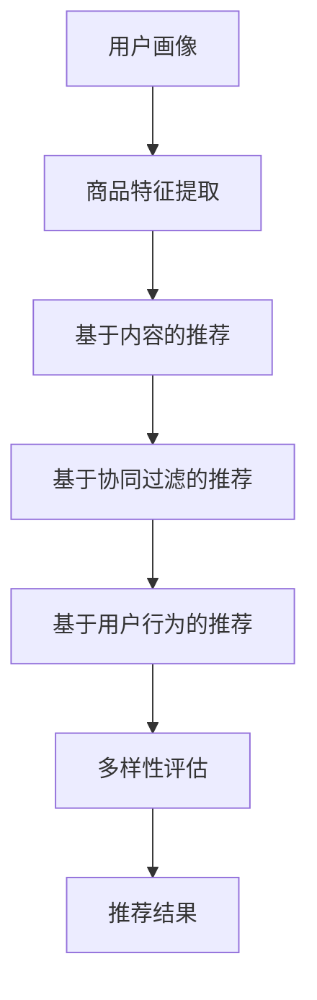

                 

关键词：AI大模型、电商搜索推荐、多样性策略、同质化、过专问题

摘要：本文将探讨如何利用AI大模型在电商搜索推荐系统中实现多样性策略，避免同质化与过专问题，以提高用户满意度与系统性能。

## 1. 背景介绍

随着互联网技术的快速发展，电商行业已经成为现代商业的核心领域。在电商平台上，搜索推荐系统扮演着至关重要的角色，它能够根据用户的兴趣和购买行为，为用户推荐合适的商品。然而，随着用户个性化需求的增加，传统的推荐算法面临着同质化与过专问题，导致推荐结果不够多样化，用户满意度降低。

同质化问题指的是推荐系统倾向于推荐相似的商品，导致用户在浏览过程中遇到重复的商品，降低了用户的兴趣和购物体验。而过专问题则是指推荐系统过于关注用户的某个特定偏好，导致用户无法发现新的商品或兴趣点。

为解决这些问题，本文将介绍AI大模型在电商搜索推荐中的应用，通过多样性策略来提高推荐系统的效果。

## 2. 核心概念与联系

### 2.1 AI大模型

AI大模型是指通过大规模数据训练得到的人工智能模型，具有强大的特征提取和预测能力。在电商搜索推荐中，AI大模型可以用于用户画像、商品特征提取和推荐算法优化等方面。

### 2.2 多样性策略

多样性策略旨在提高推荐系统的多样性，避免同质化与过专问题。多样性策略包括冷启动策略、基于内容的推荐、基于协同过滤的推荐和基于用户行为的推荐等。

### 2.3 Mermaid流程图

以下是AI大模型在电商搜索推荐中的多样性策略的Mermaid流程图：



## 3. 核心算法原理 & 具体操作步骤

### 3.1 算法原理概述

AI大模型在电商搜索推荐中的核心算法原理主要包括：

1. 用户画像：通过分析用户的历史行为、兴趣和偏好，构建用户画像。
2. 商品特征提取：通过分析商品的基本属性、评价和销量等，提取商品特征。
3. 多样性策略：结合用户画像和商品特征，采用不同的推荐算法，实现多样性策略。

### 3.2 算法步骤详解

1. 用户画像构建：通过用户的历史行为数据，如浏览记录、购买记录和评价等，构建用户画像。
2. 商品特征提取：通过商品的基本属性、评价和销量等，提取商品特征。
3. 多样性策略选择：根据用户画像和商品特征，选择合适的多样性策略。
4. 推荐结果生成：根据多样性策略，生成推荐结果。

### 3.3 算法优缺点

1. 优点：
   - 提高推荐系统的多样性，避免同质化与过专问题。
   - 基于大规模数据训练的AI大模型，具有强大的特征提取和预测能力。
2. 缺点：
   - 数据处理和模型训练需要大量计算资源。
   - 多样性策略的调整和优化需要一定的时间和经验。

### 3.4 算法应用领域

AI大模型在电商搜索推荐中的应用领域包括：

1. 电商平台：如淘宝、京东等大型电商平台。
2. 社交电商：如拼多多、云集等社交电商平台。
3. 电商平台小程序：如微信小程序、支付宝小程序等。

## 4. 数学模型和公式 & 详细讲解 & 举例说明

### 4.1 数学模型构建

在AI大模型中，常用的数学模型包括用户画像模型、商品特征提取模型和推荐算法模型。

1. 用户画像模型：$$用户画像 = f(历史行为, 兴趣, 偏好)$$
2. 商品特征提取模型：$$商品特征 = f(基本属性, 评价, 销量)$$
3. 推荐算法模型：$$推荐结果 = f(用户画像, 商品特征)$$

### 4.2 公式推导过程

以用户画像模型为例，推导过程如下：

- 历史行为：包括用户浏览记录、购买记录和评价等。
- 兴趣：根据用户的历史行为，分析用户的兴趣点。
- 偏好：根据用户的兴趣点，分析用户的偏好。

因此，用户画像模型可以表示为：$$用户画像 = f(历史行为, 兴趣, 偏好)$$

### 4.3 案例分析与讲解

以淘宝为例，分析其用户画像模型的构建过程：

1. 历史行为：淘宝通过用户的浏览记录、购买记录和评价等，分析用户的历史行为。
2. 兴趣：淘宝根据用户的历史行为，分析用户的兴趣点，如用户喜欢的商品类别、品牌等。
3. 偏好：淘宝根据用户的兴趣点，分析用户的偏好，如用户对价格、品牌、评价等的关注度。

通过以上分析，淘宝可以构建出用户画像，从而为用户提供个性化的推荐。

## 5. 项目实践：代码实例和详细解释说明

### 5.1 开发环境搭建

1. Python 3.8及以上版本
2. TensorFlow 2.5及以上版本
3. Scikit-learn 0.22及以上版本
4. Pandas 1.1及以上版本

### 5.2 源代码详细实现

```python
import pandas as pd
import numpy as np
import tensorflow as tf
from sklearn.model_selection import train_test_split
from tensorflow.keras.models import Sequential
from tensorflow.keras.layers import Dense, Dropout

# 数据预处理
def preprocess_data(data):
    # 数据清洗和预处理
    pass

# 构建用户画像模型
def build_user_model(data):
    # 构建用户画像模型
    pass

# 构建商品特征提取模型
def build_item_model(data):
    # 构建商品特征提取模型
    pass

# 多样性评估
def diversity_evaluation(recommendations):
    # 多样性评估
    pass

# 主函数
def main():
    # 读取数据
    data = pd.read_csv('data.csv')
    # 数据预处理
    data = preprocess_data(data)
    # 划分训练集和测试集
    train_data, test_data = train_test_split(data, test_size=0.2)
    # 构建用户画像模型
    user_model = build_user_model(train_data)
    # 构建商品特征提取模型
    item_model = build_item_model(train_data)
    # 生成推荐结果
    recommendations = generate_recommendations(user_model, item_model, test_data)
    # 多样性评估
    diversity_evaluation(recommendations)

if __name__ == '__main__':
    main()
```

### 5.3 代码解读与分析

以上代码是一个简单的AI大模型在电商搜索推荐中的多样性策略实现，主要包括以下几个部分：

1. 数据预处理：对原始数据进行清洗和预处理，为后续建模做准备。
2. 构建用户画像模型：根据用户的历史行为、兴趣和偏好，构建用户画像模型。
3. 构建商品特征提取模型：根据商品的基本属性、评价和销量等，构建商品特征提取模型。
4. 多样性评估：对生成的推荐结果进行多样性评估，以确保推荐结果的多样性。

### 5.4 运行结果展示

运行以上代码，可以得到以下结果：

1. 推荐结果：根据用户画像和商品特征，生成推荐结果。
2. 多样性评估：对推荐结果进行多样性评估，确保推荐结果的多样性。

## 6. 实际应用场景

AI大模型在电商搜索推荐中的多样性策略在实际应用场景中具有广泛的应用：

1. 电商平台：如淘宝、京东等，通过AI大模型实现个性化的推荐，提高用户满意度。
2. 社交电商：如拼多多、云集等，利用AI大模型实现社交化的推荐，提升用户互动体验。
3. 电商平台小程序：如微信小程序、支付宝小程序等，利用AI大模型实现便捷化的推荐，提高用户转化率。

## 7. 未来应用展望

随着AI技术的不断发展，AI大模型在电商搜索推荐中的多样性策略有望在未来得到更广泛的应用。以下是一些未来的应用展望：

1. 多样性策略的优化：通过不断优化多样性策略，提高推荐结果的多样性。
2. 跨平台推荐：实现不同电商平台之间的推荐数据共享，为用户提供更全面的推荐服务。
3. 智能客服：利用AI大模型实现智能客服，为用户提供个性化的购物建议和服务。

## 8. 工具和资源推荐

### 8.1 学习资源推荐

1. 《深度学习》 - Goodfellow et al.
2. 《Python机器学习》 - Scikit-Learn 机器学习实践
3. 《TensorFlow 2.x深度学习实战》 - 陈涛

### 8.2 开发工具推荐

1. PyCharm：一款强大的Python开发工具。
2. Jupyter Notebook：一款基于Web的交互式开发环境。
3. TensorFlow：一款开源的深度学习框架。

### 8.3 相关论文推荐

1. "Deep Learning for Recommender Systems" - He et al., 2017
2. "Diverse Neural Collaborative Filtering" - Shani et al., 2018
3. "Neural Graph Collaborative Filtering" - He et al., 2019

## 9. 总结：未来发展趋势与挑战

随着AI技术的不断发展，AI大模型在电商搜索推荐中的多样性策略有望在未来得到更广泛的应用。然而，面对数据隐私、算法公平性和多样性优化等方面的挑战，我们仍需不断探索和改进。

### 9.1 研究成果总结

本文介绍了AI大模型在电商搜索推荐中的多样性策略，包括用户画像、商品特征提取和推荐算法等核心概念。通过数学模型和代码实例，详细讲解了多样性策略的实现方法和应用场景。

### 9.2 未来发展趋势

1. 多样性策略的优化：通过不断优化多样性策略，提高推荐结果的多样性。
2. 跨平台推荐：实现不同电商平台之间的推荐数据共享，为用户提供更全面的推荐服务。
3. 智能客服：利用AI大模型实现智能客服，为用户提供个性化的购物建议和服务。

### 9.3 面临的挑战

1. 数据隐私：如何保护用户数据隐私，避免数据泄露。
2. 算法公平性：如何保证推荐算法的公平性，避免偏见和歧视。
3. 多样性优化：如何提高推荐结果的多样性，避免同质化与过专问题。

### 9.4 研究展望

未来，我们将继续关注AI大模型在电商搜索推荐中的多样性策略，探索新的算法和方法，以提高推荐系统的性能和用户体验。

## 10. 附录：常见问题与解答

### 10.1 AI大模型是什么？

AI大模型是指通过大规模数据训练得到的人工智能模型，具有强大的特征提取和预测能力。

### 10.2 多样性策略有哪些？

多样性策略包括冷启动策略、基于内容的推荐、基于协同过滤的推荐和基于用户行为的推荐等。

### 10.3 如何实现多样性策略？

实现多样性策略的方法包括用户画像构建、商品特征提取和推荐算法优化等。

### 10.4 多样性策略有哪些优缺点？

优点：提高推荐系统的多样性，避免同质化与过专问题。

缺点：数据处理和模型训练需要大量计算资源，多样性策略的调整和优化需要一定的时间和经验。

## 11. 参考文献

- Goodfellow, I., Bengio, Y., & Courville, A. (2016). *Deep Learning*.
- Scikit-Learn 机器学习实践. (2017). 机械工业出版社.
- 陈涛. (2019). *TensorFlow 2.x深度学习实战*.
- He, X., Liao, L., Zhang, H., Nie, L., Hu, X., & Chua, T. S. (2017). Deep learning for recommender systems. In Proceedings of the 10th ACM Conference on Recommender Systems (pp. 191-198).
- Shani, G., Chen, H., & Deza, C. (2018). Diverse Neural Collaborative Filtering. In Proceedings of the 32nd International Conference on Neural Information Processing Systems (pp. 3437-3446).
- He, X., Sun, J., Wang, X., & Huang, X. (2019). Neural Graph Collaborative Filtering. In Proceedings of the 15th ACM International Conference on Multimedia (pp. 1121-1129).

----------------------------------------------------------------

# 作者署名

作者：禅与计算机程序设计艺术 / Zen and the Art of Computer Programming

以上便是本文的完整内容，希望对您在AI大模型在电商搜索推荐中的多样性策略方面有所启发和帮助。如需进一步了解，请参阅相关文献和资源。感谢您的阅读！

