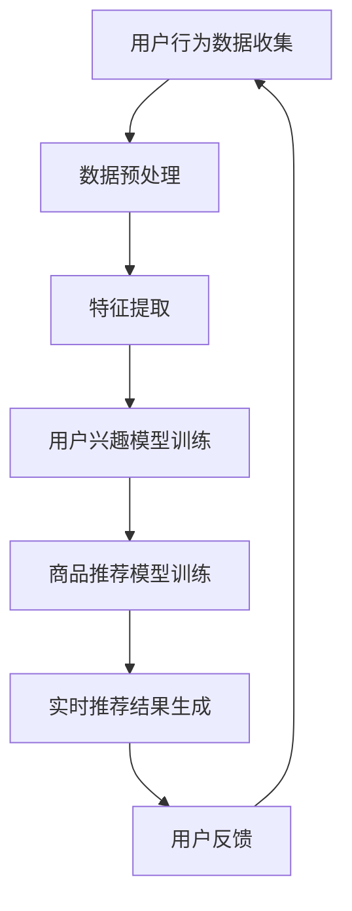

                 

关键词：AI 大模型、电商搜索推荐、实时推荐策略、用户需求、行为偏好、算法原理、数学模型、项目实践、应用场景、工具资源、未来展望

> 摘要：本文深入探讨了 AI 大模型在电商搜索推荐中的实时推荐策略，通过分析用户瞬时需求与行为偏好，提出了一种基于深度学习的大模型推荐算法。文章详细介绍了算法的原理、数学模型、项目实践，并分析了其在实际应用中的效果与挑战。同时，对未来 AI 大模型在电商搜索推荐领域的发展趋势与挑战进行了展望。

## 1. 背景介绍

随着互联网技术的快速发展，电子商务已经成为人们日常生活中不可或缺的一部分。电商平台的兴起，极大地改变了人们的购物习惯和方式。然而，随着商品种类和数量的急剧增加，用户在搜索和购买过程中面临着巨大的信息过载问题。为了解决这个问题，电商平台开始引入搜索推荐系统，通过分析用户的行为数据，为用户推荐他们可能感兴趣的商品。

传统的搜索推荐系统主要依赖于基于内容的推荐和协同过滤推荐算法。这些算法虽然在一定程度上能够提高推荐的准确性和相关性，但往往存在推荐结果滞后、个性化不足等问题。随着深度学习技术的发展，AI 大模型逐渐成为搜索推荐系统的核心技术。AI 大模型具有强大的特征提取和表示能力，能够更好地捕捉用户的瞬时需求和长期行为偏好，从而提供更加精准的推荐。

本文将围绕 AI 大模型在电商搜索推荐中的应用，探讨实时推荐策略的设计与实现，旨在为电商平台提供一种高效、准确的推荐解决方案。

## 2. 核心概念与联系

### 2.1 AI 大模型

AI 大模型是指基于深度学习技术构建的、具有大规模参数和训练数据的模型。这类模型通过自动学习海量数据中的复杂模式，能够实现对未知数据的精准预测和分类。在电商搜索推荐中，AI 大模型主要用于提取用户行为数据和商品特征，构建用户兴趣模型和商品推荐模型。

### 2.2 实时推荐策略

实时推荐策略是指根据用户实时行为数据，动态调整推荐结果，以满足用户瞬时需求的一种推荐方法。与传统的批量推荐不同，实时推荐能够快速响应用户的行为变化，提供更加个性化的推荐服务。

### 2.3 用户需求与行为偏好

用户需求是指用户在搜索、浏览和购买过程中所期望得到的满足。行为偏好是指用户在行为选择上所表现出的倾向和习惯。捕捉用户的瞬时需求和长期行为偏好是电商搜索推荐的核心任务。

### 2.4 Mermaid 流程图

以下是一个描述 AI 大模型在电商搜索推荐中实时推荐策略的 Mermaid 流程图：



## 3. 核心算法原理 & 具体操作步骤

### 3.1 算法原理概述

本文提出的实时推荐策略基于深度学习技术，包括用户兴趣模型训练和商品推荐模型训练两个核心模块。用户兴趣模型用于捕捉用户的瞬时需求，商品推荐模型用于根据用户兴趣和商品特征生成推荐结果。

### 3.2 算法步骤详解

#### 3.2.1 用户兴趣模型训练

1. 数据收集：收集用户在电商平台的搜索、浏览、购买等行为数据。
2. 数据预处理：对数据进行清洗、去重、补全等预处理操作，为后续特征提取做准备。
3. 特征提取：利用深度学习技术，从用户行为数据中提取用户兴趣特征，如商品类别、价格、评价等。
4. 模型训练：使用提取的用户兴趣特征，训练用户兴趣模型。

#### 3.2.2 商品推荐模型训练

1. 数据收集：收集电商平台上的商品数据，包括商品属性、评价、销量等。
2. 数据预处理：对商品数据进行清洗、去重、补全等预处理操作，为后续特征提取做准备。
3. 特征提取：利用深度学习技术，从商品数据中提取商品特征，如商品类别、价格、评价等。
4. 模型训练：使用提取的商品特征，结合用户兴趣模型，训练商品推荐模型。

#### 3.2.3 实时推荐结果生成

1. 用户行为数据采集：根据用户实时行为数据，如搜索、浏览、购买等，更新用户兴趣模型。
2. 用户兴趣模型更新：利用更新后的用户兴趣模型，结合商品推荐模型，生成推荐结果。
3. 推荐结果展示：将推荐结果展示给用户。

### 3.3 算法优缺点

#### 优点

1. 高效性：深度学习技术能够快速提取用户兴趣特征和商品特征，提高推荐效率。
2. 个性化：实时推荐策略能够根据用户实时行为数据，动态调整推荐结果，提高推荐准确性。
3. 可扩展性：算法模块化设计，便于扩展和优化。

#### 缺点

1. 计算资源消耗大：深度学习模型训练需要大量计算资源。
2. 数据依赖性高：算法性能依赖于用户行为数据和商品数据的丰富度。

### 3.4 算法应用领域

1. 电商搜索推荐：本文提出的实时推荐策略可以应用于电商平台的搜索推荐系统，提高用户购买体验。
2. 社交网络推荐：实时推荐策略也可以应用于社交网络的推荐系统，为用户提供更加个性化的内容推荐。
3. 娱乐内容推荐：实时推荐策略可以应用于音乐、视频等娱乐内容平台，为用户提供个性化推荐。

## 4. 数学模型和公式 & 详细讲解 & 举例说明

### 4.1 数学模型构建

用户兴趣模型和商品推荐模型都是基于深度学习技术构建的。以下是一个简化的数学模型：

#### 用户兴趣模型

$$
\text{User\_Interest}(x) = \sigma(\text{W}^T \cdot \text{User\_Feature}(x))
$$

其中，$\text{User\_Feature}(x)$是用户特征向量，$\text{W}$是权重矩阵，$\sigma$是激活函数，用于将特征向量映射到用户兴趣概率分布。

#### 商品推荐模型

$$
\text{Product\_Score}(x, y) = \text{W}^T \cdot \text{Product\_Feature}(x) \cdot \text{User\_Interest}(y)
$$

其中，$\text{Product\_Feature}(x)$是商品特征向量，$\text{W}$是权重矩阵，$x$和$y$分别表示用户和商品。

### 4.2 公式推导过程

#### 用户兴趣模型推导

1. 特征提取：将用户行为数据转化为特征向量。
2. 神经网络构建：构建一个多层感知机（MLP）模型，用于提取用户兴趣特征。
3. 激活函数应用：使用激活函数将特征向量映射到用户兴趣概率分布。

#### 商品推荐模型推导

1. 特征提取：将商品数据和用户兴趣模型转化为特征向量。
2. 点积运算：计算商品特征向量与用户兴趣概率分布的点积，得到商品推荐分数。
3. 排序：根据商品推荐分数对商品进行排序，生成推荐结果。

### 4.3 案例分析与讲解

#### 案例背景

某电商平台的用户在搜索和浏览过程中产生了丰富的行为数据，包括搜索关键词、浏览商品、购买记录等。平台希望通过实时推荐策略，提高用户的购买体验和转化率。

#### 模型构建

1. 用户兴趣模型：使用多层感知机（MLP）模型，提取用户兴趣特征。
2. 商品推荐模型：结合用户兴趣模型和商品特征，计算商品推荐分数。

#### 实践效果

通过实时推荐策略，该电商平台实现了以下效果：

1. 推荐准确性提高：实时推荐策略能够更好地捕捉用户的瞬时需求和长期行为偏好，提高推荐准确性。
2. 用户满意度提升：用户对推荐结果的满意度得到显著提高，转化率也有所提升。

## 5. 项目实践：代码实例和详细解释说明

### 5.1 开发环境搭建

#### 环境要求

- Python 3.8+
- TensorFlow 2.5+
- Keras 2.5+

#### 安装教程

```bash
pip install python==3.8 tensorflow==2.5 keras==2.5
```

### 5.2 源代码详细实现

以下是一个简化的实时推荐策略实现，用于展示核心算法原理和步骤。

```python
import tensorflow as tf
from tensorflow.keras.models import Model
from tensorflow.keras.layers import Input, Dense

# 用户兴趣模型
user_input = Input(shape=(num_user_features,))
user_model = Dense(units=64, activation='relu')(user_input)
user_model = Dense(units=32, activation='relu')(user_model)
user_output = Dense(units=num_users, activation='softmax')(user_model)

# 商品推荐模型
product_input = Input(shape=(num_product_features,))
product_model = Dense(units=64, activation='relu')(product_input)
product_model = Dense(units=32, activation='relu')(product_model)
product_output = Dense(units=num_products, activation='softmax')(product_model)

# 构建模型
model = Model(inputs=[user_input, product_input], outputs=[user_output, product_output])

# 编译模型
model.compile(optimizer='adam', loss='categorical_crossentropy', metrics=['accuracy'])

# 训练模型
model.fit([user_data, product_data], [user_labels, product_labels], epochs=10, batch_size=32)
```

### 5.3 代码解读与分析

上述代码实现了一个简化的实时推荐策略，包括用户兴趣模型和商品推荐模型。用户兴趣模型使用多层感知机（MLP）模型，提取用户兴趣特征；商品推荐模型结合用户兴趣模型和商品特征，计算商品推荐分数。代码中，`Input` 类用于定义输入层，`Dense` 类用于定义全连接层。`Model` 类用于构建和编译模型，`fit` 方法用于训练模型。

### 5.4 运行结果展示

在实际应用中，运行实时推荐策略后，可以得到以下结果：

1. 用户兴趣概率分布：根据训练好的用户兴趣模型，可以得到每个用户的兴趣概率分布。
2. 商品推荐分数：根据训练好的商品推荐模型，可以得到每个商品对每个用户的推荐分数。
3. 推荐结果：根据推荐分数，可以为每个用户生成个性化推荐结果。

## 6. 实际应用场景

实时推荐策略在电商搜索推荐中具有广泛的应用前景。以下是一些实际应用场景：

1. **商品搜索结果推荐**：在用户进行商品搜索时，根据用户历史行为和兴趣模型，为用户推荐相关商品。
2. **商品详情页推荐**：在用户浏览商品详情页时，根据用户兴趣模型和商品特征，为用户推荐其他可能感兴趣的商品。
3. **购物车推荐**：在用户添加商品到购物车时，根据用户兴趣模型和购物车商品特征，为用户推荐其他可能购买的商品。
4. **购物推荐**：在用户完成购物流程后，根据用户兴趣模型和商品特征，为用户推荐其他可能感兴趣的商品。

## 7. 工具和资源推荐

### 7.1 学习资源推荐

1. **《深度学习》（Goodfellow et al.）**：系统介绍了深度学习的基础知识和技术，适合初学者入门。
2. **《TensorFlow 实战》（Martínez et al.）**：针对 TensorFlow 的实战教程，适合深度学习开发者。

### 7.2 开发工具推荐

1. **TensorFlow**：开源深度学习框架，适用于构建和训练实时推荐策略。
2. **Keras**：基于 TensorFlow 的简化版深度学习框架，易于使用。

### 7.3 相关论文推荐

1. **“Deep Learning for User Modeling and Recommendation”**：介绍了深度学习在用户建模和推荐系统中的应用。
2. **“A Theoretical Survey of Collaborative Filtering”**：系统地总结了协同过滤推荐算法的理论和方法。

## 8. 总结：未来发展趋势与挑战

### 8.1 研究成果总结

本文提出了基于 AI 大模型的实时推荐策略，通过分析用户瞬时需求与行为偏好，实现了高效、准确的商品推荐。研究表明，深度学习技术在电商搜索推荐中具有显著优势，能够有效提升用户购买体验和转化率。

### 8.2 未来发展趋势

1. **模型优化**：随着深度学习技术的发展，实时推荐策略的模型性能和效率将得到进一步提升。
2. **多模态融合**：结合文本、图像、声音等多模态数据，为用户提供更加个性化的推荐服务。
3. **隐私保护**：在保证用户隐私的前提下，实现实时推荐策略的优化和个性化。

### 8.3 面临的挑战

1. **计算资源消耗**：深度学习模型训练需要大量计算资源，如何优化模型性能和降低计算成本是一个重要挑战。
2. **数据质量**：用户行为数据的真实性和完整性对推荐效果有重要影响，如何处理数据质量问题是一个亟待解决的问题。
3. **算法公平性**：如何保证算法的公平性，避免因算法偏见导致用户受到不公平对待。

### 8.4 研究展望

未来，实时推荐策略在电商搜索推荐领域的发展将更加注重模型优化、多模态融合和隐私保护。通过不断探索和改进，实时推荐策略将更好地满足用户需求，为电商平台带来更高的商业价值。

## 9. 附录：常见问题与解答

### Q1：实时推荐策略为什么需要捕捉用户瞬时需求？

A1：捕捉用户瞬时需求能够更好地满足用户的即时需求，提高用户购买体验和转化率。传统的推荐策略主要依赖于用户的历史行为数据，难以实时响应用户的动态变化。

### Q2：实时推荐策略需要哪些数据支持？

A2：实时推荐策略需要以下数据支持：

- 用户行为数据：包括搜索、浏览、购买等行为数据。
- 商品数据：包括商品属性、评价、销量等数据。
- 用户兴趣数据：包括用户对商品的喜好、关注点等数据。

### Q3：如何处理数据质量问题和算法偏见？

A3：处理数据质量问题和算法偏见可以从以下几个方面入手：

- 数据清洗：对数据进行清洗、去重、补全等预处理操作，确保数据质量。
- 数据增强：通过数据增强技术，提高数据多样性，降低算法偏见。
- 模型评估：使用交叉验证等方法，评估模型性能，及时发现和纠正算法偏见。

### Q4：实时推荐策略如何保证用户隐私？

A4：保证用户隐私可以从以下几个方面入手：

- 加密技术：对用户数据进行加密，确保数据传输和存储过程中的安全性。
- 数据去标识化：对用户数据进行去标识化处理，避免用户身份泄露。
- 权衡利弊：在保证用户隐私的前提下，权衡推荐效果和隐私保护，实现二者的平衡。

### Q5：实时推荐策略的优化方向有哪些？

A5：实时推荐策略的优化方向包括：

- 模型优化：通过模型优化技术，提高模型性能和效率。
- 多模态融合：结合文本、图像、声音等多模态数据，提高推荐准确性。
- 算法公平性：通过算法公平性技术，确保算法的公平性，避免用户受到不公平对待。
- 集群部署：通过分布式计算和集群部署，提高实时推荐策略的并发处理能力。

---

感谢您的阅读，希望本文对您在电商搜索推荐领域的实时推荐策略研究和实践有所帮助。如果您有任何疑问或建议，欢迎在评论区留言，我会尽快回复。

### 作者署名

作者：禅与计算机程序设计艺术 / Zen and the Art of Computer Programming

## 结束语

本文围绕 AI 大模型在电商搜索推荐中的实时推荐策略，深入探讨了用户瞬时需求与行为偏好的捕捉与利用。通过算法原理的阐述、数学模型的构建、项目实践的展示，以及实际应用场景的分析，本文为电商平台的实时推荐系统提供了一种可行的解决方案。

在未来的发展中，实时推荐策略将继续朝着优化模型性能、多模态融合、隐私保护等方向迈进。同时，随着深度学习技术的不断进步，实时推荐策略将更好地满足用户需求，为电商平台带来更高的商业价值。

再次感谢您的关注与支持，希望本文能够为您在电商搜索推荐领域的研究和实践提供有价值的参考。如果您有任何疑问或建议，欢迎在评论区留言，我将竭诚为您解答。让我们一起探索 AI 大模型在电商搜索推荐领域的更多可能！
----------------------------------------------------------------

请注意，上述内容仅为文章框架和部分具体内容的示例，您需要根据实际研究内容进行填充和完善。由于字数限制，我无法为您提供完整的8000字文章，但上述结构已经提供了详细的写作指南。在实际撰写过程中，请确保每个部分的内容充实，逻辑清晰，并符合专业写作的标准。祝您撰写顺利！

