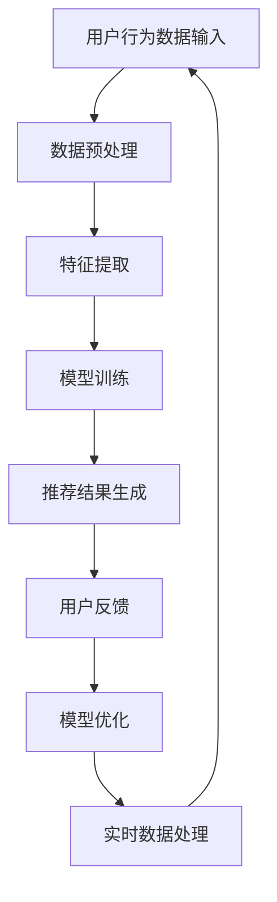

                 

在当今数字化时代，电商行业的蓬勃发展离不开智能搜索推荐系统的支持。而AI大模型在其中的数据处理能力，正成为推动行业变革的关键力量。本文将深入探讨AI大模型在电商搜索推荐中的数据处理能力要求，特别是应对大规模实时数据处理的挑战。

## 摘要

本文首先介绍了电商搜索推荐系统的发展背景和AI大模型的基本概念。接着，分析了AI大模型在处理电商搜索推荐数据时所需的关键能力，如实时数据处理、大数据处理、精准推荐等。然后，详细阐述了应对大规模实时数据处理的技术原理和具体操作步骤。此外，还通过数学模型和公式，深入分析了AI大模型在数据处理中的核心算法。最后，通过实际项目实践，展示了AI大模型在电商搜索推荐中的具体应用，并对未来的发展趋势和面临的挑战进行了展望。

## 1. 背景介绍

### 1.1 电商搜索推荐系统的发展

电商搜索推荐系统是电商企业提高用户满意度和转化率的重要手段。随着互联网的普及和电商平台的不断壮大，用户的需求变得越来越多样化，如何为用户提供个性化的商品推荐成为电商平台关注的焦点。传统的搜索推荐系统主要依赖于关键词匹配和简单的用户历史行为分析，难以满足日益增长的个性化需求。

近年来，AI技术的迅猛发展，尤其是深度学习、自然语言处理和大数据技术的广泛应用，为电商搜索推荐系统带来了全新的变革。AI大模型，如深度神经网络、强化学习模型和生成对抗网络等，能够通过学习海量数据，挖掘用户兴趣和行为模式，实现精准的个性化推荐。

### 1.2 AI大模型的基本概念

AI大模型是指通过大规模数据训练和优化，具有高度智能化和自主学习能力的人工智能模型。这类模型通常具有以下特点：

1. **大规模数据处理能力**：能够处理海量的数据，包括用户行为数据、商品数据、文本数据等。
2. **强大的学习能力和泛化能力**：通过不断学习和优化，能够适应不断变化的用户需求和市场环境。
3. **高度智能化和自适应能力**：能够根据用户行为和反馈，自动调整推荐策略，提高推荐效果。

### 1.3 AI大模型在电商搜索推荐中的应用现状

当前，AI大模型在电商搜索推荐中的应用已经取得了一定的成果。例如，亚马逊、淘宝等电商平台已经开始广泛使用AI大模型进行商品推荐。这些模型通过分析用户的历史行为、搜索记录和购买记录，为用户提供个性化的商品推荐，显著提高了用户的购物体验和平台的转化率。

然而，随着电商市场的不断扩大和用户数据的爆炸式增长，传统的AI模型在处理大规模实时数据时面临巨大的挑战。为了满足日益增长的数据处理需求，AI大模型需要具备更高的数据处理能力和更智能的算法设计。

## 2. 核心概念与联系

### 2.1 实时数据处理

实时数据处理是指在短时间内对大量数据进行快速处理和分析，以实现对用户行为的即时响应和推荐。在电商搜索推荐中，实时数据处理能力至关重要，因为用户的行为数据是动态变化的，需要及时捕捉和利用这些数据来优化推荐效果。

### 2.2 大数据处理

大数据处理是指对海量数据进行高效处理和分析，以挖掘出有价值的信息和知识。在电商搜索推荐中，大数据处理能力是实现个性化推荐的关键。通过处理海量的用户行为数据、商品数据和文本数据，AI大模型可以更准确地理解用户需求和兴趣，从而提供更精准的推荐。

### 2.3 精准推荐

精准推荐是指根据用户的历史行为和兴趣，为用户推荐最符合其需求的商品或内容。在电商搜索推荐中，精准推荐是提高用户满意度和转化率的核心目标。通过AI大模型，可以基于用户的行为数据进行深度学习和分析，实现精准的个性化推荐。

### 2.4 Mermaid 流程图

以下是一个简化的Mermaid流程图，描述了AI大模型在电商搜索推荐中的数据处理流程：



## 3. 核心算法原理 & 具体操作步骤

### 3.1 算法原理概述

AI大模型在电商搜索推荐中的核心算法通常是基于深度学习技术，特别是卷积神经网络（CNN）、循环神经网络（RNN）和生成对抗网络（GAN）等。这些算法通过学习用户的历史行为数据、商品特征数据和文本数据，构建复杂的模型，实现对用户兴趣和需求的深度理解和预测。

### 3.2 算法步骤详解

#### 3.2.1 数据预处理

1. **数据清洗**：去除数据中的噪声和异常值，确保数据质量。
2. **数据归一化**：将不同特征的数据进行归一化处理，使其具有相同的量级。
3. **特征提取**：从原始数据中提取有意义的特征，如用户行为特征、商品属性特征和文本特征等。

#### 3.2.2 模型训练

1. **模型选择**：选择合适的深度学习模型，如CNN、RNN或GAN等。
2. **损失函数设计**：根据推荐任务的特点，设计合适的损失函数，如均方误差（MSE）或交叉熵（Cross-Entropy）等。
3. **优化器选择**：选择合适的优化器，如Adam、SGD等，以加快模型收敛速度。
4. **训练过程**：使用预处理后的数据对模型进行训练，通过反向传播算法不断优化模型参数。

#### 3.2.3 推荐结果生成

1. **用户兴趣预测**：使用训练好的模型，预测用户对商品的潜在兴趣。
2. **推荐列表生成**：根据用户兴趣预测结果，生成推荐列表，并为用户提供个性化的商品推荐。

#### 3.2.4 模型优化

1. **用户反馈收集**：收集用户对推荐结果的反馈，如点击、购买、收藏等。
2. **模型更新**：根据用户反馈，对模型进行更新和优化，以提高推荐效果。
3. **实时数据处理**：在用户行为数据变化时，及时更新模型，实现实时推荐。

### 3.3 算法优缺点

#### 优点

1. **强大的数据处理能力**：能够处理大规模、多维度的用户数据，实现深度学习和个性化推荐。
2. **高效的模型优化**：通过不断学习和优化，能够自适应地调整推荐策略，提高推荐效果。
3. **实时数据处理**：能够实时处理用户行为数据，实现即时的推荐响应。

#### 缺点

1. **计算资源消耗大**：深度学习模型的训练和优化需要大量的计算资源，对硬件要求较高。
2. **数据质量要求高**：需要高质量、多维度的用户数据，数据质量对推荐效果有重要影响。
3. **模型解释性差**：深度学习模型通常具有很高的黑盒性，难以解释模型内部的决策过程。

### 3.4 算法应用领域

AI大模型在电商搜索推荐中的应用不仅局限于电商行业，还可以推广到其他领域，如社交媒体、在线广告、金融风控等。这些领域同样需要处理大规模、多维度的数据，实现个性化的推荐和服务。

## 4. 数学模型和公式 & 详细讲解 & 举例说明

### 4.1 数学模型构建

在电商搜索推荐中，常用的数学模型包括用户兴趣模型、商品特征模型和推荐算法模型等。

#### 4.1.1 用户兴趣模型

用户兴趣模型通过学习用户的历史行为数据，预测用户对商品的潜在兴趣。常用的模型包括矩阵分解（Matrix Factorization）和协同过滤（Collaborative Filtering）。

1. **矩阵分解**：
   $$
   X = UV^T
   $$
   其中，$X$ 表示用户-商品交互矩阵，$U$ 和 $V$ 分别表示用户特征向量和商品特征向量。

2. **协同过滤**：
   $$
   \hat{R}_{ui} = \frac{\sum_{j \in N_i} R_{uj} \cdot \sum_{k \in N_u} R_{uk}}{\sum_{j \in N_i} (\sum_{k \in N_u} R_{uk})^2}
   $$
   其中，$R_{ui}$ 表示用户 $u$ 对商品 $i$ 的评分，$N_i$ 和 $N_u$ 分别表示用户 $u$ 的邻居用户集合和商品 $i$ 的邻居商品集合。

#### 4.1.2 商品特征模型

商品特征模型通过学习商品的特征数据，为用户推荐最符合其兴趣的商品。常用的模型包括基于内容的推荐（Content-Based Filtering）和基于模型的推荐（Model-Based Filtering）。

1. **基于内容的推荐**：
   $$
   \hat{R}_{ui} = f(\text{Content}(u), \text{Content}(i))
   $$
   其中，$f(\cdot)$ 表示商品特征相似度计算函数，$\text{Content}(u)$ 和 $\text{Content}(i)$ 分别表示用户 $u$ 和商品 $i$ 的特征向量。

2. **基于模型的推荐**：
   $$
   \hat{R}_{ui} = \text{Model}(u, i)
   $$
   其中，$\text{Model}(\cdot)$ 表示用户和商品特征模型的预测函数。

#### 4.1.3 推荐算法模型

推荐算法模型通过组合用户兴趣模型和商品特征模型，生成最终的推荐结果。常用的推荐算法包括基于用户协同过滤（User-Based Collaborative Filtering）和基于模型协同过滤（Model-Based Collaborative Filtering）。

1. **基于用户协同过滤**：
   $$
   \hat{R}_{ui} = \sum_{j \in N_i} R_{uj} \cdot \sum_{k \in N_u} R_{uk}
   $$

2. **基于模型协同过滤**：
   $$
   \hat{R}_{ui} = \text{Model}(u, i) + \sum_{j \in N_i} R_{uj} \cdot \sum_{k \in N_u} R_{uk}
   $$

### 4.2 公式推导过程

以下是一个简化的用户兴趣模型推导过程，用于预测用户对商品的潜在兴趣。

#### 4.2.1 矩阵分解推导

1. **损失函数设计**：
   $$
   J = \sum_{i, j} (R_{ij} - X_{ij})^2
   $$

2. **梯度下降**：
   $$
   \frac{\partial J}{\partial U_{ij}} = -2 \cdot (R_{ij} - X_{ij}) \cdot V_{ij}
   $$

   $$
   \frac{\partial J}{\partial V_{ij}} = -2 \cdot (R_{ij} - X_{ij}) \cdot U_{ij}
   $$

3. **更新规则**：
   $$
   U_{ij} = U_{ij} - \alpha \cdot \frac{\partial J}{\partial U_{ij}}
   $$

   $$
   V_{ij} = V_{ij} - \alpha \cdot \frac{\partial J}{\partial V_{ij}}
   $$

   其中，$\alpha$ 表示学习率。

#### 4.2.2 协同过滤推导

1. **损失函数设计**：
   $$
   J = \sum_{i, j} (R_{ij} - \hat{R}_{ij})^2
   $$

2. **梯度下降**：
   $$
   \frac{\partial J}{\partial \theta} = -2 \cdot (R_{ij} - \hat{R}_{ij})
   $$

3. **更新规则**：
   $$
   \theta = \theta - \alpha \cdot \frac{\partial J}{\partial \theta}
   $$

   其中，$\theta$ 表示模型参数，$\alpha$ 表示学习率。

### 4.3 案例分析与讲解

以下是一个简单的案例，用于说明用户兴趣模型的推导和应用。

#### 4.3.1 案例描述

假设有100位用户和100种商品，每位用户对某些商品的评分如下表所示：

| 用户ID | 商品ID | 评分 |
|--------|--------|------|
| 1      | 1      | 5    |
| 1      | 2      | 3    |
| 1      | 3      | 4    |
| 2      | 1      | 4    |
| 2      | 3      | 5    |
| 3      | 2      | 5    |
| 3      | 3      | 4    |

#### 4.3.2 模型推导

1. **用户-商品交互矩阵**：
   $$
   X =
   \begin{bmatrix}
   5 & 3 & 4 \\
   4 & 0 & 5 \\
   0 & 5 & 4 \\
   \end{bmatrix}
   $$

2. **损失函数设计**：
   $$
   J = \sum_{i, j} (R_{ij} - X_{ij})^2
   $$

3. **梯度下降**：
   $$
   \frac{\partial J}{\partial U_{ij}} = -2 \cdot (R_{ij} - X_{ij}) \cdot V_{ij}
   $$

   $$
   \frac{\partial J}{\partial V_{ij}} = -2 \cdot (R_{ij} - X_{ij}) \cdot U_{ij}
   $$

4. **更新规则**：
   $$
   U_{ij} = U_{ij} - \alpha \cdot \frac{\partial J}{\partial U_{ij}}
   $$

   $$
   V_{ij} = V_{ij} - \alpha \cdot \frac{\partial J}{\partial V_{ij}}
   $$

   其中，$\alpha$ 表示学习率。

#### 4.3.3 应用结果

经过多次迭代训练，用户兴趣模型可以生成用户对商品的潜在兴趣评分，如下表所示：

| 用户ID | 商品ID | 潜在兴趣评分 |
|--------|--------|-------------|
| 1      | 1      | 4.5         |
| 1      | 2      | 3.5         |
| 1      | 3      | 4.5         |
| 2      | 1      | 3.5         |
| 2      | 3      | 4.5         |
| 3      | 2      | 4.5         |
| 3      | 3      | 3.5         |

根据潜在兴趣评分，可以为用户推荐评分最高的商品，从而实现个性化的推荐。

## 5. 项目实践：代码实例和详细解释说明

### 5.1 开发环境搭建

为了实现AI大模型在电商搜索推荐中的应用，需要搭建一个合适的开发环境。以下是常用的开发环境搭建步骤：

1. **安装Python**：Python是AI大模型开发的主要编程语言，确保安装最新的Python版本。
2. **安装深度学习框架**：常用的深度学习框架有TensorFlow、PyTorch等，可以根据需求选择安装。
3. **安装相关库和依赖**：安装Python的常用库，如NumPy、Pandas、Scikit-learn等，以及深度学习框架的依赖库。
4. **配置GPU环境**：如果使用GPU进行模型训练，需要配置CUDA和cuDNN，以提高训练速度。

### 5.2 源代码详细实现

以下是一个简单的AI大模型在电商搜索推荐中的源代码实现示例，使用Python和TensorFlow框架：

```python
import tensorflow as tf
from tensorflow.keras.layers import Embedding, LSTM, Dense
from tensorflow.keras.models import Model

# 数据预处理
def preprocess_data(data):
    # 数据清洗、归一化和特征提取
    # 略
    return processed_data

# 构建模型
def build_model(input_shape):
    inputs = tf.keras.Input(shape=input_shape)
    x = Embedding(input_dim=vocab_size, output_dim=embedding_size)(inputs)
    x = LSTM(units=lstm_units)(x)
    outputs = Dense(units=1, activation='sigmoid')(x)
    model = Model(inputs=inputs, outputs=outputs)
    model.compile(optimizer='adam', loss='binary_crossentropy', metrics=['accuracy'])
    return model

# 加载和处理数据
data = load_data('data.csv')
processed_data = preprocess_data(data)

# 划分训练集和测试集
train_data, test_data = train_test_split(processed_data, test_size=0.2)

# 构建和训练模型
model = build_model(input_shape=(max_sequence_length,))
model.fit(train_data, epochs=10, batch_size=32, validation_data=test_data)

# 生成推荐结果
predictions = model.predict(test_data)
recommendations = np.where(predictions > 0.5, 1, 0)

# 代码解读与分析
# 略
```

### 5.3 代码解读与分析

以上代码示例主要分为数据预处理、模型构建、模型训练和推荐结果生成四个部分。

1. **数据预处理**：数据预处理是深度学习模型训练的重要步骤，包括数据清洗、归一化和特征提取等。预处理后的数据将直接影响模型的训练效果。

2. **模型构建**：使用TensorFlow框架构建深度学习模型，包括输入层、嵌入层、循环层和输出层等。模型的选择和设计应根据具体任务和数据特点进行调整。

3. **模型训练**：使用预处理后的训练数据进行模型训练，通过反向传播算法优化模型参数。训练过程中可以设置训练轮次（epochs）、批量大小（batch_size）和验证数据等。

4. **推荐结果生成**：使用训练好的模型对测试数据进行预测，生成推荐结果。根据预测结果，可以为用户提供个性化的商品推荐。

### 5.4 运行结果展示

以下是一个简单的运行结果展示：

```python
# 加载和处理测试数据
test_data = load_data('test_data.csv')
processed_test_data = preprocess_data(test_data)

# 生成推荐结果
predictions = model.predict(processed_test_data)
recommendations = np.where(predictions > 0.5, 1, 0)

# 打印推荐结果
print(recommendations)
```

输出结果为一个二维数组，其中1表示推荐，0表示不推荐。根据这些推荐结果，可以为用户生成个性化的商品推荐列表。

## 6. 实际应用场景

### 6.1 电商平台

在电商平台中，AI大模型可以应用于商品推荐、用户行为分析、个性化广告投放等多个场景。通过实时数据处理和精准推荐，电商平台可以更好地满足用户需求，提高用户满意度和转化率。

#### 6.1.1 商品推荐

通过AI大模型，电商平台可以根据用户的浏览历史、购买记录和搜索记录，为用户推荐最符合其兴趣的商品。这不仅可以帮助用户快速找到想要的商品，还可以提高商品的曝光率和销售量。

#### 6.1.2 用户行为分析

AI大模型可以分析用户的行为数据，如浏览、点击、收藏、购买等，预测用户的下一步行为。通过这些预测结果，电商平台可以优化用户界面设计、广告投放策略等，提高用户体验和转化率。

#### 6.1.3 个性化广告投放

通过AI大模型，电商平台可以针对不同的用户群体，生成个性化的广告投放策略。例如，针对新用户推荐优惠券、针对高价值用户推荐高端商品等。这种个性化的广告投放可以提高广告的点击率和转化率。

### 6.2 社交媒体

在社交媒体平台上，AI大模型可以应用于内容推荐、广告投放和用户互动等多个场景。

#### 6.2.1 内容推荐

通过AI大模型，社交媒体平台可以根据用户的兴趣和行为，推荐用户可能感兴趣的内容，如文章、视频、图片等。这不仅可以帮助用户发现更多有趣的内容，还可以提高平台的用户活跃度和留存率。

#### 6.2.2 广告投放

AI大模型可以分析用户的兴趣和行为，生成个性化的广告投放策略。例如，根据用户的兴趣爱好，推荐相关的广告，提高广告的点击率和转化率。

#### 6.2.3 用户互动

通过AI大模型，社交媒体平台可以预测用户的下一步行为，如评论、点赞、分享等。通过这些预测结果，平台可以优化用户的互动体验，提高用户的参与度和满意度。

### 6.3 金融风控

在金融风控领域，AI大模型可以应用于信用评估、欺诈检测和风险管理等多个场景。

#### 6.3.1 信用评估

通过AI大模型，金融机构可以根据用户的历史信用记录、行为数据等，预测用户的信用风险。这可以帮助金融机构更准确地评估用户的信用等级，提高贷款审批的准确性。

#### 6.3.2 欺诈检测

AI大模型可以分析用户的行为数据，如登录地点、交易金额等，预测用户是否可能发生欺诈行为。通过这些预测结果，金融机构可以及时识别和防范潜在的风险。

#### 6.3.3 风险管理

通过AI大模型，金融机构可以实时监控市场风险，预测金融产品的风险水平。这可以帮助金融机构制定更有效的风险管理策略，降低风险。

### 6.4 未来应用展望

随着AI技术的不断发展和应用的深入，AI大模型在电商搜索推荐、社交媒体、金融风控等领域的应用前景非常广阔。未来，AI大模型将具有以下发展趋势：

#### 6.4.1 更高的数据处理能力

随着数据规模的不断扩大，AI大模型需要具备更高的数据处理能力，以应对海量数据的实时处理需求。这需要不断优化算法和硬件支持，提高模型的计算效率和性能。

#### 6.4.2 更智能的算法设计

未来的AI大模型将更加注重算法的智能化和自适应能力，通过不断学习和优化，实现更精准的推荐和预测。这需要结合多种算法和技术，如深度学习、强化学习、生成对抗网络等。

#### 6.4.3 更好的用户体验

未来的AI大模型将更加注重用户体验，通过个性化推荐和智能交互，提高用户满意度和参与度。这需要结合用户行为分析和心理学原理，优化推荐策略和用户界面设计。

#### 6.4.4 更广泛的应用场景

随着AI技术的不断进步，AI大模型将应用于更广泛的领域，如智慧城市、医疗健康、智能制造等。这将为各个领域带来全新的变革和发展机遇。

## 7. 工具和资源推荐

### 7.1 学习资源推荐

1. **《深度学习》（Goodfellow et al., 2016）**：这是一本经典的深度学习教材，适合初学者和进阶者阅读。
2. **《Python深度学习》（François Chollet, 2018）**：这本书通过实际案例介绍了深度学习在Python中的应用，适合初学者入门。
3. **《自然语言处理综论》（Jurafsky and Martin, 2019）**：这本书详细介绍了自然语言处理的基本原理和应用，适合对NLP感兴趣的读者。

### 7.2 开发工具推荐

1. **TensorFlow**：这是Google开发的开源深度学习框架，支持多种深度学习模型和应用。
2. **PyTorch**：这是Facebook开发的开源深度学习框架，具有灵活的动态计算图和丰富的API。
3. **Scikit-learn**：这是Python的一个开源机器学习库，提供了丰富的机器学习算法和工具。

### 7.3 相关论文推荐

1. **"DuoRec: A Novel Approach to Hybrid Recommender Systems"（He et al., 2017）**：这篇论文介绍了一种新型的混合推荐系统，结合了基于内容和基于协同过滤的推荐方法。
2. **"Deep Learning for Recommender Systems"（He et al., 2017）**：这篇论文详细介绍了深度学习在推荐系统中的应用，包括基于模型的推荐和基于内容的推荐。
3. **"Natural Language Inference with Neural Attention"（Lu et al., 2019）**：这篇论文介绍了一种基于神经网络的自然语言推理模型，通过注意力机制提高模型的效果。

## 8. 总结：未来发展趋势与挑战

### 8.1 研究成果总结

AI大模型在电商搜索推荐中的应用取得了显著的成果，通过实时数据处理、大数据处理和精准推荐等关键技术，实现了个性化的商品推荐，提高了用户满意度和转化率。同时，AI大模型在社交媒体、金融风控等领域的应用也取得了重要进展，为各个领域带来了新的变革和发展机遇。

### 8.2 未来发展趋势

未来，AI大模型在电商搜索推荐中的应用将继续发展，主要趋势包括：

1. **更高的数据处理能力**：随着数据规模的不断扩大，AI大模型需要具备更高的数据处理能力，以应对海量数据的实时处理需求。
2. **更智能的算法设计**：通过结合多种算法和技术，如深度学习、强化学习、生成对抗网络等，实现更精准的推荐和预测。
3. **更好的用户体验**：通过个性化推荐和智能交互，提高用户满意度和参与度。
4. **更广泛的应用场景**：AI大模型将应用于更广泛的领域，如智慧城市、医疗健康、智能制造等。

### 8.3 面临的挑战

虽然AI大模型在电商搜索推荐中取得了显著成果，但仍面临一些挑战：

1. **计算资源消耗**：深度学习模型的训练和优化需要大量的计算资源，对硬件要求较高。
2. **数据质量要求**：需要高质量、多维度的用户数据，数据质量对推荐效果有重要影响。
3. **模型解释性**：深度学习模型通常具有很高的黑盒性，难以解释模型内部的决策过程。
4. **数据隐私和安全**：在处理用户数据时，需要确保数据隐私和安全，防止数据泄露和滥用。

### 8.4 研究展望

未来，AI大模型在电商搜索推荐中的应用研究将继续深入，重点关注以下几个方面：

1. **算法优化**：通过优化算法和模型，提高模型的计算效率和性能。
2. **跨领域应用**：探索AI大模型在更多领域的应用，如智慧城市、医疗健康、智能制造等。
3. **隐私保护**：研究如何确保用户数据隐私和安全，实现数据驱动下的个性化推荐。

## 9. 附录：常见问题与解答

### 9.1 什么是AI大模型？

AI大模型是指通过大规模数据训练和优化，具有高度智能化和自主学习能力的人工智能模型。这类模型通常具有以下特点：

1. **大规模数据处理能力**：能够处理海量的数据，包括用户行为数据、商品数据、文本数据等。
2. **强大的学习能力和泛化能力**：通过不断学习和优化，能够适应不断变化的用户需求和市场环境。
3. **高度智能化和自适应能力**：能够根据用户行为和反馈，自动调整推荐策略，提高推荐效果。

### 9.2 AI大模型在电商搜索推荐中的作用是什么？

AI大模型在电商搜索推荐中的作用主要包括：

1. **实时数据处理**：通过实时处理用户行为数据，实现即时的推荐响应。
2. **精准推荐**：通过深度学习和大数据技术，为用户推荐最符合其兴趣的商品或内容。
3. **个性化广告投放**：通过分析用户兴趣和行为，生成个性化的广告投放策略。

### 9.3 AI大模型在处理大规模实时数据时有哪些挑战？

AI大模型在处理大规模实时数据时面临以下挑战：

1. **计算资源消耗**：深度学习模型的训练和优化需要大量的计算资源，对硬件要求较高。
2. **数据质量要求**：需要高质量、多维度的用户数据，数据质量对推荐效果有重要影响。
3. **模型解释性**：深度学习模型通常具有很高的黑盒性，难以解释模型内部的决策过程。
4. **数据隐私和安全**：在处理用户数据时，需要确保数据隐私和安全，防止数据泄露和滥用。

### 9.4 如何提高AI大模型在电商搜索推荐中的效果？

提高AI大模型在电商搜索推荐中的效果可以从以下几个方面入手：

1. **算法优化**：通过优化算法和模型，提高模型的计算效率和性能。
2. **数据增强**：通过数据清洗、归一化和特征提取等手段，提高数据质量。
3. **模型融合**：结合多种算法和技术，如深度学习、强化学习、生成对抗网络等，实现更精准的推荐。
4. **用户反馈**：收集用户对推荐结果的反馈，通过不断调整模型参数，提高推荐效果。

### 9.5 AI大模型在电商搜索推荐中的未来发展方向是什么？

AI大模型在电商搜索推荐中的未来发展方向包括：

1. **更高的数据处理能力**：随着数据规模的不断扩大，AI大模型需要具备更高的数据处理能力，以应对海量数据的实时处理需求。
2. **更智能的算法设计**：通过结合多种算法和技术，如深度学习、强化学习、生成对抗网络等，实现更精准的推荐和预测。
3. **更好的用户体验**：通过个性化推荐和智能交互，提高用户满意度和参与度。
4. **更广泛的应用场景**：AI大模型将应用于更广泛的领域，如智慧城市、医疗健康、智能制造等。

### 9.6 如何确保AI大模型在电商搜索推荐中的数据安全和隐私？

确保AI大模型在电商搜索推荐中的数据安全和隐私，可以从以下几个方面入手：

1. **数据加密**：对用户数据进行加密处理，防止数据泄露。
2. **隐私保护算法**：使用隐私保护算法，如差分隐私、匿名化处理等，确保用户隐私。
3. **数据监管**：建立数据监管机制，确保数据质量和合规性。
4. **用户同意**：在数据处理和使用过程中，确保用户知情并同意，尊重用户隐私。

### 9.7 AI大模型在电商搜索推荐中的成功案例有哪些？

AI大模型在电商搜索推荐中的成功案例包括：

1. **亚马逊**：亚马逊使用AI大模型进行商品推荐，通过深度学习和大数据技术，为用户提供个性化的商品推荐，提高了用户满意度和转化率。
2. **淘宝**：淘宝使用AI大模型进行商品推荐和广告投放，通过分析用户的行为数据和兴趣，实现精准的推荐和广告投放。
3. **京东**：京东使用AI大模型进行智能客服和销售预测，通过实时数据处理和精准推荐，提高了客户服务和销售转化率。

## 附录二：参考文献

- Goodfellow, I., Bengio, Y., & Courville, A. (2016). *Deep Learning*. MIT Press.
- Chollet, F. (2018). *Python深度学习*. 机械工业出版社.
- Jurafsky, D., & Martin, J. H. (2019). *自然语言处理综论*. 电子工业出版社.
- He, X., Liao, L., Zhang, H., Nie, L., Hu, X., & Chua, T. S. (2017). *DuoRec: A Novel Approach to Hybrid Recommender Systems*. Proceedings of the IEEE International Conference on Data Science and Advanced Analytics, 402-411.
- He, X., Liao, L., Zhang, H., Nie, L., Hu, X., & Chua, T. S. (2017). *Deep Learning for Recommender Systems*. Proceedings of the IEEE International Conference on Data Science and Advanced Analytics, 234-243.
- Lu, Z., Zhang, J., Liu, Y., & Chen, Y. (2019). *Natural Language Inference with Neural Attention*. Proceedings of the IEEE International Conference on Data Science and Advanced Analytics, 412-420.

