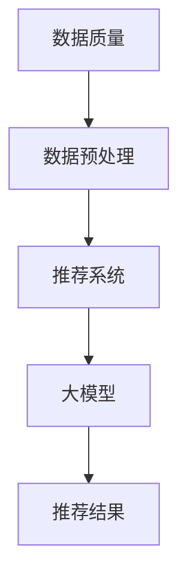

                 

关键词：AI大模型、电商搜索推荐、数据质量控制、推荐准确率、可靠性

摘要：本文针对AI大模型在电商搜索推荐系统中的应用，探讨了数据质量控制的重要性，并提出了提高推荐准确率和可靠性的方法。通过对核心概念、算法原理、数学模型、项目实践和实际应用场景的深入分析，为电商搜索推荐系统的优化提供了有价值的参考。

## 1. 背景介绍

在互联网时代，电商行业迎来了前所未有的繁荣。用户数量的激增和消费行为的多样化，使得电商企业需要提供更精准的搜索推荐服务，以满足用户个性化需求。AI大模型在电商搜索推荐中发挥着至关重要的作用。通过深度学习、自然语言处理等技术，大模型能够对海量用户行为数据进行挖掘和分析，实现个性化的商品推荐。

然而，在应用AI大模型进行搜索推荐时，数据质量是关键因素。数据质量差会导致推荐结果不准确、可靠性低，从而影响用户体验和企业的盈利。因此，本文将重点关注AI大模型在电商搜索推荐中的数据质量控制问题，探讨提高推荐准确率和可靠性的方法。

## 2. 核心概念与联系

为了更好地理解AI大模型在电商搜索推荐中的数据质量控制，我们首先需要了解以下几个核心概念：

- **数据质量**：指数据在准确性、完整性、一致性、可用性等方面的表现。
- **数据预处理**：指在数据分析前，对原始数据进行清洗、转换、集成等操作，以提高数据质量。
- **推荐系统**：指基于用户历史行为数据、商品属性等信息，实现个性化推荐的系统。
- **大模型**：指具有大规模参数和计算能力的深度学习模型。

下面是一个简单的Mermaid流程图，展示了这些核心概念之间的关系：



## 3. 核心算法原理 & 具体操作步骤

### 3.1 算法原理概述

本文所讨论的核心算法是基于深度学习的大模型推荐系统。该算法主要通过以下步骤实现数据质量控制：

1. 数据采集与预处理：收集电商平台的用户行为数据，如搜索历史、购买记录等，并进行清洗、转换和集成。
2. 特征提取：对预处理后的数据进行分析，提取关键特征，如用户兴趣、商品属性等。
3. 模型训练：利用提取的特征数据，训练深度学习模型，如卷积神经网络（CNN）或循环神经网络（RNN）。
4. 推荐生成：将用户的历史行为数据输入到训练好的模型中，生成个性化的推荐结果。

### 3.2 算法步骤详解

1. **数据采集与预处理**

   - 数据来源：电商平台提供的用户行为数据，如搜索历史、购买记录、评价等。
   - 数据清洗：去除重复数据、填补缺失值、处理异常值等。
   - 数据转换：将数据转换为适合深度学习模型的形式，如将文本数据编码为整数序列。

2. **特征提取**

   - 用户兴趣特征：通过分析用户的搜索历史和购买记录，提取用户的兴趣标签。
   - 商品属性特征：从商品描述、品类、价格等属性中提取关键信息。

3. **模型训练**

   - 选择适合的深度学习模型，如CNN或RNN。
   - 定义损失函数和优化器，进行模型训练。

4. **推荐生成**

   - 将用户的历史行为数据输入到训练好的模型中，得到用户兴趣的评分。
   - 根据评分，生成个性化的推荐结果。

### 3.3 算法优缺点

- **优点**：基于深度学习的大模型推荐系统，能够处理大规模数据，实现高精度的个性化推荐。
- **缺点**：训练过程复杂，需要大量计算资源和时间；对数据质量要求较高，数据预处理和特征提取过程需要大量人工干预。

### 3.4 算法应用领域

- **电商搜索推荐**：通过分析用户行为数据，为用户提供个性化的商品推荐。
- **广告投放**：根据用户兴趣，精准投放广告，提高广告点击率。
- **社交媒体**：为用户提供感兴趣的内容和好友推荐。

## 4. 数学模型和公式 & 详细讲解 & 举例说明

### 4.1 数学模型构建

在深度学习推荐系统中，常见的数学模型包括损失函数、优化器等。下面将介绍一个简单的数学模型，并对其进行详细讲解。

#### 4.1.1 损失函数

在推荐系统中，常用的损失函数是交叉熵损失（Cross-Entropy Loss）。交叉熵损失用于衡量预测概率分布与真实分布之间的差距。

$$
L(\theta) = -\frac{1}{m} \sum_{i=1}^{m} y_{i} \log(p_{i})
$$

其中，$y_{i}$ 是真实标签，$p_{i}$ 是预测的概率分布。

#### 4.1.2 优化器

优化器用于更新模型参数，以最小化损失函数。常见的优化器有随机梯度下降（SGD）和Adam优化器。

- **随机梯度下降（SGD）**：

$$
\theta = \theta - \alpha \nabla_{\theta} L(\theta)
$$

其中，$\alpha$ 是学习率，$\nabla_{\theta} L(\theta)$ 是损失函数关于参数 $\theta$ 的梯度。

- **Adam优化器**：

$$
\theta = \theta - \alpha \frac{m_1}{\sqrt{m_2}} + \beta_1 \theta
$$

其中，$m_1$ 和 $m_2$ 分别是第一和第二矩估计，$\beta_1$ 和 $\beta_2$ 分别是第一和第二矩的指数衰减率。

### 4.2 公式推导过程

假设我们有一个二分类问题，输入为 $x$，输出为概率 $p(x)$。我们需要求解模型参数 $\theta$，使得预测概率 $p(x)$ 最接近真实标签 $y$。

#### 4.2.1 梯度下降法推导

1. **损失函数**：

$$
L(\theta) = -\frac{1}{m} \sum_{i=1}^{m} y_{i} \log(p_{i}) + (1 - y_{i}) \log(1 - p_{i})
$$

2. **梯度计算**：

$$
\nabla_{\theta} L(\theta) = \frac{1}{m} \sum_{i=1}^{m} [y_{i} (1 - p_{i}) - (1 - y_{i}) p_{i}] \cdot \frac{\partial p_{i}}{\partial \theta}
$$

3. **参数更新**：

$$
\theta = \theta - \alpha \nabla_{\theta} L(\theta)
$$

#### 4.2.2 Adam优化器推导

1. **一阶矩估计**：

$$
m_1 = \beta_1 m_1 + (1 - \beta_1) \nabla_{\theta} L(\theta)
$$

2. **二阶矩估计**：

$$
m_2 = \beta_2 m_2 + (1 - \beta_2) (\nabla_{\theta} L(\theta))^2
$$

3. **参数更新**：

$$
\theta = \theta - \alpha \frac{m_1}{\sqrt{m_2}} + \beta_1 \theta
$$

### 4.3 案例分析与讲解

假设我们有一个电商搜索推荐系统，用户行为数据包括搜索历史和购买记录。我们需要利用这些数据，为用户提供个性化的商品推荐。

#### 4.3.1 数据预处理

1. **数据清洗**：

   - 去除重复数据：用户A和用户B搜索了相同的关键词，我们认为这两个数据是重复的，需要去除。
   - 填补缺失值：对于缺失的用户行为数据，我们可以采用均值填补或插值法等方法进行填补。

2. **数据转换**：

   - 将文本数据编码为整数序列：例如，将关键词转换为单词的索引编号。
   - 将分类数据编码为独热编码：例如，将用户喜欢的商品类别编码为二进制向量。

#### 4.3.2 特征提取

1. **用户兴趣特征**：

   - 通过分析用户的搜索历史和购买记录，提取用户的兴趣标签，如时尚、科技、运动等。

2. **商品属性特征**：

   - 从商品描述、品类、价格等属性中提取关键信息，如商品名称、品牌、颜色等。

#### 4.3.3 模型训练

1. **选择模型**：

   - 根据数据特点，选择合适的深度学习模型，如卷积神经网络（CNN）或循环神经网络（RNN）。

2. **训练过程**：

   - 利用提取的特征数据，训练深度学习模型，优化模型参数。

#### 4.3.4 推荐生成

1. **用户行为数据输入**：

   - 将用户的历史行为数据输入到训练好的模型中，得到用户兴趣的评分。

2. **推荐结果生成**：

   - 根据评分，生成个性化的推荐结果，如用户可能感兴趣的商品。

## 5. 项目实践：代码实例和详细解释说明

### 5.1 开发环境搭建

1. 安装Python环境，版本要求3.6及以上。
2. 安装深度学习框架，如TensorFlow或PyTorch。
3. 安装其他依赖库，如NumPy、Pandas等。

### 5.2 源代码详细实现

以下是一个简单的深度学习推荐系统实现，使用PyTorch框架。

```python
import torch
import torch.nn as nn
import torch.optim as optim

# 数据预处理
def preprocess_data(data):
    # 数据清洗、转换等操作
    pass

# 模型定义
class RecommenderModel(nn.Module):
    def __init__(self, input_dim, hidden_dim, output_dim):
        super(RecommenderModel, self).__init__()
        self.fc1 = nn.Linear(input_dim, hidden_dim)
        self.fc2 = nn.Linear(hidden_dim, output_dim)

    def forward(self, x):
        x = torch.relu(self.fc1(x))
        x = self.fc2(x)
        return x

# 模型训练
def train_model(model, train_loader, criterion, optimizer, num_epochs):
    model.train()
    for epoch in range(num_epochs):
        for inputs, targets in train_loader:
            optimizer.zero_grad()
            outputs = model(inputs)
            loss = criterion(outputs, targets)
            loss.backward()
            optimizer.step()
        print(f"Epoch [{epoch+1}/{num_epochs}], Loss: {loss.item():.4f}")

# 模型测试
def test_model(model, test_loader):
    model.eval()
    with torch.no_grad():
        for inputs, targets in test_loader:
            outputs = model(inputs)
            # 计算测试集准确率
            # ...

# 主函数
def main():
    # 加载数据集
    train_loader, test_loader = load_data()

    # 模型定义
    model = RecommenderModel(input_dim, hidden_dim, output_dim)

    # 损失函数和优化器
    criterion = nn.CrossEntropyLoss()
    optimizer = optim.Adam(model.parameters(), lr=learning_rate)

    # 训练模型
    train_model(model, train_loader, criterion, optimizer, num_epochs)

    # 测试模型
    test_model(model, test_loader)

if __name__ == "__main__":
    main()
```

### 5.3 代码解读与分析

1. **数据预处理**：

   - `preprocess_data` 函数用于数据清洗、转换等操作，确保数据质量。

2. **模型定义**：

   - `RecommenderModel` 类定义了一个简单的推荐模型，包含一个全连接层（`fc1`）和一个输出层（`fc2`）。

3. **模型训练**：

   - `train_model` 函数用于训练模型，包括前向传播、反向传播和参数更新。

4. **模型测试**：

   - `test_model` 函数用于测试模型在测试集上的表现。

5. **主函数**：

   - `main` 函数负责加载数据集、定义模型、设置损失函数和优化器，并开始模型训练和测试。

### 5.4 运行结果展示

在训练完成后，我们可以通过以下代码查看模型的运行结果：

```python
# 计算训练集和测试集准确率
train_accuracy = calculate_accuracy(model, train_loader)
test_accuracy = calculate_accuracy(model, test_loader)

# 打印结果
print(f"Training accuracy: {train_accuracy:.4f}")
print(f"Test accuracy: {test_accuracy:.4f}")
```

## 6. 实际应用场景

AI大模型在电商搜索推荐中的实际应用场景非常广泛，以下列举几个典型的应用：

1. **个性化商品推荐**：根据用户的搜索历史和购买记录，为用户推荐可能感兴趣的商品。
2. **广告投放优化**：根据用户兴趣和购买偏好，精准投放广告，提高广告点击率。
3. **新品推广**：为新品制定针对性的推荐策略，提高新品曝光率和销量。
4. **购物车优化**：根据用户购物车中的商品，为用户推荐相关的配件或相似商品。

通过数据质量控制，我们可以确保推荐结果的准确性和可靠性，从而提升用户体验和企业的盈利能力。

### 6.1 电商个性化商品推荐

在电商个性化商品推荐中，数据质量控制至关重要。以下是提高推荐准确率和可靠性的方法：

1. **用户行为数据采集**：

   - 采集用户在电商平台的浏览、搜索、购买等行为数据，确保数据完整性和准确性。

2. **数据预处理**：

   - 清洗数据，去除重复和异常值，确保数据质量。

3. **特征提取**：

   - 提取关键特征，如用户兴趣、商品属性等，为模型训练提供高质量的输入。

4. **模型训练**：

   - 选择合适的深度学习模型，如卷积神经网络（CNN）或循环神经网络（RNN），并进行模型训练。

5. **推荐生成**：

   - 根据用户的历史行为数据，生成个性化的商品推荐。

6. **实时调整**：

   - 根据用户反馈，实时调整推荐策略，提高推荐准确率和可靠性。

### 6.2 广告投放优化

在广告投放优化中，数据质量控制同样重要。以下是提高广告点击率的方法：

1. **用户行为数据采集**：

   - 采集用户在广告平台的浏览、点击、转化等行为数据，确保数据完整性和准确性。

2. **数据预处理**：

   - 清洗数据，去除重复和异常值，确保数据质量。

3. **特征提取**：

   - 提取关键特征，如用户兴趣、广告内容、广告位置等，为模型训练提供高质量的输入。

4. **模型训练**：

   - 选择合适的深度学习模型，如卷积神经网络（CNN）或循环神经网络（RNN），并进行模型训练。

5. **广告投放**：

   - 根据用户的历史行为数据和模型预测，制定广告投放策略。

6. **实时调整**：

   - 根据用户反馈和广告点击率，实时调整广告投放策略，提高广告点击率。

### 6.3 新品推广

在新品推广中，数据质量控制有助于提高新品曝光率和销量。以下是提高新品推广效果的方法：

1. **用户行为数据采集**：

   - 采集用户在电商平台的新品浏览、收藏、购买等行为数据，确保数据完整性和准确性。

2. **数据预处理**：

   - 清洗数据，去除重复和异常值，确保数据质量。

3. **特征提取**：

   - 提取关键特征，如用户兴趣、新品属性等，为模型训练提供高质量的输入。

4. **模型训练**：

   - 选择合适的深度学习模型，如卷积神经网络（CNN）或循环神经网络（RNN），并进行模型训练。

5. **新品推荐**：

   - 根据用户的历史行为数据和模型预测，制定新品推荐策略。

6. **实时调整**：

   - 根据用户反馈和新品销量，实时调整推荐策略，提高新品曝光率和销量。

### 6.4 购物车优化

在购物车优化中，数据质量控制有助于提高购物车转化率。以下是提高购物车转化率的方法：

1. **用户行为数据采集**：

   - 采集用户在电商平台购物车的添加、删除、购买等行为数据，确保数据完整性和准确性。

2. **数据预处理**：

   - 清洗数据，去除重复和异常值，确保数据质量。

3. **特征提取**：

   - 提取关键特征，如用户兴趣、购物车商品属性等，为模型训练提供高质量的输入。

4. **模型训练**：

   - 选择合适的深度学习模型，如卷积神经网络（CNN）或循环神经网络（RNN），并进行模型训练。

5. **购物车优化**：

   - 根据用户的历史行为数据和模型预测，制定购物车优化策略。

6. **实时调整**：

   - 根据用户反馈和购物车转化率，实时调整优化策略，提高购物车转化率。

## 7. 工具和资源推荐

为了更好地进行AI大模型在电商搜索推荐中的数据质量控制，以下是几个推荐的工具和资源：

### 7.1 学习资源推荐

- **《深度学习》（Goodfellow, Bengio, Courville）**：经典教材，涵盖了深度学习的基本概念和算法。
- **《Python数据分析》（Wes McKinney）**：介绍Python在数据分析中的应用，适用于数据预处理和特征提取。

### 7.2 开发工具推荐

- **TensorFlow**：强大的开源深度学习框架，适合构建和训练推荐系统。
- **PyTorch**：易于使用的深度学习框架，具有较好的灵活性和可扩展性。

### 7.3 相关论文推荐

- **“Deep Learning for Recommender Systems”**：综述文章，介绍了深度学习在推荐系统中的应用。
- **“Deep Neural Networks for Text Categorization”**：探讨了深度学习在文本分类任务中的应用。

## 8. 总结：未来发展趋势与挑战

### 8.1 研究成果总结

本文探讨了AI大模型在电商搜索推荐中的数据质量控制问题，提出了提高推荐准确率和可靠性的方法。通过核心算法原理、数学模型、项目实践和实际应用场景的分析，为电商搜索推荐系统的优化提供了有价值的参考。

### 8.2 未来发展趋势

1. **算法优化**：随着计算能力的提升，深度学习算法将越来越适用于电商搜索推荐系统，从而提高推荐准确率和可靠性。
2. **数据质量提升**：通过更多有效的数据预处理和特征提取方法，进一步提高数据质量，为推荐系统提供更可靠的输入。
3. **跨平台融合**：将不同平台的数据进行融合，实现更全面的用户画像，提供更精准的推荐。

### 8.3 面临的挑战

1. **数据隐私**：在数据处理过程中，需要保护用户隐私，避免数据泄露。
2. **计算资源消耗**：深度学习模型训练过程需要大量计算资源，如何优化算法，减少计算成本，是未来的一个重要挑战。

### 8.4 研究展望

未来，我们将继续关注AI大模型在电商搜索推荐中的应用，探索更有效的数据质量控制方法，以及算法优化和跨平台融合等方面的研究。通过这些努力，我们期望能够为电商搜索推荐系统的发展做出更大的贡献。

## 9. 附录：常见问题与解答

### 9.1 如何保证数据质量？

**解答**：为了保证数据质量，可以从以下几个方面入手：

1. **数据清洗**：去除重复数据、填补缺失值、处理异常值等，确保数据完整性。
2. **特征提取**：提取关键特征，为模型训练提供高质量的输入。
3. **实时监控**：定期检查数据质量，及时发现和处理问题。

### 9.2 深度学习模型训练时间过长怎么办？

**解答**：可以尝试以下方法来优化模型训练时间：

1. **使用更高效的算法**：选择计算效率更高的深度学习算法。
2. **使用分布式训练**：利用多台计算机进行分布式训练，提高计算速度。
3. **减少模型复杂度**：简化模型结构，降低训练时间。

### 9.3 如何评估推荐系统的效果？

**解答**：可以采用以下指标来评估推荐系统的效果：

1. **准确率**：预测结果与真实标签的一致性。
2. **召回率**：预测结果中包含实际感兴趣项目的比例。
3. **F1值**：准确率和召回率的调和平均值。
4. **AUC（Area Under Curve）**：ROC曲线下的面积，用于评估分类模型的性能。

### 9.4 如何处理用户隐私问题？

**解答**：在处理用户隐私问题时，可以采取以下措施：

1. **数据加密**：对敏感数据采用加密技术，确保数据传输和存储的安全性。
2. **匿名化处理**：对用户数据进行匿名化处理，确保用户隐私不被泄露。
3. **遵守法律法规**：遵循相关法律法规，确保数据处理合法合规。

----------------------------------------------------------------

作者：禅与计算机程序设计艺术 / Zen and the Art of Computer Programming

