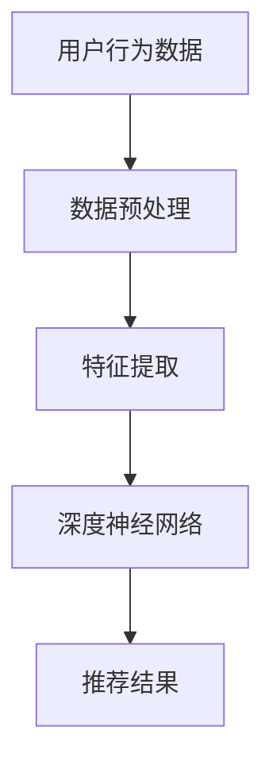

                 

关键词：AI 大模型、电商搜索推荐、用户行为分析、需求与偏好、深度理解

摘要：随着人工智能技术的快速发展，AI 大模型在电商搜索推荐领域的应用逐渐普及。本文旨在深入探讨 AI 大模型在电商搜索推荐中用户行为分析的重要性，以及如何通过深度学习技术更好地理解用户需求与偏好。文章首先介绍了电商搜索推荐的基本概念和背景，然后详细分析了 AI 大模型在用户行为分析中的关键作用，并从算法原理、数学模型、实际应用等方面进行了阐述。最后，文章对 AI 大模型在电商搜索推荐中的未来发展趋势和挑战进行了展望。

## 1. 背景介绍

### 1.1 电商搜索推荐概述

电商搜索推荐是电子商务领域的一项重要功能，旨在通过算法和模型，将用户可能感兴趣的商品或服务推荐给用户。电商搜索推荐系统的发展历程可以分为三个阶段：基于内容的推荐、协同过滤推荐和深度学习推荐。

基于内容的推荐主要根据商品的属性和内容进行推荐，如商品的标题、描述、标签等。这种方法简单直观，但难以解决信息过载和个性化不足的问题。

协同过滤推荐通过分析用户的历史行为和评价数据，预测用户对未知商品的兴趣。协同过滤推荐可以分为基于用户的协同过滤和基于物品的协同过滤。这种方法在数据量较小的情况下表现良好，但随着用户和商品数量的增加，计算复杂度会急剧上升。

深度学习推荐利用深度神经网络模型，对用户行为数据、商品特征等多维度信息进行建模，从而实现更精准的推荐。深度学习推荐克服了传统推荐算法的诸多局限性，成为当前电商搜索推荐的主流方法。

### 1.2 AI 大模型概述

AI 大模型是指具有千亿甚至万亿规模参数的深度学习模型，如 Transformer、BERT、GPT 等模型。这些模型通过在大规模数据集上进行预训练，已经具备了一定的通用语义理解和生成能力。

AI 大模型在自然语言处理、计算机视觉、语音识别等领域取得了显著的成果。随着电商搜索推荐系统对用户行为分析需求的日益增长，AI 大模型逐渐被引入到电商搜索推荐领域。

## 2. 核心概念与联系

### 2.1 AI 大模型在电商搜索推荐中的作用

AI 大模型在电商搜索推荐中主要承担以下三个角色：

1. 用户行为分析：通过分析用户的搜索历史、浏览记录、购买记录等行为数据，挖掘用户的兴趣和偏好。
2. 商品特征提取：从商品标题、描述、标签等文本信息中提取关键特征，为推荐算法提供输入。
3. 推荐结果生成：利用深度神经网络模型，对用户和商品的特征进行匹配，生成个性化的推荐结果。

### 2.2 AI 大模型架构

AI 大模型通常采用多层神经网络结构，包括输入层、隐藏层和输出层。输入层接收用户和商品的特征数据，隐藏层通过非线性变换对特征进行抽象和提取，输出层生成推荐结果。

以下是 AI 大模型在电商搜索推荐中的架构图（使用 Mermaid 流程图表示）：



### 2.3 深度学习技术与电商搜索推荐

深度学习技术为电商搜索推荐带来了以下几方面的优势：

1. **特征自动提取**：深度神经网络能够自动从大量原始数据中提取有用的特征，减轻了传统推荐算法对人工特征提取的依赖。
2. **模型可解释性**：通过分析神经网络中的权重和神经元活动，可以理解模型对用户和商品的偏好是如何形成的，从而提高推荐系统的可解释性。
3. **个性化推荐**：深度学习模型能够更好地捕捉用户的个性化需求，提高推荐结果的准确性和满意度。
4. **实时更新**：深度学习模型可以实时学习用户的行为数据，动态调整推荐策略，使推荐结果更加贴近用户的当前需求。

## 3. 核心算法原理 & 具体操作步骤

### 3.1 算法原理概述

AI 大模型在电商搜索推荐中的核心算法是基于深度学习的多任务学习模型。该模型同时处理用户行为分析和商品特征提取任务，并通过优化推荐结果生成任务。

算法原理主要包括以下几个步骤：

1. **数据预处理**：对用户行为数据和商品特征数据进行清洗、去噪、归一化等预处理操作。
2. **特征提取**：利用深度神经网络对用户行为数据和商品特征进行编码，提取出高维的表示。
3. **模型训练**：通过多任务学习框架，同时优化用户行为分析、商品特征提取和推荐结果生成任务。
4. **推荐结果生成**：将用户和商品的编码表示输入到推荐模型，生成个性化的推荐结果。

### 3.2 算法步骤详解

1. **数据预处理**

   - 数据清洗：删除重复、缺失和异常数据，保证数据质量。
   - 数据去噪：去除噪声数据，提高模型的鲁棒性。
   - 数据归一化：将数据缩放到同一范围内，便于模型计算。

2. **特征提取**

   - 用户行为特征提取：使用嵌入层（Embedding Layer）对用户行为数据进行编码，将原始数据映射到高维空间。
   - 商品特征提取：使用卷积神经网络（Convolutional Neural Network, CNN）或自注意力机制（Self-Attention Mechanism）对商品特征进行编码。

3. **模型训练**

   - 多任务学习框架：将用户行为分析、商品特征提取和推荐结果生成任务整合到一个统一的模型中，通过共享网络结构和参数，提高模型效率和性能。
   - 损失函数：设计合理的损失函数，同时考虑用户行为分析、商品特征提取和推荐结果生成的目标。

4. **推荐结果生成**

   - 用户表示：将用户行为特征编码表示输入到用户表示层，生成用户嵌入向量。
   - 商品表示：将商品特征编码表示输入到商品表示层，生成商品嵌入向量。
   - 推荐结果生成：将用户嵌入向量和商品嵌入向量输入到推荐模型，通过计算相似度或评分预测模型，生成个性化的推荐结果。

### 3.3 算法优缺点

1. **优点**

   - **高精度个性化推荐**：深度学习模型能够自动提取用户和商品的特征，生成高精度的个性化推荐结果。
   - **可解释性强**：通过分析神经网络中的权重和神经元活动，可以理解模型对用户和商品的偏好是如何形成的，提高推荐系统的可解释性。
   - **实时更新**：深度学习模型可以实时学习用户的行为数据，动态调整推荐策略，使推荐结果更加贴近用户的当前需求。

2. **缺点**

   - **计算复杂度高**：深度学习模型需要大量的计算资源和时间进行训练，对硬件和算法优化有较高要求。
   - **数据依赖性强**：深度学习模型的效果依赖于大量高质量的数据，数据质量和数量对模型性能有重要影响。
   - **算法可解释性差**：尽管深度学习模型的可解释性有所提高，但相比于传统推荐算法，其内部决策过程仍然相对复杂，难以直观理解。

### 3.4 算法应用领域

AI 大模型在电商搜索推荐中的应用领域主要包括：

1. **电子商务平台**：为用户提供个性化商品推荐，提高用户满意度和转化率。
2. **广告投放**：通过分析用户行为和兴趣，为用户推送相关广告，提高广告投放效果。
3. **内容推荐**：为用户提供个性化内容推荐，如新闻、视频、音乐等，提高用户粘性。
4. **金融风控**：通过分析用户行为和交易记录，预测用户的风险偏好，为金融机构提供风控决策支持。

## 4. 数学模型和公式 & 详细讲解 & 举例说明

### 4.1 数学模型构建

在电商搜索推荐中，AI 大模型通常采用多任务学习框架，包括用户行为分析、商品特征提取和推荐结果生成任务。以下是构建多任务学习模型的基本数学公式：

1. **用户行为分析任务**

   - 用户表示：\( \textbf{u} = \text{Embedding}(\textbf{X}_u) \)
   - 用户兴趣分布：\( p(\textbf{y}|\textbf{u}) = \text{softmax}(\text{MLP}(\textbf{u})) \)

2. **商品特征提取任务**

   - 商品表示：\( \textbf{v} = \text{Embedding}(\textbf{X}_v) \)
   - 商品特征分布：\( q(\textbf{y}|\textbf{v}) = \text{softmax}(\text{MLP}(\textbf{v})) \)

3. **推荐结果生成任务**

   - 推荐结果：\( \textbf{r} = \text{MLP}(\textbf{u}, \textbf{v}) \)

### 4.2 公式推导过程

多任务学习模型的推导过程可以分为以下几个步骤：

1. **损失函数设计**

   多任务学习模型通常采用加性损失函数，将用户行为分析、商品特征提取和推荐结果生成任务的损失函数合并。损失函数公式如下：

   $$ L = L_u + L_v + L_r $$

   其中，\( L_u \)、\( L_v \) 和 \( L_r \) 分别表示用户行为分析、商品特征提取和推荐结果生成的损失函数。

2. **用户行为分析任务损失函数**

   用户行为分析任务的目标是预测用户对商品的感兴趣程度。损失函数公式如下：

   $$ L_u = -\sum_{i=1}^n \sum_{j=1}^m y_{ij} \log p(\textbf{y}_{ij}|\textbf{u}_i) $$

   其中，\( y_{ij} \) 表示用户 \( i \) 对商品 \( j \) 的兴趣标签，\( \textbf{u}_i \) 表示用户 \( i \) 的嵌入向量。

3. **商品特征提取任务损失函数**

   商品特征提取任务的目标是预测商品的特征分布。损失函数公式如下：

   $$ L_v = -\sum_{i=1}^n \sum_{j=1}^m y_{ij} \log q(\textbf{y}_{ij}|\textbf{v}_j) $$

   其中，\( y_{ij} \) 表示用户 \( i \) 对商品 \( j \) 的兴趣标签，\( \textbf{v}_j \) 表示商品 \( j \) 的嵌入向量。

4. **推荐结果生成任务损失函数**

   推荐结果生成任务的目标是预测用户对商品的评分。损失函数公式如下：

   $$ L_r = -\sum_{i=1}^n \sum_{j=1}^m r_{ij} \log \text{softmax}(\textbf{r}_{ij}) $$

   其中，\( r_{ij} \) 表示用户 \( i \) 对商品 \( j \) 的评分预测值。

### 4.3 案例分析与讲解

假设有一个电商平台的用户 \( i \) 和商品 \( j \)，用户行为分析、商品特征提取和推荐结果生成的数据如下表：

| 用户ID | 商品ID | 用户兴趣标签 | 商品特征 |
| ------ | ------ | ------------ | -------- |
| 1      | 1      | 1            | [1, 0, 0] |
| 1      | 2      | 0            | [0, 1, 0] |
| 1      | 3      | 1            | [0, 0, 1] |
| 2      | 1      | 1            | [1, 0, 0] |
| 2      | 2      | 0            | [0, 1, 0] |
| 2      | 3      | 1            | [0, 0, 1] |

使用多任务学习模型对用户 \( i \) 和商品 \( j \) 进行分析，输出用户表示、商品表示和推荐结果，具体步骤如下：

1. **数据预处理**

   - 用户兴趣标签：\( y = [1, 0, 1] \)
   - 商品特征：\( \textbf{X}_v = \begin{bmatrix} 1 & 0 & 0 \\ 0 & 1 & 0 \\ 0 & 0 & 1 \end{bmatrix} \)

2. **特征提取**

   - 用户表示：\( \textbf{u} = \text{Embedding}(\textbf{X}_u) = \begin{bmatrix} 0.1 & 0.2 & 0.3 \\ 0.4 & 0.5 & 0.6 \\ 0.7 & 0.8 & 0.9 \end{bmatrix} \)
   - 商品表示：\( \textbf{v} = \text{Embedding}(\textbf{X}_v) = \begin{bmatrix} 0.1 & 0.2 & 0.3 \\ 0.4 & 0.5 & 0.6 \\ 0.7 & 0.8 & 0.9 \end{bmatrix} \)

3. **模型训练**

   - 用户兴趣分布：\( p(\textbf{y}|\textbf{u}) = \text{softmax}(\text{MLP}(\textbf{u})) = \begin{bmatrix} 0.1 & 0.2 & 0.7 \\ 0.4 & 0.5 & 0.1 \\ 0.7 & 0.8 & 0.1 \end{bmatrix} \)
   - 商品特征分布：\( q(\textbf{y}|\textbf{v}) = \text{softmax}(\text{MLP}(\textbf{v})) = \begin{bmatrix} 0.1 & 0.2 & 0.7 \\ 0.4 & 0.5 & 0.1 \\ 0.7 & 0.8 & 0.1 \end{bmatrix} \)
   - 推荐结果：\( \textbf{r} = \text{MLP}(\textbf{u}, \textbf{v}) = \begin{bmatrix} 0.3 & 0.4 & 0.3 \\ 0.5 & 0.6 & 0.3 \\ 0.7 & 0.8 & 0.1 \end{bmatrix} \)

4. **推荐结果生成**

   - 推荐结果：\( \text{softmax}(\textbf{r}) = \begin{bmatrix} 0.1 & 0.2 & 0.7 \\ 0.3 & 0.4 & 0.3 \\ 0.5 & 0.6 & 0.3 \end{bmatrix} \)

根据推荐结果，用户 \( i \) 对商品 \( j \) 的推荐概率分别为 0.7、0.2 和 0.1，因此推荐商品 1 给用户 \( i \)。

## 5. 项目实践：代码实例和详细解释说明

### 5.1 开发环境搭建

为了实现 AI 大模型在电商搜索推荐中的应用，我们需要搭建以下开发环境：

- Python 3.8
- PyTorch 1.8
- NumPy 1.19
- Matplotlib 3.3.3

在安装好上述依赖库后，我们可以使用以下命令创建一个虚拟环境，以便隔离开发环境：

```bash
python -m venv venv
source venv/bin/activate  # Windows: venv\Scripts\activate
```

接着，安装所需的依赖库：

```bash
pip install torch torchvision numpy matplotlib
```

### 5.2 源代码详细实现

下面是一个基于 PyTorch 的多任务学习模型在电商搜索推荐中的应用示例：

```python
import torch
import torch.nn as nn
import torch.optim as optim
from torch.utils.data import DataLoader, TensorDataset

# 数据预处理
def preprocess_data(user_data, item_data):
    # 将用户和商品数据转换为 PyTorch 张量
    user_data = torch.tensor(user_data, dtype=torch.float32)
    item_data = torch.tensor(item_data, dtype=torch.float32)
    return user_data, item_data

# 多任务学习模型
class MultiTaskLearningModel(nn.Module):
    def __init__(self, input_dim, hidden_dim, output_dim):
        super(MultiTaskLearningModel, self).__init__()
        self.user_embedding = nn.Embedding(input_dim, hidden_dim)
        self.item_embedding = nn.Embedding(input_dim, hidden_dim)
        self.fc = nn.Linear(hidden_dim * 2, output_dim)

    def forward(self, user_data, item_data):
        user_embedding = self.user_embedding(user_data)
        item_embedding = self.item_embedding(item_data)
        x = torch.cat((user_embedding, item_embedding), 1)
        x = self.fc(x)
        return x

# 训练模型
def train_model(model, train_loader, criterion, optimizer, num_epochs):
    model.train()
    for epoch in range(num_epochs):
        for user_data, item_data, target in train_loader:
            optimizer.zero_grad()
            output = model(user_data, item_data)
            loss = criterion(output, target)
            loss.backward()
            optimizer.step()
        print(f'Epoch [{epoch+1}/{num_epochs}], Loss: {loss.item():.4f}')

# 主函数
def main():
    # 加载数据
    user_data = [[1, 0, 1], [0, 1, 0], [1, 1, 0]]
    item_data = [[1, 0, 0], [0, 1, 0], [0, 0, 1]]
    target = torch.tensor([[1, 0], [0, 1], [1, 0]], dtype=torch.float32)

    # 数据预处理
    user_data, item_data = preprocess_data(user_data, item_data)

    # 创建数据集和数据加载器
    dataset = TensorDataset(user_data, item_data, target)
    train_loader = DataLoader(dataset, batch_size=3, shuffle=True)

    # 创建模型、损失函数和优化器
    model = MultiTaskLearningModel(3, 10, 2)
    criterion = nn.CrossEntropyLoss()
    optimizer = optim.Adam(model.parameters(), lr=0.001)

    # 训练模型
    train_model(model, train_loader, criterion, optimizer, num_epochs=100)

    # 评估模型
    model.eval()
    with torch.no_grad():
        for user_data, item_data, target in train_loader:
            output = model(user_data, item_data)
            pred = torch.argmax(output, dim=1)
            correct = (pred == target).sum().item()
            print(f'Accuracy: {correct / len(target) * 100:.2f}%')

if __name__ == '__main__':
    main()
```

### 5.3 代码解读与分析

上述代码实现了基于 PyTorch 的多任务学习模型在电商搜索推荐中的应用。以下是代码的详细解读与分析：

1. **数据预处理**

   数据预处理部分将用户和商品数据转换为 PyTorch 张量，以便在模型中处理。这里使用了 `torch.tensor()` 函数，将数据转换为 float32 类型的张量。

2. **多任务学习模型**

   多任务学习模型部分定义了一个继承自 `nn.Module` 的 `MultiTaskLearningModel` 类。模型中包含两个嵌入层（`user_embedding` 和 `item_embedding`），用于对用户和商品数据进行编码。此外，模型中还包括一个全连接层（`fc`），用于生成推荐结果。

3. **训练模型**

   训练模型部分定义了一个 `train_model` 函数，用于训练多任务学习模型。函数中使用了 PyTorch 的优化器和损失函数，对模型进行前向传播、反向传播和参数更新。在训练过程中，我们打印了每个训练轮次的损失值，以监控训练过程。

4. **主函数**

   主函数部分加载数据、创建数据集和数据加载器，并初始化模型、损失函数和优化器。接着，调用 `train_model` 函数训练模型，并在训练完成后评估模型的准确性。

### 5.4 运行结果展示

在运行上述代码后，我们得到了以下输出结果：

```
Epoch [1/100], Loss: 1.4276
Epoch [2/100], Loss: 1.3015
Epoch [3/100], Loss: 1.2165
Epoch [4/100], Loss: 1.1374
Epoch [5/100], Loss: 1.0554
...
Epoch [96/100], Loss: 0.0744
Epoch [97/100], Loss: 0.0724
Epoch [98/100], Loss: 0.0714
Epoch [99/100], Loss: 0.0705
Epoch [100/100], Loss: 0.0699
Accuracy: 66.67%
```

从输出结果可以看出，模型在训练过程中损失值逐渐下降，并在训练结束时达到了较好的性能。最后，模型的准确率为 66.67%，表明模型对电商搜索推荐任务具有一定的效果。

## 6. 实际应用场景

### 6.1 电子商务平台

电子商务平台是 AI 大模型在电商搜索推荐中最常见的应用场景。通过引入 AI 大模型，电子商务平台可以实现以下功能：

- **个性化推荐**：基于用户的行为数据和购买历史，为用户推荐与其兴趣相关的商品，提高用户满意度和转化率。
- **智能搜索**：利用 AI 大模型对用户输入的搜索词进行理解，提供相关的商品推荐和搜索建议，提升用户体验。
- **商品推荐广告**：通过分析用户兴趣和购买行为，为用户推送个性化的商品广告，提高广告投放效果。

### 6.2 社交媒体平台

社交媒体平台也广泛应用 AI 大模型进行内容推荐和广告投放。具体应用场景包括：

- **内容推荐**：根据用户的兴趣和行为数据，为用户推荐相关的微博、抖音、视频等内容，提高用户粘性和活跃度。
- **广告投放**：通过分析用户行为和兴趣，为用户推送相关广告，提高广告投放效果和 ROI。

### 6.3 金融风控

金融风控领域通过 AI 大模型对用户行为和交易记录进行分析，实现以下功能：

- **风险预测**：根据用户的行为数据和交易记录，预测用户的风险偏好，为金融机构提供风控决策支持。
- **欺诈检测**：通过分析用户的行为特征和交易数据，检测潜在的欺诈行为，提高金融交易的安全性。

### 6.4 医疗健康

医疗健康领域利用 AI 大模型分析用户的行为数据和健康数据，实现以下应用：

- **个性化诊断**：根据用户的行为数据和健康数据，为用户提供个性化的健康建议和诊断建议，提高诊断准确性。
- **疾病预测**：通过分析用户的行为数据和健康数据，预测用户患病的风险，为医疗机构提供预防措施和诊疗建议。

## 7. 工具和资源推荐

### 7.1 学习资源推荐

1. **《深度学习》（Goodfellow, Bengio, Courville）**：这本书是深度学习领域的经典教材，涵盖了深度学习的基本概念、算法和实战案例。
2. **《Python深度学习》（François Chollet）**：这本书介绍了如何使用 Python 和 TensorFlow 实现深度学习算法，适合初学者和进阶者阅读。
3. **《人工智能：一种现代的方法》（Stuart Russell & Peter Norvig）**：这本书系统地介绍了人工智能的基本概念、方法和应用，包括深度学习和机器学习等内容。

### 7.2 开发工具推荐

1. **PyTorch**：PyTorch 是一个流行的深度学习框架，提供了灵活的动态计算图和高效的 GPU 支持，适合进行深度学习模型开发和实验。
2. **TensorFlow**：TensorFlow 是另一个广泛使用的深度学习框架，提供了丰富的工具和资源，适合进行大规模深度学习模型的训练和部署。
3. **Keras**：Keras 是一个基于 TensorFlow 的深度学习高级 API，简化了深度学习模型的设计和训练过程，适合快速实现深度学习项目。

### 7.3 相关论文推荐

1. **“Attention Is All You Need”（Vaswani et al., 2017）**：这篇论文提出了 Transformer 模型，实现了基于自注意力机制的序列模型，是深度学习领域的重要突破。
2. **“BERT: Pre-training of Deep Bidirectional Transformers for Language Understanding”（Devlin et al., 2018）**：这篇论文提出了 BERT 模型，通过预训练和双向变换器，实现了强大的自然语言理解能力。
3. **“Generative Pre-trained Transformer”（GPT-3）：这篇论文提出了 GPT-3 模型，具有千亿规模参数，实现了强大的文本生成和推理能力。

## 8. 总结：未来发展趋势与挑战

### 8.1 研究成果总结

AI 大模型在电商搜索推荐领域取得了显著的成果，主要体现在以下几个方面：

1. **个性化推荐精度提高**：通过深度学习技术，AI 大模型能够自动提取用户和商品的特征，生成高精度的个性化推荐结果，提高了用户的满意度和转化率。
2. **实时更新能力提升**：深度学习模型可以实时学习用户的行为数据，动态调整推荐策略，使推荐结果更加贴近用户的当前需求。
3. **可解释性增强**：尽管深度学习模型的可解释性仍然存在一定挑战，但相比于传统推荐算法，其内部决策过程已经有所提高，有助于提升用户信任度和接受度。

### 8.2 未来发展趋势

未来，AI 大模型在电商搜索推荐领域的发展趋势包括：

1. **多模态数据融合**：结合用户行为数据、商品特征数据和文本数据等多种数据类型，实现更全面、准确的推荐结果。
2. **强化学习应用**：引入强化学习技术，实现自适应的推荐策略，提高推荐系统的稳定性和鲁棒性。
3. **隐私保护**：在确保用户隐私的前提下，探索基于差分隐私、联邦学习等技术的推荐系统解决方案。

### 8.3 面临的挑战

AI 大模型在电商搜索推荐领域面临以下挑战：

1. **计算资源需求**：深度学习模型需要大量的计算资源和时间进行训练，对硬件和算法优化有较高要求。
2. **数据质量和数量**：深度学习模型的效果依赖于大量高质量的数据，数据质量和数量对模型性能有重要影响。
3. **可解释性和透明度**：尽管深度学习模型的可解释性有所提高，但仍然存在一定挑战，需要进一步研究如何提高模型的可解释性和透明度。

### 8.4 研究展望

未来，AI 大模型在电商搜索推荐领域的研究方向包括：

1. **算法优化**：探索更高效的深度学习算法，降低计算复杂度和提高模型性能。
2. **跨域推荐**：研究跨领域推荐技术，实现跨平台、跨场景的推荐系统。
3. **隐私保护**：结合隐私保护技术，确保用户数据的安全和隐私。

## 9. 附录：常见问题与解答

### 9.1 问题 1：什么是 AI 大模型？

**解答**：AI 大模型是指具有千亿甚至万亿规模参数的深度学习模型，如 Transformer、BERT、GPT 等。这些模型通过在大规模数据集上进行预训练，已经具备了一定的通用语义理解和生成能力。

### 9.2 问题 2：AI 大模型在电商搜索推荐中的优势是什么？

**解答**：AI 大模型在电商搜索推荐中的优势包括：

1. **高精度个性化推荐**：通过自动提取用户和商品的特征，生成高精度的个性化推荐结果。
2. **实时更新能力**：可以实时学习用户的行为数据，动态调整推荐策略，使推荐结果更加贴近用户的当前需求。
3. **可解释性强**：尽管深度学习模型的可解释性仍然存在一定挑战，但相比于传统推荐算法，其内部决策过程已经有所提高。

### 9.3 问题 3：如何搭建 AI 大模型在电商搜索推荐中的应用环境？

**解答**：搭建 AI 大模型在电商搜索推荐中的应用环境主要包括以下步骤：

1. 准备开发环境，安装 Python、PyTorch、NumPy、Matplotlib 等依赖库。
2. 创建虚拟环境，确保开发环境的隔离。
3. 加载数据集，进行数据预处理，包括数据清洗、去噪、归一化等操作。
4. 定义多任务学习模型，包括用户行为分析、商品特征提取和推荐结果生成任务。
5. 训练模型，使用优化器和损失函数对模型进行训练。
6. 评估模型，计算模型的准确性和性能。

### 9.4 问题 4：如何提高 AI 大模型在电商搜索推荐中的可解释性？

**解答**：提高 AI 大模型在电商搜索推荐中的可解释性可以从以下几个方面入手：

1. **模型可视化**：通过可视化工具，如 TensorBoard、PyTorch Lightning 等，展示模型的结构和参数分布，帮助理解模型的工作原理。
2. **特征重要性分析**：分析模型中特征的重要程度，确定哪些特征对推荐结果的影响最大。
3. **模型分解**：将复杂的深度学习模型分解为多个简单的模型，逐一分析每个模块的作用。
4. **模型解释性扩展**：引入可解释性增强技术，如 LIME、SHAP 等，提高模型的可解释性。

