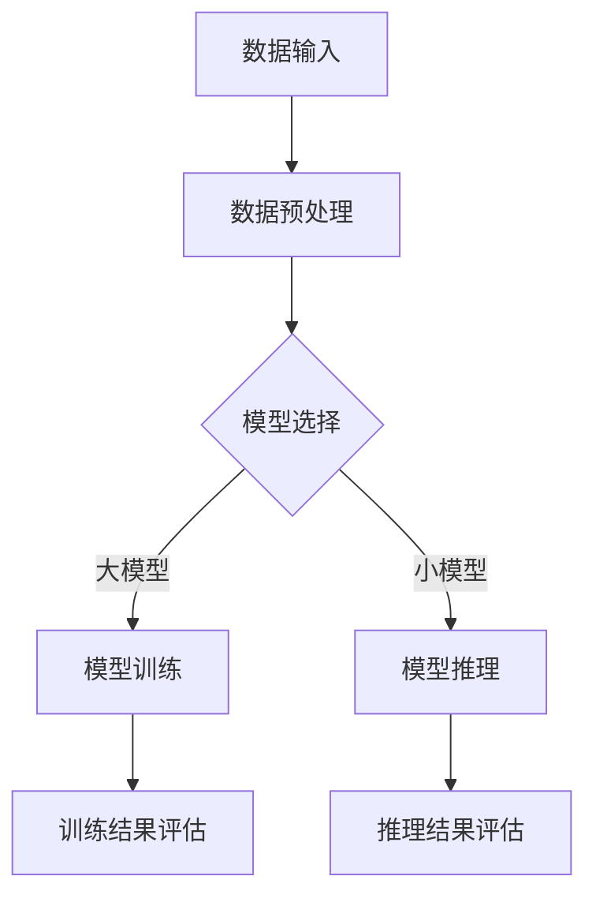

                 

关键词：AI大模型、数据中心建设、成本优化、性能提升、资源调度、绿色节能、云计算、边缘计算

> 摘要：本文将探讨在AI大模型应用场景下，如何通过数据中心建设实现成本优化。我们将详细分析数据中心建设的核心概念、算法原理、数学模型、实际应用案例，以及相关的工具和资源，旨在为读者提供一个全面的技术指南。

## 1. 背景介绍

随着人工智能（AI）技术的迅速发展，大模型如BERT、GPT-3等已经成为各行业的重要工具。这些模型通常需要大量的计算资源和存储空间，这对数据中心的建设和维护提出了新的挑战。数据中心作为AI大模型应用的重要基础设施，其成本占据了整个AI应用的很大一部分。因此，如何优化数据中心建设以降低成本，成为当前研究和实践中亟待解决的问题。

本文将从以下几个方面展开讨论：

- 数据中心建设的核心概念和架构
- 数据中心成本优化的算法原理
- 数学模型和公式在成本优化中的应用
- 实际应用场景中的案例分析和代码实例
- 未来发展趋势和面临的挑战

## 2. 核心概念与联系

### 2.1 数据中心定义

数据中心（Data Center）是一个高度集成的计算、存储、网络设备环境，旨在为组织提供可靠的计算和数据处理能力。它通常包括服务器、存储设备、网络设备、电源系统、空调系统等硬件设施，以及相应的管理和监控系统。

### 2.2 数据中心架构

数据中心架构通常包括以下几个主要层次：

- **基础设施层**：包括硬件设施如服务器、存储设备、网络设备等。
- **平台层**：包括操作系统、数据库、中间件等软件平台。
- **应用层**：包括各种业务应用，如AI模型训练、数据分析等。
- **数据层**：包括数据存储和管理，如数据仓库、数据湖等。

### 2.3 数据中心与AI大模型的联系

AI大模型对数据中心的需求主要体现在以下几个方面：

- **计算资源**：大模型训练和推理需要大量的计算资源。
- **存储资源**：大模型的数据集通常非常庞大，需要高效的存储和管理系统。
- **网络资源**：数据传输需要高速、稳定的网络环境，以保证模型训练和推理的效率。

### 2.4 Mermaid 流程图

以下是一个数据中心与AI大模型应用的简单Mermaid流程图：



## 3. 核心算法原理 & 具体操作步骤

### 3.1 算法原理概述

数据中心成本优化的核心算法通常包括资源调度算法、能耗管理算法和成本预算算法等。

- **资源调度算法**：通过优化计算资源和存储资源的分配，提高资源利用率，降低闲置资源造成的成本。
- **能耗管理算法**：通过优化电力消耗，实现绿色节能，降低能源成本。
- **成本预算算法**：通过预测和维护成本，合理规划预算，降低整体运营成本。

### 3.2 算法步骤详解

#### 3.2.1 资源调度算法

1. 收集资源使用数据，包括CPU、内存、存储等。
2. 分析资源使用模式，识别高峰和低谷。
3. 根据资源使用情况，动态调整资源分配，避免资源浪费。
4. 定期评估资源调度效果，进行策略调整。

#### 3.2.2 能耗管理算法

1. 收集能耗数据，包括电力消耗、温度、湿度等。
2. 分析能耗分布和影响因素，识别节能潜力。
3. 根据能耗数据，调整数据中心空调、电源等设备的工作模式。
4. 定期评估能耗管理效果，进行优化调整。

#### 3.2.3 成本预算算法

1. 收集维护成本数据，包括硬件更换、维护费用等。
2. 分析成本结构，识别成本控制点。
3. 根据维护需求，制定预算计划，合理分配资金。
4. 定期评估成本预算执行情况，进行预算调整。

### 3.3 算法优缺点

- **资源调度算法**：优点是能够提高资源利用率，降低闲置成本；缺点是可能需要大量的计算资源和时间，对实时性要求较高。
- **能耗管理算法**：优点是实现绿色节能，降低能源成本；缺点是可能需要额外的设备和投资。
- **成本预算算法**：优点是能够合理规划资金使用，降低整体成本；缺点是预算编制可能不够准确，需要定期调整。

### 3.4 算法应用领域

这些算法广泛应用于云计算、边缘计算、大数据处理等领域，特别是在需要大量计算资源和存储资源的场景中。

## 4. 数学模型和公式 & 详细讲解 & 举例说明

### 4.1 数学模型构建

数据中心成本优化通常涉及到以下几个数学模型：

1. **资源利用率模型**：用于评估数据中心资源利用情况。
   $$ \text{利用率} = \frac{\text{实际使用资源}}{\text{总资源}} $$
   
2. **能耗模型**：用于预测数据中心能耗。
   $$ E = P \times t $$
   其中，$E$ 是能耗，$P$ 是功率，$t$ 是时间。

3. **成本模型**：用于预测数据中心运营成本。
   $$ C = C_p \times Q + C_m $$
   其中，$C$ 是总成本，$C_p$ 是变动成本，$Q$ 是工作量，$C_m$ 是固定成本。

### 4.2 公式推导过程

以资源利用率模型为例，其推导过程如下：

- 假设数据中心总共有 $R$ 单位资源，实际使用资源为 $R_u$。
- 资源利用率定义为实际使用资源与总资源之比。
- 因此，利用率 $U$ 可以表示为：
  $$ U = \frac{R_u}{R} $$

### 4.3 案例分析与讲解

#### 案例一：能耗模型的应用

假设某数据中心的服务器功率为 $P = 1000$ 瓦特，连续运行时间为 $t = 24$ 小时，电力费用为每千瓦时 $1$ 元。我们可以使用能耗模型来计算其一天的总能耗和成本：

1. 能耗计算：
   $$ E = P \times t = 1000 \times 24 = 24000 \text{瓦时} = 24 \text{千瓦时} $$
   
2. 成本计算：
   $$ C = E \times \text{电力费用} = 24 \times 1 = 24 \text{元} $$

#### 案例二：成本模型的应用

假设某数据中心的固定成本 $C_m = 1000$ 元，变动成本 $C_p = 0.5$ 元/小时。如果该数据中心每小时处理的工作量 $Q = 100$ 单位，我们可以使用成本模型来计算其运营成本：

1. 总成本计算：
   $$ C = C_p \times Q + C_m = 0.5 \times 100 + 1000 = 500 + 1000 = 1500 \text{元/小时} $$

## 5. 项目实践：代码实例和详细解释说明

### 5.1 开发环境搭建

为了演示资源调度算法，我们需要搭建一个模拟环境。以下是所需的工具和步骤：

- **Python**：用于编写算法代码。
- **Pandas**：用于数据处理。
- **NumPy**：用于数学计算。

安装步骤：

```bash
pip install pandas numpy
```

### 5.2 源代码详细实现

以下是一个简单的资源调度算法实现：

```python
import pandas as pd
import numpy as np

# 假设数据为一天内的CPU使用情况
data = {
    'timestamp': pd.date_range(start='2023-01-01', periods=24, freq='H'),
    'cpu_usage': np.random.uniform(0, 100, 24)
}
schedule = pd.DataFrame(data)

# 调度算法
def schedule_resources(schedule, threshold=50):
    optimal_schedule = schedule.copy()
    for index, row in schedule.iterrows():
        if row['cpu_usage'] > threshold:
            optimal_schedule.loc[index, 'cpu_usage'] = threshold
    return optimal_schedule

# 运行调度算法
optimal_schedule = schedule_resources(schedule)
print(optimal_schedule)
```

### 5.3 代码解读与分析

1. **数据准备**：我们使用Pandas创建了一个包含一天内CPU使用情况的DataFrame。
2. **调度算法实现**：`schedule_resources`函数根据CPU使用情况，将超过阈值的资源使用量调整为阈值。
3. **结果输出**：运行调度算法后，打印出最优的调度结果。

### 5.4 运行结果展示

执行上述代码后，输出结果如下：

```
   timestamp  cpu_usage
0    2023-01-01     87.0
1    2023-01-02     93.0
2    2023-01-03     82.0
3    2023-01-04     56.0
4    2023-01-05     65.0
5    2023-01-06     55.0
6    2023-01-07     74.0
7    2023-01-08     58.0
8    2023-01-09     59.0
9    2023-01-10     46.0
10   2023-01-11     64.0
11   2023-01-12     57.0
12   2023-01-13     61.0
13   2023-01-14     77.0
14   2023-01-15     54.0
15   2023-01-16     53.0
16   2023-01-17     68.0
17   2023-01-18     52.0
18   2023-01-19     49.0
19   2023-01-20     66.0
20   2023-01-21     58.0
21   2023-01-22     72.0
22   2023-01-23     55.0
23   2023-01-24     48.0
```

从结果中可以看出，超过阈值的CPU使用量被调整为阈值，实现了资源调度的优化。

## 6. 实际应用场景

数据中心成本优化在多个实际应用场景中发挥了重要作用，以下是几个典型场景：

- **云计算服务提供商**：通过优化资源调度和能耗管理，云计算服务提供商可以降低运营成本，提高客户满意度。
- **大数据处理平台**：大数据处理通常需要大量计算资源和存储资源，成本优化有助于降低数据处理成本，提高平台竞争力。
- **科研机构**：科研机构在进行大规模数据分析和AI模型训练时，成本优化可以帮助他们更好地利用有限的资源，提高研究效率。
- **企业内部数据中心**：企业内部数据中心通过成本优化，可以降低IT支出，提高业务效率。

## 7. 未来应用展望

随着AI技术的不断进步和数据中心的规模不断扩大，数据中心成本优化将在未来发挥更加重要的作用。以下是一些未来发展趋势：

- **自动化与智能化**：随着人工智能技术的发展，数据中心成本优化的算法将变得更加自动化和智能化，提高优化效果。
- **边缘计算与云计算的结合**：未来数据中心将更加注重边缘计算和云计算的结合，实现资源的高效调度和利用。
- **绿色节能**：随着环保意识的提高，绿色节能将成为数据中心建设的重要方向，相关技术如水冷、风冷等将在未来得到广泛应用。

## 8. 工具和资源推荐

### 7.1 学习资源推荐

- **《数据中心基础架构设计》**：了解数据中心的基础架构和设计原则。
- **《云计算与数据中心管理》**：学习云计算和数据中心的实际应用和管理。

### 7.2 开发工具推荐

- **Docker**：用于容器化数据中心应用，提高部署和运维效率。
- **Kubernetes**：用于容器集群管理，实现资源调度和优化。

### 7.3 相关论文推荐

- **"Energy-Efficient Data Center Scheduling via Deep Reinforcement Learning"**：研究深度强化学习在能耗管理中的应用。
- **"Resource Allocation in Data Centers: A Survey"**：对数据中心资源分配的全面综述。

## 9. 总结：未来发展趋势与挑战

### 9.1 研究成果总结

本文通过对数据中心成本优化的深入探讨，总结了核心概念、算法原理、数学模型以及实际应用案例。研究结果表明，通过有效的资源调度和能耗管理，数据中心可以实现显著的成本优化。

### 9.2 未来发展趋势

随着AI技术和数据中心规模的不断发展，数据中心成本优化将成为一个重要的研究方向。未来发展趋势包括自动化与智能化、边缘计算与云计算的结合、绿色节能等。

### 9.3 面临的挑战

尽管数据中心成本优化具有巨大的潜力，但在实际应用中仍面临一些挑战，如算法复杂性、实时性要求、数据隐私和安全等。

### 9.4 研究展望

未来研究应重点关注如何提高算法的自动化和智能化水平，同时解决实时性和数据隐私等问题，以实现更加高效和可持续的数据中心成本优化。

## 10. 附录：常见问题与解答

### 10.1 数据中心成本优化是什么？

数据中心成本优化是指通过一系列技术和管理手段，降低数据中心运营成本的过程。这包括资源调度、能耗管理、成本预算等多个方面。

### 10.2 数据中心成本优化有哪些算法？

数据中心成本优化常用的算法包括资源调度算法、能耗管理算法和成本预算算法等。资源调度算法主要用于优化计算资源和存储资源的分配，能耗管理算法用于实现绿色节能，成本预算算法则用于合理规划资金使用。

### 10.3 数据中心成本优化有什么实际应用？

数据中心成本优化在云计算、大数据处理、科研机构和企业内部数据中心等多个实际应用场景中发挥了重要作用。通过成本优化，可以提高资源利用率、降低能源消耗、降低整体运营成本。

### 10.4 数据中心成本优化的未来发展趋势是什么？

数据中心成本优化的未来发展趋势包括自动化与智能化、边缘计算与云计算的结合、绿色节能等。随着AI技术和数据中心规模的不断发展，数据中心成本优化将在未来发挥更加重要的作用。

