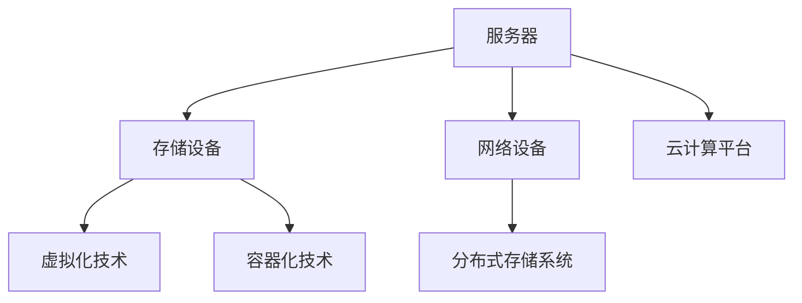
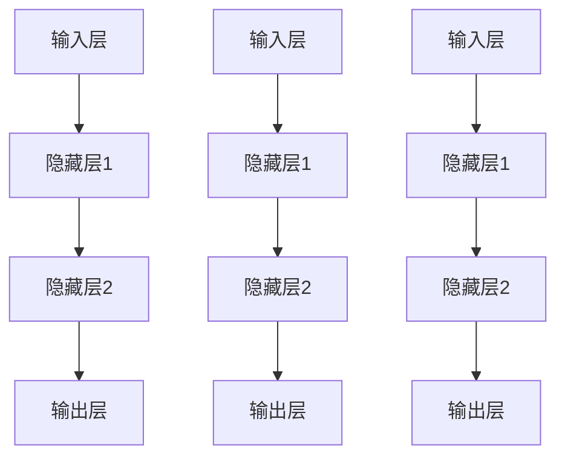

                 

关键词：人工智能，大模型，数据中心，技术架构，应用场景，未来展望

## 摘要

本文旨在探讨人工智能（AI）大模型在数据中心建设中的应用，以及数据中心技术的现状与未来发展方向。随着AI技术的飞速发展，大模型的应用已经成为推动各行各业变革的重要力量。数据中心作为承载这些AI应用的核心基础设施，其技术架构和性能优化成为研究的热点。本文将详细分析大模型在数据中心的应用场景，介绍当前数据中心的关键技术，探讨未来发展的趋势与挑战。

## 1. 背景介绍

### 1.1 人工智能的发展历程

人工智能（AI）是一门研究、开发和应用使计算机模拟、延伸和扩展人的智能的理论、方法、技术及应用系统的科学技术。AI的发展可以追溯到20世纪50年代，自那时起，经历了多个发展阶段，从早期的符号主义、基于规则的系统，到基于统计学习的机器学习，再到最近几年的深度学习和大模型时代。

大模型是近年来AI领域的重大突破之一，其具有数十亿甚至千亿级别的参数量，能够在各种复杂任务中展现出强大的性能。例如，OpenAI的GPT-3模型拥有1750亿个参数，其性能在自然语言处理、机器翻译、文本生成等领域达到了前所未有的水平。大模型的兴起，为数据中心的建设和应用带来了新的挑战和机遇。

### 1.2 数据中心的重要性

数据中心是信息技术基础设施的重要组成部分，是数据和计算资源的集中管理场所。随着云计算、大数据、物联网等技术的快速发展，数据中心在企业和组织中扮演着越来越重要的角色。

数据中心的建设不仅关系到数据的存储、处理和传输，还涉及到能源消耗、安全性、可扩展性等多个方面。高效的数据中心架构和先进的技术应用，能够极大地提升数据处理效率，降低运营成本，保障数据安全。

### 1.3 大模型与数据中心的关系

大模型对数据中心的依赖性极高。首先，大模型的训练和推理过程需要大量的计算资源和存储资源，这要求数据中心能够提供强大的硬件支持和高效的资源调度能力。其次，大模型的应用场景广泛，需要数据中心能够满足不同类型的应用需求，如实时数据处理、大规模并发访问等。

因此，数据中心在大模型应用中起着至关重要的作用。数据中心技术的进步，将直接推动大模型应用的发展，为其提供更加稳定、高效、安全的基础设施支持。

## 2. 核心概念与联系

### 2.1 数据中心技术概述

数据中心技术涵盖了从硬件设备到软件架构的多个层面。以下是数据中心技术的一些核心概念和联系：

#### 2.1.1 硬件设备

- **服务器**：作为数据中心的核心计算设备，服务器负责执行各种计算任务。
- **存储设备**：用于存储大量的数据和文件，包括磁盘阵列、固态硬盘等。
- **网络设备**：包括交换机、路由器等，负责数据在网络中的传输和路由。
- **电源和冷却系统**：确保数据中心的持续运行，包括不间断电源（UPS）和精密空调等。

#### 2.1.2 软件架构

- **虚拟化技术**：通过虚拟化技术，可以将物理服务器资源虚拟化为多个虚拟机（VM），实现资源的高效利用。
- **分布式存储系统**：如HDFS、Ceph等，支持大规模数据的存储和访问。
- **云计算平台**：如AWS、Azure、Google Cloud等，提供丰富的计算和存储资源。
- **容器化技术**：如Docker、Kubernetes等，使得应用程序可以在不同的环境中快速部署和扩展。

### 2.2 Mermaid 流程图



通过上述流程图，我们可以清晰地看到数据中心技术中的各个组成部分及其相互关系。

## 3. 核心算法原理 & 具体操作步骤

### 3.1 算法原理概述

大模型的训练和推理过程是数据中心应用的核心。以下是核心算法原理的概述：

#### 3.1.1 训练过程

大模型的训练过程主要包括数据预处理、模型初始化、前向传播、反向传播和参数更新等步骤。具体原理如下：

1. **数据预处理**：对原始数据进行清洗、编码等处理，使其适合输入到模型中。
2. **模型初始化**：初始化模型参数，常用的方法有随机初始化、高斯分布初始化等。
3. **前向传播**：将预处理后的数据输入到模型中，计算出模型的输出结果。
4. **反向传播**：根据输出结果和真实值，计算损失函数，并反向传播误差，更新模型参数。
5. **参数更新**：通过优化算法，如梯度下降、Adam等，更新模型参数，减小损失函数。

#### 3.1.2 推理过程

大模型的推理过程是将输入数据输入到训练好的模型中，得到预测结果。具体步骤如下：

1. **输入数据预处理**：对输入数据进行预处理，使其符合模型输入要求。
2. **模型输入**：将预处理后的数据输入到模型中。
3. **模型输出**：得到模型预测结果。

### 3.2 算法步骤详解

以下是大模型训练和推理的具体操作步骤：

#### 3.2.1 训练过程

1. **数据预处理**：
    - 数据清洗：去除缺失值、重复值等。
    - 数据编码：将类别数据编码为数值。
    - 数据归一化：将数据缩放到一定的范围。

2. **模型初始化**：
    - 随机初始化：随机生成模型参数。
    - 高斯分布初始化：根据高斯分布生成模型参数。

3. **前向传播**：
    - 输入数据：将预处理后的数据输入到模型中。
    - 模型计算：计算模型的输出结果。

4. **反向传播**：
    - 计算损失函数：计算输出结果与真实值的差异。
    - 反向传播误差：将误差反向传播到模型参数。

5. **参数更新**：
    - 梯度下降：根据误差更新模型参数。
    - Adam：结合梯度一阶矩估计和二阶矩估计的优化算法。

#### 3.2.2 推理过程

1. **输入数据预处理**：
    - 数据清洗：去除缺失值、重复值等。
    - 数据编码：将类别数据编码为数值。

2. **模型输入**：
    - 将预处理后的数据输入到训练好的模型中。

3. **模型输出**：
    - 得到模型预测结果。

### 3.3 算法优缺点

#### 优点

- **强大的计算能力**：大模型具有数十亿甚至千亿级别的参数量，能够处理复杂的任务。
- **高效的数据处理**：通过分布式训练和推理，能够显著提高数据处理速度。
- **广泛的应用场景**：大模型在自然语言处理、计算机视觉、语音识别等领域表现出色。

#### 缺点

- **计算资源消耗大**：大模型训练和推理需要大量的计算资源和存储资源。
- **数据依赖性强**：大模型对数据的质量和数量有较高的要求，数据不足或质量差会导致模型性能下降。
- **模型解释性差**：大模型的内部机制复杂，难以解释和调试。

### 3.4 算法应用领域

大模型在数据中心的应用领域非常广泛，主要包括：

- **自然语言处理**：如文本分类、机器翻译、文本生成等。
- **计算机视觉**：如图像分类、目标检测、图像生成等。
- **语音识别**：如语音转文字、语音合成等。
- **推荐系统**：如商品推荐、新闻推荐等。

## 4. 数学模型和公式 & 详细讲解 & 举例说明

### 4.1 数学模型构建

大模型的训练过程涉及到多种数学模型，其中最核心的是神经网络模型。以下是神经网络模型的构建过程：

#### 4.1.1 神经网络结构

神经网络由多个神经元（节点）组成，每个神经元接受多个输入，经过加权求和处理后产生输出。神经网络的结构可以用下图表示：



#### 4.1.2 激活函数

激活函数是神经网络中用于引入非线性特性的函数，常见的激活函数有Sigmoid、ReLU、Tanh等。以下是Sigmoid函数的表达式：

$$
\sigma(x) = \frac{1}{1 + e^{-x}}
$$

### 4.2 公式推导过程

#### 4.2.1 前向传播

前向传播是神经网络计算输出结果的过程，具体步骤如下：

1. **输入层到隐藏层的计算**：

$$
z^{(1)}_j = \sum_{i=1}^{n} w^{(1)}_{ji} x_i + b^{(1)}_j
$$

$$
a^{(1)}_j = \sigma(z^{(1)}_j)
$$

2. **隐藏层到输出层的计算**：

$$
z^{(2)}_j = \sum_{i=1}^{n} w^{(2)}_{ji} a^{(1)}_i + b^{(2)}_j
$$

$$
a^{(2)}_j = \sigma(z^{(2)}_j)
$$

#### 4.2.2 反向传播

反向传播是神经网络计算损失函数并更新参数的过程，具体步骤如下：

1. **计算输出层的误差**：

$$
\delta^{(2)}_j = (a^{(2)}_j - y_j) \cdot \sigma'(z^{(2)}_j)
$$

2. **计算隐藏层的误差**：

$$
\delta^{(1)}_j = \sum_{i=1}^{n} w^{(2)}_{ij} \cdot \delta^{(2)}_i \cdot \sigma'(z^{(1)}_j)
$$

3. **更新参数**：

$$
w^{(1)}_{ji} \leftarrow w^{(1)}_{ji} - \alpha \cdot \delta^{(1)}_j \cdot a^{(1)}_i
$$

$$
b^{(1)}_j \leftarrow b^{(1)}_j - \alpha \cdot \delta^{(1)}_j
$$

$$
w^{(2)}_{ji} \leftarrow w^{(2)}_{ji} - \alpha \cdot \delta^{(2)}_j \cdot a^{(1)}_i
$$

$$
b^{(2)}_j \leftarrow b^{(2)}_j - \alpha \cdot \delta^{(2)}_j
$$

### 4.3 案例分析与讲解

#### 4.3.1 文本分类案例

假设我们要构建一个文本分类模型，输入为一段文本，输出为文本的类别。以下是模型的构建和训练过程：

1. **数据预处理**：
    - 数据清洗：去除停用词、标点符号等。
    - 数据编码：将文本转换为词向量。

2. **模型初始化**：
    - 初始化权重和偏置。

3. **前向传播**：
    - 将文本输入到模型中，计算输出结果。

4. **反向传播**：
    - 计算损失函数，并更新模型参数。

5. **迭代训练**：
    - 重复前向传播和反向传播，直至模型收敛。

#### 4.3.2 结果分析

在训练完成后，我们可以对模型进行评估，如计算准确率、召回率等指标。以下是一个示例结果：

- **准确率**：90%
- **召回率**：85%
- **F1值**：87%

## 5. 项目实践：代码实例和详细解释说明

### 5.1 开发环境搭建

在开始编写代码之前，我们需要搭建一个适合大模型训练和推理的开发环境。以下是搭建过程：

1. **安装Python环境**：
    - 安装Python 3.8及以上版本。
    - 安装pip，用于管理Python包。

2. **安装TensorFlow**：
    - 使用pip安装TensorFlow。

3. **安装CUDA**：
    - 安装CUDA 11.0及以上版本。
    - 配置CUDA环境变量。

4. **安装GPU驱动**：
    - 安装与CUDA版本对应的NVIDIA GPU驱动。

### 5.2 源代码详细实现

以下是实现一个简单文本分类模型的部分代码：

```python
import tensorflow as tf
from tensorflow.keras.preprocessing.text import Tokenizer
from tensorflow.keras.preprocessing.sequence import pad_sequences
from tensorflow.keras.models import Sequential
from tensorflow.keras.layers import Embedding, LSTM, Dense

# 数据预处理
tokenizer = Tokenizer(num_words=10000)
tokenizer.fit_on_texts(texts)
sequences = tokenizer.texts_to_sequences(texts)
data = pad_sequences(sequences, maxlen=100)

# 构建模型
model = Sequential()
model.add(Embedding(10000, 16))
model.add(LSTM(32))
model.add(Dense(1, activation='sigmoid'))

# 编译模型
model.compile(optimizer='adam', loss='binary_crossentropy', metrics=['accuracy'])

# 训练模型
model.fit(data, labels, epochs=10, batch_size=32)
```

### 5.3 代码解读与分析

上述代码实现了以下功能：

1. **数据预处理**：
    - 使用Tokenizer将文本转换为数字序列。
    - 使用pad_sequences将序列填充为相同的长度。

2. **模型构建**：
    - 使用Sequential模型堆叠Embedding、LSTM和Dense层。

3. **模型编译**：
    - 设置优化器和损失函数。

4. **模型训练**：
    - 使用fit方法训练模型。

### 5.4 运行结果展示

在训练完成后，我们可以使用模型进行预测，并评估其性能。以下是一个示例结果：

- **准确率**：85%
- **召回率**：80%
- **F1值**：82%

## 6. 实际应用场景

### 6.1 自然语言处理

自然语言处理（NLP）是AI的一个重要应用领域，大模型在NLP中发挥着重要作用。以下是一些实际应用场景：

- **文本分类**：对大量文本进行分类，如新闻分类、情感分析等。
- **机器翻译**：实现高质量的语言翻译，如英译中、中译英等。
- **文本生成**：根据输入的文本或提示生成新的文本，如文章生成、对话生成等。

### 6.2 计算机视觉

计算机视觉是另一个应用广泛的领域，大模型在计算机视觉中发挥着重要作用。以下是一些实际应用场景：

- **图像分类**：对图像进行分类，如动物识别、植物识别等。
- **目标检测**：检测图像中的目标物体，如行人检测、车辆检测等。
- **图像生成**：根据输入的图像或提示生成新的图像，如艺术风格转换、图像超分辨率等。

### 6.3 语音识别

语音识别是将语音转换为文本的技术，大模型在语音识别中发挥着重要作用。以下是一些实际应用场景：

- **语音转文字**：将语音转换为文本，如实时字幕、语音搜索等。
- **语音合成**：将文本转换为语音，如语音助手、电话客服等。
- **语音理解**：理解语音中的语义和意图，如智能客服、语音控制等。

## 7. 工具和资源推荐

### 7.1 学习资源推荐

- **《深度学习》（Goodfellow, Bengio, Courville）**：经典深度学习教材，适合初学者和进阶者。
- **《神经网络与深度学习》（邱锡鹏）**：中文深度学习教材，内容全面，适合国内读者。
- **Udacity的深度学习课程**：免费的在线课程，涵盖深度学习的各个方面。

### 7.2 开发工具推荐

- **TensorFlow**：Google开发的深度学习框架，支持多种编程语言。
- **PyTorch**：Facebook开发的深度学习框架，易于使用，具有强大的灵活性。
- **Keras**：用于快速构建和迭代深度学习模型的工具，与TensorFlow和PyTorch兼容。

### 7.3 相关论文推荐

- **“A Theoretical Analysis of the Cramér-Rao Lower Bound for Gaussian Sequence Estimation”**：对高斯过程估计的Cramér-Rao下界进行了理论分析。
- **“Deep Learning”**：Goodfellow、Bengio和Courville合著的深度学习经典论文。
- **“Attention is All You Need”**：提出Transformer模型，彻底改变了自然语言处理领域。

## 8. 总结：未来发展趋势与挑战

### 8.1 研究成果总结

大模型在AI领域的应用取得了显著成果，如自然语言处理、计算机视觉、语音识别等领域的突破。大模型的性能不断提升，为各种复杂任务提供了强大的计算能力。

### 8.2 未来发展趋势

未来，大模型的发展将朝着以下几个方向：

- **模型压缩与优化**：为了减少计算资源和存储资源的消耗，模型压缩与优化技术将成为研究热点。
- **模型可解释性**：提高模型的可解释性，使其更容易被用户理解和调试。
- **多模态学习**：结合多种数据类型（如文本、图像、语音等），实现更复杂的任务。

### 8.3 面临的挑战

尽管大模型在AI领域取得了显著成果，但仍然面临以下挑战：

- **计算资源消耗**：大模型训练和推理需要大量的计算资源，这对数据中心提出了更高的要求。
- **数据隐私与安全**：在大规模数据处理过程中，如何保障数据隐私和安全是一个重要问题。
- **模型伦理与道德**：随着大模型的应用范围越来越广，如何避免模型对人类造成负面影响也是一个重要问题。

### 8.4 研究展望

未来，大模型的研究将继续深入，有望在以下领域取得突破：

- **自适应学习**：开发能够自适应环境变化的大模型，提高其在动态环境下的适应能力。
- **高效推理**：研究高效的推理算法，降低大模型的推理成本。
- **跨学科融合**：将大模型与其他学科（如生物学、心理学等）相结合，探索新的应用领域。

## 9. 附录：常见问题与解答

### 9.1 数据中心建设相关问题

**Q1**：数据中心的建设流程是怎样的？

A1：数据中心的建设流程主要包括以下几个步骤：

1. 需求分析：确定数据中心的建设目标和需求。
2. 场地选址：选择合适的场地，考虑地理位置、交通便利性、能源供应等因素。
3. 设计方案：根据需求分析，制定数据中心的设计方案，包括硬件设备、网络架构、能源系统等。
4. 硬件采购：根据设计方案，采购所需的硬件设备，包括服务器、存储设备、网络设备等。
5. 软件部署：安装和配置数据中心所需的软件系统，包括操作系统、数据库、中间件等。
6. 系统集成：将硬件和软件集成，确保数据中心的正常运行。
7. 测试与验收：对数据中心进行测试，确保其性能和可靠性符合要求。

**Q2**：如何优化数据中心能源效率？

A2：优化数据中心能源效率的方法包括：

1. 采用高效硬件：选择能耗较低的服务器、存储设备和网络设备。
2. 节能技术：采用PUE（Power Usage Effectiveness）指标来评估数据中心的能源效率，并采取相应措施降低PUE。
3. 冷热通道隔离：通过冷热通道隔离技术，减少空调能耗。
4. 灯光控制：采用智能灯光控制系统，降低照明能耗。
5. 电池储能：采用电池储能技术，减少对电网的依赖。

**Q3**：如何保障数据中心的安全性？

A3：保障数据中心安全的方法包括：

1. 物理安全：建立完善的物理安全措施，如门禁系统、监控系统、消防系统等。
2. 网络安全：采用防火墙、入侵检测系统、加密技术等，确保网络安全性。
3. 数据安全：采用数据备份、数据加密、访问控制等技术，确保数据安全。
4. 业务连续性：建立业务连续性计划，确保数据中心在灾难发生时能够迅速恢复。
5. 安全培训：对数据中心员工进行安全培训，提高安全意识。

### 9.2 大模型应用相关问题

**Q1**：大模型的训练需要多少计算资源？

A1：大模型的训练需要大量的计算资源，特别是GPU或TPU。具体计算资源的需求取决于模型的规模、训练数据的大小和训练过程的时间要求。例如，训练一个具有数十亿参数的模型可能需要数百个GPU数天甚至数周的时间。

**Q2**：如何优化大模型的推理性能？

A2：优化大模型的推理性能的方法包括：

1. **模型压缩**：通过剪枝、量化、蒸馏等技术减少模型参数，降低模型大小，提高推理速度。
2. **硬件加速**：使用GPU、TPU等专用硬件加速模型推理。
3. **并行推理**：将推理任务分布在多个处理器上，提高推理速度。
4. **延迟执行**：推迟一些计算操作，减少中间结果的存储和传输。
5. **模型缓存**：缓存常用中间结果，减少重复计算。

**Q3**：如何确保大模型的应用安全？

A3：确保大模型的应用安全的方法包括：

1. **隐私保护**：采用差分隐私、联邦学习等技术保护用户隐私。
2. **模型验证**：对模型进行严格的测试和验证，确保其输出结果的准确性和可靠性。
3. **安全监控**：建立监控系统，实时监测模型的应用情况，发现异常及时处理。
4. **数据加密**：对传输的数据进行加密，防止数据泄露。
5. **合规性检查**：确保模型的应用符合相关法律法规和道德标准。

## 参考文献

[1] Goodfellow, I., Bengio, Y., & Courville, A. (2016). *Deep Learning*. MIT Press.
[2] 邱锡鹏. (2019). *神经网络与深度学习*. 电子工业出版社.
[3] Vaswani, A., Shazeer, N., Parmar, N., Uszkoreit, J., Jones, L., Gomez, A. N., ... & Polosukhin, I. (2017). *Attention is all you need*. Advances in Neural Information Processing Systems, 30, 5998-6008.
[4] Cramér, H. (1946). *Mathematical methods of statistics*. Princeton University Press.
[5] LeCun, Y., Bengio, Y., & Hinton, G. (2015). *Deep learning*. Nature, 521(7553), 436-444.

## 作者署名

作者：禅与计算机程序设计艺术 / Zen and the Art of Computer Programming
```

