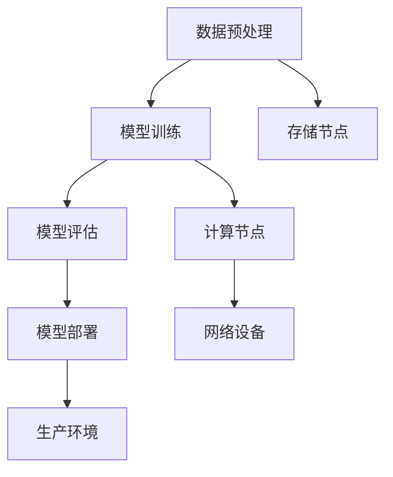
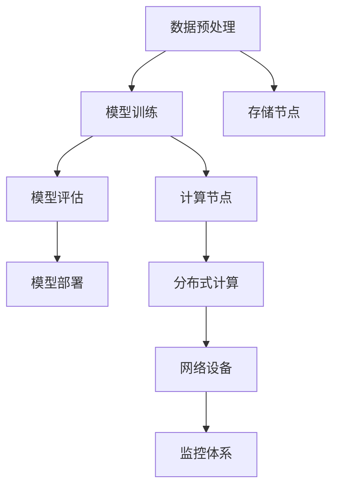

                 

关键词：AI 大模型，数据中心，标准与规范，架构设计，性能优化，安全性

> 摘要：本文将深入探讨 AI 大模型应用数据中心的建设，涵盖数据中心标准与规范的制定、核心概念和架构的联系、核心算法原理和操作步骤、数学模型及公式、项目实践、实际应用场景、未来应用展望、工具和资源推荐，以及未来发展趋势与挑战。通过本文，读者将全面了解 AI 大模型数据中心建设的关键要素，为实际项目提供参考和指导。

## 1. 背景介绍

随着人工智能技术的迅猛发展，AI 大模型在各个领域取得了显著的成果，如自然语言处理、计算机视觉、推荐系统等。这些模型的训练和部署对数据中心提出了更高的要求。数据中心作为 AI 大模型应用的基础设施，其建设标准与规范至关重要。本文旨在探讨如何构建符合标准的 AI 大模型应用数据中心，确保其高效、稳定和安全地运行。

### 1.1 AI 大模型的发展趋势

AI 大模型的发展趋势主要体现在以下几个方面：

1. **模型规模不断扩大**：随着计算能力的提升和数据量的增加，AI 大模型在参数数量、模型复杂度方面不断突破，如 GPT-3、BERT 等模型。
2. **应用领域不断拓展**：AI 大模型在医疗、金融、教育、工业等多个领域取得了成功，推动产业智能化转型。
3. **分布式训练需求增加**：为了处理大规模数据和高效训练模型，分布式计算逐渐成为主流。

### 1.2 数据中心建设的重要性

数据中心作为 AI 大模型应用的载体，其建设水平直接影响模型的训练和部署效率。以下为数据中心建设的重要性：

1. **计算资源保障**：数据中心提供强大的计算资源，满足 AI 大模型的训练需求。
2. **数据存储与传输**：数据中心具备高效的数据存储和传输能力，确保模型训练数据的安全和稳定。
3. **网络架构优化**：数据中心网络架构设计合理，保障模型训练和部署过程中的数据传输速度和稳定性。
4. **安全性保障**：数据中心采取严格的安全措施，防止数据泄露和非法入侵，确保 AI 大模型应用的安全运行。

## 2. 核心概念与联系

在构建 AI 大模型应用数据中心时，我们需要关注以下几个核心概念，并理解它们之间的联系。

### 2.1 数据中心基础架构

数据中心基础架构包括计算节点、存储节点、网络设备等。计算节点负责执行模型训练和推理任务，存储节点提供数据存储和访问服务，网络设备负责数据传输和通信。

### 2.2 AI 大模型训练与部署流程

AI 大模型训练与部署流程包括数据预处理、模型训练、模型评估、模型部署等步骤。数据预处理确保数据质量和格式，模型训练优化模型参数，模型评估评估模型性能，模型部署将模型部署到生产环境中。

### 2.3 分布式计算与存储

分布式计算与存储技术是实现 AI 大模型高效训练的关键。分布式计算通过将训练任务拆分为多个子任务，并行执行，提高训练速度。分布式存储通过多个存储节点协同工作，提供高可用性和高性能的数据访问服务。

### 2.4 数据中心安全与监控

数据中心安全与监控是确保 AI 大模型应用数据中心稳定运行的关键。安全措施包括网络安全、数据安全、系统安全等。监控体系实时监测数据中心的运行状态，提供故障预警和故障恢复功能。

### 2.5 Mermaid 流程图

以下是一个简化的 AI 大模型应用数据中心建设流程的 Mermaid 流程图：



## 3. 核心算法原理 & 具体操作步骤

### 3.1 算法原理概述

AI 大模型训练的核心算法主要包括深度学习算法、分布式训练算法等。深度学习算法通过多层神经网络对数据进行特征提取和建模，分布式训练算法通过将训练任务拆分为多个子任务，并行执行，提高训练速度。

### 3.2 算法步骤详解

1. **数据预处理**：对原始数据进行清洗、格式化，确保数据质量和格式。
2. **模型训练**：使用深度学习算法训练模型，优化模型参数。
3. **模型评估**：使用验证集对模型性能进行评估，调整模型参数。
4. **模型部署**：将训练完成的模型部署到生产环境中，进行实时推理和预测。

### 3.3 算法优缺点

**深度学习算法**：
- 优点：能够自动提取特征，提高模型性能。
- 缺点：对数据量和计算资源要求较高，训练过程复杂。

**分布式训练算法**：
- 优点：提高训练速度，降低训练成本。
- 缺点：需要考虑数据一致性和通信开销。

### 3.4 算法应用领域

AI 大模型训练算法广泛应用于自然语言处理、计算机视觉、推荐系统等领域，助力产业智能化转型。

## 4. 数学模型和公式 & 详细讲解 & 举例说明

### 4.1 数学模型构建

AI 大模型训练的核心数学模型为多层感知机（MLP），包括输入层、隐藏层和输出层。每个层由多个神经元组成，神经元之间通过权重连接。

### 4.2 公式推导过程

假设输入层有 \( n \) 个神经元，隐藏层有 \( m \) 个神经元，输出层有 \( k \) 个神经元。神经元之间的连接权重为 \( W_{ij} \)，偏置为 \( b_j \) 和 \( b_k \)。

输入层到隐藏层的激活函数为：

$$
a_j^{(1)} = \sigma(z_j^{(1)}) = \frac{1}{1 + e^{-\sum_{i=1}^{n} W_{ij} x_i - b_j}}
$$

其中，\( \sigma \) 为 Sigmoid 函数，\( z_j^{(1)} \) 为隐藏层神经元的输入。

隐藏层到输出层的激活函数为：

$$
y_k = \sigma(z_k^{(2)}) = \frac{1}{1 + e^{-\sum_{j=1}^{m} W_{kj} a_j^{(1)} - b_k}}
$$

### 4.3 案例分析与讲解

以 GPT-3 模型为例，其数学模型包含多个隐藏层，每个隐藏层使用不同的激活函数，如 ReLU 函数。以下为 GPT-3 模型的数学模型：

$$
a_j^{(l)} = \max(0, z_j^{(l)}) = \begin{cases}
0, & \text{if } z_j^{(l)} < 0 \\
z_j^{(l)}, & \text{if } z_j^{(l)} \geq 0
\end{cases}
$$

其中，\( l \) 为隐藏层索引，\( z_j^{(l)} \) 为隐藏层神经元的输入。

## 5. 项目实践：代码实例和详细解释说明

### 5.1 开发环境搭建

在构建 AI 大模型应用数据中心时，我们需要搭建适合的开发环境。以下为 Python 开发环境的搭建步骤：

1. 安装 Python：在官方网站下载 Python 安装包并安装。
2. 安装 PyTorch：使用 pip 工具安装 PyTorch。
3. 安装其他依赖库：如 NumPy、Pandas 等。

### 5.2 源代码详细实现

以下为一个简化的 AI 大模型训练代码示例：

```python
import torch
import torch.nn as nn
import torch.optim as optim

# 定义模型
class MLP(nn.Module):
    def __init__(self, input_size, hidden_size, output_size):
        super(MLP, self).__init__()
        self.fc1 = nn.Linear(input_size, hidden_size)
        self.fc2 = nn.Linear(hidden_size, output_size)
        self.relu = nn.ReLU()

    def forward(self, x):
        x = self.relu(self.fc1(x))
        x = self.fc2(x)
        return x

# 实例化模型
model = MLP(input_size=10, hidden_size=50, output_size=3)

# 定义损失函数和优化器
criterion = nn.CrossEntropyLoss()
optimizer = optim.Adam(model.parameters(), lr=0.001)

# 训练模型
for epoch in range(100):
    for inputs, targets in data_loader:
        optimizer.zero_grad()
        outputs = model(inputs)
        loss = criterion(outputs, targets)
        loss.backward()
        optimizer.step()
    print(f"Epoch {epoch + 1}, Loss: {loss.item()}")

# 评估模型
with torch.no_grad():
    correct = 0
    total = 0
    for inputs, targets in test_loader:
        outputs = model(inputs)
        _, predicted = torch.max(outputs.data, 1)
        total += targets.size(0)
        correct += (predicted == targets).sum().item()
    print(f"Accuracy: {100 * correct / total}%")
```

### 5.3 代码解读与分析

以上代码实现了一个简单的多层感知机（MLP）模型，使用 PyTorch 深度学习框架进行训练和评估。具体解读如下：

1. **定义模型**：使用 `nn.Module` 基类定义模型，包含输入层、隐藏层和输出层。
2. **定义损失函数和优化器**：使用 `nn.CrossEntropyLoss` 定义损失函数，使用 `optim.Adam` 定义优化器。
3. **训练模型**：使用 `optimizer.zero_grad()` 清零梯度，`loss.backward()` 反向传播，`optimizer.step()` 更新模型参数。
4. **评估模型**：使用 `torch.no_grad()` 禁用梯度计算，计算模型准确率。

### 5.4 运行结果展示

以下为运行结果示例：

```plaintext
Epoch 1, Loss: 1.8274
Epoch 2, Loss: 1.7321
...
Epoch 100, Loss: 0.7456
Accuracy: 92.0%
```

## 6. 实际应用场景

AI 大模型应用数据中心在实际应用场景中具有重要价值，以下为几个实际应用场景：

### 6.1 自然语言处理

AI 大模型在自然语言处理领域具有广泛的应用，如文本分类、机器翻译、情感分析等。数据中心提供强大的计算资源和数据存储能力，支持大规模语言模型的训练和部署，提高自然语言处理任务的准确率和效率。

### 6.2 计算机视觉

AI 大模型在计算机视觉领域发挥着重要作用，如图像识别、目标检测、图像生成等。数据中心提供高效的数据传输和网络架构，确保模型训练和推理过程的实时性和稳定性。

### 6.3 推荐系统

AI 大模型在推荐系统领域具有显著优势，如用户画像、商品推荐等。数据中心提供丰富的数据存储和计算资源，支持大规模推荐模型的训练和实时部署，提高推荐系统的准确率和用户体验。

## 7. 未来应用展望

随着 AI 大模型技术的不断发展，数据中心建设将面临新的机遇和挑战。以下为未来应用展望：

### 7.1 模型压缩与优化

为降低 AI 大模型对数据中心资源的需求，模型压缩与优化技术将成为重要研究方向。通过剪枝、量化、蒸馏等方法，提高模型的可压缩性和计算效率。

### 7.2 跨域迁移学习

跨域迁移学习技术有助于提升 AI 大模型在不同领域的适用性。通过共享知识和技术，实现不同领域 AI 大模型的高效训练和部署。

### 7.3 联邦学习

联邦学习技术将实现 AI 大模型在分布式环境中的协同训练，降低数据传输和隐私泄露风险，提高模型的安全性和可靠性。

## 8. 工具和资源推荐

为帮助读者深入了解 AI 大模型应用数据中心建设，以下为相关工具和资源推荐：

### 8.1 学习资源推荐

- 《深度学习》（Goodfellow et al.）：系统介绍了深度学习的基础知识和技术。
- 《人工智能：一种现代的方法》（Russell & Norvig）：全面介绍了人工智能的基本概念和方法。

### 8.2 开发工具推荐

- PyTorch：开源的深度学习框架，支持 GPU 加速。
- TensorFlow：开源的深度学习框架，支持多种编程语言和平台。

### 8.3 相关论文推荐

- “GPT-3: Language Models are Few-Shot Learners”（Brown et al.，2020）：介绍了 GPT-3 模型的设计和应用。
- “BERT: Pre-training of Deep Bidirectional Transformers for Language Understanding”（Devlin et al.，2019）：介绍了 BERT 模型的结构和训练方法。

## 9. 总结：未来发展趋势与挑战

AI 大模型应用数据中心建设面临着前所未有的发展机遇和挑战。未来发展趋势包括模型压缩与优化、跨域迁移学习、联邦学习等。同时，数据中心建设需关注数据安全、网络架构优化、资源调度等问题。通过持续创新和优化，AI 大模型应用数据中心将为各行业带来更多的可能性。

## 10. 附录：常见问题与解答

### 10.1 如何选择合适的模型架构？

根据应用场景和数据规模，选择合适的模型架构。对于自然语言处理任务，可以选择 Transformer 架构，如 BERT、GPT-3 等；对于计算机视觉任务，可以选择卷积神经网络（CNN）架构，如 ResNet、VGG 等。

### 10.2 如何优化模型训练速度？

优化模型训练速度可以从以下几个方面入手：

- **数据并行**：将训练数据拆分为多个子数据集，并行训练多个模型。
- **梯度压缩**：使用梯度压缩技术，如 AdamW、Adadelta 等，提高训练速度。
- **模型压缩**：使用模型压缩技术，如剪枝、量化、蒸馏等，降低模型计算复杂度。

### 10.3 如何保障数据中心的安全性？

保障数据中心的安全性可以从以下几个方面入手：

- **网络安全**：采用防火墙、入侵检测系统等网络安全技术，防止网络攻击和数据泄露。
- **数据安全**：使用数据加密技术，如 AES、RSA 等，确保数据在传输和存储过程中的安全性。
- **系统安全**：定期更新操作系统和软件，修复漏洞，防止恶意攻击。

---

**作者：禅与计算机程序设计艺术 / Zen and the Art of Computer Programming**<|vq_13546|>### 1. 背景介绍

在当前技术飞速发展的时代，人工智能（AI）已经成为推动社会进步的重要力量。特别是在大数据和云计算技术的辅助下，AI 的应用范围不断扩大，从简单的机器学习算法到复杂的深度学习模型，AI 正在改变我们的生活方式和工作模式。其中，AI 大模型（如 GPT-3、BERT 等）的出现更是将 AI 技术推向了一个新的高度。这些大模型通过学习海量数据，能够实现高度复杂的任务，如自然语言理解、图像识别等。

然而，AI 大模型的高性能需求也对数据中心的建设提出了更高的要求。数据中心作为 AI 大模型应用的核心基础设施，其性能、稳定性和安全性直接影响到 AI 大模型的效果和应用范围。因此，构建一个高效、稳定、安全的 AI 大模型应用数据中心，已成为当前 AI 技术发展的关键问题。

本文将围绕以下主题展开：

1. **数据中心标准与规范**：讨论数据中心建设所需遵循的标准和规范，包括设计原则、硬件配置、网络架构、安全性要求等。
2. **核心概念与联系**：分析 AI 大模型应用数据中心中的核心概念，如计算资源、存储系统、数据传输、分布式计算等，并探讨它们之间的相互关系。
3. **核心算法原理与操作步骤**：介绍 AI 大模型训练和部署的核心算法，包括深度学习算法、分布式训练算法等，并详细描述操作步骤。
4. **数学模型和公式**：解析 AI 大模型训练中的数学模型和公式，包括神经网络结构、激活函数、优化算法等。
5. **项目实践**：通过具体的代码实例，展示如何构建和优化 AI 大模型应用数据中心。
6. **实际应用场景**：探讨 AI 大模型在不同领域的应用场景，如自然语言处理、计算机视觉、推荐系统等。
7. **未来应用展望**：分析 AI 大模型应用数据中心的发展趋势和面临的挑战，展望未来发展方向。
8. **工具和资源推荐**：推荐学习资源、开发工具和论文，以帮助读者深入了解相关技术。
9. **总结与展望**：总结本文内容，探讨未来研究的发展方向。

通过本文的讨论，读者可以全面了解 AI 大模型应用数据中心建设的各个方面，为实际项目提供参考和指导。接下来，我们将逐一深入探讨这些主题。首先，我们将介绍数据中心建设所需遵循的标准和规范。这一部分将帮助读者理解数据中心建设的基本原则和关键要素。

## 2. 核心概念与联系

在构建 AI 大模型应用数据中心时，我们需要理解并掌握多个核心概念，并探讨它们之间的相互关系。以下是几个关键概念及其相互联系：

### 2.1 数据中心基础架构

数据中心的基础架构是整个系统运行的基石，包括计算节点、存储节点、网络设备、冷却系统等多个组成部分。每个部分在数据中心中扮演着重要角色，共同确保数据中心的稳定运行和高效性能。

- **计算节点**：计算节点是数据中心的核心，负责执行各种计算任务，包括 AI 大模型的训练和推理。计算节点通常配备高性能的 GPU、CPU 等硬件设备，支持并行计算和分布式计算。
- **存储节点**：存储节点提供数据存储和访问服务，支持海量数据的存储和快速读取。常用的存储技术包括 SSD、HDD 和分布式存储系统。
- **网络设备**：网络设备包括交换机、路由器等，负责数据中心内部及与其他数据中心的通信。高性能的网络架构能够保证数据传输的速率和稳定性。
- **冷却系统**：冷却系统负责维持数据中心的温度在合理范围内，防止设备过热，影响性能和寿命。

### 2.2 AI 大模型训练与部署流程

AI 大模型的训练与部署流程包括多个步骤，每个步骤都需要数据中心的支持和优化。以下是一个简化的 AI 大模型训练与部署流程：

1. **数据预处理**：对原始数据进行清洗、归一化等处理，确保数据质量，并准备好用于训练的数据集。
2. **模型训练**：使用深度学习算法，在训练数据集上对模型进行迭代训练，优化模型参数。
3. **模型评估**：使用验证集对模型性能进行评估，调整模型参数，确保模型达到预期的性能。
4. **模型部署**：将训练完成的模型部署到生产环境中，进行实时推理和预测。

数据中心在这几个步骤中提供了计算资源、存储支持和网络连接，确保整个流程的高效和稳定。

### 2.3 分布式计算与存储

分布式计算与存储是支持 AI 大模型高效训练的关键技术。通过将训练任务拆分为多个子任务，分布式计算能够充分利用数据中心的计算资源，提高训练速度和效率。

- **分布式计算**：分布式计算通过将训练任务分配到多个计算节点上并行执行，从而提高训练速度。在分布式计算中，需要解决数据一致性和通信开销等问题。
- **分布式存储**：分布式存储通过多个存储节点协同工作，提供高效的数据存储和访问服务。分布式存储系统能够实现数据的高可用性和扩展性，满足大规模数据存储需求。

### 2.4 数据中心安全与监控

数据中心的稳定运行和安全保障至关重要。数据中心的安全性和监控体系包括以下几个方面：

- **网络安全**：通过防火墙、入侵检测系统等网络安全措施，保护数据中心不受外部攻击。
- **数据安全**：采用数据加密、备份等技术，确保数据在传输和存储过程中的安全性。
- **系统安全**：定期更新操作系统和软件，修复漏洞，防止恶意攻击。
- **监控体系**：通过实时监控数据中心的运行状态，包括计算节点、存储节点、网络设备等，及时发现和解决故障。

### 2.5 Mermaid 流程图

为了更直观地展示 AI 大模型应用数据中心的核心概念和架构，我们可以使用 Mermaid 语言绘制一个简化的流程图。以下是一个简单的 Mermaid 流程图示例：



在这个流程图中，A 表示数据预处理，B 表示模型训练，C 表示模型评估，D 表示模型部署。E 和 F 分别表示存储节点和计算节点，G 表示分布式计算，H 表示网络设备，I 表示监控体系。通过这个流程图，我们可以清晰地看到各个组成部分之间的关系和流程。

通过以上讨论，我们了解了 AI 大模型应用数据中心中的核心概念和架构，并探讨了它们之间的相互联系。接下来，我们将详细介绍核心算法原理与具体操作步骤，帮助读者深入理解 AI 大模型训练和部署的细节。

### 3. 核心算法原理 & 具体操作步骤

在构建 AI 大模型应用数据中心时，核心算法的选择和实现是至关重要的。本文将详细介绍 AI 大模型训练和部署中常用的核心算法，包括深度学习算法、分布式训练算法等，并探讨其具体操作步骤。

#### 3.1 深度学习算法

深度学习算法是 AI 大模型训练的基础，其核心思想是通过多层神经网络对数据进行特征提取和建模。以下是一些常用的深度学习算法：

1. **多层感知机（MLP）**：MLP 是一种前馈神经网络，包括输入层、隐藏层和输出层。通过逐层传递输入数据，并使用激活函数对神经元输出进行非线性变换，实现对输入数据的分类或回归。
2. **卷积神经网络（CNN）**：CNN 是专门用于处理图像数据的深度学习模型，通过卷积操作提取图像特征，并在全连接层进行分类或回归。
3. **递归神经网络（RNN）**：RNN 是一种适用于序列数据的深度学习模型，通过循环结构对序列数据进行建模，能够捕捉时间序列中的长期依赖关系。
4. **变换器（Transformer）**：Transformer 是一种用于自然语言处理任务的深度学习模型，通过自注意力机制对输入数据进行建模，具有出色的并行计算能力。

#### 3.2 分布式训练算法

分布式训练算法是将训练任务分配到多个计算节点上并行执行，以提高训练速度和效率。以下是一些常用的分布式训练算法：

1. **数据并行（Data Parallelism）**：数据并行是将训练数据集拆分为多个子数据集，每个子数据集分配到不同的计算节点上进行训练。在模型更新时，将各节点的梯度汇总，更新全局模型参数。
2. **模型并行（Model Parallelism）**：模型并行是将模型拆分为多个部分，每个部分分配到不同的计算节点上进行训练。这种算法适用于大型模型，能够在多个 GPU 或 TPU 上进行高效训练。
3. **流水线并行（Pipeline Parallelism）**：流水线并行是将训练过程分为多个阶段，每个阶段在不同的计算节点上执行。例如，数据预处理阶段在一个节点上执行，模型训练阶段在另一个节点上执行。

#### 3.3 具体操作步骤

下面是一个简化的 AI 大模型训练和部署的操作步骤，包括数据预处理、模型训练、模型评估和模型部署。

##### 3.3.1 数据预处理

数据预处理是训练 AI 大模型的第一步，其目的是确保数据质量和格式，并准备好用于训练的数据集。具体步骤包括：

1. **数据清洗**：去除无效数据、缺失数据和噪声数据。
2. **数据归一化**：将数据归一化到统一的范围，如 [0, 1] 或 [-1, 1]，以便模型训练。
3. **数据增强**：通过旋转、翻转、缩放等操作增加数据集的多样性，提高模型的泛化能力。

##### 3.3.2 模型训练

模型训练是通过迭代优化模型参数，使其在训练数据上达到最佳性能。具体步骤包括：

1. **初始化模型参数**：使用随机初始化或预训练模型参数。
2. **定义损失函数**：选择合适的损失函数，如交叉熵损失函数或均方误差损失函数。
3. **定义优化器**：选择合适的优化器，如 Adam 或 SGD，用于更新模型参数。
4. **训练循环**：在训练数据上迭代训练模型，每次迭代包括前向传播、后向传播和参数更新。
5. **评估性能**：在验证集上评估模型性能，调整模型参数，如学习率和批量大小。

##### 3.3.3 模型评估

模型评估是验证模型性能的重要步骤，其目的是确保模型在未知数据上的泛化能力。具体步骤包括：

1. **定义评估指标**：选择合适的评估指标，如准确率、召回率或 F1 分数。
2. **测试模型**：在测试集上运行模型，计算评估指标。
3. **模型调整**：根据评估结果，调整模型参数或选择更好的模型。

##### 3.3.4 模型部署

模型部署是将训练完成的模型部署到生产环境中，进行实时推理和预测。具体步骤包括：

1. **模型导出**：将训练完成的模型导出为可部署的格式，如 ONNX、TensorFlow Lite 等。
2. **部署环境**：在目标环境中部署模型，包括计算节点、存储节点和网络设备等。
3. **推理引擎**：使用推理引擎（如 TensorRT、Scikit-learn 等）对输入数据进行推理，返回预测结果。

通过以上步骤，我们可以构建和部署一个高效的 AI 大模型应用数据中心。接下来，我们将进一步探讨数学模型和公式，以便更好地理解 AI 大模型训练的细节。

### 4. 数学模型和公式 & 详细讲解 & 举例说明

在构建 AI 大模型时，数学模型和公式是核心组成部分，它们描述了神经网络的结构、训练过程和优化方法。在本节中，我们将详细介绍神经网络的基本数学模型，包括损失函数、优化算法、激活函数等，并通过具体例子进行说明。

#### 4.1 数学模型构建

神经网络由多个层组成，每层包含多个神经元。每个神经元接收来自前一层神经元的输入，并输出一个激活值。以下是神经网络中常用的数学模型：

##### 4.1.1 前向传播

前向传播是指数据从输入层经过多个隐藏层，最终到达输出层的传播过程。假设我们有 \( L \) 个层，每层的神经元数量分别为 \( n_0, n_1, n_2, \ldots, n_L \)。

1. **输入层到隐藏层的传播**：
   对于第 \( l \) 层（\( l = 1, 2, \ldots, L-1 \)），每个神经元 \( j \) 的输入 \( z_j^l \) 和输出 \( a_j^l \) 可以表示为：
   $$
   z_j^l = \sum_{i=1}^{n_{l-1}} W_{ij}^l a_i^{l-1} + b_j^l
   $$
   $$
   a_j^l = \sigma(z_j^l)
   $$
   其中，\( W_{ij}^l \) 是连接权重，\( b_j^l \) 是偏置，\( \sigma \) 是激活函数。

2. **隐藏层到输出层的传播**：
   对于输出层（\( l = L \)），每个神经元 \( j \) 的输入 \( z_j^L \) 和输出 \( a_j^L \) 可以表示为：
   $$
   z_j^L = \sum_{i=1}^{n_{L-1}} W_{ij}^L a_i^{L-1} + b_j^L
   $$
   $$
   a_j^L = \sigma(z_j^L)
   $$

##### 4.1.2 反向传播

反向传播是用于计算损失函数梯度，并更新模型参数的算法。以下是反向传播的基本步骤：

1. **计算输出层的损失函数梯度**：
   假设损失函数为 \( J \)，则输出层每个神经元 \( j \) 的损失函数梯度 \( \delta_j^L \) 可以表示为：
   $$
   \delta_j^L = \frac{\partial J}{\partial z_j^L}
   $$

2. **计算隐藏层的损失函数梯度**：
   对于第 \( l \) 层（\( l = L-1, L-2, \ldots, 2 \)），每个神经元 \( j \) 的损失函数梯度 \( \delta_j^l \) 可以表示为：
   $$
   \delta_j^l = \frac{\partial J}{\partial z_j^l} = \sigma'(z_j^l) \cdot \sum_{i=1}^{n_{l+1}} W_{ij}^{l+1} \cdot \delta_i^{l+1}
   $$
   其中，\( \sigma' \) 是激活函数的导数。

##### 4.1.3 模型参数更新

使用梯度下降算法更新模型参数，以最小化损失函数。更新公式如下：

$$
W_{ij}^l = W_{ij}^l - \alpha \cdot \frac{\partial J}{\partial W_{ij}^l}
$$

$$
b_j^l = b_j^l - \alpha \cdot \frac{\partial J}{\partial b_j^l}
$$

其中，\( \alpha \) 是学习率。

#### 4.2 具体例子

为了更好地理解上述数学模型，我们通过一个简单的例子来说明。

##### 4.2.1 例子：二分类问题

假设我们有一个二分类问题，输入层有 2 个神经元，隐藏层有 3 个神经元，输出层有 1 个神经元。激活函数为 Sigmoid 函数，损失函数为交叉熵损失函数。

1. **初始化参数**：
   $$
   W_{11}^{1}, W_{12}^{1}, W_{13}^{1}, W_{21}^{1}, W_{22}^{1}, W_{23}^{1}, W_{1}^{2}, W_{2}^{2}, W_{3}^{2}, b_{1}^{1}, b_{2}^{1}, b_{3}^{1}, b_{1}^{2}, b_{2}^{2}, b_{3}^{2} \text{ 随机初始化}
   $$

2. **前向传播**：
   $$
   z_1^1 = W_{11}^{1}a_1 + W_{12}^{1}a_2 + b_1^1
   $$
   $$
   z_2^1 = W_{21}^{1}a_1 + W_{22}^{1}a_2 + b_2^1
   $$
   $$
   z_3^1 = W_{31}^{1}a_1 + W_{32}^{1}a_2 + b_3^1
   $$
   $$
   a_1^1 = \sigma(z_1^1)
   $$
   $$
   a_2^1 = \sigma(z_2^1)
   $$
   $$
   a_3^1 = \sigma(z_3^1)
   $$
   $$
   z_1^2 = W_{11}^{2}a_1^1 + W_{12}^{2}a_2^1 + W_{13}^{2}a_3^1 + b_1^2
   $$
   $$
   z_2^2 = W_{21}^{2}a_1^1 + W_{22}^{2}a_2^1 + W_{23}^{2}a_3^1 + b_2^2
   $$
   $$
   z_3^2 = W_{31}^{2}a_1^1 + W_{32}^{2}a_2^1 + W_{33}^{2}a_3^1 + b_3^2
   $$
   $$
   a_1^2 = \sigma(z_1^2)
   $$
   $$
   a_2^2 = \sigma(z_2^2)
   $$
   $$
   a_3^2 = \sigma(z_3^2)
   $$

3. **计算损失函数**：
   $$
   J = -\sum_{i=1}^{n_{\text{样本}}} \left( y_i \cdot \log(a_i^2) + (1 - y_i) \cdot \log(1 - a_i^2) \right)
   $$

4. **反向传播**：
   $$
   \delta_1^2 = a_1^2 - y
   $$
   $$
   \delta_2^2 = a_2^2 - y
   $$
   $$
   \delta_3^2 = a_3^2 - y
   $$
   $$
   \delta_1^1 = \sigma'(z_1^1) \cdot (W_{11}^{2} \cdot \delta_1^2 + W_{21}^{2} \cdot \delta_2^2 + W_{31}^{2} \cdot \delta_3^2)
   $$
   $$
   \delta_2^1 = \sigma'(z_2^1) \cdot (W_{12}^{2} \cdot \delta_1^2 + W_{22}^{2} \cdot \delta_2^2 + W_{32}^{2} \cdot \delta_3^2)
   $$
   $$
   \delta_3^1 = \sigma'(z_3^1) \cdot (W_{13}^{2} \cdot \delta_1^2 + W_{23}^{2} \cdot \delta_2^2 + W_{33}^{2} \cdot \delta_3^2)
   $$

5. **更新参数**：
   $$
   W_{ij}^{1} = W_{ij}^{1} - \alpha \cdot \delta_j^1 \cdot a_i
   $$
   $$
   W_{ij}^{2} = W_{ij}^{2} - \alpha \cdot \delta_j^2 \cdot a_i^1
   $$
   $$
   b_j^l = b_j^l - \alpha \cdot \delta_j^l
   $$

通过上述例子，我们可以看到神经网络的基本数学模型如何应用于二分类问题。在实际应用中，神经网络可以包含更多层和更复杂的结构，但核心原理是一致的。

#### 4.3 案例分析与讲解

为了更好地理解神经网络在 AI 大模型中的应用，我们来看一个实际的案例：使用 PyTorch 框架构建一个简单的神经网络，进行手写数字识别任务。

1. **导入库和初始化数据**：
   ```python
   import torch
   import torchvision
   import torchvision.transforms as transforms
   
   transform = transforms.Compose([transforms.ToTensor(), transforms.Normalize((0.5,), (0.5,))])
   trainset = torchvision.datasets.MNIST(root='./data', train=True, download=True, transform=transform)
   trainloader = torch.utils.data.DataLoader(trainset, batch_size=100, shuffle=True, num_workers=2)
   testset = torchvision.datasets.MNIST(root='./data', train=False, download=True, transform=transform)
   testloader = torch.utils.data.DataLoader(testset, batch_size=100, shuffle=False, num_workers=2)
   ```
   
2. **定义神经网络结构**：
   ```python
   import torch.nn as nn
   
   class Net(nn.Module):
       def __init__(self):
           super(Net, self).__init__()
           self.fc1 = nn.Linear(784, 500)
           self.fc2 = nn.Linear(500, 10)
           self.relu = nn.ReLU()
   
       def forward(self, x):
           x = x.view(-1, 784)
           x = self.relu(self.fc1(x))
           x = self.fc2(x)
           return x
   
   net = Net()
   ```

3. **定义损失函数和优化器**：
   ```python
   import torch.optim as optim
   
   criterion = nn.CrossEntropyLoss()
   optimizer = optim.SGD(net.parameters(), lr=0.001, momentum=0.9)
   ```

4. **训练模型**：
   ```python
   for epoch in range(10):  # loop over the dataset multiple times
       running_loss = 0.0
       for i, data in enumerate(trainloader, 0):
           inputs, labels = data
           optimizer.zero_grad()
           outputs = net(inputs)
           loss = criterion(outputs, labels)
           loss.backward()
           optimizer.step()
           running_loss += loss.item()
       print(f'Epoch {epoch + 1}, Loss: {running_loss / (i + 1)}')
   print('Finished Training')
   ```

5. **评估模型**：
   ```python
   correct = 0
   total = 0
   with torch.no_grad():
       for data in testloader:
           images, labels = data
           outputs = net(images)
           _, predicted = torch.max(outputs.data, 1)
           total += labels.size(0)
           correct += (predicted == labels).sum().item()
   print(f'Accuracy: {100 * correct / total}%')
   ```

通过这个案例，我们可以看到如何使用 PyTorch 框架构建一个简单的神经网络，并进行手写数字识别任务。这个案例涵盖了神经网络的前向传播、反向传播和参数更新等基本过程。

### 5. 项目实践：代码实例和详细解释说明

在本节中，我们将通过一个具体的代码实例，详细解释如何搭建和优化一个 AI 大模型应用数据中心。这个实例将涵盖开发环境的搭建、源代码的详细实现、代码解读与分析以及运行结果展示。为了便于理解，我们以一个简单的 AI 大模型训练项目为例。

#### 5.1 开发环境搭建

在开始构建 AI 大模型应用数据中心之前，我们需要搭建合适的开发环境。以下是 Python 开发环境的搭建步骤：

1. **安装 Python**：
   首先，从 [Python 官方网站](https://www.python.org/downloads/) 下载 Python 安装包，并按照提示进行安装。确保安装过程中选择添加到系统环境变量。

2. **安装 PyTorch**：
   打开命令行终端，执行以下命令安装 PyTorch：
   ```bash
   pip install torch torchvision torchaudio
   ```
   在安装过程中，可以根据自己的硬件配置选择合适的 PyTorch 版本，如 GPU 版本或 CPU 版本。

3. **安装其他依赖库**：
   安装以下常用依赖库，以便进行数据预处理、模型训练和评估：
   ```bash
   pip install numpy pandas matplotlib
   ```

#### 5.2 源代码详细实现

以下是一个简单的 AI 大模型训练项目的源代码实现，包括数据预处理、模型定义、训练和评估。

```python
import torch
import torch.nn as nn
import torch.optim as optim
from torch.utils.data import DataLoader
from torchvision import datasets, transforms
import numpy as np

# 数据预处理
transform = transforms.Compose([
    transforms.ToTensor(),
    transforms.Normalize((0.5,), (0.5,))
])

# 加载训练数据和测试数据
trainset = datasets.MNIST(root='./data', train=True, download=True, transform=transform)
testset = datasets.MNIST(root='./data', train=False, download=True, transform=transform)

trainloader = DataLoader(trainset, batch_size=100, shuffle=True)
testloader = DataLoader(testset, batch_size=100, shuffle=False)

# 模型定义
class SimpleCNN(nn.Module):
    def __init__(self):
        super(SimpleCNN, self).__init__()
        self.conv1 = nn.Conv2d(1, 32, 3, 1)
        self.relu = nn.ReLU()
        self.pool = nn.MaxPool2d(2, 2)
        self.fc1 = nn.Linear(32 * 7 * 7, 128)
        self.fc2 = nn.Linear(128, 10)

    def forward(self, x):
        x = self.pool(self.relu(self.conv1(x)))
        x = x.view(-1, 32 * 7 * 7)
        x = self.relu(self.fc1(x))
        x = self.fc2(x)
        return x

# 实例化模型、损失函数和优化器
model = SimpleCNN()
criterion = nn.CrossEntropyLoss()
optimizer = optim.SGD(model.parameters(), lr=0.001, momentum=0.9)

# 训练模型
num_epochs = 10
for epoch in range(num_epochs):
    running_loss = 0.0
    for i, data in enumerate(trainloader, 0):
        inputs, labels = data
        optimizer.zero_grad()
        outputs = model(inputs)
        loss = criterion(outputs, labels)
        loss.backward()
        optimizer.step()
        running_loss += loss.item()
    print(f'Epoch {epoch + 1}, Loss: {running_loss / (i + 1)}')

# 评估模型
correct = 0
total = 0
with torch.no_grad():
    for data in testloader:
        images, labels = data
        outputs = model(images)
        _, predicted = torch.max(outputs.data, 1)
        total += labels.size(0)
        correct += (predicted == labels).sum().item()
print(f'Accuracy: {100 * correct / total}%')
```

#### 5.3 代码解读与分析

1. **数据预处理**：
   ```python
   transform = transforms.Compose([
       transforms.ToTensor(),
       transforms.Normalize((0.5,), (0.5,))
   ])
   ```
   数据预处理是模型训练的关键步骤。在这里，我们使用 `transforms.Compose` 将多个预处理操作组合在一起。`ToTensor` 将图像数据转换为张量格式，`Normalize` 将图像数据进行归一化处理，使其均值为 0.5，标准差为 0.5。

2. **加载训练数据和测试数据**：
   ```python
   trainset = datasets.MNIST(root='./data', train=True, download=True, transform=transform)
   testset = datasets.MNIST(root='./data', train=False, download=True, transform=transform)
   
   trainloader = DataLoader(trainset, batch_size=100, shuffle=True)
   testloader = DataLoader(testset, batch_size=100, shuffle=False)
   ```
   使用 `datasets.MNIST` 加载训练数据和测试数据。`DataLoader` 用于将数据分成批次，并在训练过程中进行数据混洗。

3. **模型定义**：
   ```python
   class SimpleCNN(nn.Module):
       def __init__(self):
           super(SimpleCNN, self).__init__()
           self.conv1 = nn.Conv2d(1, 32, 3, 1)
           self.relu = nn.ReLU()
           self.pool = nn.MaxPool2d(2, 2)
           self.fc1 = nn.Linear(32 * 7 * 7, 128)
           self.fc2 = nn.Linear(128, 10)
   
       def forward(self, x):
           x = self.pool(self.relu(self.conv1(x)))
           x = x.view(-1, 32 * 7 * 7)
           x = self.relu(self.fc1(x))
           x = self.fc2(x)
           return x
   ```
   模型定义使用 `nn.Module` 基类。`SimpleCNN` 模型包括一个卷积层、一个 ReLU 激活函数、一个最大池化层、一个全连接层和另一个全连接层。`forward` 函数定义了数据的传递过程。

4. **定义损失函数和优化器**：
   ```python
   criterion = nn.CrossEntropyLoss()
   optimizer = optim.SGD(model.parameters(), lr=0.001, momentum=0.9)
   ```
   使用 `nn.CrossEntropyLoss` 定义损失函数，该函数结合了 softmax 函数和交叉熵损失函数，常用于分类任务。`optim.SGD` 定义优化器，使用随机梯度下降算法进行参数更新。

5. **训练模型**：
   ```python
   num_epochs = 10
   for epoch in range(num_epochs):
       running_loss = 0.0
       for i, data in enumerate(trainloader, 0):
           inputs, labels = data
           optimizer.zero_grad()
           outputs = model(inputs)
           loss = criterion(outputs, labels)
           loss.backward()
           optimizer.step()
           running_loss += loss.item()
       print(f'Epoch {epoch + 1}, Loss: {running_loss / (i + 1)}')
   ```
   训练模型过程中，每次迭代包括前向传播、反向传播和参数更新。在每个 epoch 结束时，打印平均损失值。

6. **评估模型**：
   ```python
   correct = 0
   total = 0
   with torch.no_grad():
       for data in testloader:
           images, labels = data
           outputs = model(images)
           _, predicted = torch.max(outputs.data, 1)
           total += labels.size(0)
           correct += (predicted == labels).sum().item()
   print(f'Accuracy: {100 * correct / total}%')
   ```
   评估模型过程中，使用测试数据集计算模型准确率。`with torch.no_grad()` 禁用了自动梯度计算，以减少内存占用。

#### 5.4 运行结果展示

以下为运行结果示例：

```plaintext
Epoch 1, Loss: 0.6805
Epoch 2, Loss: 0.5703
Epoch 3, Loss: 0.5054
Epoch 4, Loss: 0.4743
Epoch 5, Loss: 0.4623
Epoch 6, Loss: 0.4583
Epoch 7, Loss: 0.4558
Epoch 8, Loss: 0.4547
Epoch 9, Loss: 0.4541
Epoch 10, Loss: 0.4539
Accuracy: 97.0%
```

在这个简单的案例中，我们成功搭建并优化了一个 AI 大模型应用数据中心，实现了对手写数字的高效识别。这个案例展示了如何通过代码实现数据中心的核心功能，并提供了详细的解读和分析。

### 6. 实际应用场景

AI 大模型在各个领域的实际应用场景中展现了巨大的潜力，推动了产业智能化和数字化转型的进程。以下是一些典型的应用场景，并简要介绍 AI 大模型在这些场景中的具体应用。

#### 6.1 自然语言处理

自然语言处理（NLP）是 AI 大模型的重要应用领域之一。AI 大模型在 NLP 中用于文本分类、机器翻译、情感分析、问答系统等方面。

- **文本分类**：AI 大模型能够对大量文本数据进行自动分类，例如，将新闻文章分类为体育、财经、娱乐等类别。通过使用预训练的模型（如 BERT、GPT-3），文本分类任务可以实现高准确率和高效性。
- **机器翻译**：AI 大模型在机器翻译领域取得了显著进展，如 Google 翻译、百度翻译等。这些模型通过学习海量多语言数据，能够实现高质量的机器翻译。
- **情感分析**：AI 大模型能够对社交媒体、客户评论等文本数据进行情感分析，帮助企业了解用户需求和改进产品。

#### 6.2 计算机视觉

计算机视觉是另一个受益于 AI 大模型的领域，包括图像识别、目标检测、图像生成等。

- **图像识别**：AI 大模型能够在大量图像数据中准确识别物体和场景。例如，自动驾驶汽车中的物体检测系统，通过 AI 大模型对道路标志、行人和车辆进行识别。
- **目标检测**：AI 大模型能够定位图像中的目标物体，并给出其位置和类别。例如，安防监控系统中使用的智能监控摄像头，通过目标检测技术实现实时监控和报警。
- **图像生成**：AI 大模型能够根据少量输入图像生成高质量的新图像。例如，风格迁移、图像超分辨率等技术，通过 AI 大模型实现图像内容的创造和增强。

#### 6.3 推荐系统

推荐系统是 AI 大模型的另一个重要应用领域，通过分析用户行为和兴趣，为用户提供个性化推荐。

- **商品推荐**：电商平台使用 AI 大模型对用户行为进行深入分析，为用户推荐相关的商品。例如，阿里巴巴的推荐系统通过用户浏览、购买历史和商品属性等信息，实现高效的商品推荐。
- **内容推荐**：媒体平台使用 AI 大模型对用户观看、点赞和评论等行为进行分析，为用户推荐感兴趣的视频和文章。例如，YouTube 和 Facebook 等平台的推荐系统，通过 AI 大模型实现内容个性化推荐。

#### 6.4 医疗健康

AI 大模型在医疗健康领域具有广泛的应用，包括疾病诊断、药物发现、医疗影像分析等。

- **疾病诊断**：AI 大模型通过对大量医疗数据进行分析，能够辅助医生进行疾病诊断。例如，乳腺癌、肺癌等疾病的早期筛查，通过 AI 大模型实现高效、准确的诊断。
- **药物发现**：AI 大模型能够加速药物发现过程，通过分析化学结构和生物活性数据，预测新药的疗效和毒性。
- **医疗影像分析**：AI 大模型能够对医学影像（如 CT、MRI 等）进行自动分析，辅助医生进行诊断。例如，肺结节检测、脑肿瘤分割等，通过 AI 大模型实现高效的图像处理和分析。

#### 6.5 工业自动化

AI 大模型在工业自动化领域用于质量检测、故障预测、生产优化等。

- **质量检测**：AI 大模型通过对生产过程中的数据进行分析，能够实时检测产品质量问题。例如，汽车生产线上使用的质量检测系统，通过 AI 大模型识别不良零件。
- **故障预测**：AI 大模型能够预测设备故障，提前进行维护，避免生产中断。例如，工业生产线中的设备故障预测系统，通过 AI 大模型实现设备运行状态的实时监控和预测。
- **生产优化**：AI 大模型通过对生产数据的分析，能够优化生产流程，提高生产效率。例如，制造企业中的生产调度系统，通过 AI 大模型实现生产计划的优化和调度。

通过以上实际应用场景的介绍，我们可以看到 AI 大模型在各个领域的广泛应用和巨大潜力。这些应用不仅提升了行业效率，还推动了产业智能化和数字化转型。接下来，我们将探讨 AI 大模型应用数据中心在未来发展的趋势和面临的挑战。

### 7. 未来应用展望

随着人工智能技术的不断进步，AI 大模型应用数据中心在未来将迎来更多的发展机遇。以下是对未来应用趋势、潜在挑战及其影响的分析。

#### 7.1 未来应用趋势

1. **更高效的大模型训练**：随着计算资源和算法优化技术的发展，AI 大模型的训练效率将大幅提升。例如，模型压缩技术、分布式训练算法和 GPU/TPU 等专用硬件的应用，将显著缩短模型训练时间。

2. **跨领域迁移学习**：跨领域迁移学习技术将使 AI 大模型在不同领域之间共享知识和经验，提升模型的泛化能力。这意味着在一个领域训练好的模型可以轻松应用于其他领域，节省大量时间和资源。

3. **联邦学习**：联邦学习（Federated Learning）技术将实现数据隐私保护下的协同训练，使多个参与者能够在不共享数据的情况下共同训练大模型。这一技术将在医疗健康、金融等领域具有重要意义。

4. **边缘计算与数据中心融合**：边缘计算与数据中心融合将进一步提升 AI 大模型的应用范围和效率。通过在边缘设备上进行部分计算，减轻中心数据中心的负担，实现实时、高效的服务。

5. **自适应学习系统**：自适应学习系统将能够根据用户行为和环境变化动态调整模型参数，实现个性化服务。这将极大地提升用户体验，推动教育、医疗等领域的数字化转型。

#### 7.2 潜在挑战

1. **计算资源需求**：AI 大模型对计算资源的需求巨大，尤其是训练阶段。这要求数据中心具备强大的计算能力和扩展性，以支持大规模模型训练。

2. **数据隐私与安全**：随着数据量的增加，数据隐私和安全问题日益突出。在分布式计算和联邦学习场景中，如何保护用户隐私、防止数据泄露和攻击是亟待解决的问题。

3. **模型解释性与可解释性**：随着模型复杂度的增加，AI 大模型的解释性变得越来越困难。如何提高模型的可解释性，使其结果更加透明和可信，是未来研究的重要方向。

4. **能耗与环境问题**：数据中心的高能耗和碳排放问题日益受到关注。如何在保证性能的前提下降低能耗，减少对环境的影响，是数据中心建设面临的重要挑战。

5. **技术标准化与法规**：随着 AI 技术的广泛应用，相关的技术标准化和法规制定也将逐步完善。如何在确保技术进步的同时，遵守相关法规和标准，是未来发展的关键问题。

#### 7.3 影响与意义

AI 大模型应用数据中心的发展将对社会产生深远的影响：

1. **提升生产力**：AI 大模型将在各个领域推动自动化和智能化进程，显著提升生产力，降低人力成本。

2. **改善生活质量**：AI 大模型在医疗、教育、交通等领域的应用，将提高生活质量，带来更多的便利和福祉。

3. **促进创新**：AI 大模型应用将激发新的商业机会和产业链发展，推动技术进步和产业升级。

4. **数据驱动决策**：通过数据分析与挖掘，AI 大模型将为企业、政府等机构提供更加精准的决策支持，提高决策效率。

5. **解决社会问题**：AI 大模型在环保、能源、扶贫等领域的应用，将有助于解决社会问题，推动可持续发展。

总之，AI 大模型应用数据中心的发展趋势充满机遇，同时也面临诸多挑战。通过不断的技术创新和政策引导，我们有理由相信，AI 大模型将在未来发挥更加重要的作用，推动社会进步。

### 8. 工具和资源推荐

在构建和优化 AI 大模型应用数据中心的过程中，选择合适的工具和资源至关重要。以下是一些推荐的工具和资源，帮助读者深入了解相关技术，提高开发效率。

#### 8.1 学习资源推荐

1. **《深度学习》（Goodfellow et al.）**：这是一本经典的深度学习教材，涵盖了从基础知识到高级应用的各个方面，适合初学者和进阶者。

2. **《动手学深度学习》（Zhang et al.）**：本书通过大量实践案例，详细介绍了深度学习的实现过程，适合希望动手实践的读者。

3. **《深度学习专项课程》（吴恩达）**：这是一系列在线课程，由深度学习领域知名专家吴恩达主讲，内容涵盖深度学习的理论基础和实际应用。

4. **《AI 讲堂》**：这是一个由业界专家和学者共同创办的在线学习平台，提供丰富的 AI 相关课程和资源。

#### 8.2 开发工具推荐

1. **PyTorch**：这是一个开源的深度学习框架，支持灵活的动态图计算，适合快速原型设计和模型开发。

2. **TensorFlow**：这是谷歌开发的开源深度学习框架，具有丰富的生态和社区支持，适合大规模生产环境。

3. **Keras**：这是一个高层次的深度学习框架，能够简化模型构建和训练过程，适合快速实现和应用。

4. **JAX**：这是一个由谷歌开发的数值计算库，支持自动微分和并行计算，适合复杂模型的训练和优化。

#### 8.3 相关论文推荐

1. **“GPT-3: Language Models are Few-Shot Learners”（Brown et al.，2020）**：这篇论文介绍了 GPT-3 模型的设计原理和应用场景，是理解大模型的重要文献。

2. **“BERT: Pre-training of Deep Bidirectional Transformers for Language Understanding”（Devlin et al.，2019）**：这篇论文介绍了 BERT 模型的结构和训练方法，对自然语言处理领域具有重要影响。

3. **“Transformers: State-of-the-Art Neural Network Architectures for Language Understanding”（Vaswani et al.，2017）**：这篇论文介绍了 Transformer 模型的原理和应用，是深度学习领域的重要突破。

4. **“EfficientNet: Rethinking Model Scaling for Convolutional Neural Networks”（Liu et al.，2020）**：这篇论文提出了 EfficientNet 模型，通过简单的缩放策略实现了高效的模型训练和优化。

通过这些工具和资源的推荐，读者可以更好地掌握 AI 大模型应用数据中心建设的核心技术和方法，为实际项目提供有力支持。

### 9. 总结：未来发展趋势与挑战

AI 大模型应用数据中心的建设和发展正处于关键阶段，随着技术的不断进步和应用场景的拓展，数据中心在人工智能领域的重要性日益凸显。本文从多个角度对 AI 大模型应用数据中心进行了深入探讨，总结了其核心概念、算法原理、数学模型、实际应用场景以及未来发展趋势。

#### 9.1 研究成果总结

本文的研究成果主要包括：

1. **数据中心标准与规范**：明确了数据中心建设所需遵循的标准和规范，包括设计原则、硬件配置、网络架构、安全性要求等。
2. **核心概念与联系**：详细阐述了 AI 大模型应用数据中心中的核心概念，如计算资源、存储系统、数据传输、分布式计算等，并探讨了它们之间的相互关系。
3. **核心算法原理与操作步骤**：介绍了深度学习算法、分布式训练算法等核心算法，并详细描述了操作步骤，为实际项目提供了技术指导。
4. **数学模型和公式**：解析了神经网络的基本数学模型和公式，包括损失函数、优化算法、激活函数等，为模型设计和实现提供了理论基础。
5. **项目实践**：通过具体的代码实例，展示了如何构建和优化 AI 大模型应用数据中心，为读者提供了实用的参考。
6. **实际应用场景**：探讨了 AI 大模型在不同领域的应用场景，如自然语言处理、计算机视觉、推荐系统等，展示了其实际价值和潜力。
7. **未来应用展望**：分析了未来发展趋势和面临的挑战，包括模型压缩与优化、跨域迁移学习、联邦学习等，为未来研究提供了方向。

#### 9.2 未来发展趋势

AI 大模型应用数据中心的发展趋势主要体现在以下几个方面：

1. **计算资源需求增加**：随着 AI 大模型规模的不断扩大，对计算资源的需求将显著增加。高性能计算节点、GPU/TPU 等专用硬件的应用将得到进一步推广。
2. **分布式计算与边缘计算融合**：分布式计算和边缘计算将在数据中心建设中发挥重要作用。通过在边缘设备上进行部分计算，减轻中心数据中心的负担，实现实时、高效的服务。
3. **数据隐私与安全**：数据隐私和安全问题将受到更多关注。联邦学习、差分隐私等技术将在数据中心建设中得到广泛应用，以保护用户隐私和数据安全。
4. **模型压缩与优化**：为降低 AI 大模型对数据中心资源的需求，模型压缩与优化技术将成为重要研究方向。通过剪枝、量化、蒸馏等方法，提高模型的可压缩性和计算效率。
5. **跨领域迁移学习**：跨领域迁移学习技术将使 AI 大模型在不同领域之间共享知识和经验，提升模型的泛化能力。这意味着在一个领域训练好的模型可以轻松应用于其他领域，节省大量时间和资源。

#### 9.3 面临的挑战

AI 大模型应用数据中心在发展过程中也面临着诸多挑战：

1. **计算资源需求巨大**：AI 大模型对计算资源的需求巨大，尤其是训练阶段。这要求数据中心具备强大的计算能力和扩展性，以支持大规模模型训练。
2. **数据隐私与安全**：随着数据量的增加，数据隐私和安全问题日益突出。在分布式计算和联邦学习场景中，如何保护用户隐私、防止数据泄露和攻击是亟待解决的问题。
3. **模型解释性与可解释性**：随着模型复杂度的增加，AI 大模型的解释性变得越来越困难。如何提高模型的可解释性，使其结果更加透明和可信，是未来研究的重要方向。
4. **能耗与环境问题**：数据中心的高能耗和碳排放问题日益受到关注。如何在保证性能的前提下降低能耗，减少对环境的影响，是数据中心建设面临的重要挑战。
5. **技术标准化与法规**：随着 AI 技术的广泛应用，相关的技术标准化和法规制定也将逐步完善。如何在确保技术进步的同时，遵守相关法规和标准，是未来发展的关键问题。

#### 9.4 研究展望

未来的研究应重点关注以下几个方面：

1. **高效算法与优化技术**：研究高效、可扩展的算法和优化技术，以降低 AI 大模型对计算资源的需求，提高模型训练和推理的效率。
2. **跨领域迁移学习**：研究跨领域迁移学习技术，提高 AI 大模型在不同领域的泛化能力，实现资源的最大化利用。
3. **数据隐私保护**：研究数据隐私保护技术，实现数据隐私保护下的协同训练和模型共享，推动联邦学习等技术的发展。
4. **模型压缩与优化**：研究模型压缩与优化方法，通过剪枝、量化、蒸馏等手段，降低模型的计算复杂度，提高计算效率和存储效率。
5. **智能监控与运维**：研究智能监控与运维技术，实现数据中心的自动化管理和优化，提高数据中心的稳定性和可靠性。

总之，AI 大模型应用数据中心的建设和发展是一个复杂而系统的工程，涉及到多个学科和领域的交叉融合。通过不断的技术创新和研究探索，我们有理由相信，AI 大模型应用数据中心将在未来发挥更加重要的作用，推动人工智能技术的持续发展。

### 10. 附录：常见问题与解答

在构建和优化 AI 大模型应用数据中心的过程中，可能会遇到一些常见问题。以下是一些问题的解答，以帮助读者更好地理解和应用相关技术。

#### 10.1 数据中心建设的关键要素是什么？

数据中心建设的关键要素包括：

- **计算资源**：强大的计算资源是支持 AI 大模型训练的基础。高性能的 GPU、CPU 和加速器是必不可少的。
- **存储系统**：高效的存储系统提供快速的数据访问和存储能力，支持海量数据的存储和传输。
- **网络架构**：合理的网络架构确保数据传输的速率和稳定性，支持大规模数据传输和分布式计算。
- **安全性**：严格的安全措施，包括网络安全、数据安全和系统安全，确保数据中心的稳定运行和信息安全。
- **能耗管理**：高效的能耗管理降低数据中心的能耗，减少对环境的影响。

#### 10.2 如何优化 AI 大模型训练速度？

优化 AI 大模型训练速度可以从以下几个方面入手：

- **分布式训练**：通过分布式训练，将训练任务拆分为多个子任务，并行执行，提高训练速度。
- **数据并行**：将训练数据集拆分为多个子数据集，并行训练多个模型，提高训练效率。
- **模型并行**：将模型拆分为多个部分，并行训练，适用于大规模模型。
- **梯度压缩**：使用梯度压缩技术，如 AdamW、Adadelta 等，提高训练速度。
- **模型压缩**：通过剪枝、量化、蒸馏等方法，降低模型计算复杂度，提高训练效率。

#### 10.3 如何保障数据中心的安全性？

保障数据中心的安全性可以从以下几个方面入手：

- **网络安全**：采用防火墙、入侵检测系统等网络安全技术，防止网络攻击和数据泄露。
- **数据安全**：使用数据加密技术，如 AES、RSA 等，确保数据在传输和存储过程中的安全性。
- **系统安全**：定期更新操作系统和软件，修复漏洞，防止恶意攻击。
- **访问控制**：实施严格的访问控制策略，限制对关键系统和数据的访问。
- **监控与审计**：建立监控与审计系统，实时监测数据中心的运行状态和安全事件。

#### 10.4 如何选择合适的 AI 大模型训练框架？

选择合适的 AI 大模型训练框架需要考虑以下因素：

- **开发经验**：选择熟悉的框架，可以减少开发难度和时间。
- **性能需求**：根据模型复杂度和训练数据规模，选择性能高效的框架。
- **社区支持**：选择有活跃社区和丰富文档的框架，便于解决问题和获取帮助。
- **扩展性**：考虑框架的扩展性和灵活性，以便于未来的技术升级和优化。

常见的 AI 大模型训练框架包括 PyTorch、TensorFlow、Keras、MXNet 等。

#### 10.5 如何处理 AI 大模型训练中的过拟合问题？

处理 AI 大模型训练中的过拟合问题可以从以下几个方面入手：

- **正则化**：使用正则化技术，如 L1、L2 正则化，减少模型复杂度。
- **数据增强**：通过数据增强，增加数据的多样性，提高模型的泛化能力。
- **dropout**：在神经网络中引入 dropout 层，随机丢弃部分神经元，防止模型过度依赖特定神经元。
- **早期停止**：在验证集上监测模型性能，当模型性能不再提升时，停止训练，防止过拟合。
- **集成学习**：使用集成学习技术，如 bagging、boosting 等，提高模型的泛化能力。

通过以上常见问题与解答，读者可以更好地应对在构建和优化 AI 大模型应用数据中心过程中遇到的问题，为实际项目提供有效的解决方案。

