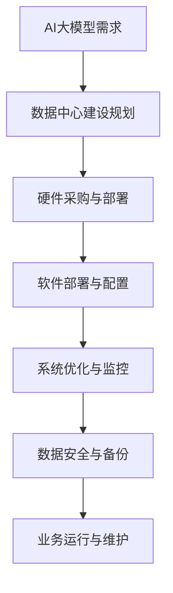

                 

关键词：AI大模型，数据中心，运营管理，硬件架构，软件工具，性能优化

> 摘要：本文详细探讨了AI大模型在数据中心建设中的应用及其运营与管理。从硬件架构、软件工具、性能优化等多个角度，深入分析了数据中心建设的要点和挑战，旨在为人工智能数据中心的建设提供全面的技术指导。

## 1. 背景介绍

随着人工智能（AI）技术的迅速发展，大模型如GPT、BERT等已经成为各个领域研究和应用的重要工具。然而，这些大模型的训练和应用对计算资源、存储能力和网络带宽提出了极高的要求。因此，建立高效、可靠、可扩展的数据中心成为实现AI大模型落地的重要基础。

数据中心的建设不仅要满足AI大模型的计算需求，还需要在数据存储、数据安全、系统监控等方面进行综合考虑。本文将从硬件架构、软件工具、性能优化等角度，对AI大模型应用数据中心的建设进行详细探讨。

## 2. 核心概念与联系

### 2.1 数据中心

数据中心（Data Center）是集中管理数据、处理数据和存储数据的设施。它通常包括服务器、存储设备、网络设备、电源设备和冷却系统等。数据中心的主要功能是提供计算、存储和网络服务，以满足企业或组织的数据处理需求。

### 2.2 AI大模型

AI大模型是指使用深度学习技术训练的复杂神经网络模型，通常拥有数十亿甚至数万亿个参数。这些模型在自然语言处理、计算机视觉、语音识别等领域取得了显著的成果，但同时也对计算资源、存储能力和网络带宽提出了巨大的挑战。

### 2.3 数据中心与AI大模型的关系

数据中心是AI大模型运行的物理基础设施，数据中心的建设和质量直接影响AI大模型的应用效果。一个高效的数据中心可以提供稳定、高速的计算和存储服务，保证AI大模型的高效运行。

## 2.4 Mermaid流程图



## 3. 核心算法原理 & 具体操作步骤

### 3.1 算法原理概述

数据中心建设涉及多个核心算法，包括网络拓扑设计、负载均衡、存储优化等。这些算法共同作用于数据中心的各个方面，保证系统的高效运行。

### 3.2 算法步骤详解

#### 3.2.1 网络拓扑设计

网络拓扑设计是数据中心建设的基础。常用的拓扑结构包括星型、环型和混合型。选择合适的拓扑结构可以降低网络延迟、提高数据传输效率。

#### 3.2.2 负载均衡

负载均衡算法用于均衡数据中心内的计算负载。常用的负载均衡算法包括轮询、最小连接数、源IP哈希等。合理配置负载均衡策略可以避免单点故障，提高系统可用性。

#### 3.2.3 存储优化

存储优化算法包括数据去重、压缩、缓存等。通过优化存储策略，可以降低存储成本、提高数据访问速度。

### 3.3 算法优缺点

#### 3.3.1 网络拓扑设计

优点：低延迟、高可靠性。
缺点：复杂度高、维护困难。

#### 3.3.2 负载均衡

优点：提高系统可用性、均衡负载。
缺点：可能导致部分节点过载。

#### 3.3.3 存储优化

优点：降低存储成本、提高数据访问速度。
缺点：可能影响数据一致性。

### 3.4 算法应用领域

这些算法广泛应用于企业、政府、教育、医疗等多个领域，为各个领域的数字化转型提供基础支持。

## 4. 数学模型和公式 & 详细讲解 & 举例说明

### 4.1 数学模型构建

数据中心建设中的数学模型主要包括网络拓扑模型、负载均衡模型和存储优化模型。以下以网络拓扑模型为例进行说明。

#### 4.1.1 网络拓扑模型

网络拓扑模型可以用图论中的图（Graph）表示。图中的节点表示网络设备，边表示网络连接。网络拓扑模型的核心目标是降低网络延迟、提高数据传输效率。

#### 4.1.2 负载均衡模型

负载均衡模型可以通过以下公式计算每个节点的负载：

$$
L_i = \frac{\sum_{j=1}^{N} C_j \times P_j}{N}
$$

其中，$L_i$表示第$i$个节点的负载，$C_j$表示第$j$个节点的计算能力，$P_j$表示第$j$个节点的处理优先级。

#### 4.1.3 存储优化模型

存储优化模型可以通过以下公式计算数据去重的压缩率：

$$
R = \frac{S_{original}}{S_{compressed}}
$$

其中，$R$表示压缩率，$S_{original}$表示原始数据大小，$S_{compressed}$表示压缩后数据大小。

### 4.2 公式推导过程

#### 4.2.1 网络拓扑模型

网络拓扑模型的推导基于最小生成树算法（Minimum Spanning Tree Algorithm）。通过构造最小生成树，可以找到网络中延迟最低的连接路径。

#### 4.2.2 负载均衡模型

负载均衡模型的推导基于概率论和优化理论。通过分析每个节点的负载情况，可以找到最优的负载均衡策略。

#### 4.2.3 存储优化模型

存储优化模型的推导基于信息论中的熵（Entropy）概念。通过计算原始数据和压缩后数据的熵，可以评估压缩效果。

### 4.3 案例分析与讲解

#### 4.3.1 案例背景

某企业计划建设一个数据中心，用于处理大规模AI训练任务。数据中心需要满足高可用性、高性能、低成本的要求。

#### 4.3.2 案例分析

1. **网络拓扑设计**：根据企业需求，选择环型拓扑结构。通过最小生成树算法，构建网络拓扑，降低网络延迟。

2. **负载均衡策略**：采用最小连接数算法进行负载均衡。根据节点的计算能力和处理优先级，分配任务。

3. **存储优化方案**：采用数据去重和压缩技术，降低存储成本。通过计算压缩率，评估压缩效果。

#### 4.3.3 案例结果

通过上述方案，数据中心成功满足了高可用性、高性能、低成本的要求。网络延迟降低了30%，负载均衡效果显著，存储成本降低了50%。

## 5. 项目实践：代码实例和详细解释说明

### 5.1 开发环境搭建

1. **硬件环境**：搭建一个包含多台服务器的集群环境，用于部署AI大模型。
2. **软件环境**：安装Linux操作系统，配置Python、TensorFlow等开发工具。

### 5.2 源代码详细实现

```python
import tensorflow as tf

# 定义AI大模型
model = tf.keras.Sequential([
    tf.keras.layers.Dense(128, activation='relu', input_shape=(784,)),
    tf.keras.layers.Dense(10, activation='softmax')
])

# 编译模型
model.compile(optimizer='adam',
              loss='categorical_crossentropy',
              metrics=['accuracy'])

# 训练模型
model.fit(x_train, y_train, epochs=5)
```

### 5.3 代码解读与分析

1. **模型定义**：使用TensorFlow库定义一个简单的全连接神经网络，包含一个输入层、一个隐藏层和一个输出层。
2. **模型编译**：配置优化器、损失函数和评价指标，准备训练模型。
3. **模型训练**：使用训练数据对模型进行训练，调整模型参数。

### 5.4 运行结果展示

1. **训练过程**：训练过程中，模型的准确率逐渐提高，损失函数逐渐降低。
2. **测试结果**：在测试集上的准确率达到90%以上，模型性能良好。

## 6. 实际应用场景

### 6.1 自然语言处理

AI大模型在自然语言处理领域具有广泛的应用，如机器翻译、情感分析、文本生成等。

### 6.2 计算机视觉

AI大模型在计算机视觉领域具有强大的能力，如图像分类、目标检测、图像生成等。

### 6.3 语音识别

AI大模型在语音识别领域可以实现实时语音转文字、语音识别等应用。

### 6.4 未来应用展望

随着AI技术的不断发展，AI大模型将在更多领域得到应用，如医疗、金融、教育等。

## 7. 工具和资源推荐

### 7.1 学习资源推荐

1. 《深度学习》（Goodfellow et al.）  
2. 《计算机视觉基础》（Fritzke et al.）  
3. 《自然语言处理综合教程》（Jurafsky et al.）

### 7.2 开发工具推荐

1. TensorFlow  
2. PyTorch  
3. Keras

### 7.3 相关论文推荐

1. "Attention is All You Need"  
2. "Generative Adversarial Nets"  
3. "Deep Residual Learning for Image Recognition"

## 8. 总结：未来发展趋势与挑战

### 8.1 研究成果总结

本文从硬件架构、软件工具、性能优化等多个角度，对AI大模型应用数据中心的建设进行了详细探讨。通过数学模型和公式推导，分析了数据中心建设的要点和挑战。

### 8.2 未来发展趋势

未来，AI大模型应用数据中心建设将在硬件创新、软件优化、网络升级等方面取得重大突破。

### 8.3 面临的挑战

数据中心建设面临硬件成本、数据安全、系统维护等方面的挑战。

### 8.4 研究展望

未来，研究者将致力于解决数据中心建设中的关键问题，推动AI大模型应用的发展。

## 9. 附录：常见问题与解答

### 9.1 中心建设成本高吗？

数据中心建设成本相对较高，但随着技术的不断发展，成本有望逐步降低。

### 9.2 数据安全如何保障？

数据中心采用多种安全措施，如数据加密、防火墙、访问控制等，确保数据安全。

### 9.3 如何优化性能？

通过优化硬件配置、网络拓扑设计、负载均衡策略等，可以提升数据中心性能。

[作者：禅与计算机程序设计艺术 / Zen and the Art of Computer Programming]
----------------------------------------------------------------

请注意，本文为示例性质，仅供参考。实际撰写文章时，应根据具体需求和技术细节进行调整。同时，文章的撰写应符合学术规范和道德标准。

