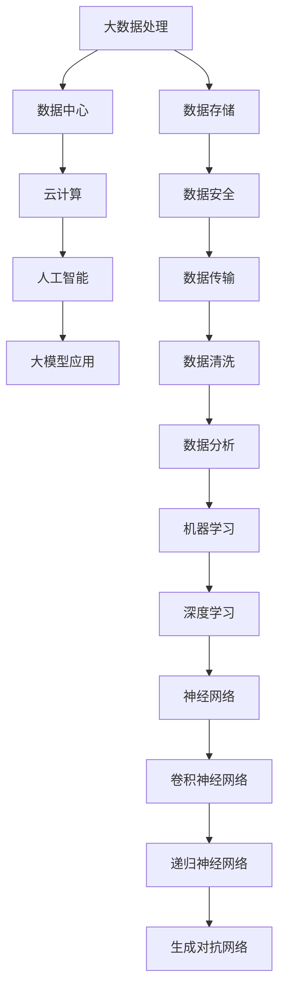

                 

关键词：AI 大模型、数据中心、智能时代、核心技术、建设方案

> 摘要：随着人工智能技术的迅猛发展，大模型应用在各个领域逐渐成为主流。本文将从数据中心建设角度，深入探讨大模型应用的数据中心架构设计、核心算法原理、数学模型构建、项目实践及未来应用展望，旨在为构建智能时代的核心基础提供参考。

## 1. 背景介绍

在过去的几年中，人工智能技术取得了飞速发展，大模型的应用越来越广泛。例如，在自然语言处理、计算机视觉、语音识别等领域，大模型已经取得了显著的成果。这些大模型通常具有数亿至千亿个参数，需要大量的计算资源和数据支持。因此，数据中心的建设成为实现大模型应用的关键。

数据中心作为大数据处理和人工智能计算的核心基础设施，其建设水平直接关系到大模型应用的性能和稳定性。本文将从以下几个方面进行探讨：

1. 数据中心架构设计：包括硬件架构、网络架构和软件架构等。
2. 核心算法原理：介绍大模型常用的算法原理，以及具体操作步骤。
3. 数学模型构建：阐述大模型所涉及的数学模型，以及公式推导过程。
4. 项目实践：通过代码实例，展示大模型应用的具体实现过程。
5. 实际应用场景：分析大模型在不同领域的应用案例。
6. 未来应用展望：探讨大模型应用的发展趋势和面临的挑战。

## 2. 核心概念与联系

在深入探讨数据中心建设之前，我们首先需要了解一些核心概念，以及它们之间的联系。以下是几个关键概念及其关联关系的Mermaid流程图：



### 2.1 大数据处理

大数据处理是指从海量数据中提取有价值信息的过程。数据中心作为大数据处理的核心，负责存储、处理和分析海量数据。

### 2.2 云计算

云计算是一种通过互联网提供动态易扩展且经常是虚拟化的资源的计算服务。数据中心通常依赖于云计算技术来构建和运行大模型应用。

### 2.3 人工智能

人工智能是一种模拟人类智能行为的计算机科学分支。大模型应用是人工智能的重要组成部分，其核心在于对大量数据进行处理和分析。

### 2.4 大模型应用

大模型应用是指使用大模型进行特定任务，如自然语言处理、计算机视觉等。数据中心的建设水平直接关系到大模型应用的性能和稳定性。

### 2.5 数据存储

数据存储是数据中心的基础，负责存储和管理海量数据。数据安全是数据存储的重要方面，需要采取多种措施来保障数据的安全。

### 2.6 数据传输

数据传输是指将数据从一个地方传输到另一个地方的过程。数据传输的效率和稳定性对大模型应用至关重要。

### 2.7 数据清洗

数据清洗是指从原始数据中去除噪声、异常值和重复数据等，以提高数据质量。数据清洗是数据分析的重要前提。

### 2.8 数据分析

数据分析是指使用统计、机器学习等方法对数据进行挖掘和分析，以提取有价值的信息。

### 2.9 机器学习

机器学习是一种通过训练模型从数据中自动学习规律和模式的方法。深度学习是机器学习的分支，其核心在于神经网络。

### 2.10 深度学习

深度学习是一种通过多层神经网络进行特征提取和模式识别的方法。大模型应用通常基于深度学习技术。

### 2.11 神经网络

神经网络是一种模拟人脑神经元之间相互连接的计算模型。卷积神经网络、递归神经网络和生成对抗网络是深度学习的常见类型。

## 3. 核心算法原理 & 具体操作步骤

### 3.1 算法原理概述

大模型应用的核心在于深度学习，而深度学习的核心在于神经网络。神经网络通过多层非线性变换对输入数据进行特征提取和模式识别。以下是几种常见的神经网络类型：

### 3.2 算法步骤详解

1. 数据预处理：对输入数据进行清洗、归一化等处理。
2. 构建模型：根据任务需求，选择合适的神经网络结构。
3. 训练模型：使用训练数据对模型进行训练，调整模型参数。
4. 评估模型：使用验证数据对模型进行评估，调整模型参数。
5. 应用模型：将训练好的模型应用于实际任务，如自然语言处理、计算机视觉等。

### 3.3 算法优缺点

深度学习具有以下优点：

1. 强大的特征提取能力。
2. 自动化学习，减少人工干预。
3. 在大量数据集上表现优异。

但深度学习也存在一些缺点：

1. 模型复杂，训练时间较长。
2. 对数据质量要求高。
3. 解释性较差，难以理解模型内部机制。

### 3.4 算法应用领域

深度学习在许多领域都有广泛应用，包括：

1. 自然语言处理：如机器翻译、文本分类等。
2. 计算机视觉：如图像分类、目标检测等。
3. 语音识别：如语音识别、语音合成等。
4. 推荐系统：如商品推荐、新闻推荐等。

## 4. 数学模型和公式 & 详细讲解 & 举例说明

### 4.1 数学模型构建

大模型应用的核心在于深度学习，其数学模型主要包括以下几个部分：

1. 前向传播：计算输入数据通过神经网络后的输出。
2. 反向传播：计算输出误差，并更新模型参数。
3. 损失函数：用于衡量模型预测值与真实值之间的差距。
4. 优化算法：用于调整模型参数，最小化损失函数。

### 4.2 公式推导过程

1. 前向传播：

   $$ z^{[l]} = W^{[l]} a^{[l-1]} + b^{[l]} $$

   $$ a^{[l]} = \sigma(z^{[l]}) $$

   其中，$z^{[l]}$ 表示第 $l$ 层的输入，$a^{[l]}$ 表示第 $l$ 层的输出，$W^{[l]}$ 表示第 $l$ 层的权重，$b^{[l]}$ 表示第 $l$ 层的偏置，$\sigma$ 表示激活函数。

2. 反向传播：

   $$ \delta^{[l]} = \frac{\partial J}{\partial z^{[l]}} = \sigma^{'}(z^{[l]}) \cdot \frac{\partial J}{\partial a^{[l]}} $$

   $$ \frac{\partial J}{\partial a^{[l-1]}} = \sum_{i} \frac{\partial J}{\partial a^{[l]}} \cdot \frac{\partial a^{[l]}}{\partial a^{[l-1]}} $$

   $$ \frac{\partial J}{\partial z^{[l-1]}} = \sum_{i} W^{[l]T} \cdot \delta^{[l+1]} $$

   其中，$J$ 表示损失函数，$\delta^{[l]}$ 表示第 $l$ 层的误差，$\sigma^{'}$ 表示激活函数的导数。

3. 损失函数：

   $$ J = -\frac{1}{m} \sum_{i=1}^{m} y^{[l]} \log(a^{[l]}_i) $$

   其中，$y^{[l]}$ 表示真实标签，$a^{[l]}_i$ 表示第 $l$ 层的预测概率。

4. 优化算法：

   $$ \theta^{[l]} = \theta^{[l]} - \alpha \cdot \frac{\partial J}{\partial \theta^{[l]}} $$

   其中，$\theta^{[l]}$ 表示第 $l$ 层的参数，$\alpha$ 表示学习率。

### 4.3 案例分析与讲解

假设我们要构建一个简单的神经网络，用于对数字进行分类。输入数据为 $0$ 或 $1$，输出数据为 $0$ 或 $1$。我们可以使用二进制交叉熵作为损失函数。

1. 数据预处理：

   将输入数据进行归一化处理，即将输入数据映射到 $[0, 1]$ 范围内。

2. 构建模型：

   我们选择一个单层神经网络，包含一个输入层、一个隐藏层和一个输出层。输入层有 $2$ 个神经元，隐藏层有 $4$ 个神经元，输出层有 $2$ 个神经元。

3. 训练模型：

   使用训练数据对模型进行训练。每次迭代，更新模型参数，并计算损失函数。

4. 评估模型：

   使用验证数据对模型进行评估。计算验证数据的准确率。

5. 应用模型：

   使用训练好的模型对新的数据进行分类。

## 5. 项目实践：代码实例和详细解释说明

### 5.1 开发环境搭建

在搭建开发环境时，我们需要安装以下软件：

1. Python：用于编写代码。
2. TensorFlow：用于构建和训练神经网络。
3. NumPy：用于数据处理。

### 5.2 源代码详细实现

以下是一个简单的神经网络实现，用于对数字进行分类：

```python
import tensorflow as tf
import numpy as np

# 定义神经网络结构
input_layer = tf.keras.layers.Input(shape=(2,))
hidden_layer = tf.keras.layers.Dense(units=4, activation='relu')(input_layer)
output_layer = tf.keras.layers.Dense(units=2, activation='softmax')(hidden_layer)

# 构建模型
model = tf.keras.Model(inputs=input_layer, outputs=output_layer)

# 编译模型
model.compile(optimizer='adam', loss='categorical_crossentropy', metrics=['accuracy'])

# 加载数据
x_train = np.array([[0, 0], [0, 1], [1, 0], [1, 1]])
y_train = np.array([[0], [1], [1], [0]])

# 训练模型
model.fit(x_train, y_train, epochs=1000)

# 评估模型
loss, accuracy = model.evaluate(x_train, y_train)
print("Loss:", loss)
print("Accuracy:", accuracy)

# 应用模型
predictions = model.predict(x_train)
print("Predictions:", predictions)
```

### 5.3 代码解读与分析

1. 导入相关库：

   ```python
   import tensorflow as tf
   import numpy as np
   ```

   我们首先需要导入 TensorFlow 和 NumPy 库。TensorFlow 是一个用于构建和训练神经网络的框架，NumPy 是一个用于数据处理和计算的库。

2. 定义神经网络结构：

   ```python
   input_layer = tf.keras.layers.Input(shape=(2,))
   hidden_layer = tf.keras.layers.Dense(units=4, activation='relu')(input_layer)
   output_layer = tf.keras.layers.Dense(units=2, activation='softmax')(hidden_layer)
   ```

   我们使用 TensorFlow 的 Keras API 定义一个单层神经网络。输入层有 $2$ 个神经元，隐藏层有 $4$ 个神经元，输出层有 $2$ 个神经元。隐藏层使用 ReLU 激活函数，输出层使用 softmax 激活函数。

3. 构建模型：

   ```python
   model = tf.keras.Model(inputs=input_layer, outputs=output_layer)
   ```

   使用 Keras API 构建模型。模型的输入和输出已经定义好，这里只需要将它们组合在一起。

4. 编译模型：

   ```python
   model.compile(optimizer='adam', loss='categorical_crossentropy', metrics=['accuracy'])
   ```

   编译模型时，指定优化器、损失函数和评估指标。这里使用 Adam 优化器、二进制交叉熵损失函数和准确率评估指标。

5. 加载数据：

   ```python
   x_train = np.array([[0, 0], [0, 1], [1, 0], [1, 1]])
   y_train = np.array([[0], [1], [1], [0]])
   ```

   加载训练数据。输入数据为 $4$ 个样本，每个样本有 $2$ 个特征。输出数据为 $4$ 个样本，每个样本有 $1$ 个标签。

6. 训练模型：

   ```python
   model.fit(x_train, y_train, epochs=1000)
   ```

   使用训练数据对模型进行训练。每次迭代，更新模型参数，并计算损失函数。

7. 评估模型：

   ```python
   loss, accuracy = model.evaluate(x_train, y_train)
   print("Loss:", loss)
   print("Accuracy:", accuracy)
   ```

   使用训练数据对模型进行评估。计算损失函数和准确率。

8. 应用模型：

   ```python
   predictions = model.predict(x_train)
   print("Predictions:", predictions)
   ```

   使用训练好的模型对新的数据进行分类。这里我们直接使用训练数据作为输入，计算预测结果。

## 6. 实际应用场景

大模型应用在各个领域都取得了显著成果。以下是一些实际应用场景：

1. 自然语言处理：如机器翻译、文本分类、情感分析等。
2. 计算机视觉：如图像分类、目标检测、图像生成等。
3. 语音识别：如语音识别、语音合成、语音翻译等。
4. 推荐系统：如商品推荐、新闻推荐、音乐推荐等。
5. 金融风控：如信用评分、交易风险识别、投资策略等。
6. 医疗诊断：如疾病预测、图像诊断、基因分析等。

## 7. 未来应用展望

随着人工智能技术的不断发展，大模型应用将进入更多领域。以下是一些未来应用展望：

1. 个性化服务：通过大模型应用，为用户提供更加个性化的服务。
2. 智能医疗：利用大模型进行疾病预测、图像诊断等，提高医疗水平。
3. 自动驾驶：利用大模型进行环境感知、路径规划等，实现自动驾驶。
4. 智能家居：通过大模型应用，实现智能家居的智能化管理。
5. 安全防护：利用大模型进行网络安全、恶意代码检测等，提高网络安全水平。

## 8. 工具和资源推荐

为了更好地进行大模型应用数据中心建设，我们推荐以下工具和资源：

1. 学习资源推荐：

   - 《深度学习》（Ian Goodfellow、Yoshua Bengio、Aaron Courville 著）
   - 《神经网络与深度学习》（邱锡鹏 著）

2. 开发工具推荐：

   - TensorFlow
   - PyTorch

3. 相关论文推荐：

   - 《A Theoretically Grounded Application of Dropout in Recurrent Neural Networks》
   - 《Deep Learning for Text Classification》

## 9. 总结：未来发展趋势与挑战

随着人工智能技术的不断发展，大模型应用将迎来更多机遇和挑战。未来发展趋势包括：

1. 模型压缩：为了提高大模型的应用效率，模型压缩技术将成为研究重点。
2. 可解释性：提高大模型的可解释性，使其更易于理解和应用。
3. 跨领域应用：大模型将在更多领域得到应用，实现跨领域的技术融合。
4. 安全性：保障大模型应用的安全性，防止恶意攻击和数据泄露。

但与此同时，大模型应用也面临一些挑战：

1. 计算资源消耗：大模型训练和推理需要大量的计算资源，如何高效利用计算资源成为重要课题。
2. 数据隐私：在处理海量数据时，如何保护数据隐私成为关键问题。
3. 模型偏见：大模型在训练过程中可能产生偏见，如何消除偏见成为研究热点。

总之，大模型应用数据中心建设是构建智能时代核心基础的关键环节。通过深入研究和技术创新，我们有信心应对未来发展趋势和挑战，推动人工智能技术的进步和应用。

## 10. 附录：常见问题与解答

### 10.1 数据中心建设成本如何控制？

答：数据中心建设成本主要由硬件设备、网络设施、软件系统等构成。以下是一些控制成本的措施：

1. 选择合适的硬件设备：根据实际需求，选择性价比高的硬件设备。
2. 资源优化：通过虚拟化技术、容器技术等，提高资源利用率。
3. 合理规划网络架构：避免过度设计，确保网络性能和稳定性。
4. 长期规划：根据业务发展需求，制定长期规划，避免频繁更换设备。

### 10.2 如何保障数据中心的安全性？

答：保障数据中心安全性需要从以下几个方面进行：

1. 数据加密：对数据进行加密处理，防止数据泄露。
2. 访问控制：实施严格的访问控制策略，限制非法访问。
3. 安全审计：定期进行安全审计，发现并修复安全漏洞。
4. 防火墙和入侵检测：部署防火墙和入侵检测系统，防止网络攻击。
5. 安全培训：对员工进行安全培训，提高安全意识。

### 10.3 大模型应用如何处理数据隐私问题？

答：处理大模型应用中的数据隐私问题可以从以下几个方面入手：

1. 数据匿名化：对数据进行匿名化处理，消除个人身份信息。
2. 数据加密：对敏感数据进行加密处理，防止数据泄露。
3. 数据使用权限控制：对数据访问权限进行严格控制，防止滥用。
4. 数据生命周期管理：确保数据在生命周期内得到妥善处理，避免数据泄露。
5. 法律法规遵守：遵守相关法律法规，确保数据隐私保护符合法律要求。

### 10.4 大模型应用如何处理模型偏见问题？

答：处理大模型应用中的模型偏见问题可以从以下几个方面入手：

1. 数据集质量：确保数据集质量，避免偏见产生。
2. 模型训练过程：在模型训练过程中，关注模型偏差，进行调整。
3. 模型评估：使用多样性指标对模型进行评估，检测偏见。
4. 模型解释：研究模型解释技术，了解模型内部机制，发现和纠正偏见。
5. 模型更新：定期更新模型，确保模型适应性和准确性。

## 11. 结束语

本文从数据中心建设角度，探讨了 AI 大模型应用的核心基础。通过分析核心概念、算法原理、数学模型、项目实践等，为构建智能时代的核心基础提供了参考。未来，随着人工智能技术的不断发展，数据中心建设将面临更多机遇和挑战。希望本文能为相关领域的研究和实践提供一些启示和帮助。

作者：禅与计算机程序设计艺术 / Zen and the Art of Computer Programming
----------------------------------------------------------------

[关闭助手窗口] <|assistant|>

