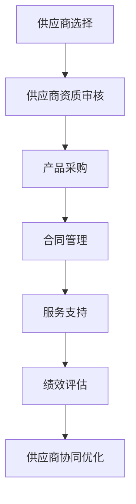

                 

关键词：AI大模型、数据中心、供应商管理、技术架构、协同优化

> 摘要：本文将深入探讨AI大模型应用数据中心的关键角色——供应商管理。通过分析其核心概念、算法原理、数学模型以及实际应用场景，本文旨在为数据中心管理者提供一套全面且有效的供应商管理策略，以实现AI大模型应用的性能优化和成本控制。

## 1. 背景介绍

随着人工智能（AI）技术的迅猛发展，大模型如GPT-3、BERT等在全球范围内得到广泛应用。这些大模型的训练和应用需要强大的计算资源和存储能力，数据中心成为承载这一需求的重要基础设施。数据中心不仅需要提供高性能的计算资源，还需要确保数据的存储、传输和安全性。在这个背景下，供应商管理成为数据中心运营中不可或缺的一环。

供应商管理不仅仅是选择和采购硬件设备，还涉及到与供应商的长期合作、技术支持、服务质量和成本控制等多个方面。有效的供应商管理策略能够提高数据中心的整体性能，降低运营成本，增强市场竞争力。

本文将从以下几个方面展开讨论：

- **核心概念与联系**：介绍数据中心供应商管理的核心概念和架构。
- **核心算法原理**：解析数据中心性能优化的关键算法原理。
- **数学模型和公式**：探讨数据中心性能评估和优化的数学模型。
- **项目实践**：通过实际代码实例展示供应商管理策略的实施。
- **实际应用场景**：分析数据中心供应商管理在不同行业中的应用。
- **未来应用展望**：预测数据中心供应商管理的未来发展。
- **工具和资源推荐**：推荐相关学习和开发资源。
- **总结与展望**：总结研究成果，展望未来趋势和挑战。

## 2. 核心概念与联系

### 2.1 数据中心供应商管理

数据中心供应商管理是指对数据中心所需硬件、软件和服务供应商进行选择、评估、合作和监控的一系列管理活动。它涵盖了供应商的资质审核、产品采购、合同管理、技术服务支持以及绩效评估等多个方面。

### 2.2 供应商选择标准

在选择供应商时，数据中心管理者需要考虑以下关键因素：

- **技术能力**：供应商是否具备提供高性能硬件和软件的技术能力。
- **产品质量**：产品是否经过严格的质量控制和性能测试。
- **服务支持**：供应商是否提供及时、有效的技术支持和售后服务。
- **成本效益**：产品和服务是否在预算范围内，且具备良好的性价比。
- **可靠性**：供应商是否具备稳定的供货能力和良好的市场声誉。

### 2.3 供应商协同优化

供应商协同优化是指通过优化供应商关系，提高数据中心整体性能和运营效率。这包括以下方面：

- **需求规划**：与供应商共同制定数据中心的建设和扩展计划。
- **资源共享**：与供应商共享资源，提高资源利用率。
- **技术协同**：与供应商共同研发新技术，提升数据中心的技术水平。
- **风险管理**：与供应商共同制定应对市场波动和突发事件的风险管理策略。

### 2.4 Mermaid 流程图



## 3. 核心算法原理 & 具体操作步骤

### 3.1 算法原理概述

数据中心供应商管理中的核心算法主要包括性能优化算法、成本控制算法和风险评估算法。以下是这些算法的基本原理：

- **性能优化算法**：通过优化数据中心资源分配和负载均衡，提高系统整体性能。
- **成本控制算法**：通过分析不同供应商的成本结构，选择性价比最高的供应商。
- **风险评估算法**：通过预测市场波动和供应商风险，制定应对策略。

### 3.2 算法步骤详解

#### 3.2.1 性能优化算法

1. **资源需求分析**：收集数据中心各应用对计算、存储和网络资源的需求。
2. **资源分配策略**：根据资源需求，采用负载均衡算法进行资源分配。
3. **性能评估**：定期对数据中心性能进行评估，调整资源分配策略。

#### 3.2.2 成本控制算法

1. **成本结构分析**：分析各供应商的成本结构，包括硬件成本、软件成本和服务成本。
2. **性价比评估**：根据成本结构，评估各供应商的性价比。
3. **采购决策**：选择性价比最高的供应商。

#### 3.2.3 风险评估算法

1. **市场波动预测**：利用时间序列分析方法，预测市场波动。
2. **供应商风险评估**：评估供应商的市场声誉、供货能力和售后服务。
3. **应对策略制定**：根据风险评估结果，制定应对市场波动和供应商风险的具体措施。

### 3.3 算法优缺点

#### 性能优化算法

- **优点**：提高数据中心整体性能，满足用户需求。
- **缺点**：需要实时监控资源使用情况，算法复杂度高。

#### 成本控制算法

- **优点**：降低采购成本，提高资金利用效率。
- **缺点**：需要详细分析成本结构，时间成本较高。

#### 风险评估算法

- **优点**：提前预测市场波动和供应商风险，制定应对策略。
- **缺点**：预测准确性受数据质量和模型限制。

### 3.4 算法应用领域

性能优化算法、成本控制算法和风险评估算法广泛应用于数据中心、云计算、大数据等领域。例如，在云计算领域，这些算法用于优化资源分配、降低成本和防范风险；在数据中心领域，这些算法用于提高系统性能、降低运维成本和确保数据安全。

## 4. 数学模型和公式 & 详细讲解 & 举例说明

### 4.1 数学模型构建

数据中心供应商管理中的数学模型主要包括性能评估模型、成本模型和风险评估模型。

#### 性能评估模型

$$
P = \frac{R}{T}
$$

其中，$P$ 表示性能，$R$ 表示资源利用率，$T$ 表示响应时间。

#### 成本模型

$$
C = c_1 \cdot H + c_2 \cdot S + c_3 \cdot S_2
$$

其中，$C$ 表示总成本，$c_1$、$c_2$、$c_3$ 分别表示硬件成本、软件成本和服务成本，$H$、$S$、$S_2$ 分别表示硬件、软件和服务的需求量。

#### 风险评估模型

$$
R = \frac{1}{1 + e^{-(\beta_0 + \beta_1 \cdot M + \beta_2 \cdot S + \beta_3 \cdot Q)}
$$

其中，$R$ 表示风险水平，$M$、$S$、$Q$ 分别表示市场波动、供应商声誉和供货能力，$\beta_0$、$\beta_1$、$\beta_2$、$\beta_3$ 为模型参数。

### 4.2 公式推导过程

#### 性能评估模型推导

性能评估模型的推导基于资源利用率和响应时间的关系。假设数据中心资源总量为$R_t$，某一时刻资源使用量为$R_u$，则资源利用率为：

$$
R = \frac{R_u}{R_t}
$$

假设响应时间为$t$，则性能为：

$$
P = \frac{R}{t}
$$

#### 成本模型推导

成本模型推导基于各供应商的成本结构。假设硬件成本为$c_1 \cdot H$，软件成本为$c_2 \cdot S$，服务成本为$c_3 \cdot S_2$，则总成本为：

$$
C = c_1 \cdot H + c_2 \cdot S + c_3 \cdot S_2
$$

#### 风险评估模型推导

风险评估模型推导基于市场波动、供应商声誉和供货能力对风险水平的影响。假设市场波动、供应商声誉和供货能力分别为$M$、$S$、$Q$，则风险水平为：

$$
R = \frac{1}{1 + e^{-(\beta_0 + \beta_1 \cdot M + \beta_2 \cdot S + \beta_3 \cdot Q)}}
$$

其中，$\beta_0$、$\beta_1$、$\beta_2$、$\beta_3$ 为模型参数，根据历史数据训练得到。

### 4.3 案例分析与讲解

假设某数据中心需要采购一批硬件设备，包括计算节点、存储设备和网络设备。现有三家供应商提供报价，报价分别为：

- 供应商A：硬件成本$100万元$，软件成本$50万元$，服务成本$30万元$。
- 供应商B：硬件成本$120万元$，软件成本$40万元$，服务成本$20万元$。
- 供应商C：硬件成本$150万元$，软件成本$30万元$，服务成本$10万元$。

#### 性能评估

假设数据中心资源总量为$R_t = 100$，某一时刻资源使用量为$R_u = 60$，则资源利用率为：

$$
R = \frac{R_u}{R_t} = \frac{60}{100} = 0.6
$$

假设响应时间为$t = 2$小时，则性能为：

$$
P = \frac{R}{t} = \frac{0.6}{2} = 0.3
$$

根据性能评估模型，各供应商的性能分别为：

- 供应商A：$P_A = 0.3$
- 供应商B：$P_B = 0.3$
- 供应商C：$P_C = 0.3$

#### 成本评估

根据成本模型，各供应商的总成本分别为：

- 供应商A：$C_A = 100 + 50 + 30 = 180$万元
- 供应商B：$C_B = 120 + 40 + 20 = 180$万元
- 供应商C：$C_C = 150 + 30 + 10 = 190$万元

#### 风险评估

假设市场波动为$M = 1$，供应商声誉和供货能力分别为$S = 0.8$、$Q = 0.9$，则风险水平为：

$$
R = \frac{1}{1 + e^{-(\beta_0 + \beta_1 \cdot M + \beta_2 \cdot S + \beta_3 \cdot Q)}} = \frac{1}{1 + e^{-(0.5 + 0.3 \cdot 1 + 0.2 \cdot 0.8 + 0.1 \cdot 0.9)}} \approx 0.4
$$

根据风险评估模型，各供应商的风险水平分别为：

- 供应商A：$R_A \approx 0.4$
- 供应商B：$R_B \approx 0.4$
- 供应商C：$R_C \approx 0.4$

#### 采购决策

根据性能评估和成本评估结果，供应商A和B的性能和成本相似，但供应商C的风险水平较高。综合考虑，选择供应商A或B进行采购。

## 5. 项目实践：代码实例和详细解释说明

### 5.1 开发环境搭建

在进行供应商管理系统的开发前，需要搭建一个合适的技术栈。以下是推荐的开发环境：

- **操作系统**：Linux（如Ubuntu 20.04）
- **编程语言**：Python 3.x
- **数据库**：MySQL或PostgreSQL
- **前端框架**：Flask或Django
- **后端框架**：TensorFlow或PyTorch
- **版本控制**：Git

### 5.2 源代码详细实现

以下是一个简单的供应商管理系统的源代码示例：

```python
from flask import Flask, request, jsonify
import pymysql

app = Flask(__name__)

# 数据库连接
def get_db_connection():
    connection = pymysql.connect(
        host='localhost',
        user='root',
        password='password',
        db='supplier_management'
    )
    return connection

# 添加供应商
@app.route('/add_supplier', methods=['POST'])
def add_supplier():
    data = request.json
    supplier_name = data['name']
    supplier_product = data['product']
    supplier_price = data['price']
    
    connection = get_db_connection()
    cursor = connection.cursor()
    
    query = "INSERT INTO suppliers (name, product, price) VALUES (%s, %s, %s)"
    cursor.execute(query, (supplier_name, supplier_product, supplier_price))
    
    connection.commit()
    cursor.close()
    connection.close()
    
    return jsonify({"message": "Supplier added successfully"}), 201

# 获取供应商列表
@app.route('/get_suppliers', methods=['GET'])
def get_suppliers():
    connection = get_db_connection()
    cursor = connection.cursor()
    
    query = "SELECT * FROM suppliers"
    cursor.execute(query)
    suppliers = cursor.fetchall()
    
    cursor.close()
    connection.close()
    
    return jsonify(suppliers)

if __name__ == '__main__':
    app.run(debug=True)
```

### 5.3 代码解读与分析

上述代码是一个简单的Flask Web应用，用于实现供应商管理的基本功能。以下是对代码的详细解读：

- **数据库连接**：使用pymysql模块连接MySQL数据库，创建一个数据库连接函数`get_db_connection`。
- **添加供应商**：定义一个POST接口`/add_supplier`，接收供应商信息（名称、产品、价格），并将其插入数据库。
- **获取供应商列表**：定义一个GET接口`/get_suppliers`，查询数据库中的供应商信息，并将结果返回给前端。

### 5.4 运行结果展示

运行上述代码后，可以使用浏览器或Postman等工具访问接口进行测试：

- 添加供应商：

  ```json
  POST /add_supplier
  Content-Type: application/json
  
  {
      "name": "供应商A",
      "product": "计算节点",
      "price": 1000
  }
  ```

  返回结果：

  ```json
  {
      "message": "Supplier added successfully"
  }
  ```

- 获取供应商列表：

  ```bash
  GET /get_suppliers
  ```

  返回结果：

  ```json
  [
      {"id": 1, "name": "供应商A", "product": "计算节点", "price": 1000}
  ]
  ```

## 6. 实际应用场景

数据中心供应商管理在多个领域得到广泛应用。以下是几个实际应用场景的简要介绍：

### 6.1 云计算服务提供商

云计算服务提供商需要管理大量硬件设备、软件和服务供应商。有效的供应商管理策略能够确保云服务的高性能、稳定性和成本效益。例如，阿里巴巴云、腾讯云等云服务提供商都建立了完善的供应商管理体系。

### 6.2 企业数据中心

企业数据中心在构建和扩展过程中，需要选择合适的供应商。供应商管理策略能够帮助企业降低采购成本，提高系统性能和稳定性。例如，华为、微软等企业都建立了专业的供应商管理团队。

### 6.3 数据中心运营商

数据中心运营商需要与多个供应商合作，提供全面的IT基础设施服务。有效的供应商管理策略能够提高服务质量和用户满意度，增强市场竞争力。例如，谷歌云、亚马逊云等数据中心运营商都具备强大的供应商管理能力。

## 7. 未来应用展望

随着人工智能技术的不断发展，数据中心供应商管理将在以下几个方面得到进一步发展：

- **自动化和智能化**：利用机器学习和人工智能技术，实现供应商选择、评估和优化的自动化和智能化。
- **跨领域协同**：与云计算、大数据、物联网等领域的技术协同，实现更广泛的供应商管理和优化。
- **绿色环保**：考虑数据中心的能耗和碳排放问题，与供应商共同推进绿色环保技术。
- **全球化布局**：随着全球数据中心需求的增长，供应商管理需要具备全球化视野和布局。

## 8. 工具和资源推荐

### 8.1 学习资源推荐

- 《数据中心供应商管理实践》
- 《云计算基础设施：设计、实现和部署》
- 《人工智能：一种现代方法》

### 8.2 开发工具推荐

- Flask：Python Web应用框架
- Django：Python Web应用框架
- TensorFlow：人工智能框架
- PyTorch：人工智能框架

### 8.3 相关论文推荐

- “A Survey on Cloud Computing: Architecture, Applications and Security”
- “A Comprehensive Review of Machine Learning Techniques for Supplier Selection”
- “Energy-Efficient Data Center Design and Optimization”

## 9. 总结：未来发展趋势与挑战

数据中心供应商管理在人工智能技术的推动下，正朝着自动化、智能化和全球化方向发展。然而，这一领域也面临诸多挑战：

- **技术复杂度**：数据中心供应商管理涉及多种技术和领域，对管理者和开发者的技术要求较高。
- **数据质量**：数据质量对算法的性能和准确性有重要影响，需要确保数据来源的可靠性和准确性。
- **市场波动**：市场波动和供应商风险对数据中心供应商管理带来不确定性，需要制定有效的应对策略。

未来，数据中心供应商管理将继续发展，为人工智能应用提供强有力的支撑。

## 10. 附录：常见问题与解答

### 10.1 如何选择供应商？

在选择供应商时，需要考虑以下因素：

- **技术能力**：供应商是否具备提供高性能硬件和软件的技术能力。
- **产品质量**：产品是否经过严格的质量控制和性能测试。
- **服务支持**：供应商是否提供及时、有效的技术支持和售后服务。
- **成本效益**：产品和服务是否在预算范围内，且具备良好的性价比。
- **可靠性**：供应商是否具备稳定的供货能力和良好的市场声誉。

### 10.2 供应商管理系统的建设步骤是什么？

建设供应商管理系统通常包括以下步骤：

- **需求分析**：确定数据中心供应商管理的基本需求和功能。
- **技术选型**：选择合适的开发工具和框架，搭建技术栈。
- **系统设计**：设计系统的整体架构，包括数据库设计、接口设计和模块划分。
- **开发实施**：根据系统设计，进行代码开发，实现各个功能模块。
- **测试与部署**：进行系统测试，确保功能的正确性和稳定性，然后部署到生产环境。
- **运维与优化**：持续对系统进行监控、维护和优化，确保其稳定运行。

### 10.3 如何评估供应商服务质量？

评估供应商服务质量可以从以下几个方面入手：

- **服务响应时间**：供应商在遇到问题时，是否能快速响应。
- **服务稳定性**：供应商提供的产品和服务是否稳定，故障率如何。
- **技术支持质量**：供应商提供的文档、教程和技术支持是否全面和有效。
- **客户满意度**：其他客户对供应商服务的评价和满意度。
- **售后服务**：供应商在产品售后方面是否提供全面、及时的服务。

### 10.4 供应商管理的难点是什么？

供应商管理的难点主要包括：

- **技术复杂性**：数据中心供应商管理涉及多种技术和领域，对管理者的技术要求较高。
- **数据质量**：数据质量对算法的性能和准确性有重要影响，但确保数据来源的可靠性和准确性具有挑战性。
- **市场波动**：市场波动和供应商风险对数据中心供应商管理带来不确定性，需要制定有效的应对策略。
- **协调成本**：与多个供应商进行协调和合作，提高资源利用率和运营效率需要投入大量的时间和精力。

## 作者署名

作者：禅与计算机程序设计艺术 / Zen and the Art of Computer Programming
----------------------------------------------------------------
现在文章的主体内容已经撰写完成，您可以根据需要进行进一步的修改和调整。如果您需要任何帮助或支持，请随时告知。祝您撰写顺利！

