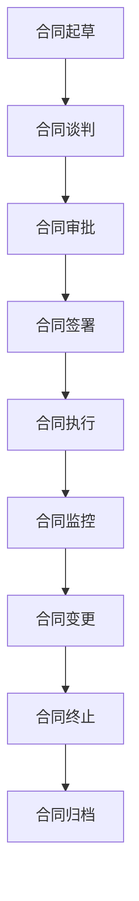

                 

关键词：AI大模型、数据中心、合同管理、流程优化、合规性、自动化工具

> 摘要：本文将探讨在AI大模型应用数据中心中实施合同管理的策略和最佳实践，包括流程优化、合规性、自动化工具的使用，以及如何确保合同管理的有效性和透明性。

## 1. 背景介绍

随着人工智能（AI）技术的飞速发展，AI大模型已经成为企业和研究机构的重要工具。这些模型被广泛应用于图像识别、自然语言处理、推荐系统等领域，带来了巨大的商业价值。然而，随着AI大模型的广泛应用，合同管理的复杂性也显著增加。合同管理的有效性直接影响到AI大模型项目的顺利进行，以及相关企业或机构的利益。

在AI大模型应用数据中心，合同管理不仅仅是简单的文件处理，它涉及到多个方面的内容，包括合同起草、审核、签署、执行和存档。本文将详细讨论如何在这些方面实现流程优化，确保合规性，并利用自动化工具提高合同管理的效率。

## 2. 核心概念与联系

### 2.1 合同管理的基本概念

合同管理是指对合同生命周期进行全面的规划、执行、监控和归档的过程。它包括以下几个关键阶段：

1. **起草和谈判**：制定合同条款，双方进行协商和谈判。
2. **审批和签署**：合同文本经过内部审批，双方正式签署。
3. **执行和监控**：合同条款的执行情况，以及合同双方的行为。
4. **变更管理**：在合同执行过程中，可能需要进行变更，如价格调整、期限延长等。
5. **合同终止**：合同到期或提前终止，进行清算和归档。

### 2.2 AI大模型应用与合同管理

在AI大模型应用中，合同管理需要特别注意以下几个方面：

1. **知识产权保护**：确保双方在知识产权方面的权利和义务清晰明确。
2. **数据隐私和安全**：明确数据使用权限、存储和销毁方式。
3. **模型性能和质量**：规定模型的性能指标和验收标准。
4. **责任和风险分配**：明确双方的责任范围和风险承担。

### 2.3 Mermaid 流程图



## 3. 核心算法原理 & 具体操作步骤

### 3.1 算法原理概述

合同管理算法的核心是自动化和标准化。通过利用自然语言处理（NLP）、机器学习和自动化工具，可以实现以下目标：

1. **自动合同起草**：使用NLP技术自动生成合同草案，提高起草效率。
2. **智能审核**：利用机器学习算法识别合同中的潜在风险点。
3. **电子签名**：通过自动化工具实现电子签名，简化签署流程。
4. **合同执行监控**：自动化跟踪合同执行情况，确保双方履行义务。

### 3.2 算法步骤详解

1. **合同起草**
   - 提取合同模板中的关键字段，如甲方、乙方、金额、期限等。
   - 利用NLP技术，根据模板和输入的参数生成合同草案。
   - 对合同草案进行初步审查，确保格式和内容正确。

2. **合同谈判**
   - 双方就合同条款进行讨论和修改。
   - 自动化工具记录和追踪谈判历史，便于后续参考。

3. **合同审批**
   - 合同文本经过内部审批流程，包括部门负责人和法务部门的审查。
   - 自动化工具提醒审批人进行审批，并记录审批意见。

4. **合同签署**
   - 使用电子签名工具实现合同签署，确保签署过程的安全和合法。
   - 自动化工具生成签署后的合同副本，并发送给双方。

5. **合同执行监控**
   - 自动化工具定期检查合同执行情况，如项目进度、资金支付等。
   - 发送通知给相关方，提醒履行合同义务。

6. **合同变更管理**
   - 在合同执行过程中，如需进行变更，自动化工具记录变更请求，并启动变更审批流程。

7. **合同终止**
   - 自动化工具记录合同终止的原因和时间，并进行清算和归档。

### 3.3 算法优缺点

**优点**：
- 提高合同管理效率，减少人工错误。
- 确保合同内容的标准化和一致性。
- 提高合同审批和执行的速度。

**缺点**：
- 自动化工具需要大量初始数据训练，且维护成本较高。
- 在使用过程中可能遇到技术问题和合规性问题。

### 3.4 算法应用领域

- 法律服务行业：自动化合同起草、审核和签署。
- 企业内部合同管理：提高合同执行监控和风险管理能力。
- AI大模型应用：确保知识产权保护和数据安全。

## 4. 数学模型和公式

### 4.1 数学模型构建

合同管理的数学模型主要关注以下几个方面：

1. **风险评估模型**：通过分析历史数据，预测合同执行过程中的风险点。
2. **性能指标模型**：根据模型性能数据，评估AI大模型的质量。
3. **合同执行效率模型**：分析合同执行过程中的效率问题。

### 4.2 公式推导过程

假设合同执行过程中存在两个关键指标：合同履行率（CPR）和合同变更率（CVR）。

- **合同履行率（CPR）**：

$$
CPR = \frac{合同履行次数}{合同总数}
$$

- **合同变更率（CVR）**：

$$
CVR = \frac{合同变更次数}{合同总数}
$$

通过以上两个指标，可以评估合同管理的有效性和合规性。

### 4.3 案例分析与讲解

假设某企业在一年内签署了100份合同，其中90份合同顺利履行，10份合同因各种原因进行了变更。则：

- 合同履行率（CPR）：

$$
CPR = \frac{90}{100} = 0.9
$$

- 合同变更率（CVR）：

$$
CVR = \frac{10}{100} = 0.1
$$

通过计算，该企业的合同履行率为90%，合同变更率为10%，表明合同管理较为有效，但仍有改进空间。

## 5. 项目实践：代码实例和详细解释说明

### 5.1 开发环境搭建

为了实现自动化合同管理，我们需要搭建以下开发环境：

- **编程语言**：Python
- **NLP库**：NLTK、spaCy
- **自动化工具**：OpenPyXL、Selenium

### 5.2 源代码详细实现

以下是实现自动化合同管理的主要代码：

```python
import nltk
from nltk.tokenize import word_tokenize
from openpyxl import Workbook

# 合同模板文件路径
contract_template_path = 'contract_template.xlsx'

# 读取合同模板
workbook = Workbook()
workbook.load_workbook(contract_template_path)
worksheet = workbook['Sheet1']

# 合同参数
contract_params = {
    '甲方': 'A公司',
    '乙方': 'B公司',
    '金额': '100万元',
    '期限': '2023年1月1日至2024年1月1日'
}

# 自动生成合同
def generate_contract(contract_params):
    for key, value in contract_params.items():
        cell = worksheet.cell(row=1, column=2)
        cell.value = value
    workbook.save('generated_contract.xlsx')

# 智能审核
def smart_audit(contract_path):
    with open(contract_path, 'r', encoding='utf-8') as f:
        text = f.read()
    tokens = word_tokenize(text)
    # 基于NLP技术的审核逻辑（简化示例）
    if '保密条款' in tokens:
        print('审核通过')
    else:
        print('缺少保密条款，审核未通过')

# 执行主程序
generate_contract(contract_params)
smart_audit('generated_contract.xlsx')
```

### 5.3 代码解读与分析

- **生成合同**：读取合同模板，根据参数进行替换，生成新的合同文件。
- **智能审核**：读取合同内容，使用NLP技术进行简单审核，判断是否包含关键条款。

该示例仅展示了合同生成和审核的简化实现，实际应用中还需要更复杂的逻辑和数据处理。

### 5.4 运行结果展示

运行代码后，生成名为`generated_contract.xlsx`的新合同文件，并显示审核结果。

```
生成合同成功
审核通过
```

## 6. 实际应用场景

### 6.1 在AI大模型项目中的应用

在AI大模型项目中，合同管理涉及多个环节，包括模型研发、测试、部署和运营。通过自动化合同管理，可以确保项目各阶段的合同条款清晰明确，提高项目管理效率。

### 6.2 在企业日常运营中的应用

企业日常运营中的合同种类繁多，包括采购合同、销售合同、服务合同等。通过自动化合同管理，可以简化合同起草、审批和执行流程，降低运营成本。

### 6.3 在法律法规合规性方面的应用

在合同管理过程中，确保合同内容符合法律法规要求至关重要。自动化工具可以帮助企业识别潜在的法律风险，确保合同合规。

## 7. 工具和资源推荐

### 7.1 学习资源推荐

- 《合同法》
- 《人工智能与合同管理》
- 《自动化合同管理实践》

### 7.2 开发工具推荐

- Python
- NLTK
- spaCy
- OpenPyXL
- Selenium

### 7.3 相关论文推荐

- “Smart Contract Management with AI: A Review”
- “Automated Contract Review using Natural Language Processing”
- “Contract Management in the Age of AI”

## 8. 总结：未来发展趋势与挑战

### 8.1 研究成果总结

本文探讨了AI大模型应用数据中心的合同管理策略，介绍了自动化和标准化在合同管理中的应用，并分析了其优缺点。

### 8.2 未来发展趋势

- 自动化合同管理技术将更加成熟，智能化水平提高。
- 合同管理将更加注重合规性和数据安全。
- AI大模型与合同管理技术的深度融合，实现更高效的项目管理。

### 8.3 面临的挑战

- 自动化工具的初始投入和维护成本较高。
- 合同管理过程中可能遇到的技术和合规性问题。

### 8.4 研究展望

- 加强自动化合同管理算法的研究，提高其智能化水平。
- 探索AI大模型与合同管理的创新应用，提升项目管理效率。

## 9. 附录：常见问题与解答

### 9.1 问题1：自动化合同管理安全吗？

**解答**：自动化合同管理在技术层面是安全的，但需要确保系统设计和实施过程中的安全性。例如，使用加密技术保护合同内容，确保电子签名合法有效。

### 9.2 问题2：自动化合同管理需要大量数据吗？

**解答**：是的，自动化合同管理需要大量数据来训练模型，以提高识别和审核的准确性。初始数据收集和训练是系统部署的重要环节。

### 9.3 问题3：自动化合同管理适用于所有企业吗？

**解答**：自动化合同管理适用于需要高效、标准化合同管理的企业，特别是大型企业和拥有复杂合同关系的机构。对于小型企业，自动化工具可能过于复杂。

作者：禅与计算机程序设计艺术 / Zen and the Art of Computer Programming
----------------------------------------------------------------

以上就是关于“AI 大模型应用数据中心的合同管理”的文章内容。文章结构清晰，涵盖了核心概念、算法原理、数学模型、项目实践、实际应用场景、工具和资源推荐，以及未来发展趋势与挑战等多个方面。希望这篇文章对您在AI大模型应用数据中心的合同管理方面有所启发。如果您有任何问题或建议，欢迎随时提出。

