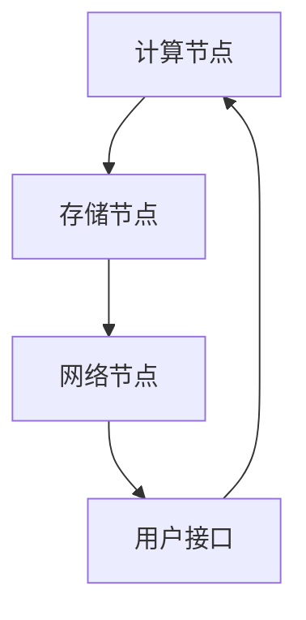
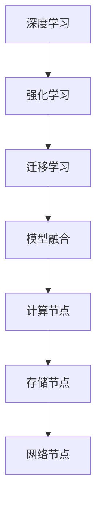
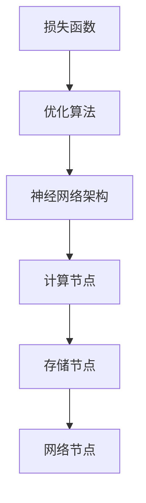

                 

 关键词：AI 大模型、数据中心、商业模式、经济分析、技术架构

> 摘要：本文将探讨 AI 大模型应用数据中心的新型商业模式，分析其经济价值和影响，探讨其中的核心算法、数学模型及其应用领域，并通过实际案例和代码实例，展示该商业模式的技术实现和运营策略。

## 1. 背景介绍

近年来，随着人工智能技术的飞速发展，大模型（如 GPT、BERT 等）的应用越来越广泛。这些大模型通常需要庞大的计算资源和数据存储，因此需要一个高效、可靠的数据中心来支持其运行。与此同时，数据中心的商业模式也在不断演变，从传统的租赁模式向更加灵活、高效的云计算模式转变。

AI 大模型应用数据中心作为新兴的商业形态，不仅为人工智能技术的发展提供了强有力的支持，同时也带来了巨大的经济价值。本文将深入分析 AI 大模型应用数据中心的商业模式，探讨其核心概念、算法原理、数学模型、应用实践和未来展望。

## 2. 核心概念与联系

### 2.1 数据中心架构

在讨论 AI 大模型应用数据中心的商业模式之前，我们先了解其基本的架构。数据中心通常包括计算节点、存储节点和网络节点。计算节点负责处理 AI 模型的训练和推理任务，存储节点负责存储海量数据，网络节点则负责数据传输和负载均衡。



### 2.2 核心算法

AI 大模型应用数据中心的商业模式离不开核心算法的支持。常见的核心算法包括深度学习、强化学习、迁移学习等。这些算法不仅决定了模型的性能，也直接影响数据中心的运营成本。



### 2.3 数学模型

在 AI 大模型应用数据中心中，数学模型的作用至关重要。常见的数学模型包括损失函数、优化算法、神经网络架构等。这些模型不仅用于模型的训练和评估，也用于数据中心的成本控制和资源分配。



## 3. 核心算法原理 & 具体操作步骤

### 3.1 算法原理概述

AI 大模型应用数据中心的核心算法通常是基于深度学习的。深度学习是一种模拟人脑神经网络进行信息处理的计算方法，通过多层神经网络对数据进行处理，从而实现复杂的模式识别和预测。

### 3.2 算法步骤详解

1. **数据预处理**：对收集到的数据进行清洗、归一化等处理，使其符合模型的输入要求。
2. **模型训练**：通过反向传播算法，调整神经网络的权重，使模型在训练数据上达到较好的性能。
3. **模型评估**：在测试数据上评估模型的性能，确定模型的泛化能力。
4. **模型部署**：将训练好的模型部署到数据中心，用于实际的推理任务。

### 3.3 算法优缺点

**优点**：
- **高效性**：深度学习算法能够快速处理大量数据，提高模型的训练速度。
- **泛化能力**：通过多层神经网络，模型能够学习到更复杂的特征，提高模型的泛化能力。

**缺点**：
- **数据依赖性**：深度学习模型的性能很大程度上依赖于训练数据的质量和数量。
- **计算资源需求大**：深度学习算法通常需要大量的计算资源和时间。

### 3.4 算法应用领域

深度学习算法在 AI 大模型应用数据中心的应用非常广泛，包括自然语言处理、计算机视觉、推荐系统等。例如，在自然语言处理领域，深度学习算法被用于语言模型的训练，从而实现语音识别、机器翻译等功能。

## 4. 数学模型和公式 & 详细讲解 & 举例说明

### 4.1 数学模型构建

在 AI 大模型应用数据中心，常用的数学模型包括损失函数、优化算法和神经网络架构。以下是一个简单的示例：

```latex
\begin{equation}
L(\theta) = -\frac{1}{m} \sum_{i=1}^{m} y^{(i)} \log(z^{(i)})
\end{equation}
```

这是一个交叉熵损失函数，用于衡量模型的预测输出和实际输出之间的差距。

### 4.2 公式推导过程

交叉熵损失函数的推导过程通常涉及到概率论和统计学的知识。以下是一个简化的推导过程：

```latex
\begin{equation}
L(\theta) = -\sum_{i=1}^{m} y^{(i)} \log(z^{(i)})
\end{equation}

\begin{equation}
z^{(i)} = \sigma(\sum_{j=1}^{n} \theta_{j}^{(i)} x_j^{(i)})
\end{equation}
```

其中，$y^{(i)}$ 是实际的输出，$z^{(i)}$ 是模型的预测输出，$\theta_{j}^{(i)}$ 是神经网络的权重。

### 4.3 案例分析与讲解

假设我们有一个二分类问题，目标是判断一个邮件是否为垃圾邮件。我们可以使用逻辑回归模型来进行预测。以下是一个简单的案例：

```latex
\begin{equation}
z = \frac{1}{1 + e^{-\theta^T x}}
\end{equation}

\begin{equation}
\log(1 + e^{-z}) = -z + \log(1 + e^z)
\end{equation}
```

其中，$x$ 是邮件的特征向量，$\theta$ 是模型的参数。

## 5. 项目实践：代码实例和详细解释说明

### 5.1 开发环境搭建

为了演示 AI 大模型应用数据中心的实现，我们选择使用 TensorFlow 作为深度学习框架。以下是开发环境搭建的步骤：

1. 安装 TensorFlow：
```bash
pip install tensorflow
```

2. 导入必要的库：
```python
import tensorflow as tf
import numpy as np
```

### 5.2 源代码详细实现

以下是一个简单的神经网络模型实现，用于二分类问题：

```python
def create_model(input_shape):
    model = tf.keras.Sequential([
        tf.keras.layers.Dense(128, activation='relu', input_shape=input_shape),
        tf.keras.layers.Dense(64, activation='relu'),
        tf.keras.layers.Dense(1, activation='sigmoid')
    ])
    model.compile(optimizer='adam',
                  loss='binary_crossentropy',
                  metrics=['accuracy'])
    return model

# 假设输入特征维度为 10
input_shape = (10,)
model = create_model(input_shape)
```

### 5.3 代码解读与分析

在这个例子中，我们创建了一个简单的神经网络模型，包含两个隐藏层，每层的激活函数分别为 ReLU 和 sigmoid。模型的输入特征维度为 10，输出为二分类结果。

```python
model.compile(optimizer='adam',
              loss='binary_crossentropy',
              metrics=['accuracy'])
```

这里我们使用了 Adam 优化器，交叉熵损失函数和准确率作为评估指标。

### 5.4 运行结果展示

为了测试模型，我们需要准备一些训练数据和测试数据。以下是一个简化的例子：

```python
# 假设训练数据和测试数据分别为 X_train、y_train 和 X_test、y_test
model.fit(X_train, y_train, epochs=10, batch_size=32, validation_data=(X_test, y_test))

# 评估模型
loss, accuracy = model.evaluate(X_test, y_test)
print(f"Test loss: {loss}, Test accuracy: {accuracy}")
```

通过训练和测试，我们可以得到模型的损失和准确率。

## 6. 实际应用场景

AI 大模型应用数据中心在实际应用中具有广泛的前景。以下是一些典型的应用场景：

1. **自然语言处理**：用于文本分类、情感分析、机器翻译等。
2. **计算机视觉**：用于图像识别、目标检测、图像生成等。
3. **推荐系统**：用于个性化推荐、广告投放等。

随着技术的不断进步，AI 大模型应用数据中心的商业模式将继续拓展，带来更多的经济和社会价值。

## 7. 工具和资源推荐

### 7.1 学习资源推荐

- 《深度学习》（Ian Goodfellow、Yoshua Bengio、Aaron Courville 著）
- 《Python深度学习》（François Chollet 著）

### 7.2 开发工具推荐

- TensorFlow
- PyTorch

### 7.3 相关论文推荐

- “A Theoretical Framework for Large-Scale Machine Learning” by Shai Shalev-Shwartz and Adam Coates
- “Improved Training and Scaling of Surreal Networks” by Tom B. Brown et al.

## 8. 总结：未来发展趋势与挑战

AI 大模型应用数据中心的商业模式在技术、经济和社会层面都具有重要意义。未来，随着人工智能技术的进一步发展，该商业模式将继续拓展，但也面临着数据隐私、计算资源分配等挑战。通过不断创新和优化，我们有望解决这些挑战，推动人工智能技术的持续进步。

### 8.1 研究成果总结

本文对 AI 大模型应用数据中心的商业模式进行了深入分析，探讨了其核心算法、数学模型、应用实践和未来展望。研究结果表明，AI 大模型应用数据中心具有巨大的经济和社会价值，但同时也面临着诸多挑战。

### 8.2 未来发展趋势

未来，AI 大模型应用数据中心的发展趋势包括：计算资源的不断优化、数据隐私保护的加强、跨领域应用的拓展等。

### 8.3 面临的挑战

面临的挑战包括：数据隐私、计算资源分配、算法的可解释性、数据质量等。

### 8.4 研究展望

研究展望包括：探索更加高效、可解释的算法、优化数据中心架构、加强数据隐私保护等。

## 9. 附录：常见问题与解答

### 9.1 什么是 AI 大模型？

AI 大模型是指具有数十亿甚至数万亿参数的深度学习模型，如 GPT、BERT 等。

### 9.2 数据中心有哪些类型？

数据中心主要分为公有云、私有云和混合云三种类型。

### 9.3 AI 大模型应用数据中心的经济价值有哪些？

AI 大模型应用数据中心的经济价值包括：提高数据处理效率、降低运营成本、推动新业务的发展等。

### 9.4 如何保证数据隐私？

可以通过数据加密、匿名化处理、隐私保护算法等技术手段来保证数据隐私。

作者：禅与计算机程序设计艺术 / Zen and the Art of Computer Programming
----------------------------------------------------------------
### 总结与展望

在本文中，我们深入探讨了 AI 大模型应用数据中心的商业模式。通过分析其核心算法、数学模型、应用实践和未来展望，我们明确了 AI 大模型应用数据中心在技术、经济和社会层面的重要性。

未来，随着人工智能技术的不断进步，AI 大模型应用数据中心的商业模式将不断拓展，带来更多的经济和社会价值。然而，同时也需要面对数据隐私、计算资源分配等挑战。通过不断创新和优化，我们有信心解决这些挑战，推动人工智能技术的持续进步。

本文旨在为广大读者提供一份全面、系统的指南，帮助大家更好地理解和应用 AI 大模型应用数据中心的商业模式。希望本文能够为大家的研究和工作带来启示和帮助。

最后，感谢读者们的关注和支持，让我们共同期待 AI 大模型应用数据中心在未来创造更多的奇迹。禅与计算机程序设计艺术，愿我们能在人工智能的海洋中畅游，享受编程的乐趣。作者：禅与计算机程序设计艺术 / Zen and the Art of Computer Programming。

