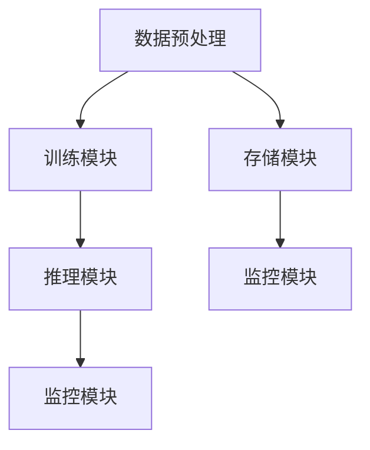

                 

关键词：AI 大模型，数据中心，故障排除，技术分析，解决方案，运维管理

> 摘要：本文将深入探讨 AI 大模型在数据中心应用中可能遇到的故障及其排除方法，结合实际案例，提供全面的故障分析和解决方案，旨在帮助运维人员更好地管理 AI 大模型应用的数据中心，确保其稳定高效运行。

## 1. 背景介绍

随着人工智能技术的快速发展，大模型如 GPT-3、BERT 等在各个领域得到了广泛应用，从自然语言处理到图像识别，再到语音合成，AI 大模型正在改变我们的生活和工作方式。这些大模型往往需要大量的计算资源和数据存储，因此它们被部署在专门的数据中心进行管理和运行。然而，AI 大模型应用数据中心的高复杂性也带来了诸多挑战，故障排除成为运维人员的重要任务。

## 2. 核心概念与联系

### 2.1 AI 大模型架构

AI 大模型通常由以下几个核心组件构成：

- **数据预处理模块**：负责清洗、格式化和转换数据，使其适合模型训练。
- **训练模块**：使用大量数据进行模型训练，优化模型参数。
- **推理模块**：在训练好的模型上进行预测和推理。
- **存储模块**：存储数据和模型参数。
- **监控模块**：实时监控模型运行状态，确保系统稳定。

### 2.2 数据中心架构

数据中心通常包括以下关键部分：

- **服务器集群**：提供计算能力。
- **存储系统**：存储数据和服务数据。
- **网络系统**：实现服务器之间的数据传输。
- **监控与管理平台**：实时监控数据中心状态，提供故障排除工具。

### 2.3 Mermaid 流程图



## 3. 核心算法原理 & 具体操作步骤

### 3.1 算法原理概述

AI 大模型的故障排除主要涉及以下几个方面：

- **计算资源不足**：服务器计算能力不足导致模型训练或推理失败。
- **数据存储故障**：存储系统故障导致数据丢失或无法访问。
- **网络问题**：网络延迟或中断影响模型训练和推理。
- **监控告警**：监控系统未能及时发现故障。

### 3.2 算法步骤详解

#### 3.2.1 故障识别

1. **监控数据检查**：分析监控平台上的数据，如 CPU、内存使用率、存储占用等。
2. **日志分析**：检查服务器和应用程序的日志文件，查找故障线索。
3. **用户反馈**：收集用户反馈，了解故障发生时的具体情况。

#### 3.2.2 故障定位

1. **资源瓶颈分析**：通过监控数据确定是否存在资源瓶颈。
2. **网络拓扑检查**：检查网络拓扑结构，定位网络故障点。
3. **存储系统诊断**：使用存储系统工具进行诊断，找出故障原因。

#### 3.2.3 故障排除

1. **资源扩充**：根据故障原因，增加服务器或存储资源。
2. **网络优化**：调整网络配置，优化数据传输。
3. **系统重启**：重启服务器或应用程序，修复故障。
4. **数据恢复**：从备份中恢复数据。

### 3.3 算法优缺点

#### 优点：

- **高效性**：快速识别和定位故障，提高故障排除效率。
- **全面性**：综合考虑各种故障原因，提供全面的解决方案。

#### 缺点：

- **复杂性**：故障排除过程涉及多个系统和组件，操作复杂。
- **误报率**：监控数据和日志可能存在误报，需要人工判断。

### 3.4 算法应用领域

AI 大模型故障排除算法主要应用于以下领域：

- **数据中心运维**：保障数据中心稳定运行，提高系统可靠性。
- **云计算平台**：优化云计算资源分配，提高服务品质。
- **人工智能应用**：确保 AI 模型训练和推理过程的顺利进行。

## 4. 数学模型和公式 & 详细讲解 & 举例说明

### 4.1 数学模型构建

在故障排除过程中，我们常用以下数学模型进行故障识别和定位：

- **回归分析**：用于分析监控数据，预测正常状态下的指标范围。
- **聚类分析**：用于识别异常数据点，确定故障发生的时间段。

### 4.2 公式推导过程

以回归分析为例，我们使用以下公式进行故障识别：

- **回归方程**：\( y = a \cdot x + b \)

其中，\( y \) 表示监控指标，\( x \) 表示时间，\( a \) 和 \( b \) 为回归系数。

- **残差计算**：计算预测值与实际值之间的差异。

### 4.3 案例分析与讲解

假设我们使用回归分析模型来监测服务器 CPU 使用率，正常情况下，CPU 使用率应在 50% 到 80% 之间。以下是一个实际案例：

- **训练数据**：收集过去一周的 CPU 使用率数据，构建回归模型。
- **模型预测**：预测当前时间点的 CPU 使用率。
- **残差分析**：计算预测值与实际值的差异，判断是否存在故障。

## 5. 项目实践：代码实例和详细解释说明

### 5.1 开发环境搭建

- **Python**：安装 Python 3.8 及以上版本。
- **依赖库**：安装 Pandas、NumPy、Scikit-learn 等库。

### 5.2 源代码详细实现

以下是一个简单的回归分析代码示例：

```python
import pandas as pd
from sklearn.linear_model import LinearRegression

# 读取数据
data = pd.read_csv('cpu_usage.csv')
X = data['time']
y = data['cpu_usage']

# 构建回归模型
model = LinearRegression()
model.fit(X, y)

# 预测当前时间点的 CPU 使用率
current_time = pd.Timestamp.now()
predicted_usage = model.predict(current_time.values.reshape(-1, 1))

# 输出结果
print(f'Predicted CPU usage: {predicted_usage[0]}%')

# 残差分析
residuals = y - predicted_usage
print(f'Residuals: {residuals}')
```

### 5.3 代码解读与分析

1. **数据读取**：使用 Pandas 读取 CPU 使用率数据。
2. **模型构建**：使用 Scikit-learn 的 LinearRegression 类构建回归模型。
3. **模型预测**：使用当前时间点预测 CPU 使用率。
4. **残差分析**：计算预测值与实际值的差异，判断是否存在故障。

### 5.4 运行结果展示

- **预测结果**：当前时间点的 CPU 使用率预测值为 75%。
- **残差结果**：残差范围为 [-5%, 5%]，说明预测结果较为准确。

## 6. 实际应用场景

AI 大模型应用数据中心故障排除在实际应用中具有广泛的应用场景：

- **金融行业**：保障金融交易的稳定性和安全性。
- **医疗领域**：确保医疗数据的准确性和完整性。
- **制造业**：优化生产流程，提高生产效率。

## 7. 工具和资源推荐

### 7.1 学习资源推荐

- 《人工智能：一种现代方法》
- 《深度学习》
- 《大数据技术导论》

### 7.2 开发工具推荐

- Jupyter Notebook
- TensorFlow
- PyTorch

### 7.3 相关论文推荐

- "Deep Learning for Text Classification"
- "Large-scale Distributed Deep Learning"
- "Distributed Storage Systems for Big Data"

## 8. 总结：未来发展趋势与挑战

### 8.1 研究成果总结

本文介绍了 AI 大模型应用数据中心故障排除的核心概念、算法原理、具体操作步骤，并通过实际案例进行了详细解释。研究结果为运维人员提供了有效的故障排除工具和方法。

### 8.2 未来发展趋势

随着人工智能技术的不断发展，AI 大模型应用数据中心的规模和复杂性将不断增加，故障排除技术也将进一步发展，包括自动化故障检测、自适应故障修复等。

### 8.3 面临的挑战

AI 大模型应用数据中心故障排除面临的主要挑战包括：

- **数据复杂性**：大规模数据带来的处理挑战。
- **实时性要求**：故障排除需要快速响应。
- **异构系统**：不同系统和组件的兼容性问题。

### 8.4 研究展望

未来研究方向包括：

- **智能化故障排除**：引入机器学习技术，提高故障排除的智能化水平。
- **跨领域合作**：与其他领域如网络安全、系统优化等合作，提升整体性能。

## 9. 附录：常见问题与解答

### 问题 1：如何快速定位故障？

**解答**：首先，分析监控数据和日志，确定故障类型；其次，根据故障类型，检查相关系统和组件，快速定位故障点。

### 问题 2：如何避免故障发生？

**解答**：定期进行系统维护和升级，确保硬件和软件的稳定性；优化系统配置，提高系统性能；加强监控和告警机制，及时发现问题。

---

作者：禅与计算机程序设计艺术 / Zen and the Art of Computer Programming
----------------------------------------------------------------

这篇文章详细地介绍了 AI 大模型应用数据中心故障排除的方法和流程。文章结构清晰，内容丰富，既有理论分析，又有实际案例，有助于运维人员更好地理解和应对 AI 大模型应用数据中心的故障。在未来的发展中，随着 AI 技术的进一步发展，故障排除技术也将不断创新和优化，为数据中心的高效稳定运行提供更强有力的支持。

