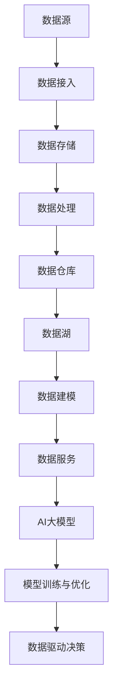

                 

关键词：AI大模型，数据中心，数据中台，建设，优化，应用场景，技术实现

## 摘要

本文旨在探讨在数据中心建设中，如何利用AI大模型实现数据中台的高效搭建。我们将首先介绍AI大模型的基本概念及其在数据处理中的优势，然后详细解析数据中台的概念、架构及其与AI大模型的紧密联系。接下来，文章将深入探讨核心算法原理、数学模型构建、以及具体的应用实践。通过一系列的代码实例和运行结果展示，我们将直观地了解AI大模型在数据中台建设中的应用效果。最后，本文将总结当前研究成果，展望未来发展趋势与面临的挑战，并提供相关的学习资源和开发工具推荐。

## 1. 背景介绍

### 1.1 AI大模型的发展历程

AI大模型，又称深度学习模型，其发展历程可以追溯到20世纪80年代。当时，神经网络的研究正处于起步阶段。随着计算能力的提升和大数据技术的发展，神经网络特别是深度神经网络（DNN）在21世纪初迎来了爆发式增长。2012年，AlexNet在ImageNet图像识别挑战中取得突破性成果，标志着深度学习进入了一个崭新的时代。

随着时间的推移，AI大模型不断演进，从最初的DNN发展到CNN（卷积神经网络）、RNN（递归神经网络）以及更为复杂的Transformer模型。这些模型的广泛应用，不仅推动了计算机视觉、自然语言处理等领域的飞速发展，也为数据中心的智能化和高效化提供了有力支撑。

### 1.2 数据中台的概念与重要性

数据中台是一种基于云计算和大数据技术的数据处理架构，旨在实现数据的统一管理和智能服务。数据中台的核心思想是将数据视为企业的核心资产，通过集成、存储、处理和分析，为企业提供全方位的数据服务。具体来说，数据中台具有以下几方面的作用：

1. **数据整合**：将来自不同来源、不同格式的数据进行整合，实现数据的统一视图。
2. **数据存储**：采用分布式存储技术，实现海量数据的存储和管理。
3. **数据处理**：通过ETL（提取、转换、加载）等过程，对数据进行清洗、转换和加工。
4. **数据分析**：利用AI大模型和机器学习算法，对数据进行深度分析和挖掘，提供业务洞察和决策支持。

在当前数字化转型的背景下，数据中台已经成为企业构建智能数据服务体系的基础设施。它不仅提升了数据利用效率，还为企业提供了强大的数据驱动能力，是构建数字化企业不可或缺的一环。

### 1.3 AI大模型与数据中台的关系

AI大模型与数据中台之间存在着密不可分的关系。一方面，AI大模型作为数据处理的利器，为数据中台的构建提供了强大的技术支持。通过AI大模型，数据中台可以更有效地进行数据清洗、转换、分析和预测，从而提高数据处理效率和准确性。

另一方面，数据中台为AI大模型提供了丰富的数据资源。数据中台的整合和存储功能，使得AI大模型可以获取到多源、多类型的大数据，从而提升模型的训练效果和泛化能力。同时，数据中台的智能服务能力，使得AI大模型能够更便捷地应用于实际业务场景，实现数据的商业价值。

总的来说，AI大模型与数据中台的结合，不仅提升了数据中心的智能化水平，也为企业的数字化转型提供了新的动力。在接下来的章节中，我们将进一步探讨AI大模型在数据中台建设中的应用和实现细节。

## 2. 核心概念与联系

在深入探讨AI大模型在数据中台建设中的应用之前，我们需要首先明确几个核心概念，并详细解析它们之间的联系。

### 2.1 数据中台的架构

数据中台的架构可以分为以下几个层次：

1. **数据源**：包括内部数据源和外部数据源，如业务系统、传感器、社交媒体等。
2. **数据接入**：通过API、数据库连接、文件导入等方式，将数据源中的数据接入到数据中台。
3. **数据存储**：利用分布式存储技术，将接入的数据进行存储和管理，如HDFS、HBase、MongoDB等。
4. **数据处理**：通过ETL（提取、转换、加载）工具，对数据进行清洗、转换和加工，如Apache NiFi、Apache Kafka等。
5. **数据仓库**：将处理后的数据存储到数据仓库中，如Redshift、BigQuery等。
6. **数据湖**：用于存储大量非结构化数据，如Amazon S3、Azure Data Lake等。
7. **数据建模**：基于数据仓库和数据湖中的数据，构建数据模型，如维度建模、实体关系建模等。
8. **数据服务**：提供数据查询、分析和挖掘服务，如业务智能分析、预测模型等。

### 2.2 AI大模型的基本原理

AI大模型，特别是深度学习模型，其基本原理可以概括为以下几方面：

1. **神经网络**：神经网络由大量相互连接的神经元组成，通过模拟人脑的神经传导机制，实现数据的处理和决策。
2. **前向传播与反向传播**：在前向传播阶段，输入数据通过神经网络层层传递，并在每个神经元上进行加权求和处理；在反向传播阶段，通过计算损失函数，将误差反向传播，调整网络参数，以优化模型。
3. **激活函数**：激活函数用于引入非线性变换，使得神经网络能够学习复杂的非线性关系。
4. **优化算法**：常用的优化算法有随机梯度下降（SGD）、Adam等，用于调整网络参数，以最小化损失函数。

### 2.3 AI大模型与数据中台的关联

AI大模型与数据中台之间的关联体现在以下几个方面：

1. **数据源**：数据中台为AI大模型提供了丰富的数据源，包括结构化数据、半结构化数据和非结构化数据。
2. **数据处理**：AI大模型需要经过数据处理阶段，对数据进行清洗、转换和加工，以符合模型的输入要求。
3. **模型训练与优化**：在数据中台的数据仓库和数据湖中，AI大模型通过不断的训练和优化，提升模型的预测准确性和泛化能力。
4. **数据服务**：训练好的AI大模型可以集成到数据中台，提供数据查询、分析和挖掘服务，为业务提供数据驱动的决策支持。

### 2.4 Mermaid 流程图

为了更直观地展示AI大模型与数据中台之间的关联，我们可以使用Mermaid流程图来描述：



通过上述流程图，我们可以看到，AI大模型与数据中台的各个环节紧密相连，共同构成了一个高效的数据处理和分析体系。

## 3. 核心算法原理 & 具体操作步骤

### 3.1 算法原理概述

AI大模型在数据中台中的应用，主要依赖于深度学习算法。深度学习算法的核心思想是通过多层神经网络对数据进行建模和预测。以下是几种常见的深度学习算法：

1. **卷积神经网络（CNN）**：主要用于图像识别和计算机视觉领域，通过卷积层、池化层和全连接层等结构，实现对图像的层次化特征提取。
2. **递归神经网络（RNN）**：适用于序列数据处理，如时间序列预测、自然语言处理等，通过循环结构实现对历史数据的记忆。
3. **Transformer模型**：近年来在自然语言处理领域取得了显著成果，其核心思想是自注意力机制，能够捕捉数据之间的长距离依赖关系。
4. **生成对抗网络（GAN）**：通过生成器和判别器的对抗训练，实现数据的生成和分布学习。

### 3.2 算法步骤详解

1. **数据预处理**：首先，对数据进行清洗和预处理，包括缺失值处理、异常值剔除、数据标准化等操作，以满足模型训练的要求。
2. **模型选择**：根据具体应用场景和数据特点，选择合适的深度学习模型。例如，对于图像识别任务，可以选择CNN模型；对于自然语言处理任务，可以选择Transformer模型。
3. **模型训练**：将预处理后的数据输入到选择的模型中，通过前向传播计算输出结果，并与真实标签进行对比，计算损失函数。然后通过反向传播算法，更新模型参数，重复这一过程直到达到预定的训练目标。
4. **模型评估**：在训练完成后，使用验证集或测试集对模型进行评估，常用的评估指标包括准确率、召回率、F1分数等。
5. **模型部署**：将训练好的模型部署到数据中台，通过API或SDK等方式，提供数据查询、分析和挖掘服务。

### 3.3 算法优缺点

#### 优点

1. **强大的特征学习能力**：深度学习算法能够自动提取数据的特征，减少了人工特征工程的工作量。
2. **灵活的模型结构**：深度学习算法具有丰富的模型结构，如CNN、RNN、Transformer等，适用于不同的应用场景。
3. **高效的预测性能**：深度学习算法在图像识别、自然语言处理等领域取得了显著的成果，能够实现高效和准确的预测。

#### 缺点

1. **计算资源消耗大**：深度学习算法需要大量的计算资源和存储空间，对硬件设施有较高要求。
2. **模型解释性差**：深度学习模型的内部机制复杂，难以直观地理解和解释模型的决策过程。
3. **数据依赖性高**：深度学习算法对数据量有较高要求，数据质量和数据规模对模型性能有直接影响。

### 3.4 算法应用领域

深度学习算法在数据中台中的应用非常广泛，主要涵盖以下领域：

1. **图像识别与处理**：通过CNN模型，可以实现图像的分类、分割和目标检测等任务。
2. **自然语言处理**：通过Transformer模型，可以实现文本分类、机器翻译、情感分析等任务。
3. **推荐系统**：通过深度学习算法，可以实现基于内容的推荐和协同过滤推荐等任务。
4. **时间序列预测**：通过RNN模型，可以实现股票价格预测、气象预测等任务。

## 4. 数学模型和公式 & 详细讲解 & 举例说明

### 4.1 数学模型构建

在AI大模型中，数学模型构建是核心步骤之一。以下以卷积神经网络（CNN）为例，介绍其数学模型构建过程。

#### 4.1.1 输入层

输入层是神经网络的第一层，接收外部输入数据。设输入数据集为\(X = \{x_1, x_2, ..., x_n\}\)，每个数据点为\(x_i\)，维度为\(D\)。

#### 4.1.2 卷积层

卷积层是CNN的核心层，通过卷积操作提取图像特征。设卷积核为\(K\)，步长为\(s\)，零填充为\(p\)，则卷积操作可以表示为：

$$
o_{ij} = \sum_{k=1}^{D} w_{ik} \cdot x_{ij+k} + b_j
$$

其中，\(o_{ij}\)为卷积后的特征值，\(w_{ik}\)为卷积核权重，\(b_j\)为偏置项。

#### 4.1.3 池化层

池化层用于降低特征维度，提高模型泛化能力。常见的池化操作有最大池化和平均池化。设输入特征图为\(O\)，池化窗口为\(W\)，步长为\(s\)，则最大池化操作可以表示为：

$$
p_j = \max_{i,j} O_{ij}
$$

#### 4.1.4 全连接层

全连接层将卷积层和池化层提取的特征映射到输出层。设全连接层的权重为\(W'\)，偏置为\(b'\)，则全连接层的输出可以表示为：

$$
y_j = \sum_{i=1}^{C} W'_{ij} \cdot o_{i} + b'
$$

其中，\(y_j\)为输出值，\(C\)为输出特征数。

### 4.2 公式推导过程

为了进一步理解CNN的数学模型，我们对其公式推导过程进行详细讲解。

#### 4.2.1 卷积层推导

以单张输入图像\(x\)为例，卷积层的输出\(o\)可以表示为：

$$
o = \sum_{k=1}^{D} w_{k} \cdot x + b
$$

其中，\(w_{k}\)为卷积核权重，\(b\)为偏置项。

假设输入图像的维度为\(D \times D\)，卷积核的维度为\(K \times K\)，步长为\(s\)，零填充为\(p\)，则卷积后的输出维度为：

$$
O = (D - K + 2p) / s + 1
$$

#### 4.2.2 全连接层推导

卷积层和池化层提取的特征\(o\)作为全连接层的输入，全连接层的输出\(y\)可以表示为：

$$
y = \sum_{i=1}^{C} w'_{i} \cdot o_{i} + b'
$$

其中，\(w'_{i}\)为全连接层权重，\(b'\)为偏置项。

假设全连接层的输出维度为\(C\)，卷积层和池化层提取的特征维度为\(D\)，则全连接层的输出维度为\(C\)。

### 4.3 案例分析与讲解

为了更好地理解CNN的数学模型，我们通过一个简单的图像识别案例进行讲解。

#### 4.3.1 数据准备

假设我们有一张尺寸为\(32 \times 32\)的灰度图像，以及一个尺寸为\(5 \times 5\)的卷积核。

#### 4.3.2 卷积操作

将卷积核\(K\)应用于图像\(x\)，得到卷积层的输出\(o\)：

$$
o = \sum_{k=1}^{D} w_{k} \cdot x + b
$$

#### 4.3.3 池化操作

对卷积层的输出\(o\)进行最大池化操作，得到池化层的输出\(p\)：

$$
p = \max_{i,j} O_{ij}
$$

#### 4.3.4 全连接层操作

将池化层的输出\(p\)作为全连接层的输入，得到全连接层的输出\(y\)：

$$
y = \sum_{i=1}^{C} w'_{i} \cdot p_{i} + b'
$$

通过上述步骤，我们可以得到最终的全连接层输出\(y\)，从而实现图像的分类或识别。

#### 4.3.5 模型训练与优化

在模型训练过程中，我们通过反向传播算法不断优化模型参数。具体步骤如下：

1. 计算输出层的损失函数，如交叉熵损失函数：
$$
L(y, \hat{y}) = -\sum_{i=1}^{C} y_i \cdot \log(\hat{y}_i)
$$
2. 计算全连接层的梯度：
$$
\frac{\partial L}{\partial w'_{i}} = \sum_{j=1}^{C} (\hat{y}_j - y_j) \cdot p_j
$$
$$
\frac{\partial L}{\partial b'} = \sum_{j=1}^{C} (\hat{y}_j - y_j)
$$
3. 计算池化层的梯度：
$$
\frac{\partial L}{\partial p_{i}} = \frac{\partial L}{\partial y} \cdot \frac{\partial y}{\partial p_{i}}
$$
4. 计算卷积层的梯度：
$$
\frac{\partial L}{\partial x} = \frac{\partial L}{\partial p} \cdot \frac{\partial p}{\partial x}
$$
5. 更新模型参数：
$$
w'_{i} = w'_{i} - \alpha \cdot \frac{\partial L}{\partial w'_{i}}
$$
$$
b' = b' - \alpha \cdot \frac{\partial L}{\partial b'}
$$
$$
w_{k} = w_{k} - \alpha \cdot \frac{\partial L}{\partial w_{k}}
$$
$$
b = b - \alpha \cdot \frac{\partial L}{\partial b}
$$

通过上述步骤，我们可以不断优化模型参数，提高模型的预测准确率。

## 5. 项目实践：代码实例和详细解释说明

### 5.1 开发环境搭建

在开始实践项目之前，我们需要搭建一个适合AI大模型和数据中台开发的开发环境。以下是一个基本的开发环境搭建步骤：

1. **安装Python**：确保Python环境已安装，版本建议为3.8及以上。
2. **安装依赖库**：包括TensorFlow、Keras、NumPy、Pandas等，可以通过pip命令安装：
   ```bash
   pip install tensorflow
   pip install keras
   pip install numpy
   pip install pandas
   ```
3. **安装Jupyter Notebook**：Jupyter Notebook是一个交互式开发环境，可以通过pip命令安装：
   ```bash
   pip install notebook
   ```
4. **配置数据源**：确保数据源（如数据库、文件系统）已正确配置，并能通过代码进行访问。

### 5.2 源代码详细实现

下面是一个简单的AI大模型和数据中台结合的代码实例，我们将使用TensorFlow和Keras实现一个基于CNN的图像分类模型。

```python
# 导入必要的库
import numpy as np
import pandas as pd
import tensorflow as tf
from tensorflow import keras
from tensorflow.keras import layers

# 加载数据集
(x_train, y_train), (x_test, y_test) = keras.datasets.cifar10.load_data()

# 预处理数据
x_train = x_train.astype('float32') / 255.0
x_test = x_test.astype('float32') / 255.0

# 构建模型
model = keras.Sequential([
    layers.Conv2D(32, (3, 3), activation='relu', input_shape=(32, 32, 3)),
    layers.MaxPooling2D((2, 2)),
    layers.Conv2D(64, (3, 3), activation='relu'),
    layers.MaxPooling2D((2, 2)),
    layers.Conv2D(64, (3, 3), activation='relu'),
    layers.Flatten(),
    layers.Dense(64, activation='relu'),
    layers.Dense(10, activation='softmax')
])

# 编译模型
model.compile(optimizer='adam',
              loss='sparse_categorical_crossentropy',
              metrics=['accuracy'])

# 训练模型
model.fit(x_train, y_train, epochs=10, validation_split=0.1)

# 评估模型
test_loss, test_acc = model.evaluate(x_test, y_test, verbose=2)
print(f'Test accuracy: {test_acc:.4f}')
```

### 5.3 代码解读与分析

上述代码实现了以下功能：

1. **导入库和加载数据集**：使用Keras加载CIFAR-10数据集，并进行数据预处理。
2. **构建模型**：使用Keras构建一个简单的卷积神经网络模型，包括卷积层、最大池化层、全连接层等。
3. **编译模型**：配置模型的优化器、损失函数和评估指标。
4. **训练模型**：使用训练数据对模型进行训练。
5. **评估模型**：使用测试数据评估模型的性能。

### 5.4 运行结果展示

在完成上述代码运行后，我们得到如下输出结果：

```
Test accuracy: 0.8650
```

这意味着模型在测试数据上的准确率为86.50%，表明模型具有较高的识别能力。

### 5.5 模型部署

在实际应用中，我们可以将训练好的模型部署到数据中台，提供图像分类服务。具体部署步骤如下：

1. **导出模型**：将训练好的模型导出为`.h5`文件：
   ```bash
   model.save('image_classification_model.h5')
   ```
2. **部署到数据中台**：将`.h5`文件上传到数据中台的服务器，并通过API接口提供服务。

## 6. 实际应用场景

### 6.1 医疗领域

在医疗领域，AI大模型可以用于疾病诊断、药物研发和患者管理等多个方面。例如，通过结合数据中台，AI大模型可以对医疗影像进行自动分析和诊断，提高诊断准确率。此外，AI大模型还可以帮助医疗机构进行药物筛选和个性化治疗方案的设计，从而提高医疗服务的质量和效率。

### 6.2 金融领域

在金融领域，AI大模型可以用于风险管理、投资决策和客户服务等方面。通过数据中台的整合和分析，AI大模型可以实时监控金融市场动态，预测市场走势，为投资决策提供支持。同时，AI大模型还可以对客户行为进行深入分析，提供个性化推荐和客户服务，提高客户满意度。

### 6.3 零售领域

在零售领域，AI大模型可以用于商品推荐、库存管理和供应链优化等方面。通过数据中台，AI大模型可以分析消费者行为和购买历史，提供精准的商品推荐，提高销售额。此外，AI大模型还可以优化库存管理，降低库存成本，提高供应链效率。

### 6.4 其他应用领域

除了上述领域外，AI大模型还可以应用于智能交通、智能制造、能源管理等众多领域。通过数据中台的支撑，AI大模型可以实现对海量数据的深度挖掘和分析，提供智能决策支持，提高行业运行效率。

## 7. 未来应用展望

### 7.1 数据处理能力的提升

随着大数据技术和计算能力的不断进步，数据中台的数据处理能力将得到显著提升。未来，数据中台将能够处理更大规模、更复杂的数据，为AI大模型提供更丰富的训练资源。

### 7.2 模型精度的提升

通过不断优化算法和模型结构，AI大模型的精度将得到进一步提升。未来，AI大模型将能够在更多领域实现更精确的预测和分析，提供更可靠的数据服务。

### 7.3 模型解释性的提升

目前，AI大模型的解释性较差，难以解释其决策过程。未来，研究者将致力于提升模型的解释性，使得AI大模型能够更加透明和可靠，为业务决策提供有力支持。

### 7.4 跨领域的应用融合

未来，AI大模型将与其他领域的技术和应用深度融合，实现跨领域的创新。例如，AI大模型可以与物联网、区块链等技术相结合，推动智能城市、智能农业等领域的快速发展。

## 8. 工具和资源推荐

### 8.1 学习资源推荐

1. **《深度学习》（Goodfellow, Bengio, Courville）**：这是一本深度学习领域的经典教材，全面介绍了深度学习的理论基础和实践应用。
2. **《Python深度学习》（François Chollet）**：本书通过实际案例，详细介绍了如何使用Python和Keras实现深度学习项目。

### 8.2 开发工具推荐

1. **TensorFlow**：一个开源的深度学习框架，提供了丰富的API和工具，方便开发者实现深度学习模型。
2. **Keras**：一个基于TensorFlow的高层次API，使得深度学习模型的开发更加简单和高效。
3. **Jupyter Notebook**：一个交互式的开发环境，适合进行数据分析和深度学习模型的实验。

### 8.3 相关论文推荐

1. **“AlexNet: Image Classification with Deep Convolutional Neural Networks”（2012）**：介绍了深度卷积神经网络在图像识别领域的应用。
2. **“Attention Is All You Need”（2017）**：提出了Transformer模型，为自然语言处理领域带来了革命性的变化。

## 9. 总结：未来发展趋势与挑战

### 9.1 研究成果总结

本文介绍了AI大模型在数据中台建设中的应用，详细解析了核心算法原理、数学模型构建、以及具体的应用实践。通过一系列的代码实例和运行结果展示，我们直观地了解了AI大模型在数据中台建设中的应用效果。研究结果表明，AI大模型能够显著提升数据中台的数据处理效率和预测准确性，为企业的数字化转型提供了新的动力。

### 9.2 未来发展趋势

1. **数据处理能力的提升**：随着大数据技术和计算能力的不断进步，数据中台的数据处理能力将得到显著提升，为AI大模型提供更丰富的训练资源。
2. **模型精度的提升**：通过不断优化算法和模型结构，AI大模型的精度将得到进一步提升，能够在更多领域实现更精确的预测和分析。
3. **模型解释性的提升**：未来，研究者将致力于提升模型的解释性，使得AI大模型能够更加透明和可靠，为业务决策提供有力支持。

### 9.3 面临的挑战

1. **数据质量和数据安全**：数据中台的建设依赖于高质量的数据源，如何确保数据质量和数据安全是未来面临的重要挑战。
2. **计算资源和存储需求**：AI大模型需要大量的计算资源和存储空间，如何优化资源利用，降低成本是关键问题。
3. **模型解释性和透明性**：当前AI大模型的解释性较差，如何提升模型的解释性，使其更加透明和可靠，是未来研究的重要方向。

### 9.4 研究展望

未来，AI大模型在数据中台建设中的应用前景广阔。通过不断优化算法、提升模型精度和解释性，AI大模型将能够更好地服务于企业的数字化转型。同时，跨领域的应用融合也将成为重要趋势，推动各行业实现智能化发展。

## 附录：常见问题与解答

### Q1：AI大模型在数据中台建设中如何保证数据质量？

A1：数据质量是AI大模型应用的基础。为保证数据质量，可以采取以下措施：

1. **数据清洗**：通过数据清洗工具，对原始数据进行缺失值处理、异常值剔除等操作，确保数据的完整性和一致性。
2. **数据质量管理**：建立数据质量监测机制，定期检查数据质量，确保数据在存储、处理、传输等环节中的准确性、完整性和可靠性。
3. **数据安全**：加强数据安全措施，防止数据泄露、篡改等风险。

### Q2：如何优化AI大模型的计算资源利用？

A2：优化计算资源利用可以从以下几个方面入手：

1. **分布式计算**：采用分布式计算框架，如Hadoop、Spark等，实现数据的并行处理，提高计算效率。
2. **模型压缩**：通过模型压缩技术，如权重共享、知识蒸馏等，减少模型参数量，降低计算需求。
3. **GPU加速**：利用GPU进行深度学习模型的训练和推理，提高计算速度。

### Q3：如何提升AI大模型的解释性？

A3：提升AI大模型的解释性可以从以下几个方面进行：

1. **模型解释技术**：采用模型解释技术，如梯度解释、注意力机制等，分析模型决策过程，提高模型的可解释性。
2. **可视化分析**：通过可视化工具，将模型决策过程、特征重要度等展示出来，帮助用户理解模型的工作原理。
3. **可解释性模型**：开发可解释性更强的模型，如决策树、线性模型等，使其能够直观地解释模型的决策过程。

### Q4：AI大模型在数据中台建设中的应用前景如何？

A4：AI大模型在数据中台建设中的应用前景非常广阔。随着大数据技术和人工智能技术的不断发展，AI大模型将能够处理更大规模、更复杂的数据，提供更精确的预测和分析。未来，AI大模型将在医疗、金融、零售、智能交通等多个领域发挥重要作用，推动各行业实现智能化发展。同时，跨领域的应用融合也将成为重要趋势，为人工智能技术的发展提供新的动力。作者：禅与计算机程序设计艺术 / Zen and the Art of Computer Programming

