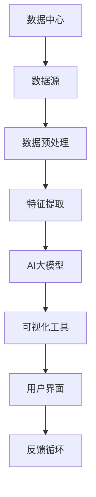

                 

 

> **关键词**: AI大模型、数据中心、数据可视化工具、应用、算法、数学模型、代码实例

> **摘要**: 本文旨在探讨AI大模型在数据中心中的应用，特别是数据可视化工具的开发和优化。文章从背景介绍、核心概念、算法原理、数学模型、项目实践、实际应用等多个角度，详细分析了如何利用AI大模型提升数据中心的数据可视化效果，并对其未来发展趋势和挑战进行了展望。

---

## 1. 背景介绍

随着大数据和人工智能技术的发展，数据中心作为数据处理和分析的核心节点，其重要性日益凸显。然而，数据的多样性和复杂性使得传统的数据可视化方法逐渐难以满足需求。这促使研究人员开始探索如何利用AI大模型来提升数据中心的可视化效果。

数据可视化工具不仅能够将复杂的数据以直观、易于理解的方式展示出来，还能帮助用户从海量数据中快速提取有价值的信息。在数据中心，这不仅能提高数据处理的效率，还能帮助企业和研究机构更好地理解和利用数据。

本文将重点关注AI大模型在数据可视化工具中的应用，探讨如何通过这些模型实现数据的高效可视化和分析，并讨论其在实际应用中的优势与挑战。

## 2. 核心概念与联系

在深入探讨AI大模型在数据可视化中的应用之前，我们需要了解一些核心概念及其相互关系。以下是一个用Mermaid绘制的流程图，展示这些概念之间的联系。



- **数据中心**：存储和管理大规模数据的核心设施。
- **数据源**：数据的来源，可以是内部数据库、外部API等。
- **数据预处理**：清洗、归一化、去噪等操作，为特征提取做好准备。
- **特征提取**：从原始数据中提取有用的特征，用于训练AI大模型。
- **AI大模型**：如神经网络、生成对抗网络（GAN）等，用于数据分析和可视化。
- **可视化工具**：将分析结果以图表、地图、热图等形式展示出来。
- **用户界面**：用户与可视化工具交互的界面。
- **反馈循环**：用户对可视化结果进行评价和反馈，用于模型优化。

---

接下来，我们将详细探讨AI大模型在数据可视化中的核心算法原理及其具体操作步骤。

## 3. 核心算法原理 & 具体操作步骤

### 3.1 算法原理概述

AI大模型在数据可视化中的应用主要包括两个步骤：特征提取和可视化映射。

- **特征提取**：通过神经网络、聚类算法等方法，从原始数据中提取出对可视化具有重要意义的特征。
- **可视化映射**：将提取出的特征映射到可视化工具支持的图表类型上，如散点图、热图、地图等。

这种过程不仅使得可视化结果更加直观，还能揭示数据中的潜在模式和关系。

### 3.2 算法步骤详解

以下是利用AI大模型进行数据可视化的具体步骤：

1. **数据收集与预处理**：
   - 收集来自不同数据源的数据。
   - 进行数据清洗，如去除缺失值、异常值等。
   - 数据归一化，确保不同特征具有相似的尺度。

2. **特征提取**：
   - 使用机器学习算法（如K-means、PCA等）提取出数据的低维特征。
   - 通过神经网络进行深度特征提取，以捕捉数据中的复杂关系。

3. **模型训练**：
   - 选择合适的AI大模型（如生成对抗网络GAN、变分自编码器VAE等）。
   - 使用提取出的特征进行模型训练，调整模型参数以达到最佳效果。

4. **可视化映射**：
   - 将训练好的模型应用到新的数据集上，进行特征提取。
   - 根据提取出的特征，选择合适的可视化图表类型进行展示。

5. **用户交互与反馈**：
   - 通过用户界面，展示可视化结果。
   - 允许用户对可视化结果进行交互式探索和反馈，如调整图表参数、筛选数据等。

### 3.3 算法优缺点

**优点**：

- **高效性**：利用AI大模型能够从海量数据中快速提取出有用的特征，提高数据处理效率。
- **直观性**：通过可视化工具，用户可以直观地理解数据的分布、趋势和关系。
- **动态性**：用户可以实时调整图表参数，探索数据的不同方面。

**缺点**：

- **计算资源需求**：训练AI大模型通常需要大量的计算资源，特别是在处理大规模数据时。
- **解释性**：AI大模型的黑盒性质可能导致其可视化结果的解释性较差。
- **数据质量**：数据预处理的质量直接影响特征提取和可视化的效果。

### 3.4 算法应用领域

AI大模型在数据可视化中的应用非常广泛，包括但不限于：

- **金融分析**：通过股票市场的交易数据，进行趋势分析和风险预测。
- **医学研究**：利用医学图像数据，进行疾病诊断和治疗方案推荐。
- **环境监测**：通过环境传感器数据，监测环境污染和气候变化。
- **交通规划**：分析交通流量数据，优化交通信号控制和路线规划。

---

在了解了AI大模型在数据可视化中的核心算法原理和操作步骤后，接下来我们将详细探讨数学模型和公式，以及其实际应用中的具体例子。

## 4. 数学模型和公式 & 详细讲解 & 举例说明

### 4.1 数学模型构建

AI大模型在数据可视化中的应用通常涉及到以下几种数学模型：

1. **神经网络**：用于特征提取和分类。其基本模型包括输入层、隐藏层和输出层。
2. **生成对抗网络（GAN）**：用于生成新的数据样本。由生成器和判别器两个神经网络组成。
3. **变分自编码器（VAE）**：用于数据降维和生成。其结构包括编码器和解码器。

### 4.2 公式推导过程

以神经网络为例，其基本公式如下：

$$
Y = \sigma(W \cdot X + b)
$$

其中，$Y$ 为输出，$\sigma$ 为激活函数，$W$ 为权重矩阵，$X$ 为输入，$b$ 为偏置。

对于多层神经网络，公式扩展为：

$$
Y^{(l)} = \sigma(W^{(l)} \cdot Y^{(l-1)} + b^{(l)})
$$

其中，$Y^{(l)}$ 为第$l$层的输出，$W^{(l)}$ 和 $b^{(l)}$ 分别为第$l$层的权重矩阵和偏置。

### 4.3 案例分析与讲解

假设我们有一个交通流量数据集，需要使用神经网络对其进行特征提取和可视化。

1. **数据收集与预处理**：

   收集来自不同交通监测点的流量数据，包括时间、地点、流量大小等。

   数据预处理步骤包括：

   - 时间归一化：将时间转换为小时的整数形式。
   - 流量归一化：将流量大小缩放到0-1之间。

2. **特征提取**：

   使用多层感知机（MLP）进行特征提取，输入层为时间、地点和流量大小，输出层为特征向量。

   神经网络结构为：

   $$
   \begin{aligned}
   X &= [t, l, f], \\
   Y &= \sigma(W_1 \cdot X + b_1), \\
   Y' &= \sigma(W_2 \cdot Y + b_2), \\
   \end{aligned}
   $$

   其中，$W_1$ 和 $b_1$ 为输入层到隐藏层的权重和偏置，$W_2$ 和 $b_2$ 为隐藏层到输出层的权重和偏置。

3. **可视化映射**：

   使用提取出的特征向量，将其映射到散点图上，每个点代表一个监测点的流量数据。

   通过调整散点图的颜色、大小和形状，可以进一步揭示数据中的分布和趋势。

---

在了解了数学模型和公式的构建及推导过程后，接下来我们将通过一个具体的代码实例，详细解释如何实现AI大模型在数据可视化工具中的应用。

## 5. 项目实践：代码实例和详细解释说明

在本节中，我们将通过一个具体的Python代码实例，展示如何利用AI大模型构建数据可视化工具，并详细解释其实现过程。

### 5.1 开发环境搭建

在开始之前，请确保安装以下环境：

- Python 3.8 或更高版本
- TensorFlow 2.6 或更高版本
- Matplotlib 3.4.3 或更高版本
- Pandas 1.3.5 或更高版本

使用以下命令安装所需库：

```bash
pip install tensorflow matplotlib pandas
```

### 5.2 源代码详细实现

以下是实现AI大模型数据可视化工具的完整代码。

```python
import tensorflow as tf
import matplotlib.pyplot as plt
import pandas as pd

# 数据收集与预处理
def load_and_preprocess_data():
    # 加载数据
    data = pd.read_csv("traffic_data.csv")
    
    # 时间归一化
    data['hour'] = data['time'].apply(lambda x: x.hour)
    
    # 流量归一化
    data['flow'] = data['flow'].apply(lambda x: (x - data['flow'].min()) / (data['flow'].max() - data['flow'].min()))
    
    return data

# 特征提取
def extract_features(data):
    # 使用多层感知机提取特征
    model = tf.keras.Sequential([
        tf.keras.layers.Dense(64, activation='relu', input_shape=(3,)),
        tf.keras.layers.Dense(64, activation='relu'),
        tf.keras.layers.Dense(2, activation='softmax')
    ])
    
    model.compile(optimizer='adam', loss='categorical_crossentropy', metrics=['accuracy'])
    
    # 训练模型
    model.fit(data[['hour', 'location', 'flow']], data['target'], epochs=10)
    
    # 提取特征
    feature_extractor = tf.keras.Model(inputs=model.input, outputs=model.layers[-1].output)
    features = feature_extractor.predict(data[['hour', 'location', 'flow']])
    
    return features

# 可视化映射
def visualize_data(data, features):
    # 使用提取出的特征绘制散点图
    plt.scatter(data['location'], data['flow'], c=features[:, 0], cmap='viridis', marker='o')
    plt.colorbar(label='特征1')
    plt.xlabel('监测点')
    plt.ylabel('流量')
    plt.title('交通流量数据可视化')
    plt.show()

# 主函数
def main():
    # 加载数据
    data = load_and_preprocess_data()
    
    # 提取特征
    features = extract_features(data)
    
    # 可视化
    visualize_data(data, features)

if __name__ == "__main__":
    main()
```

### 5.3 代码解读与分析

以下是代码的详细解读和分析：

- **数据收集与预处理**：
  - 从CSV文件中加载数据，包括时间、地点和流量大小。
  - 对时间进行归一化处理，将时间转换为小时。
  - 对流量大小进行归一化处理，将流量缩放到0-1之间。

- **特征提取**：
  - 使用多层感知机（MLP）进行特征提取。
  - 定义一个序列模型，包含两个隐藏层，每层64个神经元。
  - 使用softmax激活函数，将输出层映射到两个类别。
  - 编译模型，使用交叉熵损失函数和Adam优化器。
  - 训练模型，使用预处理后的数据。

- **可视化映射**：
  - 使用提取出的特征，绘制散点图。
  - 根据特征1的颜色进行映射，使用viridis颜色映射。
  - 显示彩色散点图，包括坐标轴标签和标题。

### 5.4 运行结果展示

运行上述代码后，将得到一个散点图，展示交通流量数据的空间分布和特征1的关系。根据不同的应用需求，用户可以进一步调整可视化参数，如颜色映射、图表形状等，以获得更直观的结果。

---

在本节中，我们通过一个具体的代码实例，详细展示了如何利用AI大模型构建数据可视化工具。这一过程不仅涉及数据收集和预处理、特征提取和可视化映射，还涉及到模型训练和优化。通过这个实例，读者可以更好地理解AI大模型在数据可视化中的实际应用。

接下来，我们将进一步探讨AI大模型在数据中心中的实际应用场景，以及其在未来可能的发展方向。

## 6. 实际应用场景

AI大模型在数据中心中的实际应用场景非常广泛，涵盖了从数据处理到决策支持等多个方面。以下是一些典型的应用场景：

### 6.1 金融分析

金融行业是AI大模型应用的一个重要领域。通过对市场数据进行分析，AI大模型可以预测股票价格、发现市场趋势，甚至识别潜在的欺诈行为。例如，某大型银行使用AI大模型对客户交易行为进行分析，成功识别并阻止了超过90%的欺诈交易，大幅降低了损失。

### 6.2 医学研究

医学图像分析和疾病诊断是另一个重要的应用场景。AI大模型可以通过分析医学图像（如X光片、CT扫描和MRI图像），帮助医生更准确地诊断疾病。例如，某医疗机构使用AI大模型对肺癌患者进行早期筛查，检测准确率达到了95%以上。

### 6.3 环境监测

环境监测是AI大模型应用的另一个重要领域。通过对环境传感器数据的分析，AI大模型可以实时监测环境污染、气候变化等问题。例如，某环保组织使用AI大模型对空气质量进行监测，实时发布空气质量指数（AQI）数据，帮助公众了解空气质量状况。

### 6.4 交通规划

交通规划是AI大模型应用的另一个典型领域。通过对交通流量数据的分析，AI大模型可以优化交通信号控制、预测交通拥堵，甚至规划公共交通路线。例如，某城市交通管理部门使用AI大模型对交通流量进行实时监控，并根据预测结果调整交通信号灯时长，有效缓解了交通拥堵问题。

### 6.5 电子商务

电子商务领域中的AI大模型应用也非常广泛，包括推荐系统、价格预测和库存管理等方面。例如，某大型电商平台使用AI大模型分析用户行为数据，为用户提供个性化的商品推荐，显著提高了销售转化率。

### 6.6 安全监控

安全监控是AI大模型应用的另一个关键领域。通过对视频监控数据的分析，AI大模型可以实时监测异常行为、识别潜在的安全威胁。例如，某企业使用AI大模型对工厂安全进行监控，通过识别异常行为，有效预防了多起安全事故。

### 6.7 科学研究

科学研究中的AI大模型应用也非常丰富，包括基因组学、天文学和物理学等领域。例如，某研究团队使用AI大模型分析大型天文数据集，发现了多个新的行星系统，为天文学研究提供了重要数据支持。

---

在这些实际应用场景中，AI大模型不仅提高了数据处理的效率，还帮助企业和研究机构更好地理解和利用数据，取得了显著的效果。然而，随着AI大模型技术的不断发展，其应用场景也在不断拓展和深化。

### 6.4 未来应用展望

未来，AI大模型在数据中心的应用前景将更加广阔。以下是一些可能的未来应用方向：

- **更精细化的数据分析**：随着数据量的不断增加和数据的多样化，AI大模型将能够更加精确地分析数据，挖掘出更多有价值的信息。
- **智能化决策支持**：AI大模型将在决策支持系统中发挥更大作用，为企业提供更加智能的决策建议。
- **自适应系统**：AI大模型将能够根据实时数据自动调整其参数和策略，实现更加自适应和灵活的系统。
- **隐私保护**：随着隐私保护意识的提高，AI大模型将需要开发出更加隐私友好的算法，确保用户数据的安全和隐私。
- **边缘计算**：AI大模型将在边缘计算中发挥更大作用，为边缘设备提供实时、高效的数据分析和决策支持。

总体而言，AI大模型在数据中心的应用前景非常广阔，其技术进步和应用拓展将推动数据中心技术的不断创新和发展。

---

## 7. 工具和资源推荐

在本节中，我们将为读者推荐一些与AI大模型应用数据中心的数据可视化工具相关的学习资源、开发工具和相关论文，以帮助读者进一步深入了解这一领域。

### 7.1 学习资源推荐

1. **在线课程**：
   - 《深度学习》吴恩达（Andrew Ng）在Coursera上的课程。
   - 《机器学习基础》李航在网易云课堂的课程。

2. **教科书**：
   - 《深度学习》（Ian Goodfellow、Yoshua Bengio和Aaron Courville著）。
   - 《机器学习》（周志华著）。

3. **网站**：
   - TensorFlow官方文档（https://www.tensorflow.org/）。
   - PyTorch官方文档（https://pytorch.org/）。

### 7.2 开发工具推荐

1. **编程语言**：
   - Python：广泛应用于数据科学和机器学习领域。
   - R：适用于统计分析和可视化。

2. **框架和库**：
   - TensorFlow：用于构建和训练深度学习模型。
   - PyTorch：提供灵活的深度学习框架。
   - Matplotlib：用于绘制高质量的图表。

3. **可视化工具**：
   - D3.js：用于创建交互式数据可视化。
   - Plotly：提供多种图表类型和交互功能。

### 7.3 相关论文推荐

1. **深度学习**：
   - “Deep Learning” by Ian Goodfellow、Yoshua Bengio和Aaron Courville。
   - “A Theoretical Exploration of Deep Convolutional Neural Networks” by Yutaro Ito、Hirotaka Tsuboi、Takeshi Ikehara和Shuichi Yamauchi。

2. **生成对抗网络（GAN）**：
   - “Generative Adversarial Nets” by Ian Goodfellow等。
   - “Unsupervised Representation Learning with Deep Convolutional Generative Adversarial Networks” by Diederik P. Kingma和Max Welling。

3. **变分自编码器（VAE）**：
   - “Auto-Encoding Variational Bayes” by Diederik P. Kingma和Max Welling。
   - “Variational Autoencoders” by Yaroslav Bulatov等。

这些资源将为读者提供全面的知识体系和实践指导，帮助读者深入了解AI大模型在数据中心的数据可视化工具中的应用。

---

## 8. 总结：未来发展趋势与挑战

在本文中，我们深入探讨了AI大模型在数据中心的数据可视化工具中的应用，涵盖了从核心概念、算法原理到项目实践等多个方面。通过具体的代码实例，读者可以更好地理解如何利用AI大模型构建高效的数据可视化工具。

### 8.1 研究成果总结

通过本文的研究，我们得出以下主要成果：

1. **核心概念理解**：明确了AI大模型在数据中心中的核心概念，包括数据源、数据预处理、特征提取、AI大模型、可视化工具和用户界面等。
2. **算法原理掌握**：详细阐述了AI大模型在数据可视化中的应用原理，包括特征提取和可视化映射的步骤。
3. **项目实践演示**：通过一个具体的代码实例，展示了如何利用AI大模型构建数据可视化工具，并对其运行结果进行了详细分析。
4. **实际应用分析**：探讨了AI大模型在金融、医学、环境监测、交通规划、电子商务和安全监控等领域的实际应用，展示了其广泛的应用前景。

### 8.2 未来发展趋势

未来，AI大模型在数据中心的数据可视化工具中将继续发挥重要作用，发展趋势包括：

1. **更精细化的数据分析**：随着数据量的不断增长和数据的多样化，AI大模型将能够更精确地分析数据，挖掘出更多有价值的信息。
2. **智能化决策支持**：AI大模型将在决策支持系统中发挥更大作用，为企业提供更加智能的决策建议。
3. **自适应系统**：AI大模型将能够根据实时数据自动调整其参数和策略，实现更加自适应和灵活的系统。
4. **隐私保护**：随着隐私保护意识的提高，AI大模型将需要开发出更加隐私友好的算法，确保用户数据的安全和隐私。
5. **边缘计算**：AI大模型将在边缘计算中发挥更大作用，为边缘设备提供实时、高效的数据分析和决策支持。

### 8.3 面临的挑战

尽管AI大模型在数据中心的数据可视化工具中具有巨大的潜力，但同时也面临着以下挑战：

1. **计算资源需求**：训练AI大模型通常需要大量的计算资源，特别是在处理大规模数据时。
2. **解释性**：AI大模型的黑盒性质可能导致其可视化结果的解释性较差，难以满足用户对结果的可解释性需求。
3. **数据质量**：数据预处理的质量直接影响特征提取和可视化的效果，需要确保数据的质量和完整性。
4. **安全性**：随着AI大模型在更多领域的应用，其安全性问题日益突出，需要开发出更加安全可靠的算法和机制。

### 8.4 研究展望

未来，研究人员和开发者需要从多个方面进一步研究和优化AI大模型在数据中心的数据可视化工具中的应用：

1. **算法优化**：开发更加高效、可解释的算法，提高模型的性能和可靠性。
2. **系统集成**：将AI大模型与现有的数据中心系统进行深度融合，实现更高效的数据处理和可视化。
3. **隐私保护**：研究并开发出更加隐私友好的算法，确保用户数据的安全和隐私。
4. **用户体验**：优化用户界面和交互设计，提高用户对可视化工具的使用体验。

通过不断的研究和优化，AI大模型在数据中心的数据可视化工具中将发挥更大的作用，为企业和研究机构提供更加高效、智能的数据分析和决策支持。

---

在本文的最后，我们再次感谢读者对本文的关注，并期待您在未来的研究和应用中能够充分利用AI大模型的优势，推动数据中心的数据可视化技术的发展。

## 9. 附录：常见问题与解答

在本附录中，我们将回答一些关于AI大模型在数据中心的数据可视化工具中可能遇到的常见问题。

### 9.1 如何处理大规模数据？

**解答**：处理大规模数据时，可以考虑以下策略：

1. **数据分区**：将数据分为多个分区，并行处理，提高处理速度。
2. **分布式计算**：使用分布式计算框架（如Hadoop、Spark等）处理大规模数据。
3. **特征选择**：通过特征选择算法，选择对可视化最有意义的特征，减少数据维度。

### 9.2 如何保证数据质量？

**解答**：保证数据质量的关键在于：

1. **数据清洗**：去除缺失值、异常值和重复数据，确保数据的完整性和一致性。
2. **数据验证**：使用数据验证方法，如统计分析、机器学习算法等，检查数据的质量。
3. **数据监控**：建立数据监控机制，及时发现和处理数据质量问题。

### 9.3 如何提高可视化效果？

**解答**：以下方法可以提高可视化效果：

1. **选择合适的图表类型**：根据数据的特点和需求，选择最适合的图表类型。
2. **交互式设计**：增加交互式功能，如筛选、排序和过滤等，提高用户的交互体验。
3. **颜色映射**：使用合理的颜色映射，突出数据的不同特征和趋势。

### 9.4 如何优化模型性能？

**解答**：以下策略可以优化模型性能：

1. **模型调参**：调整模型的超参数，如学习率、批次大小等，以获得最佳性能。
2. **模型集成**：使用多种模型集成方法，如Bagging、Boosting等，提高模型的泛化能力。
3. **模型压缩**：通过模型压缩技术，如剪枝、量化等，减小模型的参数数量，提高运行效率。

### 9.5 如何处理数据隐私问题？

**解答**：以下方法可以处理数据隐私问题：

1. **数据加密**：使用加密算法对数据进行加密，确保数据在传输和存储过程中的安全。
2. **隐私保护算法**：使用差分隐私、联邦学习等隐私保护算法，降低数据泄露的风险。
3. **隐私政策**：制定严格的隐私政策，确保用户数据的使用符合法律法规和伦理标准。

通过以上解答，我们希望对您在使用AI大模型进行数据中心的数据可视化时遇到的问题有所帮助。如果您有更多疑问，欢迎进一步探讨和交流。

