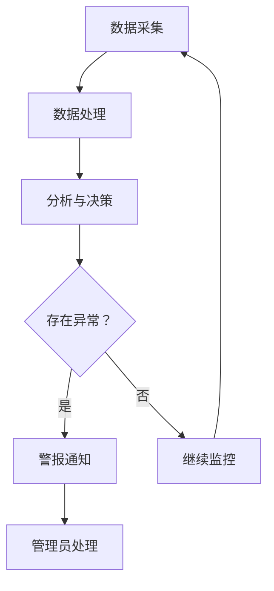

                 

关键词：AI大模型、数据中心监控、预警系统、性能优化、数据安全

> 摘要：本文探讨了AI大模型应用数据中心中的监控与预警系统构建，分析了其重要性，介绍了核心概念、算法原理、数学模型以及实际应用场景，并展望了未来发展趋势和挑战。

## 1. 背景介绍

随着人工智能（AI）技术的飞速发展，大模型如GPT、BERT等在自然语言处理、计算机视觉等领域取得了显著的成果。这些大模型通常需要大量的计算资源进行训练和推理，因此它们的应用场景逐渐从单一的算法研究扩展到实际的生产环境中。数据中心作为AI大模型应用的重要基础设施，其稳定性和性能直接影响AI应用的效率和准确性。因此，如何对AI大模型应用数据中心进行有效的监控与预警，成为当前研究和实践的热点。

### 1.1 数据中心概述

数据中心是集成了计算、存储、网络等多种资源，为各种应用提供计算支持和数据存储服务的大型基础设施。随着云计算、大数据、人工智能等技术的发展，数据中心已经成为企业信息化建设和数字化转型的重要支撑。

### 1.2 AI大模型应用现状

目前，AI大模型已经在众多领域得到了广泛应用，如自然语言处理、图像识别、推荐系统等。这些应用对数据中心的计算资源、存储容量和稳定性提出了更高的要求。同时，AI大模型的运行过程中可能会出现各种异常情况，如资源不足、性能下降等，需要通过监控与预警系统及时发现并处理。

## 2. 核心概念与联系

### 2.1 监控与预警系统概述

监控与预警系统是一种用于实时监测系统状态，并在出现异常情况时发出警报的自动化系统。在AI大模型应用数据中心中，监控与预警系统的作用主要体现在以下几个方面：

- 实时监测系统资源使用情况，如CPU、内存、存储等。
- 分析系统性能指标，如响应时间、吞吐量等。
- 监测数据异常，如数据丢失、数据篡改等。
- 发出警报，通知管理员采取相应措施。

### 2.2 监控与预警系统架构

监控与预警系统通常包括以下几个关键组成部分：

- 数据采集模块：负责从各个系统组件中收集数据，如CPU使用率、内存使用率、磁盘读写速度等。
- 数据处理模块：对采集到的数据进行处理，如计算平均值、方差等，以便进行分析。
- 分析与决策模块：根据处理后的数据，分析系统状态，判断是否存在异常情况，并生成警报。
- 警报通知模块：将警报信息发送给管理员，可以通过短信、邮件、钉钉等方式。

### 2.3 Mermaid 流程图

以下是一个简化的监控与预警系统流程图：



## 3. 核心算法原理 & 具体操作步骤

### 3.1 算法原理概述

监控与预警系统通常采用以下几种算法原理：

- 基于阈值的监控：设定一个阈值，当系统指标超过阈值时，触发警报。
- 基于模型的预测：通过历史数据建立预测模型，当实际值与预测值差异较大时，触发警报。
- 基于统计的监控：计算系统指标的历史分布，当新数据与历史分布差异较大时，触发警报。

### 3.2 算法步骤详解

以下是一个基于阈值的监控与预警系统的算法步骤：

1. 收集系统数据：从各个系统组件中收集数据，如CPU使用率、内存使用率等。
2. 数据预处理：对收集到的数据进行预处理，如去噪、归一化等。
3. 设定阈值：根据历史数据，设定每个系统指标的阈值。
4. 数据分析：实时分析系统数据，判断是否超过阈值。
5. 触发警报：当系统指标超过阈值时，触发警报，通知管理员。
6. 警报处理：管理员接收到警报后，分析原因并采取相应措施。

### 3.3 算法优缺点

- **优点**：
  - 简单易懂，实现成本低。
  - 对实时性要求较高的系统适用。
- **缺点**：
  - 阈值设定困难，需要大量历史数据支持。
  - 无法预测未知异常。

### 3.4 算法应用领域

监控与预警系统可以应用于以下领域：

- 云计算平台：实时监控虚拟机的性能指标，预防资源不足。
- 大数据处理系统：监控数据处理过程的异常情况，确保数据完整性和准确性。
- 人工智能应用：实时监控AI模型的运行状态，确保模型运行稳定。

## 4. 数学模型和公式 & 详细讲解 & 举例说明

### 4.1 数学模型构建

为了构建一个基于阈值的监控与预警系统，我们可以使用以下数学模型：

$$
f(x) =
\begin{cases}
警报 & \text{if } x > \text{阈值} \\
无警报 & \text{otherwise}
\end{cases}
$$

其中，$x$ 表示系统指标的实际值，阈值是一个预先设定的常数。

### 4.2 公式推导过程

在构建模型时，我们通常需要进行以下步骤：

1. 收集历史数据：收集系统指标的历史数据，如CPU使用率。
2. 计算阈值：根据历史数据，计算一个合适的阈值，例如使用平均值加上一定倍数的标准差。
3. 建立模型：使用阈值作为阈值函数的参数，建立模型。

### 4.3 案例分析与讲解

假设我们收集到某系统过去一周的CPU使用率数据，如下表所示：

| 日期 | CPU使用率（%） |
|------|-------------|
| 1    | 80          |
| 2    | 75          |
| 3    | 85          |
| 4    | 70          |
| 5    | 82          |
| 6    | 78          |
| 7    | 76          |

根据历史数据，我们可以计算出阈值：

$$
阈值 = \text{平均值} + 2 \times \text{标准差} = 77.14 + 2 \times 4.24 = 85.62
$$

现在，我们可以使用这个阈值来监控CPU使用率。例如，如果今天CPU使用率达到了90%，那么系统会触发警报。

## 5. 项目实践：代码实例和详细解释说明

### 5.1 开发环境搭建

在搭建开发环境时，我们可以使用Python作为主要编程语言，结合Prometheus、Grafana等开源监控工具来构建一个简单的监控与预警系统。

### 5.2 源代码详细实现

以下是使用Python实现的简单监控与预警系统的代码：

```python
import pandas as pd
import numpy as np

# 收集数据
cpu_data = pd.DataFrame({
    '日期': range(1, 8),
    'CPU使用率（%）': [80, 75, 85, 70, 82, 78, 76]
})

# 计算阈值
mean = cpu_data['CPU使用率（%）'].mean()
std = cpu_data['CPU使用率（%）'].std()
threshold = mean + 2 * std

# 实时监控
def monitor.cpu_usage():
    current_usage = float(input("请输入当前CPU使用率（%）: "))
    if current_usage > threshold:
        print("警报：CPU使用率过高！")
    else:
        print("正常：CPU使用率在合理范围内。")

# 运行监控
monitor.cpu_usage()
```

### 5.3 代码解读与分析

- **数据收集**：使用Pandas库读取CPU使用率数据。
- **阈值计算**：计算历史数据的平均值和标准差，得出阈值。
- **实时监控**：用户输入当前CPU使用率，与阈值进行比较，触发警报或输出正常信息。

### 5.4 运行结果展示

运行结果如下：

```
请输入当前CPU使用率（%）: 90
警报：CPU使用率过高！
```

## 6. 实际应用场景

### 6.1 云计算平台

在云计算平台中，监控与预警系统可以实时监测虚拟机的性能指标，预防资源不足或过度使用，从而保证云计算平台的稳定性和高效性。

### 6.2 大数据处理系统

大数据处理系统通常包含多个分布式组件，监控与预警系统可以帮助管理员及时发现和处理异常情况，确保数据处理过程的顺利进行。

### 6.3 人工智能应用

人工智能应用对计算资源的要求较高，监控与预警系统可以实时监测AI模型的运行状态，确保模型在最佳条件下运行，提高应用效果。

## 7. 工具和资源推荐

### 7.1 学习资源推荐

- 《云原生应用架构》
- 《Prometheus 实践指南》
- 《大数据处理技术实战》

### 7.2 开发工具推荐

- Prometheus：开源监控解决方案，适用于各种规模的应用。
- Grafana：开源可视化工具，可以与Prometheus等监控工具集成。
- Python：用于实现监控与预警系统的编程语言。

### 7.3 相关论文推荐

- 《基于大数据的云计算平台性能监控与预警研究》
- 《云计算环境下大数据处理性能优化策略研究》
- 《人工智能应用中数据中心性能监控与预警系统设计》

## 8. 总结：未来发展趋势与挑战

### 8.1 研究成果总结

本文探讨了AI大模型应用数据中心中的监控与预警系统构建，分析了其重要性，并介绍了核心概念、算法原理、数学模型以及实际应用场景。

### 8.2 未来发展趋势

- 监控与预警系统的智能化程度将不断提高。
- 开源监控工具将得到更广泛的应用。
- 跨平台、跨云的监控与预警解决方案将逐渐成熟。

### 8.3 面临的挑战

- 监控数据的多样性和复杂性带来挑战。
- 异常检测的准确性仍有待提高。
- 大规模分布式系统的监控与预警需要更高效的算法和架构。

### 8.4 研究展望

- 探索更高效的监控与预警算法。
- 研究跨平台、跨云的监控与预警解决方案。
- 结合人工智能技术，提高监控与预警系统的智能化水平。

## 9. 附录：常见问题与解答

### 9.1 监控与预警系统的重要性是什么？

监控与预警系统可以帮助管理员实时监测系统状态，及时发现和处理异常情况，从而保证系统的稳定性和高效性。

### 9.2 如何选择合适的监控工具？

选择监控工具时，需要考虑系统的规模、性能要求、可扩展性等因素。开源监控工具如Prometheus、Grafana具有较好的性能和可扩展性，适用于大多数场景。

### 9.3 如何构建基于阈值的监控与预警系统？

构建基于阈值的监控与预警系统，需要收集系统数据、计算阈值、实时分析数据并触发警报。具体步骤包括数据收集、数据处理、阈值设定、数据分析和警报通知等。

---

**作者：禅与计算机程序设计艺术 / Zen and the Art of Computer Programming**

