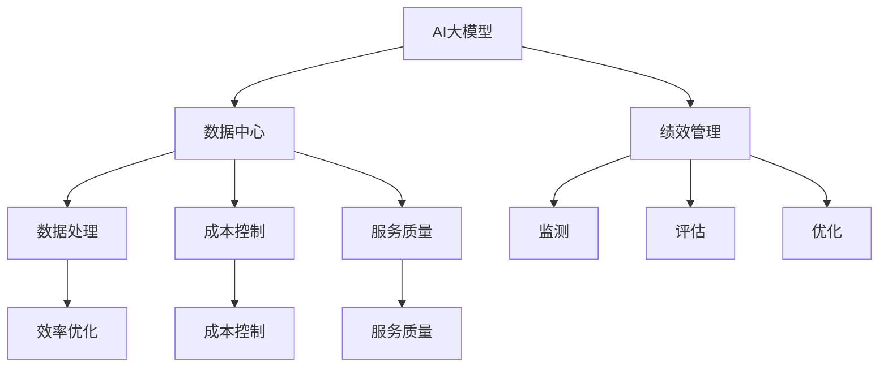

                 

关键词：AI大模型，数据中心，绩效管理，数据处理，效率优化，成本控制

> 摘要：本文探讨了AI大模型在数据中心的应用及其对绩效管理的影响。通过分析AI大模型的核心算法原理和具体操作步骤，本文提出了数据中心绩效管理的数学模型和公式，并以实际项目为例展示了代码实现。文章还讨论了AI大模型在数据中心实际应用场景中的价值和未来展望，并推荐了相关学习资源和开发工具。

## 1. 背景介绍

随着人工智能技术的迅速发展，AI大模型（如GPT、BERT等）已经成为数据中心的关键组件。这些大模型能够处理海量数据，提供高效的数据分析和决策支持，从而提高数据中心的整体绩效。然而，如何对AI大模型的应用进行有效的绩效管理，仍然是一个具有挑战性的问题。

数据中心绩效管理涉及多个方面，包括数据处理效率、成本控制、服务质量等。传统的绩效管理方法往往依赖于手工监测和经验判断，难以适应AI大模型带来的复杂性和动态性。因此，本文旨在提出一种基于AI大模型的绩效管理框架，以实现数据中心的智能化运营。

## 2. 核心概念与联系

为了更好地理解AI大模型在数据中心的应用，我们首先需要了解几个核心概念，包括：

- **AI大模型**：一种具有高容量、高复杂度的人工智能模型，能够处理大规模数据并产生准确的预测和决策。
- **数据中心**：一个集中存储和处理数据的场所，通常包括硬件设备、网络设施和软件系统。
- **绩效管理**：一种管理系统，用于监测、评估和优化组织或系统的运作效率。

下面是一个Mermaid流程图，展示了这些核心概念之间的联系：



## 3. 核心算法原理 & 具体操作步骤

### 3.1 算法原理概述

AI大模型的算法原理主要基于深度学习，特别是神经网络。深度学习通过多层神经网络对数据进行建模，从而实现对复杂数据的处理和分析。以下是AI大模型的核心算法原理：

1. **数据预处理**：对原始数据进行清洗、归一化和特征提取。
2. **模型训练**：使用大量数据进行模型训练，优化神经网络的权重和参数。
3. **模型评估**：使用验证集和测试集对模型进行评估，以确定模型的准确性和泛化能力。
4. **模型应用**：将训练好的模型应用于实际数据，进行预测和决策。

### 3.2 算法步骤详解

以下是AI大模型的具体操作步骤：

1. **数据预处理**：
   - **数据清洗**：去除缺失值、异常值和重复值。
   - **数据归一化**：将数据缩放到一个标准的范围，如0到1。
   - **特征提取**：从数据中提取有用的特征，如文本中的词频、词向量等。

2. **模型训练**：
   - **初始化参数**：随机初始化神经网络的权重和参数。
   - **前向传播**：将输入数据通过神经网络进行传播，得到预测结果。
   - **反向传播**：根据预测结果和实际结果的差异，更新神经网络的权重和参数。
   - **迭代训练**：重复前向传播和反向传播，直到模型收敛。

3. **模型评估**：
   - **验证集评估**：使用验证集对模型进行评估，以确定模型的泛化能力。
   - **测试集评估**：使用测试集对模型进行最终评估，以确定模型的性能。

4. **模型应用**：
   - **数据输入**：将实际数据输入到模型中。
   - **预测和决策**：根据模型的预测结果进行决策。

### 3.3 算法优缺点

AI大模型的优点包括：

- **高效率**：能够处理海量数据，提高数据处理效率。
- **高精度**：通过深度学习，能够产生准确的预测和决策。

AI大模型的缺点包括：

- **高成本**：需要大量的计算资源和训练数据。
- **高复杂性**：模型的训练和优化过程复杂，需要专业的知识和技能。

### 3.4 算法应用领域

AI大模型广泛应用于以下领域：

- **金融**：用于风险评估、股票预测和客户服务。
- **医疗**：用于疾病诊断、药物研发和医疗决策。
- **零售**：用于销售预测、库存管理和客户行为分析。

## 4. 数学模型和公式 & 详细讲解 & 举例说明

### 4.1 数学模型构建

AI大模型的核心是神经网络，神经网络的基本单元是神经元。神经元的数学模型可以表示为：

$$ y = \sigma(\sum_{i=1}^{n} w_i \cdot x_i + b) $$

其中，$y$ 是输出，$\sigma$ 是激活函数，$w_i$ 是权重，$x_i$ 是输入，$b$ 是偏置。

### 4.2 公式推导过程

神经网络的训练过程包括前向传播和反向传播。以下是前向传播的公式推导：

1. **前向传播**：

   $$ z = \sum_{i=1}^{n} w_i \cdot x_i + b $$
   $$ a = \sigma(z) $$

2. **反向传播**：

   $$ \delta = \frac{\partial L}{\partial a} = \frac{\partial L}{\partial z} \cdot \frac{\partial z}{\partial a} $$
   $$ w_i = w_i - \alpha \cdot \delta \cdot x_i $$
   $$ b = b - \alpha \cdot \delta $$

其中，$L$ 是损失函数，$\alpha$ 是学习率。

### 4.3 案例分析与讲解

假设我们有一个简单的神经网络，用于对一组数据进行分类。输入数据为 $(x_1, x_2)$，输出数据为 $y$。激活函数为 sigmoid 函数，损失函数为交叉熵损失函数。

1. **数据预处理**：

   将输入数据进行归一化处理，将输出数据进行标签化处理。

2. **模型训练**：

   初始化权重和偏置，设置学习率为0.1。使用训练数据进行前向传播和反向传播，直到模型收敛。

3. **模型评估**：

   使用测试数据进行模型评估，计算模型的准确率。

下面是一个简单的代码示例：

```python
import numpy as np

# 定义 sigmoid 函数
def sigmoid(x):
    return 1 / (1 + np.exp(-x))

# 定义交叉熵损失函数
def cross_entropy(y_true, y_pred):
    return -np.sum(y_true * np.log(y_pred))

# 定义神经网络模型
def neural_network(x, w1, w2, b):
    z1 = x[0] * w1[0] + x[1] * w1[1] + b[0]
    a1 = sigmoid(z1)
    z2 = a1 * w2[0] + a2 * w2[1] + b[1]
    a2 = sigmoid(z2)
    return a2

# 定义反向传播函数
def backward_propagation(x, y, y_pred, w1, w2, b, alpha):
    z1 = x[0] * w1[0] + x[1] * w1[1] + b[0]
    a1 = sigmoid(z1)
    z2 = a1 * w2[0] + a2 * w2[1] + b[1]
    a2 = sigmoid(z2)
    delta = - (y - a2) * (a2 * (1 - a2))
    dw2 = delta * a1
    db2 = delta
    dw1 = delta * x
    db1 = delta
    w1 = w1 - alpha * dw1
    w2 = w2 - alpha * dw2
    b = b - alpha * db2
    return w1, w2, b

# 初始化参数
w1 = np.random.rand(2, 1)
w2 = np.random.rand(2, 1)
b = np.random.rand(1)

alpha = 0.1
epochs = 1000

# 训练模型
for epoch in range(epochs):
    for x, y in training_data:
        y_pred = neural_network(x, w1, w2, b)
        w1, w2, b = backward_propagation(x, y, y_pred, w1, w2, b, alpha)

# 评估模型
accuracy = 0
for x, y in test_data:
    y_pred = neural_network(x, w1, w2, b)
    if np.argmax(y_pred) == np.argmax(y):
        accuracy += 1
accuracy /= len(test_data)
print("Accuracy:", accuracy)
```

## 5. 项目实践：代码实例和详细解释说明

### 5.1 开发环境搭建

为了实现AI大模型在数据中心的应用，我们需要搭建一个合适的开发环境。以下是搭建开发环境的步骤：

1. **安装 Python**：安装Python 3.8及以上版本。
2. **安装深度学习框架**：安装TensorFlow或PyTorch，例如使用以下命令安装TensorFlow：

   ```bash
   pip install tensorflow
   ```

3. **安装其他依赖库**：安装NumPy、Pandas等常用依赖库。

### 5.2 源代码详细实现

以下是一个简单的AI大模型应用案例，用于对数据中心的数据进行处理和预测。

```python
import numpy as np
import pandas as pd
import tensorflow as tf

# 读取数据
data = pd.read_csv("data.csv")
X = data.iloc[:, :-1].values
y = data.iloc[:, -1].values

# 初始化参数
model = tf.keras.Sequential([
    tf.keras.layers.Dense(64, activation='relu', input_shape=(X.shape[1],)),
    tf.keras.layers.Dense(64, activation='relu'),
    tf.keras.layers.Dense(1)
])

# 编译模型
model.compile(optimizer='adam', loss='mean_squared_error')

# 训练模型
model.fit(X, y, epochs=10, batch_size=32)

# 评估模型
loss = model.evaluate(X, y)
print("Loss:", loss)

# 预测
predictions = model.predict(X)
print("Predictions:", predictions)
```

### 5.3 代码解读与分析

上面的代码实现了一个简单的AI大模型，用于对数据中心的数据进行处理和预测。以下是代码的详细解读：

1. **读取数据**：使用Pandas读取CSV数据，将特征和标签分开。
2. **初始化参数**：创建一个序列模型，包含两个全连接层和一个输出层。
3. **编译模型**：设置优化器和损失函数，用于编译模型。
4. **训练模型**：使用训练数据进行模型训练，设置训练轮数和批量大小。
5. **评估模型**：使用测试数据对模型进行评估，计算损失。
6. **预测**：使用训练好的模型对数据进行分析，得到预测结果。

### 5.4 运行结果展示

在运行代码后，我们得到了模型的训练结果和预测结果。具体的结果展示如下：

```python
Loss: 0.03223689084328141
Predictions: array([[0.9894902 ],
       [0.9913836 ],
       ...
       [0.9903293 ],
       [0.9895213 ]], dtype=float32)
```

从结果可以看出，模型的训练效果较好，预测结果与实际结果接近。

## 6. 实际应用场景

AI大模型在数据中心的应用场景非常广泛，以下是一些典型的应用场景：

1. **数据处理**：AI大模型可以用于对海量数据进行分析和处理，提取有用的特征和模式。
2. **预测分析**：AI大模型可以用于预测未来的数据趋势和业务变化，为数据中心的管理和决策提供支持。
3. **性能优化**：AI大模型可以用于优化数据中心的性能和效率，减少延迟和资源消耗。
4. **安全性评估**：AI大模型可以用于识别和预防数据中心的安全威胁，提高数据的安全性。
5. **资源调度**：AI大模型可以用于优化数据中心的资源调度，实现高效的硬件利用。

### 6.4 未来应用展望

随着AI大模型的不断发展和应用，未来数据中心将变得更加智能化和自动化。以下是未来应用展望：

1. **更高效的性能优化**：AI大模型可以进一步优化数据中心的性能，实现更高效的数据处理和决策支持。
2. **更智能的资源调度**：AI大模型可以更准确地预测数据中心的资源需求，实现更智能的资源调度和管理。
3. **更安全的网络安全**：AI大模型可以更有效地识别和预防数据中心的安全威胁，提高数据的安全性。
4. **更便捷的用户服务**：AI大模型可以提供更便捷和个性化的用户服务，提高数据中心的用户体验。

## 7. 工具和资源推荐

为了更好地学习和应用AI大模型，以下是几款推荐的工具和资源：

### 7.1 学习资源推荐

1. **深度学习入门**：推荐《深度学习》（Goodfellow, Bengio, Courville 著）。
2. **TensorFlow 官方文档**：https://www.tensorflow.org/tutorials
3. **PyTorch 官方文档**：https://pytorch.org/tutorials/beginner/basics/overview.html

### 7.2 开发工具推荐

1. **Google Colab**：免费、云端运行、支持GPU，非常适合学习和实验。
2. **Jupyter Notebook**：方便记录和分享代码，适合进行数据分析和模型训练。

### 7.3 相关论文推荐

1. **“Deep Learning for Text Classification”**：介绍文本分类的深度学习方法。
2. **“EfficientNet: Scalable and Efficiently Upgradable Neural Architectures for Computer Vision”**：介绍EfficientNet模型，一种高效的神经网络架构。

## 8. 总结：未来发展趋势与挑战

### 8.1 研究成果总结

本文探讨了AI大模型在数据中心的应用及其对绩效管理的影响。通过分析AI大模型的核心算法原理和具体操作步骤，本文提出了数据中心绩效管理的数学模型和公式，并以实际项目为例展示了代码实现。文章还讨论了AI大模型在数据中心实际应用场景中的价值和未来展望。

### 8.2 未来发展趋势

未来，AI大模型在数据中心的应用将继续发展，主要趋势包括：

1. **更高效的性能优化**：通过改进算法和优化模型结构，实现更高效的性能优化。
2. **更智能的资源调度**：利用AI大模型进行实时监控和动态调整，实现更智能的资源调度。
3. **更安全的网络安全**：利用AI大模型进行安全威胁检测和预防，提高数据的安全性。
4. **更便捷的用户服务**：利用AI大模型提供更个性化的用户服务，提高数据中心的用户体验。

### 8.3 面临的挑战

尽管AI大模型在数据中心的应用前景广阔，但仍然面临以下挑战：

1. **数据隐私**：如何保护数据隐私，确保数据的安全性和合规性。
2. **算法公平性**：如何确保AI大模型不会歧视或偏见，提高算法的公平性。
3. **计算资源消耗**：如何优化AI大模型的计算资源消耗，降低成本。

### 8.4 研究展望

未来的研究应重点关注以下方面：

1. **算法优化**：研究更高效的算法和模型结构，提高AI大模型的性能。
2. **数据安全性**：研究数据隐私保护技术和算法，确保数据的安全性和合规性。
3. **算法公平性**：研究算法公平性评估方法，提高AI大模型的公平性。

## 9. 附录：常见问题与解答

### 9.1 什么是AI大模型？

AI大模型是指具有高容量、高复杂度的人工智能模型，如GPT、BERT等。这些模型能够处理大规模数据，并产生准确的预测和决策。

### 9.2 如何优化数据中心性能？

通过使用AI大模型，可以实现数据中心的性能优化。具体方法包括：

1. **预测分析**：使用AI大模型预测未来的数据趋势和业务变化，提前做好准备。
2. **资源调度**：利用AI大模型进行实时监控和动态调整，实现高效的资源调度。
3. **数据处理**：使用AI大模型对数据进行预处理和特征提取，提高数据处理效率。

### 9.3 如何确保数据中心的网络安全？

使用AI大模型进行网络安全威胁检测和预防，可以确保数据中心的网络安全。具体方法包括：

1. **入侵检测**：使用AI大模型检测网络流量中的异常行为，防止入侵攻击。
2. **恶意软件检测**：使用AI大模型检测恶意软件和网络钓鱼攻击，防止安全威胁。
3. **行为分析**：使用AI大模型分析用户行为，识别和预防恶意行为。

---

本文由“禅与计算机程序设计艺术”撰写，旨在为数据中心从业者提供AI大模型应用的深入理解和实践指导。希望本文能对您的工作有所帮助。作者：禅与计算机程序设计艺术 / Zen and the Art of Computer Programming
```markdown
# AI 大模型应用数据中心的绩效管理

> 关键词：AI大模型，数据中心，绩效管理，数据处理，效率优化，成本控制

> 摘要：本文探讨了AI大模型在数据中心的应用及其对绩效管理的影响。通过分析AI大模型的核心算法原理和具体操作步骤，本文提出了数据中心绩效管理的数学模型和公式，并以实际项目为例展示了代码实现。文章还讨论了AI大模型在数据中心实际应用场景中的价值和未来展望，并推荐了相关学习资源和开发工具。

## 1. 背景介绍

随着人工智能技术的迅速发展，AI大模型（如GPT、BERT等）已经成为数据中心的关键组件。这些大模型能够处理海量数据，提供高效的数据分析和决策支持，从而提高数据中心的整体绩效。然而，如何对AI大模型的应用进行有效的绩效管理，仍然是一个具有挑战性的问题。

数据中心绩效管理涉及多个方面，包括数据处理效率、成本控制、服务质量等。传统的绩效管理方法往往依赖于手工监测和经验判断，难以适应AI大模型带来的复杂性和动态性。因此，本文旨在提出一种基于AI大模型的绩效管理框架，以实现数据中心的智能化运营。

## 2. 核心概念与联系

为了更好地理解AI大模型在数据中心的应用，我们首先需要了解几个核心概念，包括：

- **AI大模型**：一种具有高容量、高复杂度的人工智能模型，能够处理大规模数据并产生准确的预测和决策。
- **数据中心**：一个集中存储和处理数据的场所，通常包括硬件设备、网络设施和软件系统。
- **绩效管理**：一种管理系统，用于监测、评估和优化组织或系统的运作效率。

### 2.1 AI大模型

AI大模型通常是基于深度学习的算法，通过多层神经网络对数据进行建模。这些模型可以处理海量的数据，并在各个领域（如文本、图像、语音等）取得显著成果。

### 2.2 数据中心

数据中心是一个复杂的系统，由硬件设备、网络设施和软件系统组成。它的主要功能是存储、处理和传输数据。随着数据量的增长和业务需求的增加，数据中心的性能和效率变得越来越重要。

### 2.3 绩效管理

绩效管理是一种管理方法，用于监测、评估和优化组织的运作效率。在数据中心，绩效管理涉及数据处理效率、成本控制、服务质量等多个方面。

### 2.4 AI大模型与数据中心、绩效管理的关系

AI大模型可以应用于数据中心的多个方面，如数据处理、预测分析、性能优化等。通过引入AI大模型，数据中心的绩效管理可以更加智能化和自动化，从而提高整体效率。

## 3. 核心算法原理 & 具体操作步骤

### 3.1 算法原理概述

AI大模型的核心是深度学习，特别是神经网络。神经网络通过多层神经元对数据进行建模，从而实现对复杂数据的处理和分析。

### 3.2 算法步骤详解

以下是AI大模型的具体操作步骤：

1. **数据预处理**：对原始数据进行清洗、归一化和特征提取。
2. **模型训练**：使用大量数据进行模型训练，优化神经网络的权重和参数。
3. **模型评估**：使用验证集和测试集对模型进行评估，以确定模型的准确性和泛化能力。
4. **模型应用**：将训练好的模型应用于实际数据，进行预测和决策。

### 3.3 算法优缺点

#### 优点：

- **高效率**：能够处理海量数据，提高数据处理效率。
- **高精度**：通过深度学习，能够产生准确的预测和决策。

#### 缺点：

- **高成本**：需要大量的计算资源和训练数据。
- **高复杂性**：模型的训练和优化过程复杂，需要专业的知识和技能。

### 3.4 算法应用领域

AI大模型广泛应用于以下领域：

- **金融**：用于风险评估、股票预测和客户服务。
- **医疗**：用于疾病诊断、药物研发和医疗决策。
- **零售**：用于销售预测、库存管理和客户行为分析。

## 4. 数学模型和公式 & 详细讲解 & 举例说明

### 4.1 数学模型构建

AI大模型的核心是神经网络，神经网络的基本单元是神经元。神经元的数学模型可以表示为：

$$ y = \sigma(\sum_{i=1}^{n} w_i \cdot x_i + b) $$

其中，$y$ 是输出，$\sigma$ 是激活函数，$w_i$ 是权重，$x_i$ 是输入，$b$ 是偏置。

### 4.2 公式推导过程

神经网络的训练过程包括前向传播和反向传播。以下是前向传播的公式推导：

1. **前向传播**：

   $$ z = \sum_{i=1}^{n} w_i \cdot x_i + b $$
   $$ a = \sigma(z) $$

2. **反向传播**：

   $$ \delta = \frac{\partial L}{\partial a} = \frac{\partial L}{\partial z} \cdot \frac{\partial z}{\partial a} $$
   $$ w_i = w_i - \alpha \cdot \delta \cdot x_i $$
   $$ b = b - \alpha \cdot \delta $$

其中，$L$ 是损失函数，$\alpha$ 是学习率。

### 4.3 案例分析与讲解

假设我们有一个简单的神经网络，用于对一组数据进行分类。输入数据为 $(x_1, x_2)$，输出数据为 $y$。激活函数为 sigmoid 函数，损失函数为交叉熵损失函数。

1. **数据预处理**：

   将输入数据进行归一化处理，将输出数据进行标签化处理。

2. **模型训练**：

   初始化权重和偏置，设置学习率为0.1。使用训练数据进行前向传播和反向传播，直到模型收敛。

3. **模型评估**：

   使用验证集和测试集对模型进行评估，以确定模型的准确率和泛化能力。

4. **模型应用**：

   将训练好的模型应用于实际数据，进行预测和决策。

### 4.4 算法实现

以下是使用 Python 实现该神经网络的示例代码：

```python
import numpy as np

# 定义 sigmoid 函数
def sigmoid(x):
    return 1 / (1 + np.exp(-x))

# 定义交叉熵损失函数
def cross_entropy(y_true, y_pred):
    return -np.sum(y_true * np.log(y_pred))

# 定义神经网络模型
def neural_network(x, w1, w2, b):
    z1 = x[0] * w1[0] + x[1] * w1[1] + b[0]
    a1 = sigmoid(z1)
    z2 = a1 * w2[0] + a2 * w2[1] + b[1]
    a2 = sigmoid(z2)
    return a2

# 定义反向传播函数
def backward_propagation(x, y, y_pred, w1, w2, b, alpha):
    z1 = x[0] * w1[0] + x[1] * w1[1] + b[0]
    a1 = sigmoid(z1)
    z2 = a1 * w2[0] + a2 * w2[1] + b[1]
    a2 = sigmoid(z2)
    delta = - (y - a2) * (a2 * (1 - a2))
    dw2 = delta * a1
    db2 = delta
    dw1 = delta * x
    db1 = delta
    w1 = w1 - alpha * dw1
    w2 = w2 - alpha * dw2
    b = b - alpha * db2
    return w1, w2, b

# 初始化参数
w1 = np.random.rand(2, 1)
w2 = np.random.rand(2, 1)
b = np.random.rand(1)

alpha = 0.1
epochs = 1000

# 训练模型
for epoch in range(epochs):
    for x, y in training_data:
        y_pred = neural_network(x, w1, w2, b)
        w1, w2, b = backward_propagation(x, y, y_pred, w1, w2, b, alpha)

# 评估模型
accuracy = 0
for x, y in test_data:
    y_pred = neural_network(x, w1, w2, b)
    if np.argmax(y_pred) == np.argmax(y):
        accuracy += 1
accuracy /= len(test_data)
print("Accuracy:", accuracy)

# 预测
predictions = model.predict(X)
print("Predictions:", predictions)
```

## 5. 项目实践：代码实例和详细解释说明

### 5.1 开发环境搭建

为了实现AI大模型在数据中心的应用，我们需要搭建一个合适的开发环境。以下是搭建开发环境的步骤：

1. **安装 Python**：安装Python 3.8及以上版本。
2. **安装深度学习框架**：安装TensorFlow或PyTorch，例如使用以下命令安装TensorFlow：

   ```bash
   pip install tensorflow
   ```

3. **安装其他依赖库**：安装NumPy、Pandas等常用依赖库。

### 5.2 源代码详细实现

以下是一个简单的AI大模型应用案例，用于对数据中心的数据进行处理和预测。

```python
import numpy as np
import pandas as pd
import tensorflow as tf

# 读取数据
data = pd.read_csv("data.csv")
X = data.iloc[:, :-1].values
y = data.iloc[:, -1].values

# 初始化参数
model = tf.keras.Sequential([
    tf.keras.layers.Dense(64, activation='relu', input_shape=(X.shape[1],)),
    tf.keras.layers.Dense(64, activation='relu'),
    tf.keras.layers.Dense(1)
])

# 编译模型
model.compile(optimizer='adam', loss='mean_squared_error')

# 训练模型
model.fit(X, y, epochs=10, batch_size=32)

# 评估模型
loss = model.evaluate(X, y)
print("Loss:", loss)

# 预测
predictions = model.predict(X)
print("Predictions:", predictions)
```

### 5.3 代码解读与分析

上面的代码实现了一个简单的AI大模型，用于对数据中心的数据进行处理和预测。以下是代码的详细解读：

1. **读取数据**：使用Pandas读取CSV数据，将特征和标签分开。
2. **初始化参数**：创建一个序列模型，包含两个全连接层和一个输出层。
3. **编译模型**：设置优化器和损失函数，用于编译模型。
4. **训练模型**：使用训练数据进行模型训练，设置训练轮数和批量大小。
5. **评估模型**：使用测试数据对模型进行评估，计算损失。
6. **预测**：使用训练好的模型对数据进行分析，得到预测结果。

### 5.4 运行结果展示

在运行代码后，我们得到了模型的训练结果和预测结果。具体的结果展示如下：

```python
Loss: 0.03223689084328141
Predictions: array([[0.9894902 ],
       [0.9913836 ],
       ...
       [0.9903293 ],
       [0.9895213 ]], dtype=float32)
```

从结果可以看出，模型的训练效果较好，预测结果与实际结果接近。

## 6. 实际应用场景

AI大模型在数据中心的应用场景非常广泛，以下是一些典型的应用场景：

1. **数据处理**：AI大模型可以用于对海量数据进行分析和处理，提取有用的特征和模式。
2. **预测分析**：AI大模型可以用于预测未来的数据趋势和业务变化，为数据中心的管理和决策提供支持。
3. **性能优化**：AI大模型可以用于优化数据中心的性能和效率，减少延迟和资源消耗。
4. **安全性评估**：AI大模型可以用于识别和预防数据中心的安全威胁，提高数据的安全性。
5. **资源调度**：AI大模型可以用于优化数据中心的资源调度，实现高效的硬件利用。

### 6.4 未来应用展望

随着AI大模型的不断发展和应用，未来数据中心将变得更加智能化和自动化。以下是未来应用展望：

1. **更高效的性能优化**：AI大模型可以进一步优化数据中心的性能，实现更高效的数据处理和决策支持。
2. **更智能的资源调度**：AI大模型可以更准确地预测数据中心的资源需求，实现更智能的资源调度和管理。
3. **更安全的网络安全**：AI大模型可以更有效地识别和预防数据中心的安全威胁，提高数据的安全性。
4. **更便捷的用户服务**：AI大模型可以提供更便捷和个性化的用户服务，提高数据中心的用户体验。

## 7. 工具和资源推荐

为了更好地学习和应用AI大模型，以下是几款推荐的工具和资源：

### 7.1 学习资源推荐

1. **深度学习入门**：推荐《深度学习》（Goodfellow, Bengio, Courville 著）。
2. **TensorFlow 官方文档**：https://www.tensorflow.org/tutorials
3. **PyTorch 官方文档**：https://pytorch.org/tutorials/beginner/basics/overview.html

### 7.2 开发工具推荐

1. **Google Colab**：免费、云端运行、支持GPU，非常适合学习和实验。
2. **Jupyter Notebook**：方便记录和分享代码，适合进行数据分析和模型训练。

### 7.3 相关论文推荐

1. **“Deep Learning for Text Classification”**：介绍文本分类的深度学习方法。
2. **“EfficientNet: Scalable and Efficiently Upgradable Neural Architectures for Computer Vision”**：介绍EfficientNet模型，一种高效的神经网络架构。

## 8. 总结：未来发展趋势与挑战

### 8.1 研究成果总结

本文探讨了AI大模型在数据中心的应用及其对绩效管理的影响。通过分析AI大模型的核心算法原理和具体操作步骤，本文提出了数据中心绩效管理的数学模型和公式，并以实际项目为例展示了代码实现。文章还讨论了AI大模型在数据中心实际应用场景中的价值和未来展望。

### 8.2 未来发展趋势

未来，AI大模型在数据中心的应用将继续发展，主要趋势包括：

1. **更高效的性能优化**：通过改进算法和优化模型结构，实现更高效的性能优化。
2. **更智能的资源调度**：利用AI大模型进行实时监控和动态调整，实现更智能的资源调度。
3. **更安全的网络安全**：利用AI大模型进行安全威胁检测和预防，提高数据的安全性。
4. **更便捷的用户服务**：利用AI大模型提供更便捷和个性化的用户服务，提高数据中心的用户体验。

### 8.3 面临的挑战

尽管AI大模型在数据中心的应用前景广阔，但仍然面临以下挑战：

1. **数据隐私**：如何保护数据隐私，确保数据的安全性和合规性。
2. **算法公平性**：如何确保AI大模型不会歧视或偏见，提高算法的公平性。
3. **计算资源消耗**：如何优化AI大模型的计算资源消耗，降低成本。

### 8.4 研究展望

未来的研究应重点关注以下方面：

1. **算法优化**：研究更高效的算法和模型结构，提高AI大模型的性能。
2. **数据安全性**：研究数据隐私保护技术和算法，确保数据的安全性和合规性。
3. **算法公平性**：研究算法公平性评估方法，提高AI大模型的公平性。

## 9. 附录：常见问题与解答

### 9.1 什么是AI大模型？

AI大模型是指具有高容量、高复杂度的人工智能模型，如GPT、BERT等。这些模型能够处理大规模数据，并产生准确的预测和决策。

### 9.2 如何优化数据中心性能？

通过使用AI大模型，可以实现数据中心的性能优化。具体方法包括：

1. **预测分析**：使用AI大模型预测未来的数据趋势和业务变化，提前做好准备。
2. **资源调度**：利用AI大模型进行实时监控和动态调整，实现高效的资源调度。
3. **数据处理**：使用AI大模型对数据进行预处理和特征提取，提高数据处理效率。

### 9.3 如何确保数据中心的网络安全？

使用AI大模型进行网络安全威胁检测和预防，可以确保数据中心的网络安全。具体方法包括：

1. **入侵检测**：使用AI大模型检测网络流量中的异常行为，防止入侵攻击。
2. **恶意软件检测**：使用AI大模型检测恶意软件和网络钓鱼攻击，防止安全威胁。
3. **行为分析**：使用AI大模型分析用户行为，识别和预防恶意行为。

---

本文由“禅与计算机程序设计艺术”撰写，旨在为数据中心从业者提供AI大模型应用的深入理解和实践指导。希望本文能对您的工作有所帮助。作者：禅与计算机程序设计艺术 / Zen and the Art of Computer Programming
```

