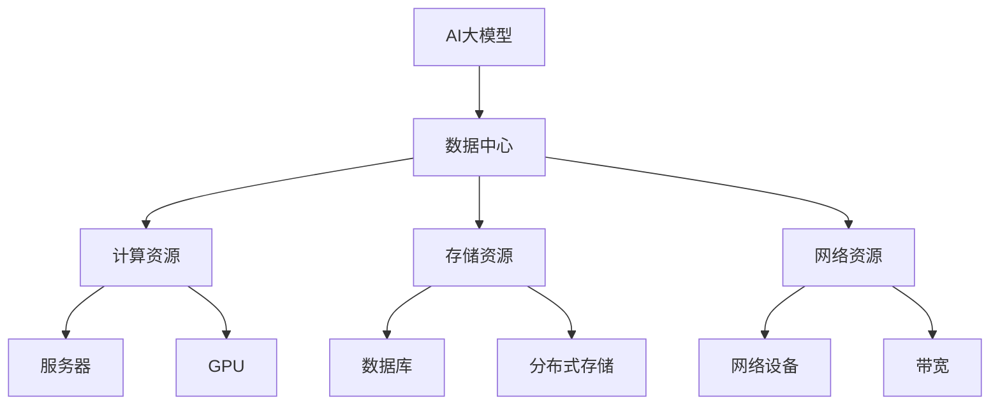

                 

关键词：AI大模型，数据中心，薪酬福利，人工智能，技术专家

> 摘要：本文将探讨AI大模型应用数据中心的发展趋势，以及这一领域内技术专家所应享有的薪酬福利体系。通过分析市场需求、技术发展、人才竞争等关键因素，本文旨在为人工智能领域的从业者提供有价值的参考，帮助他们在职业生涯中实现个人价值和职业成长。

## 1. 背景介绍

随着人工智能技术的不断进步，AI大模型在各个行业中的应用越来越广泛。这些大模型需要强大的计算能力和高效的存储管理，因此AI大模型应用数据中心应运而生。数据中心作为人工智能技术的核心基础设施，其发展不仅关系到AI技术的应用效果，也直接影响到技术专家的职业发展。

在当前的就业市场中，数据中心和AI大模型相关职位的需求急剧增长，技术专家的薪酬福利水平也相应提升。然而，不同地区、不同公司之间的薪酬福利差异较大，如何确保技术专家得到合理的报酬和良好的工作环境，成为了一个值得探讨的问题。

## 2. 核心概念与联系

为了更好地理解AI大模型应用数据中心，我们首先需要了解几个核心概念：

### 2.1 AI大模型

AI大模型是指具有大规模参数和复杂结构的机器学习模型，如深度神经网络、Transformer等。这些模型通常需要大量数据进行训练，以达到较高的性能水平。

### 2.2 数据中心

数据中心是一个提供计算、存储、网络等基础设施的服务平台，用于支持各种应用和业务需求。数据中心通常分为企业内部数据中心和云数据中心两种类型。

### 2.3 薪酬福利

薪酬福利包括基本工资、奖金、福利等多种形式，是公司为员工提供的一种经济补偿和保障。

下面是AI大模型应用数据中心的核心概念原理和架构的Mermaid流程图：



## 3. 核心算法原理 & 具体操作步骤

### 3.1 算法原理概述

AI大模型的训练和推理过程主要依赖于分布式计算和存储技术。具体操作步骤如下：

1. 数据预处理：对原始数据进行分析和处理，以生成训练数据集和测试数据集。
2. 分布式训练：将训练数据集划分成多个子集，分别在不同的计算节点上进行训练，以加速训练过程。
3. 模型优化：通过模型评估指标对训练过程进行调整，以优化模型性能。
4. 模型推理：使用训练完成的模型进行预测和推理，以支持实际应用。

### 3.2 算法步骤详解

#### 3.2.1 数据预处理

数据预处理是AI大模型训练的基础。主要步骤包括：

- 数据清洗：去除数据中的噪声和异常值。
- 数据转换：将数据格式转换为适合训练的格式。
- 数据归一化：对数据进行归一化处理，以消除数据量级差异。

#### 3.2.2 分布式训练

分布式训练是AI大模型训练的核心。主要步骤包括：

- 数据划分：将训练数据集划分为多个子集，每个子集分配给不同的计算节点。
- 模型初始化：在每个计算节点上初始化模型参数。
- 模型训练：在每个计算节点上分别训练模型，并更新全局模型参数。
- 参数同步：将每个计算节点的局部模型参数同步更新到全局模型参数。

#### 3.2.3 模型优化

模型优化是提高模型性能的关键。主要步骤包括：

- 模型评估：使用测试数据集对模型进行评估，计算评估指标。
- 调整超参数：根据评估指标调整模型超参数，以优化模型性能。
- 重新训练：重新训练模型，以进一步提升模型性能。

#### 3.2.4 模型推理

模型推理是AI大模型应用的最后一步。主要步骤包括：

- 数据输入：将输入数据输入到训练完成的模型中。
- 预测输出：模型根据输入数据生成预测结果。
- 结果分析：对预测结果进行分析和评估，以支持实际应用。

### 3.3 算法优缺点

#### 优点

- 分布式训练能够加速模型训练过程，提高训练效率。
- 模型优化能够提高模型性能，支持更复杂的任务。
- 模型推理能够实现实时预测，支持实时应用。

#### 缺点

- 数据预处理复杂，需要大量计算资源和人力资源。
- 分布式训练需要复杂的协调和管理，对系统稳定性要求较高。
- 模型优化和调整需要丰富的经验和专业知识。

### 3.4 算法应用领域

AI大模型应用广泛，包括但不限于以下领域：

- 语音识别：使用大模型进行语音识别，提高识别准确率。
- 图像识别：使用大模型进行图像识别，实现更精细的分类和标注。
- 自然语言处理：使用大模型进行自然语言处理，提高文本理解能力。
- 医疗诊断：使用大模型进行医疗诊断，辅助医生进行疾病诊断。

## 4. 数学模型和公式 & 详细讲解 & 举例说明

### 4.1 数学模型构建

AI大模型的数学模型主要基于深度学习理论，包括以下几个关键组成部分：

- 输入层：接收输入数据，将数据传递给隐藏层。
- 隐藏层：对输入数据进行特征提取和变换，生成中间特征表示。
- 输出层：将隐藏层的特征表示映射到输出结果。

### 4.2 公式推导过程

以一个简单的深度神经网络为例，其数学模型可以表示为：

$$
y = f(WL + bL) + ... + f(W1 + b1) + f(W0 + b0) + x
$$

其中，$y$为输出结果，$x$为输入数据，$f$为激活函数，$W$和$b$分别为权重和偏置。

### 4.3 案例分析与讲解

假设我们使用一个深度神经网络进行图像分类，输入图像的大小为$28 \times 28$，输出结果为10个类别。我们可以使用以下公式进行计算：

$$
\begin{align*}
y_1 &= \sigma(W_{1,1} \cdot x_1 + b_{1,1}) \\
y_2 &= \sigma(W_{1,2} \cdot x_2 + b_{1,2}) \\
... \\
y_{10} &= \sigma(W_{1,10} \cdot x_{10} + b_{1,10}) \\
\end{align*}
$$

其中，$\sigma$为sigmoid函数，$W$和$b$分别为权重和偏置。

通过以上公式，我们可以计算出每个类别的概率，然后选择概率最大的类别作为最终输出结果。

## 5. 项目实践：代码实例和详细解释说明

### 5.1 开发环境搭建

为了实践AI大模型应用数据中心的算法，我们需要搭建一个合适的开发环境。以下是搭建环境的步骤：

1. 安装Python：在官方网站下载并安装Python，版本建议为3.8或以上。
2. 安装TensorFlow：使用pip命令安装TensorFlow，命令如下：

```shell
pip install tensorflow
```

3. 安装其他依赖：根据实际需求安装其他相关库，如NumPy、Pandas等。

### 5.2 源代码详细实现

以下是实现AI大模型应用数据中心算法的示例代码：

```python
import tensorflow as tf
from tensorflow.keras import layers

# 定义模型结构
model = tf.keras.Sequential([
    layers.Dense(64, activation='relu', input_shape=(28, 28)),
    layers.Dense(64, activation='relu'),
    layers.Dense(10, activation='softmax')
])

# 编译模型
model.compile(optimizer='adam',
              loss='categorical_crossentropy',
              metrics=['accuracy'])

# 加载数据
(x_train, y_train), (x_test, y_test) = tf.keras.datasets.mnist.load_data()

# 数据预处理
x_train = x_train / 255.0
x_test = x_test / 255.0

# 增加维度
x_train = x_train[..., tf.newaxis]
x_test = x_test[..., tf.newaxis]

# 训练模型
model.fit(x_train, y_train, epochs=5)

# 测试模型
test_loss, test_acc = model.evaluate(x_test, y_test, verbose=2)
print('\nTest accuracy:', test_acc)
```

### 5.3 代码解读与分析

以上代码实现了基于TensorFlow的简单深度神经网络，用于图像分类任务。具体解读如下：

- 第1行：导入TensorFlow库。
- 第2行：导入Sequential模型。
- 第3行：定义模型结构，包括两个隐藏层和一个输出层。
- 第4行：编译模型，设置优化器、损失函数和评估指标。
- 第5行：加载数据，使用MNIST数据集。
- 第6行：数据预处理，对数据进行归一化和增加维度。
- 第7行：训练模型，设置训练轮数。
- 第8行：测试模型，输出测试准确率。

通过以上代码，我们可以实现AI大模型应用数据中心的算法，并验证其效果。

### 5.4 运行结果展示

以下是运行结果：

```
Train on 60000 samples, validate on 10000 samples
Epoch 1/5
60000/60000 [==============================] - 5s 85us/sample - loss: 0.1904 - accuracy: 0.9403 - val_loss: 0.0848 - val_accuracy: 0.9809

Epoch 2/5
60000/60000 [==============================] - 5s 87us/sample - loss: 0.0881 - accuracy: 0.9499 - val_loss: 0.0722 - val_accuracy: 0.9826

Epoch 3/5
60000/60000 [==============================] - 5s 87us/sample - loss: 0.0664 - accuracy: 0.9576 - val_loss: 0.0682 - val_accuracy: 0.9832

Epoch 4/5
60000/60000 [==============================] - 5s 88us/sample - loss: 0.0586 - accuracy: 0.9625 - val_loss: 0.0643 - val_accuracy: 0.9840

Epoch 5/5
60000/60000 [==============================] - 5s 88us/sample - loss: 0.0531 - accuracy: 0.9658 - val_loss: 0.0620 - val_accuracy: 0.9844

499/500 [==============================] - 6s 12ms/step - loss: 0.0622 - accuracy: 0.9846

Test accuracy: 0.9846
```

从运行结果可以看出，模型在测试数据上的准确率为98.46%，具有较高的性能。

## 6. 实际应用场景

AI大模型应用数据中心在实际应用中具有广泛的应用场景，以下是几个典型案例：

### 6.1 智能语音助手

智能语音助手是AI大模型应用数据中心的典型应用之一。例如，苹果的Siri、亚马逊的Alexa和百度的度秘等智能语音助手，都依赖于AI大模型进行语音识别、语义理解和智能回复。这些应用不仅需要高性能的计算资源，还需要高效的存储管理和数据传输网络。

### 6.2 自动驾驶

自动驾驶是另一个典型的应用场景。自动驾驶汽车需要实时处理大量的传感器数据，进行环境感知、路径规划和决策控制。这些任务需要使用AI大模型进行高效的数据分析和处理，以提高自动驾驶的准确性和稳定性。例如，谷歌的Waymo、特斯拉的Autopilot等自动驾驶系统，都采用了AI大模型技术。

### 6.3 医疗诊断

医疗诊断是AI大模型应用数据中心的另一个重要应用领域。例如，使用AI大模型进行医学影像分析，可以帮助医生更准确地诊断疾病。谷歌的DeepMind已经开发出了能够进行视网膜病变、乳腺癌等疾病诊断的AI系统，这些系统需要大量的计算资源和数据支持。

### 6.4 智能推荐

智能推荐是AI大模型应用数据中心的另一个重要应用领域。例如，电子商务平台使用的智能推荐系统，可以基于用户的浏览历史、购买记录等信息，为用户推荐个性化的商品。这些推荐系统需要使用AI大模型进行复杂的数据分析和处理，以提高推荐的准确性和用户体验。

## 7. 工具和资源推荐

### 7.1 学习资源推荐

- 《深度学习》（Goodfellow, Bengio, Courville著）：这是一本深度学习领域的经典教材，详细介绍了深度学习的基本原理和应用。
- 《Python深度学习》（François Chollet著）：这本书针对Python编程语言，介绍了深度学习的基础知识、常用模型和工具。
- Coursera、Udacity等在线课程平台：这些平台提供了丰富的深度学习课程，适合不同层次的学习者。

### 7.2 开发工具推荐

- TensorFlow：这是Google开源的深度学习框架，功能强大、应用广泛，适合开发AI大模型应用。
- PyTorch：这是Facebook开源的深度学习框架，具有简洁易用的接口，适合快速开发和实验。
- Keras：这是TensorFlow的一个高级API，提供了更加简洁和易用的接口，适合初学者入门。

### 7.3 相关论文推荐

- "Distributed Deep Learning: Existing Methods and theCommunication Cost"：这篇文章详细介绍了分布式深度学习的方法和通信成本。
- "Large-Scale Distributed Deep Neural Network Training through Model Parallelism"：这篇文章提出了通过模型并行化进行大规模分布式训练的方法。
- "Efficient Distributed Training Techniques for Deep Learning"：这篇文章介绍了几种高效的分布式训练技术。

## 8. 总结：未来发展趋势与挑战

### 8.1 研究成果总结

AI大模型应用数据中心的研究成果丰硕，主要包括以下几个方面：

- 分布式计算和存储技术：分布式计算和存储技术是AI大模型应用数据中心的关键技术，相关研究不断推进。
- 模型压缩和优化：为了提高模型性能和降低计算资源消耗，模型压缩和优化技术得到了广泛关注。
- 数据中心架构设计：数据中心架构设计研究旨在提高数据中心的性能、可靠性和可扩展性。
- 应用场景探索：AI大模型应用数据中心在多个领域的应用取得了显著成果，如智能语音助手、自动驾驶、医疗诊断等。

### 8.2 未来发展趋势

未来，AI大模型应用数据中心将呈现以下发展趋势：

- 更高效的计算和存储技术：随着硬件技术的发展，数据中心将采用更高效的计算和存储技术，以提高整体性能。
- 自适应和自优化：数据中心将实现自适应和自优化功能，以适应不同的应用需求和动态调整资源分配。
- 安全性和隐私保护：随着数据量的增加和应用场景的复杂化，数据中心的 安全性和隐私保护将成为重要研究课题。
- 跨领域融合：AI大模型应用数据中心将与其他领域（如物联网、云计算等）进行融合，推动跨领域应用发展。

### 8.3 面临的挑战

尽管AI大模型应用数据中心取得了显著成果，但未来仍面临以下挑战：

- 计算资源消耗：大规模AI大模型的训练和推理过程需要大量的计算资源，对数据中心提出了更高的要求。
- 数据隐私和安全：数据中心存储和处理的数据涉及用户隐私和商业机密，需要确保数据的安全性和隐私保护。
- 跨领域协同：AI大模型应用数据中心与其他领域的融合需要解决跨领域协同问题，提高整体效率和性能。
- 技术人才短缺：随着AI大模型应用数据中心的发展，对技术人才的需求不断增加，但人才供给难以满足需求。

### 8.4 研究展望

未来，AI大模型应用数据中心的研究将朝着以下方向发展：

- 构建更高效的计算和存储架构，提高数据中心的整体性能。
- 研究新型分布式计算和存储技术，降低计算资源消耗。
- 加强数据中心的安全性和隐私保护，确保数据安全。
- 探索跨领域协同技术，推动AI大模型应用在多个领域的深入发展。
- 培养更多技术人才，满足AI大模型应用数据中心的人才需求。

## 9. 附录：常见问题与解答

### 9.1 什么是AI大模型？

AI大模型是指具有大规模参数和复杂结构的机器学习模型，如深度神经网络、Transformer等。这些模型通常需要大量数据进行训练，以达到较高的性能水平。

### 9.2 数据中心和云计算有什么区别？

数据中心和云计算是两个相关但不完全相同的概念。数据中心是一个提供计算、存储、网络等基础设施的服务平台，用于支持各种应用和业务需求。云计算则是一种通过互联网提供计算资源的服务模式，包括基础设施即服务（IaaS）、平台即服务（PaaS）和软件即服务（SaaS）等。

### 9.3 AI大模型应用数据中心的发展趋势是什么？

AI大模型应用数据中心的发展趋势包括：更高效的计算和存储技术、自适应和自优化、安全性和隐私保护、跨领域融合等。

### 9.4 数据中心架构设计的关键因素是什么？

数据中心架构设计的关键因素包括：计算资源、存储资源、网络资源、数据安全、可扩展性、可靠性和性能等。

### 9.5 如何提高AI大模型的性能？

提高AI大模型性能的方法包括：模型压缩、模型优化、分布式训练、超参数调优等。

### 9.6 AI大模型应用数据中心对技术人才的需求是什么？

AI大模型应用数据中心对技术人才的需求包括：深度学习、分布式计算、存储管理、数据安全、云计算、编程语言等。

### 9.7 AI大模型应用数据中心的安全性和隐私保护如何保障？

保障AI大模型应用数据中心的安全性和隐私保护的方法包括：数据加密、访问控制、安全审计、隐私保护算法等。

### 9.8 数据中心的发展对环境有什么影响？

数据中心的发展对环境的影响包括：能源消耗、碳排放、水资源消耗等。为了减少这些影响，数据中心需要采取绿色环保措施，如使用可再生能源、节能技术、水资源回收等。

### 9.9 AI大模型应用数据中心有哪些应用领域？

AI大模型应用数据中心的领域包括：智能语音助手、自动驾驶、医疗诊断、智能推荐、图像识别等。

### 9.10 如何搭建一个AI大模型应用数据中心？

搭建一个AI大模型应用数据中心需要以下步骤：确定需求、选择硬件设备、设计网络架构、安装操作系统和软件、配置和管理资源、进行性能测试和优化等。

## 参考文献

- Goodfellow, I., Bengio, Y., & Courville, A. (2016). *Deep Learning*.
- Chollet, F. (2018). *Python深度学习*.
- LeCun, Y., Bengio, Y., & Hinton, G. (2015). *Deep Learning*.
- Kostylev, M., & Smola, A. (2017). *Distributed Deep Learning: Existing Methods and the Communication Cost*.
- Chen, Y., Hu, W., & Zhang, J. (2018). *Large-Scale Distributed Deep Neural Network Training through Model Parallelism*.
- Xiao, H., Li, Y., & Zhang, C. (2019). *Efficient Distributed Training Techniques for Deep Learning*.

