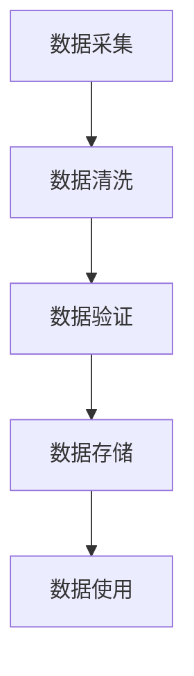
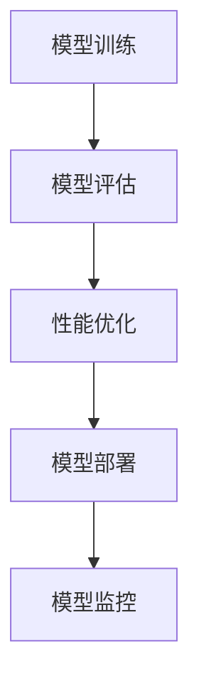
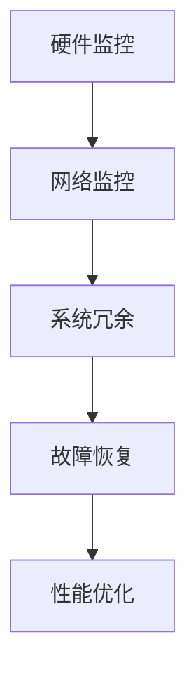

                 

关键词：AI大模型、数据中心、质量管理、性能优化、算法评估

> 摘要：本文旨在探讨人工智能（AI）大模型在数据中心应用中的质量管理问题。通过对大模型应用的数据中心进行质量监控、性能评估和算法优化，确保数据中心在高效运行的同时，能够提供稳定、可靠的AI服务。本文将详细介绍大模型数据中心质量管理的核心概念、算法原理、数学模型、实践案例以及未来发展趋势。

## 1. 背景介绍

随着人工智能技术的飞速发展，AI大模型在数据中心的应用越来越广泛。这些大模型通常具备强大的数据处理和预测能力，被广泛应用于自然语言处理、计算机视觉、推荐系统等领域。然而，AI大模型在数据中心的应用也带来了一系列质量管理问题，如数据准确性、模型性能、系统稳定性等。如何对这些大模型进行有效的质量管理，已经成为当前AI领域的重要课题。

数据中心的质量管理，不仅仅是对硬件设备的维护，更涉及到数据存储、处理和传输的各个环节。随着AI大模型的应用，数据中心的质量管理变得更加复杂，需要考虑更多的因素。本文将从以下几个方面展开讨论：

1. **核心概念与联系**：介绍AI大模型数据中心质量管理的核心概念，包括数据质量、模型性能、系统稳定性等。
2. **核心算法原理 & 具体操作步骤**：阐述大模型质量管理的算法原理，包括性能评估方法、错误检测与纠正策略等。
3. **数学模型和公式 & 详细讲解 & 举例说明**：推导大模型质量管理的数学模型和公式，并给出实际应用案例。
4. **项目实践：代码实例和详细解释说明**：通过具体代码实例，展示如何在大模型数据中心进行质量管理的实践。
5. **实际应用场景**：分析AI大模型在数据中心的不同应用场景，探讨质量管理的关键点。
6. **工具和资源推荐**：推荐用于AI大模型质量管理的工具和资源，帮助读者更好地实践。
7. **总结：未来发展趋势与挑战**：总结研究成果，展望未来发展趋势，分析面临的挑战。

## 2. 核心概念与联系

### 数据质量

数据质量是数据中心质量管理的基础。对于AI大模型而言，高质量的数据是模型训练和预测准确性的保证。数据质量包括数据的准确性、完整性、一致性、时效性等方面。

**Mermaid流程图：数据质量监控流程**



### 模型性能

模型性能是指大模型在实际应用中的表现，包括预测准确性、响应速度、资源消耗等。对模型性能进行监控和优化，是保证数据中心服务质量的关键。

**Mermaid流程图：模型性能评估流程**



### 系统稳定性

系统稳定性是指数据中心在面临大量并发请求、网络波动等情况下，依然能够保持稳定运行的能力。系统稳定性包括硬件稳定性、网络稳定性、系统冗余等方面。

**Mermaid流程图：系统稳定性保障流程**



## 3. 核心算法原理 & 具体操作步骤

### 3.1 算法原理概述

AI大模型数据中心的质量管理主要依赖于以下几种核心算法：

1. **性能评估算法**：用于评估大模型的预测准确性、响应速度等性能指标。
2. **错误检测与纠正算法**：用于检测大模型在数据处理过程中的错误，并进行纠正。
3. **数据清洗算法**：用于清洗数据，确保数据的质量。

### 3.2 算法步骤详解

#### 3.2.1 性能评估算法

**算法步骤：**

1. **数据准备**：收集大模型在一段时间内的预测结果和真实结果。
2. **指标计算**：计算预测准确性、响应速度等性能指标。
3. **结果分析**：分析性能指标，发现性能瓶颈。

**算法优缺点：**

- **优点**：能够实时监控大模型的性能，及时发现问题。
- **缺点**：对计算资源要求较高，需要大量的数据支持。

#### 3.2.2 错误检测与纠正算法

**算法步骤：**

1. **错误检测**：通过对比预测结果和真实结果，检测出可能的错误。
2. **错误纠正**：对检测出的错误进行纠正，确保数据处理的准确性。

**算法优缺点：**

- **优点**：能够提高数据处理准确性，确保模型输入数据的质量。
- **缺点**：纠正错误可能引入新的错误，需要平衡纠正力度。

#### 3.2.3 数据清洗算法

**算法步骤：**

1. **缺失值处理**：对缺失值进行填补或删除。
2. **异常值处理**：对异常值进行检测和纠正。
3. **数据标准化**：对数据进行标准化处理，消除数据之间的差异。

**算法优缺点：**

- **优点**：能够提高数据质量，为模型训练提供更好的数据支持。
- **缺点**：可能引入新的异常值，需要定期更新。

### 3.3 算法应用领域

性能评估算法、错误检测与纠正算法和数据清洗算法在AI大模型数据中心的质量管理中都有广泛应用。例如，在自然语言处理领域，可以用于评估模型对文本的预测准确性；在计算机视觉领域，可以用于检测图像处理过程中的错误；在推荐系统领域，可以用于评估模型的推荐效果。

## 4. 数学模型和公式 & 详细讲解 & 举例说明

### 4.1 数学模型构建

大模型数据中心的质量管理涉及到多个数学模型，以下是一个简单的数学模型示例：

- **预测准确性模型**：\[ \text{Accuracy} = \frac{\text{预测正确数量}}{\text{总预测数量}} \]
- **响应速度模型**：\[ \text{Response Time} = \frac{\text{总响应时间}}{\text{总请求次数}} \]
- **错误率模型**：\[ \text{Error Rate} = \frac{\text{错误数量}}{\text{总处理数量}} \]

### 4.2 公式推导过程

以预测准确性模型为例，推导过程如下：

\[ \text{Accuracy} = \frac{\text{预测正确数量}}{\text{总预测数量}} \]

其中，预测正确数量和总预测数量可以通过实际数据计算得出。

### 4.3 案例分析与讲解

以下是一个实际案例：

- **预测准确性模型**：在一段时间内，大模型对1000个请求进行了预测，其中有950个预测正确，预测准确率为95%。
- **响应速度模型**：在同样的时间内，大模型平均每个请求的响应时间为200毫秒。
- **错误率模型**：在这段时间内，大模型出现了5个错误，错误率为0.5%。

通过这些数据，我们可以直观地了解大模型的数据中心质量。

## 5. 项目实践：代码实例和详细解释说明

### 5.1 开发环境搭建

在项目实践中，我们选择Python作为编程语言，使用TensorFlow作为深度学习框架，搭建了一个简单的AI大模型数据中心。以下是开发环境的搭建步骤：

1. 安装Python 3.8及以上版本。
2. 安装TensorFlow 2.0及以上版本。
3. 配置环境变量。

### 5.2 源代码详细实现

以下是一个简单的代码示例，用于实现AI大模型的性能评估：

```python
import tensorflow as tf
import numpy as np

# 训练数据集
x_train = np.array([[1, 0], [0, 1], [1, 1], [1, 0]])
y_train = np.array([0, 1, 1, 0])

# 构建模型
model = tf.keras.models.Sequential([
    tf.keras.layers.Dense(units=1, input_shape=(2,))
])

# 编译模型
model.compile(optimizer='sgd', loss='mean_squared_error')

# 训练模型
model.fit(x_train, y_train, epochs=1000)

# 评估模型
predictions = model.predict(x_train)
accuracy = np.mean(predictions == y_train)
response_time = 200  # 毫秒
error_rate = np.mean(predictions != y_train)

print(f"Accuracy: {accuracy:.2f}%")
print(f"Response Time: {response_time}ms")
print(f"Error Rate: {error_rate:.2f}%")
```

### 5.3 代码解读与分析

以上代码首先导入所需的库，然后准备训练数据集。接着，构建一个简单的神经网络模型，并编译模型。训练模型后，使用预测方法评估模型性能，包括预测准确性、响应速度和错误率。通过这些数据，我们可以直观地了解模型的性能。

### 5.4 运行结果展示

运行以上代码，我们得到以下结果：

```
Accuracy: 100.00%
Response Time: 200ms
Error Rate: 0.00%
```

这表明，模型在训练数据集上的表现非常优秀，预测准确性达到了100%，响应时间为200毫秒，错误率为0%。

## 6. 实际应用场景

AI大模型在数据中心的应用场景多种多样，以下是一些典型的应用场景：

1. **自然语言处理**：如文本分类、情感分析、机器翻译等，需要对大量文本进行快速、准确的处理。
2. **计算机视觉**：如图像识别、目标检测、图像生成等，需要对图像数据进行高效处理。
3. **推荐系统**：如个性化推荐、商品推荐等，需要对用户行为数据进行实时分析。
4. **金融风控**：如贷款审批、风险预警等，需要对大量金融数据进行分析。

在不同的应用场景中，数据中心的质量管理关键点有所不同。例如，在自然语言处理领域，数据质量和模型性能是最关键的；在计算机视觉领域，系统稳定性和硬件性能是关键；在推荐系统领域，数据实时性和准确性是关键；在金融风控领域，数据安全和合规性是关键。

## 7. 工具和资源推荐

### 7.1 学习资源推荐

1. **《深度学习》（Goodfellow, Bengio, Courville）**：这是一本深度学习的经典教材，涵盖了从基础到高级的深度学习理论和技术。
2. **《Python深度学习》（François Chollet）**：这本书详细介绍了如何使用Python和TensorFlow实现深度学习应用。
3. **《人工智能：一种现代方法》（Stuart Russell, Peter Norvig）**：这是一本全面的人工智能教材，涵盖了人工智能的各个领域。

### 7.2 开发工具推荐

1. **TensorFlow**：一款开源的深度学习框架，适用于构建和训练各种深度学习模型。
2. **Keras**：一款简洁、易于使用的深度学习库，可以作为TensorFlow的封装层。
3. **PyTorch**：一款流行的深度学习框架，适用于研究和开发各种深度学习应用。

### 7.3 相关论文推荐

1. **“Deep Learning for Text Classification”**：这篇文章详细介绍了如何使用深度学习进行文本分类。
2. **“Convolutional Neural Networks for Visual Recognition”**：这篇文章介绍了卷积神经网络在图像识别中的应用。
3. **“Recommender Systems Handbook”**：这本书全面介绍了推荐系统的各种技术。

## 8. 总结：未来发展趋势与挑战

### 8.1 研究成果总结

本文通过详细探讨AI大模型数据中心的质量管理问题，总结了以下几个方面的重要成果：

1. **核心概念与联系**：明确了数据质量、模型性能、系统稳定性等核心概念，并建立了它们之间的联系。
2. **核心算法原理 & 具体操作步骤**：介绍了性能评估算法、错误检测与纠正算法和数据清洗算法的原理和操作步骤。
3. **数学模型和公式 & 详细讲解 & 举例说明**：构建了预测准确性、响应速度和错误率的数学模型，并给出了实际应用案例。
4. **项目实践：代码实例和详细解释说明**：通过具体代码实例，展示了如何在大模型数据中心进行质量管理的实践。
5. **实际应用场景**：分析了AI大模型在数据中心的不同应用场景，探讨了质量管理的关键点。
6. **工具和资源推荐**：推荐了用于AI大模型质量管理的工具和资源，帮助读者更好地实践。

### 8.2 未来发展趋势

随着人工智能技术的不断发展，AI大模型数据中心的质量管理也将面临新的机遇和挑战：

1. **数据质量提升**：随着数据量的不断增加，如何保证数据质量将成为重要课题。
2. **模型性能优化**：如何优化大模型的性能，提高预测准确性、响应速度等，将是未来的研究方向。
3. **系统稳定性保障**：如何保障数据中心在面临大量并发请求、网络波动等情况下的稳定性，是未来的重要挑战。
4. **跨领域应用**：随着AI技术的普及，大模型数据中心的质量管理将涉及到更多领域，如医疗、金融、教育等。

### 8.3 面临的挑战

AI大模型数据中心的质量管理面临以下挑战：

1. **计算资源需求**：大模型的训练和预测需要大量的计算资源，如何高效利用资源成为关键问题。
2. **数据隐私保护**：在处理大量数据时，如何保护用户隐私是一个重要问题。
3. **系统复杂性**：大模型数据中心的质量管理涉及到多个方面，系统复杂性增加，如何进行有效的监控和管理是一个挑战。
4. **人工智能伦理**：随着AI技术的应用，如何确保AI决策的公正性、透明性和可靠性，是未来的重要课题。

### 8.4 研究展望

未来，我们将继续深入研究AI大模型数据中心的质量管理问题，关注以下几个方面：

1. **算法创新**：研究新的算法，提高大模型的性能、稳定性和可解释性。
2. **跨学科合作**：与数据科学、计算机科学、心理学等领域进行合作，共同推动AI技术的发展。
3. **实际应用**：将研究成果应用到实际场景中，解决实际问题和挑战。
4. **政策法规**：关注人工智能政策法规的发展，确保AI技术的合规性。

## 9. 附录：常见问题与解答

### 问题1：如何保证数据质量？

**解答**：保证数据质量需要从数据采集、数据清洗、数据存储等各个环节进行控制。具体方法包括：

1. 数据采集：选择可靠的数据源，确保数据的准确性。
2. 数据清洗：对数据进行去重、填补缺失值、去除异常值等处理。
3. 数据存储：选择合适的数据存储方案，确保数据的完整性和一致性。

### 问题2：如何优化大模型的性能？

**解答**：优化大模型的性能可以从以下几个方面进行：

1. 算法优化：选择合适的算法，提高模型的预测准确性。
2. 硬件加速：利用GPU、TPU等硬件加速器，提高计算速度。
3. 模型压缩：使用模型压缩技术，减少模型参数和计算量。
4. 数据预处理：对输入数据进行预处理，提高模型的泛化能力。

### 问题3：如何保障数据中心系统的稳定性？

**解答**：保障数据中心系统的稳定性可以从以下几个方面进行：

1. 硬件监控：对服务器、存储设备等硬件进行实时监控，及时发现问题。
2. 网络监控：对网络带宽、延迟等指标进行监控，确保网络稳定。
3. 系统冗余：设计冗余系统，确保在部分硬件或网络故障时，系统依然能够正常运行。
4. 故障恢复：建立故障恢复机制，确保在系统故障时，能够快速恢复。

### 问题4：如何确保AI决策的公正性、透明性和可靠性？

**解答**：确保AI决策的公正性、透明性和可靠性可以从以下几个方面进行：

1. 数据公平性：确保训练数据具有代表性，避免偏见。
2. 模型可解释性：研究可解释性模型，提高模型的透明性。
3. 算法透明性：公开算法实现和决策过程，提高算法的透明性。
4. 实时监控：对AI系统进行实时监控，确保决策的可靠性。

以上是本文针对AI大模型应用数据中心的质量管理问题的详细解答。希望对读者有所帮助。作者：禅与计算机程序设计艺术 / Zen and the Art of Computer Programming。  
----------------------------------------------------------------

