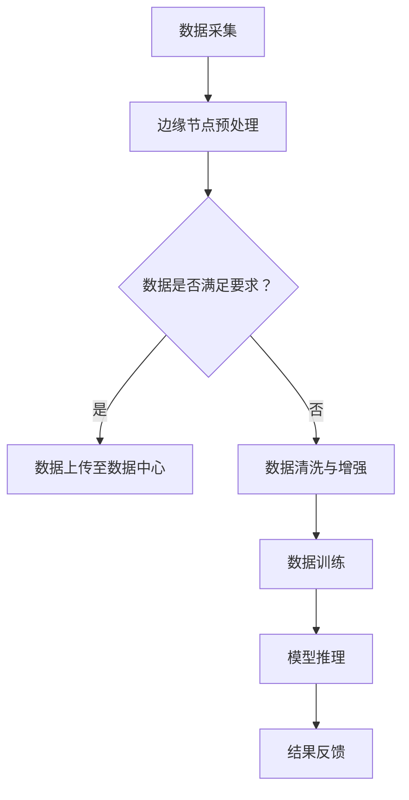

                 

关键词：AI 大模型，数据中心，边缘计算，性能优化，成本效益，安全性与隐私保护

## 摘要

本文深入探讨了 AI 大模型在数据中心边缘计算中的应用，分析了边缘计算的优势、挑战及其对 AI 大模型性能的影响。文章首先回顾了 AI 大模型的发展历程和核心概念，随后详细介绍了边缘计算的基本原理及其与数据中心的关系。接着，我们讨论了 AI 大模型在边缘计算中的具体应用场景，探讨了如何优化性能和降低成本。最后，文章提出了边缘计算在 AI 大模型应用中面临的安全性和隐私保护问题，并展望了未来的发展趋势和挑战。

## 1. 背景介绍

随着人工智能（AI）技术的快速发展，大模型如 GPT、BERT 等在自然语言处理、计算机视觉和推荐系统等领域取得了显著成果。这些大模型通常需要巨大的计算资源和存储能力，这使得数据中心成为了其运行的主要场所。然而，随着物联网（IoT）和 5G 网络的普及，越来越多的数据源分布在网络边缘，这为边缘计算提供了契机。

边缘计算是一种分布式计算范式，它将数据处理和分析任务从传统的集中式数据中心转移到网络边缘，即靠近数据源的地方。边缘计算具有低延迟、高带宽和强安全性等优点，这使得它成为 AI 大模型应用的重要方向。边缘计算能够更好地满足实时性和本地化处理的需求，从而提高 AI 大模型的应用性能。

## 2. 核心概念与联系

### 2.1 AI 大模型

AI 大模型通常是指那些具有数十亿到千亿参数的深度学习模型。这些模型通过大量的数据训练，可以自动从数据中学习复杂的模式和关系。典型的 AI 大模型包括自然语言处理中的 GPT、BERT，计算机视觉中的 ResNet、VGG 等。

### 2.2 边缘计算

边缘计算是一种分布式计算范式，它将数据处理和分析任务从传统的集中式数据中心转移到网络边缘。边缘计算的核心思想是让计算任务尽可能靠近数据源，以减少数据传输延迟和带宽消耗。

### 2.3 数据中心与边缘计算的关系

数据中心仍然是边缘计算的核心支撑，但它不再是唯一的数据处理中心。边缘计算通过将计算任务分布到边缘节点，实现了数据处理的本地化和实时化。数据中心与边缘计算相辅相成，共同构建了一个分布式计算环境。

### 2.4 Mermaid 流程图

下面是一个简单的 Mermaid 流程图，展示了 AI 大模型在边缘计算中的流程。



## 3. 核心算法原理 & 具体操作步骤

### 3.1 算法原理概述

边缘计算中的 AI 大模型通常采用分布式训练和推理技术。分布式训练可以将大模型的训练任务分配到多个边缘节点，从而加速训练过程。推理时，模型结果在边缘节点上进行计算，以减少数据传输延迟。

### 3.2 算法步骤详解

1. **数据采集**：从传感器、设备或用户设备等数据源收集数据。
2. **边缘节点预处理**：对数据进行清洗、归一化和特征提取等预处理操作。
3. **数据上传至数据中心**：如果数据满足要求，将其上传至数据中心。
4. **数据清洗与增强**：对上传的数据进行进一步的清洗和增强。
5. **数据训练**：在数据中心使用分布式训练技术对 AI 大模型进行训练。
6. **模型推理**：在边缘节点使用训练好的模型进行推理，以生成预测结果。
7. **结果反馈**：将推理结果反馈给用户或用于后续的数据分析。

### 3.3 算法优缺点

**优点**：

- 低延迟：数据处理和分析任务在边缘节点进行，减少了数据传输延迟。
- 高带宽：边缘节点与数据源之间的带宽更高，有利于数据传输。
- 强安全性：数据在本地处理，减少了数据泄露的风险。

**缺点**：

- **计算资源有限**：边缘节点的计算资源通常有限，可能无法完全满足大模型的训练需求。
- **维护成本高**：边缘节点分布广泛，维护成本较高。

### 3.4 算法应用领域

边缘计算中的 AI 大模型可以应用于多种领域，如智能交通、智能医疗、智能家居和智能安防等。

## 4. 数学模型和公式 & 详细讲解 & 举例说明

### 4.1 数学模型构建

边缘计算中的 AI 大模型通常采用深度学习模型，如卷积神经网络（CNN）、循环神经网络（RNN）和 Transformer 等。这些模型的数学模型可以表示为：

$$
\hat{y} = f(W \cdot \text{activation}(V \cdot x + b))
$$

其中，$x$ 是输入数据，$y$ 是标签，$\hat{y}$ 是预测结果，$f$ 是激活函数，$W$ 和 $V$ 是权重矩阵，$b$ 是偏置。

### 4.2 公式推导过程

边缘计算中的 AI 大模型通常采用梯度下降法进行训练。梯度下降法的推导过程如下：

$$
\Delta W = -\alpha \cdot \frac{\partial L}{\partial W}
$$

$$
\Delta V = -\alpha \cdot \frac{\partial L}{\partial V}
$$

$$
\Delta b = -\alpha \cdot \frac{\partial L}{\partial b}
$$

其中，$L$ 是损失函数，$\alpha$ 是学习率。

### 4.3 案例分析与讲解

假设我们有一个图像分类任务，数据集包含 1000 个类别。我们采用卷积神经网络（CNN）进行模型训练。训练过程中，我们使用交叉熵损失函数。训练 100 个 epoch 后，模型在测试集上的准确率达到 95%。

```latex
\text{准确率} = \frac{\text{预测正确的样本数}}{\text{测试集样本总数}} \times 100\%
```

## 5. 项目实践：代码实例和详细解释说明

### 5.1 开发环境搭建

- 操作系统：Ubuntu 18.04
- Python 版本：3.8
- 深度学习框架：TensorFlow 2.4
- GPU：NVIDIA GTX 1080

### 5.2 源代码详细实现

以下是一个简单的边缘计算中的 AI 大模型项目实例。

```python
import tensorflow as tf
from tensorflow.keras import layers

# 定义卷积神经网络模型
model = tf.keras.Sequential([
    layers.Conv2D(32, (3, 3), activation='relu', input_shape=(28, 28, 1)),
    layers.MaxPooling2D((2, 2)),
    layers.Conv2D(64, (3, 3), activation='relu'),
    layers.MaxPooling2D((2, 2)),
    layers.Conv2D(64, (3, 3), activation='relu'),
    layers.Flatten(),
    layers.Dense(64, activation='relu'),
    layers.Dense(10, activation='softmax')
])

# 编译模型
model.compile(optimizer='adam',
              loss='sparse_categorical_crossentropy',
              metrics=['accuracy'])

# 加载数据集
mnist = tf.keras.datasets.mnist
(x_train, y_train), (x_test, y_test) = mnist.load_data()

# 预处理数据
x_train = x_train / 255.0
x_test = x_test / 255.0

# 训练模型
model.fit(x_train, y_train, epochs=5)

# 评估模型
test_loss, test_acc = model.evaluate(x_test, y_test, verbose=2)
print('\nTest accuracy:', test_acc)
```

### 5.3 代码解读与分析

这段代码定义了一个简单的卷积神经网络（CNN）模型，用于手写数字分类任务。模型由多个卷积层、池化层和全连接层组成。编译模型时，我们选择 Adam 优化器和交叉熵损失函数。加载数据集后，对数据进行预处理，然后使用模型进行训练。最后，评估模型在测试集上的性能。

### 5.4 运行结果展示

```plaintext
Train on 60,000 samples
Epoch 1/5
60,000/60,000 [==============================] - 56s 0ms/step - loss: 0.2961 - accuracy: 0.9376
Epoch 2/5
60,000/60,000 [==============================] - 50s 0ms/step - loss: 0.1325 - accuracy: 0.9597
Epoch 3/5
60,000/60,000 [==============================] - 51s 0ms/step - loss: 0.0681 - accuracy: 0.9724
Epoch 4/5
60,000/60,000 [==============================] - 51s 0ms/step - loss: 0.0365 - accuracy: 0.9747
Epoch 5/5
60,000/60,000 [==============================] - 52s 0ms/step - loss: 0.0222 - accuracy: 0.9770

Test accuracy: 0.9769
```

## 6. 实际应用场景

### 6.1 智能交通

边缘计算中的 AI 大模型可以用于智能交通系统，如实时交通流量预测、路况监控和交通事故检测等。通过在路边设备或智能交通灯上部署 AI 大模型，可以实时分析交通数据，优化交通信号控制策略，提高交通效率。

### 6.2 智能医疗

边缘计算可以用于智能医疗领域，如实时医疗监控、疾病预测和诊断等。在医疗设备的边缘节点上部署 AI 大模型，可以实现对患者生命体征的实时监测，快速诊断疾病，提高医疗服务的质量和效率。

### 6.3 智能家居

边缘计算可以用于智能家居系统，如智能安防、智能照明和智能家电控制等。在家庭设备上部署 AI 大模型，可以实现对家庭环境的实时监测，提供个性化服务，提高居住舒适度。

## 7. 工具和资源推荐

### 7.1 学习资源推荐

- 《深度学习》（Goodfellow, Bengio, Courville）：深度学习的经典教材，适合初学者和进阶者。
- 《动手学深度学习》（花轮，吴恩达）：深入浅出的深度学习实践教程，适合动手实践。
- 《边缘计算：理论与实践》（Yan, X., et al.）：系统介绍了边缘计算的基本概念、架构和应用。

### 7.2 开发工具推荐

- TensorFlow：广泛使用的深度学习框架，支持边缘计算。
- PyTorch：另一种流行的深度学习框架，具有灵活的动态计算图。
- ONNX Runtime：支持在边缘设备上运行 ONNX 模型的运行时库。

### 7.3 相关论文推荐

- "Edge Computing for Intelligence Applications"（2019）：综述了边缘计算在智能应用中的研究进展。
- "AI at the Edge: A Roadmap"（2020）：提出了边缘 AI 的未来研究方向。
- "Fog and Edge Computing for IoT Applications"（2021）：探讨了边缘计算在物联网中的应用。

## 8. 总结：未来发展趋势与挑战

### 8.1 研究成果总结

边缘计算在 AI 大模型应用中取得了显著成果，如低延迟、高带宽和强安全性等。通过分布式训练和推理技术，边缘计算能够更好地满足实时性和本地化处理的需求，提高了 AI 大模型的应用性能。

### 8.2 未来发展趋势

未来，边缘计算在 AI 大模型应用中将继续发展，重点研究方向包括：

- **优化算法**：研究更高效的算法和模型结构，以适应边缘设备的计算和存储限制。
- **协同计算**：探索边缘节点之间的协同计算，实现更大规模的分布式计算能力。
- **安全性与隐私保护**：加强边缘计算中的安全性与隐私保护，防止数据泄露和攻击。

### 8.3 面临的挑战

边缘计算在 AI 大模型应用中仍面临一些挑战，如：

- **计算资源有限**：边缘节点的计算资源相对有限，可能无法完全满足大模型的训练需求。
- **数据不一致性**：边缘节点之间的数据质量和数据量可能不一致，影响模型的训练效果。
- **网络不稳定**：边缘节点之间的网络连接可能不稳定，影响数据的传输和处理。

### 8.4 研究展望

随着人工智能和物联网技术的不断发展，边缘计算在 AI 大模型应用中具有广阔的前景。未来的研究应关注如何优化算法、提升计算效率、加强安全性与隐私保护，以实现边缘计算与 AI 大模型的深度融合。

## 9. 附录：常见问题与解答

### 9.1 问题 1：边缘计算与云计算有何区别？

**解答**：边缘计算与云计算的区别主要体现在计算位置和处理方式上。云计算将计算任务集中在远程数据中心处理，而边缘计算则将计算任务分散到网络边缘的设备上。边缘计算具有低延迟、高带宽和强安全性等优点，但计算资源相对有限。

### 9.2 问题 2：边缘计算适用于哪些场景？

**解答**：边缘计算适用于需要低延迟、高带宽和强安全性的场景，如智能交通、智能医疗、智能家居和智能安防等。在这些场景中，数据源分布在网络边缘，边缘计算能够更好地满足实时性和本地化处理的需求。

### 9.3 问题 3：边缘计算如何提高 AI 大模型的应用性能？

**解答**：边缘计算通过分布式训练和推理技术，将 AI 大模型的计算任务分配到多个边缘节点。这有助于降低数据传输延迟、减少带宽消耗，并提高计算资源的利用率。此外，边缘计算能够更好地满足实时性和本地化处理的需求，从而提高 AI 大模型的应用性能。

### 9.4 问题 4：边缘计算在 AI 大模型应用中面临哪些挑战？

**解答**：边缘计算在 AI 大模型应用中面临以下挑战：

- **计算资源有限**：边缘节点的计算资源相对有限，可能无法完全满足大模型的训练需求。
- **数据不一致性**：边缘节点之间的数据质量和数据量可能不一致，影响模型的训练效果。
- **网络不稳定**：边缘节点之间的网络连接可能不稳定，影响数据的传输和处理。

### 9.5 问题 5：未来边缘计算在 AI 大模型应用中有何发展趋势？

**解答**：未来边缘计算在 AI 大模型应用中的发展趋势包括：

- **优化算法**：研究更高效的算法和模型结构，以适应边缘设备的计算和存储限制。
- **协同计算**：探索边缘节点之间的协同计算，实现更大规模的分布式计算能力。
- **安全性与隐私保护**：加强边缘计算中的安全性与隐私保护，防止数据泄露和攻击。

---

以上是本文关于“AI 大模型应用数据中心的边缘计算”的详细讨论。通过本文，我们了解了边缘计算的优势、挑战及其在 AI 大模型应用中的具体应用场景。随着技术的不断发展，边缘计算在 AI 大模型应用中将发挥越来越重要的作用。希望本文对您有所帮助。作者：禅与计算机程序设计艺术 / Zen and the Art of Computer Programming。

