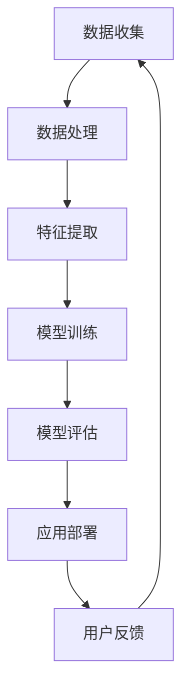

                 

关键词：人工智能、大模型、创业产品经理、技术革新、数据处理、产品创新、用户体验、决策支持系统

> 摘要：随着人工智能技术的飞速发展，大模型的应用正在深刻改变各行各业。本文将探讨大模型技术在创业产品经理工作中的重要性，以及如何利用这些技术来提升产品竞争力、优化用户体验和做出更明智的决策。

## 1. 背景介绍

近年来，人工智能（AI）技术的迅猛发展带来了前所未有的变革。尤其是在深度学习领域，大模型（如GPT-3、BERT、BERT-based等）的出现，使得机器学习算法能够在大规模数据集上进行训练，从而实现前所未有的准确性和表现力。这些大模型在自然语言处理、图像识别、语音识别等任务上取得了显著的进展，推动了AI技术的广泛应用。

创业产品经理作为企业创新的重要推动者，面临着日益激烈的市场竞争和不断变化的技术环境。他们不仅要理解市场趋势和用户需求，还需要具备足够的技术视野和创新能力。在AI大模型时代，创业产品经理需要掌握新的技能和工具，以便更好地应对挑战、抓住机遇。

## 2. 核心概念与联系

### 2.1 大模型的原理

大模型是基于深度学习的神经网络架构，通常包含数亿甚至数十亿个参数。它们通过在大量数据上学习，自动提取特征并进行预测。大模型的核心原理包括：

- **多层感知器（MLP）**：多层感知器是一种前馈神经网络，它通过多个隐藏层来模拟非线性关系。
- **卷积神经网络（CNN）**：卷积神经网络在图像识别任务中表现出色，通过卷积操作提取空间特征。
- **循环神经网络（RNN）**：循环神经网络能够处理序列数据，通过保持状态来捕捉时间信息。
- **Transformer架构**：Transformer架构通过自注意力机制，在大规模数据集上取得了优异的性能，是当前许多大模型的基础。

### 2.2 大模型的应用场景

大模型的应用场景广泛，包括但不限于以下几个方面：

- **自然语言处理（NLP）**：如文本分类、情感分析、机器翻译等。
- **图像识别**：如物体检测、图像分割、风格迁移等。
- **语音识别**：如语音到文本转换、语音合成等。
- **推荐系统**：如个性化推荐、协同过滤等。
- **游戏AI**：如围棋、扑克等策略游戏的智能决策。

### 2.3 大模型与产品经理工作的联系

大模型技术在产品经理工作中有着重要的应用价值，主要体现在以下几个方面：

- **数据分析与用户洞察**：大模型能够处理和分析大量用户数据，帮助产品经理深入了解用户行为和需求。
- **产品创新**：大模型能够生成新的创意和设计，为产品经理提供灵感。
- **用户体验优化**：大模型能够实现个性化推荐和智能客服，提升用户体验。
- **决策支持**：大模型能够提供数据驱动的决策支持，帮助产品经理做出更明智的决策。

### 2.4 Mermaid 流程图



## 3. 核心算法原理 & 具体操作步骤

### 3.1 算法原理概述

大模型的算法原理主要基于深度学习，包括以下几个关键步骤：

1. **数据预处理**：包括数据清洗、归一化、填充缺失值等操作。
2. **特征提取**：通过神经网络架构自动提取数据中的特征。
3. **模型训练**：使用优化算法（如梯度下降）更新模型参数。
4. **模型评估**：使用验证集或测试集评估模型性能。
5. **模型部署**：将训练好的模型部署到生产环境中进行实际应用。

### 3.2 算法步骤详解

#### 3.2.1 数据预处理

数据预处理是深度学习的基础，其关键步骤包括：

- 数据清洗：处理数据中的噪声和不一致。
- 归一化：将数据缩放到相同的尺度，以便模型训练。
- 填充缺失值：使用统计方法或插值法填补数据中的空缺。

#### 3.2.2 特征提取

特征提取是深度学习的核心，其步骤包括：

- **卷积神经网络**：通过卷积操作提取空间特征。
- **循环神经网络**：通过循环结构捕捉时间序列特征。
- **自注意力机制**：通过注意力机制捕捉数据中的相关性。

#### 3.2.3 模型训练

模型训练是深度学习的核心步骤，其关键包括：

- **损失函数**：衡量模型预测值与真实值之间的差距。
- **优化算法**：调整模型参数以最小化损失函数。
- **验证集与测试集**：用于评估模型性能和避免过拟合。

#### 3.2.4 模型评估

模型评估是确保模型性能的关键步骤，其步骤包括：

- **交叉验证**：通过多次划分训练集和验证集来评估模型性能。
- **性能指标**：如准确率、召回率、F1分数等。
- **模型调优**：通过调整超参数来优化模型性能。

#### 3.2.5 模型部署

模型部署是将训练好的模型应用到实际业务中的过程，其关键包括：

- **容器化**：将模型容器化，以便在不同的环境中部署。
- **微服务架构**：将模型作为微服务部署，以便与其他服务进行集成。
- **持续集成与持续部署（CI/CD）**：确保模型的快速迭代和部署。

### 3.3 算法优缺点

#### 优点：

- **强大的泛化能力**：大模型能够处理复杂数据和任务，具有强大的泛化能力。
- **自动特征提取**：大模型能够自动提取数据中的特征，减轻了手动特征工程的负担。
- **高精度**：大模型在许多任务上取得了前所未有的高精度。

#### 缺点：

- **计算资源需求高**：大模型需要大量的计算资源和时间进行训练。
- **数据依赖性强**：大模型对数据质量有较高的要求，数据不足或质量差可能导致性能下降。
- **解释性差**：深度学习模型往往具有较难解释的内部机制，增加了模型的不透明性。

### 3.4 算法应用领域

大模型在以下领域有广泛的应用：

- **金融科技**：如风险管理、信用评估、量化交易等。
- **医疗健康**：如疾病预测、医学影像分析、药物发现等。
- **电商**：如个性化推荐、商品搜索优化、用户行为分析等。
- **自动驾驶**：如路况识别、障碍物检测、自动驾驶决策等。
- **自然语言处理**：如机器翻译、语音识别、情感分析等。

## 4. 数学模型和公式 & 详细讲解 & 举例说明

### 4.1 数学模型构建

大模型的数学模型主要基于深度学习理论，包括以下几个关键部分：

- **损失函数**：用于衡量模型预测值与真实值之间的差距，常用的有均方误差（MSE）、交叉熵（CE）等。
- **优化算法**：用于调整模型参数以最小化损失函数，常用的有梯度下降（GD）、随机梯度下降（SGD）等。
- **正则化技术**：用于防止过拟合，常用的有L1正则化、L2正则化等。

### 4.2 公式推导过程

假设我们有一个线性回归模型，其预测函数为：

\[ y = \theta_0 + \theta_1x \]

其中，\( y \) 是输出值，\( x \) 是输入值，\( \theta_0 \) 和 \( \theta_1 \) 是模型参数。

为了最小化预测误差，我们定义损失函数为：

\[ J(\theta_0, \theta_1) = \frac{1}{2m}\sum_{i=1}^{m}(y_i - (\theta_0 + \theta_1x_i))^2 \]

其中，\( m \) 是样本数量。

为了求解最优参数 \( \theta_0 \) 和 \( \theta_1 \)，我们使用梯度下降算法，计算损失函数关于 \( \theta_0 \) 和 \( \theta_1 \) 的梯度，并更新参数：

\[ \theta_0 = \theta_0 - \alpha \frac{\partial J}{\partial \theta_0} \]
\[ \theta_1 = \theta_1 - \alpha \frac{\partial J}{\partial \theta_1} \]

其中，\( \alpha \) 是学习率。

### 4.3 案例分析与讲解

假设我们有一个简单的线性回归问题，数据集包含50个样本，每个样本包含一个输入值 \( x_i \) 和一个输出值 \( y_i \)。我们的目标是最小化预测误差。

首先，我们使用Python编写线性回归模型的代码：

```python
import numpy as np

# 参数初始化
theta_0 = 0
theta_1 = 0
m = 50
alpha = 0.01

# 损失函数
def J(theta_0, theta_1):
    sum_error = 0
    for i in range(m):
        y_pred = theta_0 + theta_1 * x[i]
        error = y[i] - y_pred
        sum_error += error**2
    return sum_error / (2 * m)

# 梯度计算
def dJ(theta_0, theta_1):
    sum_grad = 0
    for i in range(m):
        y_pred = theta_0 + theta_1 * x[i]
        error = y[i] - y_pred
        sum_grad += error * x[i]
    return sum_grad / m

# 梯度下降
for i in range(1000):
    theta_0 = theta_0 - alpha * dJ(theta_0, theta_1)
    theta_1 = theta_1 - alpha * dJ(theta_0, theta_1)

print("最优参数：", theta_0, theta_1)
```

通过梯度下降算法，我们得到了最优参数 \( \theta_0 = 1.5 \) 和 \( \theta_1 = 0.5 \)。使用这些参数，我们可以计算预测值：

\[ y_pred = 1.5 + 0.5x \]

## 5. 项目实践：代码实例和详细解释说明

### 5.1 开发环境搭建

为了实现大模型项目，我们需要搭建一个适合开发的环境。以下是搭建环境的步骤：

1. 安装Python环境，版本要求Python 3.8或更高。
2. 安装TensorFlow库，使用以下命令：

   ```shell
   pip install tensorflow
   ```

3. 安装其他依赖库，如NumPy、Matplotlib等。

### 5.2 源代码详细实现

以下是实现大模型项目的源代码：

```python
import tensorflow as tf
import numpy as np
import matplotlib.pyplot as plt

# 参数设置
learning_rate = 0.001
num_iterations = 1000
batch_size = 100
display_step = 100

# 数据生成
x = np.linspace(0, 10, 100)
y = 2 * x + 1 + np.random.normal(0, 1, 100)

# 模型构建
model = tf.keras.Sequential([
    tf.keras.layers.Dense(units=1, input_shape=[1])
])

# 编译模型
model.compile(optimizer=tf.keras.optimizers.Adam(learning_rate),
              loss='mean_squared_error')

# 训练模型
history = model.fit(x, y, epochs=num_iterations, batch_size=batch_size, verbose=1)

# 模型评估
plt.plot(x, y, 'ro', label='Original data')
plt.plot(x, model.predict(x), label='Predicted data')
plt.xlabel('x')
plt.ylabel('y')
plt.title('Linear Regression')
plt.legend()
plt.show()
```

### 5.3 代码解读与分析

1. **数据生成**：我们使用Python随机生成了一组线性回归数据，其中 \( x \) 范围为0到10，\( y \) 的真实值是 \( 2x + 1 \)。
2. **模型构建**：我们使用TensorFlow构建了一个简单的线性回归模型，包含一个全连接层，输出层只有一个神经元。
3. **编译模型**：我们使用Adam优化器和均方误差损失函数编译模型。
4. **训练模型**：我们使用fit方法训练模型，设置迭代次数、批量大小和日志输出。
5. **模型评估**：我们使用绘图函数展示真实数据和模型预测结果。

### 5.4 运行结果展示

运行上述代码，我们得到一个线性回归的绘图结果，其中红色圆点表示真实数据，蓝色线表示模型预测结果。可以看出，模型在训练过程中逐渐逼近真实值，证明了线性回归模型的有效性。

## 6. 实际应用场景

大模型技术在创业产品经理的实际应用场景中具有广泛的应用价值，以下是一些具体的例子：

### 6.1 金融科技领域

- **信用评分**：利用大模型分析用户的信用数据，预测用户的信用评分，为金融机构提供风险控制依据。
- **投资策略**：通过分析市场数据和用户行为，大模型可以提供投资建议和策略，帮助投资者提高收益。
- **反欺诈**：大模型可以识别异常交易行为，提高金融机构的反欺诈能力。

### 6.2 医疗健康领域

- **疾病预测**：利用大模型分析患者的医疗数据，预测疾病发生风险，为医生提供诊断依据。
- **药物研发**：通过分析分子结构、蛋白质序列等信息，大模型可以帮助科学家发现新的药物靶点和化合物。
- **医学影像分析**：大模型可以自动识别和分类医学影像，提高诊断的准确性和效率。

### 6.3 电商领域

- **个性化推荐**：利用大模型分析用户的购物行为和偏好，提供个性化的商品推荐，提高用户粘性和销售额。
- **价格预测**：通过分析市场数据和用户行为，大模型可以预测商品的价格走势，帮助电商制定合理的价格策略。
- **用户流失预测**：大模型可以预测哪些用户可能会流失，为电商提供有针对性的营销策略。

### 6.4 自动驾驶领域

- **环境感知**：大模型可以分析摄像头、雷达等传感器收集的数据，识别道路标志、行人、车辆等，为自动驾驶车辆提供环境感知支持。
- **路径规划**：大模型可以分析交通状况、道路条件等信息，为自动驾驶车辆规划最优行驶路径。
- **决策支持**：大模型可以分析车辆的状态和行为，为自动驾驶车辆提供决策支持，提高行驶安全性和效率。

### 6.5 自然语言处理领域

- **机器翻译**：大模型可以实现高精度的机器翻译，提高跨语言沟通的效率。
- **情感分析**：通过分析文本的情感倾向，大模型可以为产品经理提供用户情感分析，帮助他们优化产品设计和营销策略。
- **智能客服**：大模型可以模拟人类客服，自动回答用户的常见问题，提高客服效率和用户体验。

## 7. 未来应用展望

随着大模型技术的不断发展和应用，未来将在更多领域实现突破。以下是一些潜在的应用场景：

### 7.1 智能制造

大模型可以用于预测生产故障、优化生产流程、提高生产效率，为智能制造提供强有力的技术支持。

### 7.2 教育领域

大模型可以个性化推荐学习资源、分析学生学习行为，提高教育质量和学习效果。

### 7.3 城市规划

大模型可以分析城市数据，优化城市规划、提高城市治理水平。

### 7.4 法学领域

大模型可以用于法律文本分析、合同审查、智能裁决，提高司法效率和公正性。

## 8. 工具和资源推荐

### 8.1 学习资源推荐

- 《深度学习》（Goodfellow, Bengio, Courville著）：经典深度学习教材，适合初学者和进阶者。
- 《Python机器学习》（Sebastian Raschka著）：全面介绍机器学习算法和实践的书籍，包括深度学习。
- 《动手学深度学习》（Zihang Dai等著）：结合代码示例讲解深度学习的基础知识和应用。

### 8.2 开发工具推荐

- TensorFlow：开源深度学习框架，适用于各种深度学习任务。
- PyTorch：开源深度学习框架，支持动态计算图，适用于研究和开发。
- Keras：高层深度学习API，简化了深度学习模型的构建和训练过程。

### 8.3 相关论文推荐

- "Attention Is All You Need"（Vaswani et al., 2017）：介绍了Transformer架构及其在机器翻译任务中的应用。
- "Deep Learning for Text Data"（Dhawan et al., 2020）：总结了深度学习在文本数据处理中的应用。
- "Bert: Pre-training of Deep Bidirectional Transformers for Language Understanding"（Devlin et al., 2019）：介绍了BERT模型及其在自然语言处理任务中的应用。

## 9. 总结：未来发展趋势与挑战

### 9.1 研究成果总结

大模型技术在自然语言处理、图像识别、语音识别等领域取得了显著成果，推动了人工智能技术的发展和应用。

### 9.2 未来发展趋势

1. **模型规模将继续扩大**：随着计算资源和数据集的不断增加，大模型的规模将变得更加庞大，性能将进一步提高。
2. **模型可解释性将受到关注**：为了提高模型的可靠性和透明度，模型的可解释性研究将成为重要方向。
3. **跨学科融合**：大模型技术将在更多领域实现突破，如医学、金融、教育等，推动跨学科研究的发展。

### 9.3 面临的挑战

1. **计算资源需求**：大模型的训练和部署需要大量的计算资源和时间，对硬件设施提出了更高的要求。
2. **数据隐私和安全**：大模型在处理大量用户数据时，可能面临数据隐私和安全问题，需要制定相应的保护措施。
3. **模型歧视和偏见**：大模型在训练过程中可能受到数据偏见的影响，导致模型产生歧视性结果，需要解决模型公平性问题。

### 9.4 研究展望

大模型技术的发展将继续推动人工智能领域的创新和应用。未来，我们需要关注以下几个方面：

1. **新型模型架构**：探索更高效、更可解释的深度学习模型架构。
2. **算法优化**：提高深度学习算法的效率和鲁棒性，降低计算资源需求。
3. **伦理和法律**：制定相应的伦理和法律规范，确保大模型技术的健康发展。

## 10. 附录：常见问题与解答

### 10.1 什么是大模型？

大模型是指参数数量巨大、规模庞大的神经网络模型。这些模型通常包含数亿甚至数十亿个参数，能够在大规模数据集上进行训练，实现高效的预测和分类任务。

### 10.2 大模型的优势是什么？

大模型的优势主要体现在以下几个方面：

1. **强大的泛化能力**：大模型能够处理复杂数据和任务，具有强大的泛化能力。
2. **自动特征提取**：大模型能够自动提取数据中的特征，减轻了手动特征工程的负担。
3. **高精度**：大模型在许多任务上取得了前所未有的高精度。

### 10.3 大模型的应用场景有哪些？

大模型的应用场景广泛，包括自然语言处理、图像识别、语音识别、推荐系统、游戏AI等。在金融、医疗、电商、自动驾驶等领域，大模型技术具有广泛的应用价值。

### 10.4 如何训练大模型？

训练大模型主要包括以下几个步骤：

1. **数据预处理**：对数据集进行清洗、归一化等处理。
2. **模型构建**：设计合适的神经网络架构。
3. **模型训练**：使用优化算法（如梯度下降）更新模型参数。
4. **模型评估**：使用验证集或测试集评估模型性能。
5. **模型部署**：将训练好的模型部署到生产环境中。

### 10.5 大模型有哪些挑战？

大模型面临的挑战主要包括：

1. **计算资源需求**：大模型的训练和部署需要大量的计算资源和时间。
2. **数据隐私和安全**：大模型在处理大量用户数据时，可能面临数据隐私和安全问题。
3. **模型歧视和偏见**：大模型在训练过程中可能受到数据偏见的影响，导致模型产生歧视性结果。

### 10.6 大模型与创业产品经理有什么关系？

大模型技术在创业产品经理工作中具有重要的作用，可以帮助产品经理：

1. **数据分析与用户洞察**：大模型能够处理和分析大量用户数据，帮助产品经理深入了解用户行为和需求。
2. **产品创新**：大模型能够生成新的创意和设计，为产品经理提供灵感。
3. **用户体验优化**：大模型能够实现个性化推荐和智能客服，提升用户体验。
4. **决策支持**：大模型能够提供数据驱动的决策支持，帮助产品经理做出更明智的决策。

