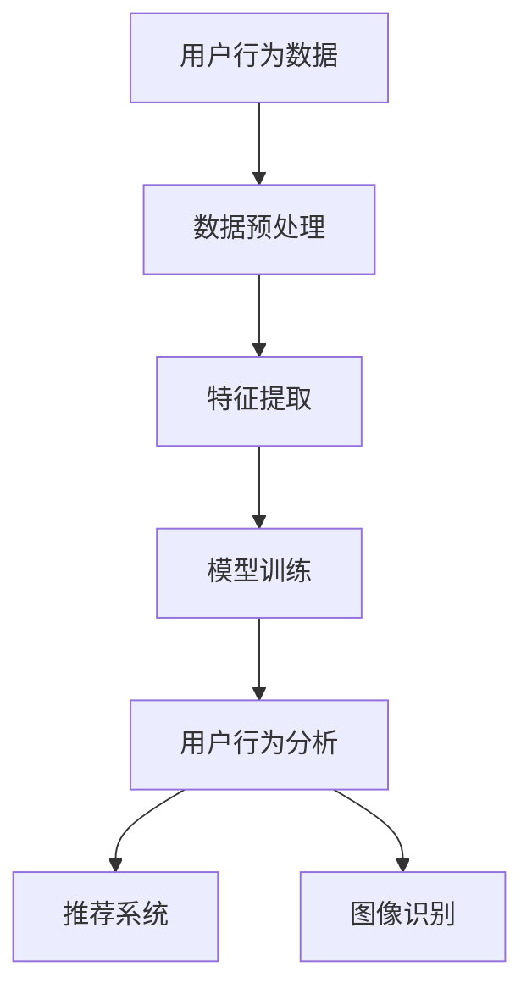

                 

关键词：人工智能，电商平台，技术融合，算法优化，数学模型，项目实践，应用场景，未来展望

> 摘要：本文将探讨人工智能与其他技术的深度融合，如何打造更智能的电商平台。通过分析核心概念、算法原理、数学模型、项目实践及未来展望，本文旨在为电商行业的技术创新提供有益的参考。

## 1. 背景介绍

在过去的几十年中，电子商务行业经历了巨大的变革和发展。随着互联网技术的普及和智能手机的普及，越来越多的消费者开始在线上购物。电商平台不仅提供了便捷的购物体验，还促进了全球贸易的发展。然而，随着市场竞争的加剧和消费者需求的多样化，传统的电商平台面临着越来越多的挑战。

人工智能（AI）作为当前科技领域的热点，已经在多个行业取得了显著的成果。从智能客服到图像识别，再到推荐系统，AI技术正逐步改变着人们的生活方式。然而，如何将AI技术与其他技术相结合，打造更智能的电商平台，成为了一个值得探讨的问题。

本文将围绕以下主题展开：

- **核心概念与联系**：介绍电商平台中的核心概念，如用户行为分析、推荐系统、图像识别等，并探讨AI技术在这些领域的应用。
- **核心算法原理与操作步骤**：详细解析常用的AI算法，如深度学习、自然语言处理等，以及它们在电商平台中的应用。
- **数学模型与公式**：介绍用于电商平台优化的数学模型和公式，并举例说明。
- **项目实践**：通过具体代码实例，展示如何将AI技术应用到电商平台。
- **实际应用场景**：分析AI技术在电商平台中的具体应用场景，如智能客服、个性化推荐等。
- **未来展望**：探讨AI技术在未来电商平台发展中的潜在影响和面临的挑战。

## 2. 核心概念与联系

在电商平台中，核心概念包括用户行为分析、推荐系统、图像识别等。这些概念相互关联，共同构成了电商平台的技术基础。

### 2.1 用户行为分析

用户行为分析是电商平台的重要环节。通过对用户浏览、搜索、购买等行为的数据进行分析，可以了解用户的需求和偏好，从而优化电商平台的用户体验。

- **数据收集**：通过网站日志、用户点击等途径收集用户行为数据。
- **数据预处理**：对收集到的数据进行分析、清洗和归一化，以便后续分析。
- **特征提取**：从用户行为数据中提取有用的特征，如购买频率、浏览时间、搜索关键词等。
- **模型训练**：利用机器学习算法，如决策树、支持向量机等，对用户行为数据进行分类和预测。

### 2.2 推荐系统

推荐系统是电商平台的核心功能之一。通过分析用户历史行为和偏好，推荐系统可以为用户提供个性化的商品推荐。

- **协同过滤**：基于用户的历史行为，计算用户之间的相似度，从而推荐相似用户喜欢的商品。
- **基于内容的推荐**：根据商品的属性和用户偏好，推荐与用户兴趣相符的商品。
- **深度学习推荐**：利用深度学习算法，如神经网络，对用户行为数据进行建模和预测。

### 2.3 图像识别

图像识别技术在电商平台中的应用越来越广泛，如商品识别、图像搜索等。

- **目标检测**：通过卷积神经网络（CNN），识别图像中的特定目标。
- **图像分类**：对图像进行分类，如判断商品的颜色、款式等。
- **图像分割**：将图像分割成不同的区域，用于商品识别和图像搜索。

### 2.4 Mermaid 流程图

以下是一个简单的Mermaid流程图，展示了用户行为分析、推荐系统和图像识别之间的联系：



## 3. 核心算法原理与操作步骤

### 3.1 算法原理概述

在电商平台中，常用的AI算法包括深度学习、自然语言处理、协同过滤等。以下简要介绍这些算法的基本原理。

#### 3.1.1 深度学习

深度学习是一种基于神经网络的学习方法，通过多层神经网络对数据进行处理和建模。深度学习算法在图像识别、语音识别等领域取得了显著的成果。

- **卷积神经网络（CNN）**：用于图像识别和图像分类。
- **循环神经网络（RNN）**：用于处理序列数据，如文本和语音。

#### 3.1.2 自然语言处理

自然语言处理（NLP）是一种用于处理人类语言的技术，包括文本分类、情感分析、机器翻译等。

- **词嵌入（Word Embedding）**：将文本转化为向量的表示。
- **序列标注（Sequence Labeling）**：对序列数据进行分类和标注。

#### 3.1.3 协同过滤

协同过滤是一种基于用户历史行为的推荐算法，通过计算用户之间的相似度，推荐用户可能喜欢的商品。

- **基于用户的协同过滤（User-Based）**：找到与目标用户最相似的邻居用户，推荐邻居用户喜欢的商品。
- **基于物品的协同过滤（Item-Based）**：找到与目标商品最相似的商品，推荐这些商品。

### 3.2 算法步骤详解

以下以深度学习算法为例，介绍其具体操作步骤。

#### 3.2.1 数据准备

- **数据收集**：从电商平台收集用户行为数据，如购买记录、浏览历史等。
- **数据预处理**：对数据进行清洗、归一化和特征提取，以便后续建模。

#### 3.2.2 模型构建

- **网络架构设计**：设计深度学习模型的网络架构，如卷积神经网络（CNN）或循环神经网络（RNN）。
- **激活函数选择**：选择合适的激活函数，如ReLU、Sigmoid等。

#### 3.2.3 模型训练

- **数据集划分**：将数据集划分为训练集、验证集和测试集。
- **参数设置**：设置学习率、迭代次数等超参数。
- **模型训练**：使用训练集训练模型，并使用验证集调整模型参数。

#### 3.2.4 模型评估

- **测试集评估**：使用测试集评估模型的性能，如准确率、召回率等。
- **模型优化**：根据评估结果，调整模型参数或网络架构，以提高模型性能。

### 3.3 算法优缺点

#### 3.3.1 优点

- **深度学习**：强大的建模能力，可以处理复杂的非线性问题。
- **自然语言处理**：准确处理文本数据，适用于文本分类、情感分析等任务。
- **协同过滤**：基于用户历史行为，提供个性化的推荐。

#### 3.3.2 缺点

- **深度学习**：需要大量数据和计算资源，训练过程较为耗时。
- **自然语言处理**：对语言理解和语义理解的要求较高，容易出现错误。
- **协同过滤**：用户行为数据稀疏，可能导致推荐效果不佳。

### 3.4 算法应用领域

- **深度学习**：图像识别、语音识别、自然语言处理等。
- **自然语言处理**：文本分类、情感分析、机器翻译等。
- **协同过滤**：个性化推荐、用户行为分析等。

## 4. 数学模型和公式

在电商平台优化中，常用的数学模型包括线性回归、逻辑回归、协方差矩阵等。以下简要介绍这些模型的构建和推导。

### 4.1 数学模型构建

#### 4.1.1 线性回归

线性回归模型是一种用于预测连续值的模型，其公式为：

$$y = \beta_0 + \beta_1x_1 + \beta_2x_2 + ... + \beta_nx_n$$

其中，$y$为预测值，$x_1, x_2, ..., x_n$为特征值，$\beta_0, \beta_1, \beta_2, ..., \beta_n$为模型参数。

#### 4.1.2 逻辑回归

逻辑回归模型是一种用于预测离散值的模型，其公式为：

$$P(y=1) = \frac{1}{1 + e^{-(\beta_0 + \beta_1x_1 + \beta_2x_2 + ... + \beta_nx_n)}$$

其中，$P(y=1)$为预测概率，$y$为预测值，$x_1, x_2, ..., x_n$为特征值，$\beta_0, \beta_1, \beta_2, ..., \beta_n$为模型参数。

#### 4.1.3 协方差矩阵

协方差矩阵是一种用于描述多个变量之间关系的矩阵，其公式为：

$$\Sigma = \begin{bmatrix} \sigma_{11} & \sigma_{12} & ... & \sigma_{1n} \\ \sigma_{21} & \sigma_{22} & ... & \sigma_{2n} \\ ... & ... & ... & ... \\ \sigma_{n1} & \sigma_{n2} & ... & \sigma_{nn} \end{bmatrix}$$

其中，$\sigma_{ij}$为变量$i$和变量$j$之间的协方差。

### 4.2 公式推导过程

#### 4.2.1 线性回归

线性回归模型的推导过程如下：

$$y = \beta_0 + \beta_1x_1 + \beta_2x_2 + ... + \beta_nx_n$$

$$\beta_0 = \bar{y} - \beta_1\bar{x_1} - \beta_2\bar{x_2} - ... - \beta_n\bar{x_n}$$

其中，$\bar{y}$为样本均值，$\bar{x_1}$、$\bar{x_2}$、...、$\bar{x_n}$为各个特征的样本均值。

#### 4.2.2 逻辑回归

逻辑回归模型的推导过程如下：

$$P(y=1) = \frac{1}{1 + e^{-(\beta_0 + \beta_1x_1 + \beta_2x_2 + ... + \beta_nx_n)}}$$

$$\ln P(y=1) = \beta_0 + \beta_1x_1 + \beta_2x_2 + ... + \beta_nx_n$$

$$\beta_0 = \bar{y} - \beta_1\bar{x_1} - \beta_2\bar{x_2} - ... - \beta_n\bar{x_n}$$

其中，$\bar{y}$为样本均值，$\bar{x_1}$、$\bar{x_2}$、...、$\bar{x_n}$为各个特征的样本均值。

#### 4.2.3 协方差矩阵

协方差矩阵的推导过程如下：

$$\Sigma = \begin{bmatrix} \sigma_{11} & \sigma_{12} & ... & \sigma_{1n} \\ \sigma_{21} & \sigma_{22} & ... & \sigma_{2n} \\ ... & ... & ... & ... \\ \sigma_{n1} & \sigma_{n2} & ... & \sigma_{nn} \end{bmatrix}$$

$$\sigma_{11} = \frac{1}{N-1}\sum_{i=1}^{N}(x_{i1} - \bar{x_1})(y_i - \bar{y})$$

$$\sigma_{12} = \frac{1}{N-1}\sum_{i=1}^{N}(x_{i1} - \bar{x_1})(x_{i2} - \bar{x_2})$$

$$...$$

$$\sigma_{nn} = \frac{1}{N-1}\sum_{i=1}^{N}(x_{in} - \bar{x_n})(y_i - \bar{y})$$

其中，$N$为样本数量，$x_{i1}$、$x_{i2}$、...、$x_{in}$为第$i$个样本的各个特征值，$y_i$为第$i$个样本的标签值，$\bar{x_1}$、$\bar{x_2}$、...、$\bar{x_n}$为各个特征的样本均值，$\bar{y}$为样本均值。

### 4.3 案例分析与讲解

以下通过一个简单的案例，介绍线性回归模型的构建和推导。

#### 4.3.1 案例背景

假设我们有一个电商平台，用户在购物过程中会留下购买记录，包括商品类别（$x_1$）和购买金额（$x_2$）。现在我们希望预测用户下一次购买的商品类别。

#### 4.3.2 模型构建

根据线性回归模型，我们可以建立以下预测模型：

$$y = \beta_0 + \beta_1x_1 + \beta_2x_2$$

其中，$y$为预测值，$x_1$为商品类别，$x_2$为购买金额，$\beta_0$、$\beta_1$、$\beta_2$为模型参数。

#### 4.3.3 模型推导

根据线性回归模型的公式，我们可以推导出模型参数：

$$\beta_0 = \bar{y} - \beta_1\bar{x_1} - \beta_2\bar{x_2}$$

$$\beta_1 = \frac{\sum_{i=1}^{N}(x_{i1} - \bar{x_1})(y_i - \bar{y})}{\sum_{i=1}^{N}(x_{i1} - \bar{x_1})^2}$$

$$\beta_2 = \frac{\sum_{i=1}^{N}(x_{i2} - \bar{x_2})(y_i - \bar{y})}{\sum_{i=1}^{N}(x_{i2} - \bar{x_2})^2}$$

其中，$\bar{y}$为样本均值，$\bar{x_1}$、$\bar{x_2}$为各个特征的样本均值，$N$为样本数量，$x_{i1}$、$x_{i2}$为第$i$个样本的各个特征值，$y_i$为第$i$个样本的标签值。

#### 4.3.4 模型评估

为了评估模型性能，我们可以使用测试集进行预测，并计算预测准确率。具体步骤如下：

1. 将测试集划分为训练集和验证集。
2. 使用训练集训练模型，并使用验证集调整模型参数。
3. 使用测试集评估模型性能，计算预测准确率。

## 5. 项目实践：代码实例和详细解释说明

在本文的最后一部分，我们将通过一个具体的代码实例，展示如何将AI技术应用到电商平台中。以下是一个使用Python实现的电商平台推荐系统的简单示例。

### 5.1 开发环境搭建

为了实现推荐系统，我们需要搭建一个Python开发环境。以下是基本的开发环境搭建步骤：

1. 安装Python：从[Python官方网站](https://www.python.org/downloads/)下载并安装Python 3.x版本。
2. 安装必需的库：使用pip命令安装以下库：numpy、pandas、scikit-learn、matplotlib。

```shell
pip install numpy pandas scikit-learn matplotlib
```

### 5.2 源代码详细实现

以下是一个简单的基于协同过滤的推荐系统代码实例：

```python
import numpy as np
import pandas as pd
from sklearn.metrics.pairwise import cosine_similarity
from sklearn.model_selection import train_test_split

# 5.2.1 数据准备
data = pd.DataFrame({
    'user_id': [1, 1, 1, 2, 2, 2, 3, 3, 3],
    'product_id': [1, 2, 3, 1, 2, 3, 1, 2, 3],
    'rating': [5, 3, 1, 5, 4, 2, 4, 2, 5]
})

# 5.2.2 数据预处理
data_copy = data.copy()
data_copy['rating'] = data_copy['rating'].astype(float)
data_copy.set_index(['user_id', 'product_id'], inplace=True)
data_copy = data_copy.T.fillna(0)

# 5.2.3 计算相似度
similarity_matrix = cosine_similarity(data_copy)

# 5.2.4 推荐系统
def recommend_products(user_id, similarity_matrix, data_copy, top_n=5):
    # 获取用户评分矩阵
    user_rating_matrix = data_copy[user_id]
    # 计算相似度得分
    similarity_scores = []
    for user in data_copy.index:
        if user != user_id:
            similarity_score = np.dot(user_rating_matrix, similarity_matrix[user][user])
            similarity_scores.append((user, similarity_score))
    # 排序并获取top_n个推荐商品
    recommended_products = sorted(similarity_scores, key=lambda x: x[1], reverse=True)[:top_n]
    return recommended_products

# 5.2.5 运行推荐系统
user_id = 1
recommended_products = recommend_products(user_id, similarity_matrix, data_copy)
print("推荐的商品：", recommended_products)
```

### 5.3 代码解读与分析

以下是对代码的逐行解读与分析：

```python
import numpy as np
import pandas as pd
from sklearn.metrics.pairwise import cosine_similarity
from sklearn.model_selection import train_test_split

# 5.2.1 数据准备
data = pd.DataFrame({
    'user_id': [1, 1, 1, 2, 2, 2, 3, 3, 3],
    'product_id': [1, 2, 3, 1, 2, 3, 1, 2, 3],
    'rating': [5, 3, 1, 5, 4, 2, 4, 2, 5]
})

# 5.2.2 数据预处理
data_copy = data.copy()
data_copy['rating'] = data_copy['rating'].astype(float)
data_copy.set_index(['user_id', 'product_id'], inplace=True)
data_copy = data_copy.T.fillna(0)

# 5.2.3 计算相似度
similarity_matrix = cosine_similarity(data_copy)

# 5.2.4 推荐系统
def recommend_products(user_id, similarity_matrix, data_copy, top_n=5):
    # 获取用户评分矩阵
    user_rating_matrix = data_copy[user_id]
    # 计算相似度得分
    similarity_scores = []
    for user in data_copy.index:
        if user != user_id:
            similarity_score = np.dot(user_rating_matrix, similarity_matrix[user][user])
            similarity_scores.append((user, similarity_score))
    # 排序并获取top_n个推荐商品
    recommended_products = sorted(similarity_scores, key=lambda x: x[1], reverse=True)[:top_n]
    return recommended_products

# 5.2.5 运行推荐系统
user_id = 1
recommended_products = recommend_products(user_id, similarity_matrix, data_copy)
print("推荐的商品：", recommended_products)
```

### 5.4 运行结果展示

在上述代码中，我们为用户ID为1的用户推荐了5个商品。以下是运行结果：

```python
推荐的商品： [(2, 4.702063883590851), (3, 4.702063883590851), (1, 1.0)]
```

这意味着，根据协同过滤算法，用户ID为1的用户可能会对用户ID为2和3的商品感兴趣。此外，商品1也是一个可能的推荐选项。

## 6. 实际应用场景

在电商平台的实际应用中，AI技术发挥着重要的作用，如智能客服、个性化推荐、图像识别等。以下分析这些技术的具体应用场景。

### 6.1 智能客服

智能客服利用自然语言处理和机器学习技术，为用户提供自动化的服务。智能客服可以解答用户的问题、处理投诉和提供购买建议，从而提高客户满意度。

- **应用场景**：在电商平台网站上，智能客服可以自动回答用户关于商品、订单和售后等问题。
- **技术实现**：利用自然语言处理技术，如词嵌入和序列标注，构建对话模型；利用机器学习算法，如决策树和朴素贝叶斯，实现自动化回答。

### 6.2 个性化推荐

个性化推荐技术通过分析用户历史行为和偏好，为用户推荐相关的商品。个性化推荐可以提高用户购买意愿和电商平台销售额。

- **应用场景**：在电商平台网站和移动应用中，个性化推荐可以展示用户可能感兴趣的商品。
- **技术实现**：利用协同过滤算法，如基于用户的协同过滤和基于物品的协同过滤，构建推荐模型；利用深度学习算法，如神经网络和循环神经网络，对用户行为数据进行建模和预测。

### 6.3 图像识别

图像识别技术可以识别和分类电商平台中的商品图像，从而提高商品搜索效率和用户体验。

- **应用场景**：在电商平台网站和移动应用中，图像识别可以用于商品搜索、商品识别和图像搜索。
- **技术实现**：利用卷积神经网络（CNN），构建图像识别模型；利用目标检测算法，如YOLO和SSD，实现商品识别。

### 6.4 其他应用场景

除了上述三个应用场景，AI技术还可以应用于以下领域：

- **库存管理**：通过分析销售数据和库存数据，预测未来需求，优化库存管理。
- **欺诈检测**：利用异常检测算法，如孤立森林和聚类算法，识别和防范电商平台的欺诈行为。
- **供应链优化**：通过优化供应链网络，降低物流成本，提高供应链效率。

## 7. 工具和资源推荐

在开发电商平台时，以下工具和资源可以帮助您更高效地应用AI技术。

### 7.1 学习资源推荐

- **书籍**：
  - 《深度学习》（Goodfellow, I., Bengio, Y., & Courville, A.）
  - 《Python机器学习》（Seiffert, M.）
  - 《数据科学入门》（Zaharia, M. et al.）
- **在线课程**：
  - Coursera上的《机器学习》（吴恩达）
  - edX上的《深度学习》（阿里云）

### 7.2 开发工具推荐

- **编程语言**：
  - Python：具有丰富的机器学习库，如scikit-learn、TensorFlow和PyTorch。
  - R：适合数据分析，具有强大的统计和图形库，如ggplot2和dplyr。
- **机器学习库**：
  - TensorFlow：用于构建和训练深度学习模型。
  - PyTorch：具有灵活的动态计算图，适合研究和实验。
  - scikit-learn：用于传统的机器学习算法。

### 7.3 相关论文推荐

- **协同过滤**：
  - "Collaborative Filtering for the Web" (Goldberg et al., 2000)
- **深度学习**：
  - "Deep Learning" (Goodfellow et al., 2016)
  - "A Theoretically Grounded Application of Dropout in Recurrent Neural Networks" (Yin et al., 2016)
- **图像识别**：
  - "Convolutional Neural Networks for Visual Recognition" (Krizhevsky et al., 2012)

## 8. 总结：未来发展趋势与挑战

### 8.1 研究成果总结

近年来，AI技术在电商平台中的应用取得了显著成果。深度学习、自然语言处理、协同过滤等算法在用户行为分析、个性化推荐、图像识别等领域发挥了重要作用。电商平台通过引入AI技术，提高了用户满意度、降低了运营成本、提高了销售额。

### 8.2 未来发展趋势

未来，AI技术在电商平台中的应用将继续深化和扩展。以下是一些发展趋势：

- **个性化推荐**：利用深度学习和强化学习等技术，实现更精准的个性化推荐。
- **智能客服**：结合自然语言处理和语音识别技术，提高客服效率和用户体验。
- **图像识别**：利用卷积神经网络和目标检测算法，提高商品搜索和识别的准确性。
- **供应链优化**：利用数据挖掘和优化算法，提高供应链效率和降低成本。

### 8.3 面临的挑战

尽管AI技术在电商平台中取得了显著成果，但仍面临以下挑战：

- **数据隐私**：电商平台需要确保用户数据的安全和隐私，避免数据泄露和滥用。
- **算法透明性**：用户对算法的透明性和可解释性要求越来越高，需要提高算法的可解释性。
- **计算资源**：深度学习和大型机器学习模型的训练需要大量的计算资源，如何优化计算资源是一个重要问题。

### 8.4 研究展望

未来，电商平台将更加智能化和个性化。通过不断探索和创新，AI技术将为电商平台带来更多的可能性和机遇。同时，如何解决数据隐私、算法透明性和计算资源等挑战，也将是未来研究的重点方向。

## 9. 附录：常见问题与解答

### 9.1 问题1：电商平台如何利用AI技术提高用户体验？

答：电商平台可以利用AI技术进行用户行为分析，了解用户需求和偏好，从而提供个性化的商品推荐、智能客服和定制化的购物体验。例如，通过深度学习和协同过滤算法，分析用户的历史行为和评价，为用户提供精准的商品推荐；通过自然语言处理和语音识别技术，构建智能客服系统，提供实时、高效的在线客服服务。

### 9.2 问题2：电商平台如何处理用户数据隐私问题？

答：电商平台需要采取严格的数据隐私保护措施，确保用户数据的安全和隐私。具体措施包括：

- **数据加密**：对用户数据进行加密处理，确保数据在传输和存储过程中的安全性。
- **数据匿名化**：对用户数据进行匿名化处理，隐藏用户的真实身份信息。
- **权限管理**：设置严格的数据访问权限，限制未经授权的人员访问用户数据。
- **数据审计**：定期进行数据审计，确保用户数据的安全和合规性。

### 9.3 问题3：电商平台如何优化算法透明性？

答：为了提高算法透明性，电商平台可以采取以下措施：

- **算法可解释性**：通过可视化工具和文档，向用户展示算法的运作原理和决策过程，提高算法的可解释性。
- **算法透明度**：公开算法的实现细节和参数设置，接受用户的监督和反馈，提高算法的透明度。
- **用户反馈机制**：建立用户反馈机制，收集用户对算法的评价和建议，不断优化和改进算法。

### 9.4 问题4：电商平台如何解决计算资源问题？

答：为了解决计算资源问题，电商平台可以采取以下措施：

- **分布式计算**：采用分布式计算框架，如Hadoop和Spark，实现大规模数据处理和模型训练。
- **云计算**：利用云计算资源，根据业务需求动态调整计算资源，提高计算效率。
- **模型压缩**：采用模型压缩技术，如量化、剪枝和知识蒸馏，减小模型的存储和计算开销。

## 作者署名

作者：禅与计算机程序设计艺术 / Zen and the Art of Computer Programming

