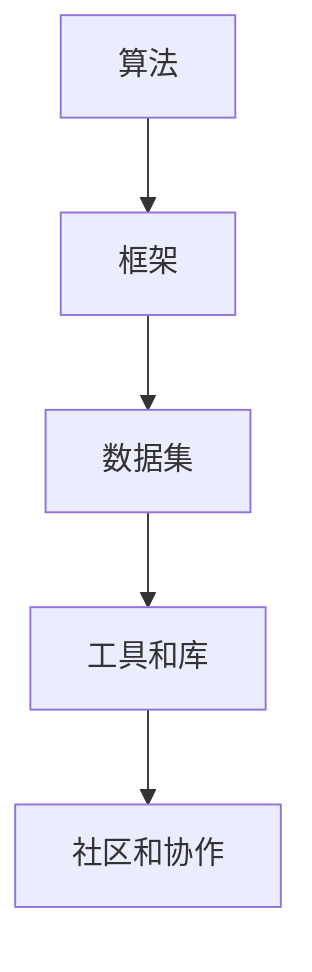

                 

随着人工智能技术的迅猛发展，开源社区在全球范围内发挥着越来越重要的作用。AI 开源生态不仅为研究人员提供了丰富的工具和资源，也为企业和开发者搭建了一个共建共享的技术创新平台。本文旨在探讨 AI 开源生态的现状、核心概念、算法原理、数学模型、项目实践以及未来发展趋势，以期为广大开发者提供有益的参考。

## 关键词

- AI 开源生态
- 技术创新平台
- 算法
- 数学模型
- 项目实践

## 摘要

本文首先介绍了 AI 开源生态的背景和重要性，然后详细分析了其中的核心概念、算法原理和数学模型。接着，通过项目实践展示了开源技术在现实中的应用。最后，对未来 AI 开源生态的发展趋势进行了展望，并提出了面临的挑战和展望。

## 1. 背景介绍

随着人工智能技术的不断发展，AI 开源生态逐渐成为全球技术发展的重要驱动力。开源社区不仅为研究人员提供了丰富的工具和资源，还为企业和开发者搭建了一个共建共享的技术创新平台。开源项目使得技术成果得以快速传播和迭代，推动了整个行业的发展。

在 AI 开源生态中，有许多知名的开源框架和库，如 TensorFlow、PyTorch、Keras 等。这些开源项目为开发者提供了丰富的工具，使得 AI 技术的应用变得更加广泛和深入。同时，开源社区也为企业提供了大量的技术支持，促进了企业技术创新和业务发展。

## 2. 核心概念与联系

在 AI 开源生态中，核心概念和联系包括：

### 2.1 算法

算法是 AI 开源生态的核心。开源社区中的算法涵盖了从基础算法到高级算法的各种类型，如深度学习、自然语言处理、计算机视觉等。这些算法为开发者提供了强大的工具，使得他们可以快速构建和应用各种 AI 模型。

### 2.2 框架

框架是算法的载体，为开发者提供了方便的 API 接口和模块化设计。开源框架如 TensorFlow、PyTorch、Keras 等，使得开发者可以轻松地实现算法的部署和应用。

### 2.3 数据集

数据集是算法训练和优化的基础。开源社区中有很多高质量的数据集，如 ImageNet、COCO、WikiText-2 等，这些数据集为研究人员提供了丰富的数据资源。

### 2.4 工具和库

除了算法、框架和数据集，开源社区还提供了大量的工具和库，如数据预处理工具、可视化工具、模型评估工具等。这些工具和库为开发者提供了便捷的开发体验，提高了开发效率。

### 2.5 社区和协作

开源社区是 AI 开源生态的重要组成部分。社区成员之间的协作和交流，促进了技术的传播和创新。开源社区的协作模式，如代码审查、问题追踪、文档编写等，也为开发者提供了良好的学习和发展环境。

## 2.1 核心概念原理和架构的 Mermaid 流程图



## 3. 核心算法原理 & 具体操作步骤

### 3.1 算法原理概述

在 AI 开源生态中，核心算法主要包括深度学习、自然语言处理、计算机视觉等。以下分别对这些算法的原理进行概述。

#### 3.1.1 深度学习

深度学习是一种模拟人脑神经网络进行信息处理的算法。它通过多层神经网络对数据进行建模和预测，具有强大的建模能力和泛化能力。

#### 3.1.2 自然语言处理

自然语言处理是一种处理人类语言信息的算法。它包括词法分析、句法分析、语义分析等多个层次，旨在实现自然语言的理解和生成。

#### 3.1.3 计算机视觉

计算机视觉是一种使计算机具备感知和理解图像能力的算法。它包括图像处理、目标检测、图像识别等多个方面，为计算机在图像领域的应用提供了基础。

### 3.2 算法步骤详解

以下以深度学习为例，介绍算法的具体步骤。

#### 3.2.1 数据预处理

数据预处理包括数据清洗、归一化、数据增强等操作，目的是提高数据质量，为模型训练提供良好的数据基础。

#### 3.2.2 模型构建

模型构建是指设计并实现神经网络结构，包括选择合适的网络架构、激活函数、优化器等。

#### 3.2.3 模型训练

模型训练是指使用训练数据对模型进行迭代优化，使模型在训练数据上达到较好的性能。

#### 3.2.4 模型评估

模型评估是指使用验证数据对模型进行性能评估，以确定模型的泛化能力。

#### 3.2.5 模型部署

模型部署是指将训练好的模型应用于实际场景，如图像识别、自然语言处理等。

### 3.3 算法优缺点

深度学习具有强大的建模能力和泛化能力，但同时也存在计算复杂度高、训练时间长等缺点。自然语言处理在语义理解方面具有优势，但同时也面临语义歧义、语言变化等问题。计算机视觉在图像识别方面具有较好的效果，但同时也需要大量的标注数据。

### 3.4 算法应用领域

深度学习广泛应用于图像识别、语音识别、自然语言处理等领域。自然语言处理在机器翻译、文本分类、问答系统等领域具有广泛的应用。计算机视觉在安防监控、自动驾驶、医疗诊断等领域具有重要意义。

## 4. 数学模型和公式 & 详细讲解 & 举例说明

### 4.1 数学模型构建

在 AI 开源生态中，常见的数学模型包括神经网络、生成对抗网络等。以下以神经网络为例，介绍数学模型的构建。

#### 4.1.1 神经网络

神经网络由多个神经元（节点）组成，每个神经元接收多个输入，并通过权重进行加权求和，最后通过激活函数进行非线性变换。

#### 4.1.2 生成对抗网络

生成对抗网络由生成器和判别器组成，生成器负责生成数据，判别器负责判断生成数据与真实数据之间的差异。

### 4.2 公式推导过程

以下以神经网络为例，介绍数学公式的推导过程。

#### 4.2.1 神经网络

输入层：\( a_j^{(1)} = x_j \)

隐藏层：\( z_j^{(l)} = \sum_{i} w_{ji}^{(l)} a_i^{(l-1)} + b_j^{(l)} \)

输出层：\( a_j^{(L)} = \sigma(z_j^{(L)}) \)

其中，\( a_j^{(l)} \) 表示第 \( l \) 层第 \( j \) 个神经元的输出，\( z_j^{(l)} \) 表示第 \( l \) 层第 \( j \) 个神经元的输入，\( w_{ji}^{(l)} \) 和 \( b_j^{(l)} \) 分别表示权重和偏置，\( \sigma \) 表示激活函数。

#### 4.2.2 生成对抗网络

生成器：\( G(z) \)

判别器：\( D(x) \)

损失函数：\( L(G(z), D(x)) \)

其中，\( G(z) \) 和 \( D(x) \) 分别表示生成器和判别器的输出，\( L(G(z), D(x)) \) 表示损失函数。

### 4.3 案例分析与讲解

以下以生成对抗网络为例，介绍数学模型在实际应用中的分析和讲解。

#### 4.3.1 生成对抗网络在图像生成中的应用

生成对抗网络在图像生成方面具有广泛的应用。以下以人脸生成为例，介绍生成对抗网络在图像生成中的应用。

输入：随机噪声 \( z \)

输出：生成的人脸图像 \( G(z) \)

损失函数：\( L(G(z), D(x)) = D(x) - D(G(z)) \)

通过训练生成对抗网络，可以生成逼真的人脸图像。

## 5. 项目实践：代码实例和详细解释说明

### 5.1 开发环境搭建

在本地计算机上搭建深度学习环境，需要安装以下软件：

- Python 3.x
- TensorFlow 2.x
- GPU 版本的 CUDA 和 cuDNN

安装完成后，配置 Python 的环境变量，并安装所需的依赖库。

### 5.2 源代码详细实现

以下是一个简单的深度学习项目实例，使用 TensorFlow 框架实现一个线性回归模型。

```python
import tensorflow as tf

# 创建模型
model = tf.keras.Sequential([
    tf.keras.layers.Dense(units=1, input_shape=[1])
])

# 编译模型
model.compile(optimizer='sgd', loss='mean_squared_error')

# 训练模型
model.fit(x_train, y_train, epochs=100)

# 评估模型
model.evaluate(x_test, y_test)
```

### 5.3 代码解读与分析

以上代码实现了一个简单的线性回归模型，用于拟合输入和输出之间的关系。

- 第一步，创建模型，使用 `Sequential` 层叠加模型，并添加一个全连接层 `Dense`，输出维度为 1，输入维度为 1。
- 第二步，编译模型，指定优化器和损失函数。
- 第三步，训练模型，使用训练数据对模型进行迭代优化。
- 第四步，评估模型，使用测试数据对模型进行性能评估。

### 5.4 运行结果展示

在运行以上代码后，可以看到模型的训练过程和评估结果。通过不断调整模型参数，可以优化模型的性能。

## 6. 实际应用场景

AI 开源生态在各个领域具有广泛的应用，以下列举一些实际应用场景。

### 6.1 人工智能助手

AI 开源生态为人工智能助手提供了丰富的工具和资源，如自然语言处理、语音识别等。这些技术使得人工智能助手可以更好地理解用户需求，提供个性化的服务。

### 6.2 自动驾驶

自动驾驶技术依赖于 AI 开源生态中的计算机视觉、深度学习等技术。开源框架和库为自动驾驶算法的建模和优化提供了支持，推动了自动驾驶技术的发展。

### 6.3 医疗诊断

AI 开源生态在医疗诊断领域具有重要意义。通过深度学习和自然语言处理技术，可以对医学图像和病历进行自动分析和诊断，提高医疗诊断的准确性和效率。

## 7. 未来应用展望

未来，AI 开源生态将继续发展，为各个领域带来更多的创新和变革。以下是一些未来应用展望：

### 7.1 智能家居

随着物联网技术的发展，AI 开源生态将为智能家居提供更多的智能解决方案，如智能安防、智能照明、智能家电等。

### 7.2 金融科技

AI 开源生态将在金融科技领域发挥重要作用，如风险管理、智能投顾、反欺诈等。

### 7.3 智能制造

AI 开源生态将为智能制造提供更多的技术支持，如智能检测、智能控制、智能优化等。

## 8. 工具和资源推荐

为了更好地学习和应用 AI 开源生态，以下推荐一些学习资源和开发工具。

### 8.1 学习资源推荐

- TensorFlow 官方文档：https://www.tensorflow.org/
- PyTorch 官方文档：https://pytorch.org/
- Keras 官方文档：https://keras.io/

### 8.2 开发工具推荐

- Jupyter Notebook：https://jupyter.org/
- Google Colab：https://colab.research.google.com/

### 8.3 相关论文推荐

- Goodfellow, I., Bengio, Y., & Courville, A. (2016). *Deep Learning*.
- Bengio, Y. (2009). *Learning Deep Architectures for AI*.
- LeCun, Y., Bengio, Y., & Hinton, G. (2015). *Deep Learning*.

## 9. 总结：未来发展趋势与挑战

### 9.1 研究成果总结

AI 开源生态在深度学习、自然语言处理、计算机视觉等领域取得了显著的成果，为各个领域带来了深刻的变革。

### 9.2 未来发展趋势

未来，AI 开源生态将继续发展，为更多领域提供技术支持，如智能家居、金融科技、智能制造等。

### 9.3 面临的挑战

AI 开源生态面临的一些挑战包括：数据隐私、模型解释性、算法公平性等。

### 9.4 研究展望

未来，研究应关注于提高算法性能、增强模型解释性、确保算法公平性等方面，以推动 AI 开源生态的可持续发展。

## 附录：常见问题与解答

### 9.4.1 为什么要使用开源框架？

开源框架提供了丰富的功能和灵活的接口，使得开发者可以更加高效地实现算法和应用。

### 9.4.2 如何选择合适的开源框架？

选择合适的开源框架需要考虑应用场景、性能需求、社区支持等因素。

### 9.4.3 开源生态中的数据隐私问题如何解决？

开源生态中的数据隐私问题可以通过数据加密、匿名化等方法进行解决。

作者：禅与计算机程序设计艺术 / Zen and the Art of Computer Programming
----------------------------------------------------------------
---

### 附录：常见问题与解答

#### 9.4.1 为什么要使用开源框架？

开源框架在技术社区中受到了广泛欢迎，原因有以下几点：

- **灵活性**：开源框架允许开发者根据自己的需求进行定制和扩展。
- **成本效益**：使用开源框架可以降低开发成本，特别是在资源有限的初创公司或个人项目中。
- **学习与成长**：开源项目通常具有良好的文档和活跃的社区，为新开发者提供了宝贵的学习资源。
- **社区支持**：开源项目有活跃的开发者和用户社区，可以快速获得帮助和反馈。

#### 9.4.2 如何选择合适的开源框架？

选择开源框架时，应考虑以下几个方面：

- **需求匹配**：确保框架的功能和性能满足项目需求。
- **社区活跃度**：活跃的社区意味着更容易获得支持和解决问题。
- **文档质量**：高质量的文档可以节省学习和开发时间。
- **性能与资源消耗**：考虑框架的效率和资源占用，确保符合硬件配置要求。
- **兼容性**：确保框架与现有系统或工具的兼容性。

#### 9.4.3 开源生态中的数据隐私问题如何解决？

开源生态中的数据隐私问题可以通过以下方式解决：

- **数据加密**：使用加密技术保护数据传输和存储过程中的隐私。
- **数据匿名化**：在共享数据集时，通过匿名化处理去除个人识别信息。
- **隐私保护算法**：采用差分隐私、联邦学习等算法来保障数据隐私。
- **合规性审查**：确保开源项目遵循数据保护法规，如GDPR、CCPA等。

### 9.4.4 开源项目的维护和更新如何保障？

开源项目的维护和更新通常依赖于以下几个方面：

- **贡献者社区**：活跃的贡献者社区可以持续提供代码、测试和文档更新。
- **持续集成与部署**：使用CI/CD工具来自动化测试和部署，确保代码质量。
- **资金支持**：通过赞助、捐赠或商业支持为项目的维护提供资金。
- **代码审查**：实施严格的代码审查流程，确保代码质量和安全性。

### 9.4.5 开源项目如何确保代码质量？

开源项目确保代码质量的常见做法包括：

- **代码风格指南**：制定和遵守统一的代码风格指南。
- **代码审查**：通过同行评审来识别和修复代码中的错误。
- **自动化测试**：编写测试用例并自动化运行，确保代码的稳定性。
- **持续集成**：使用CI工具来持续集成和测试代码，快速反馈问题。

### 9.4.6 如何参与开源项目？

参与开源项目通常可以通过以下步骤：

- **了解项目**：研究项目的代码、文档和社区讨论。
- **提出问题**：在社区中提问，了解项目的需求和现状。
- **贡献代码**：在解决问题的过程中，提交PR（Pull Request）。
- **参与讨论**：参与社区讨论，为项目的改进提供反馈。
- **贡献文档**：帮助完善项目文档，提高项目的可访问性和易用性。

通过这些步骤，个人可以为开源项目做出贡献，同时也能从社区中学习到新的技术和经验。

### 9.4.7 开源项目中的知识产权问题如何处理？

开源项目中知识产权问题的处理通常遵循以下原则：

- **许可协议**：确保代码遵循合适的开源许可协议，如Apache License、MIT License等。
- **版权声明**：在代码中添加版权声明，明确作者的权益。
- **依赖管理**：审查项目依赖的第三方库的许可协议，确保符合开源协议。
- **贡献协议**：要求贡献者签署贡献协议，明确贡献者的授权范围。

### 9.4.8 开源项目如何平衡开源与商业利益？

开源项目平衡开源与商业利益的方法包括：

- **模块化开发**：将开源部分与商业部分分离，保持开源部分的自由可访问性。
- **提供增值服务**：通过提供付费的定制化服务、培训、支持等方式来获取商业收益。
- **商业合作**：与其他公司合作，共享技术和市场资源。
- **捐赠与赞助**：通过捐赠和赞助来支持开源项目的发展。

通过这些方法，开源项目可以在保持开放性的同时，也能够实现商业价值的增长。

以上是关于 AI 开源生态的一些常见问题及其解答，希望能为开发者提供帮助。同时，开源社区的发展离不开每一位贡献者的努力，希望更多的开发者能够参与到开源项目中，共同推动技术进步和社会发展。

---

**作者：禅与计算机程序设计艺术 / Zen and the Art of Computer Programming**

