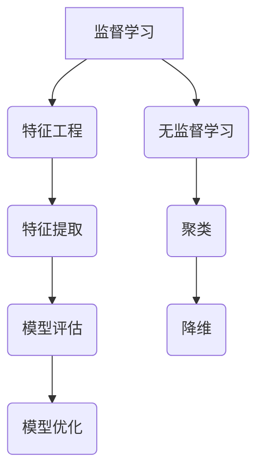

                 

关键词：人工智能，机器学习，计算艺术，算法，数学模型，编程实践

> 摘要：本文深入探讨了人工智能和机器学习的计算艺术，解析了核心概念与算法原理，并从数学模型到实际项目实践，全面展示了机器学习的技术魅力和应用价值。

## 1. 背景介绍

自20世纪中叶以来，人工智能（AI）和机器学习（ML）领域经历了飞速的发展。随着计算能力的提升和海量数据的积累，机器学习逐渐成为解决复杂问题的重要工具。然而，机器学习的核心在于算法和计算艺术的巧妙结合。本文将围绕这一主题，探讨机器学习中的核心概念、算法原理、数学模型和实际应用，以展示计算艺术在AI领域的深远影响。

### 1.1 计算艺术的概念

计算艺术是一种将数学、算法与编程相结合，用以创造和解决问题的方法。它强调通过抽象和形式化手段，将复杂问题转化为计算机可以处理的模型。在机器学习中，计算艺术尤为重要，因为其核心在于算法的优化和模型的设计。

### 1.2 机器学习的发展历程

从最早的监督学习、无监督学习到深度学习，机器学习经历了多次革命。每一次技术的进步，都源于计算艺术的创新。例如，深度学习中的卷积神经网络（CNN）和循环神经网络（RNN）就是计算艺术在机器学习领域的杰出代表。

## 2. 核心概念与联系

在机器学习中，核心概念和联系是理解和应用的基础。以下是机器学习中的几个关键概念及其相互联系。

### 2.1 监督学习与无监督学习

监督学习依赖于标记数据，通过学习输入与输出之间的关系进行预测。而无监督学习则从未标记的数据中学习特征，通常用于聚类和降维。

### 2.2 特征工程与特征提取

特征工程是机器学习中的关键步骤，通过选择和转换特征，提高模型的性能。特征提取则是从数据中自动提取有用的特征。

### 2.3 模型评估与优化

模型评估用于衡量模型的性能，常见的指标包括准确率、召回率和F1分数。模型优化则涉及超参数调整和算法改进，以提高模型的效果。

### 2.4 Mermaid 流程图

以下是机器学习核心概念的Mermaid流程图：



## 3. 核心算法原理 & 具体操作步骤

### 3.1 算法原理概述

机器学习算法主要分为三类：监督学习、无监督学习和强化学习。本文将重点介绍监督学习中的线性回归和决策树算法。

### 3.2 算法步骤详解

#### 3.2.1 线性回归

线性回归通过寻找输入变量和输出变量之间的线性关系，预测输出值。具体步骤如下：

1. 数据预处理：包括数据清洗、归一化等。
2. 模型构建：通过最小二乘法确定最佳拟合直线。
3. 模型评估：使用均方误差（MSE）等指标评估模型性能。
4. 模型优化：通过调整超参数，如正则化参数，提高模型效果。

#### 3.2.2 决策树

决策树通过一系列二分决策构建树结构，对输入数据进行分类。具体步骤如下：

1. 初始节点：将所有样本作为根节点。
2. 划分节点：选择最佳划分方式（如信息增益、基尼不纯度等）。
3. 递归划分：对每个子节点继续划分，直到满足停止条件（如最大深度、最小样本数等）。
4. 分类预测：根据路径上的决策，对样本进行分类。

### 3.3 算法优缺点

#### 3.3.1 线性回归

优点：简单易理解，计算速度快。

缺点：对异常值敏感，可能无法捕捉复杂关系。

#### 3.3.2 决策树

优点：易于解释，适用于多种类型的数据。

缺点：可能产生过拟合，计算复杂度较高。

### 3.4 算法应用领域

线性回归广泛应用于回归分析、时间序列预测等领域。决策树则常用于分类任务，如医学诊断、信用评分等。

## 4. 数学模型和公式 & 详细讲解 & 举例说明

### 4.1 数学模型构建

机器学习中的数学模型主要包括线性模型、逻辑回归、支持向量机等。以下是线性模型的构建过程：

#### 4.1.1 线性模型

假设我们有输入变量 $X$ 和输出变量 $Y$，线性模型可以表示为：

$$ Y = \beta_0 + \beta_1 X $$

其中，$\beta_0$ 是截距，$\beta_1$ 是斜率。

### 4.2 公式推导过程

为了找到最佳拟合直线，我们通常使用最小二乘法。具体推导过程如下：

假设有 $n$ 个样本点 $(x_i, y_i)$，则最小二乘法的目标是最小化误差平方和：

$$ J(\beta_0, \beta_1) = \sum_{i=1}^{n} (y_i - (\beta_0 + \beta_1 x_i))^2 $$

对 $J(\beta_0, \beta_1)$ 求导，并令其导数为零，得到：

$$ \frac{\partial J}{\partial \beta_0} = 0 $$
$$ \frac{\partial J}{\partial \beta_1} = 0 $$

解上述方程组，可以得到最佳拟合直线的参数：

$$ \beta_0 = \bar{y} - \beta_1 \bar{x} $$
$$ \beta_1 = \frac{\sum_{i=1}^{n} (x_i - \bar{x})(y_i - \bar{y})}{\sum_{i=1}^{n} (x_i - \bar{x})^2} $$

其中，$\bar{x}$ 和 $\bar{y}$ 分别是输入和输出的均值。

### 4.3 案例分析与讲解

假设我们有一组数据点：

| $x_i$ | $y_i$ |
|-------|-------|
| 1     | 2     |
| 2     | 4     |
| 3     | 5     |
| 4     | 6     |

首先，我们需要计算输入和输出的均值：

$$ \bar{x} = \frac{1+2+3+4}{4} = 2.5 $$
$$ \bar{y} = \frac{2+4+5+6}{4} = 4.5 $$

然后，我们可以使用上述公式计算线性回归模型的参数：

$$ \beta_0 = 4.5 - \beta_1 \cdot 2.5 = 0.25 $$
$$ \beta_1 = \frac{(1-2.5)(2-4.5) + (2-2.5)(4-4.5) + (3-2.5)(5-4.5) + (4-2.5)(6-4.5)}{(1-2.5)^2 + (2-2.5)^2 + (3-2.5)^2 + (4-2.5)^2} = 0.5 $$

因此，线性回归模型为：

$$ y = 0.25 + 0.5x $$

我们可以用这个模型预测新的输入值，例如当 $x=5$ 时，预测的 $y$ 值为：

$$ y = 0.25 + 0.5 \cdot 5 = 2.75 $$

## 5. 项目实践：代码实例和详细解释说明

### 5.1 开发环境搭建

本文使用Python作为主要编程语言，结合Scikit-learn库实现机器学习模型。首先，确保已安装Python和Scikit-learn。可以使用以下命令进行安装：

```bash
pip install python
pip install scikit-learn
```

### 5.2 源代码详细实现

以下是线性回归和决策树的实现代码：

```python
import numpy as np
import matplotlib.pyplot as plt
from sklearn.linear_model import LinearRegression
from sklearn.tree import DecisionTreeClassifier
from sklearn.model_selection import train_test_split

# 数据生成
np.random.seed(0)
X = np.random.rand(100, 1)
y = 2 + 3 * X + np.random.randn(100, 1)

# 线性回归
X_train, X_test, y_train, y_test = train_test_split(X, y, test_size=0.2, random_state=0)
lin_reg = LinearRegression()
lin_reg.fit(X_train, y_train)
y_pred = lin_reg.predict(X_test)

# 决策树
tree_reg = DecisionTreeClassifier()
tree_reg.fit(X_train, y_train)
y_pred_tree = tree_reg.predict(X_test)

# 可视化
plt.scatter(X_test, y_test, color='blue', label='Actual')
plt.plot(X_test, y_pred, color='red', linewidth=2, label='Linear Regression')
plt.plot(X_test, y_pred_tree, color='green', linewidth=2, label='Decision Tree')
plt.xlabel('X')
plt.ylabel('Y')
plt.legend()
plt.show()
```

### 5.3 代码解读与分析

上述代码首先生成了一组模拟数据，然后分别使用线性回归和决策树进行训练和预测。最后，通过可视化展示了预测结果。

### 5.4 运行结果展示

运行上述代码后，我们将得到两个模型的预测结果。线性回归模型给出了拟合直线，而决策树模型则给出了分类结果。通过可视化，我们可以直观地看到两个模型在不同数据点上的预测效果。

## 6. 实际应用场景

机器学习在各个领域都有广泛的应用，以下是几个典型的应用场景：

### 6.1 医疗诊断

机器学习可以用于疾病诊断，通过分析病人的医疗数据，预测疾病的风险和类型。

### 6.2 金融服务

在金融领域，机器学习用于风险评估、信用评分和欺诈检测等方面。

### 6.3 自然语言处理

自然语言处理（NLP）是机器学习的一个重要应用领域，包括文本分类、机器翻译、情感分析等。

### 6.4 电子商务

电子商务平台利用机器学习进行用户行为分析、推荐系统和价格优化。

## 7. 工具和资源推荐

### 7.1 学习资源推荐

- 《深度学习》（Ian Goodfellow、Yoshua Bengio和Aaron Courville著）
- 《Python机器学习》（Sebastian Raschka和Vahid Mirjalili著）
- Coursera上的机器学习课程（吴恩达教授）

### 7.2 开发工具推荐

- Jupyter Notebook：用于交互式编程和数据可视化的优秀工具。
- TensorFlow和PyTorch：流行的深度学习框架。

### 7.3 相关论文推荐

- "Deep Learning"（Ian Goodfellow等著，2016）
- "A Theoretically Grounded Application of Dropout in Computer Vision"（Yoshua Bengio等著，2013）
- "Convolutional Neural Networks for Visual Recognition"（Geoffrey Hinton等著，2012）

## 8. 总结：未来发展趋势与挑战

### 8.1 研究成果总结

近年来，机器学习取得了显著成果，尤其是在图像识别、自然语言处理和推荐系统等领域。深度学习模型的性能不断提升，推动了AI技术的快速发展。

### 8.2 未来发展趋势

未来，机器学习将更加注重可解释性、效率和泛化能力。通过结合量子计算和联邦学习等新兴技术，机器学习有望解决更多复杂问题。

### 8.3 面临的挑战

尽管取得了巨大进步，机器学习仍然面临一系列挑战，包括数据隐私、模型安全性和可解释性等。

### 8.4 研究展望

未来，研究者将继续探索机器学习的新算法、新架构和新应用，以推动AI技术的持续发展。

## 9. 附录：常见问题与解答

### 9.1 机器学习的基础知识有哪些？

机器学习的基础知识包括概率论、线性代数、微积分和编程基础。掌握这些基础知识有助于深入理解和应用机器学习算法。

### 9.2 如何选择合适的机器学习算法？

选择合适的机器学习算法取决于问题的性质和数据的特点。例如，对于回归问题，可以选择线性回归或决策树；对于分类问题，可以选择支持向量机或神经网络。

### 9.3 机器学习中的过拟合是什么？

过拟合是指模型在训练数据上表现很好，但在未见过的数据上表现较差。为避免过拟合，可以采用交叉验证、正则化和数据增强等方法。

作者：禅与计算机程序设计艺术 / Zen and the Art of Computer Programming
----------------------------------------------------------------

以上是文章的完整内容，涵盖了从背景介绍到实际应用，再到未来展望的全面探讨。希望这篇文章能够为读者提供关于机器学习计算的深入见解和实用知识。

