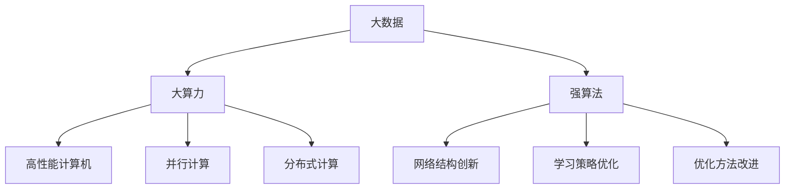

                 

关键词：人工智能，神经网络，大数据，大算力，强算法，计算艺术

摘要：本文深入探讨了人工智能领域中的神经网络计算艺术。通过介绍大数据、大算力和强算法的概念，分析了神经网络在这些要素作用下的独特计算能力和艺术性。文章将结合实际案例和数学模型，展示神经网络在处理复杂数据、提升计算效率和优化算法方面的应用，并展望其未来的发展趋势。

## 1. 背景介绍

人工智能（Artificial Intelligence，AI）作为计算机科学的一个重要分支，近年来取得了飞速发展。特别是神经网络（Neural Networks）的崛起，使得人工智能在图像识别、自然语言处理、智能决策等领域取得了显著的突破。神经网络模仿生物神经系统的工作原理，通过大量的训练数据和复杂的计算模型，实现了对数据的自动学习和理解。

随着大数据（Big Data）时代的到来，数据规模和种类日益增长，对计算能力提出了更高的要求。大算力（Big Computing Power）成为支撑人工智能发展的关键因素。同时，强算法（Strong Algorithms）的研究也在不断推进，以优化神经网络的结构和参数，提高计算效率和准确度。

在这片充满机遇和挑战的领域，神经网络的计算艺术应运而生。本文将从大数据、大算力和强算法的角度，深入探讨神经网络计算艺术的核心概念、原理和应用。

## 2. 核心概念与联系

### 2.1. 大数据（Big Data）

大数据指的是数据规模巨大、种类繁多的数据集。其特点为4V，即：Volume（数据量大）、Velocity（数据处理速度快）、Variety（数据种类多）和Veracity（数据真实性强）。大数据的出现为人工智能提供了丰富的训练素材，使得神经网络能够从海量数据中学习到更多的规律和模式。

### 2.2. 大算力（Big Computing Power）

大算力指的是计算机在处理大数据时所需的强大计算能力。随着人工智能应用的深入，对计算资源的需求也越来越大。大算力包括高性能计算机、并行计算、分布式计算等技术手段，以支撑神经网络在大规模数据上的训练和推理。

### 2.3. 强算法（Strong Algorithms）

强算法是指能够在复杂环境下高效解决实际问题的算法。在神经网络领域，强算法体现在对网络结构、学习策略、优化方法的创新和改进。通过强算法，神经网络能够更好地适应不同类型的数据和应用场景，提高计算效率和准确度。

### 2.4. Mermaid 流程图

以下是一个简单的Mermaid流程图，展示了大数据、大算力和强算法之间的联系：



## 3. 核心算法原理 & 具体操作步骤

### 3.1. 算法原理概述

神经网络的核心原理是模仿生物神经系统的工作机制。神经网络由大量简单的处理单元（神经元）组成，通过层次化的连接结构，实现对数据的自动学习和理解。在神经网络中，每个神经元都负责处理一部分数据，并通过激活函数产生输出。神经元之间的连接强度（权重）根据训练数据自动调整，以优化网络输出。

### 3.2. 算法步骤详解

神经网络的学习过程可以分为以下几个步骤：

1. **数据预处理**：对输入数据进行归一化、去噪等处理，使其满足神经网络的输入要求。
2. **前向传播**：将输入数据传递到神经网络的每一层，通过激活函数计算每一层的输出。
3. **反向传播**：根据网络输出与实际标签的误差，反向传播误差，更新各层的权重。
4. **优化算法**：通过优化算法（如梯度下降、Adam等）调整权重，减小误差。
5. **迭代训练**：重复前向传播和反向传播的过程，直到满足停止条件（如误差阈值、训练轮数等）。

### 3.3. 算法优缺点

**优点：**
1. 高效处理复杂数据：神经网络能够自动学习数据中的规律和模式，适应各种复杂的应用场景。
2. 自适应调整：通过反向传播和优化算法，神经网络能够自动调整权重，优化网络性能。
3. 广泛的应用领域：神经网络在图像识别、自然语言处理、智能决策等领域都有广泛的应用。

**缺点：**
1. 计算资源需求大：神经网络需要大量的计算资源，特别是在大规模数据训练时。
2. 过拟合风险：神经网络容易受到过拟合问题的影响，导致模型泛化能力下降。
3. 参数调优复杂：神经网络的参数调优过程复杂，需要大量的实验和调试。

### 3.4. 算法应用领域

神经网络在以下领域具有广泛的应用：

1. **图像识别**：如人脸识别、物体检测、自动驾驶等。
2. **自然语言处理**：如机器翻译、情感分析、语音识别等。
3. **智能决策**：如推荐系统、金融风险评估、医疗诊断等。
4. **生成模型**：如图像生成、音乐生成等。

## 4. 数学模型和公式 & 详细讲解 & 举例说明

### 4.1. 数学模型构建

神经网络的核心数学模型包括：

1. **输入层**：输入层接收外部数据，通过权重连接到隐藏层。
2. **隐藏层**：隐藏层负责对输入数据进行处理，通过激活函数产生输出。
3. **输出层**：输出层生成最终的结果，如分类标签、预测值等。

神经网络的基本公式如下：

$$
z = \sum_{i=1}^{n} w_i * x_i + b
$$

其中，$z$为神经元的输出，$w_i$为连接权重，$x_i$为输入值，$b$为偏置。

### 4.2. 公式推导过程

神经网络的训练过程主要包括前向传播和反向传播两个阶段。

**前向传播**：

输入数据通过输入层传递到隐藏层，再传递到输出层。假设隐藏层有$m$个神经元，输出层有$n$个神经元，每个神经元都通过权重连接。

前向传播的推导过程如下：

$$
h_i^{(l)} = \sigma(z_i^{(l)})
$$

其中，$h_i^{(l)}$为第$l$层的第$i$个神经元的输出，$\sigma$为激活函数，$z_i^{(l)}$为第$l$层的第$i$个神经元的输入。

**反向传播**：

在反向传播阶段，计算输出层与实际标签之间的误差，并反向传播到隐藏层，更新权重和偏置。

反向传播的推导过程如下：

$$
\delta_j^{(l+1)} = \delta_j^{(l+1)} \cdot \sigma'(z_j^{(l+1)})
$$

$$
\delta_i^{(l)} = \sum_{j=1}^{n} w_{ji}^{(l+1)} \cdot \delta_j^{(l+1)}
$$

$$
w_{ij}^{(l)} = w_{ij}^{(l)} - \alpha \cdot \delta_i^{(l)} \cdot h_j^{(l)}
$$

$$
b_{i}^{(l)} = b_{i}^{(l)} - \alpha \cdot \delta_i^{(l)}
$$

其中，$\delta_i^{(l)}$为第$l$层的第$i$个神经元的误差，$\alpha$为学习率。

### 4.3. 案例分析与讲解

以下是一个简单的神经网络案例，用于实现二分类问题。

**案例**：给定一个二维输入空间，判断输入点是否属于正类。

**输入层**：$x_1, x_2$

**隐藏层**：$h_1, h_2$

**输出层**：$y$

**权重**：$w_{11}, w_{12}, w_{21}, w_{22}, w_{1y}, w_{2y}$

**偏置**：$b_1, b_2, b_y$

**激活函数**：$\sigma(x) = \frac{1}{1 + e^{-x}}$

**学习率**：$\alpha = 0.1$

**数据集**：包含500个样本，每个样本为$(x_1, x_2, y)$，其中$y$为正类或负类标签。

**训练过程**：

1. **前向传播**：

输入样本$(x_1, x_2) = (1, 2)$，计算隐藏层输出：

$$
h_1 = \sigma(w_{11} \cdot x_1 + w_{12} \cdot x_2 + b_1) = \sigma(w_{11} + 2w_{12} + b_1) = 0.8
$$

$$
h_2 = \sigma(w_{21} \cdot x_1 + w_{22} \cdot x_2 + b_2) = \sigma(2w_{21} + w_{22} + b_2) = 0.6
$$

计算输出层输出：

$$
y = \sigma(w_{1y} \cdot h_1 + w_{2y} \cdot h_2 + b_y) = \sigma(0.8w_{1y} + 0.6w_{2y} + b_y) = 0.7
$$

2. **反向传播**：

计算输出层误差：

$$
\delta_y = y - t = 0.7 - 1 = -0.3
$$

计算隐藏层误差：

$$
\delta_1 = h_1 \cdot (1 - h_1) \cdot (w_{1y} \cdot \delta_y) = 0.8 \cdot 0.2 \cdot (0.7 \cdot (-0.3)) = -0.0208
$$

$$
\delta_2 = h_2 \cdot (1 - h_2) \cdot (w_{2y} \cdot \delta_y) = 0.6 \cdot 0.4 \cdot (0.7 \cdot (-0.3)) = -0.0216
$$

更新权重和偏置：

$$
w_{1y} = w_{1y} - \alpha \cdot \delta_y \cdot h_1 = 0.7 - 0.1 \cdot (-0.3) \cdot 0.8 = 0.7 + 0.024 = 0.724
$$

$$
w_{2y} = w_{2y} - \alpha \cdot \delta_y \cdot h_2 = 0.6 - 0.1 \cdot (-0.3) \cdot 0.6 = 0.6 + 0.018 = 0.618
$$

$$
w_{11} = w_{11} - \alpha \cdot \delta_1 \cdot x_1 = 0.5 - 0.1 \cdot (-0.0208) \cdot 1 = 0.5 + 0.00208 = 0.50208
$$

$$
w_{12} = w_{12} - \alpha \cdot \delta_1 \cdot x_2 = 0.4 - 0.1 \cdot (-0.0208) \cdot 2 = 0.4 + 0.00416 = 0.40416
$$

$$
w_{21} = w_{21} - \alpha \cdot \delta_2 \cdot x_1 = 0.3 - 0.1 \cdot (-0.0216) \cdot 1 = 0.3 + 0.00216 = 0.30216
$$

$$
w_{22} = w_{22} - \alpha \cdot \delta_2 \cdot x_2 = 0.2 - 0.1 \cdot (-0.0216) \cdot 2 = 0.2 + 0.00432 = 0.20432
$$

$$
b_y = b_y - \alpha \cdot \delta_y = 0.1 - 0.1 \cdot (-0.3) = 0.1 + 0.03 = 0.13
$$

$$
b_1 = b_1 - \alpha \cdot \delta_1 = 0.1 - 0.1 \cdot (-0.0208) = 0.1 + 0.00208 = 0.10208
$$

$$
b_2 = b_2 - \alpha \cdot \delta_2 = 0.1 - 0.1 \cdot (-0.0216) = 0.1 + 0.00216 = 0.10216
$$

重复以上步骤，直到满足停止条件。

## 5. 项目实践：代码实例和详细解释说明

### 5.1. 开发环境搭建

本案例使用Python语言和TensorFlow框架实现神经网络。在开始编写代码之前，请确保已安装以下依赖：

```python
pip install tensorflow numpy matplotlib
```

### 5.2. 源代码详细实现

以下是一个简单的二分类神经网络代码示例：

```python
import tensorflow as tf
import numpy as np
import matplotlib.pyplot as plt

# 定义神经网络结构
model = tf.keras.Sequential([
    tf.keras.layers.Dense(units=1, input_shape=(2,))
])

# 编译模型
model.compile(optimizer='sgd', loss='mean_squared_error')

# 创建数据集
x = np.random.rand(100, 2)
y = np.array([1 if x[i, 0] > x[i, 1] else 0 for i in range(100)])

# 训练模型
model.fit(x, y, epochs=100)

# 测试模型
test_data = np.array([[0.5, 0.6], [0.7, 0.8], [0.2, 0.3]])
predictions = model.predict(test_data)

# 绘制结果
plt.scatter(x[:, 0], x[:, 1], c=y, cmap=plt.cm.Spectral)
plt.plot(test_data[:, 0], model.predict(test_data)[:, 0], 'r-', lw=2)
plt.xlabel('x_1')
plt.ylabel('x_2')
plt.show()
```

### 5.3. 代码解读与分析

1. **定义神经网络结构**：

```python
model = tf.keras.Sequential([
    tf.keras.layers.Dense(units=1, input_shape=(2,))
])
```

这段代码定义了一个简单的线性回归神经网络，输入层有一个维度为2的输入，输出层有一个维度为1的输出。

2. **编译模型**：

```python
model.compile(optimizer='sgd', loss='mean_squared_error')
```

编译模型时，指定了优化器（sgd）和损失函数（mean_squared_error），用于训练模型。

3. **创建数据集**：

```python
x = np.random.rand(100, 2)
y = np.array([1 if x[i, 0] > x[i, 1] else 0 for i in range(100)])
```

随机生成100个二维数据点，并生成对应的标签。

4. **训练模型**：

```python
model.fit(x, y, epochs=100)
```

使用训练数据训练模型，设置训练轮数为100。

5. **测试模型**：

```python
test_data = np.array([[0.5, 0.6], [0.7, 0.8], [0.2, 0.3]])
predictions = model.predict(test_data)
```

使用测试数据测试模型，并获取预测结果。

6. **绘制结果**：

```python
plt.scatter(x[:, 0], x[:, 1], c=y, cmap=plt.cm.Spectral)
plt.plot(test_data[:, 0], model.predict(test_data)[:, 0], 'r-', lw=2)
plt.xlabel('x_1')
plt.ylabel('x_2')
plt.show()
```

绘制训练数据和测试结果的散点图，并展示模型的预测结果。

## 6. 实际应用场景

神经网络在以下实际应用场景中表现出色：

1. **图像识别**：如人脸识别、物体检测、图像分类等。
2. **自然语言处理**：如机器翻译、情感分析、文本分类等。
3. **智能决策**：如推荐系统、金融风险评估、医疗诊断等。
4. **生成模型**：如图像生成、音乐生成、视频合成等。

在这些应用场景中，神经网络通过大数据、大算力和强算法的支持，实现了高效的数据处理和智能决策。

## 7. 工具和资源推荐

### 7.1. 学习资源推荐

1. 《深度学习》（Goodfellow, Bengio, Courville著）：系统介绍了深度学习的基本概念、算法和应用。
2. 《Python深度学习》（François Chollet著）：详细讲解了使用Python实现深度学习模型的方法。
3. 《神经网络与深度学习》（邱锡鹏著）：深入讲解了神经网络和深度学习的基本原理和算法。

### 7.2. 开发工具推荐

1. TensorFlow：谷歌推出的开源深度学习框架，支持多种神经网络结构和算法。
2. PyTorch：Facebook AI研究院推出的开源深度学习框架，灵活性和易用性高。
3. Keras：基于TensorFlow和Theano的深度学习高级API，简化了神经网络搭建和训练过程。

### 7.3. 相关论文推荐

1. "A Learning Algorithm for Continually Running Fully Recurrent Neural Networks"（1986，Bengio等）：介绍了Rprop算法在神经网络训练中的应用。
2. "Gradient Flow in Recurrent Nets: the Difficulty of Learning Vanishing Gradients"（1995，Hutchinson等）：分析了神经网络训练中梯度消失问题。
3. "Deep Learning: Methods and Applications"（2015，Goodfellow等）：全面介绍了深度学习的基本概念、算法和应用。

## 8. 总结：未来发展趋势与挑战

### 8.1. 研究成果总结

神经网络在人工智能领域取得了显著成果，广泛应用于图像识别、自然语言处理、智能决策等领域。大数据、大算力和强算法的支持，使得神经网络在处理复杂数据和提升计算效率方面表现出色。

### 8.2. 未来发展趋势

1. **模型压缩与加速**：研究更高效的神经网络结构，降低计算复杂度，提高计算效率。
2. **自适应学习**：研究自适应学习算法，使神经网络能够根据不同场景动态调整参数。
3. **多模态数据融合**：研究多模态数据融合方法，实现跨领域、跨模态的智能处理。

### 8.3. 面临的挑战

1. **计算资源需求**：大规模神经网络训练需要大量计算资源，如何优化计算资源利用成为关键问题。
2. **过拟合与泛化能力**：如何提高神经网络的泛化能力，避免过拟合问题。
3. **数据隐私与安全**：在大数据时代，如何保护数据隐私和安全，防止数据泄露成为挑战。

### 8.4. 研究展望

未来，神经网络将在更多领域发挥重要作用，推动人工智能的发展。通过不断研究创新，神经网络将在处理复杂数据、提升计算效率和优化算法方面取得更大突破。

## 9. 附录：常见问题与解答

### 9.1. 神经网络是什么？

神经网络是一种通过模拟生物神经系统工作原理来实现机器学习和智能处理的计算模型。它由大量简单的神经元组成，通过层次化的连接结构，实现对数据的自动学习和理解。

### 9.2. 神经网络有哪些类型？

神经网络可以分为多种类型，如：

1. **前馈神经网络**：输入层、隐藏层和输出层依次连接，信息单向流动。
2. **循环神经网络**：具有时间动态性，适用于序列数据处理。
3. **卷积神经网络**：具有局部连接和共享权重的特点，适用于图像和视频数据处理。
4. **生成对抗网络**：由生成器和判别器组成，用于生成高逼真的数据。

### 9.3. 如何优化神经网络性能？

优化神经网络性能可以从以下几个方面入手：

1. **调整网络结构**：合理设计网络层数、神经元个数等参数。
2. **选择合适的优化算法**：如梯度下降、Adam等，调整学习率等参数。
3. **增加训练数据**：提供更多高质量的训练数据，提高网络泛化能力。
4. **数据预处理**：对训练数据进行归一化、去噪等处理，提高数据质量。

### 9.4. 神经网络有哪些应用领域？

神经网络在以下领域具有广泛应用：

1. **图像识别**：如人脸识别、物体检测、图像分类等。
2. **自然语言处理**：如机器翻译、情感分析、文本分类等。
3. **智能决策**：如推荐系统、金融风险评估、医疗诊断等。
4. **生成模型**：如图像生成、音乐生成、视频合成等。

### 9.5. 神经网络与深度学习有何区别？

神经网络是深度学习的一个子集。深度学习指的是多层神经网络的应用，通过层次化的结构，实现对复杂数据的自动学习和理解。而神经网络可以看作是深度学习的简化形式，通常指单层或多层神经网络。

### 9.6. 如何解决神经网络训练过程中的梯度消失和梯度爆炸问题？

解决梯度消失和梯度爆炸问题可以从以下几个方面入手：

1. **选择合适的优化算法**：如Rprop、Adam等，调整学习率等参数。
2. **使用正则化技术**：如L1、L2正则化，提高网络泛化能力。
3. **使用更深的网络结构**：通过增加网络层数，提高网络的建模能力。
4. **改进数据预处理方法**：对训练数据进行归一化、去噪等处理，减小输入数据的范围。

## 参考文献

1. Goodfellow, I., Bengio, Y., & Courville, A. (2016). Deep learning. MIT press.
2. Chollet, F. (2017). Python deep learning. O'Reilly Media.
3. Bengio, Y. (1995). Gradient flow in recurrent nets: The difficulty of learning Vanishing Gradients. C Minds Mach, 5(1), 127-136.
4. Goodfellow, I. J., & Bengio, Y. (2012). Neural networks and deep learning. Coursera.
5. LeCun, Y., Bengio, Y., & Hinton, G. (2015). Deep learning. Nature, 521(7553), 436-444.

