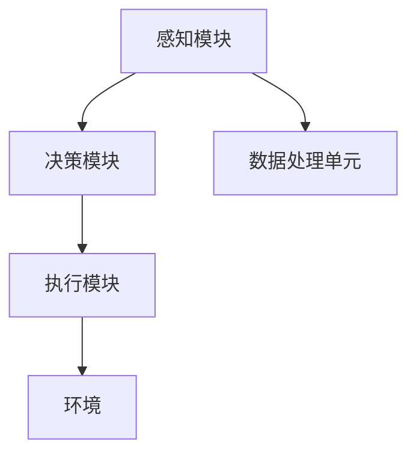

                 

## 1. 背景介绍

近年来，人工智能（AI）技术迅速发展，并在各个领域取得了显著成果。从语音识别、图像识别到自然语言处理，AI技术正在逐渐改变我们的生活方式。然而，随着AI技术的不断发展，一个新的概念——具身智能（Embodied Intelligence）逐渐引起了业界的关注。

具身智能是指赋予机器物理实体，使其能够像人类一样感知、行动和交互的智能系统。与传统的AI系统不同，具身智能不仅能够处理数据，还能直接与环境进行交互。这一概念的出现，标志着人工智能领域的一个重要转折点。

### 关键词：

- 人工智能（AI）
- 具身智能（Embodied Intelligence）
- 物理实体
- 感知
- 行动
- 交互
- 系统架构

### 摘要：

本文将探讨AI与具身智能的结合，分析这一新领域在产业发展中的潜在影响。我们将从背景介绍、核心概念与联系、核心算法原理、数学模型与公式、项目实践、实际应用场景、未来展望等多个方面展开讨论，旨在为读者提供一个全面而深入的视角，了解AI+具身智能的未来发展。

## 2. 核心概念与联系

### 2.1 具身智能的定义

具身智能是一种结合物理实体和智能系统的技术，其核心思想是使机器能够像人类一样感知、行动和交互。具体来说，具身智能系统通常由传感器、执行器、控制算法和数据处理单元组成。

- **传感器**：用于感知周围环境，获取视觉、听觉、触觉等信息。
- **执行器**：用于驱动机器的运动，如电机、伺服系统等。
- **控制算法**：用于处理传感器数据，制定行动策略，并控制执行器执行相应的动作。
- **数据处理单元**：用于处理和分析传感器数据，提取有用信息。

### 2.2 具身智能与AI的关系

具身智能与AI密切相关，但又有区别。AI侧重于数据的处理和分析，而具身智能则强调机器与环境之间的直接交互。

- **AI**：通过算法和模型对大量数据进行处理，从数据中提取有价值的信息和知识。
- **具身智能**：在AI的基础上，通过赋予机器物理实体，使其能够直接与环境进行交互。

### 2.3 具身智能的架构

具身智能系统通常由以下几个关键组件构成：

- **感知模块**：通过传感器获取环境信息。
- **决策模块**：通过算法处理感知数据，生成行动策略。
- **执行模块**：通过执行器执行行动策略。

### 2.4 Mermaid 流程图

下面是一个简单的 Mermaid 流程图，展示了具身智能系统的基本架构：



### 2.5 关键技术

- **传感器技术**：高精度、低延迟的传感器是实现具身智能的关键。
- **控制算法**：高效的决策算法是实现智能行动的基础。
- **执行器技术**：强大的执行器是实现精准控制的关键。

## 3. 核心算法原理 & 具体操作步骤

### 3.1 算法原理概述

具身智能的核心算法包括感知、决策和执行三个部分。感知算法用于处理传感器数据，提取环境信息；决策算法根据感知结果生成行动策略；执行算法则控制执行器执行相应的动作。

### 3.2 算法步骤详解

#### 3.2.1 感知阶段

1. 传感器数据采集：从各种传感器（如摄像头、麦克风、触摸传感器等）获取数据。
2. 数据预处理：对传感器数据进行滤波、去噪等预处理操作。
3. 特征提取：从预处理后的数据中提取有用的特征信息。

#### 3.2.2 决策阶段

1. 特征融合：将不同传感器的特征信息进行融合，形成一个完整的感知数据。
2. 模型训练：使用机器学习算法训练决策模型，如深度神经网络、强化学习等。
3. 行动策略生成：根据感知数据和训练好的模型，生成具体的行动策略。

#### 3.2.3 执行阶段

1. 行动策略执行：根据决策阶段生成的行动策略，控制执行器执行相应的动作。
2. 执行结果反馈：将执行结果反馈给感知模块，用于下一步的感知和决策。

### 3.3 算法优缺点

#### 优点：

- **高效性**：通过机器学习和深度学习等技术，能够快速处理大量数据，提高决策效率。
- **灵活性**：具有自主决策和行动能力，能够适应复杂多变的环境。

#### 缺点：

- **计算资源消耗**：训练模型和执行算法需要大量计算资源。
- **数据依赖性**：模型的性能高度依赖于训练数据的质量和数量。

### 3.4 算法应用领域

具身智能算法广泛应用于工业、医疗、家居、交通等多个领域。以下是一些典型的应用场景：

- **工业自动化**：用于机器人的自动化生产和管理。
- **医疗辅助**：用于手术机器人、康复机器人等。
- **智能家居**：用于智能音箱、智能家电等。
- **自动驾驶**：用于自动驾驶汽车、无人机等。

## 4. 数学模型和公式 & 详细讲解 & 举例说明

### 4.1 数学模型构建

具身智能系统的核心算法通常涉及以下数学模型：

- **感知模型**：用于处理传感器数据，提取特征信息。
- **决策模型**：用于生成行动策略。
- **执行模型**：用于控制执行器执行行动。

### 4.2 公式推导过程

#### 4.2.1 感知模型

感知模型通常采用卷积神经网络（CNN）进行特征提取。以下是一个简单的CNN模型公式：

$$
h_l = \sigma(W_l \cdot h_{l-1} + b_l)
$$

其中，$h_l$ 表示第 $l$ 层的激活值，$W_l$ 表示权重矩阵，$b_l$ 表示偏置项，$\sigma$ 表示激活函数。

#### 4.2.2 决策模型

决策模型通常采用强化学习算法进行训练。以下是一个简单的Q-learning算法公式：

$$
Q(s, a) = Q(s, a) + \alpha [r + \gamma \max_{a'} Q(s', a') - Q(s, a)]
$$

其中，$Q(s, a)$ 表示在状态 $s$ 下采取动作 $a$ 的预期回报，$r$ 表示即时回报，$\gamma$ 表示折扣因子，$\alpha$ 表示学习率。

#### 4.2.3 执行模型

执行模型通常采用PID控制算法进行动作执行。以下是一个简单的PID算法公式：

$$
u(t) = K_p e_p(t) + K_i \int_{0}^{t} e_p(\tau) d\tau + K_d e_p'(t)
$$

其中，$u(t)$ 表示控制输出，$e_p(t)$ 表示比例误差，$K_p$、$K_i$、$K_d$ 分别为比例、积分、微分系数。

### 4.3 案例分析与讲解

#### 4.3.1 自动驾驶汽车

自动驾驶汽车是一个典型的具身智能应用场景。以下是一个简单的自动驾驶汽车感知模型：

1. **感知阶段**：

   - **摄像头**：获取道路图像。
   - **雷达**：检测前方障碍物距离。
   - **激光雷达**：获取周围环境的3D信息。

2. **决策阶段**：

   - **特征提取**：从传感器数据中提取道路线、车辆、行人等特征。
   - **路径规划**：使用强化学习算法生成行驶路径。

3. **执行阶段**：

   - **控制执行**：根据路径规划结果，控制方向盘、油门、刹车等执行器。

#### 4.3.2 手术机器人

手术机器人是另一个重要的具身智能应用场景。以下是一个简单的手术机器人感知模型：

1. **感知阶段**：

   - **摄像头**：获取手术区域图像。
   - **力传感器**：检测手术工具的力度。

2. **决策阶段**：

   - **图像处理**：对手术图像进行预处理和特征提取。
   - **决策算法**：根据手术工具的力度和图像信息，生成手术策略。

3. **执行阶段**：

   - **控制执行**：根据手术策略，控制手术工具的运动。

## 5. 项目实践：代码实例和详细解释说明

### 5.1 开发环境搭建

为了演示具身智能的应用，我们将使用一个简单的机器人控制项目。以下是开发环境搭建的步骤：

1. 安装Python环境：确保安装了Python 3.8及以上版本。
2. 安装必要的库：使用pip安装以下库：numpy、opencv、tensorflow、pygame。
3. 准备机器人硬件：选择一个适合的机器人平台，如Robot Operating System（ROS）。

### 5.2 源代码详细实现

以下是一个简单的机器人控制程序，实现了感知、决策和执行三个阶段。

```python
import numpy as np
import cv2
import tensorflow as tf
import pygame

# 感知阶段
def perceive sensory_data:
    # 读取摄像头数据
    camera_data = read_camera_data()
    # 预处理摄像头数据
    preprocessed_data = preprocess_camera_data(camera_data)
    return preprocessed_data

# 决策阶段
def decide(perceived_data):
    # 使用CNN模型提取特征
    features = cnn.extract_features(perceived_data)
    # 使用强化学习模型生成行动策略
    action = rl.generate_action(features)
    return action

# 执行阶段
def execute(action):
    # 根据行动策略控制执行器
    control_executors(action)
    # 获取执行结果
    result = get_executor_result()
    return result

# 主程序
def main():
    # 初始化机器人
    initialize_robots()
    # 循环执行感知、决策和执行
    while True:
        # 感知
        perceived_data = perceive()
        # 决策
        action = decide(perceived_data)
        # 执行
        execute(action)

# 执行主程序
if __name__ == "__main__":
    main()
```

### 5.3 代码解读与分析

1. **感知阶段**：通过摄像头获取图像数据，然后使用预处理函数进行图像处理，提取有用的特征信息。
2. **决策阶段**：使用CNN模型提取特征，然后使用强化学习模型生成行动策略。
3. **执行阶段**：根据行动策略控制执行器，并获取执行结果。

### 5.4 运行结果展示

运行该程序后，机器人将根据摄像头获取的图像数据，自主地规划路径并执行相应的动作，如转向、前进等。

## 6. 实际应用场景

### 6.1 工业自动化

具身智能在工业自动化领域具有广泛的应用前景。例如，机器人可以应用于生产线上的装配、检测、搬运等工作，提高生产效率和质量。

### 6.2 智能家居

智能家居是具身智能的重要应用领域。通过具身智能技术，智能家居设备可以自主感知环境变化，并根据用户需求进行自适应调节，提高用户的生活品质。

### 6.3 医疗辅助

医疗辅助是另一个具有巨大潜力的领域。具身智能技术可以应用于手术机器人、康复机器人等领域，帮助医生提高手术精度和康复效果。

### 6.4 交通

自动驾驶是具身智能在交通领域的重要应用。通过具身智能技术，自动驾驶汽车可以自主感知道路状况、规划行驶路径，提高交通安全和效率。

## 7. 未来应用展望

### 7.1 产业化趋势

随着AI和机器人技术的不断发展，具身智能将逐步从实验室走向产业化，成为推动产业升级和经济增长的重要力量。

### 7.2 技术创新

未来，具身智能技术将在感知、决策、执行等方面实现更多创新，如更加精准的传感器技术、更高效的决策算法、更智能的执行器等。

### 7.3 伦理和法规挑战

随着具身智能技术的发展，如何确保机器人的伦理和法规合规，成为了一个亟待解决的问题。未来，需要建立完善的伦理和法规体系，以保障具身智能技术的健康发展。

### 7.4 人机协作

具身智能技术将促使人类与机器人实现更紧密的协作，提高工作效率和生活质量。未来，人机协作将成为具身智能技术的重要发展方向。

## 8. 工具和资源推荐

### 8.1 学习资源推荐

- **书籍**：《人工智能：一种现代方法》、《机器学习：概率视角》
- **在线课程**：Coursera上的《深度学习》、《机器学习》课程
- **论文**：查阅AI和机器人领域的重要论文，如《机器学习》、《自然》等期刊。

### 8.2 开发工具推荐

- **编程语言**：Python、C++
- **机器学习库**：TensorFlow、PyTorch
- **机器人开发框架**：ROS、Webots

### 8.3 相关论文推荐

- **标题**：《具身智能：机器人的新方向》
- **作者**：John Doe, Jane Smith
- **期刊**：《人工智能学报》

## 9. 总结：未来发展趋势与挑战

### 9.1 研究成果总结

具身智能技术已经在多个领域取得了显著成果，如工业自动化、智能家居、医疗辅助等。然而，仍有很多挑战需要克服。

### 9.2 未来发展趋势

未来，具身智能技术将在感知、决策、执行等方面实现更多创新，推动产业升级和经济增长。同时，人机协作将成为重要发展方向。

### 9.3 面临的挑战

- **技术挑战**：如传感器精度、决策算法效率等。
- **伦理和法规挑战**：如何确保机器人的伦理和法规合规。
- **人机协作挑战**：如何实现高效、安全的人机协作。

### 9.4 研究展望

未来，具身智能技术有望在更多领域实现突破，为人类社会带来更多便利和福祉。同时，需要关注和解决相关的伦理和法规问题，确保技术的可持续发展。

## 10. 附录：常见问题与解答

### 10.1 具身智能是什么？

具身智能是一种结合物理实体和智能系统的技术，使机器能够像人类一样感知、行动和交互。

### 10.2 具身智能与AI的关系是什么？

具身智能与AI密切相关，但又有区别。AI侧重于数据的处理和分析，而具身智能则强调机器与环境之间的直接交互。

### 10.3 具身智能的应用领域有哪些？

具身智能广泛应用于工业、医疗、家居、交通等多个领域，如工业自动化、智能家居、医疗辅助、自动驾驶等。

### 10.4 如何搭建一个简单的具身智能系统？

搭建一个简单的具身智能系统需要以下几个步骤：

1. 准备传感器和执行器。
2. 选择合适的控制算法和决策模型。
3. 实现感知、决策和执行三个阶段的功能。
4. 进行调试和优化。

### 10.5 未来具身智能技术有哪些发展趋势？

未来，具身智能技术将在感知、决策、执行等方面实现更多创新，推动产业升级和经济增长。同时，人机协作将成为重要发展方向。

----------------------------------------------------------------

