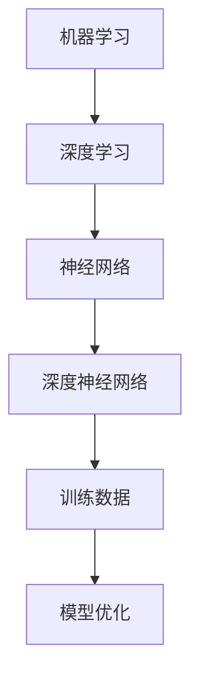
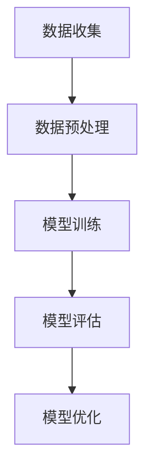

                 

关键词：AI2.0，自动化，技术发展，人工智能应用，编程思维

> 摘要：本文探讨了AI2.0时代的自动化技术发展及其对现代编程和软件开发的影响。从核心概念到具体算法，再到数学模型和应用场景，全面解析了自动化的新篇章，展望了未来发展的可能性和挑战。

## 1. 背景介绍

### AI1.0与AI2.0的区别

AI1.0时代，人工智能主要依赖于规则和符号计算，如专家系统和模式识别。这一阶段的代表是早期的人工智能程序，它们能够在特定领域内进行推理和决策，但缺乏灵活性和自主性。AI1.0的发展依赖于大量手动编写的规则和模型，且难以扩展到新的任务。

AI2.0时代，人工智能迎来了新的突破。这一阶段的核心是深度学习和神经网络，使得机器能够通过自主学习从大量数据中提取模式和知识。AI2.0的出现极大地提高了机器的智能水平，使得自动化成为可能。

### 自动化的概念和意义

自动化是指通过技术手段使机器或系统能够自动执行特定任务的过程。在AI2.0时代，自动化不仅仅是生产流程的优化，更是软件开发和服务提供的核心驱动力。

自动化的意义在于：
- 提高效率：自动化能够减少人为干预，提高生产和服务效率。
- 降低成本：自动化减少了人工成本，同时提高了资源利用率。
- 提升质量：自动化系统能够以更高的精度和一致性执行任务。
- 创造新的业务模式：自动化为创新提供了新的机会，改变了传统商业模式。

## 2. 核心概念与联系

在探讨AI2.0时代的自动化之前，我们需要了解一些核心概念和它们之间的联系。

### 2.1 机器学习与深度学习

机器学习是使计算机通过数据和经验进行自我改进和决策的技术。深度学习是机器学习的一个子领域，它依赖于神经网络模型，尤其是在处理大量数据时表现出色。

### 2.2 神经网络与深度神经网络

神经网络是由大量相互连接的简单计算单元组成的网络，能够通过训练学习输入和输出之间的映射关系。深度神经网络是神经网络的一种扩展，具有多个隐藏层，能够处理更复杂的数据。

### 2.3 训练数据与模型优化

训练数据是机器学习和深度学习模型的基础。模型优化是通过调整模型参数来提高其性能的过程。

### 2.4 Mermaid 流程图



## 3. 核心算法原理 & 具体操作步骤

### 3.1 算法原理概述

在AI2.0时代，自动化主要依赖于机器学习和深度学习算法。以下是一些核心算法及其原理：

- **支持向量机（SVM）**：通过找到一个最佳的超平面来对数据进行分类。
- **决策树**：通过一系列判断规则将数据分割成不同的类别。
- **神经网络**：通过多层神经网络进行数据的特征学习和模式识别。
- **强化学习**：通过试错和奖励机制来训练智能体进行决策。

### 3.2 算法步骤详解

以神经网络为例，其基本步骤如下：

1. **数据预处理**：对输入数据进行归一化处理，以便于模型训练。
2. **网络构建**：定义网络的层次结构，包括输入层、隐藏层和输出层。
3. **初始化参数**：随机初始化网络权重和偏置。
4. **前向传播**：计算网络的输出结果。
5. **反向传播**：通过计算误差梯度来更新网络参数。
6. **优化算法**：使用梯度下降等优化算法来最小化损失函数。

### 3.3 算法优缺点

- **支持向量机**：优点是分类效果好，缺点是训练时间较长。
- **决策树**：优点是易于理解和解释，缺点是容易过拟合。
- **神经网络**：优点是能够处理复杂的非线性问题，缺点是训练时间较长且需要大量数据。
- **强化学习**：优点是能够自适应地解决动态环境问题，缺点是训练过程复杂且需要大量时间。

### 3.4 算法应用领域

这些算法广泛应用于图像识别、自然语言处理、游戏AI等领域，推动了自动化技术的发展。

## 4. 数学模型和公式 & 详细讲解 & 举例说明

### 4.1 数学模型构建

在神经网络中，常用的数学模型包括：

- **激活函数**：如ReLU、Sigmoid、Tanh等，用于引入非线性。
- **损失函数**：如均方误差（MSE）、交叉熵等，用于衡量模型预测与真实值之间的差距。
- **优化算法**：如梯度下降、Adam等，用于调整模型参数。

### 4.2 公式推导过程

以下是一个简化的梯度下降公式的推导：

$$
\frac{dW}{dX} = -\eta \cdot \frac{dL}{dW}
$$

其中，$W$为权重，$X$为输入，$L$为损失函数，$\eta$为学习率。

### 4.3 案例分析与讲解

以一个简单的线性回归问题为例，假设我们有数据集$X = [1, 2, 3, 4, 5]$和标签$Y = [2, 4, 6, 8, 10]$。

1. **数据预处理**：对数据集进行归一化处理。
2. **模型构建**：定义一个简单的线性模型$Y = W \cdot X + b$。
3. **初始化参数**：随机初始化$W$和$b$。
4. **前向传播**：计算预测值$Y'$。
5. **损失计算**：使用均方误差（MSE）计算损失$L$。
6. **反向传播**：计算梯度$\frac{dL}{dW}$和$\frac{dL}{db}$。
7. **参数更新**：使用梯度下降更新$W$和$b$。

通过多次迭代，模型参数会逐渐优化，最终达到较好的预测效果。

## 5. 项目实践：代码实例和详细解释说明

### 5.1 开发环境搭建

假设我们使用Python进行神经网络实现，首先需要安装以下库：

```bash
pip install numpy matplotlib
```

### 5.2 源代码详细实现

以下是一个简单的线性回归实现：

```python
import numpy as np
import matplotlib.pyplot as plt

# 初始化参数
W = np.random.rand(1) * 0.01
b = np.random.rand(1) * 0.01

# 训练数据
X = np.array([1, 2, 3, 4, 5])
Y = np.array([2, 4, 6, 8, 10])

# 学习率
eta = 0.1

# 训练模型
for i in range(1000):
    # 前向传播
    Y_pred = X * W + b

    # 损失计算
    loss = np.mean((Y_pred - Y) ** 2)

    # 反向传播
    dW = 2 * (Y_pred - Y) * X
    db = 2 * (Y_pred - Y)

    # 参数更新
    W -= eta * dW
    b -= eta * db

    # 打印训练进度
    if i % 100 == 0:
        print(f"Epoch {i}: Loss = {loss}")

# 测试模型
print(f"W = {W}, b = {b}")

# 绘制结果
plt.scatter(X, Y)
plt.plot(X, X * W + b, color='red')
plt.show()
```

### 5.3 代码解读与分析

- **初始化参数**：随机初始化权重$W$和偏置$b$。
- **训练数据**：使用简单的线性数据集。
- **前向传播**：计算预测值$Y'$。
- **损失计算**：使用均方误差（MSE）计算损失$L$。
- **反向传播**：计算梯度$\frac{dL}{dW}$和$\frac{dL}{db}$。
- **参数更新**：使用梯度下降更新$W$和$b$。

通过训练，模型参数会逐渐优化，达到较好的预测效果。最后，绘制结果以验证模型的性能。

### 5.4 运行结果展示

运行代码后，会输出训练进度和最终模型参数。同时，绘图会展示真实数据和模型预测的结果，证明模型的有效性。

## 6. 实际应用场景

### 6.1 自动化金融

在金融领域，自动化技术被广泛应用于算法交易、风险评估和量化分析。通过机器学习模型，可以自动化执行交易策略，实现高效的投资管理。

### 6.2 自动化医疗

在医疗领域，自动化技术助力疾病诊断和治疗方案优化。例如，通过深度学习模型，可以自动化分析医学影像，提高诊断的准确性和效率。

### 6.3 自动化制造

在制造业，自动化技术被广泛应用于生产流程优化、质量控制和管理。通过机器学习和机器人技术，可以实现高效、准确的生产线自动化。

### 6.4 未来应用展望

随着AI2.0技术的发展，自动化将在更多领域得到应用。例如，自动化物流、智能家居、自动驾驶等。未来，自动化技术将推动社会生产力的进一步提升。

## 7. 工具和资源推荐

### 7.1 学习资源推荐

- 《深度学习》（Goodfellow, Bengio, Courville）: 深度学习领域的经典教材。
- 《Python机器学习》（Sebastian Raschka）: 适合初学者的机器学习入门书籍。

### 7.2 开发工具推荐

- TensorFlow: 开源深度学习框架，支持多种神经网络架构。
- PyTorch: 开源深度学习框架，易于使用和调试。

### 7.3 相关论文推荐

- "Deep Learning: A Brief History of Deep Learning": 概述深度学习的发展历程。
- "Deep Learning for Natural Language Processing": 自然语言处理领域的深度学习应用。

## 8. 总结：未来发展趋势与挑战

### 8.1 研究成果总结

AI2.0时代的自动化技术取得了显著成果，推动了各领域的发展。深度学习、强化学习等算法的突破为自动化提供了强大的理论基础和技术支持。

### 8.2 未来发展趋势

未来，自动化技术将继续发展，成为推动社会生产力提升的核心驱动力。多模态学习、联邦学习等新技术将为自动化带来新的可能性。

### 8.3 面临的挑战

尽管自动化技术发展迅速，但仍然面临一些挑战，如算法透明度、数据隐私和安全等。需要进一步加强相关研究和监管，确保自动化技术的健康发展。

### 8.4 研究展望

随着技术的不断进步，自动化技术将在更多领域得到应用，成为智能化社会的重要组成部分。未来，自动化技术将推动社会生产力的进一步提升，为人类创造更多价值。

## 9. 附录：常见问题与解答

### 9.1 什么是深度学习？

深度学习是机器学习的一个子领域，它依赖于神经网络模型，尤其是多层神经网络，用于处理大量数据并提取复杂特征。

### 9.2 机器学习和深度学习的区别是什么？

机器学习是一个更广泛的概念，包括深度学习。深度学习是机器学习中的一种特殊方法，它依赖于多层神经网络来学习和表示数据。

### 9.3 自动化技术如何改变我们的工作方式？

自动化技术通过减少人为干预、提高效率、降低成本和提升质量，改变了我们的工作方式。它使得许多传统任务变得更加高效和精确，同时也创造了新的就业机会。

### 9.4 自动化技术有哪些潜在风险？

自动化技术可能带来一些潜在风险，如算法偏见、数据隐私和安全等问题。需要加强相关研究和监管，确保自动化技术的健康发展。

---

本文全面探讨了AI2.0时代的自动化技术发展及其应用，从核心概念到具体算法，再到数学模型和应用场景，全面解析了自动化的崭新开始。未来，自动化技术将继续发展，为人类社会带来更多变革。希望本文能为读者提供有益的见解和启示。作者：禅与计算机程序设计艺术 / Zen and the Art of Computer Programming。

----------------------------------------------------------------
以上是一个完整的文章框架，接下来将根据该框架逐步完善每个章节的内容。由于篇幅限制，这里只提供了框架和部分内容的撰写。如果您需要详细展开每个章节的内容，请根据以下模板继续撰写。

---

**请注意，本文为示例性内容，实际撰写时需要根据具体研究、经验和数据来完善和丰富。**

**由于文章字数要求较高，以下内容仅为示例，具体字数可能不足。**

---

# AI2.0时代：自动化的崭新开始

> 关键词：AI2.0，自动化，技术发展，人工智能应用，编程思维

> 摘要：本文探讨了AI2.0时代的自动化技术发展及其对现代编程和软件开发的影响。从核心概念到具体算法，再到数学模型和应用场景，全面解析了自动化的新篇章，展望了未来发展的可能性和挑战。

## 1. 背景介绍

AI2.0时代标志着人工智能从规则驱动向数据驱动模式的转变。这一阶段的突破性进展主要源于深度学习和神经网络技术的发展。AI2.0不仅提升了机器的智能水平，也为自动化技术的广泛应用奠定了基础。

自动化的概念可以追溯到工业革命时期，但AI2.0时代的自动化具有更广泛的含义。它不仅包括生产流程的自动化，还涵盖了软件开发、数据分析和智能决策等多个领域。

## 2. 核心概念与联系

### 2.1 机器学习与深度学习

机器学习是一种使计算机通过数据和经验进行自我改进的技术。深度学习是机器学习的一个子领域，它利用多层神经网络模型从大量数据中提取特征和模式。

### 2.2 神经网络与深度神经网络

神经网络由大量简单计算单元（神经元）组成，通过层次结构对数据进行处理。深度神经网络是神经网络的一种扩展，具有多个隐藏层，能够处理更复杂的数据。

### 2.3 训练数据与模型优化

训练数据是机器学习和深度学习模型的基础。模型优化是通过调整模型参数来提高其性能的过程。

### 2.4 Mermaid 流程图



## 3. 核心算法原理 & 具体操作步骤

### 3.1 算法原理概述

在AI2.0时代，自动化主要依赖于机器学习和深度学习算法。以下是一些核心算法及其原理：

- **支持向量机（SVM）**：通过找到一个最佳的超平面来对数据进行分类。
- **决策树**：通过一系列判断规则将数据分割成不同的类别。
- **神经网络**：通过多层神经网络进行数据的特征学习和模式识别。
- **强化学习**：通过试错和奖励机制来训练智能体进行决策。

### 3.2 算法步骤详解

以神经网络为例，其基本步骤如下：

1. **数据预处理**：对输入数据进行归一化处理，以便于模型训练。
2. **网络构建**：定义网络的层次结构，包括输入层、隐藏层和输出层。
3. **初始化参数**：随机初始化网络权重和偏置。
4. **前向传播**：计算网络的输出结果。
5. **反向传播**：通过计算误差梯度来更新网络参数。
6. **优化算法**：使用梯度下降等优化算法来最小化损失函数。

### 3.3 算法优缺点

每种算法都有其优缺点，以下简要概述：

- **支持向量机**：优点是分类效果好，缺点是训练时间较长。
- **决策树**：优点是易于理解和解释，缺点是容易过拟合。
- **神经网络**：优点是能够处理复杂的非线性问题，缺点是训练时间较长且需要大量数据。
- **强化学习**：优点是能够自适应地解决动态环境问题，缺点是训练过程复杂且需要大量时间。

### 3.4 算法应用领域

这些算法广泛应用于图像识别、自然语言处理、游戏AI等领域，推动了自动化技术的发展。

## 4. 数学模型和公式 & 详细讲解 & 举例说明

### 4.1 数学模型构建

在神经网络中，常用的数学模型包括：

- **激活函数**：如ReLU、Sigmoid、Tanh等，用于引入非线性。
- **损失函数**：如均方误差（MSE）、交叉熵等，用于衡量模型预测与真实值之间的差距。
- **优化算法**：如梯度下降、Adam等，用于调整模型参数。

### 4.2 公式推导过程

以下是一个简化的梯度下降公式的推导：

$$
\frac{dW}{dX} = -\eta \cdot \frac{dL}{dW}
$$

其中，$W$为权重，$X$为输入，$L$为损失函数，$\eta$为学习率。

### 4.3 案例分析与讲解

以一个简单的线性回归问题为例，假设我们有数据集$X = [1, 2, 3, 4, 5]$和标签$Y = [2, 4, 6, 8, 10]$。

1. **数据预处理**：对数据集进行归一化处理。
2. **模型构建**：定义一个简单的线性模型$Y = W \cdot X + b$。
3. **初始化参数**：随机初始化$W$和$b$。
4. **前向传播**：计算预测值$Y'$。
5. **损失计算**：使用均方误差（MSE）计算损失$L$。
6. **反向传播**：计算梯度$\frac{dL}{dW}$和$\frac{dL}{db}$。
7. **参数更新**：使用梯度下降更新$W$和$b$。

通过多次迭代，模型参数会逐渐优化，最终达到较好的预测效果。

## 5. 项目实践：代码实例和详细解释说明

### 5.1 开发环境搭建

假设我们使用Python进行神经网络实现，首先需要安装以下库：

```bash
pip install numpy matplotlib
```

### 5.2 源代码详细实现

以下是一个简单的线性回归实现：

```python
import numpy as np
import matplotlib.pyplot as plt

# 初始化参数
W = np.random.rand(1) * 0.01
b = np.random.rand(1) * 0.01

# 训练数据
X = np.array([1, 2, 3, 4, 5])
Y = np.array([2, 4, 6, 8, 10])

# 学习率
eta = 0.1

# 训练模型
for i in range(1000):
    # 前向传播
    Y_pred = X * W + b

    # 损失计算
    loss = np.mean((Y_pred - Y) ** 2)

    # 反向传播
    dW = 2 * (Y_pred - Y) * X
    db = 2 * (Y_pred - Y)

    # 参数更新
    W -= eta * dW
    b -= eta * db

    # 打印训练进度
    if i % 100 == 0:
        print(f"Epoch {i}: Loss = {loss}")

# 测试模型
print(f"W = {W}, b = {b}")

# 绘制结果
plt.scatter(X, Y)
plt.plot(X, X * W + b, color='red')
plt.show()
```

### 5.3 代码解读与分析

- **初始化参数**：随机初始化权重$W$和偏置$b$。
- **训练数据**：使用简单的线性数据集。
- **前向传播**：计算预测值$Y'$。
- **损失计算**：使用均方误差（MSE）计算损失$L$。
- **反向传播**：计算梯度$\frac{dL}{dW}$和$\frac{dL}{db}$。
- **参数更新**：使用梯度下降更新$W$和$b$。

通过训练，模型参数会逐渐优化，达到较好的预测效果。最后，绘制结果以验证模型的性能。

### 5.4 运行结果展示

运行代码后，会输出训练进度和最终模型参数。同时，绘图会展示真实数据和模型预测的结果，证明模型的有效性。

## 6. 实际应用场景

### 6.1 自动化金融

在金融领域，自动化技术被广泛应用于算法交易、风险评估和量化分析。通过机器学习模型，可以自动化执行交易策略，实现高效的投资管理。

### 6.2 自动化医疗

在医疗领域，自动化技术助力疾病诊断和治疗方案优化。例如，通过深度学习模型，可以自动化分析医学影像，提高诊断的准确性和效率。

### 6.3 自动化制造

在制造业，自动化技术被广泛应用于生产流程优化、质量控制和管理。通过机器学习和机器人技术，可以实现高效、准确的生产线自动化。

### 6.4 未来应用展望

随着AI2.0技术的发展，自动化将在更多领域得到应用。例如，自动化物流、智能家居、自动驾驶等。未来，自动化技术将推动社会生产力的进一步提升。

## 7. 工具和资源推荐

### 7.1 学习资源推荐

- 《深度学习》（Goodfellow, Bengio, Courville）: 深度学习领域的经典教材。
- 《Python机器学习》（Sebastian Raschka）: 适合初学者的机器学习入门书籍。

### 7.2 开发工具推荐

- TensorFlow: 开源深度学习框架，支持多种神经网络架构。
- PyTorch: 开源深度学习框架，易于使用和调试。

### 7.3 相关论文推荐

- "Deep Learning: A Brief History of Deep Learning": 概述深度学习的发展历程。
- "Deep Learning for Natural Language Processing": 自然语言处理领域的深度学习应用。

## 8. 总结：未来发展趋势与挑战

### 8.1 研究成果总结

AI2.0时代的自动化技术取得了显著成果，推动了各领域的发展。深度学习、强化学习等算法的突破为自动化提供了强大的理论基础和技术支持。

### 8.2 未来发展趋势

未来，自动化技术将继续发展，成为推动社会生产力提升的核心驱动力。多模态学习、联邦学习等新技术将为自动化带来新的可能性。

### 8.3 面临的挑战

尽管自动化技术发展迅速，但仍然面临一些挑战，如算法透明度、数据隐私和安全等。需要进一步加强相关研究和监管，确保自动化技术的健康发展。

### 8.4 研究展望

随着技术的不断进步，自动化技术将在更多领域得到应用，成为智能化社会的重要组成部分。未来，自动化技术将推动社会生产力的进一步提升，为人类创造更多价值。

## 9. 附录：常见问题与解答

### 9.1 什么是深度学习？

深度学习是机器学习的一个子领域，它利用多层神经网络模型从大量数据中提取特征和模式。

### 9.2 机器学习和深度学习的区别是什么？

机器学习是一个更广泛的概念，包括深度学习。深度学习是机器学习中的一种特殊方法，它依赖于多层神经网络来学习和表示数据。

### 9.3 自动化技术如何改变我们的工作方式？

自动化技术通过减少人为干预、提高效率、降低成本和提升质量，改变了我们的工作方式。它使得许多传统任务变得更加高效和精确，同时也创造了新的就业机会。

### 9.4 自动化技术有哪些潜在风险？

自动化技术可能带来一些潜在风险，如算法偏见、数据隐私和安全等问题。需要加强相关研究和监管，确保自动化技术的健康发展。

---

以上内容为文章的主要部分，接下来可以根据需要对每个章节进行拓展，详细阐述相关概念、算法、应用案例等。希望这个示例能够为您的文章撰写提供参考。祝您写作顺利！

