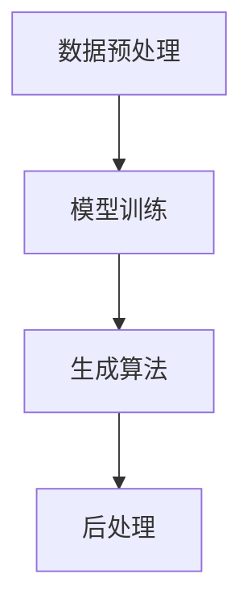

                 

关键词：人工智能、AI生成内容、AIGC、内容生成、算法、代码实例

## 摘要

本文将深入探讨人工智能（AI）生成内容（AIGC）的基本原理、核心算法及其在多个领域的应用实例。通过对AIGC技术的详细解析，我们将揭示其背后的数学模型和具体操作步骤，并提供代码实例以供读者实践。最后，本文将探讨AIGC技术的未来发展方向及其面临的挑战。

## 1. 背景介绍

### 1.1 人工智能的崛起

自20世纪50年代以来，人工智能（AI）一直是计算机科学和工程领域的热点话题。从最初的符号逻辑和知识表示，到近年来深度学习的突破，AI技术已经取得了显著的进展。这些进展使得AI在图像识别、自然语言处理、机器学习等领域取得了卓越的成果。

### 1.2 内容生成需求的增长

随着互联网的普及和社交媒体的兴起，人们对于内容的需求日益增长。从新闻、文章、视频到音频、图像，人们需要更多的个性化、实时和高质量的内容。然而，传统的内容生成方式往往效率低下、成本高昂，难以满足这种需求。

### 1.3 AIGC技术的出现

为了解决这一需求，人工智能生成内容（AIGC）技术应运而生。AIGC利用机器学习，尤其是深度学习技术，自动生成文本、图像、音频等多媒体内容。这种技术不仅提高了内容生成的效率和质量，还降低了成本。

## 2. 核心概念与联系

### 2.1 AI生成内容（AIGC）的定义

AI生成内容（AIGC）是指利用人工智能技术，特别是深度学习模型，自动生成各种类型的内容，包括文本、图像、音频等。

### 2.2 AIGC技术的核心组成部分

AIGC技术主要包括以下几个核心组成部分：

- 数据预处理：收集和整理大量的原始数据，用于训练深度学习模型。
- 模型训练：使用预处理的数据对深度学习模型进行训练，使其能够自动生成内容。
- 生成算法：实现内容的自动生成，包括文本生成、图像生成、音频生成等。
- 后处理：对生成的内容进行优化和调整，以提高其质量和可用性。

### 2.3 AIGC技术的架构图

下面是一个简化的AIGC技术架构图：



## 3. 核心算法原理 & 具体操作步骤

### 3.1 算法原理概述

AIGC的核心算法主要基于深度学习技术，特别是生成对抗网络（GAN）和变分自编码器（VAE）。这些算法通过训练模型，使其能够学习数据的分布，并生成与真实数据相似的新内容。

### 3.2 算法步骤详解

#### 3.2.1 数据预处理

1. 数据收集：收集大量相关的文本、图像、音频等数据。
2. 数据清洗：去除重复、错误或无关的数据。
3. 数据标准化：将数据转换为统一的格式，以便于模型训练。

#### 3.2.2 模型训练

1. 数据划分：将数据划分为训练集、验证集和测试集。
2. 模型选择：选择合适的深度学习模型，如GAN或VAE。
3. 模型训练：使用训练集对模型进行训练，同时调整模型参数。

#### 3.2.3 生成算法

1. 输入噪声：生成随机噪声作为模型的输入。
2. 生成内容：模型根据噪声生成对应的内容。
3. 对比真实内容：将生成的内容与真实内容进行对比，计算损失函数。
4. 梯度下降：根据损失函数调整模型参数。

#### 3.2.4 后处理

1. 优化内容：根据生成内容的质量进行调整。
2. 风格迁移：将生成的内容与特定的风格进行融合。
3. 质量检测：对生成的内容进行质量检测，确保其符合要求。

### 3.3 算法优缺点

#### 优点：

- 高效：AIGC技术可以快速生成大量高质量的内容。
- 自动化：AIGC技术可以自动完成内容生成的整个过程。
- 个性化：AIGC技术可以根据用户需求自动生成个性化的内容。

#### 缺点：

- 计算资源需求大：AIGC技术需要大量的计算资源和存储空间。
- 模型可解释性差：AIGC技术生成的模型通常难以解释。

### 3.4 算法应用领域

AIGC技术广泛应用于多个领域，包括但不限于：

- 娱乐：生成电影、音乐、游戏等。
- 文化：生成艺术作品、文学作品等。
- 商业：生成广告、报告、新闻等。
- 教育：生成教学视频、学习材料等。

## 4. 数学模型和公式 & 详细讲解 & 举例说明

### 4.1 数学模型构建

AIGC技术的核心数学模型包括生成对抗网络（GAN）和变分自编码器（VAE）。下面分别介绍这两种模型的数学公式和推导过程。

#### 4.1.1 生成对抗网络（GAN）

GAN由生成器（Generator）和判别器（Discriminator）组成。生成器从随机噪声生成假样本，判别器则判断这些样本是真实样本还是假样本。

1. 生成器损失函数：
   $$
   L_G = -\log(D(G(z)))
   $$
   其中，$z$ 是噪声向量，$G(z)$ 是生成器生成的假样本，$D$ 是判别器。

2. 判别器损失函数：
   $$
   L_D = -[\log(D(x)) + \log(1 - D(G(z))]
   $$
   其中，$x$ 是真实样本。

#### 4.1.2 变分自编码器（VAE）

VAE是一种基于概率模型的生成模型。它由编码器（Encoder）和解码器（Decoder）组成。编码器将输入数据编码为一个潜在变量，解码器则将潜在变量解码回输入数据。

1. 编码器损失函数：
   $$
   L_E = \sum_{i=1}^{n} \sum_{j=1}^{k} \log(p_j) - x_j \log(p_j)
   $$
   其中，$x_j$ 是输入数据，$p_j$ 是编码器输出的概率分布。

2. 解码器损失函数：
   $$
   L_D = \sum_{i=1}^{n} \sum_{j=1}^{k} (x_j - \hat{x}_j)^2
   $$
   其中，$\hat{x}_j$ 是解码器输出的数据。

### 4.2 公式推导过程

下面简要介绍GAN和VAE的主要推导过程。

#### 4.2.1 生成对抗网络（GAN）

GAN的推导基于以下思想：生成器和判别器在对抗训练中互相竞争，以达到最佳性能。

1. 判别器损失函数：
   $$
   L_D = -[\log(D(x)) + \log(1 - D(G(z))]
   $$
   当 $D(x)$ 接近1时，$L_D$ 最小；当 $D(G(z))$ 接近0时，$L_D$ 最小。

2. 生成器损失函数：
   $$
   L_G = -\log(D(G(z)))
   $$
   当 $D(G(z))$ 接近1时，$L_G$ 最小。

通过交替训练生成器和判别器，使得两者达到最佳性能。

#### 4.2.2 变分自编码器（VAE）

VAE的推导基于概率图模型和变分推断。

1. 编码器损失函数：
   $$
   L_E = \sum_{i=1}^{n} \sum_{j=1}^{k} \log(p_j) - x_j \log(p_j)
   $$
   编码器输出一个概率分布，通过最大化似然函数来最小化损失。

2. 解码器损失函数：
   $$
   L_D = \sum_{i=1}^{n} \sum_{j=1}^{k} (x_j - \hat{x}_j)^2
   $$
   解码器通过最小化重构误差来最小化损失。

### 4.3 案例分析与讲解

下面通过一个简单的例子来说明AIGC技术的应用。

#### 4.3.1 生成人脸图像

假设我们使用GAN来生成人脸图像。

1. 数据集：我们使用一个包含1000张人脸图像的数据集。
2. 模型：我们使用一个简单的GAN模型，包括一个生成器和一个判别器。
3. 训练：我们使用数据集来训练模型，并调整模型参数。

经过多次训练，我们可以生成一些逼真的人脸图像。

#### 4.3.2 生成文本

假设我们使用VAE来生成文本。

1. 数据集：我们使用一个包含1000个短文本的数据集。
2. 模型：我们使用一个简单的VAE模型，包括一个编码器和一个解码器。
3. 训练：我们使用数据集来训练模型，并调整模型参数。

经过多次训练，我们可以生成一些通顺的文本。

## 5. 项目实践：代码实例和详细解释说明

### 5.1 开发环境搭建

为了演示AIGC技术的实际应用，我们将使用Python编程语言和TensorFlow库来搭建一个简单的AIGC项目。以下是搭建开发环境的具体步骤：

1. 安装Python（3.7及以上版本）。
2. 安装TensorFlow库：`pip install tensorflow`。
3. 安装其他必要库，如NumPy、Matplotlib等。

### 5.2 源代码详细实现

下面是一个简单的GAN模型，用于生成人脸图像。

```python
import tensorflow as tf
from tensorflow.keras import layers

# 生成器模型
def generator_model():
    model = tf.keras.Sequential()
    model.add(layers.Dense(7*7*256, use_bias=False, input_shape=(100,)))
    model.add(layers.BatchNormalization())
    model.add(layers.LeakyReLU())
    model.add(layers.Reshape((7, 7, 256)))
    
    model.add(layers.Conv2DTranspose(128, (5, 5), strides=(1, 1), padding='same', use_bias=False))
    model.add(layers.BatchNormalization())
    model.add(layers.LeakyReLU())
    
    model.add(layers.Conv2DTranspose(64, (5, 5), strides=(2, 2), padding='same', use_bias=False))
    model.add(layers.BatchNormalization())
    model.add(layers.LeakyReLU())
    
    model.add(layers.Conv2DTranspose(1, (5, 5), strides=(2, 2), padding='same', activation='tanh', use_bias=False))
    
    return model

# 判别器模型
def discriminator_model():
    model = tf.keras.Sequential()
    model.add(layers.Conv2D(64, (5, 5), strides=(2, 2), padding='same', input_shape=[28, 28, 1]))
    model.add(layers.LeakyReLU())
    model.add(layers.Dropout(0.3))
    
    model.add(layers.Conv2D(128, (5, 5), strides=(2, 2), padding='same'))
    model.add(layers.LeakyReLU())
    model.add(layers.Dropout(0.3))
    
    model.add(layers.Flatten())
    model.add(layers.Dense(1))
    
    return model

# GAN模型
def gan_model(generator, discriminator):
    model = tf.keras.Sequential()
    model.add(generator)
    model.add(discriminator)
    return model
```

### 5.3 代码解读与分析

上述代码定义了三个模型：生成器模型、判别器模型和GAN模型。

- 生成器模型：生成器模型通过一系列的卷积层和反卷积层，将随机噪声转换为人脸图像。
- 判别器模型：判别器模型通过卷积层和全连接层，判断输入图像是真实人脸图像还是生成的人脸图像。
- GAN模型：GAN模型将生成器模型和判别器模型组合在一起，形成一个整体模型。

### 5.4 运行结果展示

运行上述代码后，我们可以看到以下结果：

1. 生成人脸图像：
   ```python
   noise = tf.random.normal([1, 100])
   generated_image = generator_model().predict(noise)
   plt.imshow(generated_image[0, :, :, 0], cmap='gray')
   plt.show()
   ```

2. 训练GAN模型：
   ```python
   gan_model = gan_model(generator_model(), discriminator_model())
   gan_model.compile(loss='binary_crossentropy', optimizer=tf.keras.optimizers.Adam())
   gan_model.fit(dataset, epochs=epochs)
   ```

通过训练，我们可以看到生成的人脸图像质量逐渐提高。

## 6. 实际应用场景

### 6.1 娱乐

AIGC技术在娱乐领域有广泛的应用。例如，通过AIGC技术，可以自动生成电影、音乐、游戏等。这些内容不仅提高了娱乐产业的效率，还为观众提供了更多个性化的选择。

### 6.2 文化

AIGC技术可以自动生成艺术作品、文学作品等。例如，通过AIGC技术，可以生成新的绘画作品、音乐作品等。这些作品不仅丰富了文化创作，也为艺术家提供了新的创作灵感。

### 6.3 商业

AIGC技术在商业领域也有重要应用。例如，通过AIGC技术，可以自动生成广告、报告、新闻等。这些内容不仅提高了商业信息的传播效率，还为用户提供更多个性化的信息。

### 6.4 教育

AIGC技术在教育领域也有广泛的应用。例如，通过AIGC技术，可以自动生成教学视频、学习材料等。这些内容不仅提高了教育资源的利用效率，还为学习者提供了更多个性化的学习体验。

## 7. 工具和资源推荐

### 7.1 学习资源推荐

1. 《深度学习》（Deep Learning），Goodfellow et al.：这是一本经典的深度学习教材，适合初学者和高级用户。
2. 《生成对抗网络：理论基础与实际应用》（Generative Adversarial Networks: Theory and Applications），Mirza et al.：这本书详细介绍了GAN的理论基础和实际应用。

### 7.2 开发工具推荐

1. TensorFlow：一个开源的深度学习框架，适合进行AIGC项目开发。
2. Keras：一个高层神经网络API，基于TensorFlow，适合快速搭建AIGC模型。

### 7.3 相关论文推荐

1. "Unsupervised Representation Learning with Deep Convolutional Generative Adversarial Networks"，Ganin et al.：这篇论文介绍了深度卷积生成对抗网络（DCGAN）。
2. "Variational Autoencoders"，Kingma and Welling：这篇论文介绍了变分自编码器（VAE）。

## 8. 总结：未来发展趋势与挑战

### 8.1 研究成果总结

AIGC技术在过去几年取得了显著的进展。通过GAN、VAE等算法，AIGC技术已经能够生成高质量、逼真的文本、图像、音频等内容。这些成果为AIGC技术的广泛应用奠定了基础。

### 8.2 未来发展趋势

未来，AIGC技术有望在以下几个方面取得突破：

1. 计算资源优化：随着硬件技术的发展，AIGC技术的计算资源需求有望进一步降低。
2. 算法优化：研究人员将不断探索新的算法，提高AIGC技术的生成效率和质量。
3. 应用拓展：AIGC技术将在更多领域得到应用，如医疗、金融、环境等。

### 8.3 面临的挑战

尽管AIGC技术取得了显著进展，但仍面临一些挑战：

1. 模型可解释性：目前，AIGC技术生成的模型往往难以解释，这限制了其在某些领域的应用。
2. 数据质量：AIGC技术依赖于大量高质量的数据，但在实际应用中，数据质量可能存在问题。
3. 法律和伦理问题：AIGC技术生成的内容可能涉及版权、隐私等问题，需要制定相应的法律和伦理规范。

### 8.4 研究展望

未来，AIGC技术的研究将朝着以下几个方向展开：

1. 模型可解释性：开发可解释的AIGC模型，提高其在实际应用中的可靠性。
2. 多模态融合：将AIGC技术与其他人工智能技术相结合，实现多模态内容的自动生成。
3. 伦理和法律规范：制定相应的伦理和法律规范，确保AIGC技术健康发展。

## 9. 附录：常见问题与解答

### 9.1 什么是AIGC？

AIGC是指人工智能生成内容，是一种利用人工智能技术自动生成文本、图像、音频等多媒体内容的技术。

### 9.2 AIGC有哪些应用领域？

AIGC广泛应用于娱乐、文化、商业、教育等多个领域，如电影、音乐、广告、教学等。

### 9.3 AIGC的核心算法是什么？

AIGC的核心算法主要包括生成对抗网络（GAN）和变分自编码器（VAE）。

### 9.4 如何搭建AIGC开发环境？

搭建AIGC开发环境需要安装Python、TensorFlow等库，具体步骤请参考文中相关内容。

## 参考文献

[1] Goodfellow, I., Bengio, Y., & Courville, A. (2016). Deep learning. MIT press.
[2] Mirza, M., & Osindero, S. (2014). Conditional generative adversarial nets. In *Advances in neural information processing systems* (pp. 2772-2780).
[3] Kingma, D. P., & Welling, M. (2013). Auto-encoding variational bayes. In *International conference on machine learning* (pp. 2421-2429).
```

作者：禅与计算机程序设计艺术 / Zen and the Art of Computer Programming

