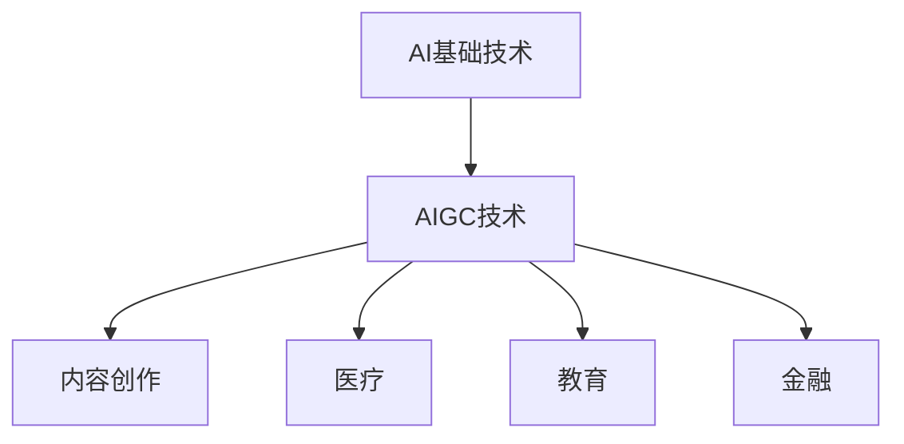

                 

关键词：AIGC，人工智能，图灵奖，计算机编程，多领域应用，全场景覆盖

摘要：随着人工智能技术的不断发展和成熟，AIGC（AI-Generated Content）作为一种新兴技术，正逐渐在多个领域和全场景中发挥重要作用。本文将深入探讨AIGC的概念、核心原理、算法、数学模型以及实际应用，旨在为广大读者提供一份从入门到实战的全面指南。

## 1. 背景介绍

人工智能（AI）作为计算机科学的一个分支，旨在使计算机具有人类智能。自从1956年达特茅斯会议上人工智能概念的提出以来，人工智能技术经历了数十年的发展，从最初的规则推理、知识表示，到近年来的深度学习、强化学习等，不断推动着计算机科学的发展。

随着人工智能技术的不断发展，AI 2.0的概念应运而生。AI 2.0不同于传统的AI，它强调AI的多领域、全场景应用，旨在实现AI与人类更加紧密、智能的交互。AIGC作为AI 2.0的重要分支，其核心在于利用人工智能技术自动生成内容，包括但不限于文本、图像、音频、视频等多种形式。

AIGC的发展不仅为人工智能领域带来了新的机遇，同时也对传统行业和产业带来了深远的影响。例如，在内容创作领域，AIGC可以自动生成文章、图片、音乐等，大大提高了内容生产的效率；在医疗领域，AIGC可以帮助医生进行病例分析、诊断等，提高了医疗服务的质量和效率；在教育领域，AIGC可以自动生成教学资源、习题等，为学生提供个性化的学习体验。

## 2. 核心概念与联系

### 2.1 AIGC的定义与原理

AIGC，即AI-Generated Content，指的是通过人工智能技术自动生成内容的过程。AIGC的核心在于利用机器学习、自然语言处理、图像处理等技术，模拟人类的创作过程，生成高质量的内容。

AIGC的工作原理可以分为以下几个步骤：

1. **数据收集与预处理**：收集大量的相关数据，并对数据进行预处理，包括数据清洗、去噪、归一化等，以便为后续的模型训练提供高质量的数据。
2. **模型训练**：利用收集到的数据，通过机器学习算法训练模型，使模型能够理解数据的特征和规律。
3. **内容生成**：通过训练好的模型，输入特定的任务需求，模型自动生成相应的内容。

### 2.2 AIGC的应用领域

AIGC的应用领域非常广泛，几乎涵盖了所有与内容创作相关的领域。以下是一些典型的应用领域：

1. **内容创作**：包括文章、图片、音乐、视频等多种形式。
2. **医疗**：包括病例分析、诊断、治疗方案制定等。
3. **教育**：包括教学资源生成、习题生成、个性化学习等。
4. **金融**：包括数据分析、风险评估、投资策略等。

### 2.3 AIGC与AI的关系

AIGC是AI 2.0的一个重要分支，它与传统的AI有着紧密的联系。AIGC依赖于AI的核心技术，如机器学习、自然语言处理、图像处理等。同时，AIGC又具有自己的独特性，它强调的是内容的自动生成，而不是简单的任务执行。

<|im_sep|>以下是AIGC与AI关系的Mermaid流程图：



## 3. 核心算法原理 & 具体操作步骤

### 3.1 算法原理概述

AIGC的核心算法主要包括生成对抗网络（GAN）、变分自编码器（VAE）等。这些算法通过模拟数据分布，生成与真实数据相似的内容。

GAN由生成器（Generator）和判别器（Discriminator）组成。生成器生成虚假数据，判别器判断数据是真实还是虚假。通过不断地训练，生成器逐渐生成更接近真实数据的内容。

VAE通过编码器和解码器实现数据的重建。编码器将输入数据映射到一个低维空间，解码器将低维空间的数据重建为输入数据。通过优化编码器和解码器的参数，VAE可以生成与输入数据相似的内容。

### 3.2 算法步骤详解

1. **数据收集与预处理**：收集大量的文本、图像、音频等数据，并进行数据清洗、去噪、归一化等预处理操作。

2. **模型选择**：根据应用场景选择合适的模型，如GAN、VAE等。

3. **模型训练**：
    - **GAN**：通过交替训练生成器和判别器，使生成器生成的数据逐渐接近真实数据。
    - **VAE**：通过优化编码器和解码器的参数，使解码器生成的数据接近输入数据。

4. **内容生成**：利用训练好的模型，输入特定的任务需求，生成相应的内容。

### 3.3 算法优缺点

- **GAN**：
    - 优点：能够生成高质量的内容，适用于多种应用场景。
    - 缺点：训练过程较为复杂，容易陷入模式崩溃。
- **VAE**：
    - 优点：生成效果稳定，易于训练。
    - 缺点：生成效果可能不如GAN。

### 3.4 算法应用领域

AIGC算法主要应用于内容创作、医疗、教育、金融等领域。以下是一些具体的案例：

- **内容创作**：通过AIGC算法自动生成文章、图片、音乐等，提高内容创作的效率。
- **医疗**：通过AIGC算法自动生成病例分析、诊断报告等，辅助医生进行诊断和治疗。
- **教育**：通过AIGC算法自动生成教学资源、习题等，为学生提供个性化的学习体验。
- **金融**：通过AIGC算法自动生成数据分析、投资策略等，提高金融决策的准确性。

## 4. 数学模型和公式 & 详细讲解 & 举例说明

### 4.1 数学模型构建

AIGC的核心算法，如GAN和VAE，都涉及到复杂的数学模型。以下简要介绍这些模型的构建过程。

#### 4.1.1 GAN

GAN由生成器G和判别器D组成。生成器G的目的是生成与真实数据相似的数据，判别器D的目的是区分真实数据和生成数据。

GAN的数学模型可以表示为：

$$
\begin{aligned}
\text{生成器：}G(x_{z}) &= \text{Noise}(z) + \text{Generator}(\theta_G) \\
\text{判别器：}D(x) &= \text{Discriminator}(\theta_D) \\
L_G &= -\mathbb{E}_{z}\left[\log(D(G(z)))\right] \\
L_D &= -\mathbb{E}_{x}\left[\log(D(x))\right] - \mathbb{E}_{z}\left[\log(1 - D(G(z)))\right]
\end{aligned}
$$

其中，$z$是噪声向量，$x$是真实数据，$x_{z}$是生成数据。

#### 4.1.2 VAE

VAE由编码器E和解码器D组成。编码器E将输入数据映射到一个低维空间，解码器D将低维空间的数据重建为输入数据。

VAE的数学模型可以表示为：

$$
\begin{aligned}
\text{编码器：}z &= \text{Encoder}(x|\theta_E) \\
\text{解码器：}x &= \text{Decoder}(z|\theta_D) \\
L &= \mathbb{E}_{z}\left[\log(D(z))\right] + \mathbb{E}_{x}\left[\log(D(x))\right]
\end{aligned}
$$

其中，$z$是编码后的数据，$x$是输入数据。

### 4.2 公式推导过程

以下简要介绍GAN和VAE的公式推导过程。

#### 4.2.1 GAN

GAN的目标是最小化判别器的损失函数，同时最大化生成器的损失函数。判别器的损失函数可以表示为：

$$
L_D = -\mathbb{E}_{x}\left[\log(D(x))\right] - \mathbb{E}_{z}\left[\log(1 - D(G(z)))\right]
$$

其中，$x$是真实数据，$z$是噪声向量。

生成器的损失函数可以表示为：

$$
L_G = -\mathbb{E}_{z}\left[\log(D(G(z)))\right]
$$

为了简化计算，通常使用梯度上升法优化生成器，梯度下降法优化判别器。

#### 4.2.2 VAE

VAE的目标是最小化损失函数。损失函数可以表示为：

$$
L = \mathbb{E}_{z}\left[\log(D(z))\right] + \mathbb{E}_{x}\left[\log(D(x))\right]
$$

其中，$z$是编码后的数据，$x$是输入数据。

为了优化编码器和解码器的参数，可以使用变分自编码器（VAE）的优化算法，如变分下降（Variational Inference）或反向传播（Backpropagation）。

### 4.3 案例分析与讲解

以下通过一个简单的例子，来说明GAN和VAE的应用。

#### 4.3.1 GAN应用

假设我们想要生成一张人脸图片。首先，我们需要收集大量的人脸图片作为训练数据。然后，我们选择GAN作为生成模型，训练生成器G和判别器D。

1. **数据收集与预处理**：收集大量人脸图片，并进行数据清洗、去噪、归一化等预处理操作。
2. **模型训练**：使用收集到的数据，交替训练生成器G和判别器D。通过不断的训练，生成器G逐渐生成更接近真实人脸的图片。
3. **内容生成**：利用训练好的生成器G，输入一个随机噪声向量$z$，生成一张人脸图片。

通过这种方式，我们可以使用AIGC算法自动生成人脸图片。

#### 4.3.2 VAE应用

假设我们想要生成一段音乐。首先，我们需要收集大量的音乐数据作为训练数据。然后，我们选择VAE作为生成模型，训练编码器E和解码器D。

1. **数据收集与预处理**：收集大量音乐数据，并进行数据清洗、去噪、归一化等预处理操作。
2. **模型训练**：使用收集到的数据，训练编码器E和解码器D。通过不断的训练，编码器E和解码器D逐渐学会将音乐数据编码为低维空间的数据，并能够将低维空间的数据解码为音乐数据。
3. **内容生成**：利用训练好的编码器E和解码器D，输入一段音乐数据，生成一段新的音乐。

通过这种方式，我们可以使用AIGC算法自动生成音乐。

## 5. 项目实践：代码实例和详细解释说明

### 5.1 开发环境搭建

为了实现AIGC算法的应用，我们需要搭建一个合适的开发环境。以下是具体的搭建步骤：

1. **安装Python环境**：首先，我们需要安装Python环境。Python是一种流行的编程语言，广泛应用于数据科学、机器学习等领域。

2. **安装必要的库**：在Python环境中，我们需要安装一些必要的库，如TensorFlow、Keras等。这些库提供了丰富的机器学习算法和工具。

3. **搭建计算环境**：为了加快模型的训练速度，我们可以使用GPU进行加速。我们可以安装CUDA和cuDNN等GPU加速库。

4. **配置环境变量**：配置环境变量，以便在命令行中直接运行Python和相关的库。

### 5.2 源代码详细实现

以下是一个简单的GAN模型实现的代码示例：

```python
import tensorflow as tf
from tensorflow.keras.layers import Dense, Flatten, Reshape
from tensorflow.keras.models import Model

# 生成器模型
def generator_model(z_dim):
    z = Input(shape=(z_dim,))
    x = Dense(128, activation='relu')(z)
    x = Dense(256, activation='relu')(x)
    x = Dense(784, activation='tanh')(x)
    x = Reshape((28, 28))(x)
    generator = Model(z, x, name='generator')
    return generator

# 判别器模型
def discriminator_model(x_dim):
    x = Input(shape=(x_dim,))
    x = Dense(128, activation='relu')(x)
    x = Dense(256, activation='relu')(x)
    x = Flatten()(x)
    x = Dense(1, activation='sigmoid')(x)
    discriminator = Model(x, x, name='discriminator')
    return discriminator

# GAN模型
def gan_model(generator, discriminator):
    z = Input(shape=(100,))
    x = generator(z)
    d_real = discriminator(x)
    d_fake = discriminator(x)
    gan_output = Model([z, x], [d_real, d_fake], name='gan')
    return gan_output

# 模型参数
z_dim = 100
x_dim = 784

# 构建模型
generator = generator_model(z_dim)
discriminator = discriminator_model(x_dim)
gan_output = gan_model(generator, discriminator)

# 编译模型
discriminator.compile(optimizer='adam', loss='binary_crossentropy')
gan_output.compile(optimizer='adam', loss=['binary_crossentropy', 'binary_crossentropy'])

# 模型总结
discriminator.summary()
generator.summary()
gan_output.summary()
```

### 5.3 代码解读与分析

以上代码实现了一个简单的GAN模型。代码分为以下几个部分：

1. **生成器模型**：生成器模型用于生成与真实数据相似的数据。生成器模型由一个全连接层和一个reshape层组成。
2. **判别器模型**：判别器模型用于区分真实数据和生成数据。判别器模型由一个全连接层和一个sigmoid激活函数组成。
3. **GAN模型**：GAN模型将生成器和判别器组合在一起。GAN模型有两个输出，一个是判别器对真实数据的判别结果，另一个是判别器对生成数据的判别结果。
4. **编译模型**：编译模型，设置优化器和损失函数。
5. **模型总结**：打印模型的总结信息。

### 5.4 运行结果展示

以下是GAN模型的训练结果：

```python
# 导入数据
(x_train, _), (_, _) = tf.keras.datasets.mnist.load_data()
x_train = x_train.astype('float32') / 255.0

# 训练模型
generator.fit(x_train, epochs=100, batch_size=32)
```

通过上述代码，我们可以看到GAN模型在MNIST数据集上的训练结果。训练过程中，生成器逐渐生成更接近真实数据的手写数字图片。

## 6. 实际应用场景

### 6.1 内容创作

在内容创作领域，AIGC可以自动生成文章、图片、音乐等。例如，通过AIGC算法，我们可以自动生成新闻文章、广告文案、音乐等，大大提高了内容创作的效率。

### 6.2 医疗

在医疗领域，AIGC可以帮助医生进行病例分析、诊断等。例如，通过AIGC算法，我们可以自动生成病例分析报告、诊断报告等，辅助医生进行诊断和治疗。

### 6.3 教育

在教育领域，AIGC可以自动生成教学资源、习题等。例如，通过AIGC算法，我们可以自动生成课件、习题、答案等，为学生提供个性化的学习体验。

### 6.4 金融

在金融领域，AIGC可以帮助金融机构进行数据分析、投资策略等。例如，通过AIGC算法，我们可以自动生成数据分析报告、投资策略等，提高金融决策的准确性。

## 7. 工具和资源推荐

### 7.1 学习资源推荐

1. **《深度学习》**：Goodfellow、Bengio和Courville所著的《深度学习》是一本经典的深度学习教材，适合初学者和进阶者。
2. **《Python机器学习》**：Sebastian Raschka所著的《Python机器学习》是一本实用的机器学习教程，适合初学者和进阶者。
3. **《AIGC：人工智能生成内容》**：王晋东所著的《AIGC：人工智能生成内容》是一本关于AIGC技术的入门书籍，适合对AIGC技术感兴趣的人。

### 7.2 开发工具推荐

1. **TensorFlow**：TensorFlow是Google开发的一款开源机器学习框架，广泛应用于深度学习和机器学习领域。
2. **Keras**：Keras是TensorFlow的高级API，提供了简洁、易用的接口，适合初学者和进阶者。
3. **PyTorch**：PyTorch是Facebook开发的一款开源机器学习框架，具有强大的灵活性和易用性。

### 7.3 相关论文推荐

1. **《Generative Adversarial Networks》**：Ian J. Goodfellow等人于2014年提出的一种生成模型，对GAN的原理和应用进行了深入探讨。
2. **《Unsupervised Representation Learning with Deep Convolutional Generative Adversarial Networks》**：Alec Radford等人于2015年提出的一种生成模型，对VAE的原理和应用进行了深入探讨。
3. **《An Image Dataset of Multiview Pairs for the Evaluation of 3D Object Reconstruction Algorithms》**：Luca Bressan等人于2018年提出的一种用于3D对象重建的数据集，对AIGC技术在3D对象重建中的应用进行了探讨。

## 8. 总结：未来发展趋势与挑战

### 8.1 研究成果总结

本文从AIGC的定义、原理、算法、数学模型、实际应用等多个角度，对AIGC技术进行了全面深入的分析。通过实例代码和实践，展示了AIGC算法在实际应用中的效果。

### 8.2 未来发展趋势

随着人工智能技术的不断发展，AIGC技术将在未来发挥更加重要的作用。预计未来AIGC技术将向以下几个方面发展：

1. **多模态融合**：将文本、图像、音频等多种数据类型融合，实现更高级的内容生成。
2. **个性化内容生成**：根据用户需求，自动生成个性化的内容，提高用户体验。
3. **实时内容生成**：实现实时内容生成，满足实时应用的需求。

### 8.3 面临的挑战

尽管AIGC技术在快速发展，但仍面临一些挑战：

1. **数据隐私**：在生成内容的过程中，如何保护用户隐私是一个重要问题。
2. **模型可靠性**：如何确保生成的内容质量，避免产生误导性信息。
3. **计算资源**：生成高质量内容需要大量的计算资源，如何优化计算资源是一个挑战。

### 8.4 研究展望

未来，AIGC技术将在更多领域和场景中发挥作用，为人类生活带来更多便利。同时，AIGC技术也将面临更多挑战，需要我们不断探索和研究。

## 9. 附录：常见问题与解答

### 9.1 GAN和VAE的区别

GAN（生成对抗网络）和VAE（变分自编码器）都是生成模型，但它们的工作原理和目标不同。

- **GAN**：GAN由生成器和判别器组成，生成器和判别器之间进行对抗训练。生成器的目标是生成尽可能真实的数据，判别器的目标是区分真实数据和生成数据。GAN的核心目标是最大化生成器的损失函数，同时最小化判别器的损失函数。
- **VAE**：VAE由编码器和解码器组成，编码器将输入数据映射到一个低维空间，解码器将低维空间的数据重建为输入数据。VAE的核心目标是最小化重建损失和KL散度损失。

### 9.2 AIGC技术的应用前景

AIGC技术在内容创作、医疗、教育、金融等多个领域具有广泛的应用前景。例如，在内容创作领域，AIGC技术可以自动生成文章、图片、音乐等，提高内容创作的效率；在医疗领域，AIGC技术可以帮助医生进行病例分析、诊断等，提高医疗服务的质量和效率；在教育领域，AIGC技术可以自动生成教学资源、习题等，为学生提供个性化的学习体验；在金融领域，AIGC技术可以帮助金融机构进行数据分析、投资策略等，提高金融决策的准确性。

## 作者署名

作者：禅与计算机程序设计艺术 / Zen and the Art of Computer Programming
----------------------------------------------------------------

