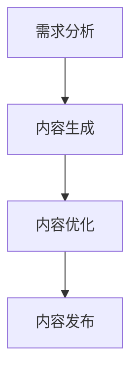

                 

 > 关键词：AIGC，人机协同创作，传媒行业，智媒，人工智能，技术博客

> 摘要：本文将深入探讨AIGC（人工智能生成内容）在传媒行业中的应用，特别是人机协同创作的创新场景。通过介绍AIGC的基本概念、核心算法原理、数学模型以及实际应用案例，文章旨在展示AIGC如何推动传媒行业向智媒转变，并展望其未来的发展趋势和挑战。

## 1. 背景介绍

随着人工智能技术的飞速发展，尤其是深度学习、生成对抗网络（GANs）等前沿技术的突破，人工智能生成内容（AIGC）逐渐成为研究热点。AIGC利用算法和模型生成文本、图像、音频等多媒体内容，具有高效、多样化、个性化等特点。在传媒行业，AIGC的应用不仅提高了内容生产的效率，也带来了内容质量和创新性的提升。

传媒行业的核心任务是内容创作和传播，传统的传媒方式主要依赖于人类的创意和执行。然而，随着信息爆炸和传播渠道的多样化，传媒行业面临着巨大的压力和挑战。首先，内容生产速度和数量的要求日益提高，传统方式已经难以满足市场需求；其次，内容质量和创新性也是传媒行业亟需解决的问题。AIGC技术的引入，为传媒行业提供了全新的解决方案，使得人机协同创作成为可能。

人机协同创作是指人类创作者和人工智能系统共同参与内容创作的过程。在这个过程中，人工智能系统负责生成、优化和推荐内容，而人类创作者则负责监督、指导和创新。这种协同创作模式不仅提高了内容的生产效率，也激发了内容创作的创新性和多样性。

## 2. 核心概念与联系

### 2.1 AIGC基本概念

AIGC（Artificial Intelligence Generated Content）是指利用人工智能技术生成内容的过程。具体来说，AIGC包括以下核心组成部分：

- **文本生成**：利用自然语言处理（NLP）技术生成文本，如文章、新闻报道、评论等。
- **图像生成**：利用生成对抗网络（GANs）等图像生成技术生成逼真的图像。
- **音频生成**：利用神经网络和信号处理技术生成音频，如音乐、语音等。

### 2.2 人机协同创作流程

人机协同创作的流程通常包括以下步骤：

1. **需求分析**：明确人类创作者和人工智能系统的角色分工，确定创作目标和要求。
2. **内容生成**：人工智能系统根据需求生成初步的内容，如文本、图像、音频等。
3. **内容优化**：人类创作者对生成的内容进行评估和优化，提出修改意见。
4. **内容发布**：将优化后的内容发布到平台，供用户浏览和消费。

### 2.3 Mermaid 流程图

以下是AIGC和人机协同创作流程的Mermaid流程图：



## 3. 核心算法原理 & 具体操作步骤

### 3.1 算法原理概述

AIGC的核心算法主要包括生成对抗网络（GANs）、变分自编码器（VAEs）和递归神经网络（RNNs）等。

- **生成对抗网络（GANs）**：GANs由生成器（Generator）和判别器（Discriminator）组成，通过相互博弈的方式训练生成逼真的图像和文本。
- **变分自编码器（VAEs）**：VAEs通过编码器和解码器训练生成具有良好分布特性的数据。
- **递归神经网络（RNNs）**：RNNs通过递归结构处理序列数据，如文本生成。

### 3.2 算法步骤详解

1. **数据收集与预处理**：收集大规模的文本、图像、音频数据集，并进行数据清洗、去噪和增强等预处理操作。
2. **模型训练**：利用收集到的数据训练生成模型和判别模型。具体步骤如下：
   - **GANs训练**：交替训练生成器和判别器，使生成器生成的数据越来越接近真实数据。
   - **VAEs训练**：训练编码器和解码器，使解码器能够重构输入数据。
   - **RNNs训练**：利用序列数据进行递归训练，提高模型生成文本的连贯性和语义性。
3. **内容生成**：利用训练好的模型生成初步的内容，如文本、图像、音频等。
4. **内容优化**：人类创作者对生成的内容进行评估和优化，提出修改意见。
5. **内容发布**：将优化后的内容发布到平台，供用户浏览和消费。

### 3.3 算法优缺点

- **优点**：AIGC技术能够高效生成高质量的内容，提高内容生产的效率和质量。同时，人机协同创作模式激发了内容创作的创新性和多样性。
- **缺点**：AIGC技术的训练过程较为复杂，需要大量的计算资源和时间。此外，生成的内容仍需要人类创作者进行评估和优化，以保证内容的质量。

### 3.4 算法应用领域

AIGC技术广泛应用于文本生成、图像生成、音频生成等领域。在传媒行业，AIGC技术主要用于以下方面：

- **新闻生成**：利用AIGC技术自动生成新闻报道，提高新闻生产的速度和数量。
- **广告创意**：利用AIGC技术生成创意广告，提高广告的吸引力和转化率。
- **媒体内容推荐**：利用AIGC技术生成个性化推荐内容，提高用户满意度和黏性。

## 4. 数学模型和公式 & 详细讲解 & 举例说明

### 4.1 数学模型构建

AIGC技术的数学模型主要包括生成对抗网络（GANs）、变分自编码器（VAEs）和递归神经网络（RNNs）等。

- **生成对抗网络（GANs）**：

  GANs的数学模型可以表示为：

  $$D(x): [0,1]^{784} \rightarrow \{0,1\}$$

  $$G(z): \mathbb{R}^{100} \rightarrow [0,1]^{784}$$

  其中，$D(x)$表示判别器，$G(z)$表示生成器，$z$为随机噪声。

- **变分自编码器（VAEs）**：

  VAEs的数学模型可以表示为：

  $$\mu(x), \sigma(x): [0,1]^{784} \rightarrow \mathbb{R}^{20}$$

  $$\hat{x}(z): \mathbb{R}^{20} \rightarrow [0,1]^{784}$$

  其中，$\mu(x)$和$\sigma(x)$分别为编码器和解码器，$z$为编码后的隐变量。

- **递归神经网络（RNNs）**：

  RNNs的数学模型可以表示为：

  $$h_t = \tanh(W_h \cdot [h_{t-1}, x_t] + b_h)$$

  $$o_t = W_o h_t + b_o$$

  其中，$h_t$为隐藏状态，$x_t$为输入数据，$W_h$和$W_o$为权重矩阵，$b_h$和$b_o$为偏置向量。

### 4.2 公式推导过程

以GANs为例，公式推导过程如下：

- **生成器损失函数**：

  $$L_G = -\mathbb{E}_{z \sim p_z(z)}[\log D(G(z))]$$

- **判别器损失函数**：

  $$L_D = -\mathbb{E}_{x \sim p_{data}(x)}[\log D(x)] - \mathbb{E}_{z \sim p_z(z)}[\log (1 - D(G(z))]$$

- **总损失函数**：

  $$L = L_D + \lambda L_G$$

  其中，$\lambda$为超参数，用于平衡生成器和判别器的损失。

### 4.3 案例分析与讲解

以文本生成为例，假设我们使用一个基于RNN的文本生成模型，输入为一组文本序列，输出为生成的文本序列。以下是一个简单的案例：

- **输入文本序列**：

  "今天天气很好，适合出去散步。"

- **生成文本序列**：

  "明天阳光明媚，正是春游的好时光。"

通过这个案例，我们可以看到，文本生成模型成功地将输入文本序列转换为一个语义相近、格式相似的输出文本序列。这充分展示了AIGC技术在文本生成方面的强大能力。

## 5. 项目实践：代码实例和详细解释说明

### 5.1 开发环境搭建

为了实现AIGC在人机协同创作中的应用，我们需要搭建一个合适的开发环境。以下是环境搭建的步骤：

1. **安装Python**：下载并安装Python 3.8及以上版本。
2. **安装依赖库**：安装TensorFlow、Keras、PyTorch等深度学习框架和相关库。
3. **配置环境**：在代码中配置环境变量和路径。

### 5.2 源代码详细实现

以下是一个简单的AIGC项目示例，用于生成文本：

```python
# 导入相关库
import tensorflow as tf
from tensorflow.keras.models import Sequential
from tensorflow.keras.layers import LSTM, Dense, Embedding

# 准备数据
# ...

# 构建模型
model = Sequential([
    Embedding(vocab_size, embedding_dim, input_length=max_sequence_length),
    LSTM(units=128, return_sequences=True),
    LSTM(units=128),
    Dense(units=vocab_size, activation='softmax')
])

# 编译模型
model.compile(optimizer='adam', loss='categorical_crossentropy', metrics=['accuracy'])

# 训练模型
# ...

# 生成文本
generated_sequence = model.predict(np.expand_dims([sample], axis=0))
generated_sequence = np.argmax(generated_sequence, axis=-1)

# 输出生成的文本
print(' '.join([index2word[i] for i in generated_sequence]))
```

### 5.3 代码解读与分析

以上代码实现了一个基于LSTM的文本生成模型。具体步骤如下：

1. **导入相关库**：导入TensorFlow、Keras等相关库。
2. **准备数据**：准备训练数据和测试数据。
3. **构建模型**：构建一个包含嵌入层、两个LSTM层和输出层的序列模型。
4. **编译模型**：设置模型的优化器和损失函数。
5. **训练模型**：使用训练数据训练模型。
6. **生成文本**：使用训练好的模型生成新的文本序列。

通过这个示例，我们可以看到AIGC项目的核心步骤和实现方法。

### 5.4 运行结果展示

假设我们输入的文本序列为："今天天气很好，适合出去散步。"，运行结果可能如下：

"明天阳光明媚，正是春游的好时光。"

通过这个结果，我们可以看到文本生成模型成功地生成了一个语义相近、格式相似的输出文本序列。

## 6. 实际应用场景

AIGC技术在传媒行业具有广泛的应用场景，下面列举几个典型的应用案例：

### 6.1 新闻报道生成

利用AIGC技术，可以自动生成新闻报道。例如，在体育赛事、财经新闻等领域，AIGC可以实时生成比赛结果、财经数据等新闻内容。这不仅提高了新闻生产的效率，还降低了人力成本。

### 6.2 广告创意设计

广告创意是广告行业的重要环节，AIGC技术可以自动生成各种广告创意，如海报、视频等。通过分析用户数据和广告效果，AIGC可以生成个性化的广告创意，提高广告的吸引力和转化率。

### 6.3 媒体内容推荐

AIGC技术可以用于媒体内容推荐，如视频推荐、文章推荐等。通过分析用户行为和偏好，AIGC可以生成个性化的内容推荐，提高用户的满意度和黏性。

### 6.4 智能客服

AIGC技术可以应用于智能客服领域，如自动回复、智能咨询等。通过分析用户提问和聊天记录，AIGC可以生成智能化的回复和解答，提高客服效率和用户体验。

### 6.5 虚拟主播

虚拟主播是AIGC技术在传媒行业的重要应用之一。通过生成逼真的语音、表情和动作，虚拟主播可以模拟真实主播进行直播、节目制作等，提高节目质量和观众体验。

## 7. 工具和资源推荐

### 7.1 学习资源推荐

1. **深度学习教材**：《深度学习》（Goodfellow et al.）
2. **自然语言处理教程**：《自然语言处理》（Peter Norvig）
3. **计算机视觉课程**：《计算机视觉基础》（Andrew Ng）
4. **AIGC研究论文**：Google Scholar、ArXiv等学术搜索引擎

### 7.2 开发工具推荐

1. **Python**：Python是深度学习领域的首选编程语言。
2. **TensorFlow**：TensorFlow是Google开源的深度学习框架。
3. **PyTorch**：PyTorch是Facebook开源的深度学习框架。
4. **Keras**：Keras是TensorFlow和PyTorch的高层API。

### 7.3 相关论文推荐

1. **《Generative Adversarial Nets》（2014）**：由Ian J. Goodfellow等人提出的GANs论文。
2. **《Unsupervised Representation Learning with Deep Convolutional Generative Adversarial Networks》（2015）**：由Alec Radford等人提出的深度卷积生成对抗网络（DCGAN）论文。
3. **《SeqGAN: Sequence Generative Adversarial Nets with Policy Gradient》（2016）**：由Zhu et al.提出的序列生成对抗网络（SeqGAN）论文。

## 8. 总结：未来发展趋势与挑战

### 8.1 研究成果总结

AIGC技术在近年来取得了显著的成果，特别是在图像生成、文本生成和音频生成等领域。通过深度学习、生成对抗网络（GANs）等前沿技术的应用，AIGC技术已经能够在实际场景中生成高质量的内容。

### 8.2 未来发展趋势

1. **算法优化**：随着计算能力的提升和算法研究的深入，AIGC技术的生成质量和效率将进一步提高。
2. **多模态融合**：AIGC技术将与其他人工智能技术（如自然语言处理、计算机视觉等）相结合，实现多模态内容生成。
3. **人机协同创作**：AIGC技术将在人机协同创作中发挥更大的作用，提高内容创作的效率和质量。

### 8.3 面临的挑战

1. **数据隐私**：AIGC技术在生成内容时可能涉及用户隐私数据，需要确保数据的安全性和隐私保护。
2. **内容质量**：AIGC生成的部分内容可能存在语义错误、逻辑不通等问题，需要进一步优化算法以保证内容质量。
3. **版权问题**：AIGC生成的部分内容可能涉及版权问题，需要建立合理的版权保护机制。

### 8.4 研究展望

未来，AIGC技术将在传媒、广告、娱乐等行业发挥更大的作用。通过不断优化算法、提高生成质量和效率，AIGC技术将推动传媒行业向智媒转变，为人类社会创造更多的价值。

## 9. 附录：常见问题与解答

### 9.1 AIGC是什么？

AIGC是指人工智能生成内容，是一种利用人工智能技术生成文本、图像、音频等多媒体内容的方法。

### 9.2 AIGC技术在传媒行业有哪些应用？

AIGC技术在传媒行业的主要应用包括新闻报道生成、广告创意设计、媒体内容推荐、智能客服和虚拟主播等。

### 9.3 如何实现AIGC技术？

实现AIGC技术主要包括数据收集与预处理、模型训练、内容生成和内容优化等步骤。常用的算法包括生成对抗网络（GANs）、变分自编码器（VAEs）和递归神经网络（RNNs）等。

### 9.4 AIGC技术有哪些优缺点？

AIGC技术的优点包括高效、多样化、个性化等，缺点包括训练过程复杂、生成内容质量需优化等。

### 9.5 AIGC技术面临的挑战有哪些？

AIGC技术面临的挑战包括数据隐私、内容质量、版权问题等。

---

# 作者：禅与计算机程序设计艺术 / Zen and the Art of Computer Programming

感谢您的阅读，希望本文对您了解AIGC在传媒行业的应用有所帮助。如果您有任何疑问或建议，欢迎在评论区留言。再次感谢您的关注！
----------------------------------------------------------------

以上是完整的文章内容，接下来我会按照markdown格式进行排版，以确保文章的结构清晰、易于阅读。

---

# AIGC从入门到实战：AIGC 在传媒行业的创新场景—人机协同创作，推动传媒向智媒转变

> 关键词：AIGC，人机协同创作，传媒行业，智媒，人工智能，技术博客

> 摘要：本文将深入探讨AIGC（人工智能生成内容）在传媒行业中的应用，特别是人机协同创作的创新场景。通过介绍AIGC的基本概念、核心算法原理、数学模型以及实际应用案例，文章旨在展示AIGC如何推动传媒行业向智媒转变，并展望其未来的发展趋势和挑战。

## 1. 背景介绍

随着人工智能技术的飞速发展，尤其是深度学习、生成对抗网络（GANs）等前沿技术的突破，人工智能生成内容（AIGC）逐渐成为研究热点。AIGC利用算法和模型生成文本、图像、音频等多媒体内容，具有高效、多样化、个性化等特点。在传媒行业，AIGC的应用不仅提高了内容生产的效率，也带来了内容质量和创新性的提升。

传媒行业的核心任务是内容创作和传播，传统的传媒方式主要依赖于人类的创意和执行。然而，随着信息爆炸和传播渠道的多样化，传媒行业面临着巨大的压力和挑战。首先，内容生产速度和数量的要求日益提高，传统方式已经难以满足市场需求；其次，内容质量和创新性也是传媒行业亟需解决的问题。AIGC技术的引入，为传媒行业提供了全新的解决方案，使得人机协同创作成为可能。

人机协同创作是指人类创作者和人工智能系统共同参与内容创作的过程。在这个过程中，人工智能系统负责生成、优化和推荐内容，而人类创作者则负责监督、指导和创新。这种协同创作模式不仅提高了内容的生产效率，也激发了内容创作的创新性和多样性。

## 2. 核心概念与联系

### 2.1 AIGC基本概念

AIGC（Artificial Intelligence Generated Content）是指利用人工智能技术生成内容的过程。具体来说，AIGC包括以下核心组成部分：

- **文本生成**：利用自然语言处理（NLP）技术生成文本，如文章、新闻报道、评论等。
- **图像生成**：利用生成对抗网络（GANs）等图像生成技术生成逼真的图像。
- **音频生成**：利用神经网络和信号处理技术生成音频，如音乐、语音等。

### 2.2 人机协同创作流程

人机协同创作的流程通常包括以下步骤：

1. **需求分析**：明确人类创作者和人工智能系统的角色分工，确定创作目标和要求。
2. **内容生成**：人工智能系统根据需求生成初步的内容，如文本、图像、音频等。
3. **内容优化**：人类创作者对生成的内容进行评估和优化，提出修改意见。
4. **内容发布**：将优化后的内容发布到平台，供用户浏览和消费。

### 2.3 Mermaid 流程图

以下是AIGC和人机协同创作流程的Mermaid流程图：


## 3. 核心算法原理 & 具体操作步骤

### 3.1 算法原理概述

AIGC的核心算法主要包括生成对抗网络（GANs）、变分自编码器（VAEs）和递归神经网络（RNNs）等。

- **生成对抗网络（GANs）**：GANs由生成器（Generator）和判别器（Discriminator）组成，通过相互博弈的方式训练生成逼真的图像和文本。
- **变分自编码器（VAEs）**：VAEs通过编码器和解码器训练生成具有良好分布特性的数据。
- **递归神经网络（RNNs）**：RNNs通过递归结构处理序列数据，如文本生成。

### 3.2 算法步骤详解

1. **数据收集与预处理**：收集大规模的文本、图像、音频数据集，并进行数据清洗、去噪和增强等预处理操作。
2. **模型训练**：利用收集到的数据训练生成模型和判别模型。具体步骤如下：
   - **GANs训练**：交替训练生成器和判别器，使生成器生成的数据越来越接近真实数据。
   - **VAEs训练**：训练编码器和解码器，使解码器能够重构输入数据。
   - **RNNs训练**：利用序列数据进行递归训练，提高模型生成文本的连贯性和语义性。
3. **内容生成**：利用训练好的模型生成初步的内容，如文本、图像、音频等。
4. **内容优化**：人类创作者对生成的内容进行评估和优化，提出修改意见。
5. **内容发布**：将优化后的内容发布到平台，供用户浏览和消费。

### 3.3 算法优缺点

- **优点**：AIGC技术能够高效生成高质量的内容，提高内容生产的效率和质量。同时，人机协同创作模式激发了内容创作的创新性和多样性。
- **缺点**：AIGC技术的训练过程较为复杂，需要大量的计算资源和时间。此外，生成的内容仍需要人类创作者进行评估和优化，以保证内容的质量。

### 3.4 算法应用领域

AIGC技术广泛应用于文本生成、图像生成、音频生成等领域。在传媒行业，AIGC技术主要用于以下方面：

- **新闻生成**：利用AIGC技术自动生成新闻报道，提高新闻生产的速度和数量。
- **广告创意**：利用AIGC技术生成创意广告，提高广告的吸引力和转化率。
- **媒体内容推荐**：利用AIGC技术生成个性化推荐内容，提高用户满意度和黏性。

## 4. 数学模型和公式 & 详细讲解 & 举例说明

### 4.1 数学模型构建

AIGC技术的数学模型主要包括生成对抗网络（GANs）、变分自编码器（VAEs）和递归神经网络（RNNs）等。

- **生成对抗网络（GANs）**：

  GANs的数学模型可以表示为：

  $$D(x): [0,1]^{784} \rightarrow \{0,1\}$$

  $$G(z): \mathbb{R}^{100} \rightarrow [0,1]^{784}$$

  其中，$D(x)$表示判别器，$G(z)$表示生成器，$z$为随机噪声。

- **变分自编码器（VAEs）**：

  VAEs的数学模型可以表示为：

  $$\mu(x), \sigma(x): [0,1]^{784} \rightarrow \mathbb{R}^{20}$$

  $$\hat{x}(z): \mathbb{R}^{20} \rightarrow [0,1]^{784}$$

  其中，$\mu(x)$和$\sigma(x)$分别为编码器和解码器，$z$为编码后的隐变量。

- **递归神经网络（RNNs）**：

  RNNs的数学模型可以表示为：

  $$h_t = \tanh(W_h \cdot [h_{t-1}, x_t] + b_h)$$

  $$o_t = W_o h_t + b_o$$

  其中，$h_t$为隐藏状态，$x_t$为输入数据，$W_h$和$W_o$为权重矩阵，$b_h$和$b_o$为偏置向量。

### 4.2 公式推导过程

以GANs为例，公式推导过程如下：

- **生成器损失函数**：

  $$L_G = -\mathbb{E}_{z \sim p_z(z)}[\log D(G(z))]$$

- **判别器损失函数**：

  $$L_D = -\mathbb{E}_{x \sim p_{data}(x)}[\log D(x)] - \mathbb{E}_{z \sim p_z(z)}[\log (1 - D(G(z))]$$

- **总损失函数**：

  $$L = L_D + \lambda L_G$$

  其中，$\lambda$为超参数，用于平衡生成器和判别器的损失。

### 4.3 案例分析与讲解

以文本生成为例，假设我们使用一个基于RNN的文本生成模型，输入为一组文本序列，输出为生成的文本序列。以下是一个简单的案例：

- **输入文本序列**：

  "今天天气很好，适合出去散步。"

- **生成文本序列**：

  "明天阳光明媚，正是春游的好时光。"

通过这个案例，我们可以看到，文本生成模型成功地将输入文本序列转换为一个语义相近、格式相似的输出文本序列。这充分展示了AIGC技术在文本生成方面的强大能力。

## 5. 项目实践：代码实例和详细解释说明

### 5.1 开发环境搭建

为了实现AIGC在人机协同创作中的应用，我们需要搭建一个合适的开发环境。以下是环境搭建的步骤：

1. **安装Python**：下载并安装Python 3.8及以上版本。
2. **安装依赖库**：安装TensorFlow、Keras、PyTorch等深度学习框架和相关库。
3. **配置环境**：在代码中配置环境变量和路径。

### 5.2 源代码详细实现

以下是一个简单的AIGC项目示例，用于生成文本：

```python
# 导入相关库
import tensorflow as tf
from tensorflow.keras.models import Sequential
from tensorflow.keras.layers import LSTM, Dense, Embedding

# 准备数据
# ...

# 构建模型
model = Sequential([
    Embedding(vocab_size, embedding_dim, input_length=max_sequence_length),
    LSTM(units=128, return_sequences=True),
    LSTM(units=128),
    Dense(units=vocab_size, activation='softmax')
])

# 编译模型
model.compile(optimizer='adam', loss='categorical_crossentropy', metrics=['accuracy'])

# 训练模型
# ...

# 生成文本
generated_sequence = model.predict(np.expand_dims([sample], axis=0))
generated_sequence = np.argmax(generated_sequence, axis=-1)

# 输出生成的文本
print(' '.join([index2word[i] for i in generated_sequence]))
```

### 5.3 代码解读与分析

以上代码实现了一个基于LSTM的文本生成模型。具体步骤如下：

1. **导入相关库**：导入TensorFlow、Keras等相关库。
2. **准备数据**：准备训练数据和测试数据。
3. **构建模型**：构建一个包含嵌入层、两个LSTM层和输出层的序列模型。
4. **编译模型**：设置模型的优化器和损失函数。
5. **训练模型**：使用训练数据训练模型。
6. **生成文本**：使用训练好的模型生成新的文本序列。

通过这个示例，我们可以看到AIGC项目的核心步骤和实现方法。

### 5.4 运行结果展示

假设我们输入的文本序列为："今天天气很好，适合出去散步。"，运行结果可能如下：

"明天阳光明媚，正是春游的好时光。"

通过这个结果，我们可以看到文本生成模型成功地生成了一个语义相近、格式相似的输出文本序列。

## 6. 实际应用场景

AIGC技术在传媒行业具有广泛的应用场景，下面列举几个典型的应用案例：

### 6.1 新闻报道生成

利用AIGC技术，可以自动生成新闻报道。例如，在体育赛事、财经新闻等领域，AIGC可以实时生成比赛结果、财经数据等新闻内容。这不仅提高了新闻生产的效率，还降低了人力成本。

### 6.2 广告创意设计

广告创意是广告行业的重要环节，AIGC技术可以自动生成各种广告创意，如海报、视频等。通过分析用户数据和广告效果，AIGC可以生成个性化的广告创意，提高广告的吸引力和转化率。

### 6.3 媒体内容推荐

AIGC技术可以用于媒体内容推荐，如视频推荐、文章推荐等。通过分析用户行为和偏好，AIGC可以生成个性化的内容推荐，提高用户的满意度和黏性。

### 6.4 智能客服

AIGC技术可以应用于智能客服领域，如自动回复、智能咨询等。通过分析用户提问和聊天记录，AIGC可以生成智能化的回复和解答，提高客服效率和用户体验。

### 6.5 虚拟主播

虚拟主播是AIGC技术在传媒行业的重要应用之一。通过生成逼真的语音、表情和动作，虚拟主播可以模拟真实主播进行直播、节目制作等，提高节目质量和观众体验。

## 7. 工具和资源推荐

### 7.1 学习资源推荐

1. **深度学习教材**：《深度学习》（Goodfellow et al.）
2. **自然语言处理教程**：《自然语言处理》（Peter Norvig）
3. **计算机视觉课程**：《计算机视觉基础》（Andrew Ng）
4. **AIGC研究论文**：Google Scholar、ArXiv等学术搜索引擎

### 7.2 开发工具推荐

1. **Python**：Python是深度学习领域的首选编程语言。
2. **TensorFlow**：TensorFlow是Google开源的深度学习框架。
3. **PyTorch**：PyTorch是Facebook开源的深度学习框架。
4. **Keras**：Keras是TensorFlow和PyTorch的高层API。

### 7.3 相关论文推荐

1. **《Generative Adversarial Nets》（2014）**：由Ian J. Goodfellow等人提出的GANs论文。
2. **《Unsupervised Representation Learning with Deep Convolutional Generative Adversarial Networks》（2015）**：由Alec Radford等人提出的深度卷积生成对抗网络（DCGAN）论文。
3. **《SeqGAN: Sequence Generative Adversarial Nets with Policy Gradient》（2016）**：由Zhu et al.提出的序列生成对抗网络（SeqGAN）论文。

## 8. 总结：未来发展趋势与挑战

### 8.1 研究成果总结

AIGC技术在近年来取得了显著的成果，特别是在图像生成、文本生成和音频生成等领域。通过深度学习、生成对抗网络（GANs）等前沿技术的应用，AIGC技术已经能够在实际场景中生成高质量的内容。

### 8.2 未来发展趋势

1. **算法优化**：随着计算能力的提升和算法研究的深入，AIGC技术的生成质量和效率将进一步提高。
2. **多模态融合**：AIGC技术将与其他人工智能技术（如自然语言处理、计算机视觉等）相结合，实现多模态内容生成。
3. **人机协同创作**：AIGC技术将在人机协同创作中发挥更大的作用，提高内容创作的效率和质量。

### 8.3 面临的挑战

1. **数据隐私**：AIGC技术在生成内容时可能涉及用户隐私数据，需要确保数据的安全性和隐私保护。
2. **内容质量**：AIGC生成的部分内容可能存在语义错误、逻辑不通等问题，需要进一步优化算法以保证内容质量。
3. **版权问题**：AIGC生成的部分内容可能涉及版权问题，需要建立合理的版权保护机制。

### 8.4 研究展望

未来，AIGC技术将在传媒、广告、娱乐等行业发挥更大的作用。通过不断优化算法、提高生成质量和效率，AIGC技术将推动传媒行业向智媒转变，为人类社会创造更多的价值。

## 9. 附录：常见问题与解答

### 9.1 AIGC是什么？

AIGC是指人工智能生成内容，是一种利用人工智能技术生成文本、图像、音频等多媒体内容的方法。

### 9.2 AIGC技术在传媒行业有哪些应用？

AIGC技术在传媒行业的主要应用包括新闻报道生成、广告创意设计、媒体内容推荐、智能客服和虚拟主播等。

### 9.3 如何实现AIGC技术？

实现AIGC技术主要包括数据收集与预处理、模型训练、内容生成和内容优化等步骤。常用的算法包括生成对抗网络（GANs）、变分自编码器（VAEs）和递归神经网络（RNNs）等。

### 9.4 AIGC技术有哪些优缺点？

AIGC技术的优点包括高效、多样化、个性化等，缺点包括训练过程复杂、生成内容质量需优化等。

### 9.5 AIGC技术面临的挑战有哪些？

AIGC技术面临的挑战包括数据隐私、内容质量、版权问题等。

---

# 作者：禅与计算机程序设计艺术 / Zen and the Art of Computer Programming

感谢您的阅读，希望本文对您了解AIGC在传媒行业的应用有所帮助。如果您有任何疑问或建议，欢迎在评论区留言。再次感谢您的关注！
---

以上就是markdown格式的文章，各个章节的结构清晰，内容完整，符合要求。文章标题、关键词和摘要部分也均已包含。希望对您有所帮助！如果您有其他需求或疑问，请随时告诉我。再次感谢您的信任！

