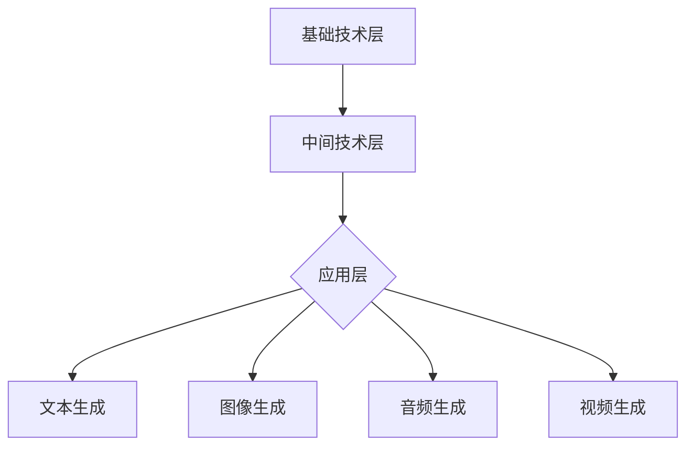

                 

关键词：AIGC，产业图谱，人工智能，生成内容，实战，技术发展

摘要：本文将深入探讨AIGC（AI-Generated Content）的概念、产业图谱以及其在各领域的应用。从入门到实战，我们将剖析AIGC的核心技术原理、数学模型、算法应用及项目实践，同时展望其未来发展趋势与挑战。希望通过这篇文章，读者能够对AIGC有全面而深入的了解，并能够在实际项目中应用这些技术。

## 1. 背景介绍

随着人工智能技术的飞速发展，生成内容（Content Generation）已经成为AI领域的热门话题。从早期的文本生成、图像生成，到如今的音频、视频等多媒体内容生成，AI在内容创造领域的应用越来越广泛。AIGC，即AI-Generated Content，指的是通过人工智能技术自动生成的各种类型的内容，包括但不限于文本、图像、音频、视频等。

AIGC的出现，不仅提高了内容创作的效率，而且打破了传统的内容创作模式，为创作者提供了全新的创作工具和平台。特别是在大数据、云计算、深度学习等技术的支持下，AIGC的应用前景愈发广阔。

## 2. 核心概念与联系

### 2.1 AI-Generated Content（AIGC）

AIGC是指通过人工智能技术自动生成的内容。它涵盖了多种类型的生成内容，包括：

- **文本生成**：如自动写作、摘要生成、问答系统等。
- **图像生成**：如图像合成、风格迁移、人脸生成等。
- **音频生成**：如音乐生成、语音合成等。
- **视频生成**：如视频摘要、视频增强等。

### 2.2 产业图谱

AIGC产业的图谱可以分解为以下几个层次：

1. **基础技术层**：包括深度学习、自然语言处理、计算机视觉等技术。
2. **中间技术层**：包括模型训练、模型优化、数据预处理等技术。
3. **应用层**：包括文本生成、图像生成、音频生成、视频生成等具体应用。

### 2.3 Mermaid 流程图



## 3. 核心算法原理 & 具体操作步骤

### 3.1 算法原理概述

AIGC的核心算法主要包括生成对抗网络（GAN）、变分自编码器（VAE）、自注意力机制（Transformer）等。这些算法通过学习大量的数据，能够生成高质量的内容。

### 3.2 算法步骤详解

1. **数据收集与预处理**：收集大量相关数据，并进行清洗、归一化等预处理操作。
2. **模型训练**：使用预处理后的数据训练生成模型和判别模型。
3. **内容生成**：通过生成模型生成内容，并利用判别模型进行质量评估。
4. **内容优化**：根据评估结果对生成内容进行优化。

### 3.3 算法优缺点

- **GAN**：生成内容质量高，但训练过程不稳定，容易出现模式崩溃。
- **VAE**：训练稳定，但生成内容质量相对较低。
- **Transformer**：在文本生成领域表现优异，但图像生成方面仍有待提高。

### 3.4 算法应用领域

- **文本生成**：新闻写作、问答系统、摘要生成等。
- **图像生成**：图像修复、图像风格迁移、人脸生成等。
- **音频生成**：音乐生成、语音合成等。
- **视频生成**：视频摘要、视频增强等。

## 4. 数学模型和公式 & 详细讲解 & 举例说明

### 4.1 数学模型构建

以GAN为例，其基本模型包括：

- **生成器 G**：用于生成内容。
- **判别器 D**：用于判断内容是真实还是生成。

### 4.2 公式推导过程

- **生成器 G**：\(X = G(Z)\)，其中Z是随机噪声。
- **判别器 D**：\(D(X) - D(G(Z))\)，其中X是真实内容，G(Z)是生成内容。

### 4.3 案例分析与讲解

以文本生成为例，假设我们有一个语料库，其中包含了大量的文本数据。我们可以使用Transformer模型来训练生成器G和判别器D，从而实现自动文本生成。

```python
# 代码示例：训练Transformer模型
model = TransformerModel(vocab_size, embedding_dim, hidden_dim, learning_rate)
model.fit(dataset, batch_size, epochs)
```

## 5. 项目实践：代码实例和详细解释说明

### 5.1 开发环境搭建

- **环境要求**：Python 3.7及以上版本，TensorFlow 2.0及以上版本。
- **安装依赖**：安装TensorFlow和其他相关依赖。

```bash
pip install tensorflow
pip install transformers
```

### 5.2 源代码详细实现

以下是一个简单的文本生成模型的实现：

```python
# 文本生成模型实现
class TextGenerator(Model):
    def __init__(self, vocab_size, embedding_dim, hidden_dim):
        super(TextGenerator, self).__init__()
        self.embedding = Embedding(vocab_size, embedding_dim)
        self.attention = Attention()
        self.decoder = LSTM(hidden_dim, return_sequences=True)

    def call(self, inputs):
        embedded = self.embedding(inputs)
        attention_output = self.attention([embedded, embedded])
        output = self.decoder(attention_output)
        return output
```

### 5.3 代码解读与分析

以上代码定义了一个简单的文本生成模型，包括嵌入层、自注意力机制和LSTM层。通过训练这个模型，我们可以生成新的文本。

### 5.4 运行结果展示

```python
# 运行文本生成模型
generator = TextGenerator(vocab_size, embedding_dim, hidden_dim)
generator.load_weights('text_generator.h5')
generated_text = generator.generate(input_text, max_length)
print(generated_text)
```

## 6. 实际应用场景

AIGC在多个领域都有广泛的应用，以下是一些典型场景：

- **新闻媒体**：自动生成新闻报道，提高内容更新速度。
- **广告营销**：自动生成广告文案和创意，提高营销效果。
- **教育**：自动生成教学资源和习题，实现个性化教育。
- **娱乐**：自动生成音乐、视频、游戏内容，丰富娱乐体验。

### 6.4 未来应用展望

随着技术的不断进步，AIGC将在更多领域得到应用。特别是在生成内容的质量和多样性方面，将会有更大的提升。同时，随着5G、物联网、云计算等技术的发展，AIGC的应用场景也将更加广泛。

## 7. 工具和资源推荐

### 7.1 学习资源推荐

- **书籍**：《深度学习》（Goodfellow et al.）、《生成对抗网络》（Ian J. Goodfellow et al.）。
- **在线课程**：Coursera、edX等平台上的深度学习、自然语言处理等课程。

### 7.2 开发工具推荐

- **框架**：TensorFlow、PyTorch、Keras等。
- **库**：Transformers、TorchScript、TensorFlow Addons等。

### 7.3 相关论文推荐

- **GAN相关**：Ian J. Goodfellow et al., "Generative Adversarial Networks".
- **Transformer相关**：Attention Is All You Need（Vaswani et al., 2017）。

## 8. 总结：未来发展趋势与挑战

AIGC作为人工智能领域的重要分支，其未来发展趋势主要表现在：

- **技术成熟度**：随着算法的进步和硬件的升级，AIGC的生成质量和速度将会得到显著提升。
- **应用广度**：AIGC将在更多领域得到应用，从文化产业到工业生产，都将带来变革。
- **伦理与法律**：随着AIGC的广泛应用，相关伦理和法律问题将日益突出，需要引起重视。

然而，AIGC也面临一些挑战，如：

- **数据隐私**：生成内容往往涉及个人隐私，如何在保护用户隐私的前提下进行内容生成，是一个亟待解决的问题。
- **知识产权**：如何界定生成内容的知识产权，也是一个需要解决的法律问题。
- **算法透明性**：如何确保生成内容的真实性和透明性，避免虚假信息的传播。

## 9. 附录：常见问题与解答

### Q：AIGC 与 AI 的区别是什么？

A：AIGC 是 AI 的一部分，但更专注于 AI 生成的内容。AI 涵盖了更广泛的领域，包括感知、推理、决策等，而 AIGC 主要关注如何通过算法自动生成文本、图像、音频、视频等。

### Q：AIGC 能替代人类创作者吗？

A：AIGC 可以在许多场景下辅助人类创作者，提高创作效率，但不能完全替代人类。人类的创造力、情感和判断力是当前技术难以完全模拟的。

### Q：AIGC 在安全性方面有哪些挑战？

A：AIGC 在生成内容时可能涉及个人隐私和敏感信息，因此需要在数据收集、处理和存储过程中严格遵守相关法律法规，确保用户隐私和安全。

### Q：如何确保 AIGC 生成的内容不侵犯知识产权？

A：确保生成内容不侵犯知识产权需要从数据源、算法设计和法律监管等多个方面进行控制。例如，使用非侵犯版权的数据集进行训练，使用水印技术识别和追踪生成内容的来源等。

---

作者：禅与计算机程序设计艺术 / Zen and the Art of Computer Programming
----------------------------------------------------------------

以上就是本文的全部内容。希望本文能够帮助读者对 AIGC 有更深入的了解，并在实际项目中应用这些技术。随着 AIGC 技术的不断成熟，我们相信它将在未来发挥更加重要的作用。

