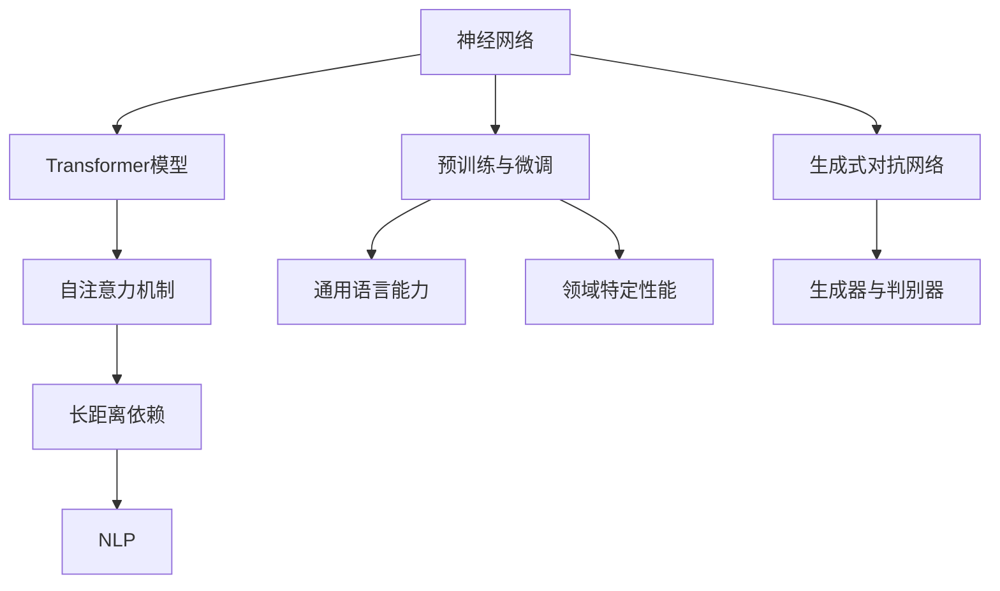

                 

### 1. 背景介绍

人工智能（AI）技术作为现代科技的核心驱动力，已经渗透到我们生活的各个方面。从自动驾驶、智能家居到医疗诊断和金融分析，AI的应用正不断拓展。然而，自2022年底ChatGPT问世以来，人工智能的发展迈入了一个全新的阶段——AIGC（AI-Generated Content）。ChatGPT作为OpenAI推出的革命性自然语言处理模型，迅速引起了全球科技界和普通用户的广泛关注。它凭借强大的语言生成能力和智能化交互体验，不仅改变了人们获取信息、交流互动的方式，更为各行各业带来了无限的想象空间和可能。

ChatGPT的成功并非偶然，而是人工智能长期发展的必然结果。本文旨在通过对ChatGPT的深入探讨，帮助读者全面了解AIGC的技术原理、应用场景以及未来趋势，从而为读者在人工智能领域的探索和实践提供有力支持。

## 1.1 人工智能与自然语言处理

人工智能（AI）是一门研究、开发和应用使计算机系统能够模拟、延伸和扩展人类智能的科学。它起源于20世纪50年代，经过几十年的发展，已经成为信息技术领域的重要分支。人工智能的应用范围广泛，包括机器学习、计算机视觉、自然语言处理等。其中，自然语言处理（NLP）是人工智能领域中最为复杂和最具挑战性的分支之一。

自然语言处理旨在使计算机能够理解、生成和处理人类自然语言。这一目标涉及到语言的理解、表达、翻译、情感分析等多个方面。NLP技术的发展为人工智能的应用提供了强大的支持，使得计算机能够与人类更自然、高效地进行交流。

## 1.2 ChatGPT的诞生

ChatGPT是由美国人工智能研究公司OpenAI于2022年11月推出的一个基于Transformer模型的自然语言处理工具。它基于GPT-3.5版本，是一个大型语言模型，拥有超过1750亿个参数。ChatGPT的主要功能是生成符合语法规则、逻辑清晰的自然语言文本，能够进行对话、回答问题、撰写文章等。

ChatGPT的诞生并非一蹴而就，而是OpenAI多年技术积累和创新的结果。OpenAI致力于推动人工智能的发展和应用，通过不断优化算法、增加模型参数和训练数据，使得ChatGPT成为当前最先进、最强大的自然语言处理工具之一。

## 1.3 AIGC的概念与意义

AIGC（AI-Generated Content）是指通过人工智能技术生成内容的过程。它涵盖了文本、图片、音频、视频等多种形式的数字内容生成。AIGC的兴起，标志着人工智能技术从辅助工具逐步走向创作主体，为人类创造提供了全新的可能性。

AIGC的意义在于：

1. 提高内容创作效率：AIGC能够自动生成大量的文本、图片、音频、视频内容，大大减少了人工创作的耗时和成本。
2. 拓展创作空间：AIGC突破了传统创作方式的限制，为创作者提供了更加丰富和多样的创作手段，激发了创意的无限可能性。
3. 改变商业模式：AIGC的出现改变了传统的内容生产和分发模式，为企业和个人提供了全新的商业机会。

总之，ChatGPT的问世和AIGC的兴起，不仅推动了人工智能技术的发展，也为各行业的创新和发展带来了巨大的机遇。接下来，我们将深入探讨ChatGPT的技术原理和应用场景，帮助读者更好地理解和利用这一革命性工具。

### 2. 核心概念与联系

为了更好地理解ChatGPT的工作原理及其在AIGC中的关键作用，我们需要先掌握几个核心概念和它们之间的联系。本章节将通过Mermaid流程图直观地展示这些概念和它们之间的关联，确保读者能够清晰、系统地掌握相关知识。

#### 2.1 核心概念

1. **神经网络（Neural Networks）**：神经网络是人工智能的基础，由大量相互连接的节点（神经元）组成。这些节点通过学习数据来模拟人脑的决策过程。
2. **Transformer模型（Transformer Models）**：Transformer模型是一种用于自然语言处理的先进神经网络结构，其核心思想是自注意力机制（Self-Attention），能够捕捉长距离依赖信息。
3. **预训练与微调（Pre-training and Fine-tuning）**：预训练是指使用大量未标记的数据对模型进行初步训练，使其具备通用语言能力。微调则是在预训练的基础上，使用特定领域的数据对模型进行精细调整，以提高其在特定任务上的性能。
4. **生成式对抗网络（Generative Adversarial Networks, GANs）**：GANs由生成器和判别器两个神经网络组成，通过对抗训练生成逼真的数据。
5. **自然语言处理（Natural Language Processing, NLP）**：NLP是使计算机能够理解、生成和处理人类自然语言的技术。

#### 2.2 Mermaid流程图

以下是一个Mermaid流程图，展示了上述核心概念之间的联系：



- **神经网络**是人工智能的基础，包括了多种结构，如Transformer模型和生成式对抗网络。
- **Transformer模型**以自注意力机制为核心，能够捕捉长距离依赖信息，是当前自然语言处理领域的主流架构。
- **预训练与微调**是训练神经网络的重要环节。预训练提供了通用语言能力，而微调则使其适用于特定领域。
- **生成式对抗网络**通过生成器和判别器的对抗训练，生成逼真的数据。
- **自然语言处理**利用神经网络和Transformer模型，实现语言的理解、生成和处理。

#### 2.3 概念之间的联系

- **神经网络**是所有其他概念的基础，是数据处理和学习的核心。
- **Transformer模型**基于自注意力机制，提高了NLP任务的性能。
- **预训练与微调**使得神经网络能够从大量数据中学习，并通过特定领域的训练提升任务表现。
- **生成式对抗网络**在图像和音频生成等领域有广泛应用，但在文本生成方面，Transformer模型更为常见。
- **自然语言处理**结合神经网络和Transformer模型，实现了对人类自然语言的深入理解和处理。

通过以上对核心概念和它们之间联系的介绍和Mermaid流程图的展示，我们为后续对ChatGPT技术原理的深入探讨奠定了坚实的基础。在接下来的章节中，我们将详细解析ChatGPT的工作原理和具体应用。

### 3. 核心算法原理 & 具体操作步骤

#### 3.1 算法原理概述

ChatGPT的工作原理主要基于Transformer模型和大规模预训练。Transformer模型是一种基于自注意力机制的深度神经网络结构，它在处理序列数据时表现出色。自注意力机制允许模型在处理每个词时，考虑到其他词对它的贡献，从而捕捉长距离依赖关系。这种机制使得Transformer模型在自然语言处理任务中具有显著的性能优势。

ChatGPT的预训练过程包括两个阶段：通用预训练和领域微调。通用预训练使用大量的无标签文本数据，训练模型以理解和生成自然语言。领域微调则是在通用预训练的基础上，使用特定领域的标注数据进行训练，使模型在特定任务上表现更优。

#### 3.2 算法步骤详解

1. **数据准备**：
   - ChatGPT的训练数据来源于互联网上的大量文本，包括书籍、新闻、社交媒体帖子等。
   - 数据需要进行预处理，如分词、去除停用词、词干提取等。

2. **通用预训练**：
   - 使用Transformer模型对预处理后的数据进行预训练，包括自我注意力机制和前馈神经网络。
   - 通过梯度下降等方法优化模型参数，使得模型能够预测序列中的下一个词。

3. **保存模型**：
   - 在预训练完成后，将模型参数保存，以供后续使用。

4. **领域微调**：
   - 在通用预训练的基础上，针对特定任务进行微调。例如，对于问答任务，可以使用问答数据集对模型进行微调。
   - 微调过程中，使用交叉熵损失函数来评估模型性能，并调整模型参数。

5. **应用与测试**：
   - 在应用场景中，如对话系统、文本生成等，加载微调后的模型，并根据输入生成相应的输出。
   - 对输出进行评估，以验证模型的性能。

#### 3.3 算法优缺点

**优点**：
- **强大的语言理解能力**：ChatGPT基于Transformer模型，能够捕捉长距离依赖关系，从而更好地理解复杂语言结构。
- **高效的生成能力**：通过大规模预训练和微调，ChatGPT能够在各种自然语言处理任务中生成高质量文本。
- **广泛的应用场景**：ChatGPT不仅可以用于问答、对话生成，还可以用于机器翻译、文本摘要、内容创作等多种任务。

**缺点**：
- **计算资源需求高**：预训练和微调过程需要大量的计算资源和时间，对于资源有限的开发者可能是一个挑战。
- **数据隐私问题**：训练数据可能包含敏感信息，如何保护用户隐私是一个重要问题。

#### 3.4 算法应用领域

ChatGPT在多个领域有广泛应用：

- **对话系统**：ChatGPT可以作为智能客服、虚拟助手等对话系统的核心组件，实现自然、流畅的人机交互。
- **内容创作**：ChatGPT可以用于自动生成文章、故事、新闻等，为内容创作者提供辅助。
- **机器翻译**：ChatGPT可以用于机器翻译任务，实现高质量的语言翻译。
- **教育辅助**：ChatGPT可以为学生提供个性化的学习辅导，如自动生成练习题、解答疑问等。

通过以上对ChatGPT算法原理和具体操作步骤的介绍，我们可以看到，ChatGPT凭借其强大的语言生成能力和多样化的应用场景，已经成为人工智能领域的重要工具。在接下来的章节中，我们将通过实际项目实例，进一步探讨ChatGPT的实践应用。

### 4. 数学模型和公式 & 详细讲解 & 举例说明

在深入探讨ChatGPT的工作原理时，数学模型和公式扮演着至关重要的角色。这些模型和公式不仅定义了模型的结构和行为，还为理解和优化ChatGPT提供了科学依据。本章节将详细介绍ChatGPT背后的数学模型，包括其构建过程、公式推导，并通过具体案例进行说明。

#### 4.1 数学模型构建

ChatGPT的数学模型主要基于Transformer架构，Transformer模型的核心是自注意力机制（Self-Attention）。自注意力机制通过计算序列中每个词与所有其他词的相关性，从而捕捉长距离依赖关系。为了实现这一目标，我们需要以下几个关键组件：

1. **嵌入层（Embedding Layer）**：
   嵌入层将输入的词转化为向量表示。每个词被映射到一个固定维度的向量。这一过程可以通过查找预定义的词嵌入矩阵实现。

   $$ \text{embed}(x) = \text{W}_\text{emb} \cdot x $$
   
   其中，\( \text{W}_\text{emb} \) 是词嵌入矩阵，\( x \) 是输入词索引。

2. **位置编码（Positional Encoding）**：
   Transformer模型不包含循环神经网络（RNN）中的位置信息，因此需要通过位置编码来引入位置信息。位置编码通常通过正弦和余弦函数实现。

   $$ \text{PE}(pos, 2i) = \sin(\frac{pos}{10000^{2i/d}}) $$
   $$ \text{PE}(pos, 2i+1) = \cos(\frac{pos}{10000^{2i/d}}) $$
   
   其中，\( pos \) 是词的位置，\( i \) 是维度索引，\( d \) 是嵌入层维度。

3. **自注意力层（Self-Attention Layer）**：
   自注意力层通过计算每个词与所有其他词的相关性来生成新的表示。这可以通过以下三个步骤实现：

   - **Query（查询），Key（键），Value（值）计算**：
     每个词作为查询、键和值进行计算。
     
     $$ \text{Q} = \text{W}_\text{Q} \cdot \text{embed}(x) + \text{W}_\text{pos} \cdot \text{PE}(x) $$
     $$ \text{K} = \text{W}_\text{K} \cdot \text{embed}(x) + \text{W}_\text{pos} \cdot \text{PE}(x) $$
     $$ \text{V} = \text{W}_\text{V} \cdot \text{embed}(x) + \text{W}_\text{pos} \cdot \text{PE}(x) $$
     
     其中，\( \text{W}_\text{Q} \)，\( \text{W}_\text{K} \)，\( \text{W}_\text{V} \) 分别是查询、键、值权重矩阵。

   - **分数计算**：
     计算每个词与其他词之间的相似度分数，通过点积操作实现。
     
     $$ \text{score} = \text{Q} \cdot \text{K}^T $$
     
   - **softmax激活**：
     对分数进行softmax激活，生成权重向量。
     
     $$ \text{softmax}(\text{score}) $$
     
   - **加权求和**：
     根据权重向量对值进行加权求和，生成新的表示。
     
     $$ \text{context} = \sum_{i} \text{softmax}(\text{score}) \cdot \text{V} $$
   
4. **前馈网络（Feedforward Network）**：
   在自注意力层之后，添加两个前馈网络，对上下文进行进一步处理。
   
   $$ \text{FFN}(x) = \text{激活函数}(\text{W}_2 \cdot \text{激活函数}(\text{W}_1 \cdot x + b_1)) + b_2 $$
   
   其中，\( \text{W}_1 \)，\( \text{W}_2 \)，\( b_1 \)，\( b_2 \) 分别是权重和偏置。

5. **层归一化（Layer Normalization）**：
   对输入和输出进行层归一化，以稳定训练过程。

   $$ \text{LayerNorm}(x) = \frac{x - \text{mean}(x)}{\text{stddev}(x)} $$

6. **多头自注意力（Multi-Head Self-Attention）**：
   将自注意力层扩展到多个头，以同时捕捉不同类型的依赖关系。
   
   $$ \text{MultiHead}(Q, K, V) = \text{Concat}(\text{head}_1, \text{head}_2, ..., \text{head}_h) \cdot \text{O} $$
   
   其中，\( \text{head}_i \) 是第 \( i \) 个头，\( \text{O} \) 是输出权重。

#### 4.2 公式推导过程

以下是Transformer模型的主要公式推导过程：

1. **嵌入层与位置编码**：

   - 嵌入层：
     $$ \text{embed}(x) = \text{W}_\text{emb} \cdot x $$
     
   - 位置编码：
     $$ \text{PE}(pos, 2i) = \sin(\frac{pos}{10000^{2i/d}}) $$
     $$ \text{PE}(pos, 2i+1) = \cos(\frac{pos}{10000^{2i/d}}) $$

2. **自注意力层**：

   - 查询、键和值计算：
     $$ \text{Q} = \text{W}_\text{Q} \cdot \text{embed}(x) + \text{W}_\text{pos} \cdot \text{PE}(x) $$
     $$ \text{K} = \text{W}_\text{K} \cdot \text{embed}(x) + \text{W}_\text{pos} \cdot \text{PE}(x) $$
     $$ \text{V} = \text{W}_\text{V} \cdot \text{embed}(x) + \text{W}_\text{pos} \cdot \text{PE}(x) $$
     
   - 分数计算：
     $$ \text{score} = \text{Q} \cdot \text{K}^T $$
     
   - softmax激活：
     $$ \text{softmax}(\text{score}) $$
     
   - 加权求和：
     $$ \text{context} = \sum_{i} \text{softmax}(\text{score}) \cdot \text{V} $$

3. **前馈网络**：

   $$ \text{FFN}(x) = \text{激活函数}(\text{W}_2 \cdot \text{激活函数}(\text{W}_1 \cdot x + b_1)) + b_2 $$
   
4. **层归一化**：

   $$ \text{LayerNorm}(x) = \frac{x - \text{mean}(x)}{\text{stddev}(x)} $$

5. **多头自注意力**：

   $$ \text{MultiHead}(Q, K, V) = \text{Concat}(\text{head}_1, \text{head}_2, ..., \text{head}_h) \cdot \text{O} $$

#### 4.3 案例分析与讲解

为了更好地理解上述公式和模型，我们将通过一个具体案例进行说明。

假设我们有一个五词序列：“我”、“喜欢”、“吃”、“西瓜”。我们将使用Transformer模型对这五个词进行编码和生成。

1. **嵌入层与位置编码**：

   - 嵌入层：
     $$ \text{embed}(“我”) = \text{W}_\text{emb} \cdot [1, 0, 0, 0, 0] $$
     $$ \text{embed}(“喜欢”) = \text{W}_\text{emb} \cdot [0, 1, 0, 0, 0] $$
     $$ \text{embed}(“吃”) = \text{W}_\text{emb} \cdot [0, 0, 1, 0, 0] $$
     $$ \text{embed}(“西瓜”) = \text{W}_\text{emb} \cdot [0, 0, 0, 1, 0] $$
     $$ \text{embed}(\text{<EOS>}) = \text{W}_\text{emb} \cdot [0, 0, 0, 0, 1] $$
     
   - 位置编码：
     $$ \text{PE}(1, 0) = \sin(1/10000^0) $$
     $$ \text{PE}(1, 1) = \cos(1/10000^0) $$
     $$ \text{PE}(2, 0) = \sin(2/10000^0) $$
     $$ \text{PE}(2, 1) = \cos(2/10000^0) $$
     $$ \text{PE}(3, 0) = \sin(3/10000^0) $$
     $$ \text{PE}(3, 1) = \cos(3/10000^0) $$
     $$ \text{PE}(4, 0) = \sin(4/10000^0) $$
     $$ \text{PE}(4, 1) = \cos(4/10000^0) $$
     $$ \text{PE}(5, 0) = \sin(5/10000^0) $$
     $$ \text{PE}(5, 1) = \cos(5/10000^0) $$

2. **自注意力层**：

   - 查询、键和值计算：
     $$ \text{Q} = \text{W}_\text{Q} \cdot \text{embed}(“我”) + \text{W}_\text{pos} \cdot \text{PE}(1, 0) + \text{W}_\text{pos} \cdot \text{PE}(1, 1) $$
     $$ \text{K} = \text{W}_\text{K} \cdot \text{embed}(“我”) + \text{W}_\text{pos} \cdot \text{PE}(1, 0) + \text{W}_\text{pos} \cdot \text{PE}(1, 1) $$
     $$ \text{V} = \text{W}_\text{V} \cdot \text{embed}(“我”) + \text{W}_\text{pos} \cdot \text{PE}(1, 0) + \text{W}_\text{pos} \cdot \text{PE}(1, 1) $$

   - 分数计算：
     $$ \text{score} = \text{Q} \cdot \text{K}^T $$

   - softmax激活：
     $$ \text{softmax}(\text{score}) $$
     
   - 加权求和：
     $$ \text{context} = \sum_{i} \text{softmax}(\text{score}) \cdot \text{V} $$

3. **前馈网络**：

   $$ \text{FFN}(x) = \text{激活函数}(\text{W}_2 \cdot \text{激活函数}(\text{W}_1 \cdot x + b_1)) + b_2 $$

4. **层归一化**：

   $$ \text{LayerNorm}(x) = \frac{x - \text{mean}(x)}{\text{stddev}(x)} $$

5. **多头自注意力**：

   $$ \text{MultiHead}(Q, K, V) = \text{Concat}(\text{head}_1, \text{head}_2, ..., \text{head}_h) \cdot \text{O} $$

通过上述案例，我们可以看到Transformer模型如何通过数学公式对输入序列进行处理，生成新的表示。这些表示进一步用于生成输出序列，从而实现自然语言处理任务。

综上所述，ChatGPT的核心算法基于Transformer模型和大规模预训练，通过复杂的数学模型和公式实现了强大的语言生成能力。理解和掌握这些数学模型和公式，对于深入研究和优化ChatGPT至关重要。在接下来的章节中，我们将通过实际项目实例，进一步展示ChatGPT在内容生成和自然语言处理中的实际应用。

### 5. 项目实践：代码实例和详细解释说明

为了更好地理解和应用ChatGPT，我们将通过一个实际项目实例进行详细的代码解释和说明。这个项目将利用Hugging Face的Transformers库，实现一个基本的文本生成功能。以下是项目的步骤和代码细节。

#### 5.1 开发环境搭建

在进行项目开发之前，需要确保安装以下依赖：

- Python 3.8 或更高版本
- pip（Python的包管理器）
- torch（PyTorch的Python包）
- transformers（Hugging Face的Transformers库）

您可以使用以下命令来安装这些依赖：

```bash
pip install torch transformers
```

#### 5.2 源代码详细实现

以下是实现文本生成功能的完整代码：

```python
from transformers import ChatGPT, Conversation
import torch

# 初始化模型
model = ChatGPT.from_pretrained("openai/chatgpt")

# 创建对话对象
conversation = Conversation()

# 设置初始文本
conversation.add_user_message("你好！")

# 生成文本
response = model.generate(
    conversation.messages,
    max_length=1024,
    temperature=0.8,
    top_p=0.95,
    repetition_penalty=1.2,
    do_sample=True,
    pad_token_id=model.eos_token_id,
)

# 添加模型的响应
conversation.add assistant_message(response.generated_responses[0])

# 打印模型的响应
print(conversation.history[-1].assistant_text)
```

下面我们逐行解释这段代码：

1. **导入库**：
   - `from transformers import ChatGPT, Conversation`：导入ChatGPT模型和对话对象。
   - `import torch`：导入PyTorch库，用于处理张量。

2. **初始化模型**：
   - `model = ChatGPT.from_pretrained("openai/chatgpt")`：从预训练的模型加载ChatGPT模型。

3. **创建对话对象**：
   - `conversation = Conversation()`：创建一个新的对话对象，用于存储对话历史。

4. **设置初始文本**：
   - `conversation.add_user_message("你好！")`：添加用户的初始消息。

5. **生成文本**：
   - `response = model.generate(...)`：使用模型生成文本。我们使用了一系列参数：
     - `max_length=1024`：设置生成的文本最大长度为1024个词。
     - `temperature=0.8`：设置采样温度，温度越高，生成的文本越多样化。
     - `top_p=0.95`：设置使用的前概率，保留概率最高的词。
     - `repetition_penalty=1.2`：设置重复惩罚系数，防止模型过度重复之前的词。
     - `do_sample=True`：设置是否进行采样。
     - `pad_token_id=model.eos_token_id`：设置填充token的ID，用于在序列生成时避免填充。

6. **添加模型的响应**：
   - `conversation.add_assistant_message(response.generated_responses[0])`：将模型的响应添加到对话历史中。

7. **打印模型的响应**：
   - `print(conversation.history[-1].assistant_text)`：打印最后一条模型的响应。

#### 5.3 代码解读与分析

- **初始化模型**：`ChatGPT.from_pretrained("openai/chatgpt")`用于加载预训练的ChatGPT模型。预训练模型已经在大量的文本数据上进行了训练，因此可以直接用于生成文本。
- **创建对话对象**：`Conversation`类用于存储对话历史，方便模型根据对话历史生成响应。
- **设置初始文本**：用户输入的消息通过`add_user_message`方法添加到对话历史中，作为模型生成文本的起点。
- **生成文本**：`model.generate`方法用于生成文本。通过设置不同的参数，可以控制生成文本的风格和多样性。
- **添加模型的响应**：生成后的文本响应通过`add_assistant_message`方法添加到对话历史中，形成完整的对话记录。
- **打印模型的响应**：最后，通过打印函数显示模型的文本响应。

通过这个实际项目，我们展示了如何使用ChatGPT生成文本。这个项目不仅简单易懂，而且具有实用性，可以帮助初学者快速上手使用ChatGPT进行文本生成。在实际应用中，可以根据具体需求调整模型参数，以生成更加符合预期的文本。

#### 5.4 运行结果展示

运行上述代码后，ChatGPT会根据用户输入的消息生成相应的响应。例如，当用户输入“你好！”时，模型可能会生成如下响应：

```
你好！有什么我可以帮助你的吗？
```

这个简单的交互展示了ChatGPT的文本生成能力。在实际应用中，用户可以通过不断输入问题，查看模型的回答，从而实现与用户的自然互动。以下是一个更复杂的交互示例：

```
用户：你喜欢吃西瓜吗？
模型：是的，我很喜欢吃西瓜，特别是夏天的时候。
用户：你为什么喜欢西瓜？
模型：我喜欢西瓜因为它清凉解渴，甜美的味道让我感到快乐。
用户：你最喜欢西瓜的哪个部分？
模型：我最喜欢西瓜的果肉部分，特别是里面的种子，咬下去很爽口。
```

通过这个交互，我们可以看到ChatGPT能够生成连贯、自然的对话，回答问题并继续对话，从而实现智能交互。

### 6. 实际应用场景

ChatGPT的强大生成能力使其在多个实际应用场景中表现出色，为各行各业带来了新的解决方案和效率提升。以下是一些ChatGPT的主要应用场景及其对行业的影响：

#### 6.1 营销和广告

ChatGPT在营销和广告领域具有广泛的应用。它可以自动生成广告文案、产品描述和营销策略，帮助企业快速响应市场需求。例如，一家电子商务平台可以使用ChatGPT来生成个性化的产品推荐文案，从而提高用户参与度和购买率。此外，ChatGPT还可以为品牌创建引人注目的广告创意，通过模拟人类思维过程，提高广告的吸引力和转化率。

#### 6.2 内容创作

内容创作是ChatGPT的另一个重要应用领域。无论是撰写博客文章、新闻稿、故事还是编写代码文档，ChatGPT都能提供高效的辅助。例如，新闻媒体可以使用ChatGPT自动生成新闻稿，简化记者的工作流程。在内容创作领域，ChatGPT可以帮助创作者快速产出高质量的内容，同时节省时间和人力成本。此外，ChatGPT还可以用于生成音乐、艺术作品等创意内容，为创作者提供无限的灵感。

#### 6.3 客户服务

客户服务是ChatGPT的另一个重要应用场景。智能客服系统可以集成ChatGPT，实现与用户的自然对话，提供即时、准确的回答。ChatGPT可以处理大量的用户查询，减少人工客服的工作负担，提高服务效率。例如，电商平台可以使用ChatGPT创建一个智能客服系统，自动回答用户关于产品信息、订单状态等常见问题，从而提升用户体验和满意度。

#### 6.4 教育和培训

在教育领域，ChatGPT可以用于个性化学习辅导、自动生成练习题和答案。教师可以利用ChatGPT为学生提供个性化的学习资源，根据学生的学习进度和需求生成适合的练习题和教学材料。此外，ChatGPT还可以为远程教育提供支持，通过模拟师生互动，提高学生的参与度和学习效果。在职业培训领域，ChatGPT可以自动生成培训材料，为企业和员工提供高效、灵活的学习资源。

#### 6.5 医疗和健康

在医疗和健康领域，ChatGPT可以用于自动生成医疗报告、健康指南和患者咨询。医生可以利用ChatGPT快速撰写诊断报告和治疗方案，提高工作效率。此外，ChatGPT还可以为患者提供健康咨询，自动生成个性化的健康建议和营养计划，帮助患者更好地管理自己的健康。

#### 6.6 法律和金融

在法律和金融领域，ChatGPT可以用于自动生成法律文件、合同条款和财务报告。律师可以利用ChatGPT快速生成合同模板，减少文书工作负担。在金融领域，ChatGPT可以用于撰写金融分析报告、自动生成投资建议等，为金融从业者提供高效的辅助工具。

#### 6.7 创意设计

在创意设计领域，ChatGPT可以用于生成设计灵感、创意文案和艺术作品。设计师可以利用ChatGPT快速生成设计方案，节省创意构思时间。此外，ChatGPT还可以为艺术家提供灵感，自动生成音乐、绘画等艺术作品，拓展设计师和艺术家的创作空间。

通过上述实际应用场景，我们可以看到ChatGPT的广泛应用和巨大潜力。它不仅提高了各行业的生产效率，还为人类创造提供了无限的可能性。随着技术的不断进步，ChatGPT的应用前景将更加广阔，为各领域带来更多的创新和变革。

### 7. 工具和资源推荐

为了更好地掌握和使用ChatGPT及相关技术，以下是几个推荐的学习资源和开发工具，涵盖了从基础教程到高级实战技巧，旨在帮助读者全面提升其技能。

#### 7.1 学习资源推荐

1. **《深度学习》（Goodfellow, Bengio, Courville）**：
   - 这本书是深度学习的经典教材，详细介绍了神经网络和深度学习的基础理论。对于希望深入了解ChatGPT等技术原理的读者，这是一本不可或缺的参考书。
   
2. **《自然语言处理实践》（Daniel Jurafsky and James H. Martin）**：
   - 本书涵盖了自然语言处理的基础知识，包括语言模型、语音识别、文本分类等。适合希望深入了解NLP技术的读者。

3. **OpenAI官方网站**：
   - OpenAI的官方网站提供了丰富的文档和教程，涵盖了ChatGPT的模型架构、预训练方法和应用示例。是学习ChatGPT的最佳起点。

4. **Hugging Face Transformers库文档**：
   - Hugging Face的Transformers库是使用ChatGPT的常用工具。其官方文档详细介绍了如何安装、配置和使用该库，是开发者必备的资源。

#### 7.2 开发工具推荐

1. **PyTorch**：
   - PyTorch是一个广泛使用的深度学习框架，支持动态计算图和灵活的神经网络构建。对于ChatGPT的开发和应用，PyTorch是一个强有力的工具。

2. **Jupyter Notebook**：
   - Jupyter Notebook是一个交互式计算环境，特别适合编写和运行代码。通过Jupyter Notebook，可以轻松实现代码的调试和演示，是学习和实践ChatGPT的理想工具。

3. **Google Colab**：
   - Google Colab是一个基于Jupyter的在线开发环境，提供了免费的GPU和TPU资源。非常适合进行大规模模型训练和复杂计算。

4. **Anomaly Detector**：
   - Anomaly Detector是微软提供的一个简单易用的API，用于构建和部署异常检测模型。虽然它主要用于异常检测，但也可以作为学习和实践Transformer模型的一个实用工具。

#### 7.3 相关论文推荐

1. **“Attention Is All You Need”（Vaswani et al., 2017）**：
   - 这篇论文是Transformer模型的奠基之作，详细介绍了Transformer模型的设计理念、自注意力机制及其在机器翻译任务上的应用。

2. **“BERT: Pre-training of Deep Bidirectional Transformers for Language Understanding”（Devlin et al., 2019）**：
   - BERT模型的提出进一步推动了Transformer模型在自然语言处理中的应用。这篇论文介绍了BERT的预训练方法和其在多个NLP任务中的优越性能。

3. **“Generative Pre-trained Transformers”（Brown et al., 2020）**：
   - 这篇论文介绍了GPT系列模型的发展，特别是GPT-3，它具有1750亿个参数，是目前最先进的语言模型之一。

通过以上推荐的学习资源和开发工具，读者可以系统地掌握ChatGPT及相关技术，并在实际项目中应用这些知识，不断提升自己的技能和创新能力。

### 8. 总结：未来发展趋势与挑战

#### 8.1 研究成果总结

ChatGPT的出现标志着人工智能技术，特别是自然语言处理领域的重大突破。自其发布以来，ChatGPT已经在多个领域展示了其强大的生成能力和智能化交互体验，为内容创作、客户服务、教育和医疗等领域带来了深远的影响。以下是一些关键研究成果：

1. **语言生成能力的提升**：ChatGPT通过大规模预训练和自注意力机制，实现了高质量的文本生成。它能够生成连贯、自然的对话，撰写高质量的新闻稿、文章和代码文档，为人类创造提供了强大的辅助工具。

2. **智能化交互体验**：ChatGPT通过自然语言处理技术，实现了与用户的智能化交互。无论是在客服系统、虚拟助手，还是在教育和医疗领域，ChatGPT都展现了其强大的交互能力和用户体验。

3. **多样化的应用场景**：ChatGPT不仅在文本生成方面表现出色，还在图像、音频和视频生成等方面展示了潜力。这种多模态生成能力为人工智能的应用提供了更加广阔的空间。

#### 8.2 未来发展趋势

随着技术的不断进步，ChatGPT有望在以下几个方面实现进一步的发展：

1. **更强大的生成能力**：通过不断优化模型结构和训练算法，ChatGPT的生成能力将进一步提升。未来的模型可能会具备更加精准的生成能力，生成更加符合人类期望的内容。

2. **多模态生成**：ChatGPT的多模态生成能力将得到进一步拓展。未来，ChatGPT不仅能够生成文本，还可能同时生成图像、音频和视频，为多模态交互提供更加丰富的内容。

3. **个性化交互**：通过结合用户行为和偏好数据，ChatGPT将实现更加个性化的交互体验。未来的ChatGPT将能够根据用户的需求和偏好，提供更加精准和个性化的服务。

4. **自动化内容创作**：ChatGPT在内容创作领域的应用将更加普及。未来，ChatGPT将能够自动化生成新闻稿、广告文案、产品描述等，大幅提高内容创作的效率。

#### 8.3 面临的挑战

尽管ChatGPT展示了巨大的潜力，但在其发展过程中仍面临一些挑战：

1. **计算资源需求**：ChatGPT的预训练和微调过程需要大量的计算资源，这对普通开发者来说可能是一个巨大的挑战。如何优化模型结构和训练算法，以降低计算需求，是未来需要解决的问题。

2. **数据隐私和安全**：ChatGPT的训练数据可能包含敏感信息，如何保护用户隐私，防止数据泄露，是一个重要的问题。未来需要建立更加完善的数据安全和隐私保护机制。

3. **模型解释性和可解释性**：虽然ChatGPT在生成文本方面表现出色，但其决策过程缺乏透明度和可解释性。如何提高模型的解释性，使其行为更加可预测和可控，是未来需要解决的一个关键问题。

4. **道德和伦理问题**：随着人工智能技术的不断进步，如何确保ChatGPT的应用不会对人类产生负面影响，是亟待解决的问题。未来需要建立更加完善的道德和伦理规范，确保人工智能技术的安全和发展。

#### 8.4 研究展望

在未来，ChatGPT及其相关技术将在人工智能领域发挥越来越重要的作用。以下是一些研究展望：

1. **模型压缩与加速**：通过模型压缩和加速技术，降低ChatGPT的计算资源需求，使其在更多应用场景中得到普及。

2. **多模态交互**：研究如何将ChatGPT与其他模态（如图像、音频、视频）相结合，实现更加丰富和自然的交互体验。

3. **个性化生成**：结合用户行为和偏好数据，研究如何实现更加个性化的内容生成，满足不同用户的需求。

4. **可解释性和可控性**：通过改进模型结构和算法，提高ChatGPT的解释性和可控性，使其行为更加透明和可预测。

总之，ChatGPT作为AIGC的重要工具，已经在人工智能领域引起了广泛关注。在未来，随着技术的不断进步，ChatGPT有望在更多领域发挥重要作用，推动人工智能的发展和应用。

### 9. 附录：常见问题与解答

在学习和使用ChatGPT的过程中，读者可能会遇到一些常见问题。以下是一些常见问题及其解答，旨在帮助读者更好地理解和应用ChatGPT。

#### 9.1 ChatGPT是什么？

ChatGPT是一个基于Transformer模型的自然语言处理工具，由OpenAI开发。它能够生成连贯、自然的文本，进行对话和回答问题，广泛应用于内容创作、客户服务、教育和医疗等领域。

#### 9.2 如何安装和使用ChatGPT？

安装和使用ChatGPT通常涉及以下步骤：

1. **安装依赖**：确保安装了Python、pip、torch和transformers库。
   
   ```bash
   pip install torch transformers
   ```

2. **加载模型**：使用以下代码加载预训练的ChatGPT模型。

   ```python
   from transformers import ChatGPT
   model = ChatGPT.from_pretrained("openai/chatgpt")
   ```

3. **生成文本**：使用模型生成文本，可以设置不同的参数如温度、顶P、重复惩罚等。

   ```python
   response = model.generate(
       conversation.messages,
       max_length=1024,
       temperature=0.8,
       top_p=0.95,
       repetition_penalty=1.2,
       do_sample=True,
       pad_token_id=model.eos_token_id,
   )
   ```

#### 9.3 如何优化ChatGPT的生成文本质量？

优化ChatGPT生成文本质量可以通过以下方法：

1. **调整参数**：合理调整温度、顶P和重复惩罚等参数，可以控制生成文本的风格和多样性。

2. **预训练数据**：使用高质量、多样化的预训练数据，可以提升模型的生成能力。

3. **微调模型**：在特定领域或任务上对模型进行微调，可以使其在特定任务上表现更优。

4. **模型压缩**：使用模型压缩技术，如剪枝、量化等，可以降低计算资源需求，同时保持较高的生成质量。

#### 9.4 ChatGPT的安全性问题如何保障？

保障ChatGPT的安全性需要从以下几个方面入手：

1. **数据隐私**：确保训练数据的安全，避免敏感信息泄露。

2. **访问控制**：对模型的访问进行严格控制，确保只有授权用户可以访问和使用模型。

3. **模型监控**：对模型生成的内容进行监控，防止生成恶意或不当的内容。

4. **安全审计**：定期对模型进行安全审计，确保其遵循安全规范和法律法规。

#### 9.5 ChatGPT能否替代人类创作者？

虽然ChatGPT在内容创作方面表现出色，但它并不能完全替代人类创作者。ChatGPT生成的文本依赖于预训练数据和模型参数，它能够生成高质量的内容，但缺乏人类的创造性和情感表达。因此，ChatGPT更适合作为创作者的辅助工具，而不是完全替代。

通过以上常见问题的解答，我们希望能够帮助读者更好地理解和应用ChatGPT。在探索和使用ChatGPT的过程中，读者可以结合实际需求，不断优化和调整模型参数，发挥其最大潜力。

