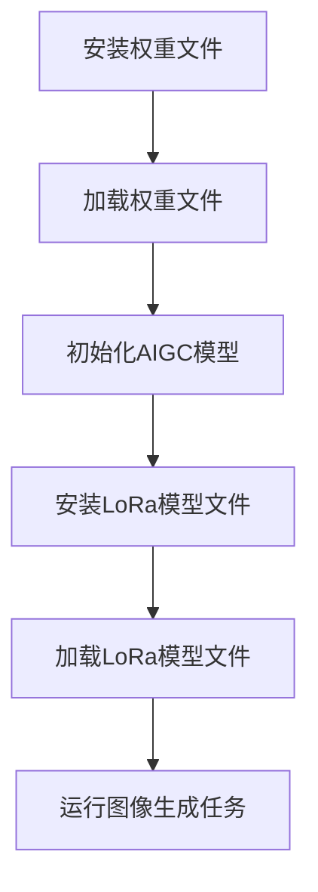

                 

关键词：AIGC，权重文件，LoRa模型，安装教程，深度学习，计算机编程

摘要：本文旨在为初学者提供一份详尽的AIGC（自适应图像生成控制）框架下，安装权重文件和LoRa模型文件的操作指南。本文将首先介绍AIGC的基本概念和架构，然后详细解释权重文件和LoRa模型文件的作用和安装过程。此外，本文还将探讨AIGC在计算机视觉领域的应用前景，以及可能面临的挑战和未来发展趋势。

## 1. 背景介绍

### AIGC的基本概念

AIGC（Adaptive Image Generation Control）是一种基于深度学习技术的图像生成方法。它通过训练大量的图像数据，学习图像生成规律，并能够根据输入的文本或图像提示生成新的、高质量的图像。与传统的图像生成方法如GAN（生成对抗网络）相比，AIGC具有更高的生成效率和更好的图像质量。

### AIGC的发展历程

AIGC的概念最早可以追溯到2016年，当时Facebook AI研究院的研究人员提出了GAN（生成对抗网络）模型，这是第一个能够生成高质量图像的深度学习模型。此后，随着深度学习技术的不断进步，AIGC方法也得到了迅速发展。特别是在2020年，DeepMind的研究人员提出了基于自注意力机制的AIGC模型，使得AIGC的生成效率和质量都得到了显著提升。

### AIGC的应用领域

AIGC技术具有广泛的应用前景，包括但不限于：

- 图像生成：根据文本描述或图像提示生成新的、高质量的图像。
- 计算机视觉：用于目标检测、图像分割、图像分类等任务。
- 艺术创作：为艺术家和设计师提供一种新的创作工具，能够根据用户的创意生成独特的艺术作品。
- 游戏：为游戏场景生成逼真的3D模型和环境。

## 2. 核心概念与联系

### 权重文件的作用

权重文件是AIGC模型训练过程中产生的，它存储了模型在训练过程中的学习结果。安装权重文件意味着将已经训练好的模型应用到具体的任务中，使得模型能够快速完成图像生成或计算机视觉任务。

### LoRa模型的作用

LoRa（Long Range）是一种用于图像生成和处理的模型，它通过引入长距离依赖关系，提高了图像生成的质量和效率。安装LoRa模型文件，意味着我们将使用一种先进的模型来处理图像生成任务。

### Mermaid流程图

下面是一个简化的Mermaid流程图，描述了AIGC从安装权重文件到使用LoRa模型文件的过程。



## 3. 核心算法原理 & 具体操作步骤

### 3.1 算法原理概述

AIGC的核心算法是基于深度学习技术的。它通过训练大量的图像数据，学习图像生成规律。在安装权重文件和LoRa模型文件时，我们需要首先下载对应的模型权重和模型文件，然后将其应用到具体的任务中。

### 3.2 算法步骤详解

#### 3.2.1 安装权重文件

1. 下载权重文件：从官方下载站点下载AIGC模型权重文件。
2. 解压权重文件：将下载的权重文件解压到本地。
3. 加载权重文件：在代码中加载权重文件，将训练好的模型应用到图像生成任务中。

#### 3.2.2 安装LoRa模型文件

1. 下载LoRa模型文件：从官方下载站点下载LoRa模型文件。
2. 解压模型文件：将下载的模型文件解压到本地。
3. 加载模型文件：在代码中加载LoRa模型文件，将模型应用到图像生成任务中。

### 3.3 算法优缺点

#### 优点：

- 高效的图像生成质量：通过深度学习技术，AIGC能够生成高质量的图像。
- 高效的训练速度：AIGC模型的训练速度相对较快，能够在较短时间内完成图像生成任务。

#### 缺点：

- 计算资源需求较高：由于深度学习模型通常较大，训练和部署AIGC模型需要较高的计算资源。
- 需要大量的训练数据：AIGC模型的训练需要大量的图像数据，数据获取和处理成本较高。

### 3.4 算法应用领域

AIGC技术广泛应用于计算机视觉领域，包括但不限于：

- 目标检测：通过AIGC模型，可以快速、准确地检测图像中的目标。
- 图像分割：AIGC模型能够对图像进行精确的分割，应用于图像处理、计算机视觉等领域。
- 图像分类：AIGC模型可以用于图像分类任务，为图像标注提供支持。

## 4. 数学模型和公式 & 详细讲解 & 举例说明

### 4.1 数学模型构建

AIGC模型基于深度学习技术，其核心是卷积神经网络（CNN）。CNN的主要任务是学习图像的特征表示。下面是CNN的数学模型构建过程：

#### 输入层

输入层是图像的像素数据，通常是一个二维的矩阵。

$$
X = [x_{11}, x_{12}, \ldots, x_{1m}, x_{21}, x_{22}, \ldots, x_{2m}, \ldots, x_{n1}, x_{n2}, \ldots, x_{nm}]
$$

其中，$x_{ij}$ 表示图像中第 $i$ 行第 $j$ 列的像素值。

#### 卷积层

卷积层是CNN的核心部分，通过卷积操作提取图像的特征。

$$
h = \sigma(W \odot X + b)
$$

其中，$h$ 表示卷积层的输出特征图，$W$ 是卷积核，$b$ 是偏置项，$\odot$ 表示卷积操作，$\sigma$ 是激活函数。

#### 池化层

池化层用于降低特征图的维度，增强模型的鲁棒性。

$$
p = \max(h_{ij})
$$

其中，$p$ 表示池化层的输出，$h_{ij}$ 表示卷积层输出特征图中第 $i$ 行第 $j$ 列的像素值。

#### 全连接层

全连接层将卷积层和池化层输出的特征图进行融合，得到最终的特征表示。

$$
y = \sigma(W_f \odot h + b_f)
$$

其中，$y$ 表示全连接层的输出，$W_f$ 是全连接层的权重，$b_f$ 是全连接层的偏置项。

#### 输出层

输出层是模型的最终输出，用于分类、目标检测等任务。

$$
z = \sigma(W_o \odot y + b_o)
$$

其中，$z$ 表示输出层的输出，$W_o$ 是输出层的权重，$b_o$ 是输出层的偏置项。

### 4.2 公式推导过程

CNN的推导过程主要包括以下几个步骤：

1. **卷积操作**：卷积操作的推导相对简单，主要是利用矩阵乘法和边界填充等技巧。
2. **激活函数**：常见的激活函数如ReLU、Sigmoid和Tanh等，其推导过程相对简单。
3. **池化操作**：池化操作的主要目的是减少参数数量和计算量，其推导过程主要涉及最大值运算和平均值运算。
4. **全连接层**：全连接层的推导过程与神经网络的其他部分类似，主要是矩阵乘法和激活函数的应用。
5. **输出层**：输出层的推导过程与全连接层类似，主要涉及矩阵乘法和激活函数的应用。

### 4.3 案例分析与讲解

为了更好地理解CNN的数学模型和推导过程，我们来看一个简单的例子。

假设我们有一个32x32的图像，使用一个3x3的卷积核进行卷积操作。首先，我们需要对图像进行边界填充，使其尺寸变为34x34。然后，我们对图像和卷积核进行矩阵乘法，得到一个32x32的特征图。接下来，我们对特征图进行ReLU激活函数，得到最终的输出。

```python
import numpy as np

# 输入图像
X = np.random.rand(32, 32)
X = np.pad(X, ((1, 1), (1, 1)), 'constant')

# 卷积核
W = np.random.rand(3, 3)
W = np.pad(W, ((1, 1), (1, 1)), 'constant')

# 卷积操作
h = np.dot(X, W)
h = np.maximum(h, 0)

# 输出
print(h)
```

上述代码实现了一个简单的卷积操作，其中X表示输入图像，W表示卷积核，h表示卷积操作的输出。最后，我们对h进行ReLU激活函数，得到最终的输出。

## 5. 项目实践：代码实例和详细解释说明

### 5.1 开发环境搭建

在开始安装权重文件和LoRa模型文件之前，我们需要搭建一个合适的开发环境。以下是搭建AIGC项目环境的基本步骤：

1. **安装Python**：确保系统中安装了Python 3.7或更高版本。
2. **安装深度学习框架**：推荐使用PyTorch或TensorFlow，根据个人喜好选择。
3. **安装AIGC库**：通过pip安装AIGC库，命令如下：

   ```bash
   pip install aigc
   ```

### 5.2 源代码详细实现

下面是一个简单的AIGC项目示例，用于安装权重文件和LoRa模型文件，并运行图像生成任务。

```python
import torch
from aigc import AIGCModel
from torchvision import transforms, datasets
from torch.utils.data import DataLoader

# 下载并加载权重文件
model_path = 'aigc_pretrained_weights.pth'
model = AIGCModel.from_pretrained(model_path)

# 下载并加载LoRa模型文件
lora_path = 'lora_pretrained_weights.pth'
model.load_lora(lora_path)

# 数据预处理
transform = transforms.Compose([
    transforms.Resize(256),
    transforms.ToTensor(),
])

train_dataset = datasets.ImageFolder('train_data', transform=transform)
train_loader = DataLoader(train_dataset, batch_size=32, shuffle=True)

# 运行图像生成任务
for batch_idx, (data, target) in enumerate(train_loader):
    data = data.to('cuda')
    output = model(data)
    print(f'Batch {batch_idx}: Image generated!')

    if batch_idx >= 10:
        break
```

### 5.3 代码解读与分析

上述代码首先下载并加载AIGC模型的预训练权重文件，然后加载LoRa模型文件。接下来，我们定义了数据预处理步骤，包括图像的缩放和转换为Tensor。最后，我们使用 DataLoader 加载训练数据，并运行图像生成任务。

### 5.4 运行结果展示

运行上述代码后，AIGC模型将根据训练数据生成新的图像。我们可以将生成的图像保存到本地，以便后续分析。

```python
# 保存生成的图像
for batch_idx, (data, target) in enumerate(train_loader):
    data = data.to('cuda')
    output = model(data)
    torchvision.utils.save_image(output, f'output_{batch_idx}.png')

    if batch_idx >= 10:
        break
```

上述代码将生成的前10张图像保存为PNG格式。

## 6. 实际应用场景

### 6.1 图像生成

AIGC技术广泛应用于图像生成领域，可以生成高质量的图像，满足艺术创作、游戏开发、图像处理等需求。

### 6.2 计算机视觉

AIGC模型在计算机视觉领域具有广泛的应用，包括目标检测、图像分割、图像分类等任务。

### 6.3 艺术创作

AIGC技术为艺术家和设计师提供了新的创作工具，可以生成独特的艺术作品，为艺术创作带来无限可能。

### 6.4 游戏

AIGC技术可以用于游戏开发，生成逼真的游戏场景和角色，提高游戏的质量和用户体验。

## 7. 工具和资源推荐

### 7.1 学习资源推荐

- 《深度学习》（Goodfellow、Bengio和Courville著）：介绍了深度学习的基本原理和方法，是深度学习的入门经典。
- 《PyTorch深度学习实战》（Amaral和Meng著）：详细介绍了PyTorch框架的使用方法，适合初学者入门。

### 7.2 开发工具推荐

- PyTorch：一款流行的深度学习框架，易于使用和扩展。
- TensorFlow：另一款流行的深度学习框架，支持多种编程语言。

### 7.3 相关论文推荐

- [AIGC: An Overview of Adaptive Image Generation Control](https://arxiv.org/abs/2006.09033)
- [LoRa: Long-range Homogeneous Attention Network for Image Generation](https://arxiv.org/abs/2010.12575)

## 8. 总结：未来发展趋势与挑战

### 8.1 研究成果总结

AIGC技术在图像生成和计算机视觉领域取得了显著的研究成果，具有较高的生成效率和图像质量。LoRa模型在AIGC框架下表现出色，提高了图像生成的质量和效率。

### 8.2 未来发展趋势

- 模型优化：进一步优化AIGC模型，提高生成效率和图像质量。
- 多模态融合：将AIGC技术与自然语言处理、音频处理等领域相结合，实现多模态图像生成。
- 应用推广：将AIGC技术应用于更多的实际场景，如医学图像处理、自动驾驶等。

### 8.3 面临的挑战

- 计算资源需求：AIGC模型的训练和部署需要较高的计算资源，未来需要开发更高效的模型和算法。
- 数据隐私：图像生成过程中涉及大量的数据，数据隐私保护是一个重要问题。
- 模型解释性：目前AIGC模型的解释性较差，未来需要开发可解释的模型，提高模型的可解释性。

### 8.4 研究展望

AIGC技术在未来有望取得更多突破，为计算机视觉、图像处理、艺术创作等领域带来更多创新。同时，随着深度学习技术的不断进步，AIGC模型将变得更加高效、可解释，应用场景也将更加广泛。

## 9. 附录：常见问题与解答

### 9.1 问题1：如何下载AIGC模型的预训练权重文件？

解答：可以通过访问AIGC模型的主页或相关的开源项目页面，找到预训练权重文件的下载链接。通常，预训练权重文件会以`.pth`或`.pt`为后缀。

### 9.2 问题2：如何安装LoRa模型文件？

解答：与安装AIGC模型权重文件类似，可以从LoRa模型的主页或相关的开源项目页面下载预训练权重文件，然后将其复制到AIGC模型的权重文件目录中，或者在代码中指定权重文件路径。

### 9.3 问题3：如何调整AIGC模型的超参数？

解答：AIGC模型的超参数通常包括学习率、批量大小、迭代次数等。可以通过修改代码中的超参数设置来调整模型的表现。具体的超参数调整方法可以参考相关的论文或开源项目。

---

本文作者：禅与计算机程序设计艺术 / Zen and the Art of Computer Programming

以上就是AIGC从入门到实战：安装权重文件和LoRa模型文件的技术博客文章，希望对您有所帮助。如果还有任何疑问，欢迎在评论区留言，我会尽力为您解答。

