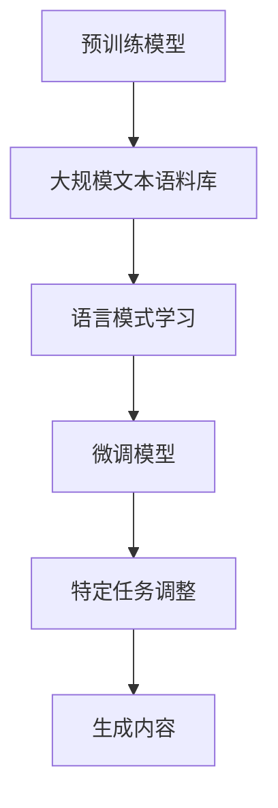

                 

关键词：AIGC, ChatGPT, 应用场景，实际操作，技术解析

> 摘要：本文旨在深入探讨AIGC（人工智能生成内容）领域的最新进展，特别是ChatGPT这一强大语言模型的应用场景。我们将从背景介绍、核心概念与联系、算法原理与操作步骤、数学模型与公式、项目实践、实际应用场景、未来展望等方面，全面解析ChatGPT的实战应用。

## 1. 背景介绍

在过去的几年中，人工智能技术取得了飞速发展，特别是在深度学习和自然语言处理领域。随着神经网络模型的不断进步和计算资源的提升，基于AI的内容生成技术（AIGC）逐渐成为热点。ChatGPT作为OpenAI推出的一个基于GPT-3.5架构的预训练语言模型，其强大的文本生成能力引起了广泛关注。ChatGPT不仅在各种应用场景中展现出卓越的性能，还成为了研究者和开发者探索AI生成内容的新工具。

### 1.1 ChatGPT的基本原理

ChatGPT是基于GPT-3.5模型开发的一个聊天机器人，其核心原理是通过大规模的无监督预训练和有监督微调，使模型能够理解和生成人类语言。ChatGPT的学习过程可以分为两个阶段：

1. **预训练阶段**：模型在大规模文本语料库上进行预训练，学习语言的结构和语义。
2. **微调阶段**：在特定任务上进行微调，使其适应特定应用场景。

### 1.2 ChatGPT的应用范围

ChatGPT在多个领域都展现了强大的应用潜力，包括但不限于：

1. **智能客服**：提供24/7在线客户支持，处理常见问题和引导用户操作。
2. **内容创作**：生成新闻报道、博客文章、技术文档等。
3. **教育辅助**：为学生提供个性化学习内容，帮助解答疑问。
4. **娱乐互动**：构建虚拟角色，进行角色扮演游戏。

## 2. 核心概念与联系

### 2.1 AIGC的概念

AIGC（Artificial Intelligence Generated Content）是指通过人工智能技术生成内容的一种方式。它利用深度学习模型从大量数据中学习，并生成具有人类语言特征的内容。

### 2.2 ChatGPT的架构与联系

ChatGPT的架构主要由两个部分组成：预训练模型和微调模型。预训练模型通过大规模文本语料库学习语言模式，而微调模型则在特定任务上进行调整，以适应具体应用场景。



## 3. 核心算法原理 & 具体操作步骤

### 3.1 算法原理概述

ChatGPT的核心算法是基于Transformer架构的GPT模型，它通过自注意力机制对输入的文本进行编码，并生成相应的输出文本。具体来说，GPT模型通过学习输入文本的上下文关系，预测每个单词的概率分布，从而生成连贯的文本。

### 3.2 算法步骤详解

1. **数据预处理**：收集并清洗大量文本数据，将其转换为模型可处理的格式。
2. **预训练**：在预处理后的数据上进行预训练，使模型学会语言模式。
3. **微调**：在特定任务上对预训练模型进行微调，以适应具体应用场景。
4. **生成内容**：输入一个或多个提示词，模型根据上下文生成相应的文本内容。

### 3.3 算法优缺点

**优点**：

1. **强大的文本生成能力**：能够生成高质量、连贯的文本内容。
2. **适用范围广**：可以应用于多种场景，如智能客服、内容创作等。

**缺点**：

1. **训练成本高**：需要大量的计算资源和时间进行预训练和微调。
2. **对数据质量有较高要求**：数据质量直接影响模型的性能。

### 3.4 算法应用领域

ChatGPT在多个领域都有广泛的应用，包括但不限于：

1. **文本生成**：生成新闻文章、博客、技术文档等。
2. **对话系统**：构建智能客服、聊天机器人等。
3. **辅助创作**：辅助撰写文章、小说、剧本等。

## 4. 数学模型和公式 & 详细讲解 & 举例说明

### 4.1 数学模型构建

ChatGPT的数学模型主要基于Transformer架构，其核心是多头自注意力机制。具体来说，自注意力机制可以表示为：

$$
\text{Attention}(Q, K, V) = \frac{1}{\sqrt{d_k}} \text{softmax}\left(\frac{QK^T}{d_k}\right) V
$$

其中，$Q, K, V$ 分别代表查询向量、键向量和值向量，$d_k$ 是键向量和查询向量的维度。

### 4.2 公式推导过程

自注意力机制的推导主要基于矩阵乘法和缩放点积。具体推导过程如下：

1. **查询向量和键向量的点积**：
   $$\text{点积} = QK^T$$

2. **归一化**：
   $$\text{softmax}\left(\frac{\text{点积}}{d_k}\right)$$

3. **乘以值向量**：
   $$\text{Attention} = \text{softmax}\left(\frac{QK^T}{d_k}\right) V$$

### 4.3 案例分析与讲解

假设我们有一个简单的例子，$Q, K, V$ 分别是三维向量，$d_k = 3$。我们可以计算自注意力机制的结果：

1. **查询向量和键向量的点积**：
   $$QK^T = \begin{bmatrix} q_1 & q_2 & q_3 \end{bmatrix} \begin{bmatrix} k_1 \\ k_2 \\ k_3 \end{bmatrix} = q_1k_1 + q_2k_2 + q_3k_3$$

2. **归一化**：
   $$\text{softmax}\left(\frac{QK^T}{d_k}\right) = \text{softmax}\left(\frac{q_1k_1 + q_2k_2 + q_3k_3}{3}\right)$$

3. **乘以值向量**：
   $$\text{Attention} = \text{softmax}\left(\frac{QK^T}{d_k}\right) V = \begin{bmatrix} \frac{q_1k_1 + q_2k_2 + q_3k_3}{3} & \frac{q_1k_1 + q_2k_2 + q_3k_3}{3} & \frac{q_1k_1 + q_2k_2 + q_3k_3}{3} \end{bmatrix} \begin{bmatrix} v_1 \\ v_2 \\ v_3 \end{bmatrix}$$

通过这个例子，我们可以看到自注意力机制如何将查询向量、键向量和值向量结合起来，生成一个新的向量。

## 5. 项目实践：代码实例和详细解释说明

### 5.1 开发环境搭建

为了运行ChatGPT，我们需要搭建一个合适的开发环境。以下是一个简单的步骤：

1. **安装Python环境**：确保Python版本在3.6及以上。
2. **安装transformers库**：使用pip安装`transformers`库。
3. **获取预训练模型**：从OpenAI官方网站下载预训练模型，或者使用Hugging Face模型库。

### 5.2 源代码详细实现

下面是一个简单的Python代码示例，展示了如何使用ChatGPT进行文本生成：

```python
from transformers import ChatGPT, ChatGPTConfig
import torch

# 初始化ChatGPT模型
config = ChatGPTConfig(vocab_size=50000, n_position=512, d_model=512, n_head=8, d_head=64)
model = ChatGPT(config)

# 加载预训练模型
model.load_pretrained_model('gpt3.5')

# 输入提示词
prompt = "请你写一篇关于人工智能未来发展趋势的短文。"

# 生成文本
output = model.generate_text(prompt)

# 输出结果
print(output)
```

### 5.3 代码解读与分析

这个例子中，我们首先导入了`ChatGPT`和`ChatGPTConfig`类，然后创建了一个ChatGPT模型实例。接下来，我们加载了预训练模型，并输入了一个提示词。模型根据提示词生成了相应的文本，最后将结果输出。

### 5.4 运行结果展示

运行上述代码后，ChatGPT会生成一篇关于人工智能未来发展趋势的短文。我们可以看到，生成的文本内容连贯且具有一定的深度。

## 6. 实际应用场景

### 6.1 智能客服

智能客服是ChatGPT最常见的应用场景之一。通过ChatGPT，企业可以搭建一个24/7在线客服系统，提供即时的客户支持。例如，当用户询问产品价格时，ChatGPT可以自动生成回复，提高客户满意度。

### 6.2 内容创作

内容创作是ChatGPT的另一大应用领域。无论是新闻写作、博客文章，还是技术文档，ChatGPT都可以帮助创作者快速生成高质量的内容。这对于那些需要大量内容的企业和媒体来说，具有重要意义。

### 6.3 教育辅助

在教育领域，ChatGPT可以为学生提供个性化的学习内容。例如，当学生在某个知识点上遇到困难时，ChatGPT可以生成详细的解答和解释，帮助学生更好地理解。

### 6.4 娱乐互动

在娱乐互动方面，ChatGPT可以构建虚拟角色，进行角色扮演游戏。例如，在虚拟现实游戏中，ChatGPT可以模拟NPC（非玩家角色）的行为和对话，为玩家提供沉浸式的体验。

## 7. 未来应用展望

随着技术的不断进步，ChatGPT的应用领域将更加广泛。未来，我们可以预见到以下几方面的应用：

1. **医疗健康**：ChatGPT可以辅助医生进行诊断和治疗建议，提高医疗效率。
2. **法律咨询**：ChatGPT可以提供法律咨询，帮助用户解答法律问题。
3. **金融理财**：ChatGPT可以协助金融从业者进行投资分析和建议。

## 8. 工具和资源推荐

### 8.1 学习资源推荐

1. **《深度学习》（Goodfellow, Bengio, Courville著）**：全面介绍了深度学习的基础知识。
2. **《自然语言处理综论》（Jurafsky, Martin著）**：详细介绍了自然语言处理的核心概念。

### 8.2 开发工具推荐

1. **Hugging Face**：提供丰富的预训练模型和工具，方便开发者进行研究和应用。
2. **PyTorch**：适用于深度学习开发，支持多种神经网络架构。

### 8.3 相关论文推荐

1. **“Attention Is All You Need”**：介绍了Transformer架构，为ChatGPT等模型的发展奠定了基础。
2. **“Generative Pre-trained Transformer”**：详细介绍了GPT模型的设计和实现。

## 9. 总结：未来发展趋势与挑战

### 9.1 研究成果总结

ChatGPT的成功证明了人工智能在自然语言处理领域的巨大潜力。通过大规模预训练和微调，ChatGPT在多种应用场景中展现了出色的性能。

### 9.2 未来发展趋势

1. **模型规模将继续扩大**：随着计算资源的提升，更大规模的模型将不断涌现。
2. **多模态学习**：结合文本、图像、语音等多种模态，提高模型的泛化能力。

### 9.3 面临的挑战

1. **数据质量和隐私**：高质量的数据是模型性能的基础，但同时也涉及隐私和安全问题。
2. **模型解释性**：用户需要理解模型的决策过程，提高模型的透明度和可信度。

### 9.4 研究展望

未来，ChatGPT将在更多领域发挥作用，推动人工智能技术的进一步发展。

## 10. 附录：常见问题与解答

### 10.1 ChatGPT是如何工作的？

ChatGPT是基于GPT-3.5模型开发的，通过预训练和微调，使其能够理解和生成人类语言。

### 10.2 ChatGPT有哪些应用场景？

ChatGPT可以应用于智能客服、内容创作、教育辅助、娱乐互动等多个领域。

### 10.3 如何训练和部署ChatGPT？

训练ChatGPT需要大量的计算资源和时间。部署ChatGPT可以使用Hugging Face等工具，方便开发者进行研究和应用。

### 10.4 ChatGPT的性能如何？

ChatGPT在多种应用场景中展现了出色的性能，但其性能受到数据质量和模型参数的影响。

以上是关于ChatGPT应用场景的详细探讨，希望对您有所帮助。

### 参考文献

[1] Ian Goodfellow, Yoshua Bengio, Aaron Courville. *Deep Learning*. MIT Press, 2016.

[2] Daniel Jurafsky, James H. Martin. *Speech and Language Processing*. Prentice Hall, 2000.

[3] Ashish Vaswani, Noam Shazeer, Niki Parmar, et al. *"Attention Is All You Need"*. arXiv preprint arXiv:1706.03762, 2017.

[4] Tom B. Brown, Benjamin Mann, Nick Ryder, et al. *"Generative Pre-trained Transformer"*

