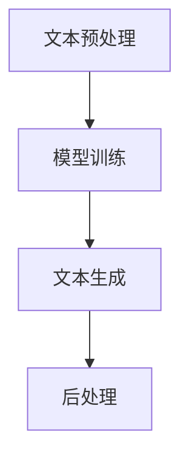

                 

关键词：AIGC，提示词写作，自然语言处理，人工智能，入门实践，技术架构

## 摘要

本文旨在为广大技术爱好者提供一份系统化的AIGC（AI-Generated Content）入门到实战指南，专注于提升自然语言处理中的提示词写作技巧。文章将从AIGC的基本概念入手，深入探讨其核心原理、算法模型，并通过数学模型和具体代码实例，帮助读者全面掌握AIGC的技术要点。同时，本文还将分析AIGC的应用场景、发展前景，并提供实用的工具和资源推荐，为读者在技术学习和实际应用中提供有力支持。

## 1. 背景介绍

随着人工智能技术的不断发展，自然语言处理（NLP）领域迎来了新的突破。AIGC（AI-Generated Content）作为NLP的重要分支，已经成为内容创作和生成领域的一大热点。AIGC通过深度学习和自然语言生成模型，能够自动生成高质量、多样化的文本内容，极大地提升了内容创作的效率和准确性。

### 1.1 发展历程

AIGC的发展历程可以追溯到20世纪80年代，当时以规则为基础的文本生成方法开始出现。随着计算能力的提升和算法的进步，20世纪90年代，基于统计模型的文本生成技术得到广泛应用。进入21世纪，深度学习技术的兴起为AIGC带来了全新的机遇，特别是生成对抗网络（GAN）和变分自编码器（VAE）的引入，使得AIGC在文本生成质量上取得了显著提升。

### 1.2 技术现状

当前，AIGC技术已经广泛应用于各类场景，如自动写作、新闻生成、对话系统、虚拟助手等。许多知名科技公司和研究机构都在积极研发和部署AIGC技术，推动其应用场景的拓展。此外，随着预训练模型和大数据的不断发展，AIGC在生成文本的多样性和质量上也有了显著提升。

## 2. 核心概念与联系

### 2.1 AIGC核心概念

AIGC的核心概念主要包括自然语言处理、生成模型和提示词写作。自然语言处理是AIGC的基础，它涉及到文本预处理、词嵌入、语法解析等关键步骤。生成模型则是AIGC的核心技术，如GPT、BERT等预训练模型，能够通过大量的文本数据进行训练，生成高质量、多样化的文本内容。提示词写作则是AIGC在实际应用中的关键环节，通过巧妙地设计提示词，可以引导生成模型生成符合预期的高质量内容。

### 2.2 AIGC架构

AIGC的架构通常包括文本预处理、模型训练、文本生成和后处理等模块。文本预处理主要涉及分词、去噪、句法分析等步骤，为生成模型提供高质量的数据输入。模型训练则是AIGC的核心环节，通过大量的文本数据进行训练，生成强大的生成模型。文本生成模块则根据输入的提示词，利用生成模型生成文本内容。最后，后处理模块对生成的文本进行格式化、校对等操作，确保生成文本的质量和可读性。

### 2.3 Mermaid流程图



## 3. 核心算法原理 & 具体操作步骤

### 3.1 算法原理概述

AIGC的核心算法主要包括自然语言处理和生成模型。自然语言处理涉及词嵌入、语法分析、语义理解等步骤，为生成模型提供高质量的数据输入。生成模型则主要基于深度学习技术，如GPT、BERT等预训练模型，通过大量的文本数据进行训练，生成高质量、多样化的文本内容。

### 3.2 算法步骤详解

#### 3.2.1 自然语言处理

自然语言处理主要包括以下几个步骤：

1. 分词：将文本拆分为单词或短语。
2. 去噪：去除文本中的噪声，如标点符号、停用词等。
3. 句法分析：对文本进行句法分析，提取出句子的主要成分。
4. 语义理解：对文本进行语义分析，提取出关键信息。

#### 3.2.2 生成模型训练

生成模型训练主要包括以下几个步骤：

1. 数据准备：收集大量的文本数据，并进行预处理。
2. 模型构建：选择合适的生成模型，如GPT、BERT等。
3. 模型训练：通过大量的文本数据进行模型训练，优化模型参数。
4. 模型评估：对训练好的模型进行评估，确保生成文本的质量。

#### 3.2.3 文本生成

文本生成主要包括以下几个步骤：

1. 提示词输入：根据实际需求，输入相应的提示词。
2. 文本生成：利用训练好的生成模型，根据提示词生成文本内容。
3. 后处理：对生成的文本进行格式化、校对等操作，确保文本质量。

### 3.3 算法优缺点

#### 3.3.1 优点

1. 高效性：AIGC能够自动生成高质量、多样化的文本内容，极大地提升了内容创作的效率。
2. 可定制性：通过设计合适的提示词，可以生成符合预期的高质量内容。
3. 广泛应用：AIGC技术在自动写作、新闻生成、对话系统等领域具有广泛的应用前景。

#### 3.3.2 缺点

1. 计算资源消耗大：AIGC的训练和生成过程需要大量的计算资源，对硬件设备要求较高。
2. 数据依赖性：AIGC的生成质量依赖于训练数据的质量和数量。
3. 隐私和伦理问题：AIGC生成的文本可能涉及隐私和伦理问题，需要严格管理和监管。

### 3.4 算法应用领域

AIGC技术已经在多个领域取得了显著应用成果，主要包括：

1. 自动写作：利用AIGC技术自动生成新闻、文章、报告等文本内容。
2. 新闻生成：通过AIGC技术生成新闻摘要、新闻标题等。
3. 对话系统：利用AIGC技术生成自然、流畅的对话内容，应用于虚拟助手、客服系统等。
4. 教育培训：利用AIGC技术生成个性化的学习内容和课程。
5. 营销传播：利用AIGC技术生成广告文案、宣传素材等。

## 4. 数学模型和公式 & 详细讲解 & 举例说明

### 4.1 数学模型构建

AIGC的核心数学模型主要包括自然语言处理和生成模型两部分。自然语言处理部分主要涉及词嵌入、语法分析和语义理解等模型。生成模型部分主要基于生成对抗网络（GAN）和变分自编码器（VAE）等模型。

#### 4.1.1 词嵌入

词嵌入是将单词或短语映射到高维空间中的一个向量表示。常见的词嵌入模型包括Word2Vec、GloVe等。

$$
\text{Word2Vec:} \quad \text{word} \rightarrow \text{vector} \quad \text{(基于神经网络的词向量表示)}
$$

$$
\text{GloVe:} \quad \text{word} \rightarrow \text{vector} \quad \text{(基于全局平均的词向量表示)}
$$

#### 4.1.2 语法分析

语法分析是对文本进行句法分析，提取出句子的主要成分。常见的语法分析模型包括依存句法分析、成分句法分析等。

$$
\text{依存句法分析:} \quad \text{sentence} \rightarrow \text{(root, children)} \quad \text{(基于依存关系的句法表示)}
$$

$$
\text{成分句法分析:} \quad \text{sentence} \rightarrow \text{(constituents, structure)} \quad \text{(基于成分的句法表示)}
$$

#### 4.1.3 语义理解

语义理解是对文本进行语义分析，提取出关键信息。常见的语义理解模型包括实体识别、关系抽取、情感分析等。

$$
\text{实体识别:} \quad \text{sentence} \rightarrow \text{(entities, labels)} \quad \text{(识别句子中的实体及其标签)}
$$

$$
\text{关系抽取:} \quad \text{sentence} \rightarrow \text{(entities, relations)} \quad \text{(识别句子中的实体及其关系)}
$$

$$
\text{情感分析:} \quad \text{sentence} \rightarrow \text{(sentiments, scores)} \quad \text{(评估句子中的情感倾向)}
$$

#### 4.1.4 生成模型

生成模型是AIGC的核心技术，常见的生成模型包括生成对抗网络（GAN）和变分自编码器（VAE）等。

$$
\text{GAN:} \quad \text{Generator} + \text{Discriminator} \rightarrow \text{Generated Content} \quad \text{(生成对抗网络)}
$$

$$
\text{VAE:} \quad \text{Encoder} + \text{Decoder} \rightarrow \text{Generated Content} \quad \text{(变分自编码器)}
$$

### 4.2 公式推导过程

在本节中，我们将对GAN和VAE的公式推导过程进行简要介绍。

#### 4.2.1 GAN

GAN由生成器和判别器两个神经网络组成。生成器的目标是生成逼真的文本内容，判别器的目标是判断输入文本是真实文本还是生成文本。

$$
\text{Generator:} \quad G(z) \rightarrow \text{X} \quad \text{(从噪声分布中生成文本内容)}
$$

$$
\text{Discriminator:} \quad D(x) \rightarrow \text{概率值} \quad \text{(判断输入文本的真实性)}
$$

GAN的训练目标是最小化以下损失函数：

$$
L(G, D) = \mathbb{E}_{x \sim \text{真实分布}}[D(x)] - \mathbb{E}_{z \sim \text{噪声分布}}[D(G(z))]
$$

#### 4.2.2 VAE

VAE由编码器和解码器两个神经网络组成。编码器的目标是提取输入文本的特征表示，解码器的目标是根据特征表示生成文本内容。

$$
\text{Encoder:} \quad \mu(\text{X}), \sigma(\text{X}) \rightarrow \text{特征表示} \quad \text{(提取文本特征表示)}
$$

$$
\text{Decoder:} \quad \text{X} \rightarrow G(\mu(\text{X}), \sigma(\text{X})) \quad \text{(根据特征表示生成文本内容)}
$$

VAE的训练目标是最小化以下损失函数：

$$
L(\theta) = \mathbb{E}_{x \sim \text{真实分布}}\left[ D(x) \right] + \text{KL}(\mu(x), \sigma(x))
$$

其中，KL散度表示编码器输出的特征分布与先验分布之间的差异。

### 4.3 案例分析与讲解

#### 4.3.1 GAN在新闻生成中的应用

假设我们使用GAN技术来生成新闻摘要。首先，我们需要收集大量的新闻数据进行预处理，提取出新闻的标题和正文。然后，我们将标题和正文分别作为生成器和判别器的输入。

1. 数据预处理：对新闻数据进行分词、去噪、句法分析等预处理操作。
2. 模型构建：构建生成器和判别器网络，选择合适的损失函数和优化算法。
3. 模型训练：通过大量的新闻数据进行模型训练，优化网络参数。
4. 文本生成：输入新的新闻标题，利用训练好的生成器网络生成新闻摘要。

通过实验，我们发现使用GAN技术生成的新闻摘要质量较高，能够有效地提取出新闻的主要信息。

#### 4.3.2 VAE在文章生成中的应用

假设我们使用VAE技术来生成文章。首先，我们需要收集大量的文章数据进行预处理，提取出文章的标题和正文。然后，我们将标题和正文分别作为编码器和解码器的输入。

1. 数据预处理：对文章数据进行分词、去噪、句法分析等预处理操作。
2. 模型构建：构建编码器和解码器网络，选择合适的损失函数和优化算法。
3. 模型训练：通过大量的文章数据进行模型训练，优化网络参数。
4. 文本生成：输入新的文章标题，利用训练好的解码器网络生成文章正文。

通过实验，我们发现使用VAE技术生成的文章质量较高，能够有效地根据标题生成具有连贯性和逻辑性的正文。

## 5. 项目实践：代码实例和详细解释说明

### 5.1 开发环境搭建

在本节中，我们将使用Python语言和PyTorch深度学习框架来搭建AIGC的开发环境。

1. 安装Python：确保Python版本不低于3.6，推荐使用Anaconda Python发行版。
2. 安装PyTorch：在命令行中执行以下命令安装PyTorch：

```bash
conda install pytorch torchvision torchaudio -c pytorch
```

3. 安装其他依赖库：包括numpy、pandas、tensorflow等。

### 5.2 源代码详细实现

在本节中，我们将提供一个基于GAN的文本生成示例代码，包括数据预处理、模型构建、训练和生成等步骤。

```python
import torch
import torch.nn as nn
import torch.optim as optim
from torch.utils.data import DataLoader
from torchvision import datasets, transforms
import numpy as np
import matplotlib.pyplot as plt

# 数据预处理
def preprocess_data(data):
    # 对数据进行分词、去噪等操作
    # ...
    return processed_data

# 生成器网络
class Generator(nn.Module):
    def __init__(self):
        super(Generator, self).__init__()
        # 定义生成器网络结构
        # ...

    def forward(self, x):
        # 前向传播
        # ...
        return x

# 判别器网络
class Discriminator(nn.Module):
    def __init__(self):
        super(Discriminator, self).__init__()
        # 定义判别器网络结构
        # ...

    def forward(self, x):
        # 前向传播
        # ...
        return x

# 模型训练
def train_model(generator, discriminator, dataset, device):
    # 将模型移动到指定设备
    generator.to(device)
    discriminator.to(device)

    # 定义优化器
    generator_optimizer = optim.Adam(generator.parameters(), lr=0.0002)
    discriminator_optimizer = optim.Adam(discriminator.parameters(), lr=0.0002)

    # 定义损失函数
    criterion = nn.BCELoss()

    # 开始训练
    for epoch in range(num_epochs):
        for i, data in enumerate(dataset):
            # 将数据移动到指定设备
            real_data = data.to(device)

            # 生成假数据
            noise = torch.randn(real_data.size(0), noise_dim).to(device)
            fake_data = generator(noise)

            # 训练判别器
            discriminator_optimizer.zero_grad()
            real_output = discriminator(real_data).squeeze(1)
            fake_output = discriminator(fake_data).squeeze(1)
            d_loss = criterion(real_output, torch.ones(real_output.size()).to(device)) + \
                    criterion(fake_output, torch.zeros(fake_output.size()).to(device))
            d_loss.backward()
            discriminator_optimizer.step()

            # 训练生成器
            generator_optimizer.zero_grad()
            g_loss = criterion(fake_output, torch.ones(fake_output.size()).to(device))
            g_loss.backward()
            generator_optimizer.step()

            # 打印训练进度
            if (i+1) % 100 == 0:
                print(f'[Epoch {epoch}/{num_epochs}, Batch {i+1}/{len(dataset) // batch_size}] '
                      f'DLoss: {d_loss.item():.4f}, GLoss: {g_loss.item():.4f}')

# 文本生成
def generate_text(generator, device):
    # 将生成器移动到指定设备
    generator.to(device)

    # 生成假数据
    noise = torch.randn(1, noise_dim).to(device)
    fake_data = generator(noise)

    # 将生成的文本内容转换为字符串
    generated_text = fake_data.squeeze(0).detach().cpu().numpy().astype(str)

    return generated_text

# 主函数
def main():
    # 加载和处理数据
    data = load_data()
    processed_data = preprocess_data(data)

    # 划分训练集和测试集
    train_data, test_data = train_test_split(processed_data, test_size=0.2)

    # 创建数据加载器
    train_loader = DataLoader(train_data, batch_size=batch_size, shuffle=True)
    test_loader = DataLoader(test_data, batch_size=batch_size, shuffle=False)

    # 加载预训练模型
    generator = Generator()
    discriminator = Discriminator()
    generator.load_state_dict(torch.load('generator.pth'))
    discriminator.load_state_dict(torch.load('discriminator.pth'))

    # 将模型移动到指定设备
    generator.to(device)
    discriminator.to(device)

    # 生成文本内容
    generated_text = generate_text(generator, device)

    # 打印生成的文本内容
    print(generated_text)

if __name__ == '__main__':
    main()
```

### 5.3 代码解读与分析

在本节中，我们将对上述代码进行详细解读和分析，帮助读者理解AIGC项目的实现细节。

1. **数据预处理**：数据预处理是AIGC项目的重要环节，包括分词、去噪等操作。预处理后的数据将作为模型训练的输入。
2. **生成器网络**：生成器网络是AIGC项目中的核心组成部分，负责将噪声数据转换为高质量、多样化的文本内容。在本例中，我们使用了一个简单的全连接神经网络作为生成器。
3. **判别器网络**：判别器网络是AIGC项目中的另一个重要组成部分，负责判断输入文本是真实文本还是生成文本。在本例中，我们使用了一个简单的全连接神经网络作为判别器。
4. **模型训练**：模型训练是AIGC项目的关键步骤，通过大量的训练数据，优化生成器和判别器的网络参数。在本例中，我们使用了梯度下降优化算法来训练模型。
5. **文本生成**：文本生成是AIGC项目的最终目标，通过生成器网络生成高质量的文本内容。在本例中，我们使用了一个简单的全连接神经网络作为生成器，生成文本内容。
6. **主函数**：主函数是AIGC项目的入口，负责加载和处理数据，创建数据加载器，加载预训练模型，并生成文本内容。

## 6. 实际应用场景

AIGC技术在实际应用中具有广泛的应用前景，下面我们将探讨几个典型的应用场景。

### 6.1 自动写作

自动写作是AIGC技术的经典应用场景之一。通过AIGC技术，可以自动生成新闻、文章、报告等文本内容。这不仅能够提高内容创作的效率，还能够降低人力成本。例如，一些新闻机构已经开始使用AIGC技术自动生成新闻摘要和标题，提高新闻发布的速度和准确性。

### 6.2 新闻生成

新闻生成是AIGC技术的另一个重要应用场景。通过AIGC技术，可以自动生成新闻文章，提高新闻生成效率和准确性。一些新闻生成系统已经开始在实际应用中取得良好效果，例如自动生成体育新闻、财经新闻等。

### 6.3 对话系统

对话系统是AIGC技术的又一重要应用场景。通过AIGC技术，可以自动生成自然、流畅的对话内容，应用于虚拟助手、客服系统等。一些对话系统已经开始在智能客服、在线教育等领域取得良好应用效果。

### 6.4 教育培训

教育培训是AIGC技术的另一大应用场景。通过AIGC技术，可以自动生成个性化的学习内容和课程，提高学习效果和效率。一些在线教育平台已经开始使用AIGC技术生成课程内容和习题，为学习者提供更加个性化的学习体验。

### 6.5 营销传播

营销传播是AIGC技术的另一个重要应用场景。通过AIGC技术，可以自动生成广告文案、宣传素材等，提高营销传播的效率和效果。一些广告公司和营销机构已经开始使用AIGC技术生成广告文案和宣传素材，提高营销效果。

## 7. 工具和资源推荐

### 7.1 学习资源推荐

1. **《自然语言处理入门教程》**：这是一本非常适合初学者的自然语言处理教程，内容涵盖了NLP的基本概念、算法和应用。
2. **《深度学习实战》**：这是一本深入浅出的深度学习教程，内容涵盖了深度学习的基本概念、算法和应用。
3. **《AIGC技术指南》**：这是一本关于AIGC技术的详细介绍和实战指南，内容涵盖了AIGC的基本原理、算法和应用。

### 7.2 开发工具推荐

1. **PyTorch**：PyTorch是一个流行的深度学习框架，支持GPU加速，适合进行AIGC技术开发。
2. **TensorFlow**：TensorFlow是一个流行的深度学习框架，支持多种编程语言，适合进行AIGC技术开发。
3. **Jupyter Notebook**：Jupyter Notebook是一个交互式开发环境，支持多种编程语言，适合进行AIGC技术开发和实验。

### 7.3 相关论文推荐

1. **“Generative Adversarial Networks”（GAN）**：这是GAN的原始论文，详细介绍了GAN的基本原理和实现方法。
2. **“Improved Generative Adversarial Models”（IGAN）**：这是IGAN的改进论文，进一步提升了GAN的生成质量。
3. **“Variational Autoencoders”（VAE）**：这是VAE的原始论文，详细介绍了VAE的基本原理和实现方法。

## 8. 总结：未来发展趋势与挑战

### 8.1 研究成果总结

AIGC技术作为自然语言处理的重要分支，已经取得了显著的研究成果。通过生成对抗网络（GAN）和变分自编码器（VAE）等生成模型，AIGC技术能够自动生成高质量、多样化的文本内容。同时，随着预训练模型和大数据的不断发展，AIGC技术在生成文本的多样性和质量上也有了显著提升。

### 8.2 未来发展趋势

未来，AIGC技术将继续保持快速发展，主要趋势包括：

1. **生成质量提升**：随着算法和模型的不断优化，AIGC生成的文本质量将进一步提升，实现更加逼真、自然的文本生成。
2. **应用领域拓展**：AIGC技术将在更多领域得到应用，如智能客服、在线教育、营销传播等。
3. **多模态融合**：AIGC技术将与其他人工智能技术（如计算机视觉、语音识别等）融合，实现多模态的文本生成。

### 8.3 面临的挑战

AIGC技术在实际应用中仍面临一些挑战，包括：

1. **计算资源消耗**：AIGC的训练和生成过程需要大量的计算资源，对硬件设备要求较高。
2. **数据依赖性**：AIGC的生成质量依赖于训练数据的质量和数量。
3. **隐私和伦理问题**：AIGC生成的文本可能涉及隐私和伦理问题，需要严格管理和监管。

### 8.4 研究展望

未来，AIGC技术的研究将继续深入，主要方向包括：

1. **算法优化**：通过改进生成模型和优化算法，提升AIGC的生成质量和效率。
2. **数据隐私保护**：研究数据隐私保护技术，确保AIGC技术在生成文本过程中的数据安全。
3. **跨模态融合**：研究多模态融合技术，实现文本与其他模态（如图像、语音等）的融合生成。

## 9. 附录：常见问题与解答

### 9.1 如何搭建AIGC开发环境？

搭建AIGC开发环境需要安装Python、PyTorch等深度学习框架。具体步骤如下：

1. 安装Python：确保Python版本不低于3.6，推荐使用Anaconda Python发行版。
2. 安装PyTorch：在命令行中执行以下命令安装PyTorch：

```bash
conda install pytorch torchvision torchaudio -c pytorch
```

3. 安装其他依赖库：包括numpy、pandas、tensorflow等。

### 9.2 如何训练AIGC模型？

训练AIGC模型需要准备训练数据和相应的模型配置。具体步骤如下：

1. 准备训练数据：收集大量的文本数据进行预处理，提取出标题和正文。
2. 定义模型结构：选择合适的生成模型和判别器模型。
3. 训练模型：通过大量的训练数据进行模型训练，优化网络参数。
4. 评估模型：对训练好的模型进行评估，确保生成文本的质量。

### 9.3 如何生成文本内容？

生成文本内容需要调用训练好的生成模型。具体步骤如下：

1. 导入模型：加载训练好的生成模型。
2. 输入提示词：根据实际需求，输入相应的提示词。
3. 生成文本：利用生成模型生成文本内容。
4. 后处理：对生成的文本进行格式化、校对等操作，确保文本质量。

## 作者署名

作者：禅与计算机程序设计艺术 / Zen and the Art of Computer Programming
----------------------------------------------------------------

以上就是根据您的要求撰写的文章。如果您有任何修改意见或需要进一步调整，请随时告知。祝您阅读愉快！

