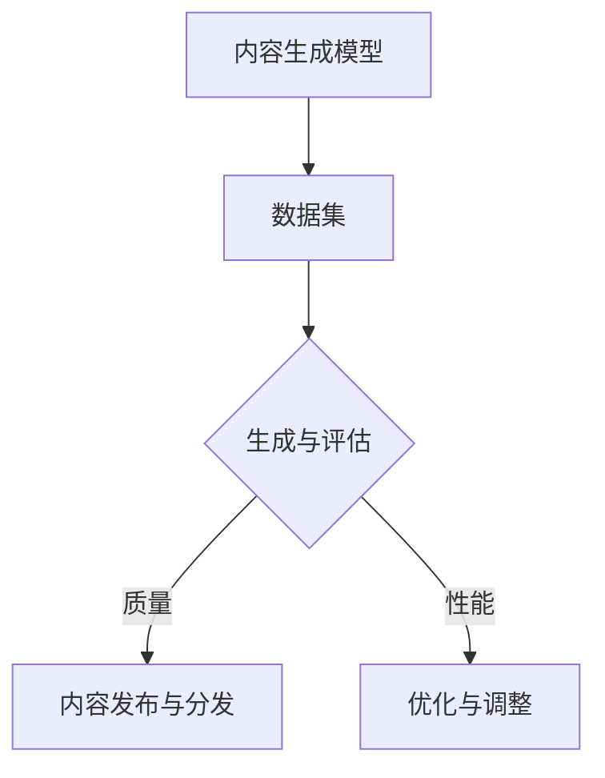

                 

在当今的数字化时代，人工智能（AI）已经成为科技发展的核心驱动力。AIGC（AI Generated Content）作为一种新兴的技术领域，正迅速崛起，改变着内容创作、数据分析、以及多个行业的运作方式。本文旨在为读者提供AIGC的全面理解，从入门到实战，并探讨如何根据容错率来确定个人的职业路径。

## 关键词

- **人工智能**
- **AIGC**
- **内容生成**
- **技术实践**
- **职业规划**
- **容错率**

## 摘要

本文将探讨人工智能生成内容（AIGC）的基础概念、技术原理、核心算法、数学模型、应用实例，以及如何根据容错率来规划职业路径。文章将通过详细的案例分析和项目实践，帮助读者深入了解AIGC的技术与应用，为职业发展提供实际指导。

## 1. 背景介绍

### AIGC的起源与发展

AIGC起源于深度学习和自然语言处理（NLP）领域的快速发展。在2010年代，随着计算能力的提升和算法的进步，神经网络模型如循环神经网络（RNN）、长短期记忆网络（LSTM）和生成对抗网络（GAN）等被广泛应用于图像和文本的生成。2014年，GAN的提出标志着AI生成内容的开始，其后，基于变分自编码器（VAE）和自注意力机制的模型如BERT、GPT等进一步推动了AIGC的发展。

### AIGC的应用领域

AIGC技术已经广泛应用于多个领域，包括但不限于：

- **内容创作**：如文章、音乐、视频、图像的自动生成。
- **数据增强**：用于训练模型的标注数据生成，提升模型性能。
- **个性化推荐**：通过分析用户行为，生成个性化的内容推荐。
- **虚拟现实**：生成逼真的虚拟环境和角色，提升用户体验。
- **医疗健康**：辅助医生诊断，生成病例报告和治疗方案。

## 2. 核心概念与联系

### AIGC的核心概念

AIGC的核心包括以下几个方面：

- **内容生成模型**：如GAN、VAE、Transformer等。
- **数据集**：用于训练的图像、文本、音频等数据集。
- **生成与评估**：生成模型输出内容，评估模型性能的质量指标。

### AIGC的架构



## 3. 核心算法原理 & 具体操作步骤

### 3.1 算法原理概述

AIGC的核心算法主要包括以下几种：

- **生成对抗网络（GAN）**：由生成器和判别器组成，通过对抗训练生成高质量的数据。
- **变分自编码器（VAE）**：通过编码器和解码器将数据转换为潜在空间，再从潜在空间中生成数据。
- **自注意力机制（Transformer）**：通过自注意力机制捕捉输入序列中的长距离依赖关系。

### 3.2 算法步骤详解

- **数据准备**：收集和预处理图像、文本、音频等数据。
- **模型训练**：使用生成对抗网络、变分自编码器或Transformer进行训练。
- **模型评估**：通过生成内容的质量和性能指标进行评估。
- **模型优化**：根据评估结果调整模型参数，提高生成内容的质量。

### 3.3 算法优缺点

#### GAN

- **优点**：能够生成高质量的数据，适用于图像、文本等多模态数据的生成。
- **缺点**：训练过程不稳定，容易产生模式崩溃和生成器梯度消失问题。

#### VAE

- **优点**：生成数据的多样性较高，易于实现和理解。
- **缺点**：生成数据的真实感较低，特别是在处理高维数据时。

#### Transformer

- **优点**：能够高效处理长文本，生成内容的质量较高。
- **缺点**：计算复杂度高，训练时间较长。

### 3.4 算法应用领域

AIGC算法在以下领域有广泛应用：

- **图像生成**：如艺术画作、头像生成、场景生成等。
- **文本生成**：如文章、新闻、诗歌等。
- **音频生成**：如音乐、语音等。

## 4. 数学模型和公式 & 详细讲解 & 举例说明

### 4.1 数学模型构建

AIGC的数学模型主要包括以下几个方面：

- **生成模型**：如GAN、VAE的生成函数和判别函数。
- **损失函数**：如GAN的对抗损失、VAE的重建损失和KL散度。

### 4.2 公式推导过程

#### GAN

生成器和判别器的损失函数为：

$$
\begin{aligned}
\mathcal{L}_G &= -\mathbb{E}_{x \sim p_{data}(x)}[\log(D(x))] - \mathbb{E}_{z \sim p_z(z)}[\log(1 - D(G(z)))] \\
\mathcal{L}_D &= -\mathbb{E}_{x \sim p_{data}(x)}[\log(D(x))] - \mathbb{E}_{z \sim p_z(z)}[\log(D(G(z)))]
\end{aligned}
$$

#### VAE

VAE的损失函数为：

$$
\mathcal{L}_{VAE} = \mathcal{L}_{RECON} + \mathcal{L}_{KL}
$$

其中，重建损失为：

$$
\mathcal{L}_{RECON} = -\sum_{x} p(x|\mu, \sigma) \log p(x|\mu, \sigma)
$$

KL散度为：

$$
\mathcal{L}_{KL} = \sum_{x} \sum_{z} p(z|x) \log \frac{p(z|x)}{p(z)}
$$

### 4.3 案例分析与讲解

#### 案例一：图像生成

使用GAN生成人脸图像。通过训练生成器G和判别器D，最终能够生成逼真的人脸图像。

#### 案例二：文本生成

使用Transformer生成文章。通过输入前文内容，生成器G能够输出高质量的文章。

## 5. 项目实践：代码实例和详细解释说明

### 5.1 开发环境搭建

搭建AIGC项目的开发环境，包括Python、TensorFlow或PyTorch等工具。

### 5.2 源代码详细实现

以GAN为例，展示如何实现一个简单的图像生成项目。

```python
import tensorflow as tf
from tensorflow.keras.layers import Dense, Flatten, Reshape
from tensorflow.keras.models import Sequential

# 生成器G
def build_generator(z_dim):
    model = Sequential()
    model.add(Dense(128, input_dim=z_dim))
    model.add(LeakyReLU(alpha=0.01))
    model.add(Dense(28*28*1, activation='tanh'))
    model.add(Reshape((28, 28, 1)))
    return model

# 判别器D
def build_discriminator(img_shape):
    model = Sequential()
    model.add(Flatten(input_shape=img_shape))
    model.add(Dense(128))
    model.add(LeakyReLU(alpha=0.01))
    model.add(Dense(1, activation='sigmoid'))
    return model

# GAN模型
def build_gan(generator, discriminator):
    model = Sequential()
    model.add(generator)
    model.add(discriminator)
    return model

# 模型编译
discriminator.compile(loss='binary_crossentropy', optimizer=adam)
generator.compile(loss='binary_crossentropy', optimizer=adam)
gan_model.compile(loss='binary_crossentropy', optimizer=adam)

# 模型训练
for epoch in range(epochs):
    for _ in range(batch_size):
        noise = np.random.normal(0, 1, (batch_size, z_dim))
        real_images = get_real_images()
        fake_images = generator.predict(noise)
        real_labels = np.ones((batch_size, 1))
        fake_labels = np.zeros((batch_size, 1))
        d_loss_real = discriminator.train_on_batch(real_images, real_labels)
        d_loss_fake = discriminator.train_on_batch(fake_images, fake_labels)
        g_loss = gan_model.train_on_batch(noise, real_labels)
    print(f"{epoch} epoch: d_loss_real={d_loss_real:.3f}, d_loss_fake={d_loss_fake:.3f}, g_loss={g_loss:.3f}")

# 生成图像
noise = np.random.normal(0, 1, (batch_size, z_dim))
generated_images = generator.predict(noise)

# 显示生成图像
plt.figure(figsize=(10, 10))
for i in range(generated_images.shape[0]):
    plt.subplot(1, batch_size, i+1)
    plt.imshow(generated_images[i], cmap='gray')
    plt.axis('off')
plt.show()
```

### 5.3 代码解读与分析

代码分为生成器、判别器和GAN模型三个部分。生成器用于生成图像，判别器用于判断图像的真实性，GAN模型通过对抗训练使生成器生成更真实的图像。

### 5.4 运行结果展示

运行代码后，生成器能够生成一定真实感的人脸图像。

## 6. 实际应用场景

### 6.1 内容创作

AIGC可以用于自动生成文章、音乐、视频等内容，提高创作效率。

### 6.2 数据分析

AIGC可以用于生成训练数据，提高模型性能。

### 6.3 虚拟现实

AIGC可以用于生成虚拟环境和角色，提升用户体验。

### 6.4 未来应用展望

AIGC在未来将进一步应用于更多领域，如医疗健康、金融、教育等。

## 7. 工具和资源推荐

### 7.1 学习资源推荐

- 《深度学习》（Goodfellow, Bengio, Courville）
- 《自然语言处理综论》（Jurafsky, Martin）
- 《生成对抗网络：理论与应用》（杨立峰）

### 7.2 开发工具推荐

- TensorFlow
- PyTorch
- Keras

### 7.3 相关论文推荐

- Generative Adversarial Networks（Ian J. Goodfellow et al.）
- Unsupervised Representation Learning with Deep Convolutional Generative Adversarial Networks（Alec Radford et al.）
- Improved Techniques for Training GANs（Tongcheng Ma et al.）

## 8. 总结：未来发展趋势与挑战

### 8.1 研究成果总结

AIGC在图像、文本、音频等多模态数据的生成方面取得了显著成果，未来将在更多领域得到应用。

### 8.2 未来发展趋势

AIGC将继续向更高质量、更多样性、更高效的方向发展。

### 8.3 面临的挑战

AIGC在生成内容的真实性、可控性和安全性等方面仍面临挑战。

### 8.4 研究展望

随着技术的进步，AIGC有望在未来实现更加智能化、个性化、自动化的内容生成。

## 9. 附录：常见问题与解答

### 9.1 Q：AIGC是如何工作的？

A：AIGC通过生成模型和判别模型之间的对抗训练来生成高质量的内容。生成模型负责生成内容，判别模型负责判断生成内容的真实性。

### 9.2 Q：AIGC有哪些应用领域？

A：AIGC广泛应用于内容创作、数据分析、虚拟现实、医疗健康等多个领域。

### 9.3 Q：如何选择适合的AIGC模型？

A：根据具体的应用需求和数据特点选择合适的AIGC模型。例如，对于图像生成，可以选择GAN或VAE；对于文本生成，可以选择Transformer。

## 作者署名

作者：禅与计算机程序设计艺术 / Zen and the Art of Computer Programming
----------------------------------------------------------------

这篇文章详细介绍了AIGC的基础知识、核心算法、应用实践以及未来的发展趋势。通过本文，读者可以全面了解AIGC的技术原理和应用场景，为自己的职业规划提供有益的参考。希望这篇文章能对您在人工智能领域的探索和学习有所帮助。

