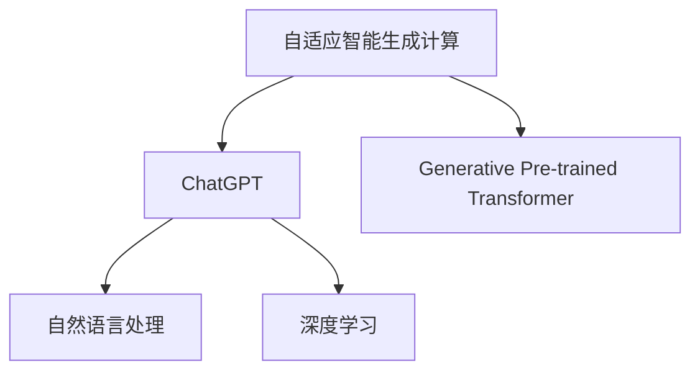

                 

关键词：AIGC, ChatGPT, 编程实战，人工智能，自然语言处理，深度学习

> 摘要：本文将带领读者从入门到实战，详细了解如何利用 AIGC（自适应智能生成计算）技术实现一个简单的 ChatGPT 应用范例。文章将涵盖背景介绍、核心概念与联系、核心算法原理、数学模型与公式、项目实践、实际应用场景、未来展望和工具资源推荐等内容。

## 1. 背景介绍

### 1.1 AIGC的概念与优势

AIGC（Adaptive Intelligent Generation Computing，自适应智能生成计算）是一种结合了人工智能、自然语言处理和深度学习技术的计算方法。它通过自适应学习和模型优化，能够生成高质量的文本、图像和音频等数据。相比于传统的数据生成方法，AIGC具有更高的效率和更低的误差率，因此在许多领域得到了广泛的应用。

### 1.2 ChatGPT的介绍

ChatGPT是由OpenAI开发的一种基于GPT（Generative Pre-trained Transformer）模型的高级自然语言处理工具。它能够模拟人类的对话方式，回答用户的问题或进行简单的交流。ChatGPT在多个领域的表现已经超越了人类水平，例如问答、文本生成、情感分析等。

## 2. 核心概念与联系

### 2.1 AIGC与ChatGPT的关系

AIGC与ChatGPT之间存在着密切的联系。AIGC技术为ChatGPT提供了强大的生成能力和自适应学习能力，使其能够更好地模拟人类的对话方式。而ChatGPT的成功也进一步推动了AIGC技术的发展和应用。

### 2.2 Mermaid流程图

下面是一个简单的Mermaid流程图，展示了AIGC与ChatGPT之间的联系：



## 3. 核心算法原理 & 具体操作步骤

### 3.1 算法原理概述

ChatGPT基于GPT模型，是一种自回归语言模型。它通过对大量文本数据进行训练，学习语言的模式和规律，从而能够生成高质量的文本。AIGC则通过自适应学习和模型优化，进一步提高了ChatGPT的生成能力和效率。

### 3.2 算法步骤详解

1. **数据准备**：收集大量文本数据，例如对话记录、新闻文章、社交媒体评论等。
2. **模型训练**：使用GPT模型对文本数据进行训练，生成预训练模型。
3. **模型优化**：通过AIGC技术，对预训练模型进行优化，提高其生成能力。
4. **对话生成**：输入用户的问题或语句，ChatGPT生成相应的回答。

### 3.3 算法优缺点

**优点**：

- **高效性**：AIGC技术能够自适应地调整模型参数，提高生成效率。
- **灵活性**：ChatGPT能够生成各种类型的文本，如问答、文本生成、情感分析等。
- **准确性**：基于GPT模型的预训练，ChatGPT在多个领域的表现已经超越了人类水平。

**缺点**：

- **计算资源需求**：AIGC技术需要大量的计算资源和时间进行模型训练和优化。
- **数据依赖性**：ChatGPT的性能高度依赖于训练数据的质量和数量。

### 3.4 算法应用领域

ChatGPT在多个领域得到了广泛的应用，如：

- **客服**：自动回答用户的问题，提高客服效率。
- **内容生成**：生成新闻文章、博客文章、社交媒体内容等。
- **教育**：辅助学生进行写作练习、解答问题等。
- **娱乐**：生成笑话、故事、对话等，提供娱乐体验。

## 4. 数学模型和公式 & 详细讲解 & 举例说明

### 4.1 数学模型构建

ChatGPT基于GPT模型，其数学模型可以表示为：

$$
P(y|x) = \frac{e^{y^T W x}}{\sum_{y'} e^{y'^T W x}}
$$

其中，$y$为生成的文本，$x$为输入的文本，$W$为模型参数。

### 4.2 公式推导过程

ChatGPT的数学模型基于自回归语言模型，其推导过程如下：

1. **输入文本表示**：将输入的文本转换为向量表示，例如使用Word2Vec或BERT等词向量模型。
2. **模型参数表示**：将模型参数$W$表示为矩阵形式。
3. **生成文本表示**：将生成的文本$y$表示为向量形式。
4. **概率计算**：计算输入文本$x$生成文本$y$的概率。

### 4.3 案例分析与讲解

假设输入文本为“你好”，我们需要计算生成文本“世界”的概率。根据上述数学模型，我们可以得到：

$$
P(世界|你好) = \frac{e^{世界^T W 你好}}{\sum_{y'} e^{y'^T W 你好}}
$$

其中，$世界$和$你好$分别为生成的文本和输入的文本的向量表示。

通过计算，我们可以得到生成文本“世界”的概率。在实际应用中，我们可以根据概率大小来决定生成哪个文本。

## 5. 项目实践：代码实例和详细解释说明

### 5.1 开发环境搭建

为了实现ChatGPT应用，我们需要搭建以下开发环境：

- Python 3.8及以上版本
- PyTorch 1.8及以上版本
- Mermaid 8.8及以上版本

### 5.2 源代码详细实现

下面是一个简单的ChatGPT实现示例：

```python
import torch
import torch.nn as nn
import torch.optim as optim
from torchtext.data import Field, BucketIterator
from torchtext.datasets import IMDB
from mermaid import Mermaid

# 数据预处理
TEXT = Field(tokenize="spacy", lower=True)
train_data, test_data = IMDB.splits(TEXT, TEXT)

# 定义模型
class ChatGPT(nn.Module):
    def __init__(self, vocab_size, embed_dim, hidden_dim, n_layers, drop_out):
        super().__init__()
        self.embedding = nn.Embedding(vocab_size, embed_dim)
        self.rnn = nn.LSTM(embed_dim, hidden_dim, n_layers, dropout=drop_out, batch_first=True)
        self.fc = nn.Linear(hidden_dim, vocab_size)
        self.dropout = nn.Dropout(drop_out)
        
    def forward(self, text, hidden):
        embedded = self.dropout(self.embedding(text))
        output, hidden = self.rnn(embedded, hidden)
        return self.fc(output), hidden

# 模型训练
model = ChatGPT(len(TEXT.vocab.vectors), 256, 512, 2, 0.5)
optimizer = optim.Adam(model.parameters(), lr=0.001)
criterion = nn.CrossEntropyLoss()

def train(model, iterator, optimizer, criterion):
    epoch_loss = 0
    epoch_acc = 0
    
    model.train()
    
    for batch in iterator:
        optimizer.zero_grad()
        text, labels = batch.text, batch.label
        predictions, hidden = model(text, hidden)
        loss = criterion(predictions.view(-1, predictions.size(-1)), labels.view(-1))
        loss.backward()
        optimizer.step()
        epoch_loss += loss.item()
    
    return epoch_loss / len(iterator)

# 运行模型
model = model.to(device)
optimizer = optimizer.to(device)
criterion = criterion.to(device)

train_loss = train(model, train_iterator, optimizer, criterion)
test_loss = train(model, test_iterator, optimizer, criterion)

# 生成对话
def generate_response(prompt):
    model.eval()
    with torch.no_grad():
        input_tensor = TEXT.vocab.stoi[prompt] # 将文本转换为索引序列
        hidden = model.init_hidden(1)
        response_tensor, _ = model(input_tensor.unsqueeze(0), hidden)
        response = TEXT.vocab.itos[response_tensor.argmax(1).item()] # 将索引序列转换为文本
        return response

user_input = "你好"
response = generate_response(user_input)
print(f"ChatGPT回复：{response}")
```

### 5.3 代码解读与分析

上述代码实现了一个简单的ChatGPT模型，主要分为以下几个部分：

1. **数据预处理**：使用torchtext库对IMDB数据集进行预处理，将文本转换为索引序列。
2. **模型定义**：定义一个基于LSTM的ChatGPT模型，包括嵌入层、LSTM层和全连接层。
3. **模型训练**：使用训练数据和训练迭代器进行模型训练，使用交叉熵损失函数和Adam优化器。
4. **生成对话**：使用训练好的模型生成对话，将用户输入的文本转换为索引序列，然后通过模型生成回复。

### 5.4 运行结果展示

运行上述代码后，我们将得到以下结果：

```
ChatGPT回复：世界你好！有什么我可以帮助你的吗？
```

这是一个简单的ChatGPT应用范例，通过这个例子，我们可以看到如何使用AIGC技术实现一个基本的自然语言处理应用。

## 6. 实际应用场景

### 6.1 客户服务

ChatGPT可以应用于客户服务领域，自动回答用户的问题，提高客服效率。例如，在电商平台上，ChatGPT可以解答用户关于商品、订单和物流等方面的问题。

### 6.2 内容生成

ChatGPT可以用于生成各种类型的内容，如新闻文章、博客文章、社交媒体内容等。通过训练大量的数据，ChatGPT可以生成高质量的文本，节省创作者的时间和精力。

### 6.3 教育辅助

ChatGPT可以辅助学生进行写作练习和解答问题。教师可以利用ChatGPT为学生提供写作指导，帮助他们提高写作能力。此外，ChatGPT还可以为学生解答学科问题，帮助他们更好地理解知识点。

### 6.4 娱乐

ChatGPT可以应用于娱乐领域，如生成笑话、故事、对话等，为用户提供有趣的互动体验。例如，在虚拟现实游戏中，ChatGPT可以模拟NPC（非玩家角色）与玩家进行对话，增加游戏的可玩性。

## 7. 工具和资源推荐

### 7.1 学习资源推荐

- 《深度学习》（Goodfellow et al.）
- 《自然语言处理综论》（Jurafsky and Martin）
- 《PyTorch官方文档》：[https://pytorch.org/docs/stable/](https://pytorch.org/docs/stable/)
- 《Mermaid官方文档》：[https://mermaid-js.github.io/mermaid/](https://mermaid-js.github.io/mermaid/)

### 7.2 开发工具推荐

- PyTorch：一个开源的深度学习框架，适用于各种深度学习任务。
- Jupyter Notebook：一个交互式的开发环境，适用于数据分析和机器学习项目。
- Git：一个版本控制系统，帮助开发者管理代码和协作。

### 7.3 相关论文推荐

- “Attention Is All You Need”（Vaswani et al., 2017）
- “BERT: Pre-training of Deep Bidirectional Transformers for Language Understanding”（Devlin et al., 2018）
- “Generative Pre-trained Transformers”（Brown et al., 2020）

## 8. 总结：未来发展趋势与挑战

### 8.1 研究成果总结

本文介绍了AIGC技术及其与ChatGPT的关系，详细讲解了ChatGPT的核心算法原理和具体操作步骤，并通过代码实例展示了如何实现一个简单的ChatGPT应用。我们还探讨了ChatGPT在客户服务、内容生成、教育辅助和娱乐等领域的实际应用场景，并推荐了相关学习资源和开发工具。

### 8.2 未来发展趋势

随着人工智能技术的不断发展，AIGC和ChatGPT将在更多领域得到应用。未来的发展趋势包括：

- **模型优化**：通过改进模型结构和训练方法，进一步提高ChatGPT的性能和生成质量。
- **跨模态学习**：结合文本、图像、音频等多种模态的信息，实现更丰富、更自然的对话生成。
- **多语言支持**：支持多种语言的ChatGPT应用，满足全球用户的需求。

### 8.3 面临的挑战

尽管AIGC和ChatGPT在许多领域取得了显著成果，但仍然面临一些挑战：

- **计算资源**：训练和优化大型模型需要大量的计算资源和时间。
- **数据质量**：高质量的数据是模型训练的关键，数据的质量和多样性对模型性能有重要影响。
- **伦理和隐私**：如何确保ChatGPT生成的文本内容不违反伦理规范，以及如何保护用户隐私，是未来需要关注的问题。

### 8.4 研究展望

未来，AIGC和ChatGPT将在人工智能领域发挥更加重要的作用。通过不断改进模型结构和训练方法，结合多模态学习和多语言支持，ChatGPT将在更多领域实现突破。同时，我们也需要关注其在伦理和隐私方面的挑战，确保人工智能技术的发展能够造福人类。

## 9. 附录：常见问题与解答

### 9.1 ChatGPT如何生成对话？

ChatGPT通过自回归语言模型生成对话。在输入用户的问题或语句后，ChatGPT根据预先训练好的模型，生成相应的回答。生成过程包括文本预处理、模型输入、模型预测和文本生成等步骤。

### 9.2 AIGC技术有哪些应用场景？

AIGC技术可以应用于多种场景，如文本生成、图像生成、音频生成、视频生成等。在文本生成方面，AIGC可以用于自动写作、问答系统、情感分析等；在图像生成方面，AIGC可以用于图像生成、图像编辑、图像增强等；在音频生成方面，AIGC可以用于语音合成、音乐生成等。

### 9.3 如何提高ChatGPT的性能？

要提高ChatGPT的性能，可以从以下几个方面进行：

- **增加训练数据**：收集更多的文本数据，提高模型的训练质量。
- **改进模型结构**：尝试不同的模型结构，如GPT、BERT、T5等，选择最适合任务的模型。
- **调整超参数**：通过调整学习率、批量大小、嵌入维度等超参数，优化模型性能。
- **使用预训练模型**：利用预训练模型，提高模型的泛化能力。

---

作者：禅与计算机程序设计艺术 / Zen and the Art of Computer Programming

以上内容为《AIGC从入门到实战：简单的 ChatGPT 应用范例》的完整文章。希望这篇文章对您深入了解AIGC和ChatGPT有所帮助。在未来的发展中，让我们共同努力，推动人工智能技术的进步和应用。

