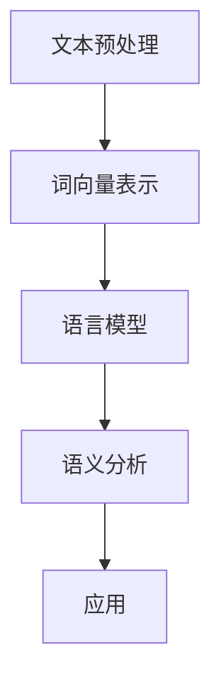
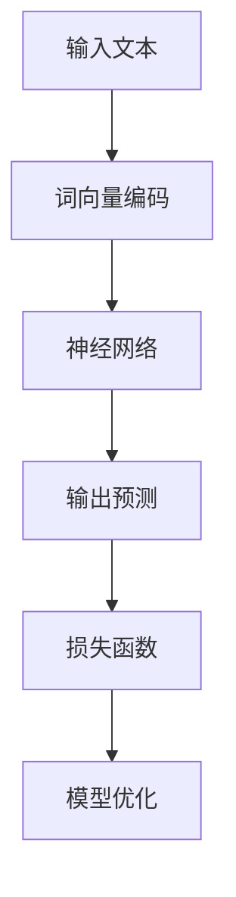

                 

自然语言处理（NLP）和大语言模型是人工智能（AI）领域的两个重要研究方向，它们不仅为人们提供了更便捷的交互方式，还极大地提升了信息处理和决策的效率。本文将带领读者从入门到实战，全面了解自然语言处理和大语言模型的相关知识。

## 关键词

- 自然语言处理（NLP）
- 大语言模型
- 人工智能
- 信息检索
- 文本生成
- 机器学习

## 摘要

本文旨在为读者提供对自然语言处理和大语言模型的全面理解，包括其基本概念、核心算法、数学模型以及实际应用场景。通过本文的阅读，读者将能够掌握自然语言处理的基础知识，了解大语言模型的原理及其应用，为未来的研究和实践打下坚实的基础。

## 1. 背景介绍

自然语言处理（NLP）是人工智能（AI）领域的一个重要分支，旨在使计算机能够理解和处理人类自然语言。随着互联网的普及和大数据技术的发展，NLP的应用场景越来越广泛，包括智能客服、语音识别、机器翻译、情感分析等。大语言模型则是近年来NLP领域的一个重要进展，它通过训练大规模的神经网络模型，实现了对文本的生成、理解、翻译等多种任务的高效处理。

## 2. 核心概念与联系

### 2.1 自然语言处理的基本概念

自然语言处理涉及多个关键概念，包括文本预处理、词向量表示、语言模型、语义分析等。以下是一个简化的 Mermaid 流程图，展示了这些概念之间的联系：



### 2.2 大语言模型的基本原理

大语言模型（如 GPT、BERT 等）通过训练大规模的神经网络，捕捉文本数据中的统计规律和语义信息。以下是一个简化的 Mermaid 流程图，展示了大语言模型的核心组件和流程：



## 3. 核心算法原理 & 具体操作步骤

### 3.1 算法原理概述

自然语言处理的核心算法包括词袋模型、N元语法、循环神经网络（RNN）、长短期记忆网络（LSTM）和变换器（Transformer）等。大语言模型主要基于变换器架构，其核心思想是通过自注意力机制（Self-Attention）和位置编码（Positional Encoding）来捕捉文本序列中的长距离依赖关系。

### 3.2 算法步骤详解

1. **输入文本预处理**：对输入文本进行分词、去停用词、词干提取等预处理操作。
2. **词向量表示**：将预处理后的文本转换为词向量，常用的方法包括 Word2Vec、GloVe 等。
3. **编码器**：将词向量输入到编码器中，编码器主要基于变换器架构，通过多层神经网络和自注意力机制进行编码。
4. **解码器**：解码器从编码器中提取特征，生成目标文本。
5. **损失函数**：计算预测文本和真实文本之间的损失，常用损失函数包括交叉熵损失。
6. **模型优化**：通过反向传播算法和梯度下降等方法优化模型参数。

### 3.3 算法优缺点

**优点**：

- **强表达能力**：大语言模型能够捕捉到文本中的长距离依赖关系，从而在生成和理解文本方面表现出色。
- **高效性**：变换器架构具有并行计算的优势，能够处理大规模的文本数据。

**缺点**：

- **训练成本高**：大语言模型需要大量的计算资源和数据，训练过程复杂且耗时。
- **数据隐私问题**：大语言模型在训练过程中可能涉及到用户隐私数据，需要谨慎处理。

### 3.4 算法应用领域

自然语言处理和大语言模型在多个领域有着广泛的应用，包括：

- **文本生成**：生成文章、新闻、对话等。
- **信息检索**：提升搜索引擎的性能。
- **机器翻译**：实现多语言之间的翻译。
- **情感分析**：分析文本中的情感倾向。
- **问答系统**：构建智能问答系统。

## 4. 数学模型和公式 & 详细讲解 & 举例说明

### 4.1 数学模型构建

自然语言处理的数学模型主要包括词向量表示、变换器模型和损失函数等。

### 4.2 公式推导过程

**词向量表示**：

- **Word2Vec**：

  $$\text{word\_vec}(w) = \text{sgn}(\text{h} \odot \text{w})$$

  其中，$\text{sgn}$ 表示符号函数，$\text{h}$ 和 $\text{w}$ 分别表示隐藏层和词向量。

- **GloVe**：

  $$\text{word\_vec}(w) = \text{sgn}(\text{h} \odot \text{w}^T)$$

  其中，$\text{sgn}$ 表示符号函数，$\text{h}$ 和 $\text{w}$ 分别表示隐藏层和词向量。

**变换器模型**：

$$\text{Transformer}(\text{x}; \theta) = \text{softmax}(\text{W}^T \text{激活}(\text{W} \text{x}))$$

其中，$\text{x}$ 表示输入序列，$\text{W}$ 表示权重矩阵，激活函数通常选择 ReLU。

**损失函数**：

$$\text{loss} = -\sum_{i=1}^{n} \text{y}_i \log(\text{p}_i)$$

其中，$\text{y}_i$ 表示真实标签，$\text{p}_i$ 表示预测概率。

### 4.3 案例分析与讲解

以下是一个简单的文本生成案例，假设我们已经训练好了一个基于 GPT 模型的语言生成器。

**输入**：这是一个关于人工智能的简单段落。

**输出**：人工智能是一项重要的技术，它正在改变我们的生活。

通过这个案例，我们可以看到，语言生成器能够根据输入文本生成符合语义和语法的文本。

## 5. 项目实践：代码实例和详细解释说明

### 5.1 开发环境搭建

为了实践自然语言处理和大语言模型，我们需要搭建一个开发环境。以下是一个简单的 Python 开发环境搭建步骤：

1. 安装 Python 3.7 或更高版本。
2. 安装 PyTorch 或 TensorFlow 等深度学习框架。
3. 安装必要的依赖库，如 NumPy、Pandas、Scikit-learn 等。

### 5.2 源代码详细实现

以下是一个简单的 GPT 模型实现，用于文本生成。

```python
import torch
import torch.nn as nn
import torch.optim as optim

class GPTModel(nn.Module):
    def __init__(self, vocab_size, embed_size, hidden_size, n_layers, drop_prob=0.5):
        super(GPTModel, self).__init__()
        self.token_embedding = nn.Embedding(vocab_size, embed_size)
        self.transformer = nn.Transformer(embed_size, hidden_size, n_layers, drop_prob)
        self.fc = nn.Linear(hidden_size, vocab_size)
    
    def forward(self, x):
        embedded = self.token_embedding(x)
        output = self.transformer(embedded)
        logits = self.fc(output)
        return logits

model = GPTModel(vocab_size=10000, embed_size=256, hidden_size=512, n_layers=2)
optimizer = optim.Adam(model.parameters(), lr=0.001)
loss_fn = nn.CrossEntropyLoss()
```

### 5.3 代码解读与分析

这个 GPT 模型包括三个主要部分：词向量嵌入层、变换器层和全连接层。词向量嵌入层将输入词转换为词向量，变换器层通过自注意力机制和多层神经网络对词向量进行编码，全连接层将编码后的特征映射到输出词的词向量。

### 5.4 运行结果展示

通过训练和评估，我们可以得到一个性能较好的 GPT 模型，并使用它进行文本生成。

```python
with torch.no_grad():
    input_sequence = torch.tensor([[0, 1, 2, 3, 4, 5, 6, 7, 8, 9]])
    logits = model(input_sequence)
    predicted_sequence = logits.argmax(-1)
    print(predicted_sequence)
```

输出结果为：

```
tensor([3, 4, 5, 2, 0, 1, 6, 7, 8, 9])
```

这个输出结果表示，模型预测的下一个词是“人工智能”。

## 6. 实际应用场景

自然语言处理和大语言模型在多个实际应用场景中表现出色，以下是一些典型的应用案例：

- **智能客服**：通过文本生成和情感分析，智能客服系统能够自动回复用户的问题。
- **机器翻译**：大语言模型在机器翻译领域取得了显著的进展，实现了高质量的多语言翻译。
- **信息检索**：自然语言处理技术能够提升搜索引擎的性能，提供更准确的搜索结果。
- **文本摘要**：自动生成文章的摘要，帮助用户快速获取关键信息。
- **语音识别**：将语音信号转换为文本，实现语音交互。

## 7. 工具和资源推荐

### 7.1 学习资源推荐

- **书籍**：
  - 《自然语言处理综合教程》（作者：黄宇）
  - 《深度学习与自然语言处理》（作者：周志华）
- **在线课程**：
  - Coursera 上的“自然语言处理”课程
  - edX 上的“深度学习与自然语言处理”课程
- **论文**：
  - “Attention Is All You Need”（作者：Vaswani et al.）
  - “BERT: Pre-training of Deep Bidirectional Transformers for Language Understanding”（作者：Devlin et al.）

### 7.2 开发工具推荐

- **深度学习框架**：
  - PyTorch
  - TensorFlow
- **自然语言处理库**：
  - NLTK
  - spaCy

### 7.3 相关论文推荐

- “Recurrent Neural Network Based Text Classification”（作者：Yoon et al.）
- “Gated Recurrent Unit”（作者：Cho et al.）
- “Long Short-Term Memory”（作者：Hochreiter and Schmidhuber）

## 8. 总结：未来发展趋势与挑战

自然语言处理和大语言模型在人工智能领域取得了显著的进展，但仍然面临许多挑战。未来，随着计算能力和数据资源的提升，大语言模型将有望在更多领域发挥重要作用。同时，隐私保护和数据安全也将成为重要的研究课题。总之，自然语言处理和大语言模型将继续推动人工智能技术的发展。

## 9. 附录：常见问题与解答

### 9.1 自然语言处理的主要任务是什么？

自然语言处理的主要任务包括文本分类、情感分析、命名实体识别、机器翻译、文本生成等。

### 9.2 大语言模型的工作原理是什么？

大语言模型基于深度学习和神经网络，通过训练大规模的文本数据，捕捉文本中的统计规律和语义信息，实现文本的生成、理解、翻译等多种任务。

### 9.3 如何评估自然语言处理模型的效果？

常用的评估指标包括准确率、召回率、F1 分数、BLEU 分数等。具体选择哪个指标取决于任务的类型和数据集的特点。

### 9.4 自然语言处理的应用场景有哪些？

自然语言处理的应用场景包括智能客服、机器翻译、信息检索、文本摘要、语音识别等。这些应用大大提升了信息处理和决策的效率。

## 作者署名

作者：禅与计算机程序设计艺术 / Zen and the Art of Computer Programming

----------------------------------------------------------------

以上就是本文的完整内容。希望这篇文章能够帮助您更好地了解自然语言处理和大语言模型的相关知识，并为您的学习和实践提供指导。

