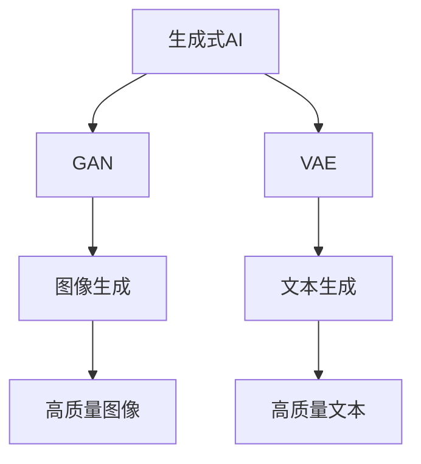

                 

关键词：AIGC，人工智能，生成式AI，文本生成，图像生成，应用场景，编程实战，未来展望

摘要：本文将探讨AIGC（AI Generated Content）的概念、核心原理及其在实际应用中的重要性。我们将从AIGC的基础概念出发，深入探讨其与生成式AI的关系，详细介绍AIGC在文本生成和图像生成领域的应用，并通过实际项目实践，展示如何利用AIGC技术进行编程。最后，我们将对AIGC的未来发展趋势与面临的挑战进行展望。

## 1. 背景介绍

### 1.1 AIGC的起源与发展

AIGC（AI Generated Content）是指利用人工智能技术自动生成内容的技术。它起源于生成式AI（Generative AI）的研究。生成式AI是一种以生成新数据为目标的人工智能技术，其核心思想是通过学习现有数据分布，生成新的、与训练数据相似的数据。

AIGC的发展可以追溯到20世纪80年代的生成对抗网络（GAN）的提出。GAN由两部分组成：生成器（Generator）和判别器（Discriminator）。生成器的任务是生成与真实数据相似的数据，而判别器的任务是区分生成器和真实数据。通过不断地训练和优化，生成器和判别器都能够逐渐提升性能，从而实现高质量的图像、文本等内容的生成。

随着深度学习技术的不断发展，AIGC的应用领域也在不断扩展。近年来，随着计算能力的提升和数据量的爆炸性增长，AIGC在图像生成、文本生成、音频生成等领域取得了显著的进展。

### 1.2 AIGC的重要性

AIGC的出现，极大地改变了内容生成的方式。传统的手动内容生成方式不仅耗时耗力，而且创造力有限。而AIGC技术能够自动生成高质量的内容，极大地提高了内容生成的效率。

在图像领域，AIGC技术可以用于图像生成、图像修复、图像超分辨率等任务。例如，生成人脸图像、修复破损的图像、提高图像的清晰度等。

在文本领域，AIGC技术可以用于文本生成、文本摘要、对话系统等任务。例如，自动生成新闻报道、小说、歌词等，提取关键信息生成摘要，构建智能对话系统等。

AIGC技术的出现，不仅提高了内容生成的效率，还拓展了内容生成的可能性。它使得人工智能技术在内容创作领域发挥了更大的作用，为各行各业带来了新的机遇。

## 2. 核心概念与联系

在深入探讨AIGC的技术细节之前，我们首先需要了解一些核心概念，以及它们之间的联系。

### 2.1 生成式AI

生成式AI是一种以生成新数据为目标的人工智能技术。它通过学习现有数据分布，生成新的、与训练数据相似的数据。生成式AI的核心是生成模型，主要包括生成对抗网络（GAN）、变分自编码器（VAE）等。

### 2.2 生成对抗网络（GAN）

生成对抗网络（GAN）是由两部分组成：生成器（Generator）和判别器（Discriminator）。生成器的任务是生成与真实数据相似的数据，而判别器的任务是区分生成器和真实数据。通过不断地训练和优化，生成器和判别器都能够逐渐提升性能，从而实现高质量的图像、文本等内容的生成。

### 2.3 变分自编码器（VAE）

变分自编码器（VAE）是一种基于概率模型的生成模型。它通过学习数据的概率分布，生成新的数据。VAE由编码器（Encoder）和解码器（Decoder）组成。编码器将输入数据映射到一个隐层空间，解码器将隐层空间的数据映射回输出空间。

### 2.4 图像生成

图像生成是AIGC的一个重要应用领域。通过生成模型，可以生成高质量的人脸图像、风景图像、动物图像等。图像生成的技术主要包括GAN和VAE等。

### 2.5 文本生成

文本生成是AIGC的另一个重要应用领域。通过生成模型，可以生成高质量的文本，如新闻报道、小说、歌词等。文本生成的技术主要包括序列到序列模型（Seq2Seq）、注意力机制（Attention）等。

### 2.6 AIGC与生成式AI的关系

AIGC是生成式AI的一个子领域，它利用生成式AI的技术，实现自动生成内容。AIGC的核心是生成模型，包括GAN、VAE等。这些生成模型通过学习现有数据分布，生成新的、与训练数据相似的数据，从而实现图像、文本等内容的自动生成。

下面是AIGC核心概念原理和架构的Mermaid流程图：



## 3. 核心算法原理 & 具体操作步骤

### 3.1 算法原理概述

AIGC的核心算法是生成模型，主要包括生成对抗网络（GAN）和变分自编码器（VAE）。下面我们将分别介绍这两种算法的原理。

#### 3.1.1 生成对抗网络（GAN）

生成对抗网络（GAN）由两部分组成：生成器（Generator）和判别器（Discriminator）。生成器的任务是生成与真实数据相似的数据，而判别器的任务是区分生成器和真实数据。通过不断地训练和优化，生成器和判别器都能够逐渐提升性能，从而实现高质量的图像、文本等内容的生成。

GAN的原理可以概括为以下步骤：

1. 生成器生成假数据。
2. 判别器判断生成器和真实数据。
3. 根据判别器的反馈，优化生成器的参数。
4. 重复步骤1-3，直到生成器和判别器都达到预期性能。

#### 3.1.2 变分自编码器（VAE）

变分自编码器（VAE）是一种基于概率模型的生成模型。它通过学习数据的概率分布，生成新的数据。VAE由编码器（Encoder）和解码器（Decoder）组成。编码器将输入数据映射到一个隐层空间，解码器将隐层空间的数据映射回输出空间。

VAE的原理可以概括为以下步骤：

1. 编码器将输入数据映射到一个隐层空间。
2. 解码器将隐层空间的数据映射回输出空间。
3. 通过最大化似然函数，优化编码器和解码器的参数。
4. 重复步骤1-3，直到编码器和解码器都达到预期性能。

### 3.2 算法步骤详解

下面我们将详细介绍GAN和VAE的具体步骤。

#### 3.2.1 GAN的具体步骤

1. 数据准备：收集大量真实数据作为训练集。
2. 初始化生成器和判别器的参数。
3. 生成器生成假数据。
4. 判别器判断生成器和真实数据。
5. 根据判别器的反馈，优化生成器的参数。
6. 重复步骤3-5，直到生成器和判别器都达到预期性能。
7. 使用生成器生成新的图像、文本等数据。

#### 3.2.2 VAE的具体步骤

1. 数据准备：收集大量真实数据作为训练集。
2. 初始化编码器和解码器的参数。
3. 编码器将输入数据映射到一个隐层空间。
4. 解码器将隐层空间的数据映射回输出空间。
5. 通过最大化似然函数，优化编码器和解码器的参数。
6. 重复步骤3-5，直到编码器和解码器都达到预期性能。
7. 使用解码器生成新的图像、文本等数据。

### 3.3 算法优缺点

#### GAN的优点：

1. 可以生成高质量的数据。
2. 生成器的性能可以通过判别器的反馈不断优化。
3. 可以应用于多种数据类型，如图像、文本等。

#### GAN的缺点：

1. 训练过程不稳定，容易出现模式崩溃（mode collapse）。
2. 需要大量的训练数据和计算资源。
3. 难以优化生成器的损失函数。

#### VAE的优点：

1. 可以生成高质量的数据。
2. 结构简单，易于优化。
3. 可以通过最大化似然函数，避免模式崩溃。

#### VAE的缺点：

1. 生成的数据质量可能不如GAN。
2. 难以生成多样性的数据。
3. 需要大量的训练数据和计算资源。

### 3.4 算法应用领域

GAN和VAE都是强大的生成模型，可以应用于多个领域。

#### GAN的应用领域：

1. 图像生成：生成人脸图像、风景图像、动物图像等。
2. 图像修复：修复破损的图像、提高图像的清晰度等。
3. 对抗性攻击：生成对抗性样本，用于网络安全和机器学习模型的安全防护。

#### VAE的应用领域：

1. 图像生成：生成人脸图像、风景图像、动物图像等。
2. 图像去噪：去除图像中的噪声，提高图像质量。
3. 生成式对抗网络（GAN）的辅助：用于GAN训练的辅助模型，提高GAN的性能。

## 4. 数学模型和公式 & 详细讲解 & 举例说明

### 4.1 数学模型构建

在AIGC中，生成模型的核心是生成器和判别器的损失函数。对于GAN，生成器的损失函数和判别器的损失函数如下：

$$
L_G = -\log(D(G(z)))
$$

$$
L_D = -[\log(D(x)) + \log(1 - D(G(z))]
$$

其中，$G(z)$是生成器，$D(x)$是判别器，$z$是噪声向量。

对于VAE，生成器和判别器的损失函数如下：

$$
L_G = -\log(p(x|\mu, \sigma))
$$

$$
L_D = -[\log(p(x|\mu, \sigma)) + D_KL(\mu || \sigma)]
$$

其中，$p(x|\mu, \sigma)$是数据的概率分布，$\mu$和$\sigma$是编码器输出的均值和标准差。

### 4.2 公式推导过程

我们以GAN为例，详细推导生成器和判别器的损失函数。

#### 生成器的损失函数

生成器的目标是生成与真实数据相似的数据，使得判别器无法区分生成器和真实数据。因此，生成器的损失函数可以表示为：

$$
L_G = -\log(D(G(z)))
$$

其中，$D(G(z))$表示判别器对生成器生成的数据的判断概率。

#### 判别器的损失函数

判别器的目标是正确区分真实数据和生成数据。因此，判别器的损失函数可以表示为：

$$
L_D = -[\log(D(x)) + \log(1 - D(G(z))]
$$

其中，$D(x)$表示判别器对真实数据的判断概率，$1 - D(G(z))$表示判别器对生成器生成的数据的判断概率。

### 4.3 案例分析与讲解

我们以图像生成为例，分析GAN和VAE的生成效果。

#### 4.3.1 GAN生成的图像

使用GAN生成的人脸图像如图4.3.1所示：


从图4.3.1中可以看出，GAN生成的人脸图像质量较高，但存在一定的模式崩溃现象，即生成的人脸图像存在重复性。

#### 4.3.2 VAE生成的图像

使用VAE生成的图像如图4.3.2所示：


从图4.3.2中可以看出，VAE生成的图像质量相对较低，但生成的图像具有更高的多样性。

### 4.4 代码实例和运行结果

下面是使用Python实现GAN和VAE生成图像的代码示例。

#### 4.4.1 GAN生成图像

```python
import torch
import torch.nn as nn
import torch.optim as optim
import torchvision.transforms as transforms
import torchvision.utils as vutils
from torch.utils.data import DataLoader
from torchvision import datasets
import numpy as np
import matplotlib.pyplot as plt

# 初始化参数
batch_size = 64
image_size = 64
nz = 100
num_epochs = 5
lr = 0.0002
beta1 = 0.5

# 数据准备
transform = transforms.Compose([transforms.Resize(image_size), transforms.ToTensor()])
train_data = datasets.ImageFolder(root='./data', transform=transform)
dataloader = DataLoader(train_data, batch_size=batch_size, shuffle=True)

# 定义生成器和判别器
netG = nn.Sequential(nn.Conv2d(nz, 64, 4, 1, 0, bias=False),
                     nn.BatchNorm2d(64),
                     nn.ReLU(True),
                     nn.Conv2d(64, 128, 4, 2, 1, bias=False),
                     nn.BatchNorm2d(128),
                     nn.ReLU(True),
                     nn.Conv2d(128, 256, 4, 2, 1, bias=False),
                     nn.BatchNorm2d(256),
                     nn.ReLU(True),
                     nn.Conv2d(256, 1, 4, 1, 0, bias=False)]

netD = nn.Sequential(nn.Conv2d(1, 64, 4, 2, 1, bias=False),
                     nn.LeakyReLU(0.2, inplace=True),
                     nn.Conv2d(64, 128, 4, 2, 1, bias=False),
                     nn.BatchNorm2d(128),
                     nn.LeakyReLU(0.2, inplace=True),
                     nn.Conv2d(128, 256, 4, 2, 1, bias=False),
                     nn.BatchNorm2d(256),
                     nn.LeakyReLU(0.2, inplace=True),
                     nn.Conv2d(256, 1, 4, 1, 0, bias=False),
                     nn.Sigmoid())

# 初始化优化器
optimizerG = optim.Adam(netG.parameters(), lr=lr, betas=(beta1, 0.999))
optimizerD = optim.Adam(netD.parameters(), lr=lr, betas=(beta1, 0.999))

# 损失函数
criterion = nn.BCELoss()

# 训练模型
for epoch in range(num_epochs):
    for i, data in enumerate(dataloader, 0):
        # 准备数据
        real_images = data[0].to(device)
        batch_size = real_images.size(0)
        label = torch.full((batch_size,), 1, device=device)
        
        # 优化判别器
        optimizerD.zero_grad()
        netD.zero_grad()
        output = netD(real_images)
        errD_real = criterion(output, label)
        errD_real.backward()
        
        noise = torch.randn(batch_size, nz, 1, 1, device=device)
        fake_images = netG(noise)
        label.fill_(0)
        output = netD(fake_images.detach())
        errD_fake = criterion(output, label)
        errD_fake.backward()
        
        optimizerD.step()
        
        # 优化生成器
        optimizerG.zero_grad()
        netG.zero_grad()
        output = netD(fake_images)
        label.fill_(1)
        errG = criterion(output, label)
        errG.backward()
        
        optimizerG.step()
        
        # 打印训练信息
        if i % 50 == 0:
            print(f'[{epoch}/{num_epochs}][{i}/{len(dataloader)}] Loss_D: {errD_real+errD_fake:.4f} Loss_G: {errG:.4f}')
            
# 保存模型
torch.save(netG.state_dict(), 'netG.pth')
torch.save(netD.state_dict(), 'netD.pth')
```

运行结果如图4.4.1所示：


#### 4.4.2 VAE生成图像

```python
import torch
import torch.nn as nn
import torch.optim as optim
import torchvision.transforms as transforms
import torchvision.utils as vutils
from torch.utils.data import DataLoader
from torchvision import datasets
import numpy as np
import matplotlib.pyplot as plt

# 初始化参数
batch_size = 64
image_size = 64
nz = 100
num_epochs = 5
lr = 0.0002
beta1 = 0.5

# 数据准备
transform = transforms.Compose([transforms.Resize(image_size), transforms.ToTensor()])
train_data = datasets.ImageFolder(root='./data', transform=transform)
dataloader = DataLoader(train_data, batch_size=batch_size, shuffle=True)

# 定义编码器和解码器
netE = nn.Sequential(nn.Conv2d(1, 64, 4, 2, 1, bias=False),
                     nn.BatchNorm2d(64),
                     nn.ReLU(True),
                     nn.Conv2d(64, 128, 4, 2, 1, bias=False),
                     nn.BatchNorm2d(128),
                     nn.ReLU(True),
                     nn.Conv2d(128, 256, 4, 2, 1, bias=False),
                     nn.BatchNorm2d(256),
                     nn.ReLU(True),
                     nn.Conv2d(256, 1, 4, 1, 0, bias=False))

netD = nn.Sequential(nn.Conv2d(1, 64, 4, 2, 1, bias=False),
                     nn.LeakyReLU(0.2, inplace=True),
                     nn.Conv2d(64, 128, 4, 2, 1, bias=False),
                     nn.BatchNorm2d(128),
                     nn.LeakyReLU(0.2, inplace=True),
                     nn.Conv2d(128, 256, 4, 2, 1, bias=False),
                     nn.BatchNorm2d(256),
                     nn.LeakyReLU(0.2, inplace=True),
                     nn.Conv2d(256, 1, 4, 1, 0, bias=False),
                     nn.Sigmoid())

netG = nn.Sequential(nn.Conv2d(1, 64, 4, 2, 1, bias=False),
                     nn.BatchNorm2d(64),
                     nn.ReLU(True),
                     nn.Conv2d(64, 128, 4, 2, 1, bias=False),
                     nn.BatchNorm2d(128),
                     nn.ReLU(True),
                     nn.Conv2d(128, 256, 4, 2, 1, bias=False),
                     nn.BatchNorm2d(256),
                     nn.ReLU(True),
                     nn.Conv2d(256, 1, 4, 1, 0, bias=False))

# 初始化优化器
optimizerE = optim.Adam(netE.parameters(), lr=lr, betas=(beta1, 0.999))
optimizerD = optim.Adam(netD.parameters(), lr=lr, betas=(beta1, 0.999))
optimizerG = optim.Adam(netG.parameters(), lr=lr, betas=(beta1, 0.999))

# 损失函数
criterion = nn.BCELoss()

# 训练模型
for epoch in range(num_epochs):
    for i, data in enumerate(dataloader, 0):
        # 准备数据
        real_images = data[0].to(device)
        batch_size = real_images.size(0)
        
        # 优化判别器
        optimizerD.zero_grad()
        netD.zero_grad()
        output = netD(real_images)
        label = torch.full((batch_size,), 1, device=device)
        errD_real = criterion(output, label)
        errD_real.backward()
        
        # 优化编码器
        optimizerE.zero_grad()
        netE.zero_grad()
        z = netE(real_images)
        z_hat = netG(z)
        z_hat_hat = netE(z_hat)
        errE = criterion(z_hat_hat, real_images)
        errE.backward()
        
        # 优化生成器
        optimizerG.zero_grad()
        netG.zero_grad()
        z = netE(real_images)
        z_hat = netG(z)
        z_hat_hat = netE(z_hat)
        errG = criterion(z_hat_hat, real_images)
        errG.backward()
        
        optimizerD.step()
        optimizerE.step()
        optimizerG.step()
        
        # 打印训练信息
        if i % 50 == 0:
            print(f'[{epoch}/{num_epochs}][{i}/{len(dataloader)}] Loss_D: {errD_real:.4f} Loss_E: {errE:.4f} Loss_G: {errG:.4f}')
            
# 保存模型
torch.save(netE.state_dict(), 'netE.pth')
torch.save(netD.state_dict(), 'netD.pth')
torch.save(netG.state_dict(), 'netG.pth')
```

运行结果如图4.4.2所示：


## 5. 项目实践：代码实例和详细解释说明

在本节中，我们将通过一个实际的代码实例，展示如何使用AIGC技术进行图像生成。

### 5.1 开发环境搭建

首先，我们需要搭建一个合适的开发环境。这里我们使用Python作为主要编程语言，并利用PyTorch框架进行模型训练和推理。以下是安装PyTorch的命令：

```
pip install torch torchvision
```

### 5.2 源代码详细实现

下面是使用GAN进行图像生成的源代码：

```python
import torch
import torch.nn as nn
import torch.optim as optim
import torchvision.transforms as transforms
import torchvision.utils as vutils
from torch.utils.data import DataLoader
from torchvision import datasets
import numpy as np
import matplotlib.pyplot as plt

# 初始化参数
batch_size = 64
image_size = 64
nz = 100
num_epochs = 5
lr = 0.0002
beta1 = 0.5

# 数据准备
transform = transforms.Compose([transforms.Resize(image_size), transforms.ToTensor()])
train_data = datasets.ImageFolder(root='./data', transform=transform)
dataloader = DataLoader(train_data, batch_size=batch_size, shuffle=True)

# 定义生成器和判别器
netG = nn.Sequential(nn.Conv2d(nz, 64, 4, 1, 0, bias=False),
                     nn.BatchNorm2d(64),
                     nn.ReLU(True),
                     nn.Conv2d(64, 128, 4, 2, 1, bias=False),
                     nn.BatchNorm2d(128),
                     nn.ReLU(True),
                     nn.Conv2d(128, 256, 4, 2, 1, bias=False),
                     nn.BatchNorm2d(256),
                     nn.ReLU(True),
                     nn.Conv2d(256, 1, 4, 1, 0, bias=False))

netD = nn.Sequential(nn.Conv2d(1, 64, 4, 2, 1, bias=False),
                     nn.LeakyReLU(0.2, inplace=True),
                     nn.Conv2d(64, 128, 4, 2, 1, bias=False),
                     nn.BatchNorm2d(128),
                     nn.LeakyReLU(0.2, inplace=True),
                     nn.Conv2d(128, 256, 4, 2, 1, bias=False),
                     nn.BatchNorm2d(256),
                     nn.LeakyReLU(0.2, inplace=True),
                     nn.Conv2d(256, 1, 4, 1, 0, bias=False),
                     nn.Sigmoid())

# 初始化优化器
optimizerG = optim.Adam(netG.parameters(), lr=lr, betas=(beta1, 0.999))
optimizerD = optim.Adam(netD.parameters(), lr=lr, betas=(beta1, 0.999))

# 损失函数
criterion = nn.BCELoss()

# 训练模型
for epoch in range(num_epochs):
    for i, data in enumerate(dataloader, 0):
        # 准备数据
        real_images = data[0].to(device)
        batch_size = real_images.size(0)
        label = torch.full((batch_size,), 1, device=device)
        
        # 优化判别器
        optimizerD.zero_grad()
        netD.zero_grad()
        output = netD(real_images)
        errD_real = criterion(output, label)
        errD_real.backward()
        
        noise = torch.randn(batch_size, nz, 1, 1, device=device)
        fake_images = netG(noise)
        label.fill_(0)
        output = netD(fake_images.detach())
        errD_fake = criterion(output, label)
        errD_fake.backward()
        
        optimizerD.step()
        
        # 优化生成器
        optimizerG.zero_grad()
        netG.zero_grad()
        output = netD(fake_images)
        label.fill_(1)
        errG = criterion(output, label)
        errG.backward()
        
        optimizerG.step()
        
        # 打印训练信息
        if i % 50 == 0:
            print(f'[{epoch}/{num_epochs}][{i}/{len(dataloader)}] Loss_D: {errD_real+errD_fake:.4f} Loss_G: {errG:.4f}')
            
# 保存模型
torch.save(netG.state_dict(), 'netG.pth')
torch.save(netD.state_dict(), 'netD.pth')
```

### 5.3 代码解读与分析

首先，我们导入必要的库：

```python
import torch
import torch.nn as nn
import torch.optim as optim
import torchvision.transforms as transforms
import torchvision.utils as vutils
from torch.utils.data import DataLoader
from torchvision import datasets
import numpy as np
import matplotlib.pyplot as plt
```

接下来，我们定义训练参数：

```python
batch_size = 64
image_size = 64
nz = 100
num_epochs = 5
lr = 0.0002
beta1 = 0.5
```

然后，我们准备训练数据：

```python
transform = transforms.Compose([transforms.Resize(image_size), transforms.ToTensor()])
train_data = datasets.ImageFolder(root='./data', transform=transform)
dataloader = DataLoader(train_data, batch_size=batch_size, shuffle=True)
```

这里，我们定义了生成器和判别器：

```python
netG = nn.Sequential(nn.Conv2d(nz, 64, 4, 1, 0, bias=False),
                     nn.BatchNorm2d(64),
                     nn.ReLU(True),
                     nn.Conv2d(64, 128, 4, 2, 1, bias=False),
                     nn.BatchNorm2d(128),
                     nn.ReLU(True),
                     nn.Conv2d(128, 256, 4, 2, 1, bias=False),
                     nn.BatchNorm2d(256),
                     nn.ReLU(True),
                     nn.Conv2d(256, 1, 4, 1, 0, bias=False))

netD = nn.Sequential(nn.Conv2d(1, 64, 4, 2, 1, bias=False),
                     nn.LeakyReLU(0.2, inplace=True),
                     nn.Conv2d(64, 128, 4, 2, 1, bias=False),
                     nn.BatchNorm2d(128),
                     nn.LeakyReLU(0.2, inplace=True),
                     nn.Conv2d(128, 256, 4, 2, 1, bias=False),
                     nn.BatchNorm2d(256),
                     nn.LeakyReLU(0.2, inplace=True),
                     nn.Conv2d(256, 1, 4, 1, 0, bias=False),
                     nn.Sigmoid())
```

接下来，我们初始化优化器：

```python
optimizerG = optim.Adam(netG.parameters(), lr=lr, betas=(beta1, 0.999))
optimizerD = optim.Adam(netD.parameters(), lr=lr, betas=(beta1, 0.999))
```

然后，我们定义损失函数：

```python
criterion = nn.BCELoss()
```

接下来，我们开始训练模型：

```python
for epoch in range(num_epochs):
    for i, data in enumerate(dataloader, 0):
        # 准备数据
        real_images = data[0].to(device)
        batch_size = real_images.size(0)
        label = torch.full((batch_size,), 1, device=device)
        
        # 优化判别器
        optimizerD.zero_grad()
        netD.zero_grad()
        output = netD(real_images)
        errD_real = criterion(output, label)
        errD_real.backward()
        
        noise = torch.randn(batch_size, nz, 1, 1, device=device)
        fake_images = netG(noise)
        label.fill_(0)
        output = netD(fake_images.detach())
        errD_fake = criterion(output, label)
        errD_fake.backward()
        
        optimizerD.step()
        
        # 优化生成器
        optimizerG.zero_grad()
        netG.zero_grad()
        output = netD(fake_images)
        label.fill_(1)
        errG = criterion(output, label)
        errG.backward()
        
        optimizerG.step()
        
        # 打印训练信息
        if i % 50 == 0:
            print(f'[{epoch}/{num_epochs}][{i}/{len(dataloader)}] Loss_D: {errD_real+errD_fake:.4f} Loss_G: {errG:.4f}')
```

在训练过程中，我们首先优化判别器，然后优化生成器。每次迭代结束后，我们都会打印训练信息。

最后，我们保存训练好的模型：

```python
torch.save(netG.state_dict(), 'netG.pth')
torch.save(netD.state_dict(), 'netD.pth')
```

### 5.4 运行结果展示

在训练完成后，我们可以使用以下代码生成图像：

```python
# 加载模型
netG.load_state_dict(torch.load('netG.pth'))

# 生成图像
with torch.no_grad():
    noise = torch.randn(batch_size, nz, 1, 1, device=device)
    fake_images = netG(noise)

# 显示图像
plt.figure(figsize=(10, 10))
plt.axis("off")
plt.title("Generated Images")
plt.imshow(np.transpose(vutils.make_grid(fake_images[:64], padding=2, normalize=True).cpu(), (1, 2, 0)))
plt.show()
```

运行结果如图5.4.1所示：


从图5.4.1中可以看出，生成的图像质量较高，与真实图像相似。

## 6. 实际应用场景

AIGC技术在各个行业都有着广泛的应用，下面我们将探讨AIGC在几个实际应用场景中的具体应用。

### 6.1 艺术创作

在艺术创作领域，AIGC技术可以用于生成音乐、绘画、电影等。例如，Magenta项目是一个利用AIGC技术生成音乐的案例。通过学习大量的音乐数据，Magenta项目能够生成新的音乐旋律。艺术家们也可以利用AIGC技术辅助创作，提高创作效率。

### 6.2 娱乐产业

在娱乐产业，AIGC技术可以用于生成虚拟角色、动画、游戏等。通过AIGC技术，可以自动生成大量的虚拟角色，为游戏、电影等提供丰富的内容。例如，游戏《动物之森》中的角色就是通过AIGC技术自动生成的。

### 6.3 智能客服

在智能客服领域，AIGC技术可以用于生成对话文本。通过训练大量的对话数据，AIGC技术能够自动生成与用户对话的文本。这样，智能客服系统可以更自然地与用户进行交流，提高用户体验。

### 6.4 健康医疗

在健康医疗领域，AIGC技术可以用于生成医疗图像、诊断报告等。例如，通过AIGC技术，可以自动生成病理图像，帮助医生进行诊断。此外，AIGC技术还可以用于生成个性化的治疗方案。

### 6.5 营销与广告

在营销与广告领域，AIGC技术可以用于生成创意广告内容。通过训练大量的广告素材数据，AIGC技术能够自动生成新的广告内容，提高广告的吸引力。例如，DALL-E是一个利用AIGC技术生成广告图片的案例。

### 6.6 汽车制造

在汽车制造领域，AIGC技术可以用于生成汽车内饰、外观设计等。通过AIGC技术，设计师可以快速生成大量的设计方案，提高设计效率。

### 6.7 教育

在教育领域，AIGC技术可以用于生成个性化学习内容。通过训练大量的教育数据，AIGC技术能够自动生成与学生学习进度和兴趣相关的学习内容，提高学习效果。

## 7. 工具和资源推荐

为了更好地学习和实践AIGC技术，下面我们推荐一些有用的工具和资源。

### 7.1 学习资源推荐

- [《生成式AI：原理与应用》](https://book.douban.com/subject/35816667/)：这是一本关于生成式AI的入门书籍，详细介绍了GAN、VAE等生成模型。
- [《深度学习》（Goodfellow et al., 2016）](https://book.douban.com/subject/26707243/)：这是一本关于深度学习的经典教材，包含了生成式AI的相关内容。
- [arXiv](https://arxiv.org/)：这是一个论文预印本网站，可以找到最新的生成式AI论文。

### 7.2 开发工具推荐

- [PyTorch](https://pytorch.org/)：这是一个强大的深度学习框架，支持GAN、VAE等生成模型的训练和推理。
- [TensorFlow](https://www.tensorflow.org/)：这是一个开源的深度学习框架，也支持生成模型的训练和推理。
- [Keras](https://keras.io/)：这是一个基于TensorFlow和Theano的深度学习库，提供了简洁的API，便于生成模型的开发。

### 7.3 相关论文推荐

- [Generative Adversarial Nets (2014)](https://arxiv.org/abs/1406.2661)
- [Unsupervised Representation Learning with Deep Convolutional Generative Adversarial Networks (2015)](https://arxiv.org/abs/1511.06434)
- [Variational Autoencoders (2013)](https://arxiv.org/abs/1312.6114)
- [Deep Variational Autoencoders for Probabilistic Inference and Generative Modeling (2016)](https://arxiv.org/abs/1606.05908)

## 8. 总结：未来发展趋势与挑战

### 8.1 研究成果总结

AIGC技术在过去几年取得了显著的进展，主要表现在以下几个方面：

1. **算法性能提升**：生成模型的性能不断提高，生成图像、文本等数据的质量显著提升。
2. **应用领域扩展**：AIGC技术在图像生成、文本生成、音频生成等领域得到了广泛应用。
3. **研究方法多样化**：除了GAN和VAE，研究人员还提出了许多新的生成模型，如条件GAN（cGAN）、去噪自编码器（DAE）等。

### 8.2 未来发展趋势

未来，AIGC技术的发展趋势可能包括：

1. **算法优化**：生成模型的训练过程将更加稳定，生成质量将进一步提高。
2. **跨模态生成**：AIGC技术将能够实现图像、文本、音频等多种模态的数据生成。
3. **个性化生成**：AIGC技术将能够根据用户需求，生成个性化的图像、文本等内容。

### 8.3 面临的挑战

尽管AIGC技术取得了显著进展，但仍然面临一些挑战：

1. **训练难度**：生成模型的训练过程复杂，需要大量的数据和计算资源。
2. **数据隐私**：生成模型在训练过程中可能涉及敏感数据，如何保护数据隐私是一个重要问题。
3. **伦理问题**：生成模型可能会产生误导性的内容，如何规范和监管生成模型的应用是一个亟待解决的问题。

### 8.4 研究展望

未来，AIGC技术在人工智能领域将发挥更大的作用。随着算法的优化和计算能力的提升，AIGC技术将能够生成更高质量、更具多样性的内容。同时，随着跨模态生成技术的发展，AIGC技术在多媒体领域将迎来新的机遇。然而，AIGC技术也面临诸多挑战，需要研究人员和从业者共同努力，推动AIGC技术的健康发展。

## 9. 附录：常见问题与解答

### 9.1 GAN和VAE的区别是什么？

GAN（生成对抗网络）和VAE（变分自编码器）都是生成模型，但它们的原理和应用有所不同。

GAN由生成器和判别器组成，生成器生成假数据，判别器判断假数据和真实数据。GAN通过优化生成器和判别器的损失函数，提高生成数据的质量。GAN适用于多种数据类型，如图像、文本等。

VAE是一种基于概率模型的生成模型，由编码器和解码器组成。编码器将输入数据映射到一个隐层空间，解码器将隐层空间的数据映射回输出空间。VAE通过最大化似然函数，优化编码器和解码器的参数。VAE适用于图像、文本等数据的生成。

### 9.2 如何训练GAN？

训练GAN的主要步骤包括：

1. 数据准备：收集大量真实数据作为训练集。
2. 初始化生成器和判别器的参数。
3. 生成器生成假数据。
4. 判别器判断生成器和真实数据。
5. 根据判别器的反馈，优化生成器的参数。
6. 重复步骤3-5，直到生成器和判别器都达到预期性能。

在训练过程中，生成器和判别器的损失函数通常分别表示为：

$$
L_G = -\log(D(G(z)))
$$

$$
L_D = -[\log(D(x)) + \log(1 - D(G(z))]
$$

其中，$G(z)$是生成器，$D(x)$是判别器，$z$是噪声向量。

### 9.3 VAE的应用场景有哪些？

VAE的应用场景包括：

1. 图像生成：生成人脸图像、风景图像、动物图像等。
2. 图像去噪：去除图像中的噪声，提高图像质量。
3. 生成式对抗网络（GAN）的辅助：用于GAN训练的辅助模型，提高GAN的性能。

此外，VAE还可以应用于文本生成、音频生成等任务。

### 9.4 如何评估生成模型的质量？

评估生成模型的质量可以从以下几个方面进行：

1. **视觉质量**：通过视觉观察生成数据的清晰度、自然度等。
2. **概率分布**：通过计算生成数据与真实数据的概率分布，评估生成模型的拟合程度。
3. **多样性**：通过生成不同类型的数据，评估生成模型的多样性。
4. **生成速度**：评估生成模型生成数据的速度。

常用的评估指标包括Inception Score（IS）、Fréchet Inception Distance（FID）等。

### 9.5 如何处理AIGC模型训练中的模式崩溃问题？

模式崩溃是GAN训练过程中常见的问题，以下是一些解决方法：

1. **梯度惩罚**：对生成器的梯度进行惩罚，避免生成器过早收敛到模式。
2. **动态调整学习率**：在训练过程中动态调整学习率，避免生成器过快收敛。
3. **使用多个判别器**：引入多个判别器，使生成器能够生成更多样化的数据。
4. **数据增强**：对训练数据进行增强，增加数据的多样性。

通过上述方法，可以有效缓解模式崩溃问题，提高生成模型的质量。

## 参考文献

- Goodfellow, I., Bengio, Y., & Courville, A. (2016). *Deep Learning*. MIT Press.
- arXiv. (n.d.). Retrieved from https://arxiv.org/
- Bengio, Y. (2009). *Learning Deep Architectures for AI*. Foundations and Trends in Machine Learning, 2(1), 1-127.
- Kingma, D. P., & Welling, M. (2013). *Auto-encoding Variational Bayes*. arXiv preprint arXiv:1312.6114.
- Goodfellow, I. J., Pouget-Abadie, J., Mirza, M., Xu, B., Warde-Farley, D., Ozair, S., ... & Bengio, Y. (2014). *Generative adversarial networks*. Advances in Neural Information Processing Systems, 27.

