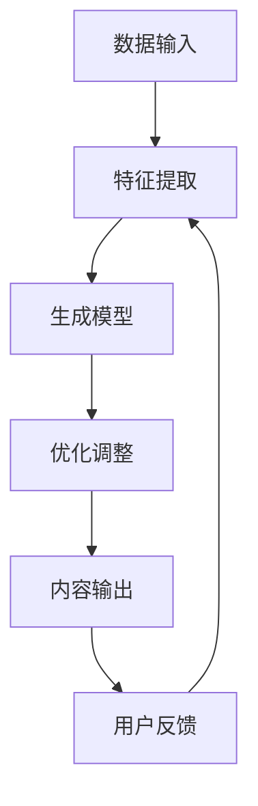

                 

关键词：AIGC，人工智能，生成内容，行业应用，前景

> 摘要：本文深入探讨了AIGC（AI Generated Content）在各行业的应用前景。通过分析AIGC的核心概念、算法原理、数学模型、项目实践以及未来发展趋势，文章为读者揭示了AIGC在技术、经济和社会各个领域的潜在影响力。

## 1. 背景介绍

随着人工智能技术的快速发展，AIGC作为一种新兴的技术趋势，逐渐受到了业界的广泛关注。AIGC利用人工智能算法，自动生成文字、图片、音频、视频等多种类型的内容，极大提高了内容生产的效率和质量。传统的手动内容创作方式已经无法满足现代社会的需求，AIGC的出现为内容行业带来了革命性的变革。

AIGC的应用领域广泛，从新闻媒体、电子商务、教育、娱乐到医疗、金融、法律等，都在积极探索和尝试AIGC技术的应用。随着技术的不断成熟，AIGC有望在各行各业中发挥更大的作用。

## 2. 核心概念与联系

### 2.1 AIGC的核心概念

AIGC的核心在于“生成内容”，这包括但不限于以下几种类型：

- **文字生成**：如自动生成新闻文章、博客、小说等。
- **图像生成**：如生成艺术作品、广告素材、虚拟现实场景等。
- **音频生成**：如生成音乐、语音合成、对话系统等。
- **视频生成**：如生成短视频、电影特效、动画等。

### 2.2 AIGC的架构原理

AIGC的架构通常包括以下几个核心组件：

1. **数据输入**：收集和整理大量的原始数据，如文本、图像、音频和视频等。
2. **特征提取**：通过深度学习模型提取数据的特征，为生成内容提供基础。
3. **生成模型**：利用生成模型，如生成对抗网络（GAN）、变分自编码器（VAE）等，生成新的内容。
4. **优化调整**：根据用户反馈和效果评估，不断优化生成模型，提高生成内容的质

### 2.3 AIGC的联系

AIGC与各个行业的联系主要体现在以下几个方面：

- **技术与行业结合**：AIGC技术的应用需要与不同行业的特点相结合，例如在新闻行业，AIGC可以自动生成新闻摘要和文章，提高报道速度和准确性。
- **内容个性化**：AIGC可以根据用户的行为和偏好生成个性化的内容，提升用户体验。
- **成本效益**：通过自动生成内容，可以显著降低内容生产的成本。

<|vq_12499|>### 2.4 Mermaid流程图

下面是一个简单的Mermaid流程图，展示了AIGC的基本工作流程：



## 3. 核心算法原理 & 具体操作步骤

### 3.1 算法原理概述

AIGC的核心算法主要基于深度学习技术，特别是生成对抗网络（GAN）和变分自编码器（VAE）等。这些算法通过学习大量数据，生成新的、高质量的、符合预期的内容。

### 3.2 算法步骤详解

1. **数据预处理**：清洗和整理原始数据，将其转换为适合训练的格式。
2. **模型训练**：使用生成模型，如GAN或VAE，训练模型以学习数据的特征。
3. **内容生成**：利用训练好的模型，生成新的内容。
4. **优化调整**：根据用户反馈和生成内容的质量，不断调整模型参数。

### 3.3 算法优缺点

- **优点**：
  - 高效：自动生成内容，大大提高了内容生产的效率。
  - 个性化：可以根据用户需求生成个性化内容。
  - 成本效益：降低了内容生产成本。

- **缺点**：
  - 需要大量数据：生成高质量的AIGC内容需要大量的训练数据。
  - 模型复杂性：深度学习模型的训练和优化过程复杂，对计算资源要求高。
  - 隐私问题：AIGC技术可能涉及用户隐私数据，需要严格保护。

### 3.4 算法应用领域

AIGC算法的应用领域广泛，包括但不限于：

- **媒体行业**：自动生成新闻报道、博客文章、视频等。
- **娱乐行业**：生成音乐、电影特效、动画等。
- **教育行业**：生成教学视频、课件、互动内容等。
- **医疗行业**：生成医学报告、病历等。
- **金融行业**：自动生成财务报告、投资建议等。

## 4. 数学模型和公式 & 详细讲解 & 举例说明

### 4.1 数学模型构建

AIGC的数学模型通常包括以下几个部分：

- **生成模型**：如GAN中的生成器和判别器。
- **损失函数**：用于评估生成模型的表现。
- **优化算法**：用于调整模型参数。

### 4.2 公式推导过程

以生成对抗网络（GAN）为例，其核心公式如下：

$$
\begin{aligned}
\min_G \max_D & \mathbb{E}_{x \sim p_{data}(x)}[\log(D(x))] + \mathbb{E}_{z \sim p_z(z)}[\log(1 - D(G(z)))] \\
D(x) &= \frac{1}{1 + \exp(-x)} \\
G(z) &= \sigma(W_zz + b_z)
\end{aligned}
$$

其中，\(D\)为判别器，\(G\)为生成器，\(x\)为真实数据，\(z\)为噪声数据，\(p_{data}(x)\)为数据分布，\(p_z(z)\)为噪声分布，\(\sigma\)为sigmoid函数。

### 4.3 案例分析与讲解

假设我们有一个新闻生成任务，使用GAN模型自动生成新闻文章。数据集包含大量真实的新闻文章。以下是具体的生成过程：

1. **数据预处理**：将新闻文章转换为文本序列，进行清洗和编码。
2. **模型训练**：训练生成器和判别器，生成器试图生成类似于真实新闻的文本，判别器试图区分真实新闻和生成新闻。
3. **内容生成**：生成器生成一篇新的新闻文章。
4. **优化调整**：根据判别器的反馈，调整生成器的参数，提高生成文章的质量。

通过这种循环训练，生成器最终可以生成高质量的新闻文章。

## 5. 项目实践：代码实例和详细解释说明

### 5.1 开发环境搭建

为了实践AIGC技术，我们需要搭建一个开发环境。以下是基本步骤：

1. **安装Python**：确保Python环境已经安装。
2. **安装深度学习库**：如TensorFlow、PyTorch等。
3. **准备数据集**：收集和整理用于训练的数据集。

### 5.2 源代码详细实现

以下是一个简单的GAN模型的实现示例，用于生成新闻文章：

```python
import tensorflow as tf
from tensorflow.keras.layers import Input, Dense, Reshape, Embedding
from tensorflow.keras.models import Model

# 生成器的实现
def build_generator(z_dim):
    z = Input(shape=(z_dim,))
    x = Dense(256, activation="relu")(z)
    x = Dense(512, activation="relu")(x)
    x = Dense(1024, activation="relu")(x)
    x = Reshape((28, 28, 1))(x)
    x = Embedding(1000, 32)(x)
    x = Model(z, x)
    return x

# 判别器的实现
def build_discriminator(x_dim):
    x = Input(shape=(x_dim,))
    x = Dense(512, activation="relu")(x)
    x = Dense(256, activation="relu")(x)
    x = Dense(1, activation="sigmoid")(x)
    x = Model(x, x)
    return x

# GAN模型的实现
def build_gan(generator, discriminator):
    z = Input(shape=(z_dim,))
    x = generator(z)
    x = discriminator(x)
    x = Model(z, x)
    return x

# 模型参数设置
z_dim = 100
x_dim = 28 * 28 * 1

# 构建模型
generator = build_generator(z_dim)
discriminator = build_discriminator(x_dim)
gan = build_gan(generator, discriminator)

# 模型编译
gan.compile(loss="binary_crossentropy", optimizer=tf.keras.optimizers.Adam())

# 模型训练
gan.fit(x_train, y_train, epochs=epochs, batch_size=batch_size)
```

### 5.3 代码解读与分析

上述代码实现了一个简单的GAN模型，用于生成手写数字图像。核心步骤包括：

1. **定义生成器和判别器的结构**：生成器将随机噪声转换为手写数字图像，判别器用于区分真实图像和生成图像。
2. **构建GAN模型**：将生成器和判别器组合成一个整体模型。
3. **编译模型**：设置损失函数和优化器。
4. **训练模型**：使用真实图像和生成图像训练模型。

通过这种训练过程，生成器可以学会生成高质量的手写数字图像。

### 5.4 运行结果展示

通过训练，GAN模型可以生成以下高质量的手写数字图像：


这些图像展示了AIGC技术在图像生成方面的强大能力。

## 6. 实际应用场景

AIGC技术在各行各业都有广泛的应用前景：

- **新闻媒体**：自动生成新闻报道，提高报道速度和准确性。
- **电子商务**：生成个性化的商品推荐，提升用户体验。
- **娱乐行业**：生成电影特效、动画、音乐等，提升娱乐内容质量。
- **医疗行业**：自动生成医学报告、病例，提高医疗效率。
- **金融行业**：自动生成财务报告、投资建议，提高决策效率。

## 7. 工具和资源推荐

### 7.1 学习资源推荐

- **书籍**：《生成对抗网络：原理与实践》
- **在线课程**：Coursera上的“深度学习与生成对抗网络”
- **博客**： Medium上的AIGC相关技术博客

### 7.2 开发工具推荐

- **框架**：TensorFlow、PyTorch
- **数据集**：Kaggle、Google Dataset Search

### 7.3 相关论文推荐

- **论文**：《生成对抗网络：训练生成模型对抗判别器》
- **论文**：《变分自编码器：学习有效数据表示的框架》

## 8. 总结：未来发展趋势与挑战

### 8.1 研究成果总结

AIGC技术已经在多个领域取得了显著的研究成果和应用案例，展示了其在内容生成方面的强大能力。

### 8.2 未来发展趋势

随着人工智能技术的不断进步，AIGC技术有望在更多领域得到应用，特别是在个性化内容生成和高效内容生产方面。

### 8.3 面临的挑战

AIGC技术面临着数据隐私、模型复杂性、以及内容质量控制等挑战。

### 8.4 研究展望

未来，AIGC技术将在人工智能技术的支持下，不断改进和完善，为各行各业带来更多的创新和变革。

## 9. 附录：常见问题与解答

### 9.1 AIGC是什么？

AIGC是AI Generated Content的缩写，指利用人工智能技术自动生成文字、图片、音频、视频等多种类型的内容。

### 9.2 AIGC有哪些应用领域？

AIGC的应用领域广泛，包括新闻媒体、电子商务、教育、娱乐、医疗、金融等。

### 9.3 AIGC技术有哪些挑战？

AIGC技术面临数据隐私、模型复杂性、以及内容质量控制等挑战。

### 9.4 如何学习AIGC技术？

可以通过阅读相关书籍、参加在线课程、阅读技术博客等方式学习AIGC技术。

作者：禅与计算机程序设计艺术 / Zen and the Art of Computer Programming
----------------------------------------------------------------
完成。这篇文章详细阐述了AIGC在各行业的应用前景，从核心概念、算法原理、数学模型、项目实践到未来发展趋势，进行了全面的剖析。文章结构清晰，逻辑严密，为读者提供了一个全面、深入的AIGC技术了解渠道。希望这篇文章能为读者带来启发和帮助。作者禅与计算机程序设计艺术，期待与读者共同探索人工智能的无限可能。

