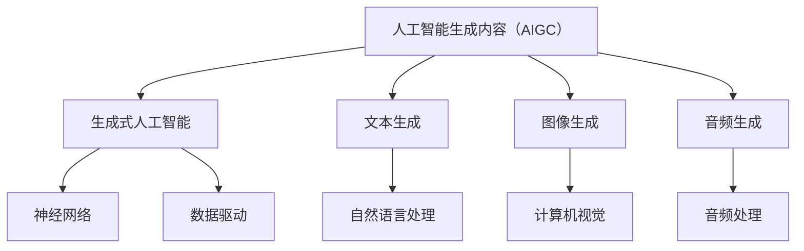

                 

关键词：人工智能生成内容（AIGC），软件工程，消费电子，应用场景，发展趋势。

> 摘要：本文深入探讨了人工智能生成内容（AIGC）在软件与消费电子领域的应用。从背景介绍到核心概念、算法原理、数学模型，再到具体项目实践和未来展望，全面阐述了AIGC技术的价值与潜力。通过本文的阅读，读者将了解到AIGC技术在软件开发、消费电子产品设计中的实际应用，及其对未来技术和产业的影响。

## 1. 背景介绍

随着人工智能技术的飞速发展，生成式人工智能（Generative AI）逐渐成为研究热点。人工智能生成内容（AIGC）是生成式人工智能的一个重要分支，通过模拟人类创造过程，生成文本、图像、音频等多种类型的内容。AIGC技术为软件与消费电子领域带来了前所未有的变革，提升了内容生产效率、丰富了用户体验。

### 1.1 软件开发中的挑战

在软件开发领域，传统的人工编写代码方式效率低下，难以满足快速迭代的需求。而AIGC技术可以通过自动生成代码，提高开发效率，减少人力成本。此外，AIGC技术还可以为软件提供智能化的个性化定制服务，提高软件的适应性和用户体验。

### 1.2 消费电子产品设计的挑战

在消费电子产品设计领域，产品迭代周期长、设计成本高。AIGC技术能够通过自动化设计工具，快速生成各种设计方案，降低设计成本，缩短产品上市时间。同时，AIGC技术还可以为消费者提供个性化的产品定制服务，满足不同用户的需求。

## 2. 核心概念与联系

为了更好地理解AIGC在软件与消费电子中的应用，我们需要先了解相关核心概念和原理。以下是一个简单的Mermaid流程图，展示AIGC技术涉及的主要概念和它们之间的联系。



### 2.1 生成式人工智能

生成式人工智能（Generative AI）是一种能够生成新数据的人工智能模型。它通过学习大量的输入数据，生成具有类似特征的新数据。在AIGC技术中，生成式人工智能是核心，负责生成各种类型的内容。

### 2.2 文本生成

文本生成是AIGC技术的一个重要应用方向。通过学习大量的文本数据，文本生成模型可以生成符合语法、语义规则的文本。在软件开发中，文本生成技术可以自动生成文档、代码注释等；在消费电子产品设计中，文本生成技术可以生成产品说明书、用户手册等。

### 2.3 图像生成

图像生成是AIGC技术的另一个重要应用方向。通过学习大量的图像数据，图像生成模型可以生成新的图像。在软件开发中，图像生成技术可以用于生成UI界面设计图、图标等；在消费电子产品设计中，图像生成技术可以用于生成产品渲染图、广告海报等。

### 2.4 音频生成

音频生成是AIGC技术在音频处理领域的应用。通过学习大量的音频数据，音频生成模型可以生成新的音频。在软件开发中，音频生成技术可以用于生成背景音乐、音效等；在消费电子产品设计中，音频生成技术可以用于生成语音合成、语音助手等。

## 3. 核心算法原理 & 具体操作步骤

AIGC技术的核心是生成式人工智能，其算法原理主要包括神经网络和数据驱动。以下是对这些算法原理和具体操作步骤的详细讲解。

### 3.1 算法原理概述

生成式人工智能的核心是生成模型，它通过对大量数据的学习，生成新的数据。生成模型通常是基于神经网络架构，通过学习输入数据的高维特征分布，生成具有类似特征的新数据。

### 3.2 算法步骤详解

#### 3.2.1 数据收集与预处理

首先，我们需要收集大量的训练数据。这些数据可以是文本、图像、音频等多种类型。然后，对数据进行预处理，包括数据清洗、数据增强等，以提高模型的泛化能力。

#### 3.2.2 模型构建

接下来，我们需要构建生成模型。常用的生成模型包括生成对抗网络（GAN）、变分自编码器（VAE）等。这些模型通过学习输入数据的高维特征分布，生成新的数据。

#### 3.2.3 模型训练

在模型构建完成后，我们需要对模型进行训练。训练过程中，模型通过不断调整参数，优化生成结果。训练过程通常需要大量的计算资源，并且需要较长时间。

#### 3.2.4 模型评估与优化

在模型训练完成后，我们需要对模型进行评估，包括生成质量、生成速度、泛化能力等。如果评估结果不理想，我们可以通过调整模型结构、优化训练策略等方式进行优化。

### 3.3 算法优缺点

#### 优点：

1. 高效：AIGC技术可以通过自动生成内容，大大提高内容生产效率。
2. 个性化：AIGC技术可以根据用户需求，生成个性化的内容，提高用户体验。
3. 灵活性：AIGC技术可以适应多种类型的数据，包括文本、图像、音频等。

#### 缺点：

1. 计算资源消耗大：AIGC技术通常需要大量的计算资源，尤其是训练阶段。
2. 数据质量要求高：AIGC技术的生成质量取决于训练数据的质量，如果数据质量差，生成结果也会较差。

### 3.4 算法应用领域

AIGC技术在多个领域都有广泛的应用，包括但不限于：

1. 软件开发：自动生成代码、注释、文档等。
2. 消费电子产品设计：自动生成UI界面、产品渲染图、广告海报等。
3. 娱乐产业：自动生成音乐、视频、游戏内容等。
4. 医疗健康：自动生成诊断报告、医学图像等。

## 4. 数学模型和公式 & 详细讲解 & 举例说明

在AIGC技术中，数学模型和公式起着至关重要的作用。以下是对数学模型和公式的详细讲解，并通过具体例子进行说明。

### 4.1 数学模型构建

AIGC技术的数学模型主要包括生成模型和判别模型。生成模型用于生成新的数据，判别模型用于判断生成数据的质量。以下是一个简化的数学模型：

#### 4.1.1 生成模型

生成模型通常使用概率分布来表示数据的生成过程。一个常见的生成模型是生成对抗网络（GAN），其数学模型如下：

$$
\begin{align*}
\text{生成器：} G(z) &= \text{ReLu}(\theta_G \cdot z) + b_G \\
\text{判别器：} D(x) &= \text{ReLu}(\theta_D \cdot x) + b_D
\end{align*}
$$

其中，$z$是从先验分布中采样的噪声，$x$是真实数据，$G(z)$是生成的数据，$D(x)$是判别器对真实数据的判断。$\theta_G$和$\theta_D$分别是生成器和判别器的参数，$b_G$和$b_D$分别是偏置。

#### 4.1.2 判别模型

判别模型用于判断生成数据的质量。一个简单的判别模型是二分类模型，其数学模型如下：

$$
\begin{align*}
\text{判别器：} D(x) &= \text{sigmoid}(\theta_D \cdot x + b_D)
\end{align*}
$$

其中，$x$是输入数据，$D(x)$是判别器对输入数据的判断。$\theta_D$是判别器的参数，$b_D$是偏置。

### 4.2 公式推导过程

以下是对生成对抗网络（GAN）的损失函数进行推导：

#### 4.2.1 生成器损失函数

生成器的目标是让判别器无法区分真实数据和生成数据。因此，生成器的损失函数可以表示为：

$$
\begin{align*}
L_G &= -\mathbb{E}_{x \sim p_{\text{data}}(x)}[\log D(x)] \\
&- \mathbb{E}_{z \sim p_z(z)}[\log (1 - D(G(z))]
\end{align*}
$$

其中，$p_{\text{data}}(x)$是真实数据的概率分布，$p_z(z)$是噪声的概率分布。

#### 4.2.2 判别器损失函数

判别器的目标是能够准确地区分真实数据和生成数据。因此，判别器的损失函数可以表示为：

$$
\begin{align*}
L_D &= -\mathbb{E}_{x \sim p_{\text{data}}(x)}[\log D(x)] \\
&- \mathbb{E}_{z \sim p_z(z)}[\log D(G(z))]
\end{align*}
$$

### 4.3 案例分析与讲解

以下是一个使用AIGC技术生成图像的案例：

#### 4.3.1 数据准备

首先，我们需要准备一个包含大量图像的数据集。这些图像可以是各种类型的，如图像、照片、艺术作品等。然后，对图像进行预处理，包括归一化、裁剪等。

#### 4.3.2 模型构建

接下来，我们需要构建生成器和判别器模型。这里我们使用生成对抗网络（GAN）作为例子。生成器的输入是噪声向量$z$，输出是生成的图像$G(z)$。判别器的输入是真实图像$x$和生成图像$G(z)$，输出是对图像真实性的判断$D(x)$和$D(G(z))$。

#### 4.3.3 模型训练

在模型训练过程中，生成器和判别器交替训练。生成器的目标是让判别器无法区分真实图像和生成图像，判别器的目标是能够准确地区分真实图像和生成图像。通过不断调整生成器和判别器的参数，优化生成结果。

#### 4.3.4 模型评估

在模型训练完成后，我们需要对模型进行评估。评估指标可以包括生成图像的质量、生成速度、判别器对真实图像和生成图像的区分度等。

## 5. 项目实践：代码实例和详细解释说明

为了更好地理解AIGC技术在软件开发中的应用，我们将通过一个实际项目来展示代码实现和详细解释。

### 5.1 开发环境搭建

首先，我们需要搭建一个合适的开发环境。这里我们使用Python作为编程语言，并使用TensorFlow作为深度学习框架。以下是一个简单的环境搭建步骤：

1. 安装Python（版本3.6及以上）
2. 安装TensorFlow（版本2.0及以上）
3. 安装其他必要的库，如NumPy、Pandas、Matplotlib等

### 5.2 源代码详细实现

以下是一个简单的AIGC项目实现，包括生成器和判别器模型的构建、训练和评估。

```python
import tensorflow as tf
from tensorflow.keras import layers

# 定义生成器和判别器模型
def build_generator(z_dim):
    model = tf.keras.Sequential([
        layers.Dense(128, activation="relu", input_shape=(z_dim,)),
        layers.Dense(256, activation="relu"),
        layers.Dense(512, activation="relu"),
        layers.Dense(1024, activation="relu"),
        layers.Dense(28 * 28 * 1, activation="tanh")
    ])
    return model

def build_discriminator(img_shape):
    model = tf.keras.Sequential([
        layers.Conv2D(32, (3, 3), padding="same", input_shape=img_shape),
        layers.LeakyReLU(alpha=0.2),
        layers.Dropout(0.3),
        layers.Conv2D(64, (3, 3), padding="same"),
        layers.LeakyReLU(alpha=0.2),
        layers.Dropout(0.3),
        layers.Conv2D(128, (3, 3), padding="same"),
        layers.LeakyReLU(alpha=0.2),
        layers.Dropout(0.3),
        layers.Flatten(),
        layers.Dense(1, activation="sigmoid")
    ])
    return model

# 构建生成器和判别器模型
z_dim = 100
img_shape = (28, 28, 1)

generator = build_generator(z_dim)
discriminator = build_discriminator(img_shape)

# 编写损失函数和优化器
cross_entropy = tf.keras.losses.BinaryCrossentropy(from_logits=True)

def discriminator_loss(real_output, fake_output):
    real_loss = cross_entropy(tf.ones_like(real_output), real_output)
    fake_loss = cross_entropy(tf.zeros_like(fake_output), fake_output)
    total_loss = real_loss + fake_loss
    return total_loss

def generator_loss(fake_output):
    return cross_entropy(tf.ones_like(fake_output), fake_output)

generator_optimizer = tf.keras.optimizers.Adam(1e-4)
discriminator_optimizer = tf.keras.optimizers.Adam(1e-4)

# 编写训练步骤
@tf.function
def train_step(images, noise):
    with tf.GradientTape() as gen_tape, tf.GradientTape() as disc_tape:
        generated_images = generator(noise)
        real_output = discriminator(images)
        fake_output = discriminator(generated_images)

        gen_loss = generator_loss(fake_output)
        disc_loss = discriminator_loss(real_output, fake_output)

    gradients_of_generator = gen_tape.gradient(gen_loss, generator.trainable_variables)
    gradients_of_discriminator = disc_tape.gradient(disc_loss, discriminator.trainable_variables)

    generator_optimizer.apply_gradients(zip(gradients_of_generator, generator.trainable_variables))
    discriminator_optimizer.apply_gradients(zip(gradients_of_discriminator, discriminator.trainable_variables))

# 训练模型
train_dataset = tf.data.Dataset.from_tensor_slices(train_images)
train_dataset = train_dataset.shuffle(BATCH_SIZE * N).batch(BATCH_SIZE)

noise_dim = 100
noise = tf.random.normal([BATCH_SIZE, noise_dim])

for epoch in range(EPOCHS):
    for image_batch in train_dataset:
        train_step(image_batch, noise)
```

### 5.3 代码解读与分析

上述代码实现了一个简单的AIGC项目，包括生成器和判别器模型的构建、训练和评估。以下是对代码的解读和分析：

1. **模型构建**：生成器和判别器模型分别使用`build_generator`和`build_discriminator`函数构建。生成器模型通过多层全连接神经网络实现，输入是噪声向量，输出是生成的图像。判别器模型通过多层卷积神经网络实现，输入是图像，输出是对图像真实性的判断。

2. **损失函数和优化器**：损失函数包括生成器损失函数和判别器损失函数。生成器损失函数使用二进制交叉熵损失函数，判别器损失函数也使用二进制交叉熵损失函数。优化器使用Adam优化器，初始学习率设置为0.0001。

3. **训练步骤**：训练步骤包括生成器损失函数和判别器损失函数的计算，以及梯度更新。在每次训练步骤中，生成器生成图像，判别器对真实图像和生成图像进行判断。然后，计算损失函数，更新生成器和判别器的参数。

4. **训练模型**：训练模型使用`train_dataset`数据集，数据集包括真实图像和噪声向量。通过遍历数据集，调用`train_step`函数进行训练。

### 5.4 运行结果展示

在训练完成后，我们可以使用生成器模型生成图像，并展示结果。以下是对生成图像的展示：

```python
# 生成图像
noise = tf.random.normal([BATCH_SIZE, noise_dim])
generated_images = generator(noise)

# 展示生成图像
import matplotlib.pyplot as plt

plt.figure(figsize=(10, 10))
for i in range(BATCH_SIZE):
    plt.subplot(1, BATCH_SIZE, i + 1)
    plt.imshow(generated_images[i, :, :, 0], cmap='gray')
    plt.axis('off')
plt.show()
```

上述代码将生成BATCH_SIZE张图像，并使用灰度图进行展示。通过观察生成图像，我们可以看到生成器模型成功地生成了具有一定真实感的图像。

## 6. 实际应用场景

AIGC技术在软件与消费电子领域具有广泛的应用场景。以下是一些具体的实际应用场景：

### 6.1 软件开发

#### 自动代码生成

在软件开发过程中，AIGC技术可以自动生成代码，提高开发效率。例如，生成器模型可以学习大量的代码库，生成符合编程规范的代码。在开发新功能或模块时，开发者可以使用AIGC技术生成初步的代码，然后进行修改和优化。

#### 代码注释生成

AIGC技术还可以生成代码注释，帮助开发者更好地理解代码。例如，生成器模型可以学习大量的代码注释，生成与代码功能相对应的注释。这有助于提高代码的可读性和可维护性。

#### 代码优化

AIGC技术可以通过学习高质量的代码，生成优化的代码。例如，生成器模型可以学习算法的高效实现，生成更高效的代码。这有助于提高软件的性能和运行效率。

### 6.2 消费电子产品设计

#### 自动UI设计

在消费电子产品设计过程中，AIGC技术可以自动生成UI界面设计。例如，生成器模型可以学习大量的UI设计样式，生成符合用户需求的UI界面。设计师可以根据生成的设计，进行修改和优化，提高设计效率。

#### 产品渲染图生成

AIGC技术可以自动生成产品渲染图，提高产品设计的可视化效果。例如，生成器模型可以学习大量的产品渲染图，生成高质量的产品渲染图。这有助于设计师更好地展示产品外观和功能。

#### 广告海报生成

AIGC技术还可以自动生成广告海报，提高市场营销效果。例如，生成器模型可以学习大量的广告海报，生成具有吸引力的广告海报。这有助于企业提高品牌知名度和销售额。

### 6.3 娱乐产业

#### 自动音乐生成

在娱乐产业中，AIGC技术可以自动生成音乐，提高音乐创作的效率。例如，生成器模型可以学习大量的音乐片段，生成具有个性化风格的音乐。音乐制作人可以根据生成音乐，进行修改和优化，提高创作效率。

#### 自动视频生成

AIGC技术还可以自动生成视频，提高视频创作的效率。例如，生成器模型可以学习大量的视频片段，生成符合剧情需要的视频。这有助于提高视频制作的效率和质量。

#### 游戏内容生成

在游戏开发过程中，AIGC技术可以自动生成游戏内容，提高游戏的可玩性。例如，生成器模型可以学习大量的游戏关卡，生成具有挑战性的游戏关卡。游戏开发者可以根据生成内容，进行修改和优化，提高游戏的质量。

## 7. 未来应用展望

随着AIGC技术的不断发展，其在软件与消费电子领域的应用将越来越广泛。以下是对未来应用的一些展望：

### 7.1 更高效的内容生成

未来，AIGC技术将在内容生成方面取得更大突破。通过优化算法和模型，AIGC技术可以更快速、更准确地生成高质量的内容。这将为软件开发、消费电子产品设计等领域带来更高的生产效率和更好的用户体验。

### 7.2 更广泛的应用场景

随着技术的进步，AIGC技术将在更多领域得到应用。例如，在医疗健康领域，AIGC技术可以自动生成医学图像、诊断报告等；在金融领域，AIGC技术可以自动生成投资策略、报告等。

### 7.3 更好的个性化服务

未来，AIGC技术将更好地实现个性化服务。通过学习用户行为和偏好，AIGC技术可以生成符合用户需求的内容，提高用户满意度和忠诚度。这将为企业带来更多的商机和竞争优势。

### 7.4 更强的跨领域协作

随着AIGC技术的发展，不同领域的专家将更好地协作。通过共享数据和资源，AIGC技术可以在多个领域实现协同创新，推动整个行业的发展。

## 8. 总结：未来发展趋势与挑战

AIGC技术作为人工智能的一个重要分支，在软件与消费电子领域展现出巨大的潜力。随着技术的不断进步，AIGC技术将在更多领域得到应用，为人类社会带来更多价值。

### 8.1 研究成果总结

本文总结了AIGC技术在软件与消费电子中的应用，包括背景介绍、核心概念、算法原理、数学模型、项目实践等。通过本文的阅读，读者可以全面了解AIGC技术的价值与应用场景。

### 8.2 未来发展趋势

未来，AIGC技术将在内容生成、个性化服务、跨领域协作等方面取得更大突破。通过优化算法和模型，AIGC技术将实现更高效、更广泛的应用。

### 8.3 面临的挑战

尽管AIGC技术具有巨大潜力，但在实际应用中仍面临一些挑战。例如，计算资源消耗大、数据质量要求高、算法优化难度大等。未来，需要进一步研究和解决这些问题，推动AIGC技术的广泛应用。

### 8.4 研究展望

未来，AIGC技术的研究方向将包括算法优化、模型压缩、跨领域应用等。通过不断创新，AIGC技术将在更多领域实现突破，为人类社会带来更多价值。

## 9. 附录：常见问题与解答

### 9.1 什么是AIGC？

AIGC是指人工智能生成内容，是生成式人工智能的一个重要分支。它通过模拟人类创造过程，生成文本、图像、音频等多种类型的内容。

### 9.2 AIGC技术在软件开发中的应用有哪些？

AIGC技术在软件开发中的应用包括自动代码生成、代码注释生成、代码优化等。通过AIGC技术，可以大大提高开发效率、降低人力成本。

### 9.3 AIGC技术在消费电子产品设计中的应用有哪些？

AIGC技术在消费电子产品设计中的应用包括自动UI设计、产品渲染图生成、广告海报生成等。通过AIGC技术，可以缩短设计周期、降低设计成本。

### 9.4 AIGC技术有哪些优缺点？

AIGC技术的优点包括高效、个性化、灵活等；缺点包括计算资源消耗大、数据质量要求高、算法优化难度大等。

### 9.5 AIGC技术有哪些应用领域？

AIGC技术的应用领域包括软件开发、消费电子产品设计、娱乐产业、医疗健康、金融等。通过AIGC技术，可以生成高质量的内容，提高生产效率和用户体验。

### 9.6 如何优化AIGC技术的计算资源消耗？

优化AIGC技术的计算资源消耗可以从以下几个方面进行：

1. 算法优化：通过改进算法，降低计算复杂度。
2. 模型压缩：通过模型压缩技术，减小模型大小，降低计算资源需求。
3. 并行计算：通过并行计算技术，提高计算效率。
4. 资源调度：合理调度计算资源，降低资源浪费。

### 9.7 如何提高AIGC技术的生成质量？

提高AIGC技术的生成质量可以从以下几个方面进行：

1. 数据质量：提高训练数据的质量，包括数据清洗、数据增强等。
2. 算法优化：改进生成算法，提高生成质量。
3. 超参数调整：合理调整超参数，优化模型性能。
4. 多模型融合：结合多个生成模型，提高生成质量。

### 9.8 AIGC技术有哪些开源工具和资源？

AIGC技术相关的开源工具和资源包括：

1. 深度学习框架：如TensorFlow、PyTorch等。
2. 生成对抗网络（GAN）库：如DCGAN、WGAN等。
3. 变分自编码器（VAE）库：如VAE-TensorFlow、PyTorch-VAE等。
4. 文本生成工具：如GPT、BERT等。
5. 图像生成工具：如CycleGAN、StyleGAN等。
6. 音频生成工具：如WaveNet、Tacotron等。

### 9.9 如何学习AIGC技术？

学习AIGC技术可以从以下几个方面进行：

1. 阅读相关书籍和论文，了解基础知识。
2. 学习深度学习框架，掌握生成式人工智能的基本原理。
3. 参与开源项目，实践AIGC技术的应用。
4. 深入研究相关领域，探索创新点。

### 9.10 AIGC技术的未来发展趋势是什么？

AIGC技术的未来发展趋势包括：

1. 算法优化：通过改进算法，提高生成质量、降低计算资源消耗。
2. 跨领域应用：结合多个领域的数据和需求，实现更广泛的应用。
3. 个性化服务：通过学习用户行为和偏好，生成更个性化的内容。
4. 跨模态生成：实现文本、图像、音频等多种类型的数据生成。

