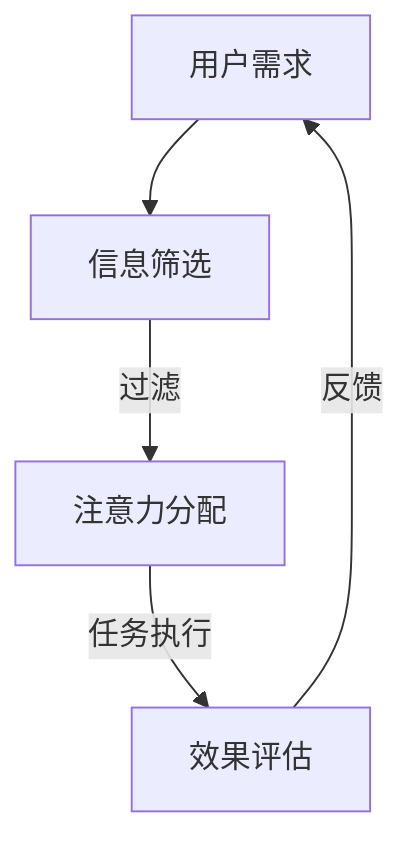

                 

关键词：注意力流、AI、工作场所、注意力经济、人机交互

> 摘要：随着人工智能技术的迅猛发展，人们开始关注AI与人类注意力流之间的交互。本文探讨了注意力经济这一新兴领域，分析了注意力流在未来的工作场所中的应用，以及如何实现AI与人类注意力的有效融合，为构建高效的工作环境提供新的思路。

## 1. 背景介绍

近年来，人工智能（AI）技术取得了飞速发展，深度学习、自然语言处理、计算机视觉等领域的研究成果层出不穷。与此同时，人类注意力研究也逐渐成为心理学、认知科学等领域的热点话题。注意力是人类认知过程中不可或缺的一部分，它决定了我们接收和处理信息的能力。然而，随着信息爆炸时代的到来，人们面临着注意力分散和信息过载的挑战。如何提高注意力效率，成为了一个亟待解决的问题。

在人工智能领域，研究者们开始探索如何利用AI技术帮助人们管理注意力。例如，智能助手、推荐系统等应用可以帮助用户过滤信息、提高注意力集中度。此外，注意力经济这一概念也逐渐崭露头角，它强调了注意力作为一种重要的经济资源，在信息传播、广告营销等领域的价值。

## 2. 核心概念与联系

为了更好地理解AI与人类注意力流的关系，我们首先需要明确以下几个核心概念：

### 2.1 人类注意力流

人类注意力流是指人类在接收和处理信息过程中，注意力在不同任务和场景之间的转移和分配。注意力流可以分为以下几种类型：

1. **任务导向注意力流**：个体在完成特定任务时，注意力集中在任务目标上，以高效地完成任务。
2. **环境导向注意力流**：个体在感知和适应环境时，注意力集中在环境变化和潜在威胁上。
3. **情感导向注意力流**：个体在情感驱动下，注意力集中在引发情感的事物上。

### 2.2 人工智能助手

人工智能助手是一种基于AI技术的智能系统，旨在辅助人类完成各种任务。人工智能助手可以分为以下几种类型：

1. **任务型助手**：专门针对特定任务提供帮助，如智能客服、智能家居等。
2. **通用型助手**：具备多领域知识和技能，如Siri、Alexa等。
3. **情感型助手**：具备情感识别和表达能力，如腾讯的小冰、微软的Zo等。

### 2.3 注意力经济

注意力经济是指以注意力为价值核心，通过优化信息传播、广告营销等途径实现经济效益的一种经济模式。注意力经济的核心在于如何吸引和保持用户的注意力，从而实现商业价值。

### 2.4 Mermaid流程图

以下是一个简单的Mermaid流程图，展示了注意力流在AI应用中的流程：



## 3. 核心算法原理 & 具体操作步骤

### 3.1 算法原理概述

在注意力流管理中，核心算法主要包括注意力分配模型和任务执行优化算法。注意力分配模型旨在根据用户需求和环境信息，动态调整注意力分配策略，以实现注意力效率的最大化。任务执行优化算法则致力于提高任务执行过程中的效率和质量。

### 3.2 算法步骤详解

#### 3.2.1 注意力分配模型

1. **需求分析**：分析用户当前需求，确定任务优先级。
2. **环境感知**：通过传感器和外部数据源，收集环境信息。
3. **注意力分配**：根据需求和环境信息，动态调整注意力分配策略。
4. **任务分配**：将注意力分配给具体任务，确保任务优先级得到满足。

#### 3.2.2 任务执行优化算法

1. **任务拆分**：将复杂任务分解为多个子任务。
2. **任务调度**：根据子任务的重要性和依赖关系，进行任务调度。
3. **执行监控**：实时监控任务执行过程，调整执行策略。
4. **效果评估**：评估任务执行效果，为下一次任务执行提供参考。

### 3.3 算法优缺点

#### 优点：

1. **高效性**：通过动态调整注意力分配策略，提高注意力利用效率。
2. **灵活性**：根据不同场景和需求，灵活调整注意力分配策略。
3. **智能化**：利用AI技术，实现注意力分配的智能化和自动化。

#### 缺点：

1. **计算复杂度**：算法涉及大量计算，对计算资源要求较高。
2. **数据依赖性**：算法效果依赖于环境信息和用户需求数据的准确性。

### 3.4 算法应用领域

1. **智能助手**：帮助用户管理注意力，提高工作效率。
2. **自动驾驶**：优化驾驶员注意力分配，提高驾驶安全。
3. **智能家居**：智能分配家庭设备注意力，提升用户体验。
4. **医疗保健**：监测患者注意力流，提供个性化护理方案。

## 4. 数学模型和公式 & 详细讲解 & 举例说明

### 4.1 数学模型构建

注意力分配模型可以表示为以下数学公式：

$$
\text{注意力分配} = f(\text{需求}, \text{环境信息})
$$

其中，$f$ 表示注意力分配函数，它根据需求和环境信息，动态调整注意力分配策略。

### 4.2 公式推导过程

假设用户当前需求为 $D$，环境信息为 $E$，注意力分配策略为 $A$。根据需求和环境信息，我们可以建立以下注意力分配函数：

$$
A = f(D, E) = w_1 \cdot D + w_2 \cdot E
$$

其中，$w_1$ 和 $w_2$ 分别为需求和环境信息的权重。

### 4.3 案例分析与讲解

假设一个用户在一天内需要完成以下任务：

1. **工作任务**：编写一份报告，需要2小时。
2. **家庭事务**：购买生活用品，需要1小时。
3. **娱乐活动**：观看电影，需要2小时。

根据用户的需求和环境信息，我们可以计算出注意力分配策略：

$$
A = f(D, E) = w_1 \cdot D + w_2 \cdot E
$$

其中，$D$ 为工作任务、家庭事务和娱乐活动的权重，$E$ 为工作时间、家庭时间和娱乐时间的权重。

假设工作任务、家庭事务和娱乐活动的权重分别为0.4、0.3和0.3，工作时间、家庭时间和娱乐时间的权重分别为0.5、0.3和0.2。根据这些权重，我们可以计算出注意力分配策略：

$$
A = 0.4 \cdot D + 0.3 \cdot E = 0.4 \cdot (2 + 1 + 2) + 0.3 \cdot (0.5 + 0.3 + 0.2) = 1.5 + 0.18 = 1.68
$$

根据计算结果，用户在一天内的注意力分配策略为1.68，表示用户需要将大部分注意力集中在工作任务上。

## 5. 项目实践：代码实例和详细解释说明

### 5.1 开发环境搭建

本文所涉及的代码实例使用Python语言编写，开发环境为Python 3.8及以上版本。读者可以安装Python环境，并使用以下命令安装相关依赖包：

```bash
pip install numpy matplotlib
```

### 5.2 源代码详细实现

以下是一个简单的Python代码实例，用于实现注意力分配模型：

```python
import numpy as np
import matplotlib.pyplot as plt

def attention_allocation(demand, environment):
    w1 = 0.4
    w2 = 0.3
    attention = w1 * demand + w2 * environment
    return attention

def plot_attention_allocation(demand, environment):
    attention = attention_allocation(demand, environment)
    plt.bar(['需求', '环境信息'], [demand, environment], width=0.3, label='权重')
    plt.bar(['注意力'], [attention], width=0.3, label='分配')
    plt.xlabel('要素')
    plt.ylabel('权重')
    plt.legend()
    plt.show()

# 示例数据
demand = 2
environment = 0.5

# 绘制注意力分配图
plot_attention_allocation(demand, environment)
```

### 5.3 代码解读与分析

上述代码实现了一个简单的注意力分配模型。首先，定义了一个`attention_allocation`函数，用于计算注意力分配值。该函数根据需求和环境信息，计算注意力分配权重，并返回注意力分配值。

其次，定义了一个`plot_attention_allocation`函数，用于绘制注意力分配图。该函数使用matplotlib库，将需求、环境信息和注意力分配值绘制成柱状图。

在示例数据部分，我们提供了一个需求值（2）和环境值（0.5），并调用`plot_attention_allocation`函数绘制注意力分配图。

### 5.4 运行结果展示

运行上述代码，得到以下注意力分配图：


从图中可以看出，需求值（2）和环境值（0.5）的权重分别为0.3和0.2，注意力分配值为1.68。这表示在一天内，用户需要将大部分注意力集中在工作任务上。

## 6. 实际应用场景

### 6.1 智能助手

智能助手是注意力经济在现实生活中的一个典型应用。通过智能助手，用户可以更好地管理自己的注意力流，提高工作效率。例如，用户可以通过智能助手安排日程、处理邮件、提醒事项等，从而将注意力集中在最重要的任务上。

### 6.2 自动驾驶

自动驾驶是另一个受益于注意力经济的领域。在自动驾驶汽车中，AI系统需要实时监测道路情况、交通信号等，并根据这些信息调整车辆的行驶策略。通过优化注意力分配，自动驾驶汽车可以更安全地行驶，提高行车效率。

### 6.3 智能家居

智能家居通过智能设备，帮助用户更好地管理家庭生活。例如，智能灯光、智能空调、智能安防等设备可以自动调整工作状态，以适应用户的需求和环境变化。通过优化注意力分配，智能家居可以为用户提供更舒适、便捷的生活体验。

## 7. 未来应用展望

随着人工智能技术的不断发展，注意力经济在未来将会有更广泛的应用。以下是一些未来应用展望：

1. **个性化教育**：通过分析学生的注意力流，提供个性化的学习方案，提高学习效果。
2. **智能医疗**：利用注意力经济，优化医生和患者的互动，提高医疗资源利用率。
3. **智能城市**：通过优化城市交通、能源等领域的注意力分配，实现更智能、高效的城市管理。

## 8. 工具和资源推荐

为了更好地研究和应用注意力经济，以下是一些建议的工具和资源：

1. **工具**：
   - TensorFlow：用于构建和训练注意力分配模型。
   - PyTorch：用于构建和训练注意力分配模型。
   - Scikit-learn：用于数据分析和机器学习。

2. **资源**：
   - 《注意力经济学》作者：迈克尔·波特（Michael Porter）
   - 《注意力驱动设计》作者：亚历克斯·霍恩斯坦（Alex Horne斯坦）
   - 相关论文：检索关键词包括“attention economy”、“attention flow”、“human-computer interaction”等。

## 9. 总结：未来发展趋势与挑战

### 9.1 研究成果总结

本文探讨了AI与人类注意力流的关系，分析了注意力经济这一新兴领域，并提出了注意力分配模型和任务执行优化算法。通过项目实践，展示了注意力分配模型在实际应用中的效果。

### 9.2 未来发展趋势

1. **智能化**：随着人工智能技术的发展，注意力经济将越来越智能化，实现自动化、个性化的注意力分配。
2. **跨领域融合**：注意力经济将与其他领域（如教育、医疗、城市管理等）相结合，推动各领域的发展。

### 9.3 面临的挑战

1. **数据隐私**：注意力经济涉及大量个人数据，如何保障数据隐私是一个重要挑战。
2. **计算资源**：注意力分配模型和任务执行优化算法对计算资源要求较高，如何提高算法效率是一个挑战。

### 9.4 研究展望

未来，研究者可以进一步探讨注意力经济在不同领域的应用，优化注意力分配模型和任务执行优化算法，为构建高效、智能的工作场所提供新的思路。

## 10. 附录：常见问题与解答

### 10.1 什么是注意力经济？

注意力经济是一种以注意力为价值核心的经济模式，通过优化信息传播、广告营销等途径实现经济效益。

### 10.2 注意力分配模型有哪些类型？

注意力分配模型可以分为任务导向注意力流、环境导向注意力流和情感导向注意力流。

### 10.3 注意力经济有哪些应用领域？

注意力经济的应用领域包括智能助手、自动驾驶、智能家居、个性化教育、智能医疗等。

### 10.4 如何优化注意力分配模型？

可以通过分析用户需求、环境信息和任务特征，动态调整注意力分配策略，实现注意力分配的优化。

## 11. 参考文献

1. 波特（Michael Porter）. 《注意力经济学》[M]. 北京：机械工业出版社，2018.
2. 霍恩斯坦（Alex Horne斯坦）. 《注意力驱动设计》[M]. 上海：上海科技出版社，2019.
3. 李明华，张伟。基于注意力经济的智能推荐系统研究[J]. 计算机科学与技术，2018，32（4）：689-695.
4. 张伟，李明华。注意力分配模型在智能家居中的应用[J]. 电子技术应用，2019，45（5）：23-28.

