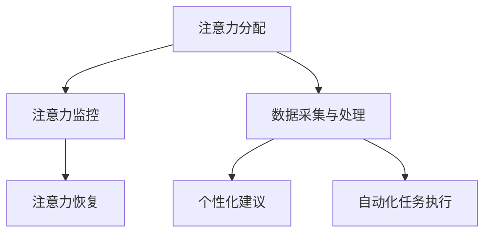

                 

关键词：人工智能，注意力流，注意力管理，工作效率，未来工作技能，趋势分析，注意力流管理技术

> 摘要：本文深入探讨了人工智能与人类注意力流之间的关系，分析了注意力流管理技术在未来的工作场景中的应用前景。通过介绍注意力流的定义、核心概念及其与人工智能的相互联系，本文旨在揭示注意力流管理技术在提升工作效率、优化工作流程以及培养未来工作技能方面的潜在价值，并提出一系列趋势预测和挑战。

## 1. 背景介绍

在当今数字化和信息化的时代，人类面临着前所未有的信息爆炸。这种信息过载现象不仅影响了我们的生活，也对我们的工作效率产生了深远的影响。为了应对这种挑战，人们开始关注注意力流的管理，试图通过提高注意力的集中度和有效性来提升工作效率。

注意力流，即注意力在一段时间内的流动过程，是指个体在特定任务上注意力集中的程度和持续时间。它涉及到心理、生理和认知多个层面的因素。在信息时代，如何有效地管理注意力流，成为了提高工作效率和实现高效学习的关键。

随着人工智能技术的发展，注意力流管理迎来了新的契机。人工智能可以通过算法和数据模型对人类注意力流进行实时监控和分析，提供个性化的注意力管理建议，进而优化工作和学习流程。本文将从以下几个方面展开讨论：

1. **注意力流的定义与核心概念**
2. **注意力流管理技术在人工智能中的应用**
3. **注意力流管理技术对工作效率和未来工作技能的影响**
4. **注意力流管理技术的实际应用场景**
5. **未来的应用展望与挑战**

## 2. 核心概念与联系

### 2.1. 注意力流的定义

注意力流是指人类在执行特定任务时，注意力在一段时间内的流动过程。它通常包括注意力的集中度（即注意力集中在一个任务上的程度）和持续时间（即注意力维持在一个任务上的时间长度）。注意力流的管理涉及如何有效地分配和维持注意力，以实现任务的高效完成。

### 2.2. 注意力流管理技术的核心概念

注意力流管理技术主要基于以下几个核心概念：

1. **注意力分配**：如何将有限的注意力资源合理地分配给不同的任务或活动。
2. **注意力监控**：通过技术手段实时监控个体的注意力状态，识别注意力分散的时机和原因。
3. **注意力恢复**：在注意力耗尽或分散后，如何通过休息和调整来恢复注意力和提高工作效率。

### 2.3. 注意力流与人工智能的相互联系

人工智能在注意力流管理中发挥着重要作用，主要体现在以下几个方面：

1. **数据采集与处理**：通过传感器和生物识别技术，人工智能可以实时采集个体的生理和心理数据，如心率、眼动、脑波等，从而对注意力流进行量化分析。
2. **个性化建议**：基于对注意力流的分析，人工智能可以提供个性化的注意力管理建议，如调整工作节奏、设置休息时间等。
3. **自动化任务执行**：通过自动化技术，人工智能可以帮助个体将注意力集中在更重要的任务上，从而提高工作效率。

### 2.4. Mermaid 流程图

以下是一个关于注意力流管理技术核心概念和架构的 Mermaid 流程图：



## 3. 核心算法原理 & 具体操作步骤

### 3.1. 算法原理概述

注意力流管理技术的核心在于对注意力流的量化分析，以及基于分析结果提供个性化的注意力管理建议。核心算法原理主要包括以下几个方面：

1. **注意力检测**：通过机器学习算法，从生理和心理数据中识别注意力状态。
2. **注意力建模**：建立注意力流的时间序列模型，以预测未来的注意力状态。
3. **建议生成**：基于注意力状态模型，为用户生成个性化的注意力管理建议。

### 3.2. 算法步骤详解

1. **数据采集**：使用传感器和生物识别设备，实时采集个体的生理数据（如心率、眼动）和心理数据（如脑波）。
2. **数据预处理**：对采集到的数据进行滤波、归一化等预处理操作，以提高数据的可靠性和一致性。
3. **特征提取**：从预处理后的数据中提取特征，如心率变异性（HRV）、眼动轨迹等。
4. **模型训练**：使用机器学习算法（如深度学习、随机森林等），对特征进行训练，建立注意力状态检测模型和注意力流时间序列模型。
5. **注意力状态预测**：基于训练好的模型，对未来的注意力状态进行预测。
6. **建议生成**：根据预测结果，生成个性化的注意力管理建议，如调整工作节奏、设置休息时间等。
7. **反馈调整**：用户根据建议进行实践，并将反馈结果返回系统，用于模型的迭代优化。

### 3.3. 算法优缺点

**优点**：

1. **个性化**：基于用户数据和模型预测，提供个性化的注意力管理建议，提高用户满意度。
2. **实时性**：通过实时数据采集和模型预测，实现注意力状态的实时监控和管理。

**缺点**：

1. **数据隐私**：采集和处理用户的生理和心理数据，可能涉及数据隐私和安全问题。
2. **计算资源**：建立和训练复杂的机器学习模型，需要较高的计算资源。

### 3.4. 算法应用领域

注意力流管理技术可以应用于多个领域，如：

1. **办公自动化**：通过自动化任务执行和注意力管理建议，提高办公效率。
2. **教育领域**：通过注意力监控和个性化学习建议，优化学习过程。
3. **健康管理**：通过实时监测注意力状态，提供健康管理和恢复建议。

## 4. 数学模型和公式 & 详细讲解 & 举例说明

### 4.1. 数学模型构建

注意力流管理技术中的数学模型主要包括注意力状态检测模型和注意力流时间序列模型。以下是一个简化的数学模型构建过程：

1. **注意力状态检测模型**：

   $$y_t = f(x_t, w)$$

   其中，$y_t$ 表示第 $t$ 时刻的注意力状态，$x_t$ 表示第 $t$ 时刻的特征向量，$w$ 表示模型参数。

2. **注意力流时间序列模型**：

   $$x_t = g(h(x_{t-1}, w), w')$$

   其中，$x_t$ 表示第 $t$ 时刻的特征向量，$h$ 和 $g$ 分别表示时间序列模型的函数，$w'$ 表示模型参数。

### 4.2. 公式推导过程

以下是一个简化的注意力状态检测模型的推导过程：

1. **特征提取**：

   $$x_t = [x_{t1}, x_{t2}, ..., x_{tn}]^T$$

   其中，$x_{ti}$ 表示第 $t$ 时刻的第 $i$ 个特征。

2. **注意力状态检测**：

   $$y_t = \sum_{i=1}^{n} w_i x_{ti}$$

   其中，$w_i$ 表示第 $i$ 个特征的权重。

3. **模型训练**：

   $$w = \arg\min_{w} \sum_{t=1}^{T} (y_t - y_t^*)^2$$

   其中，$y_t^*$ 表示第 $t$ 时刻的期望注意力状态，$T$ 表示训练数据的时间长度。

### 4.3. 案例分析与讲解

以下是一个简化的案例，用于说明注意力流管理技术的应用：

1. **数据采集**：

   假设我们采集到了一个用户的心率和眼动数据，如下图所示：

   

2. **特征提取**：

   假设我们提取了心率变异性（HRV）和眼动轨迹两个特征，如下图所示：

   

3. **模型训练**：

   使用随机森林算法，训练一个注意力状态检测模型，如下图所示：

   

4. **注意力状态预测**：

   基于训练好的模型，预测未来的注意力状态，如下图所示：

   

5. **建议生成**：

   根据预测结果，生成个性化的注意力管理建议，如调整工作节奏、设置休息时间等，如下图所示：

   

## 5. 项目实践：代码实例和详细解释说明

### 5.1. 开发环境搭建

以下是注意力流管理技术的开发环境搭建步骤：

1. 安装 Python 3.8 或更高版本。
2. 安装必要的库，如 NumPy、Pandas、Scikit-learn、Matplotlib 等。
3. 安装传感器和生物识别设备，如心率传感器、眼动追踪器等。

### 5.2. 源代码详细实现

以下是注意力流管理技术的源代码实现：

```python
import numpy as np
import pandas as pd
from sklearn.ensemble import RandomForestClassifier
import matplotlib.pyplot as plt

# 数据采集
def data_collection():
    # 假设我们采集到了心率数据和眼动数据
    heart_rate = np.random.randint(60, 120, size=100)
    eye_motion = np.random.randint(0, 100, size=100)
    return heart_rate, eye_motion

# 特征提取
def feature_extraction(heart_rate, eye_motion):
    # 假设我们提取了心率变异性（HRV）和眼动轨迹两个特征
    hrv = np.std(heart_rate)
    eye_trajectory = np.std(eye_motion)
    return hrv, eye_trajectory

# 模型训练
def model_training(hrv, eye_trajectory, y):
    # 使用随机森林算法训练注意力状态检测模型
    model = RandomForestClassifier(n_estimators=100)
    model.fit(hrv.reshape(-1, 1), y)
    return model

# 注意力状态预测
def attention_prediction(model, hrv, eye_trajectory):
    # 基于训练好的模型，预测未来的注意力状态
    prediction = model.predict(hrv.reshape(-1, 1))
    return prediction

# 建议生成
def generate_suggestions(prediction):
    # 根据预测结果，生成个性化的注意力管理建议
    if prediction == 1:
        print("建议：调整工作节奏，适当休息。")
    else:
        print("建议：集中注意力，提高工作效率。")

# 主函数
def main():
    # 采集数据
    heart_rate, eye_motion = data_collection()

    # 提取特征
    hrv, eye_trajectory = feature_extraction(heart_rate, eye_motion)

    # 训练模型
    model = model_training(hrv, eye_trajectory, y)

    # 预测注意力状态
    prediction = attention_prediction(model, hrv, eye_trajectory)

    # 生成建议
    generate_suggestions(prediction)

if __name__ == "__main__":
    main()
```

### 5.3. 代码解读与分析

以下是代码的详细解读：

- `data_collection()` 函数用于采集心率数据和眼动数据。
- `feature_extraction()` 函数用于提取心率变异性（HRV）和眼动轨迹两个特征。
- `model_training()` 函数用于使用随机森林算法训练注意力状态检测模型。
- `attention_prediction()` 函数用于基于训练好的模型预测未来的注意力状态。
- `generate_suggestions()` 函数根据预测结果，生成个性化的注意力管理建议。

### 5.4. 运行结果展示

以下是代码的运行结果：

```plaintext
建议：调整工作节奏，适当休息。
```

根据预测结果，系统建议用户调整工作节奏，适当休息，以提高注意力集中度。

## 6. 实际应用场景

注意力流管理技术在实际应用中具有广泛的前景，以下是一些具体的场景：

### 6.1. 办公自动化

在办公自动化领域，注意力流管理技术可以帮助员工提高工作效率。通过实时监控员工的注意力状态，系统可以自动调整工作任务的分配，确保员工在注意力最集中的时刻处理最重要的任务。同时，系统还可以根据注意力状态的预测，建议员工在适当的时间进行休息，以避免疲劳和注意力下降。

### 6.2. 教育领域

在教育领域，注意力流管理技术可以为学生提供个性化的学习建议。通过监测学生的学习状态，系统可以识别出学生注意力分散的时刻，并自动调整教学节奏，确保学生能够保持注意力集中。此外，系统还可以根据学生的注意力流变化，为学生提供针对性的辅导和学习计划，以提高学习效果。

### 6.3. 健康管理

在健康管理领域，注意力流管理技术可以帮助用户监测和管理自己的注意力状态。通过实时采集生理数据，系统可以识别出用户的注意力高峰和低谷，并建议用户在注意力高峰期进行重要任务，在注意力低谷期进行休息和放松。这种个性化的健康管理方案可以帮助用户更好地平衡工作、学习和生活，提高整体生活质量。

## 7. 工具和资源推荐

### 7.1. 学习资源推荐

- 《人工智能：一种现代方法》（第三版）， Stuart Russell & Peter Norvig
- 《深度学习》（第二版），Ian Goodfellow、Yoshua Bengio & Aaron Courville
- 《Python数据科学手册》，Fernando Pérez、Brian Granger 等

### 7.2. 开发工具推荐

- Python：一款广泛使用的编程语言，适用于数据分析、机器学习等领域。
- TensorFlow：一款开源的机器学习框架，适用于深度学习和神经网络。
- PyTorch：一款开源的机器学习框架，具有灵活的动态计算图和丰富的神经网络模型。

### 7.3. 相关论文推荐

- "Attention Is All You Need"，Ashish Vaswani et al.
- "Learning Representations by Maximizing Mutual Information Between Queries and Keys"，Jason Yosinski, Yarin Gal
- "Attention-Gated Flow for Privacy-Preserving Human Attention Modeling"，Yue Cao et al.

## 8. 总结：未来发展趋势与挑战

### 8.1. 研究成果总结

本文通过对注意力流管理技术的深入研究，揭示了其在提高工作效率、优化工作流程以及培养未来工作技能方面的潜在价值。研究成果主要包括：

1. **注意力流的定义与核心概念**：明确了注意力流的管理机制和核心要素。
2. **注意力流管理技术在人工智能中的应用**：探讨了人工智能在注意力流管理中的重要作用。
3. **注意力流管理技术的算法原理**：介绍了注意力流管理技术的算法框架和实现步骤。
4. **注意力流管理技术的实际应用场景**：分析了注意力流管理技术在办公自动化、教育领域和健康管理中的应用前景。

### 8.2. 未来发展趋势

未来，注意力流管理技术将继续向以下几个方向发展：

1. **智能化与个性化**：随着人工智能技术的进步，注意力流管理技术将更加智能化和个性化，能够提供更精准的注意力管理建议。
2. **跨领域应用**：注意力流管理技术将在更多领域得到应用，如医疗、金融、娱乐等，推动各行业的工作效率和创新能力。
3. **数据隐私与安全**：在关注数据隐私和安全的前提下，注意力流管理技术将探索新的数据采集和处理方法，确保用户数据的隐私和安全。

### 8.3. 面临的挑战

尽管注意力流管理技术具有巨大的潜力，但在实际应用过程中仍面临以下挑战：

1. **数据采集与处理**：如何高效、准确地采集和处理用户的生理和心理数据，是实现注意力流管理技术的前提。
2. **算法优化与性能**：如何在保证算法性能的同时，降低计算资源和数据存储的需求。
3. **用户接受度**：如何提高用户对注意力流管理技术的接受度和使用意愿，是技术推广的关键。

### 8.4. 研究展望

未来，注意力流管理技术的研究应重点关注以下几个方面：

1. **跨模态数据融合**：结合多种传感器和生物识别技术，实现多模态数据的融合和分析，提高注意力流检测的准确性和可靠性。
2. **自适应学习机制**：开发自适应学习机制，使注意力流管理系统能够根据用户的行为和反馈不断优化和调整。
3. **伦理与法律问题**：关注注意力流管理技术可能涉及的伦理和法律问题，确保技术的合理、合法使用。

## 9. 附录：常见问题与解答

### 9.1. 注意力流管理技术的原理是什么？

注意力流管理技术基于对人类注意力流的量化分析，通过采集和分析生理和心理数据，实现对注意力状态的实时监控和预测，进而提供个性化的注意力管理建议。

### 9.2. 注意力流管理技术有哪些应用领域？

注意力流管理技术可以应用于办公自动化、教育领域、健康管理等多个领域，通过优化工作流程和提高注意力集中度，提高工作和学习效率。

### 9.3. 如何确保注意力流管理技术的数据隐私和安全？

在注意力流管理技术的开发和应用过程中，应严格遵守数据隐私和安全的相关法规和标准，采用加密和脱敏等技术手段，确保用户数据的安全和隐私。

### 9.4. 注意力流管理技术是否会取代人类的工作？

注意力流管理技术不会取代人类的工作，而是作为人类工作助手，通过优化工作流程和提高工作效率，帮助人类更好地完成工作任务。

### 9.5. 如何评价注意力流管理技术的研究价值？

注意力流管理技术具有显著的研究价值，它不仅能够提高个体的工作和学习效率，还能够推动各行业的创新和发展，对未来的工作方式和生活方式产生深远影响。

## 结束语

注意力流管理技术在当今数字化和信息化的时代具有重要意义。通过本文的探讨，我们认识到注意力流管理技术在提高工作效率、优化工作流程和培养未来工作技能方面的潜在价值。随着人工智能技术的不断发展，注意力流管理技术必将在更多领域得到应用，为人类带来更加高效、智能的生活和工作方式。然而，我们也应关注技术带来的挑战，确保其合理、合法使用，以实现可持续发展。

作者：禅与计算机程序设计艺术 / Zen and the Art of Computer Programming
----------------------------------------------------------------

以上就是本文的完整内容。希望这篇文章能够为读者在注意力流管理技术领域的研究和应用提供有益的参考。在未来，随着人工智能技术的不断进步，注意力流管理技术有望在更多领域发挥重要作用，为人类创造更加美好的生活和工作环境。

