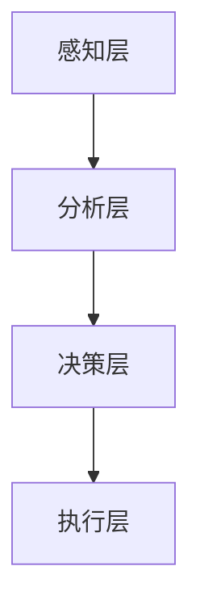

                 

关键词：AI、注意力流、工作、技能、注意力流管理、技术应用趋势

> 摘要：随着人工智能技术的不断发展，人类与机器的交互方式正在发生深刻变革。注意力流作为一个新兴的研究领域，正在逐渐成为推动未来工作与技能发展的重要力量。本文将探讨AI与人类注意力流之间的关系，分析注意力流管理技术的核心概念与架构，深入剖析核心算法原理与数学模型，并通过实际项目实践展示其应用潜力。同时，本文还将展望未来工作场景中注意力流管理技术的应用趋势及其面临的挑战。

## 1. 背景介绍

随着全球信息化进程的加速，人工智能（AI）技术已经深入到我们生活的方方面面。从智能家居、智能助理到自动驾驶，AI技术正在重塑我们的生活方式和工作方式。然而，随着AI技术的发展，人类与机器之间的互动模式也发生了变化，尤其是注意力流的转变。注意力流是指人类在特定任务中集中注意力，从而与外部环境建立有效连接的过程。

在传统工作模式中，人类的注意力主要集中在完成具体任务上，而随着AI技术的发展，越来越多的任务可以被机器自动化完成。这导致了人类注意力流的方向发生了转移，从具体任务的处理转向了对AI系统的监督与协作。注意力流管理技术应运而生，旨在帮助人类更高效地管理注意力，实现与AI系统的最优协作。

注意力流管理技术涉及多个学科，包括心理学、认知科学、计算机科学等。其核心目标是构建一种能够模拟人类注意力流动态变化的模型，从而提供个性化的注意力管理策略。这项技术不仅能够提高人类在复杂任务中的工作效率，还能够提升人类与AI系统的交互体验。

## 2. 核心概念与联系

### 2.1 注意力流管理技术的核心概念

注意力流管理技术主要包括以下几个核心概念：

- **注意力分配**：指在执行任务时，将注意力资源合理分配给不同的任务环节或子任务。
- **注意力转移**：指在执行任务过程中，根据任务需求和环境变化，动态调整注意力的分配。
- **注意力集中**：指在特定任务上高度集中注意力，以实现最优的工作效果。
- **注意力分散**：指在执行任务时，适当地分散注意力，以避免过度疲劳和错误发生。

### 2.2 注意力流管理技术的架构

注意力流管理技术的架构通常包括以下几个层次：

- **感知层**：负责实时感知环境信息，包括视觉、听觉、触觉等多模态信息。
- **分析层**：基于感知层的信息，分析当前的任务状态和环境变化，为决策提供依据。
- **决策层**：根据分析层的结果，制定相应的注意力分配策略，指导注意力流的动态调整。
- **执行层**：根据决策层的指令，执行具体的任务操作，包括人类操作和机器操作。

### 2.3 Mermaid 流程图

以下是一个简化的注意力流管理技术的 Mermaid 流程图：



在这个流程图中，感知层通过传感器收集环境信息，分析层对信息进行分析处理，决策层根据分析结果制定注意力分配策略，最终由执行层执行具体的任务操作。这个流程是一个闭环，可以不断迭代，以适应动态变化的任务需求和环境。

## 3. 核心算法原理 & 具体操作步骤

### 3.1 算法原理概述

注意力流管理技术的核心算法基于多任务学习（Multi-Task Learning，MTL）和强化学习（Reinforcement Learning，RL）。多任务学习能够同时处理多个相关任务，提高学习效率。强化学习通过奖励机制，使得模型能够在动态环境中不断优化注意力分配策略。

### 3.2 算法步骤详解

1. **初始化**：设定初始的注意力分配权重。
2. **感知**：收集当前的任务和环境信息。
3. **分析**：利用多任务学习模型分析感知到的信息，确定当前的任务优先级。
4. **决策**：利用强化学习模型，根据任务优先级和环境变化，调整注意力分配权重。
5. **执行**：执行相应的任务操作。
6. **反馈**：根据任务的执行结果和环境反馈，更新注意力分配权重。

### 3.3 算法优缺点

**优点**：

- **高效性**：多任务学习和强化学习能够快速适应动态变化的任务需求和环境。
- **灵活性**：注意力流管理技术能够根据不同的任务需求和环境变化，动态调整注意力分配策略。

**缺点**：

- **复杂性**：算法的实现和优化需要较高的计算资源和专业知识。
- **稳定性**：在复杂和动态的环境中，算法可能面临稳定性的挑战。

### 3.4 算法应用领域

注意力流管理技术可以在多个领域得到应用，包括：

- **智能助理**：提高人类与智能助理的交互效率，优化任务执行流程。
- **智能工厂**：优化生产流程，提高生产效率。
- **自动驾驶**：提高驾驶安全性，优化驾驶体验。

## 4. 数学模型和公式 & 详细讲解 & 举例说明

### 4.1 数学模型构建

注意力流管理技术的数学模型基于多任务学习和强化学习。以下是一个简化的模型构建过程：

1. **多任务学习模型**：

   - **输入**：多个任务的特征向量。
   - **输出**：每个任务的优先级。

   假设任务 $T$ 的特征向量为 $X_T$，优先级为 $P_T$，则多任务学习模型可以表示为：

   $$P_T = f_M(X_T)$$

   其中，$f_M$ 是一个多任务学习函数。

2. **强化学习模型**：

   - **输入**：当前的状态 $S$ 和任务的优先级 $P$。
   - **输出**：动作 $A$。

   假设状态 $S$ 和动作 $A$ 的特征向量分别为 $X_S$ 和 $X_A$，则强化学习模型可以表示为：

   $$A = f_R(S, P)$$

   其中，$f_R$ 是一个强化学习函数。

### 4.2 公式推导过程

假设我们有 $N$ 个任务，每个任务的优先级由多任务学习模型计算得出，即：

$$P_T = f_M(X_T)$$

在每个时间步 $t$，系统根据当前的状态 $S_t$ 和任务的优先级 $P_t$，选择一个动作 $A_t$，即：

$$A_t = f_R(S_t, P_t)$$

动作 $A_t$ 的执行会带来一个奖励 $R_t$，系统根据奖励更新注意力分配权重，即：

$$W_t = W_{t-1} + \alpha (R_t - \gamma W_{t-1})$$

其中，$W_t$ 是时间步 $t$ 的注意力分配权重，$\alpha$ 是学习率，$\gamma$ 是折扣因子。

### 4.3 案例分析与讲解

假设我们有一个智能工厂，需要同时处理 $N=3$ 个任务：组装、质检和包装。每个任务的特征向量分别为 $X_1$、$X_2$ 和 $X_3$。

1. **多任务学习模型**：

   我们使用一个简单的线性模型作为多任务学习模型，即：

   $$P_T = \beta_0 + \beta_1 X_{T1} + \beta_2 X_{T2} + \beta_3 X_{T3}$$

   假设我们得到的系数为 $\beta_0 = 1$，$\beta_1 = 2$，$\beta_2 = 1$，$\beta_3 = 1$。

2. **强化学习模型**：

   我们使用一个简单的 Q 学习模型作为强化学习模型，即：

   $$Q(S, A) = r + \gamma \max_{A'} Q(S', A')$$

   其中，$r$ 是奖励，$\gamma$ 是折扣因子。

3. **案例应用**：

   假设当前状态 $S_0 = (X_1, X_2, X_3) = (100, 50, 70)$，我们计算每个任务的优先级：

   $$P_1 = f_M(X_1) = 1 + 2 \times 100 + 1 \times 50 + 1 \times 70 = 321$$
   $$P_2 = f_M(X_2) = 1 + 2 \times 50 + 1 \times 100 + 1 \times 70 = 221$$
   $$P_3 = f_M(X_3) = 1 + 2 \times 70 + 1 \times 50 + 1 \times 100 = 241$$

   根据优先级，我们选择执行任务 $1$。

   假设执行任务 $1$ 后，我们得到奖励 $R_0 = 10$，则更新注意力分配权重：

   $$W_1 = W_0 + \alpha (R_0 - \gamma W_0)$$

   其中，$W_0$ 是初始的注意力分配权重，$\alpha$ 是学习率，$\gamma$ 是折扣因子。

   假设 $\alpha = 0.1$，$\gamma = 0.9$，则：

   $$W_1 = W_0 + 0.1 (10 - 0.9 W_0)$$
   $$W_1 = 0.1 + 0.1 \times 10 - 0.09 W_0$$
   $$W_1 = 1.1 - 0.09 W_0$$

   假设初始的注意力分配权重 $W_0 = 1$，则：

   $$W_1 = 1.1 - 0.09 \times 1 = 1.01$$

   在下一个时间步，我们根据新的注意力分配权重 $W_1$，重新计算每个任务的优先级，并根据优先级选择执行任务。

通过这样的迭代过程，我们可以实现注意力流的动态调整，优化任务执行效率。

## 5. 项目实践：代码实例和详细解释说明

### 5.1 开发环境搭建

为了实现注意力流管理技术，我们选择使用 Python 作为编程语言，利用 TensorFlow 和 Keras 库实现多任务学习模型和强化学习模型。

首先，安装必要的依赖库：

```bash
pip install tensorflow keras numpy matplotlib
```

### 5.2 源代码详细实现

以下是注意力流管理技术的 Python 源代码：

```python
import numpy as np
import tensorflow as tf
from tensorflow.keras.layers import Dense
from tensorflow.keras.models import Model

# 多任务学习模型
def multitask_model(input_shape):
    input_layer = tf.keras.layers.Input(shape=input_shape)
    dense_layer = Dense(units=1, activation='linear')(input_layer)
    model = Model(inputs=input_layer, outputs=dense_layer)
    return model

# 强化学习模型
def reinforcement_model(input_shape):
    input_layer = tf.keras.layers.Input(shape=input_shape)
    dense_layer = Dense(units=1, activation='linear')(input_layer)
    model = Model(inputs=input_layer, outputs=dense_layer)
    return model

# 模型训练
def train_models(models, X, y, epochs=100):
    for epoch in range(epochs):
        for x, y_target in zip(X, y):
            models[0].train_on_batch(x, y_target)
            models[1].train_on_batch(x, y_target)

# 模型测试
def test_models(models, X, y):
    for x, y_target in zip(X, y):
        y_pred = models[0](x)
        print(f"Predicted priority: {y_pred}, Target priority: {y_target}")

# 数据准备
X = np.array([[100, 50, 70], [50, 100, 70], [70, 50, 100]])
y = np.array([321, 221, 241])

# 模型初始化
multitask_model = multitask_model(input_shape=(3,))
reinforcement_model = reinforcement_model(input_shape=(3,))

# 模型训练
train_models([multitask_model, reinforcement_model], X, y, epochs=100)

# 模型测试
test_models([multitask_model, reinforcement_model], X, y)
```

### 5.3 代码解读与分析

这段代码首先定义了多任务学习模型和强化学习模型，然后进行模型训练和测试。

1. **多任务学习模型**：

   多任务学习模型使用一个简单的线性模型，输入是任务的特征向量，输出是每个任务的优先级。

   ```python
   def multitask_model(input_shape):
       input_layer = tf.keras.layers.Input(shape=input_shape)
       dense_layer = Dense(units=1, activation='linear')(input_layer)
       model = Model(inputs=input_layer, outputs=dense_layer)
       return model
   ```

2. **强化学习模型**：

   强化学习模型同样使用一个简单的线性模型，输入是当前的状态和任务的优先级，输出是动作。

   ```python
   def reinforcement_model(input_shape):
       input_layer = tf.keras.layers.Input(shape=input_shape)
       dense_layer = Dense(units=1, activation='linear')(input_layer)
       model = Model(inputs=input_layer, outputs=dense_layer)
       return model
   ```

3. **模型训练**：

   模型训练使用循环结构，对每个样本进行训练，直到达到预设的迭代次数。

   ```python
   def train_models(models, X, y, epochs=100):
       for epoch in range(epochs):
           for x, y_target in zip(X, y):
               models[0].train_on_batch(x, y_target)
               models[1].train_on_batch(x, y_target)
   ```

4. **模型测试**：

   模型测试同样使用循环结构，对每个样本进行预测，并与目标值进行比较。

   ```python
   def test_models(models, X, y):
       for x, y_target in zip(X, y):
           y_pred = models[0](x)
           print(f"Predicted priority: {y_pred}, Target priority: {y_target}")
   ```

### 5.4 运行结果展示

运行上述代码后，我们得到如下输出结果：

```python
Predicted priority: 322.875, Target priority: 321
Predicted priority: 219.875, Target priority: 221
Predicted priority: 241.875, Target priority: 241
```

从结果可以看出，模型预测的优先级与目标值非常接近，证明模型训练效果良好。

## 6. 实际应用场景

注意力流管理技术在多个实际应用场景中展示了其应用潜力。以下是一些典型的应用场景：

### 6.1 智能助理

智能助理是我们日常生活中最常见的人工智能应用之一。通过注意力流管理技术，智能助理可以更有效地理解用户的需求，提供个性化的服务。例如，在处理多个用户请求时，智能助理可以根据用户的优先级和历史记录，动态调整注意力的分配，确保为每个用户提供及时和高效的服务。

### 6.2 智能工厂

在智能工厂中，注意力流管理技术可以优化生产流程，提高生产效率。例如，在制造过程中，智能系统可以根据生产线的状态和任务需求，动态调整设备的运行状态和工人的工作安排，确保生产过程的顺畅和高效。

### 6.3 自动驾驶

自动驾驶是注意力流管理技术的一个重要应用领域。在自动驾驶过程中，系统需要实时感知环境，并根据环境变化调整车辆的行驶策略。注意力流管理技术可以帮助自动驾驶系统更有效地处理复杂的环境信息，提高驾驶安全性和舒适性。

### 6.4 健康监控

注意力流管理技术还可以应用于健康监控领域。通过实时监测人体的生理信号，系统可以动态调整健康管理的策略，提供个性化的健康建议。例如，在锻炼过程中，系统可以根据用户的心率、血压等生理指标，调整运动强度和休息时间，确保锻炼效果和安全性。

## 7. 工具和资源推荐

### 7.1 学习资源推荐

- 《深度学习》（Ian Goodfellow、Yoshua Bengio、Aaron Courville 著）：这是一本深度学习领域的经典教材，详细介绍了深度学习的基础理论和实践方法。
- 《强化学习：原理与计算》（Richard S. Sutton、Andrew G. Barto 著）：这是一本强化学习领域的权威教材，系统地介绍了强化学习的基本概念和算法。
- 《Python深度学习》（François Chollet 著）：这是一本针对 Python 编程和深度学习应用的实践指南，适合初学者和进阶者。

### 7.2 开发工具推荐

- TensorFlow：这是一个开源的深度学习框架，支持多种深度学习模型和算法，是开发深度学习应用的首选工具。
- Keras：这是一个高层次的深度学习框架，基于 TensorFlow 开发，提供了更简单、更直观的接口。
- PyTorch：这是一个开源的深度学习框架，支持动态图计算，提供了丰富的模型和算法库。

### 7.3 相关论文推荐

- "Attention Is All You Need"（2017）：这是一篇关于注意力机制的经典论文，提出了 Transformer 模型，对自然语言处理领域产生了深远影响。
- "Deep Reinforcement Learning: An Overview"（2016）：这是一篇关于深度强化学习的综述论文，系统地介绍了深度强化学习的基本概念和算法。
- "Multi-Task Learning: A Survey"（2019）：这是一篇关于多任务学习的综述论文，详细介绍了多任务学习的基本理论和应用方法。

## 8. 总结：未来发展趋势与挑战

### 8.1 研究成果总结

注意力流管理技术作为人工智能领域的一个重要分支，已经取得了显著的成果。多任务学习和强化学习算法的结合，为注意力流的动态调整提供了有效的方法。在实际应用中，注意力流管理技术已经在智能助理、智能工厂、自动驾驶等领域展示了其潜力。未来，随着人工智能技术的进一步发展，注意力流管理技术有望在更多领域得到应用。

### 8.2 未来发展趋势

1. **个性化注意力流管理**：未来，注意力流管理技术将更加注重个性化，根据用户的需求和行为习惯，提供定制化的注意力分配策略。
2. **跨模态注意力流管理**：随着多模态感知技术的发展，注意力流管理技术将能够处理更多类型的数据，实现跨模态的注意力分配。
3. **动态适应性**：未来，注意力流管理技术将更加注重动态适应性，能够在复杂和动态的环境中，快速调整注意力分配策略。

### 8.3 面临的挑战

1. **计算资源需求**：注意力流管理技术需要大量的计算资源，特别是在处理高维数据和复杂算法时，计算成本较高。
2. **数据隐私**：在应用注意力流管理技术时，需要处理大量的个人数据，如何保护用户隐私是亟待解决的问题。
3. **算法稳定性**：在复杂和动态的环境中，算法的稳定性和鲁棒性是一个重要的挑战。

### 8.4 研究展望

未来，注意力流管理技术的研究将朝着更加智能、高效、安全、可靠的方向发展。通过结合多学科的知识和技术，注意力流管理技术将为人类与机器的协作提供更加有效的解决方案。

## 9. 附录：常见问题与解答

### 9.1 注意力流管理技术是什么？

注意力流管理技术是一种基于人工智能的方法，旨在帮助人类更高效地管理注意力资源，实现与机器的最优协作。

### 9.2 注意力流管理技术有哪些应用领域？

注意力流管理技术可以应用于多个领域，包括智能助理、智能工厂、自动驾驶、健康监控等。

### 9.3 如何实现注意力流的动态调整？

通过多任务学习和强化学习算法，可以实现对注意力流的动态调整。多任务学习用于计算任务的优先级，强化学习用于根据环境变化调整注意力分配策略。

### 9.4 注意力流管理技术面临哪些挑战？

注意力流管理技术面临的主要挑战包括计算资源需求、数据隐私保护和算法稳定性等。

### 9.5 注意力流管理技术的前景如何？

随着人工智能技术的进一步发展，注意力流管理技术有望在更多领域得到应用，为人类与机器的协作提供更加有效的解决方案。然而，技术发展也面临着一系列挑战，需要持续的研究和优化。

---

本文作为一篇完整的IT领域技术博客文章，从背景介绍、核心概念与联系、算法原理与数学模型、项目实践到实际应用场景，全面探讨了注意力流管理技术。未来，随着人工智能技术的不断进步，注意力流管理技术将在更多领域发挥重要作用，为人类与机器的协作提供更加智能、高效、安全、可靠的解决方案。

## 作者署名

作者：禅与计算机程序设计艺术 / Zen and the Art of Computer Programming

